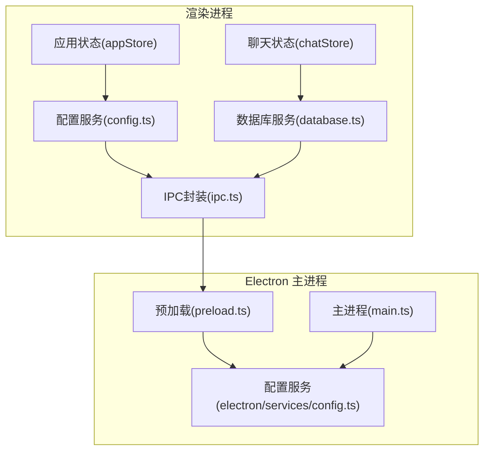
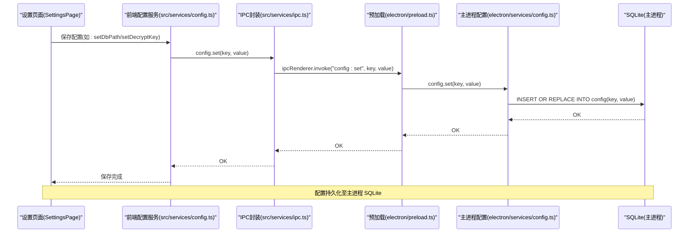
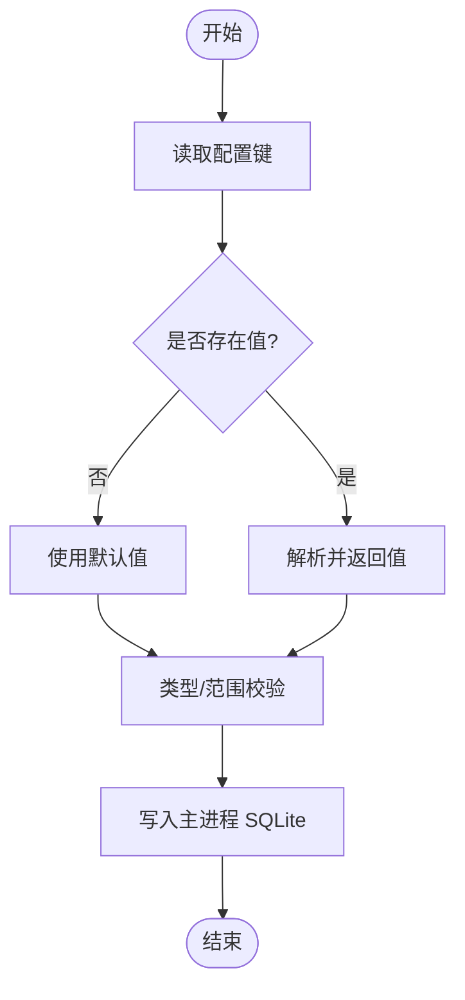
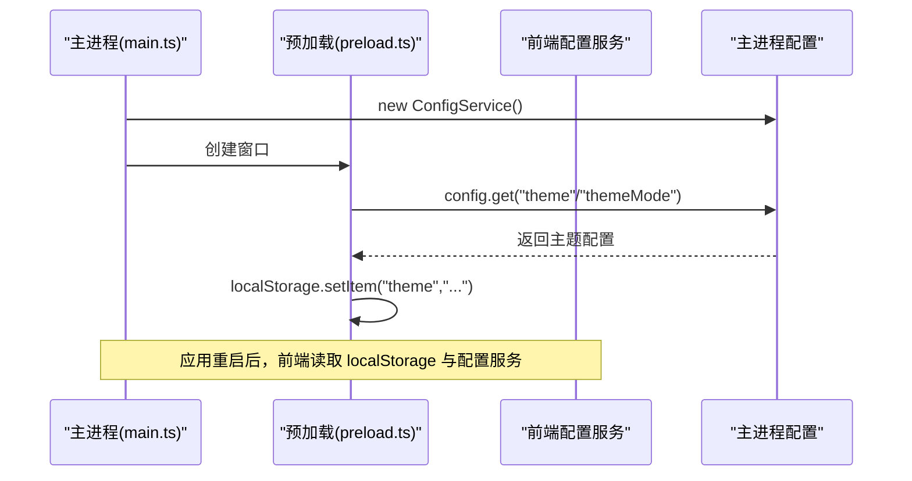
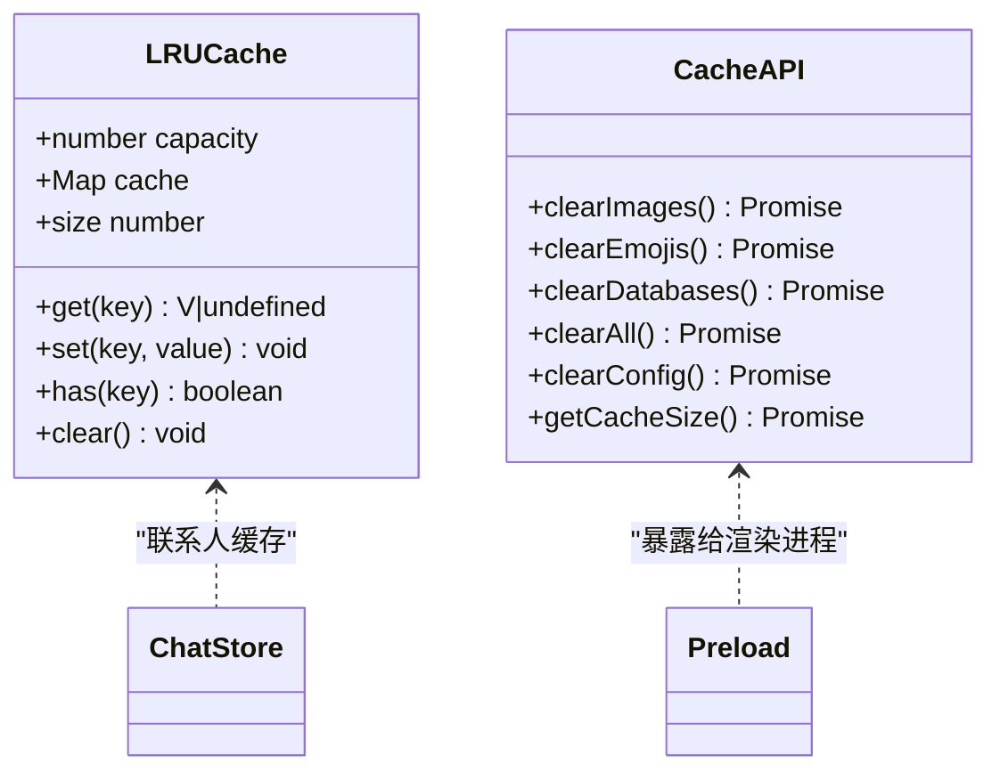
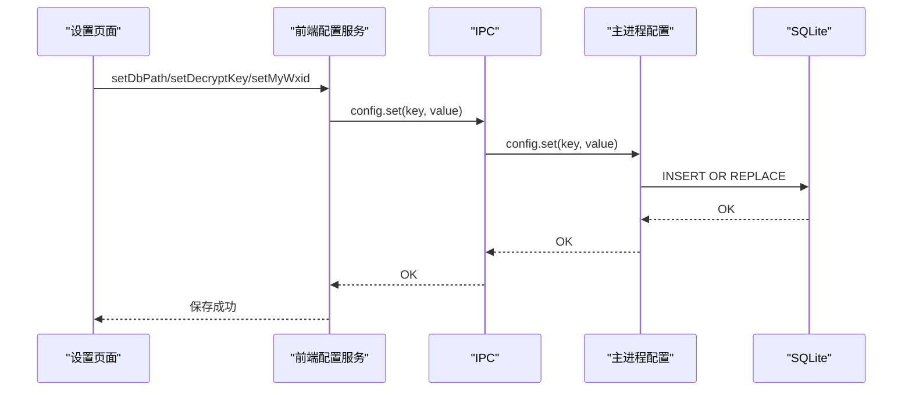
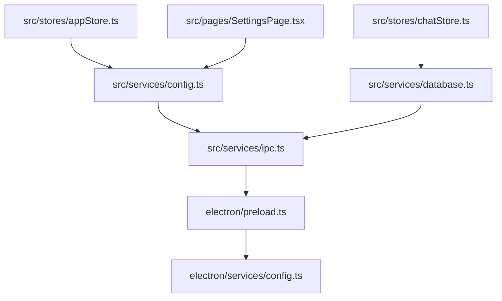

# 状态持久化策略

<cite>
**本文档引用的文件**
- [src/services/config.ts](file://src/services/config.ts)
- [electron/services/config.ts](file://electron/services/config.ts)
- [src/stores/appStore.ts](file://src/stores/appStore.ts)
- [src/stores/chatStore.ts](file://src/stores/chatStore.ts)
- [src/utils/lruCache.ts](file://src/utils/lruCache.ts)
- [src/services/database.ts](file://src/services/database.ts)
- [src/services/ipc.ts](file://src/services/ipc.ts)
- [electron/preload.ts](file://electron/preload.ts)
- [electron/main.ts](file://electron/main.ts)
- [src/pages/SettingsPage.tsx](file://src/pages/SettingsPage.tsx)
</cite>

## 目录
1. [简介](#简介)
2. [项目结构](#项目结构)
3. [核心组件](#核心组件)
4. [架构总览](#架构总览)
5. [详细组件分析](#详细组件分析)
6. [依赖关系分析](#依赖关系分析)
7. [性能考量](#性能考量)
8. [故障排查指南](#故障排查指南)
9. [结论](#结论)
10. [附录](#附录)

## 简介
本文件系统性梳理 CipherTalk 的状态持久化策略，覆盖以下方面：
- 配置持久化：用户设置保存、应用配置管理、默认值处理
- 状态恢复机制：应用重启恢复、异常恢复、数据迁移
- 缓存策略：内存缓存、磁盘缓存、缓存失效
- 数据安全：敏感数据处理、加密存储、访问控制
- 最佳实践：性能优化、存储空间管理、备份策略

目标是为开发者提供完整的实现指导与安全考虑。

## 项目结构
围绕状态持久化，项目采用“前端状态 + 配置服务 + Electron 主进程配置 + IPC 通信”的分层设计：
- 前端状态：使用 Zustand 管理应用运行时状态（如数据库连接、用户信息、加载状态、解密进度）
- 配置服务：封装 IPC 接口，统一提供配置读写能力
- Electron 主进程：通过 SQLite 存储配置，提供默认值、清理、迁移等能力
- 缓存策略：LRU 内存缓存 + 磁盘缓存（图片、语音、导出等）

图表来源
- [src/stores/appStore.ts:1-97](file://src/stores/appStore.ts#L1-L97)
- [src/stores/chatStore.ts:1-146](file://src/stores/chatStore.ts#L1-L146)
- [src/services/config.ts:1-574](file://src/services/config.ts#L1-L574)
- [src/services/database.ts:1-243](file://src/services/database.ts#L1-L243)
- [src/services/ipc.ts:1-38](file://src/services/ipc.ts#L1-L38)
- [electron/preload.ts:1-454](file://electron/preload.ts#L1-L454)
- [electron/services/config.ts:264-315](file://electron/services/config.ts#L264-L315)
- [electron/main.ts:1-800](file://electron/main.ts#L1-L800)

章节来源
- [src/services/config.ts:1-574](file://src/services/config.ts#L1-L574)
- [electron/services/config.ts:264-315](file://electron/services/config.ts#L264-L315)
- [src/stores/appStore.ts:1-97](file://src/stores/appStore.ts#L1-L97)
- [src/stores/chatStore.ts:1-146](file://src/stores/chatStore.ts#L1-L146)
- [src/services/database.ts:1-243](file://src/services/database.ts#L1-L243)
- [src/services/ipc.ts:1-38](file://src/services/ipc.ts#L1-L38)
- [electron/preload.ts:1-454](file://electron/preload.ts#L1-L454)
- [electron/main.ts:1-800](file://electron/main.ts#L1-L800)

## 核心组件
- 配置服务（前端）：提供键值读写、默认值处理、协议版本管理、AI 配置、HTTP API 配置、安全认证配置等
- 配置服务（主进程）：基于 SQLite 存储配置，提供默认值注入、批量获取、清理重置
- 应用状态（Zustand）：管理数据库连接、用户信息、加载与解密进度等运行时状态
- 聊天状态（Zustand）：管理会话列表、消息、联系人缓存、搜索关键字、同步版本等
- LRU 缓存：限制内存中缓存对象数量，防止内存泄漏
- 数据库服务：封装 IPC 调用，提供会话、联系人、消息查询等
- IPC 封装：统一暴露 config/db/decrypt/dialog/window 等接口
- 预加载桥接：在渲染进程暴露 electronAPI，支持主题同步与缓存同步

章节来源
- [src/services/config.ts:1-574](file://src/services/config.ts#L1-L574)
- [electron/services/config.ts:264-315](file://electron/services/config.ts#L264-L315)
- [src/stores/appStore.ts:1-97](file://src/stores/appStore.ts#L1-L97)
- [src/stores/chatStore.ts:1-146](file://src/stores/chatStore.ts#L1-L146)
- [src/utils/lruCache.ts:1-51](file://src/utils/lruCache.ts#L1-L51)
- [src/services/database.ts:1-243](file://src/services/database.ts#L1-L243)
- [src/services/ipc.ts:1-38](file://src/services/ipc.ts#L1-L38)
- [electron/preload.ts:438-454](file://electron/preload.ts#L438-L454)

## 架构总览
配置与状态的持久化流程如下：

图表来源
- [src/pages/SettingsPage.tsx:874-920](file://src/pages/SettingsPage.tsx#L874-L920)
- [src/services/config.ts:1-574](file://src/services/config.ts#L1-L574)
- [src/services/ipc.ts:1-38](file://src/services/ipc.ts#L1-L38)
- [electron/preload.ts:1-454](file://electron/preload.ts#L1-L454)
- [electron/services/config.ts:264-315](file://electron/services/config.ts#L264-L315)

## 详细组件分析

### 配置持久化与版本兼容
- 键名集中管理：前端配置服务定义了完整的配置键集合，涵盖数据库路径、主题、窗口边界、图片密钥、导出路径、协议版本、STT 语言与模型类型、HTTP API、安全认证、AI 摘要等
- 默认值与类型约束：每个配置项提供默认值与类型校验，确保读取时的健壮性
- 协议版本：维护 CURRENT_AGREEMENT_VERSION，并提供协议版本检查与接受逻辑，实现协议变更时的兼容与提示
- AI 配置兼容：支持旧字段兼容（如 baseUrl -> baseURL），并提供预设与当前配置的分离管理
- 主进程存储：主进程配置服务基于 SQLite 存储，提供默认值注入、批量获取、清理重置能力

图表来源
- [src/services/config.ts:1-574](file://src/services/config.ts#L1-L574)
- [electron/services/config.ts:264-315](file://electron/services/config.ts#L264-L315)

章节来源
- [src/services/config.ts:1-574](file://src/services/config.ts#L1-L574)
- [electron/services/config.ts:264-315](file://electron/services/config.ts#L264-L315)

### 状态恢复机制
- 应用重启恢复：主进程在窗口创建时初始化服务并读取配置；前端在预加载阶段同步主题到 localStorage，保证下次启动主题一致性
- 异常恢复：前端配置服务对读取异常进行兜底（返回默认值或空值），避免因配置损坏导致崩溃
- 数据迁移：协议版本变更时，通过 CURRENT_AGREEMENT_VERSION 与 getAgreementVersion/acceptCurrentAgreement 实现迁移提示与标记

图表来源
- [electron/main.ts:218-230](file://electron/main.ts#L218-L230)
- [electron/preload.ts:438-454](file://electron/preload.ts#L438-L454)
- [src/services/config.ts:1-574](file://src/services/config.ts#L1-L574)

章节来源
- [electron/main.ts:218-230](file://electron/main.ts#L218-L230)
- [electron/preload.ts:438-454](file://electron/preload.ts#L438-L454)
- [src/services/config.ts:1-574](file://src/services/config.ts#L1-L574)

### 缓存策略
- 内存缓存：LRU 缓存用于限制内存中缓存对象数量，防止内存泄漏；典型用于联系人等高频访问数据
- 磁盘缓存：图片、语音、导出等资源通过主进程服务进行缓存与清理；前端通过 electronAPI.cache 接口进行清理与统计
- 缓存失效：提供清理图片缓存、表情缓存、数据库缓存、全部缓存、配置缓存等能力；同时支持获取缓存大小

图表来源
- [src/utils/lruCache.ts:1-51](file://src/utils/lruCache.ts#L1-L51)
- [electron/preload.ts:350-357](file://electron/preload.ts#L350-L357)
- [src/stores/chatStore.ts:116-124](file://src/stores/chatStore.ts#L116-L124)

章节来源
- [src/utils/lruCache.ts:1-51](file://src/utils/lruCache.ts#L1-L51)
- [electron/preload.ts:350-357](file://electron/preload.ts#L350-L357)
- [src/stores/chatStore.ts:116-124](file://src/stores/chatStore.ts#L116-L124)

### 数据安全
- 敏感数据处理：前端配置服务提供解密密钥、图片 XOR/AES 密钥、HTTP API Token、Windows Hello 凭证 ID、密码哈希与盐值等敏感配置项
- 加密存储：主进程配置服务将敏感值以字符串形式存储于 SQLite；建议在主进程侧增加额外加密层（如基于平台的安全存储）
- 访问控制：通过 IPC 通道与上下文隔离，限制渲染进程直接访问底层存储；提供受控的配置读写接口

章节来源
- [src/services/config.ts:129-205](file://src/services/config.ts#L129-L205)
- [src/services/config.ts:321-365](file://src/services/config.ts#L321-L365)
- [electron/preload.ts:1-454](file://electron/preload.ts#L1-L454)

### 配置持久化与默认值处理
- 前端配置服务：提供 get/set 方法族，统一处理默认值与类型转换
- 主进程配置服务：提供默认值注入、批量获取、清理重置；所有配置写入 SQLite
- 设置页面：在保存配置时调用前端配置服务，并在成功后更新初始配置状态

图表来源
- [src/pages/SettingsPage.tsx:874-920](file://src/pages/SettingsPage.tsx#L874-L920)
- [src/services/config.ts:1-574](file://src/services/config.ts#L1-L574)
- [src/services/ipc.ts:1-38](file://src/services/ipc.ts#L1-L38)
- [electron/services/config.ts:264-315](file://electron/services/config.ts#L264-L315)

章节来源
- [src/pages/SettingsPage.tsx:874-920](file://src/pages/SettingsPage.tsx#L874-L920)
- [src/services/config.ts:1-574](file://src/services/config.ts#L1-L574)
- [src/services/ipc.ts:1-38](file://src/services/ipc.ts#L1-L38)
- [electron/services/config.ts:264-315](file://electron/services/config.ts#L264-L315)

### 状态恢复与异常恢复
- 应用重启：主进程在窗口创建时初始化服务并读取配置；预加载桥接同步主题到 localStorage
- 异常恢复：前端配置服务对读取异常进行兜底（返回默认值或空值），避免因配置损坏导致崩溃
- 数据迁移：协议版本变更时，通过 CURRENT_AGREEMENT_VERSION 与 getAgreementVersion/acceptCurrentAgreement 实现迁移提示与标记

章节来源
- [electron/main.ts:218-230](file://electron/main.ts#L218-L230)
- [electron/preload.ts:438-454](file://electron/preload.ts#L438-L454)
- [src/services/config.ts:254-274](file://src/services/config.ts#L254-L274)

## 依赖关系分析

图表来源
- [src/services/config.ts:1-574](file://src/services/config.ts#L1-L574)
- [src/services/ipc.ts:1-38](file://src/services/ipc.ts#L1-L38)
- [electron/preload.ts:1-454](file://electron/preload.ts#L1-L454)
- [electron/services/config.ts:264-315](file://electron/services/config.ts#L264-L315)
- [src/stores/appStore.ts:1-97](file://src/stores/appStore.ts#L1-L97)
- [src/stores/chatStore.ts:1-146](file://src/stores/chatStore.ts#L1-L146)
- [src/services/database.ts:1-243](file://src/services/database.ts#L1-L243)
- [src/pages/SettingsPage.tsx:874-920](file://src/pages/SettingsPage.tsx#L874-L920)

章节来源
- [src/services/config.ts:1-574](file://src/services/config.ts#L1-L574)
- [src/services/ipc.ts:1-38](file://src/services/ipc.ts#L1-L38)
- [electron/preload.ts:1-454](file://electron/preload.ts#L1-L454)
- [electron/services/config.ts:264-315](file://electron/services/config.ts#L264-L315)
- [src/stores/appStore.ts:1-97](file://src/stores/appStore.ts#L1-L97)
- [src/stores/chatStore.ts:1-146](file://src/stores/chatStore.ts#L1-L146)
- [src/services/database.ts:1-243](file://src/services/database.ts#L1-L243)
- [src/pages/SettingsPage.tsx:874-920](file://src/pages/SettingsPage.tsx#L874-L920)

## 性能考量
- 配置读写：前端配置服务对每个键提供独立的 get/set 方法，避免不必要的序列化；主进程 SQLite 使用 INSERT OR REPLACE，写入成本较低
- 状态管理：Zustand 作为轻量状态库，避免过度拆分导致的重复渲染；聊天状态使用 Map 存储联系人，提升查找效率
- 缓存策略：LRU 缓存限制内存占用；磁盘缓存通过清理接口主动释放空间
- IPC 通信：通过统一的 IPC 封装减少跨进程调用次数，提高稳定性

## 故障排查指南
- 配置读取失败：检查主进程 SQLite 是否可用；确认键名是否正确；查看前端配置服务的默认值兜底逻辑
- 配置写入失败：检查主进程配置服务的 set 方法是否抛出异常；确认数据库连接状态
- 主题不同步：确认预加载桥接是否成功将主题写入 localStorage；检查前端配置服务的 get 方法
- 缓存异常：使用 electronAPI.cache 接口清理相关缓存；监控缓存大小，避免磁盘空间不足

章节来源
- [electron/services/config.ts:264-315](file://electron/services/config.ts#L264-L315)
- [src/services/config.ts:1-574](file://src/services/config.ts#L1-L574)
- [electron/preload.ts:438-454](file://electron/preload.ts#L438-L454)
- [electron/preload.ts:350-357](file://electron/preload.ts#L350-L357)

## 结论
CipherTalk 的状态持久化策略通过“前端状态 + 配置服务 + 主进程 SQLite + IPC 通信”的架构实现了：
- 配置的可靠持久化与默认值处理
- 运行时状态的高效管理
- 缓存的内存与磁盘双层策略
- 敏感数据的受控访问与存储

建议在主进程侧引入更强的加密存储与审计机制，进一步提升安全性。

## 附录
- 最佳实践清单
  - 配置键名集中管理，避免硬编码
  - 写入配置时进行类型与范围校验
  - 定期清理磁盘缓存，监控缓存大小
  - 在主进程侧对敏感配置进行额外加密
  - 使用协议版本机制管理配置迁移
  - 通过 IPC 通道统一暴露配置接口，避免直接访问底层存储