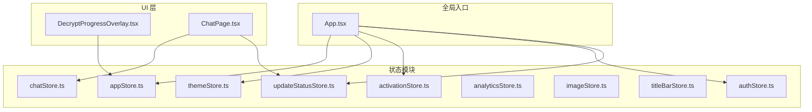
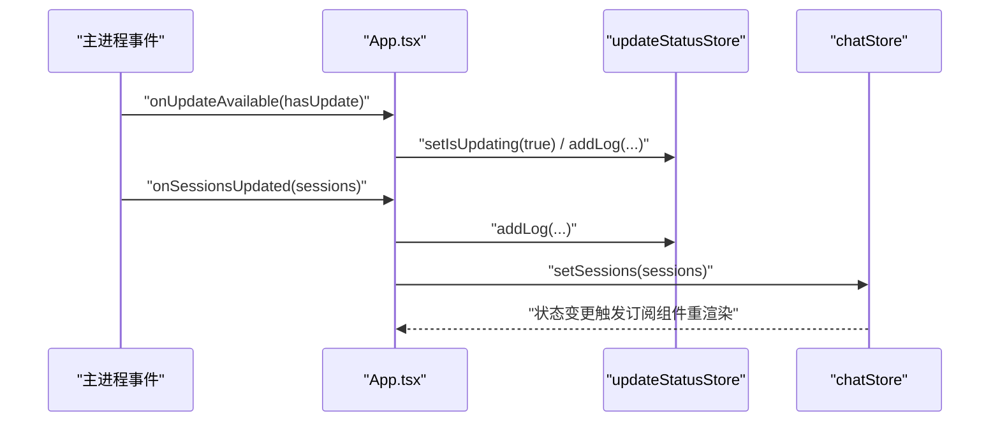
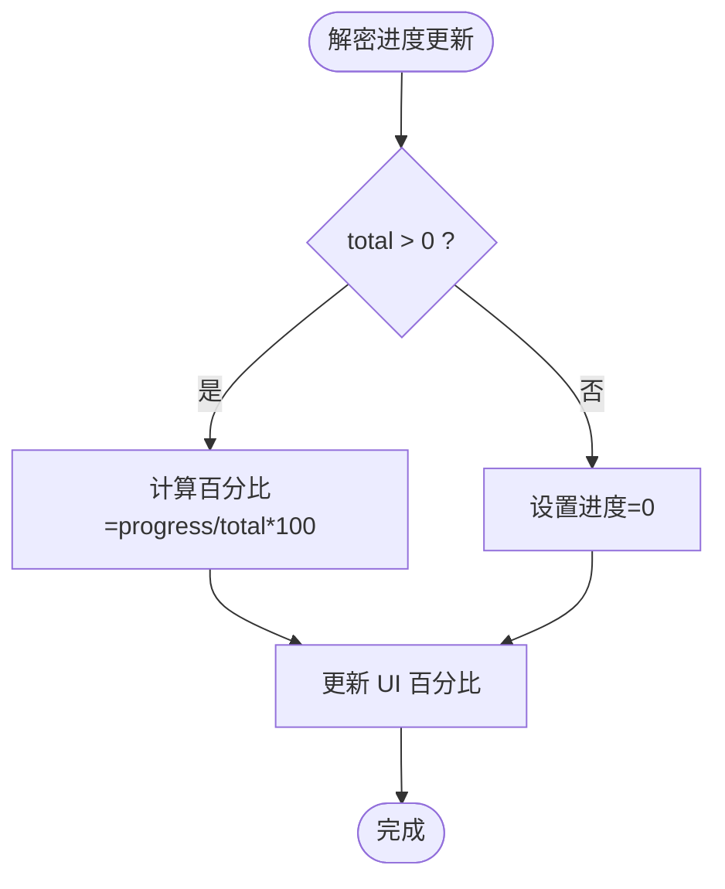
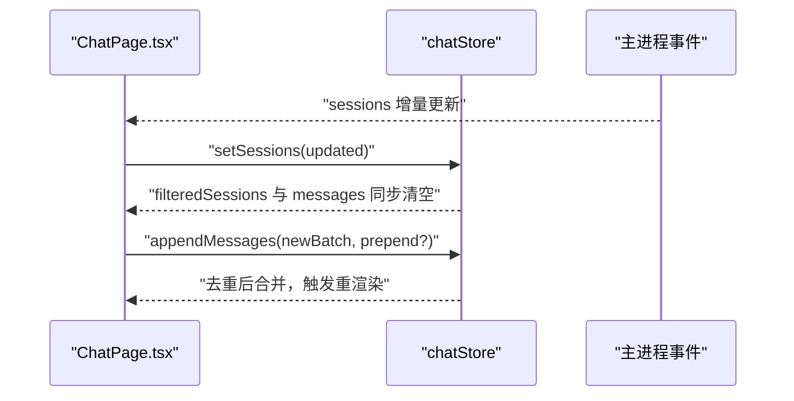
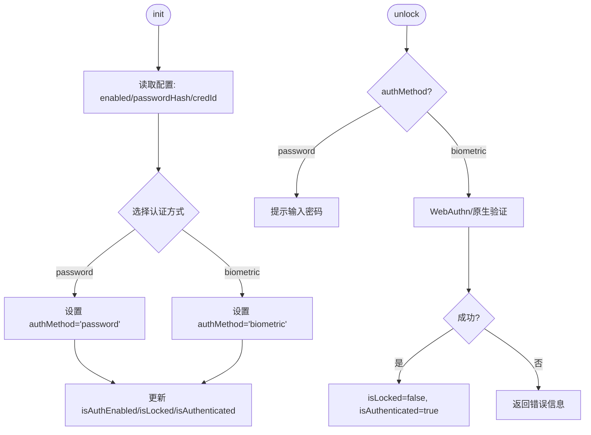
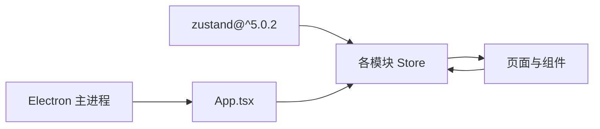

# 状态管理策略

<cite>
**本文引用的文件**
- [src/stores/appStore.ts](file://src/stores/appStore.ts)
- [src/stores/chatStore.ts](file://src/stores/chatStore.ts)
- [src/stores/authStore.ts](file://src/stores/authStore.ts)
- [src/stores/themeStore.ts](file://src/stores/themeStore.ts)
- [src/stores/activationStore.ts](file://src/stores/activationStore.ts)
- [src/stores/analyticsStore.ts](file://src/stores/analyticsStore.ts)
- [src/stores/imageStore.ts](file://src/stores/imageStore.ts)
- [src/stores/titleBarStore.ts](file://src/stores/titleBarStore.ts)
- [src/stores/updateStatusStore.ts](file://src/stores/updateStatusStore.ts)
- [src/App.tsx](file://src/App.tsx)
- [src/components/DecryptProgressOverlay.tsx](file://src/components/DecryptProgressOverlay.tsx)
- [src/pages/ChatPage.tsx](file://src/pages/ChatPage.tsx)
- [package.json](file://package.json)
</cite>

## 目录
1. [引言](#引言)
2. [项目结构](#项目结构)
3. [核心组件](#核心组件)
4. [架构总览](#架构总览)
5. [详细组件分析](#详细组件分析)
6. [依赖关系分析](#依赖关系分析)
7. [性能考量](#性能考量)
8. [故障排查指南](#故障排查指南)
9. [结论](#结论)
10. [附录](#附录)

## 引言
本文件系统性梳理 CipherTalk 的状态管理策略，聚焦基于 Zustand 的状态设计与实现。内容涵盖 Store 创建与类型定义、动作设计、状态设计模式（单状态树、分层与模块化）、跨组件共享与订阅机制、异步更新流程、持久化与恢复、调试与性能监控，以及最佳实践建议。目标是帮助前端开发者在复杂桌面应用中高效、可维护地组织与使用状态。

## 项目结构
- 状态集中于 src/stores 下，按功能模块拆分，每个模块导出一个 useXxxStore Hook，内部通过 create 定义状态与动作。
- 全局入口 App.tsx 在启动阶段加载主题、协议与激活状态，并监听来自 Electron 主进程的数据库更新事件，通过各 Store 的动作进行状态同步。
- 多个页面与组件通过 useXxxStore 订阅状态，实现跨组件共享与响应式更新。

图表来源
- [src/App.tsx:1-200](file://src/App.tsx#L1-L200)
- [src/stores/appStore.ts:1-97](file://src/stores/appStore.ts#L1-L97)
- [src/stores/themeStore.ts:1-146](file://src/stores/themeStore.ts#L1-L146)
- [src/stores/activationStore.ts:1-45](file://src/stores/activationStore.ts#L1-L45)
- [src/stores/authStore.ts:1-271](file://src/stores/authStore.ts#L1-L271)
- [src/stores/updateStatusStore.ts:1-28](file://src/stores/updateStatusStore.ts#L1-L28)
- [src/components/DecryptProgressOverlay.tsx:1-56](file://src/components/DecryptProgressOverlay.tsx#L1-L56)
- [src/pages/ChatPage.tsx:1-200](file://src/pages/ChatPage.tsx#L1-L200)

章节来源
- [src/App.tsx:1-200](file://src/App.tsx#L1-L200)
- [package.json:1-169](file://package.json#L1-L169)

## 核心组件
- appStore：应用级状态，包括数据库连接、用户信息、加载与解密进度等，提供重置与批量更新动作。
- chatStore：聊天会话与消息状态，支持会话列表、消息列表、联系人缓存、搜索与同步版本号等。
- authStore：认证状态与动作，支持密码与生物识别两种解锁方式，含初始化、启用、禁用、解锁、加锁等。
- themeStore：主题与图标状态，支持主题切换、模式切换、系统跟随、持久化保存与加载。
- activationStore：激活状态检查与缓存清理。
- analyticsStore：分析统计数据的承载与标记加载完成的动作。
- imageStore：图片扫描结果与统计，含质量判定与去重逻辑。
- titleBarStore：标题栏右侧内容动态注入。
- updateStatusStore：更新状态与日志队列，用于展示自动同步与更新进度。

章节来源
- [src/stores/appStore.ts:1-97](file://src/stores/appStore.ts#L1-L97)
- [src/stores/chatStore.ts:1-146](file://src/stores/chatStore.ts#L1-L146)
- [src/stores/authStore.ts:1-271](file://src/stores/authStore.ts#L1-L271)
- [src/stores/themeStore.ts:1-146](file://src/stores/themeStore.ts#L1-L146)
- [src/stores/activationStore.ts:1-45](file://src/stores/activationStore.ts#L1-L45)
- [src/stores/analyticsStore.ts:1-71](file://src/stores/analyticsStore.ts#L1-L71)
- [src/stores/imageStore.ts:1-174](file://src/stores/imageStore.ts#L1-L174)
- [src/stores/titleBarStore.ts:1-13](file://src/stores/titleBarStore.ts#L1-L13)
- [src/stores/updateStatusStore.ts:1-28](file://src/stores/updateStatusStore.ts#L1-L28)

## 架构总览
Zustand 在 CipherTalk 中采用“模块化 Store + 全局入口协调”的架构：
- 模块化：每个业务域一个 Store，职责单一，动作清晰，便于测试与演进。
- 全局协调：App.tsx 在启动时加载主题、协议与激活状态；监听主进程事件，将增量数据写入对应 Store，驱动 UI 自动更新。
- 跨组件共享：所有页面与组件通过 useXxxStore 订阅状态，实现跨组件状态共享与响应式渲染。

图表来源
- [src/App.tsx:136-168](file://src/App.tsx#L136-L168)
- [src/stores/updateStatusStore.ts:16-28](file://src/stores/updateStatusStore.ts#L16-L28)
- [src/stores/chatStore.ts:51-146](file://src/stores/chatStore.ts#L51-L146)

## 详细组件分析

### appStore：应用级状态与动作
- 状态设计：数据库连接、用户信息、加载与解密进度等，采用布尔、字符串、数值与对象组合，覆盖应用启动与运行关键指标。
- 动作设计：setDbConnected、setMyWxid、setUserInfo、setLoading、setDecrypting、updateDecryptProgress、reset 等，覆盖连接、用户、加载、解密全流程。
- 使用场景：全局解密进度 Overlay 通过订阅解密状态实现可视化反馈。

图表来源
- [src/components/DecryptProgressOverlay.tsx:1-56](file://src/components/DecryptProgressOverlay.tsx#L1-L56)
- [src/stores/appStore.ts:40-97](file://src/stores/appStore.ts#L40-L97)

章节来源
- [src/stores/appStore.ts:1-97](file://src/stores/appStore.ts#L1-L97)
- [src/components/DecryptProgressOverlay.tsx:1-56](file://src/components/DecryptProgressOverlay.tsx#L1-L56)

### chatStore：会话与消息状态
- 状态设计：连接状态、会话列表与过滤、当前会话、消息列表、联系人缓存、搜索关键字、同步版本号等。
- 动作设计：setConnected/setConnecting/setConnectionError、setSessions（支持函数式更新）、setCurrentSession、setMessages（函数式更新）、appendMessages（去重合并）、setContacts/addContact、setSearchKeyword、incrementSyncVersion、reset 等。
- 去重与增量：appendMessages 基于多维键去重，保证消息列表稳定增长；函数式 setMessages 避免竞态。

图表来源
- [src/pages/ChatPage.tsx:1-200](file://src/pages/ChatPage.tsx#L1-L200)
- [src/stores/chatStore.ts:51-146](file://src/stores/chatStore.ts#L51-L146)

章节来源
- [src/stores/chatStore.ts:1-146](file://src/stores/chatStore.ts#L1-L146)
- [src/pages/ChatPage.tsx:1-200](file://src/pages/ChatPage.tsx#L1-L200)

### authStore：认证与解锁
- 状态设计：是否启用认证、是否锁定、是否已认证、凭证 ID、认证方式（生物识别/密码）。
- 动作设计：init（从配置服务读取并确定方式）、enableAuth（优先原生 Windows Hello，回退 WebAuthn）、setupPassword/verifyPassword、disableAuth、unlock（原生或 WebAuthn）、lock/setLocked。
- 错误友好化：对 WebAuthn 常见错误进行用户可读映射，提升可用性。

图表来源
- [src/stores/authStore.ts:52-271](file://src/stores/authStore.ts#L52-L271)

章节来源
- [src/stores/authStore.ts:1-271](file://src/stores/authStore.ts#L1-L271)

### themeStore：主题与图标
- 状态设计：当前主题、主题模式（亮/暗/系统）、应用图标、加载完成标志。
- 动作设计：setTheme/setThemeMode/setAppIcon/toggleThemeMode/loadTheme（从 Electron 配置读取并应用），并在变更时持久化。
- 系统跟随：当模式为 system 时，监听媒体查询变化并动态切换。

章节来源
- [src/stores/themeStore.ts:1-146](file://src/stores/themeStore.ts#L1-L146)

### activationStore：激活状态
- 状态设计：当前激活状态、加载中、是否初始化。
- 动作设计：checkStatus（调用主进程 API 检查并初始化）、clearCache（清理缓存并重新检查）、setStatus。

章节来源
- [src/stores/activationStore.ts:1-45](file://src/stores/activationStore.ts#L1-L45)

### analyticsStore：分析数据
- 状态设计：统计聚合、排行榜、时间分布、加载完成标记与最后加载时间。
- 动作设计：setStatistics/setRankings/setTimeDistribution/markLoaded/clearCache。

章节来源
- [src/stores/analyticsStore.ts:1-71](file://src/stores/analyticsStore.ts#L1-L71)

### imageStore：图片扫描结果
- 状态设计：图片列表、目录列表、选中目录、扫描状态、错误信息、原图/缩略图/已解密数量统计。
- 动作设计：setDirectories/setSelectedDir/setScanning/setScanCompleted/setError/addImages/clearImages/updateImage/updateStats/reset。
- 质量判定：detectImageQuality 基于大小、文件名、路径层级综合判断原图/缩略图。

章节来源
- [src/stores/imageStore.ts:1-174](file://src/stores/imageStore.ts#L1-L174)

### titleBarStore：标题栏内容
- 状态设计：右侧内容节点。
- 动作设计：setRightContent。

章节来源
- [src/stores/titleBarStore.ts:1-13](file://src/stores/titleBarStore.ts#L1-L13)

### updateStatusStore：更新状态与日志
- 状态设计：是否更新中、日志队列（最多保留最近若干条）。
- 动作设计：setIsUpdating、addLog（带时间戳与去重截断）。

章节来源
- [src/stores/updateStatusStore.ts:1-28](file://src/stores/updateStatusStore.ts#L1-L28)

## 依赖关系分析
- Zustand 版本：项目依赖 zustand^5.0.2，具备 v5 的语法与特性支持。
- 模块间耦合：各 Store 低耦合，仅在 App.tsx 中通过 getState 直接写入少数 Store（如 updateStatusStore、chatStore），用于主进程事件驱动的全局同步；其余组件通过订阅 Hook 使用 Store。
- 外部集成：Electron API 通过 window.electronAPI 注入，用于主题持久化、激活状态检查、数据库更新监听等。

图表来源
- [package.json:56](file://package.json#L56)
- [src/App.tsx:1-200](file://src/App.tsx#L1-L200)

章节来源
- [package.json:1-169](file://package.json#L1-L169)
- [src/App.tsx:1-200](file://src/App.tsx#L1-L200)

## 性能考量
- 函数式更新：chatStore 的 setMessages 与 appendMessages 使用函数式更新，避免竞态与重复渲染。
- 去重与增量：消息去重基于复合键，减少无效渲染；会话切换时清空消息列表，避免历史数据干扰。
- 订阅粒度：组件按需订阅状态片段（如 useAppStore(state => state.isDbConnected)），降低无关重渲染。
- 大列表优化：ChatPage 对头像与列表项使用懒加载与虚拟化策略，结合 useMemo/useCallback 优化渲染成本。
- 状态体积控制：imageStore 的统计字段按需更新，避免频繁大对象变更。

## 故障排查指南
- 认证失败排查：authStore 对 WebAuthn 错误进行友好映射，优先检查浏览器兼容性、用户验证要求、平台 Authenticator 设置与超时。
- 主进程事件未触发：确认 App.tsx 中事件监听注册与移除逻辑正确，检查 window.electronAPI 的可用性。
- 状态未持久化：themeStore 的 setThemeMode/setAppIcon 依赖 Electron 配置 API，若失败需检查主进程配置服务与权限。
- 解密进度异常：检查 appStore 的 updateDecryptProgress 调用链与 UI 百分比计算逻辑。

章节来源
- [src/stores/authStore.ts:28-50](file://src/stores/authStore.ts#L28-L50)
- [src/App.tsx:136-168](file://src/App.tsx#L136-L168)
- [src/stores/themeStore.ts:85-111](file://src/stores/themeStore.ts#L85-L111)
- [src/components/DecryptProgressOverlay.tsx:1-56](file://src/components/DecryptProgressOverlay.tsx#L1-L56)

## 结论
CipherTalk 采用模块化的 Zustand 状态管理策略，围绕“单一职责 Store + 全局入口协调”的架构实现了高内聚、低耦合的状态体系。通过函数式更新、去重与增量策略、订阅粒度控制与主进程事件驱动，系统在复杂桌面场景下保持了良好的可维护性与性能表现。建议持续完善调试与持久化方案，进一步提升可观测性与用户体验。

## 附录

### 状态设计模式与最佳实践
- 单状态树设计：将相关状态收敛到单一 Store，避免分散在多个上下文或 Provider 中。
- 状态分层管理：将只读配置（如主题）与运行时状态（如会话、消息）分离，明确职责边界。
- 状态模块化：按业务域划分 Store，动作命名清晰，参数最小化，便于测试与演进。
- 订阅机制：组件按需订阅状态片段，避免全量订阅导致的过度重渲染。
- 异步更新：统一通过 Store 动作发起异步流程，必要时使用 getState 直接写入全局状态（如主进程事件驱动）。
- 持久化策略：对关键状态（主题、图标、激活状态）通过 Electron 配置服务持久化，启动时加载恢复。
- 调试与性能：结合 React DevTools Profiler 与 Zustand 内置日志能力，关注渲染热点与状态变更频率。