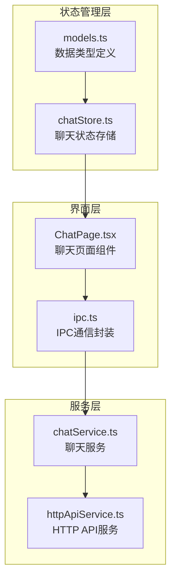
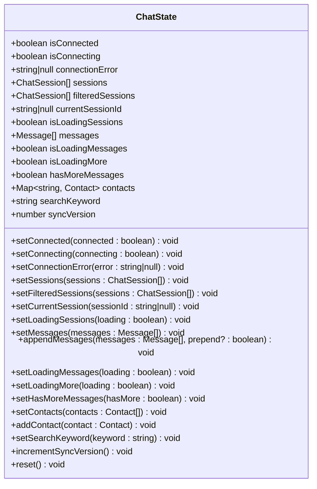
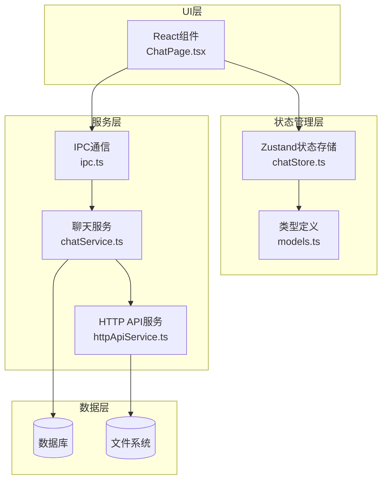
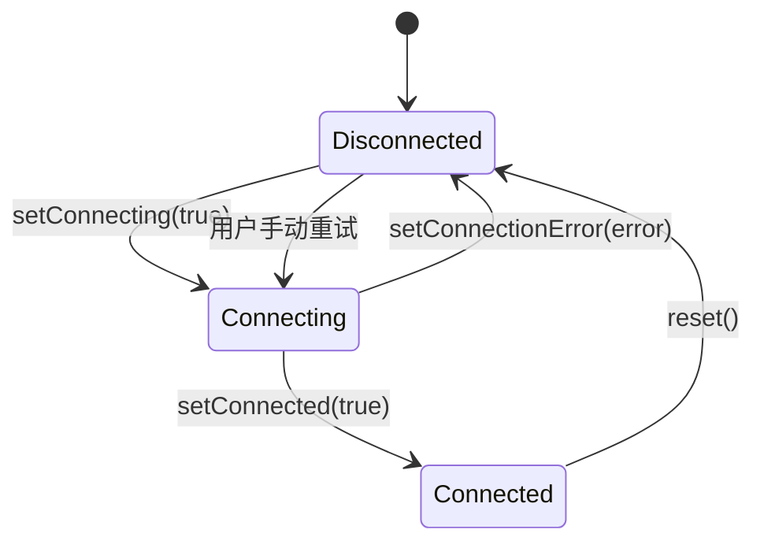
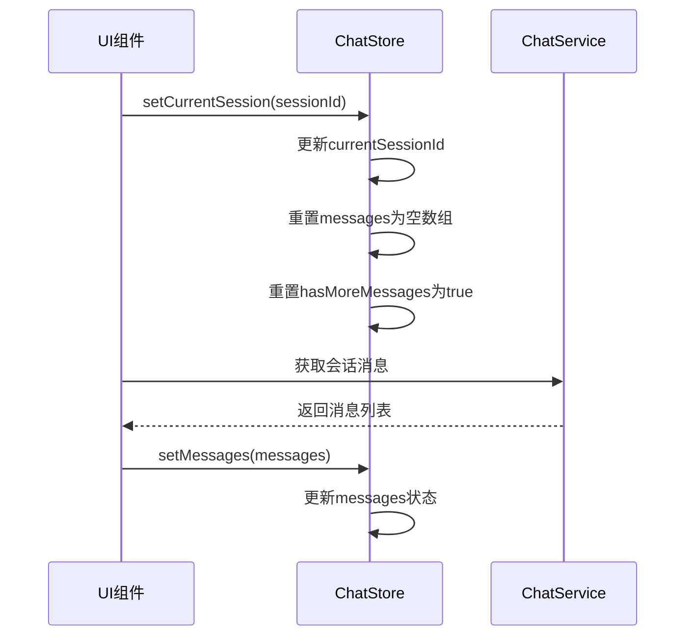
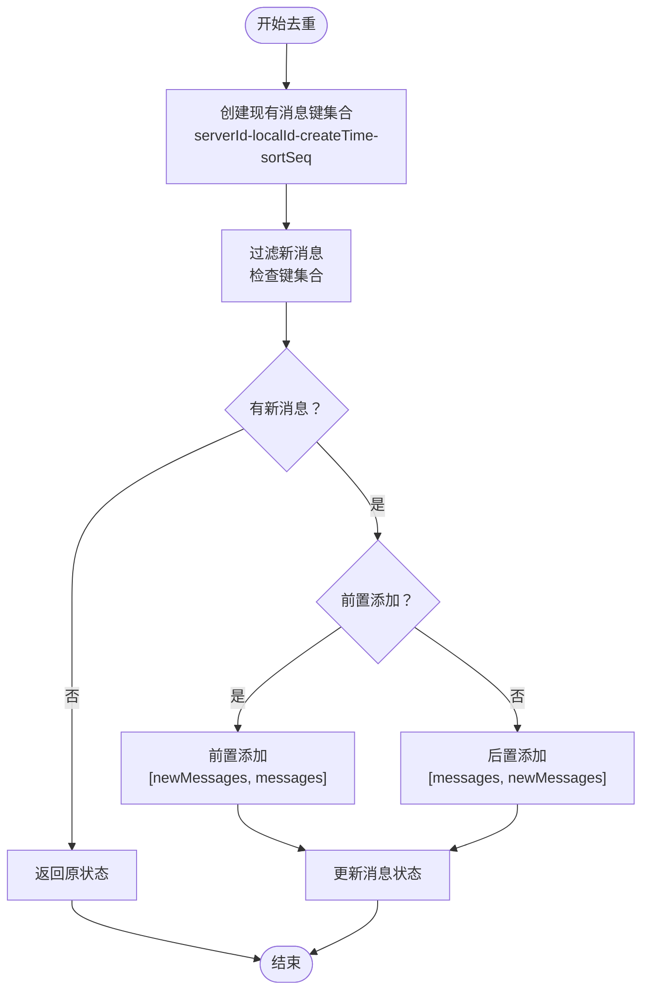
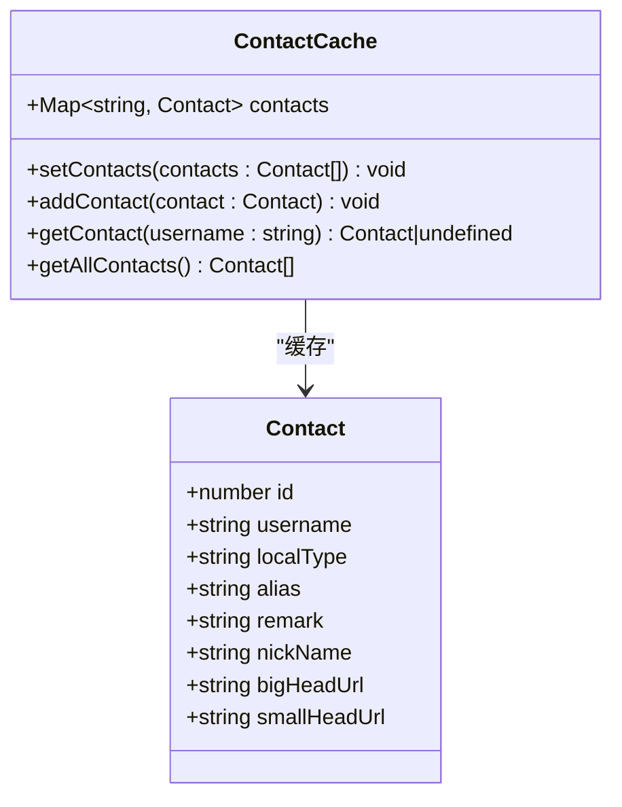
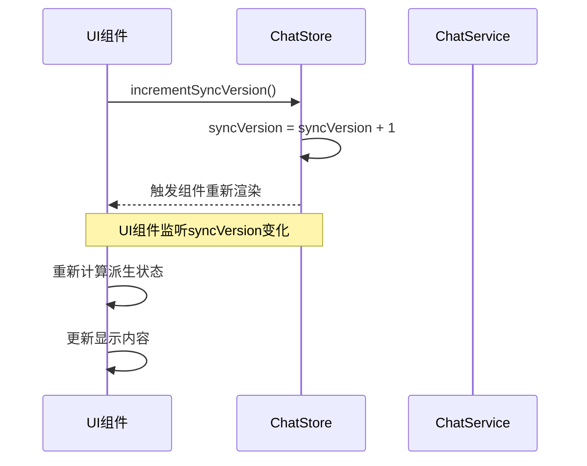
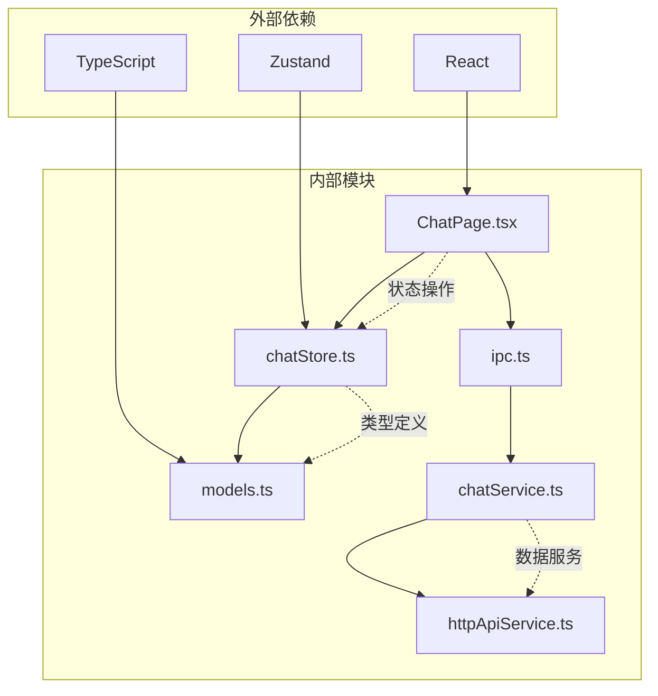

# 聊天状态管理

<cite>
**本文档引用的文件**
- [chatStore.ts](file://src/stores/chatStore.ts)
- [models.ts](file://src/types/models.ts)
- [ChatPage.tsx](file://src/pages/ChatPage.tsx)
- [ipc.ts](file://src/services/ipc.ts)
- [httpApiService.ts](file://electron/services/httpApiService.ts)
- [chatService.ts](file://electron/services/chatService.ts)
</cite>

## 目录
1. [简介](#简介)
2. [项目结构](#项目结构)
3. [核心组件](#核心组件)
4. [架构概览](#架构概览)
5. [详细组件分析](#详细组件分析)
6. [依赖关系分析](#依赖关系分析)
7. [性能考虑](#性能考虑)
8. [故障排除指南](#故障排除指南)
9. [结论](#结论)

## 简介

CipherTalk 的聊天状态管理系统是一个基于 Zustand 的状态管理解决方案，专门设计用于管理微信聊天应用中的复杂状态。该系统提供了完整的聊天状态生命周期管理，包括连接状态、会话管理、消息处理、联系人缓存和状态同步机制。

系统采用现代化的状态管理模式，通过类型安全的接口定义和高效的去重算法，确保在处理大量聊天数据时仍能保持良好的性能表现。

## 项目结构

聊天状态管理相关的文件组织如下：



**图表来源**
- [chatStore.ts:1-146](file://src/stores/chatStore.ts#L1-L146)
- [models.ts:1-109](file://src/types/models.ts#L1-L109)

**章节来源**
- [chatStore.ts:1-146](file://src/stores/chatStore.ts#L1-L146)
- [models.ts:1-109](file://src/types/models.ts#L1-L109)

## 核心组件

### 数据类型定义

系统定义了三个核心数据类型，构成了聊天状态管理的基础：

#### ChatSession 类型
```typescript
interface ChatSession {
  username: string
  type: number
  unreadCount: number
  summary: string
  sortTimestamp: number
  lastTimestamp: number
  lastMsgType: number
  displayName?: string
  avatarUrl?: string
}
```

#### Message 类型
```typescript
interface Message {
  localId: number
  serverId: number
  localType: number
  createTime: number
  sortSeq: number
  isSend: number | null
  senderUsername: string | null
  parsedContent: string
  // ... 其他消息属性
}
```

#### Contact 类型
```typescript
interface Contact {
  id: number
  username: string
  localType: number
  alias: string
  remark: string
  nickName: string
  bigHeadUrl: string
  smallHeadUrl: string
}
```

**章节来源**
- [models.ts:1-109](file://src/types/models.ts#L1-L109)

### 状态存储接口

聊天状态存储通过 Zustand 提供了一个完整的状态管理解决方案：



**图表来源**
- [chatStore.ts:4-49](file://src/stores/chatStore.ts#L4-L49)

**章节来源**
- [chatStore.ts:4-49](file://src/stores/chatStore.ts#L4-L49)

## 架构概览

聊天状态管理系统采用分层架构设计，各层职责明确：



**图表来源**
- [chatStore.ts:1-146](file://src/stores/chatStore.ts#L1-L146)
- [ChatPage.tsx:1-200](file://src/pages/ChatPage.tsx#L1-L200)
- [ipc.ts:1-38](file://src/services/ipc.ts#L1-L38)

## 详细组件分析

### 连接状态管理

连接状态管理是聊天系统的核心功能之一，负责维护与数据库的连接状态：

#### 状态字段
- `isConnected`: 表示是否已建立数据库连接
- `isConnecting`: 表示当前是否正在进行连接操作
- `connectionError`: 存储连接错误信息

#### 状态控制流程



**图表来源**
- [chatStore.ts:67-69](file://src/stores/chatStore.ts#L67-L69)

#### 连接状态操作

连接状态管理提供了以下操作方法：
- `setConnected(connected: boolean)`: 设置连接状态
- `setConnecting(connecting: boolean)`: 设置连接中状态
- `setConnectionError(error: string | null)`: 设置连接错误

**章节来源**
- [chatStore.ts:67-69](file://src/stores/chatStore.ts#L67-L69)

### 会话管理

会话管理模块负责处理聊天会话列表的显示和过滤：

#### 会话状态字段
- `sessions`: 完整的会话列表
- `filteredSessions`: 过滤后的会话列表
- `currentSessionId`: 当前选中的会话ID
- `isLoadingSessions`: 会话列表加载状态

#### 会话操作方法



**图表来源**
- [chatStore.ts:77-81](file://src/stores/chatStore.ts#L77-L81)
- [chatStore.ts:85-87](file://src/stores/chatStore.ts#L85-L87)

**章节来源**
- [chatStore.ts:71-87](file://src/stores/chatStore.ts#L71-L87)

### 消息管理

消息管理模块是最复杂的部分，包含了消息列表管理、去重逻辑和分页加载：

#### 消息状态字段
- `messages`: 当前会话的消息列表
- `isLoadingMessages`: 消息加载状态
- `isLoadingMore`: 更多消息加载状态
- `hasMoreMessages`: 是否还有更多消息

#### 去重算法

消息去重采用了多维键值策略，确保消息的唯一性：



**图表来源**
- [chatStore.ts:89-110](file://src/stores/chatStore.ts#L89-L110)

#### 分页加载机制

消息分页加载支持两种模式：

1. **标准分页模式**: 从指定偏移量开始加载
2. **日期跳跃模式**: 基于日期游标进行跳跃式加载

**章节来源**
- [chatStore.ts:89-110](file://src/stores/chatStore.ts#L89-L110)
- [ChatPage.tsx:508-540](file://src/pages/ChatPage.tsx#L508-L540)

### 联系人缓存

联系人缓存模块提供了高效的数据访问和管理能力：

#### 数据结构
- 使用 `Map<string, Contact>` 作为缓存容器
- 键为用户名，值为联系人对象

#### 缓存操作



**图表来源**
- [chatStore.ts:116-124](file://src/stores/chatStore.ts#L116-L124)

**章节来源**
- [chatStore.ts:116-124](file://src/stores/chatStore.ts#L116-L124)

### 状态同步机制

状态同步机制通过 `syncVersion` 字段实现了高效的 UI 增量更新：

#### 同步版本控制



**图表来源**
- [chatStore.ts:128](file://src/stores/chatStore.ts#L128)

#### 增量更新策略

系统采用以下增量更新策略：
- 使用 `syncVersion` 触发 UI 重新渲染
- 通过智能合并更新会话列表避免不必要的重绘
- 实现消息去重确保数据一致性

**章节来源**
- [chatStore.ts:128](file://src/stores/chatStore.ts#L128)
- [ChatPage.tsx:1201-1235](file://src/pages/ChatPage.tsx#L1201-L1235)

## 依赖关系分析

聊天状态管理系统与其他模块的依赖关系如下：



**图表来源**
- [chatStore.ts:1-2](file://src/stores/chatStore.ts#L1-L2)
- [ChatPage.tsx:1-13](file://src/pages/ChatPage.tsx#L1-L13)

**章节来源**
- [chatStore.ts:1-2](file://src/stores/chatStore.ts#L1-L2)
- [ChatPage.tsx:1-13](file://src/pages/ChatPage.tsx#L1-L13)

## 性能考虑

### 内存优化

1. **消息去重**: 使用 Set 数据结构进行 O(1) 时间复杂度的去重操作
2. **智能缓存**: 联系人信息使用 Map 结构，提供高效的查找性能
3. **状态分割**: 将不同类型的状态分离存储，减少不必要的重渲染

### 渲染优化

1. **虚拟列表**: 使用 react-window 实现消息列表的虚拟化渲染
2. **懒加载**: 头像和图片采用懒加载策略
3. **增量更新**: 通过 syncVersion 实现局部状态更新

### 数据流优化

1. **批量操作**: 支持批量消息添加和会话更新
2. **智能合并**: 合并更新会话列表时保持对象引用不变
3. **预加载机制**: 在滚动到顶部时预加载更多消息

## 故障排除指南

### 连接问题

**常见问题**: 连接数据库失败
**解决方法**: 
1. 检查数据库路径配置
2. 验证解密密钥是否正确
3. 确认数据库文件完整性

**章节来源**
- [chatStore.ts:67-69](file://src/stores/chatStore.ts#L67-L69)

### 消息重复

**常见问题**: 消息列表出现重复
**解决方法**:
1. 检查去重键的生成逻辑
2. 验证消息 ID 的唯一性
3. 确认时间戳的准确性

**章节来源**
- [chatStore.ts:89-110](file://src/stores/chatStore.ts#L89-L110)

### 性能问题

**常见问题**: 页面渲染缓慢
**解决方法**:
1. 检查虚拟列表的配置
2. 优化消息组件的渲染逻辑
3. 减少不必要的状态更新

**章节来源**
- [ChatPage.tsx:1742-1763](file://src/pages/ChatPage.tsx#L1742-L1763)

## 结论

CipherTalk 的聊天状态管理系统通过精心设计的架构和高效的实现策略，为复杂的聊天应用提供了可靠的状态管理解决方案。系统的主要特点包括：

1. **类型安全**: 完整的 TypeScript 类型定义确保编译时安全性
2. **高性能**: 优化的去重算法和缓存机制保证了良好的性能表现
3. **可扩展性**: 模块化的架构设计便于功能扩展和维护
4. **用户体验**: 智能的增量更新和虚拟化渲染提供了流畅的用户体验

该系统为开发者提供了清晰的开发指导，包括状态管理的最佳实践、性能优化技巧和故障排除方法，是构建高质量聊天应用的重要基础设施。