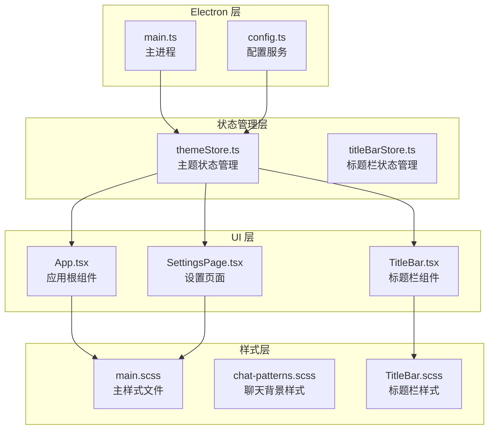
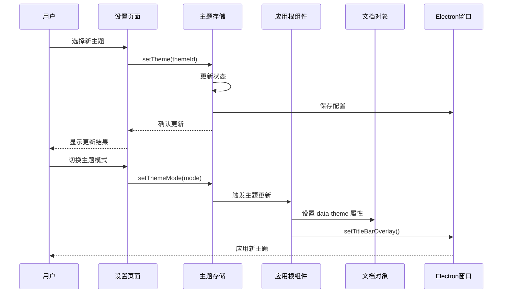
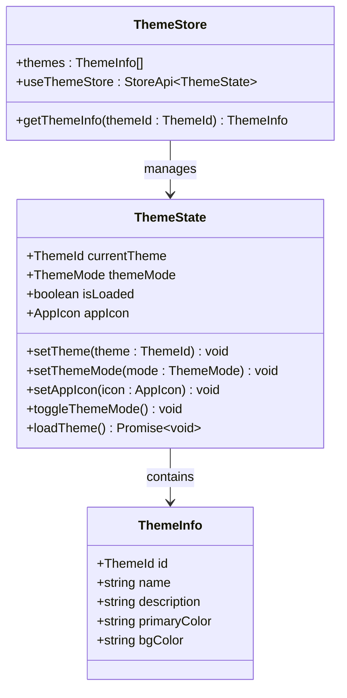
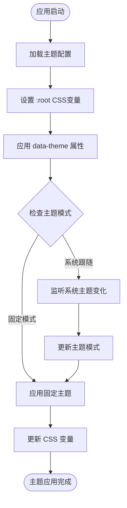
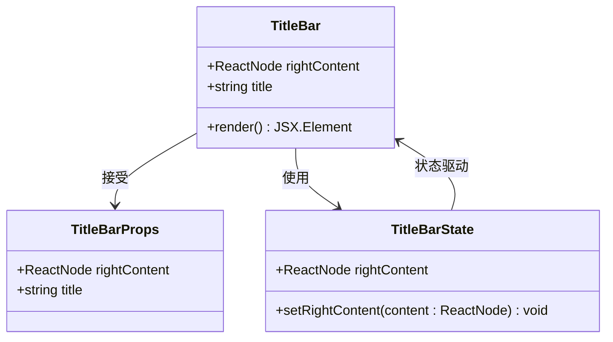
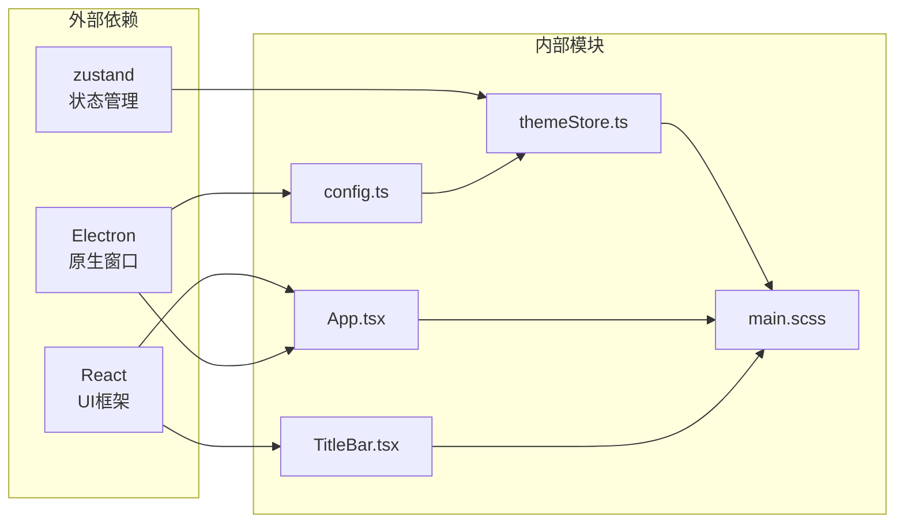

# 主题系统集成

<cite>
**本文档引用的文件**
- [themeStore.ts](file://src/stores/themeStore.ts)
- [App.tsx](file://src/App.tsx)
- [TitleBar.tsx](file://src/components/TitleBar.tsx)
- [TitleBar.scss](file://src/components/TitleBar.scss)
- [main.scss](file://src/styles/main.scss)
- [chat-patterns.scss](file://src/styles/chat-patterns.scss)
- [SettingsPage.tsx](file://src/pages/SettingsPage.tsx)
- [main.ts](file://electron/main.ts)
- [config.ts](file://src/services/config.ts)
- [titleBarStore.ts](file://src/stores/titleBarStore.ts)
</cite>

## 目录
1. [简介](#简介)
2. [项目结构](#项目结构)
3. [核心组件](#核心组件)
4. [架构概览](#架构概览)
5. [详细组件分析](#详细组件分析)
6. [依赖关系分析](#依赖关系分析)
7. [性能考虑](#性能考虑)
8. [故障排除指南](#故障排除指南)
9. [结论](#结论)

## 简介

CipherTalk 的主题系统集成了现代化的前端状态管理和 CSS 变量系统，提供了完整的主题切换体验。该系统支持多种主题色彩方案、深浅模式切换以及系统主题跟随功能，同时实现了标题栏主题集成和应用图标定制。

系统采用 Zustand 状态管理库实现主题状态的集中管理，结合 SCSS 变量和 CSS 自定义属性，实现了高效的动态主题切换。通过 Electron 的原生窗口覆盖功能，实现了与系统主题的深度集成。

## 项目结构

主题系统在项目中的组织结构如下：

**图表来源**
- [themeStore.ts:1-146](file://src/stores/themeStore.ts#L1-L146)
- [App.tsx:1-538](file://src/App.tsx#L1-L538)
- [main.ts:1-800](file://electron/main.ts#L1-L800)

**章节来源**
- [themeStore.ts:1-146](file://src/stores/themeStore.ts#L1-L146)
- [App.tsx:1-538](file://src/App.tsx#L1-L538)
- [main.ts:1-800](file://electron/main.ts#L1-L800)

## 核心组件

### 主题状态管理器 (themeStore)

主题状态管理器是整个主题系统的核心，负责管理主题 ID、主题模式和应用图标等状态信息。

**主要特性：**
- 支持 7 种主题色彩方案：云上舞白、刚玉蓝、冰猕猴桃汁绿、辛辣红、明水鸭色、新年快乐、樱雾粉
- 支持三种主题模式：浅色、深色、系统跟随
- 提供主题切换、模式切换和应用图标管理功能
- 集成持久化存储，自动保存和加载用户偏好

**章节来源**
- [themeStore.ts:1-146](file://src/stores/themeStore.ts#L1-L146)

### 应用根组件 (App.tsx)

应用根组件负责初始化主题系统，监听主题变化并应用到整个应用程序。

**核心功能：**
- 加载主题配置并初始化应用状态
- 处理系统主题跟随逻辑
- 应用 CSS 变量到根元素
- 集成 Electron 窗口覆盖功能

**章节来源**
- [App.tsx:40-88](file://src/App.tsx#L40-L88)

### 标题栏组件 (TitleBar)

标题栏组件实现了主题响应式设计，能够根据当前主题自动调整外观。

**设计特点：**
- 支持应用图标的动态切换
- 集成更新状态指示器
- 响应主题模式变化
- 支持自定义右侧内容区域

**章节来源**
- [TitleBar.tsx:1-52](file://src/components/TitleBar.tsx#L1-L52)

## 架构概览

主题系统的整体架构采用分层设计，实现了状态管理、样式应用和系统集成的分离：

**图表来源**
- [SettingsPage.tsx:923-949](file://src/pages/SettingsPage.tsx#L923-L949)
- [themeStore.ts:85-116](file://src/stores/themeStore.ts#L85-L116)
- [App.tsx:79-88](file://src/App.tsx#L79-L88)

## 详细组件分析

### 主题状态管理器实现

主题状态管理器使用 Zustand 库实现，提供了类型安全的状态管理：

**图表来源**
- [themeStore.ts:67-146](file://src/stores/themeStore.ts#L67-L146)

**章节来源**
- [themeStore.ts:1-146](file://src/stores/themeStore.ts#L1-L146)

### CSS 变量系统

系统采用 CSS 自定义属性实现动态主题切换，配合 SCSS 变量实现编译时优化：

**图表来源**
- [main.scss:4-43](file://src/styles/main.scss#L4-L43)
- [App.tsx:79-88](file://src/App.tsx#L79-L88)

**章节来源**
- [main.scss:1-427](file://src/styles/main.scss#L1-L427)
- [chat-patterns.scss:1-19](file://src/styles/chat-patterns.scss#L1-L19)

### 标题栏主题集成

标题栏组件实现了完整的主题响应式设计：

**图表来源**
- [TitleBar.tsx:8-17](file://src/components/TitleBar.tsx#L8-L17)
- [titleBarStore.ts:4-12](file://src/stores/titleBarStore.ts#L4-L12)

**章节来源**
- [TitleBar.tsx:1-52](file://src/components/TitleBar.tsx#L1-L52)
- [TitleBar.scss:1-112](file://src/components/TitleBar.scss#L1-L112)

### 设置页面主题控制

设置页面提供了完整的主题配置界面：

**章节来源**
- [SettingsPage.tsx:923-1064](file://src/pages/SettingsPage.tsx#L923-L1064)

## 依赖关系分析

主题系统的依赖关系清晰分离，实现了良好的模块化设计：

**图表来源**
- [themeStore.ts:1](file://src/stores/themeStore.ts#L1)
- [App.tsx:1](file://src/App.tsx#L1)
- [main.ts:1](file://electron/main.ts#L1)

**章节来源**
- [themeStore.ts:1-146](file://src/stores/themeStore.ts#L1-L146)
- [config.ts:1-574](file://src/services/config.ts#L1-L574)

## 性能考虑

主题系统在设计时充分考虑了性能优化：

### 渲染优化
- 使用 CSS 变量而非 JavaScript 动态修改样式属性
- 通过 data-attributes 标记实现选择器级样式切换
- 避免不必要的组件重新渲染

### 存储优化
- 异步保存主题配置，避免阻塞主线程
- 批量更新状态，减少渲染次数
- 懒加载主题资源

### 内存管理
- 及时清理媒体查询监听器
- 合理使用 React.memo 优化组件渲染
- 避免内存泄漏

## 故障排除指南

### 常见问题及解决方案

**主题切换无效**
1. 检查主题存储状态是否正确更新
2. 确认 CSS 变量是否正确应用到根元素
3. 验证 data-theme 属性是否设置

**系统主题跟随异常**
1. 检查媒体查询监听器是否正常工作
2. 确认 Electron 窗口覆盖配置正确
3. 验证系统主题变化事件是否触发

**样式闪烁问题**
1. 确保主题配置在应用启动早期加载
2. 检查 CSS 加载顺序
3. 验证主题切换动画是否正确实现

**章节来源**
- [themeStore.ts:118-139](file://src/stores/themeStore.ts#L118-L139)
- [App.tsx:61-88](file://src/App.tsx#L61-L88)

## 结论

CipherTalk 的主题系统通过精心设计的架构实现了高度的可定制性和良好的用户体验。系统的关键优势包括：

1. **模块化设计**：清晰的分层架构便于维护和扩展
2. **性能优化**：采用 CSS 变量和选择器优化实现高效渲染
3. **系统集成**：深度集成 Electron 窗口覆盖功能
4. **类型安全**：完整的 TypeScript 类型定义确保开发质量
5. **扩展性**：易于添加新的主题和功能

该主题系统为 CipherTalk 提供了强大的视觉定制能力，支持用户个性化需求，同时保持了优秀的性能表现和系统兼容性。