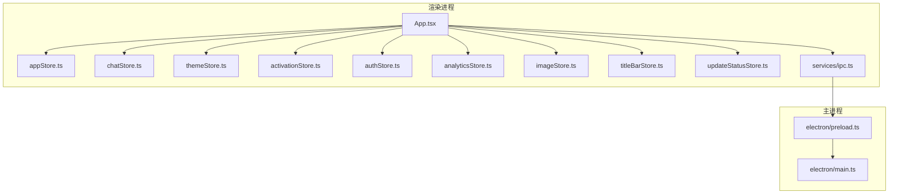
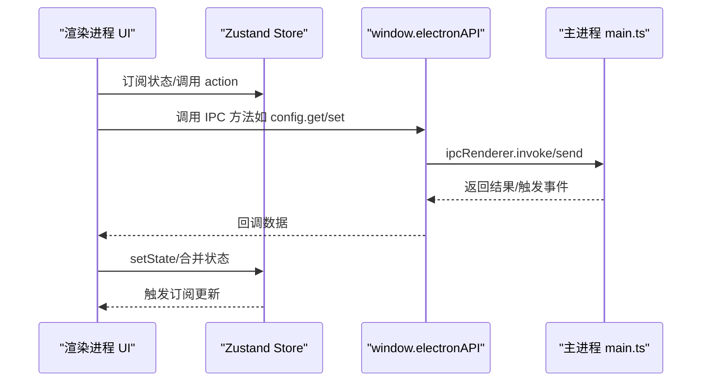
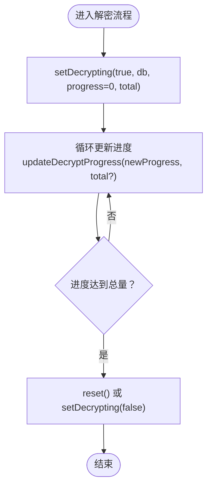
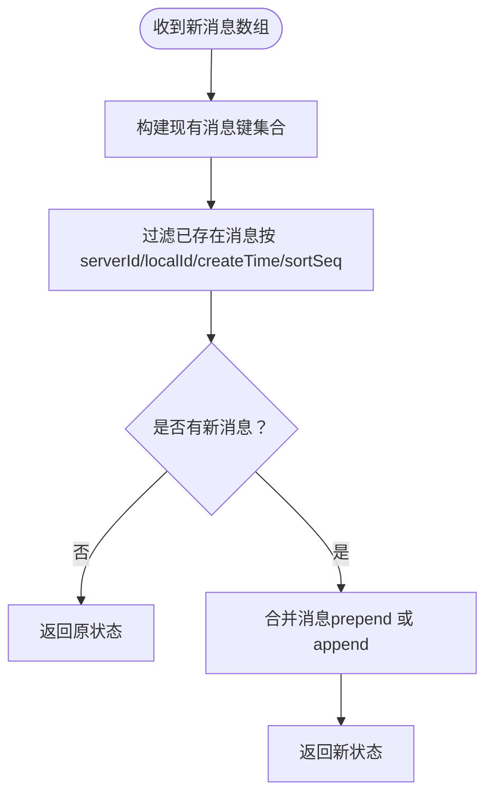
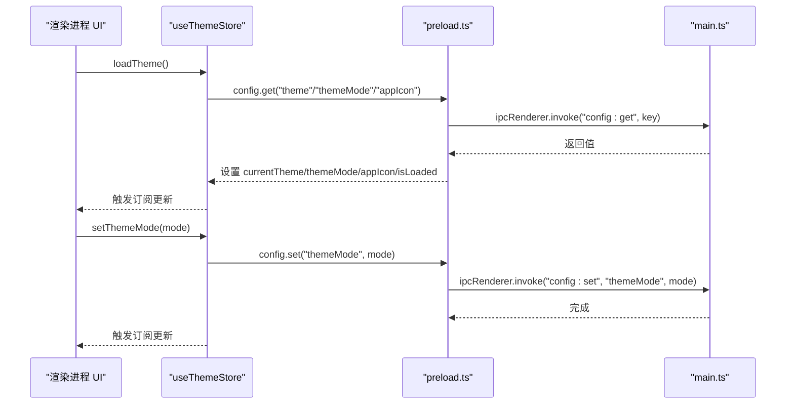
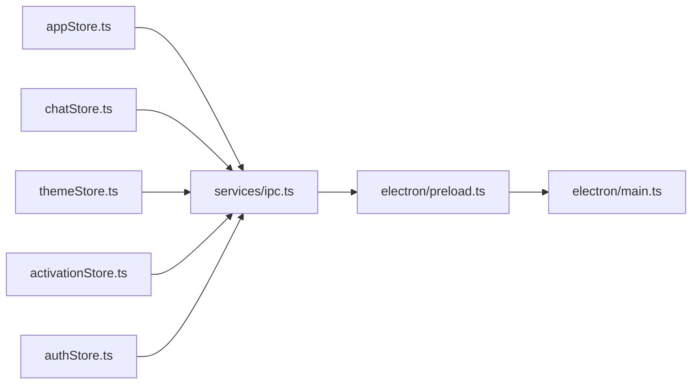

# 状态管理策略

<cite>
**本文引用的文件**   
- [src/stores/appStore.ts](file://src/stores/appStore.ts)
- [src/stores/chatStore.ts](file://src/stores/chatStore.ts)
- [src/stores/themeStore.ts](file://src/stores/themeStore.ts)
- [src/stores/activationStore.ts](file://src/stores/activationStore.ts)
- [src/stores/authStore.ts](file://src/stores/authStore.ts)
- [src/stores/analyticsStore.ts](file://src/stores/analyticsStore.ts)
- [src/stores/imageStore.ts](file://src/stores/imageStore.ts)
- [src/stores/titleBarStore.ts](file://src/stores/titleBarStore.ts)
- [src/stores/updateStatusStore.ts](file://src/stores/updateStatusStore.ts)
- [src/App.tsx](file://src/App.tsx)
- [src/services/ipc.ts](file://src/services/ipc.ts)
- [electron/main.ts](file://electron/main.ts)
- [electron/preload.ts](file://electron/preload.ts)
</cite>

## 目录
1. [引言](#引言)
2. [项目结构](#项目结构)
3. [核心组件](#核心组件)
4. [架构总览](#架构总览)
5. [详细组件分析](#详细组件分析)
6. [依赖关系分析](#依赖关系分析)
7. [性能考量](#性能考量)
8. [故障排查指南](#故障排查指南)
9. [结论](#结论)
10. [附录](#附录)

## 引言
本文件系统性梳理 CipherTalk 的状态管理策略，围绕 Zustand 状态库的使用模式展开，包括 store 的创建与配置、状态订阅机制、action 设计原则；并阐述多层状态管理架构（全局应用状态、聊天状态、主题状态、激活状态等）的职责划分与协作方式。同时，结合 Electron 主进程与渲染进程之间的 IPC 通信，说明状态同步机制与持久化策略，并总结状态管理的最佳实践与常见应用场景。

## 项目结构
- 状态存储集中于 src/stores 下，每个模块一个 store，职责清晰、边界明确。
- 渲染进程通过 window.electronAPI 与主进程交互，实现跨进程状态同步与持久化。
- App.tsx 作为顶层入口，统一初始化主题、认证、激活状态，并监听主进程推送的更新事件。

**图表来源**
- [src/App.tsx:1-200](file://src/App.tsx#L1-L200)
- [src/stores/appStore.ts:1-97](file://src/stores/appStore.ts#L1-L97)
- [src/stores/chatStore.ts:1-146](file://src/stores/chatStore.ts#L1-L146)
- [src/stores/themeStore.ts:1-146](file://src/stores/themeStore.ts#L1-L146)
- [src/stores/activationStore.ts:1-45](file://src/stores/activationStore.ts#L1-L45)
- [src/stores/authStore.ts:1-271](file://src/stores/authStore.ts#L1-L271)
- [src/stores/analyticsStore.ts:1-71](file://src/stores/analyticsStore.ts#L1-L71)
- [src/stores/imageStore.ts:1-174](file://src/stores/imageStore.ts#L1-L174)
- [src/stores/titleBarStore.ts:1-13](file://src/stores/titleBarStore.ts#L1-L13)
- [src/stores/updateStatusStore.ts:1-28](file://src/stores/updateStatusStore.ts#L1-L28)
- [src/services/ipc.ts:1-38](file://src/services/ipc.ts#L1-L38)
- [electron/main.ts:1-800](file://electron/main.ts#L1-L800)
- [electron/preload.ts:1-454](file://electron/preload.ts#L1-L454)

**章节来源**
- [src/App.tsx:1-200](file://src/App.tsx#L1-L200)
- [electron/main.ts:1-800](file://electron/main.ts#L1-L800)
- [electron/preload.ts:1-454](file://electron/preload.ts#L1-L454)

## 核心组件
- 全局应用状态（appStore）：维护数据库连接、用户信息、加载与解密进度等全局状态，提供统一的 set/reset 动作。
- 聊天状态（chatStore）：管理会话列表、消息列表、联系人缓存、搜索关键字、同步版本号等，提供增删改查与去重追加等动作。
- 主题状态（themeStore）：管理主题、主题模式、应用图标，支持异步持久化到主进程配置并通过 IPC 同步。
- 激活状态（activationStore）：封装激活状态查询、缓存清理、状态设置等动作，通过 IPC 与主进程交互。
- 认证状态（authStore）：封装生物识别与密码两种认证方式的启用、验证、锁定与解锁流程，支持原生 Windows Hello 与 WebAuthn。
- 分析与图片等辅助状态：analyticsStore、imageStore、titleBarStore、updateStatusStore 提供统计、图片扫描与解密、标题栏内容、更新日志等支撑能力。

**章节来源**
- [src/stores/appStore.ts:1-97](file://src/stores/appStore.ts#L1-L97)
- [src/stores/chatStore.ts:1-146](file://src/stores/chatStore.ts#L1-L146)
- [src/stores/themeStore.ts:1-146](file://src/stores/themeStore.ts#L1-L146)
- [src/stores/activationStore.ts:1-45](file://src/stores/activationStore.ts#L1-L45)
- [src/stores/authStore.ts:1-271](file://src/stores/authStore.ts#L1-L271)
- [src/stores/analyticsStore.ts:1-71](file://src/stores/analyticsStore.ts#L1-L71)
- [src/stores/imageStore.ts:1-174](file://src/stores/imageStore.ts#L1-L174)
- [src/stores/titleBarStore.ts:1-13](file://src/stores/titleBarStore.ts#L1-L13)
- [src/stores/updateStatusStore.ts:1-28](file://src/stores/updateStatusStore.ts#L1-L28)

## 架构总览
Zustand 在渲染进程中提供轻量、直观的状态管理；通过 Electron 的 contextBridge 暴露 window.electronAPI，将配置、数据库、解密、窗口控制、激活、分析、导出、语音转写、AI 摘要等能力以 IPC 形式桥接到主进程。主进程负责实际的系统调用与持久化，渲染进程通过 store 与 IPC 事件驱动 UI 更新。

**图表来源**
- [electron/preload.ts:1-454](file://electron/preload.ts#L1-L454)
- [electron/main.ts:1-800](file://electron/main.ts#L1-L800)
- [src/services/ipc.ts:1-38](file://src/services/ipc.ts#L1-L38)

## 详细组件分析

### 全局应用状态（appStore）
- 职责：统一管理数据库连接、用户信息、加载与解密进度等全局状态。
- 订阅机制：React 组件通过 useAppStore(state => state.xxx) 订阅局部状态，减少重渲染。
- 关键动作：setDbConnected、setMyWxid、setUserInfo、setLoading、setDecrypting、updateDecryptProgress、reset。
- 最佳实践：将“是否解密中”“当前解密数据库名”“进度/总量”拆分为独立字段，便于 UI 粒度展示与计算。

**图表来源**
- [src/stores/appStore.ts:40-95](file://src/stores/appStore.ts#L40-L95)

**章节来源**
- [src/stores/appStore.ts:1-97](file://src/stores/appStore.ts#L1-L97)

### 聊天状态（chatStore）
- 职责：维护会话列表、消息列表、联系人缓存、搜索与加载状态，以及“同步版本号”用于 UI 增量刷新。
- 订阅机制：支持函数式 setState，避免不必要的重渲染。
- 关键动作：setSessions（支持函数式更新）、appendMessages（基于多维键去重）、setMessages、setContacts/addContact、setSearchKeyword、incrementSyncVersion、reset。
- 性能要点：消息去重使用复合键集合过滤，避免重复渲染；支持 prepend 追加与尾部追加。

**图表来源**
- [src/stores/chatStore.ts:89-110](file://src/stores/chatStore.ts#L89-L110)

**章节来源**
- [src/stores/chatStore.ts:1-146](file://src/stores/chatStore.ts#L1-L146)

### 主题状态（themeStore）
- 职责：管理主题 ID、主题模式（浅色/深色/系统）、应用图标，支持异步持久化与加载。
- 订阅机制：组件通过 useThemeStore(state => state.xxx) 订阅主题与模式。
- 关键动作：setTheme、setThemeMode、setAppIcon、toggleThemeMode、loadTheme。
- 同步机制：loadTheme 从主进程配置读取主题与模式，set* 系列动作通过 IPC 写入配置并触发 UI 更新；同时 preload 中同步 localStorage 以备主窗口场景。

**图表来源**
- [src/stores/themeStore.ts:79-140](file://src/stores/themeStore.ts#L79-L140)
- [electron/preload.ts:438-453](file://electron/preload.ts#L438-L453)
- [electron/main.ts:1-800](file://electron/main.ts#L1-L800)

**章节来源**
- [src/stores/themeStore.ts:1-146](file://src/stores/themeStore.ts#L1-L146)
- [electron/preload.ts:1-454](file://electron/preload.ts#L1-L454)

### 激活状态（activationStore）
- 职责：封装激活状态检查、缓存清理与状态设置。
- 订阅机制：组件通过 useActivationStore(state => state.xxx) 订阅状态与加载标志。
- 关键动作：checkStatus（异步）、clearCache（异步）、setStatus。
- 与主进程交互：通过 window.electronAPI.activation.* IPC 调用主进程激活服务。

**章节来源**
- [src/stores/activationStore.ts:1-45](file://src/stores/activationStore.ts#L1-L45)

### 认证状态（authStore）
- 职责：支持 Windows Hello 原生验证与 WebAuthn 两种认证方式，提供启用、禁用、设置密码、验证密码、解锁、锁定等动作。
- 订阅机制：组件通过 useAuthStore(state => state.xxx) 订阅认证状态。
- 关键动作：init、enableAuth、setupPassword、verifyPassword、unlock、lock、disableAuth。
- 与主进程交互：优先使用原生 Windows Hello（若可用），否则回退到 WebAuthn；所有状态变更通过配置服务持久化。

**章节来源**
- [src/stores/authStore.ts:1-271](file://src/stores/authStore.ts#L1-L271)

### 辅助状态
- analyticsStore：统计、排行、时间分布等分析数据的承载与缓存标记。
- imageStore：图片扫描、目录选择、质量检测、解密状态统计与更新。
- titleBarStore：标题栏右侧内容动态注入。
- updateStatusStore：更新状态与日志队列（保留最近若干条）。

**章节来源**
- [src/stores/analyticsStore.ts:1-71](file://src/stores/analyticsStore.ts#L1-L71)
- [src/stores/imageStore.ts:1-174](file://src/stores/imageStore.ts#L1-L174)
- [src/stores/titleBarStore.ts:1-13](file://src/stores/titleBarStore.ts#L1-L13)
- [src/stores/updateStatusStore.ts:1-28](file://src/stores/updateStatusStore.ts#L1-L28)

## 依赖关系分析
- 渲染进程依赖：
  - Zustand store：提供状态与动作。
  - window.electronAPI：通过 preload 暴露的 IPC 接口。
  - services/ipc.ts：对常用 IPC 的封装，简化调用。
- 主进程依赖：
  - 各类服务（数据库、解密、激活、分析、导出、语音转写、AI 等）实现具体业务。
  - preload 将 ipcMain 事件映射为 ipcRenderer.invoke/send，形成稳定的 IPC 协议。

**图表来源**
- [src/stores/appStore.ts:1-97](file://src/stores/appStore.ts#L1-L97)
- [src/stores/chatStore.ts:1-146](file://src/stores/chatStore.ts#L1-L146)
- [src/stores/themeStore.ts:1-146](file://src/stores/themeStore.ts#L1-L146)
- [src/stores/activationStore.ts:1-45](file://src/stores/activationStore.ts#L1-L45)
- [src/stores/authStore.ts:1-271](file://src/stores/authStore.ts#L1-L271)
- [src/services/ipc.ts:1-38](file://src/services/ipc.ts#L1-L38)
- [electron/preload.ts:1-454](file://electron/preload.ts#L1-L454)
- [electron/main.ts:1-800](file://electron/main.ts#L1-L800)

**章节来源**
- [src/services/ipc.ts:1-38](file://src/services/ipc.ts#L1-L38)
- [electron/preload.ts:1-454](file://electron/preload.ts#L1-L454)
- [electron/main.ts:1-800](file://electron/main.ts#L1-L800)

## 性能考量
- 函数式 setState：在 chatStore 中，setSessions 与 setMessages 支持传入函数式更新，避免竞态与重复渲染。
- 局部订阅：通过 useStore(state => state.xxx) 订阅局部状态，降低无关更新带来的重渲染成本。
- 去重与增量：chatStore 的 appendMessages 使用复合键去重，避免重复消息导致的 UI 抖动与性能浪费。
- 事件节流：updateStatusStore 仅保留最近若干条日志，避免无限增长。
- 异步持久化：themeStore 与 authStore 的 set* 动作采用异步 IPC，避免阻塞 UI 线程。
- 主题与系统模式：themeStore 在系统模式下监听媒体查询变化，动态切换，避免频繁强制刷新。

[本节为通用性能建议，不直接分析特定文件]

## 故障排查指南
- 主题加载失败：检查 preload 中 config.get 的返回值与异常捕获，确认主进程配置服务正常工作。
- 激活状态检查失败：查看 activationStore 的 checkStatus 流程与错误日志，确认 IPC 调用链路。
- 认证失败：区分原生 Windows Hello 与 WebAuthn 路径，查看 friendly 错误映射与返回信息。
- 数据库解密进度不同步：核对 appStore 的 setDecrypting 与 updateDecryptProgress 调用时机，确保主进程事件正确推送。
- 自动更新监听无效：确认 App.tsx 中对主进程事件的监听注册与移除逻辑，避免重复监听或提前移除。

**章节来源**
- [src/stores/themeStore.ts:118-139](file://src/stores/themeStore.ts#L118-L139)
- [src/stores/activationStore.ts:20-33](file://src/stores/activationStore.ts#L20-L33)
- [src/stores/authStore.ts:29-50](file://src/stores/authStore.ts#L29-L50)
- [src/App.tsx:136-168](file://src/App.tsx#L136-L168)

## 结论
CipherTalk 的状态管理以 Zustand 为核心，结合 Electron IPC 实现跨进程状态同步与持久化。通过清晰的 store 职责划分、函数式 setState、局部订阅与异步动作，既保证了开发体验，也兼顾了性能与可维护性。建议在后续迭代中持续完善 store 的边界与命名规范，补充必要的中间件与日志埋点，进一步提升可观测性与扩展性。

## 附录
- 实际应用场景示例（以路径代替代码片段）：
  - 初始化主题与认证：[src/App.tsx:61-67](file://src/App.tsx#L61-L67)
  - 监听数据库更新并同步会话：[src/App.tsx:142-161](file://src/App.tsx#L142-L161)
  - 设置主题模式并持久化：[src/stores/themeStore.ts:94-101](file://src/stores/themeStore.ts#L94-L101)
  - 启用认证（Windows Hello 优先）：[src/stores/authStore.ts:91-153](file://src/stores/authStore.ts#L91-L153)
  - 图片扫描与统计更新：[src/stores/imageStore.ts:102-160](file://src/stores/imageStore.ts#L102-L160)