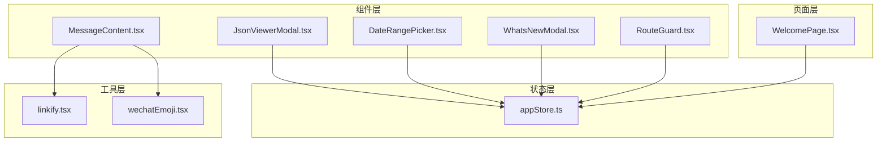
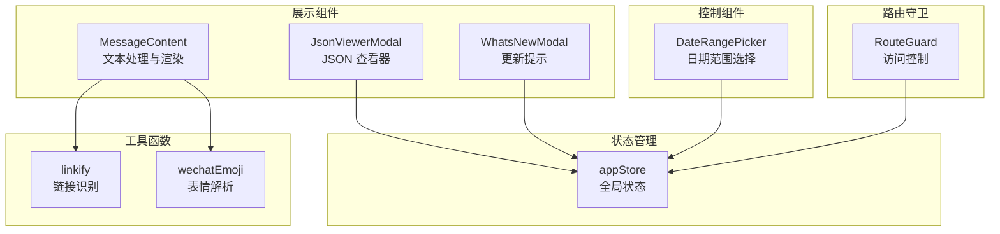
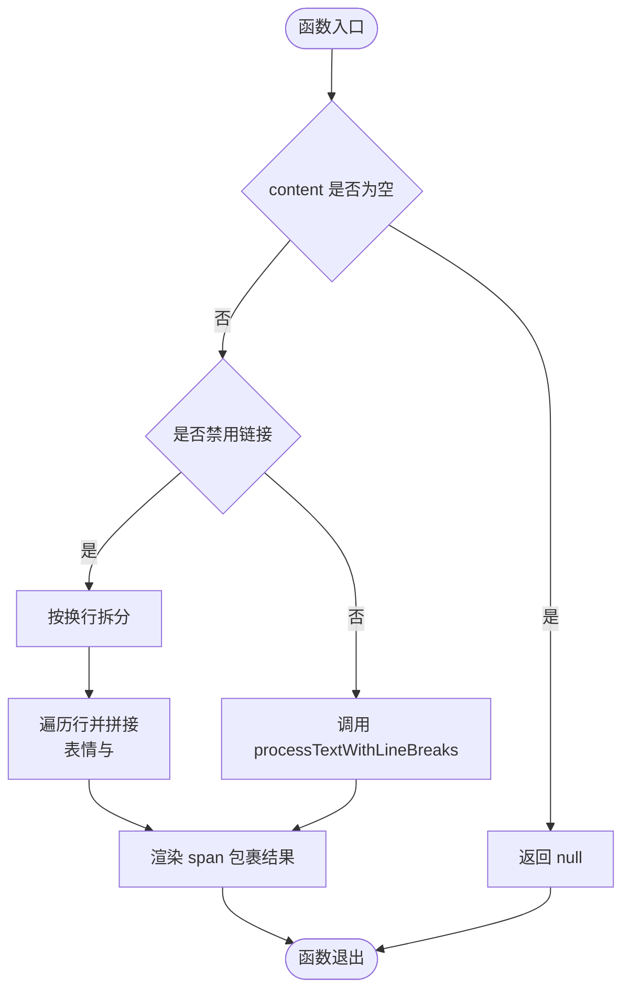
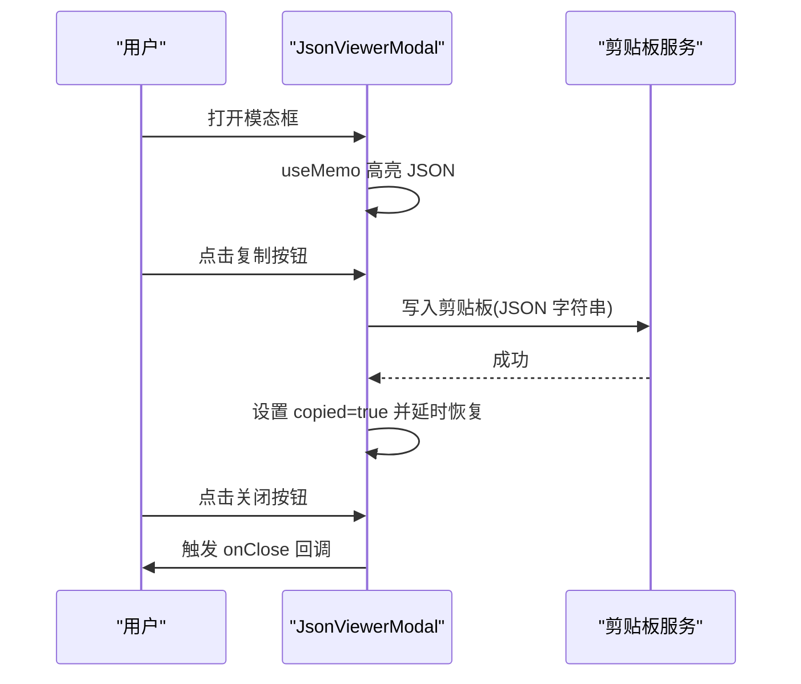
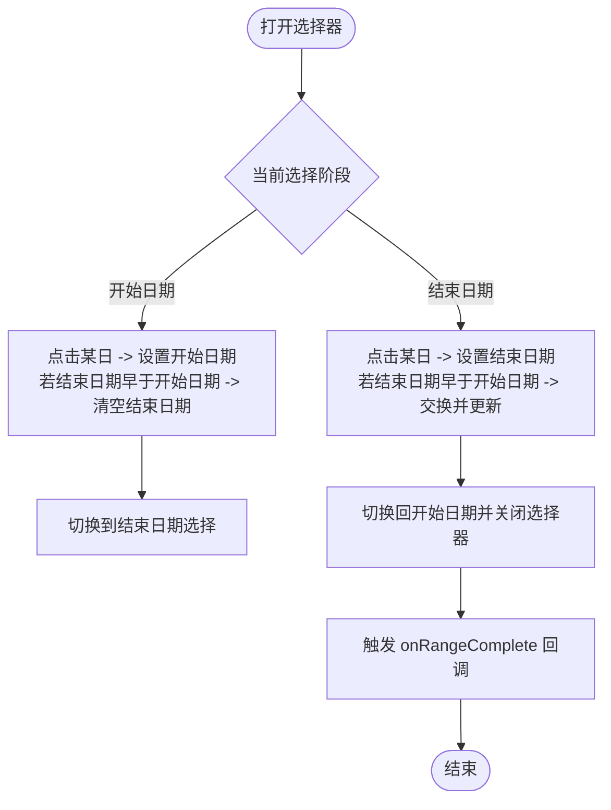
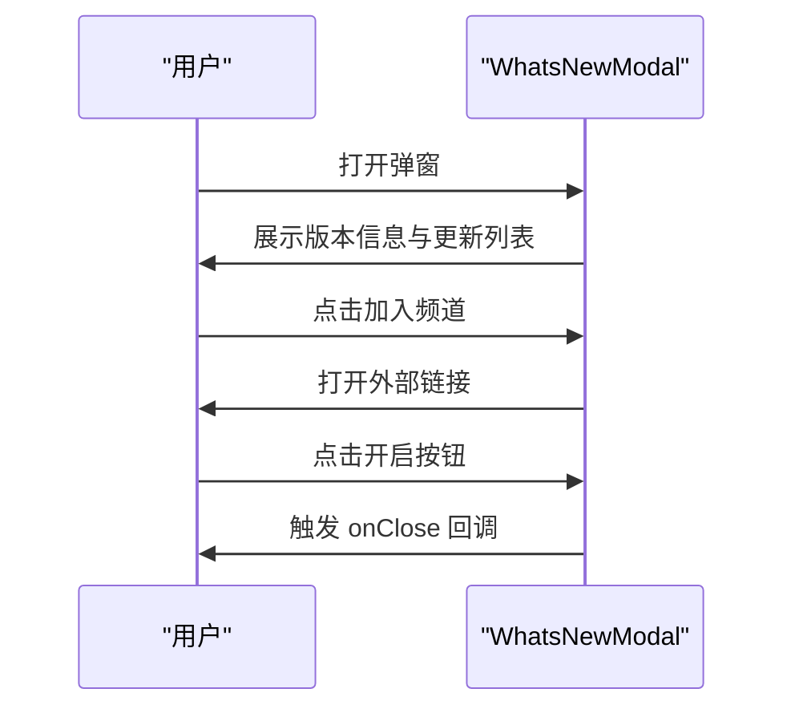
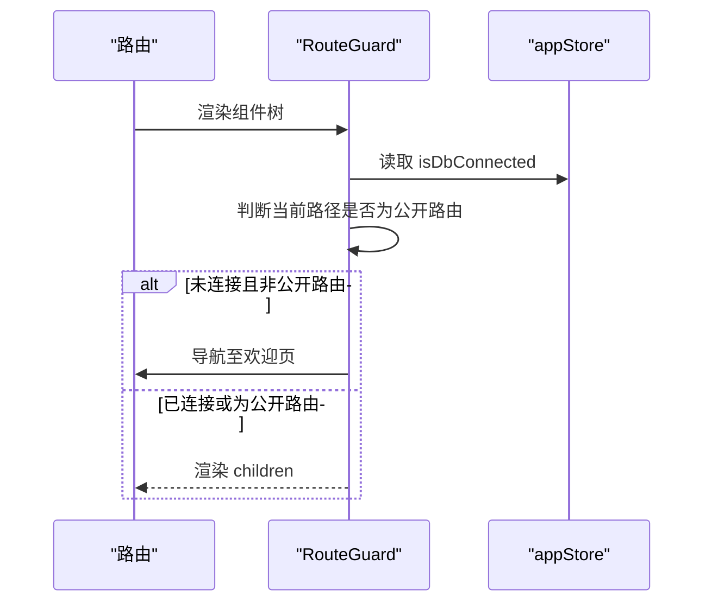
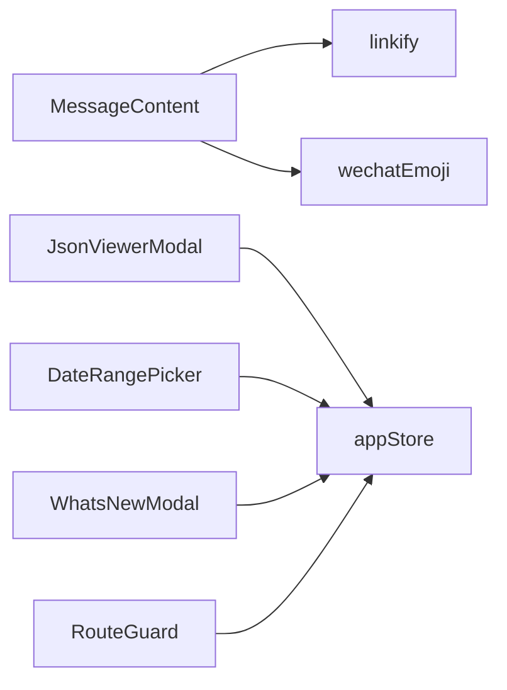

# 组件复用策略

<cite>
**本文引用的文件**
- [MessageContent.tsx](file://src/components/MessageContent.tsx)
- [JsonViewerModal.tsx](file://src/components/JsonViewerModal.tsx)
- [DateRangePicker.tsx](file://src/components/DateRangePicker.tsx)
- [WhatsNewModal.tsx](file://src/components/WhatsNewModal.tsx)
- [linkify.tsx](file://src/utils/linkify.tsx)
- [wechatEmoji.tsx](file://src/utils/wechatEmoji.tsx)
- [RouteGuard.tsx](file://src/components/RouteGuard.tsx)
- [appStore.ts](file://src/stores/appStore.ts)
- [JsonViewerModal.scss](file://src/components/JsonViewerModal.scss)
- [DateRangePicker.scss](file://src/components/DateRangePicker.scss)
- [WhatsNewModal.scss](file://src/components/WhatsNewModal.scss)
- [WelcomePage.tsx](file://src/pages/WelcomePage.tsx)
</cite>

## 目录
1. [简介](#简介)
2. [项目结构](#项目结构)
3. [核心组件](#核心组件)
4. [架构总览](#架构总览)
5. [详细组件分析](#详细组件分析)
6. [依赖关系分析](#依赖关系分析)
7. [性能考量](#性能考量)
8. [故障排查指南](#故障排查指南)
9. [结论](#结论)
10. [附录](#附录)

## 简介
本文件系统性梳理 CipherTalk 的组件复用策略，围绕以下设计原则展开：
- 单一职责原则：每个组件聚焦一个明确的功能域，便于独立演进与测试。
- 可配置性设计：通过 props 与上下文/状态管理实现灵活配置与行为定制。
- 接口标准化：统一的输入输出契约与事件回调命名，降低耦合度。

同时，结合项目现有实现，总结高阶组件（HOC）模式、Render Props 模式、Hook 复用模式的实践要点，并给出可复用组件示例（MessageContent、JsonViewerModal、DateRangePicker、WhatsNewModal）的最佳实践与性能优化建议。

## 项目结构
项目采用按功能域分层的组织方式：
- 组件层：src/components 下存放通用 UI 组件与业务组件。
- 页面层：src/pages 下存放页面级容器组件，负责路由与业务编排。
- 工具层：src/utils 下存放可复用的工具函数与解析器。
- 状态层：src/stores 下存放全局状态管理（如 Zustand）。
- 样式层：各组件配套 SCSS 文件，遵循变量与主题适配。

图表来源
- [MessageContent.tsx:1-103](file://src/components/MessageContent.tsx#L1-L103)
- [JsonViewerModal.tsx:1-68](file://src/components/JsonViewerModal.tsx#L1-L68)
- [DateRangePicker.tsx:1-240](file://src/components/DateRangePicker.tsx#L1-L240)
- [WhatsNewModal.tsx:1-88](file://src/components/WhatsNewModal.tsx#L1-L88)
- [linkify.tsx:1-115](file://src/utils/linkify.tsx#L1-L115)
- [wechatEmoji.tsx:1-157](file://src/utils/wechatEmoji.tsx#L1-L157)
- [appStore.ts:1-97](file://src/stores/appStore.ts#L1-L97)
- [WelcomePage.tsx:1-200](file://src/pages/WelcomePage.tsx#L1-L200)

章节来源
- [MessageContent.tsx:1-103](file://src/components/MessageContent.tsx#L1-L103)
- [JsonViewerModal.tsx:1-68](file://src/components/JsonViewerModal.tsx#L1-L68)
- [DateRangePicker.tsx:1-240](file://src/components/DateRangePicker.tsx#L1-L240)
- [WhatsNewModal.tsx:1-88](file://src/components/WhatsNewModal.tsx#L1-L88)
- [linkify.tsx:1-115](file://src/utils/linkify.tsx#L1-L115)
- [wechatEmoji.tsx:1-157](file://src/utils/wechatEmoji.tsx#L1-L157)
- [appStore.ts:1-97](file://src/stores/appStore.ts#L1-L97)
- [WelcomePage.tsx:1-200](file://src/pages/WelcomePage.tsx#L1-L200)

## 核心组件
本节聚焦四个可复用组件：MessageContent、JsonViewerModal、DateRangePicker、WhatsNewModal。它们分别体现了不同的复用维度：
- MessageContent：文本处理与渲染的纯展示组件，强调可配置性与可组合性。
- JsonViewerModal：弹窗型查看器，强调状态管理与交互一致性。
- DateRangePicker：复杂交互型控件，强调可配置性与事件回调。
- WhatsNewModal：信息提示型弹窗，强调主题适配与可扩展性。

章节来源
- [MessageContent.tsx:1-103](file://src/components/MessageContent.tsx#L1-L103)
- [JsonViewerModal.tsx:1-68](file://src/components/JsonViewerModal.tsx#L1-L68)
- [DateRangePicker.tsx:1-240](file://src/components/DateRangePicker.tsx#L1-L240)
- [WhatsNewModal.tsx:1-88](file://src/components/WhatsNewModal.tsx#L1-L88)

## 架构总览
组件复用的总体思路：
- 展示型组件（MessageContent、JsonViewerModal、WhatsNewModal）：仅负责渲染与基础交互，通过 props 注入数据与回调。
- 控制型组件（DateRangePicker）：封装复杂交互逻辑，暴露清晰的事件回调，便于上层容器控制。
- 路由守卫（RouteGuard）：通过状态管理与副作用实现跨页面的访问控制，体现 HOC 思想的轻量实现。
- 工具函数（linkify、wechatEmoji）：提供纯函数能力，供多个组件复用，提升可测试性与可维护性。

图表来源
- [MessageContent.tsx:1-103](file://src/components/MessageContent.tsx#L1-L103)
- [JsonViewerModal.tsx:1-68](file://src/components/JsonViewerModal.tsx#L1-L68)
- [DateRangePicker.tsx:1-240](file://src/components/DateRangePicker.tsx#L1-L240)
- [WhatsNewModal.tsx:1-88](file://src/components/WhatsNewModal.tsx#L1-L88)
- [RouteGuard.tsx:1-30](file://src/components/RouteGuard.tsx#L1-L30)
- [linkify.tsx:1-115](file://src/utils/linkify.tsx#L1-L115)
- [wechatEmoji.tsx:1-157](file://src/utils/wechatEmoji.tsx#L1-L157)
- [appStore.ts:1-97](file://src/stores/appStore.ts#L1-L97)

## 详细组件分析

### MessageContent 组件
- 设计原则
  - 单一职责：专注于消息文本的换行、链接识别与微信表情渲染。
  - 可配置性：支持禁用链接渲染、自定义样式类名。
  - 可组合性：内部复用 linkify 与 wechatEmoji 工具函数，形成“解析-渲染”的流水线。
- 关键流程
  - 输入：content、className、disableLinks。
  - 处理：按行拆分，逐行处理链接与表情；当禁用链接时仅处理表情与换行。
  - 输出：React 节点数组，包裹在 span 中。
- 复杂度与性能
  - 时间复杂度：O(n)，n 为文本长度；链接与表情解析均为线性扫描。
  - 性能优化：对链接识别与表情解析使用缓存与惰性计算（如 useMemo），减少重复计算。
- 代码片段路径
  - [processTextWithLineBreaks 实现:14-64](file://src/components/MessageContent.tsx#L14-L64)
  - [MessageContent 主体:70-100](file://src/components/MessageContent.tsx#L70-L100)

图表来源
- [MessageContent.tsx:14-100](file://src/components/MessageContent.tsx#L14-L100)

章节来源
- [MessageContent.tsx:1-103](file://src/components/MessageContent.tsx#L1-L103)
- [linkify.tsx:69-114](file://src/utils/linkify.tsx#L69-L114)
- [wechatEmoji.tsx:21-66](file://src/utils/wechatEmoji.tsx#L21-L66)

### JsonViewerModal 组件
- 设计原则
  - 单一职责：提供 JSON 数据的查看、复制与关闭能力。
  - 可配置性：标题、数据源、关闭回调均可配置。
  - 可复用性：通过样式文件与图标库实现一致的视觉与交互体验。
- 关键流程
  - 输入：data、title、onClose。
  - 处理：使用 useMemo 缓存高亮后的 JSON 字符串；复制时写入剪贴板并反馈状态。
  - 输出：模态框布局，包含头部操作区与内容区。
- 复杂度与性能
  - 时间复杂度：O(n)，n 为 JSON 序列化后的字符串长度；高亮为正则替换。
  - 性能优化：使用 useMemo 避免重复序列化与高亮；复制成功后短暂提示，避免频繁 DOM 更新。
- 代码片段路径
  - [highlightJson 实现:12-21](file://src/components/JsonViewerModal.tsx#L12-L21)
  - [JsonViewerModal 主体:23-67](file://src/components/JsonViewerModal.tsx#L23-L67)

图表来源
- [JsonViewerModal.tsx:23-67](file://src/components/JsonViewerModal.tsx#L23-L67)

章节来源
- [JsonViewerModal.tsx:1-68](file://src/components/JsonViewerModal.tsx#L1-L68)
- [JsonViewerModal.scss:1-228](file://src/components/JsonViewerModal.scss#L1-L228)

### DateRangePicker 组件
- 设计原则
  - 单一职责：提供日期范围选择的交互与快捷选项。
  - 可配置性：起止日期、变更回调、范围完成回调均可配置。
  - 可复用性：日历网格、导航、快捷选项均以可配置项形式提供。
- 关键流程
  - 输入：startDate、endDate、onStartDateChange、onEndDateChange、onRangeComplete。
  - 处理：维护打开状态、当前月份、选择阶段；点击日期时切换选择阶段并校验范围；快捷选项计算日期区间。
  - 输出：触发变更回调与完成回调，支持清空与外部点击关闭。
- 复杂度与性能
  - 时间复杂度：日历渲染 O(1)（固定 42 格），事件处理 O(1)。
  - 性能优化：使用 useMemo 缓存高亮 JSON；使用 useRef 与 useEffect 管理外部点击与滚动定位。
- 代码片段路径
  - [快捷选项与日期计算:60-93](file://src/components/DateRangePicker.tsx#L60-L93)
  - [日历网格渲染:155-183](file://src/components/DateRangePicker.tsx#L155-L183)
  - [DateRangePicker 主体:26-237](file://src/components/DateRangePicker.tsx#L26-L237)

图表来源
- [DateRangePicker.tsx:110-129](file://src/components/DateRangePicker.tsx#L110-L129)

章节来源
- [DateRangePicker.tsx:1-240](file://src/components/DateRangePicker.tsx#L1-L240)
- [DateRangePicker.scss:1-213](file://src/components/DateRangePicker.scss#L1-L213)

### WhatsNewModal 组件
- 设计原则
  - 单一职责：展示版本更新信息与引导用户行动。
  - 可配置性：版本号、关闭回调可配置；更新条目可扩展。
  - 可复用性：通过样式文件与图标库实现一致的视觉风格。
- 关键流程
  - 输入：onClose、version。
  - 处理：渲染版本标签、标题、描述列表；提供加入社区与开启按钮。
  - 输出：触发 onClose 回调关闭弹窗。
- 复杂度与性能
  - 时间复杂度：O(n)，n 为更新条目数量；渲染为纯静态结构。
  - 性能优化：列表项使用稳定 key；按钮交互使用事件委托思想（单点绑定）。
- 代码片段路径
  - [更新条目渲染:59-70](file://src/components/WhatsNewModal.tsx#L59-L70)
  - [WhatsNewModal 主体:10-85](file://src/components/WhatsNewModal.tsx#L10-L85)

图表来源
- [WhatsNewModal.tsx:44-81](file://src/components/WhatsNewModal.tsx#L44-L81)

章节来源
- [WhatsNewModal.tsx:1-88](file://src/components/WhatsNewModal.tsx#L1-L88)
- [WhatsNewModal.scss:1-200](file://src/components/WhatsNewModal.scss#L1-L200)

### 路由守卫（RouteGuard）与状态管理
- 设计原则
  - 单一职责：基于数据库连接状态与路由路径进行访问控制。
  - 可配置性：公共路由白名单可配置；跳转行为可定制。
  - 可复用性：通过状态管理与副作用实现跨页面的统一守卫。
- 关键流程
  - 读取 isDbConnected 与当前路径；若未连接且非公开路由，则跳转至欢迎页。
  - 返回 children 以渲染子树。
- 代码片段路径
  - [RouteGuard 主体:12-27](file://src/components/RouteGuard.tsx#L12-L27)
  - [appStore 状态定义:10-38](file://src/stores/appStore.ts#L10-L38)

图表来源
- [RouteGuard.tsx:12-27](file://src/components/RouteGuard.tsx#L12-L27)
- [appStore.ts:40-95](file://src/stores/appStore.ts#L40-L95)

章节来源
- [RouteGuard.tsx:1-30](file://src/components/RouteGuard.tsx#L1-L30)
- [appStore.ts:1-97](file://src/stores/appStore.ts#L1-L97)

## 依赖关系分析
- 组件间依赖
  - MessageContent 依赖 linkify 与 wechatEmoji 工具函数，形成“解析-渲染”的链路。
  - JsonViewerModal、DateRangePicker、WhatsNewModal 依赖 appStore 状态（如数据库连接状态）实现条件渲染与行为控制。
  - RouteGuard 依赖 appStore 状态与路由库实现访问控制。
- 工具函数依赖
  - linkify 依赖 TLD 缓存与正则表达式，具备异步初始化能力。
  - wechatEmoji 依赖第三方表情包资源，提供表情路径与 base64 缓存。
- 样式依赖
  - 各组件配套 SCSS 文件，统一主题变量与响应式设计。

图表来源
- [MessageContent.tsx:1-103](file://src/components/MessageContent.tsx#L1-L103)
- [JsonViewerModal.tsx:1-68](file://src/components/JsonViewerModal.tsx#L1-L68)
- [DateRangePicker.tsx:1-240](file://src/components/DateRangePicker.tsx#L1-L240)
- [WhatsNewModal.tsx:1-88](file://src/components/WhatsNewModal.tsx#L1-L88)
- [RouteGuard.tsx:1-30](file://src/components/RouteGuard.tsx#L1-L30)
- [linkify.tsx:1-115](file://src/utils/linkify.tsx#L1-L115)
- [wechatEmoji.tsx:1-157](file://src/utils/wechatEmoji.tsx#L1-L157)
- [appStore.ts:1-97](file://src/stores/appStore.ts#L1-L97)

章节来源
- [linkify.tsx:35-64](file://src/utils/linkify.tsx#L35-L64)
- [wechatEmoji.tsx:87-155](file://src/utils/wechatEmoji.tsx#L87-L155)

## 性能考量
- 计算优化
  - 使用 useMemo 缓存高亮 JSON 与表情解析结果，避免重复计算。
  - 对正则表达式与 TLD 列表进行缓存与异步初始化，减少首帧阻塞。
- 渲染优化
  - 列表项使用稳定 key，减少不必要的重排。
  - 弹窗组件采用固定定位与动画过渡，避免布局抖动。
- 状态优化
  - 将全局状态与局部状态分离，避免无关组件重渲染。
  - 使用状态选择器（如 store 中的派生状态）降低订阅粒度。

## 故障排查指南
- 链接识别异常
  - 检查 TLD 缓存是否初始化成功；确认网络可用与缓存命中。
  - 参考：[linkify 初始化与缓存:35-64](file://src/utils/linkify.tsx#L35-L64)
- 表情渲染异常
  - 检查表情包资源路径与 base64 缓存；确认第三方依赖可用。
  - 参考：[wechatEmoji 资源获取与缓存:87-155](file://src/utils/wechatEmoji.tsx#L87-L155)
- 日期选择异常
  - 检查起止日期格式与范围校验逻辑；确认外部点击关闭事件正确绑定。
  - 参考：[DateRangePicker 日期点击与范围校验:110-129](file://src/components/DateRangePicker.tsx#L110-L129)
- 访问控制失效
  - 检查 appStore 中 isDbConnected 状态更新；确认 RouteGuard 生效。
  - 参考：[RouteGuard 访问控制逻辑:17-24](file://src/components/RouteGuard.tsx#L17-L24)

章节来源
- [linkify.tsx:35-64](file://src/utils/linkify.tsx#L35-L64)
- [wechatEmoji.tsx:87-155](file://src/utils/wechatEmoji.tsx#L87-L155)
- [DateRangePicker.tsx:110-129](file://src/components/DateRangePicker.tsx#L110-L129)
- [RouteGuard.tsx:17-24](file://src/components/RouteGuard.tsx#L17-L24)

## 结论
CipherTalk 的组件复用策略以“单一职责、可配置性、接口标准化”为核心，结合工具函数与状态管理，实现了高内聚、低耦合的组件体系。通过 MessageContent、JsonViewerModal、DateRangePicker、WhatsNewModal 等组件的实践，展示了如何在保持可复用性的同时兼顾性能与可维护性。未来可在以下方面持续优化：
- 将常用交互抽象为 Hook，进一步提升逻辑复用与测试便利性。
- 引入更细粒度的状态切片，降低全局状态对局部组件的影响。
- 增加组件文档与类型约束，提升团队协作效率。

## 附录
- 组件复用最佳实践
  - 明确边界：每个组件只做一件事，避免“万能组件”。
  - 参数收敛：通过 props 与上下文统一配置，减少硬编码。
  - 事件回调：约定清晰的回调命名与参数结构，便于上层容器集成。
  - 样式隔离：组件样式与主题变量解耦，支持暗色/亮色主题切换。
- 性能优化建议
  - 使用 useMemo/useCallback 缓存昂贵计算与回调。
  - 合理拆分组件，避免不必要的重渲染。
  - 对网络请求与资源加载进行缓存与降级处理。
- 示例组件清单
  - MessageContent：消息文本渲染与表情链接处理。
  - JsonViewerModal：JSON 数据查看与复制。
  - DateRangePicker：日期范围选择与快捷选项。
  - WhatsNewModal：版本更新提示与引导。