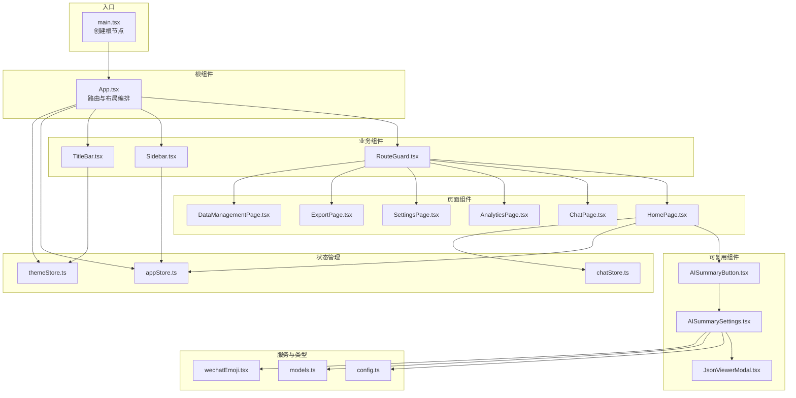
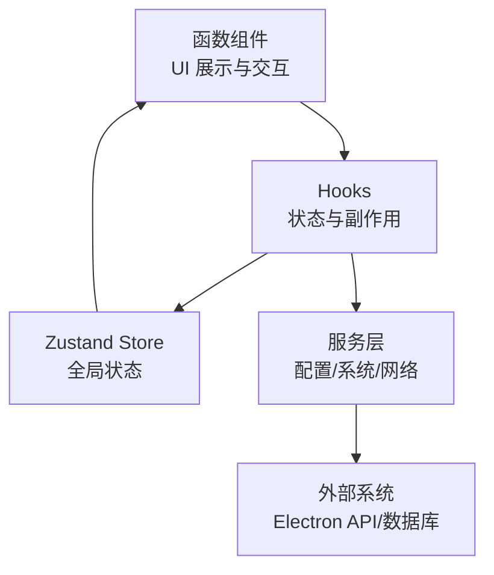
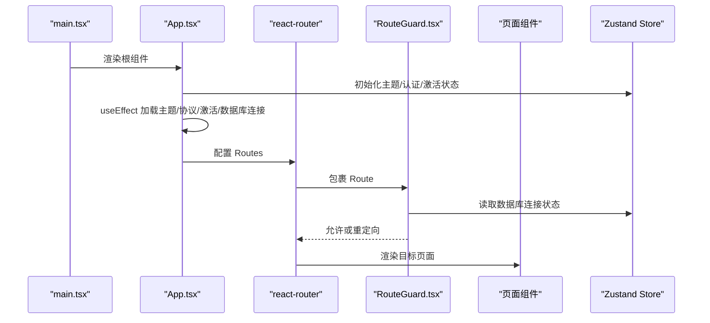
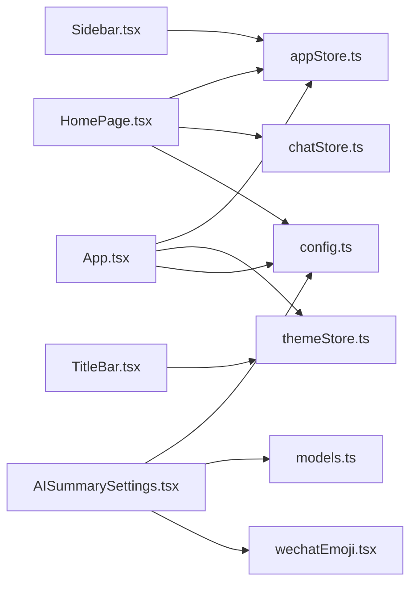

# 组件架构设计

<cite>
**本文档引用的文件**
- [App.tsx](file://src/App.tsx)
- [main.tsx](file://src/main.tsx)
- [HomePage.tsx](file://src/pages/HomePage.tsx)
- [Sidebar.tsx](file://src/components/Sidebar.tsx)
- [RouteGuard.tsx](file://src/components/RouteGuard.tsx)
- [TitleBar.tsx](file://src/components/TitleBar.tsx)
- [appStore.ts](file://src/stores/appStore.ts)
- [chatStore.ts](file://src/stores/chatStore.ts)
- [themeStore.ts](file://src/stores/themeStore.ts)
- [config.ts](file://src/services/config.ts)
- [AISummaryButton.tsx](file://src/components/ai/AISummaryButton.tsx)
- [AISummarySettings.tsx](file://src/components/ai/AISummarySettings.tsx)
- [JsonViewerModal.tsx](file://src/components/JsonViewerModal.tsx)
- [models.ts](file://src/types/models.ts)
- [wechatEmoji.tsx](file://src/utils/wechatEmoji.tsx)
</cite>

## 目录
1. [简介](#简介)
2. [项目结构](#项目结构)
3. [核心组件](#核心组件)
4. [架构总览](#架构总览)
5. [详细组件分析](#详细组件分析)
6. [依赖关系分析](#依赖关系分析)
7. [性能考量](#性能考量)
8. [故障排查指南](#故障排查指南)
9. [结论](#结论)
10. [附录](#附录)

## 简介
本文件面向 React 开发者，系统梳理 CipherTalk 的组件架构设计，围绕“函数组件 + Hooks”的使用模式，深入讲解组件生命周期管理、状态提升策略、Props 传递机制；阐述组件层级结构（根组件 App 的组织方式、页面组件与业务组件的分离、可复用组件的设计原则）；总结组件复用策略（高阶组件模式、Render Props 模式、Hook 复用）；详解组件通信机制（父子组件通信、兄弟组件通信、跨层级通信）；并提供组件设计最佳实践（单一职责原则、组件命名规范、性能优化技巧）。

## 项目结构
项目采用“页面层 + 组件层 + 状态层 + 服务层 + 类型与工具层”的分层组织方式：
- 页面层：pages 目录下包含各路由页面组件，负责页面级的导航、布局与业务编排
- 组件层：components 目录下包含可复用的 UI 组件与业务组件（如 Sidebar、TitleBar、RouteGuard 等）
- 状态层：stores 目录下使用 Zustand 管理全局状态（如 appStore、chatStore、themeStore 等）
- 服务层：services 目录下封装配置、数据库、AI、分析等服务接口
- 类型与工具层：types 定义数据模型，utils 提供工具函数（如表情解析）

图表来源
- [main.tsx:1-14](file://src/main.tsx#L1-L14)
- [App.tsx:40-538](file://src/App.tsx#L40-L538)
- [HomePage.tsx:16-175](file://src/pages/HomePage.tsx#L16-L175)
- [Sidebar.tsx:37-355](file://src/components/Sidebar.tsx#L37-L355)
- [RouteGuard.tsx:12-30](file://src/components/RouteGuard.tsx#L12-L30)
- [TitleBar.tsx:13-52](file://src/components/TitleBar.tsx#L13-L52)
- [AISummaryButton.tsx:10-18](file://src/components/ai/AISummaryButton.tsx#L10-L18)
- [AISummarySettings.tsx:117-800](file://src/components/ai/AISummarySettings.tsx#L117-L800)
- [JsonViewerModal.tsx:23-68](file://src/components/JsonViewerModal.tsx#L23-L68)
- [appStore.ts:40-97](file://src/stores/appStore.ts#L40-L97)
- [chatStore.ts:51-146](file://src/stores/chatStore.ts#L51-L146)
- [themeStore.ts:79-146](file://src/stores/themeStore.ts#L79-L146)
- [config.ts:1-574](file://src/services/config.ts#L1-L574)
- [models.ts:1-109](file://src/types/models.ts#L1-L109)
- [wechatEmoji.tsx:21-157](file://src/utils/wechatEmoji.tsx#L21-L157)

章节来源
- [main.tsx:1-14](file://src/main.tsx#L1-L14)
- [App.tsx:40-538](file://src/App.tsx#L40-L538)

## 核心组件
- 根组件 App：集中处理主题、协议与激活流程、数据库连接、路由守卫、独立窗口分流、更新与下载进度监听、锁屏与解密覆盖层等
- 页面组件：HomePage 等页面组件负责具体业务展示与交互，通过状态层与服务层协同工作
- 业务组件：Sidebar、TitleBar、RouteGuard 等承担导航、标题栏、路由守卫等横切职责
- 可复用组件：AISummaryButton、AISummarySettings、JsonViewerModal 等提供通用能力
- 状态层：Zustand store 管理应用状态、聊天状态、主题状态等
- 服务层：config.ts 封装配置读写、Electron 渠道调用等

章节来源
- [App.tsx:40-538](file://src/App.tsx#L40-L538)
- [HomePage.tsx:16-175](file://src/pages/HomePage.tsx#L16-L175)
- [Sidebar.tsx:37-355](file://src/components/Sidebar.tsx#L37-L355)
- [RouteGuard.tsx:12-30](file://src/components/RouteGuard.tsx#L12-L30)
- [TitleBar.tsx:13-52](file://src/components/TitleBar.tsx#L13-L52)
- [AISummaryButton.tsx:10-18](file://src/components/ai/AISummaryButton.tsx#L10-L18)
- [AISummarySettings.tsx:117-800](file://src/components/ai/AISummarySettings.tsx#L117-L800)
- [JsonViewerModal.tsx:23-68](file://src/components/JsonViewerModal.tsx#L23-L68)
- [appStore.ts:40-97](file://src/stores/appStore.ts#L40-L97)
- [chatStore.ts:51-146](file://src/stores/chatStore.ts#L51-L146)
- [themeStore.ts:79-146](file://src/stores/themeStore.ts#L79-L146)
- [config.ts:1-574](file://src/services/config.ts#L1-L574)

## 架构总览
整体采用“函数组件 + Hooks + Zustand + 服务层”的组合：
- 函数组件：以函数形式编写 UI，结合 useState/useEffect/useContext/useRouter 等 Hooks 管理局部状态与副作用
- Hooks：在组件内部封装副作用与状态逻辑，实现关注点分离
- Zustand：轻量全局状态管理，避免深层 Props 下传
- 服务层：封装配置、网络、系统调用等外部能力，统一对外接口

图表来源
- [App.tsx:40-538](file://src/App.tsx#L40-L538)
- [appStore.ts:40-97](file://src/stores/appStore.ts#L40-L97)
- [chatStore.ts:51-146](file://src/stores/chatStore.ts#L51-L146)
- [themeStore.ts:79-146](file://src/stores/themeStore.ts#L79-L146)
- [config.ts:1-574](file://src/services/config.ts#L1-L574)

## 详细组件分析

### 根组件 App 的组织方式与生命周期管理
- 路由与布局：使用 react-router-dom 的 Routes/Route 组织页面路由，配合 RouteGuard 控制访问权限
- 生命周期管理：通过多个 useEffect 管理主题加载、协议与激活状态检查、数据库连接、更新监听、下载进度监听等
- 独立窗口分流：根据 location.pathname 区分独立窗口（如聊天、群聊分析、朋友圈、年度报告、AI 摘要、图片/视频查看、浏览器窗口、欢迎页、协议页等），分别渲染对应页面组件
- 锁屏与覆盖层：根据状态显示锁屏与解密进度覆盖层
- 状态提升策略：将协议、激活、更新、下载进度等状态提升至 App，通过子组件 Props 传递或 Zustand 全局状态共享

图表来源
- [main.tsx:7-13](file://src/main.tsx#L7-L13)
- [App.tsx:40-538](file://src/App.tsx#L40-L538)
- [RouteGuard.tsx:12-30](file://src/components/RouteGuard.tsx#L12-L30)

章节来源
- [App.tsx:40-538](file://src/App.tsx#L40-L538)
- [RouteGuard.tsx:12-30](file://src/components/RouteGuard.tsx#L12-L30)
- [main.tsx:7-13](file://src/main.tsx#L7-L13)

### 页面组件与业务组件的分离
- 页面组件（如 HomePage）：聚焦页面级业务逻辑，负责数据加载、状态管理与 UI 呈现
- 业务组件（如 Sidebar、TitleBar、RouteGuard）：承担横切职责，如导航、标题栏、路由守卫等，便于复用与维护
- 分离原则：页面组件专注“做什么”，业务组件专注“怎么做”

章节来源
- [HomePage.tsx:16-175](file://src/pages/HomePage.tsx#L16-L175)
- [Sidebar.tsx:37-355](file://src/components/Sidebar.tsx#L37-L355)
- [TitleBar.tsx:13-52](file://src/components/TitleBar.tsx#L13-L52)
- [RouteGuard.tsx:12-30](file://src/components/RouteGuard.tsx#L12-L30)

### 可复用组件的设计原则
- AISummaryButton：通过 Props 传递 sessionId 与回调，职责单一，易于复用
- AISummarySettings：复杂配置面板，通过 Props 接收状态与修改函数，内部封装交互细节
- JsonViewerModal：通用 JSON 查看与复制能力，通过 Props 传递数据与关闭回调

章节来源
- [AISummaryButton.tsx:10-18](file://src/components/ai/AISummaryButton.tsx#L10-L18)
- [AISummarySettings.tsx:94-137](file://src/components/ai/AISummarySettings.tsx#L94-L137)
- [JsonViewerModal.tsx:23-68](file://src/components/JsonViewerModal.tsx#L23-L68)

### 组件复用策略
- 高阶组件（HOC）模式：通过 Props 注入状态与方法，实现横切关注点复用（如路由守卫）
- Render Props 模式：通过 children 或 render 函数注入上下文，实现灵活的 UI 组合
- Hook 复用：将状态与副作用封装为自定义 Hook，如主题切换、更新状态、用户信息加载等

章节来源
- [RouteGuard.tsx:12-30](file://src/components/RouteGuard.tsx#L12-L30)
- [TitleBar.tsx:13-52](file://src/components/TitleBar.tsx#L13-L52)
- [themeStore.ts:79-146](file://src/stores/themeStore.ts#L79-L146)

### 组件通信机制
- 父子组件通信：通过 Props 传递状态与回调，如 AISummarySettings 的 Provider/API Key/Model 等配置项
- 兄弟组件通信：通过共同父组件或全局状态（Zustand）协调，如 Sidebar 与页面组件共享用户信息
- 跨层级通信：通过全局状态（appStore/chatStore/themeStore）与服务层（config.ts）实现跨层级数据与事件传递

章节来源
- [AISummarySettings.tsx:94-137](file://src/components/ai/AISummarySettings.tsx#L94-L137)
- [Sidebar.tsx:37-355](file://src/components/Sidebar.tsx#L37-L355)
- [appStore.ts:40-97](file://src/stores/appStore.ts#L40-L97)
- [chatStore.ts:51-146](file://src/stores/chatStore.ts#L51-L146)
- [themeStore.ts:79-146](file://src/stores/themeStore.ts#L79-L146)
- [config.ts:1-574](file://src/services/config.ts#L1-L574)

### 状态提升策略与 Props 传递机制
- 状态提升：将协议、激活、更新、下载进度等状态提升至 App，减少跨组件传递层级
- Props 传递：页面组件与业务组件通过 Props 明确依赖，保持组件边界清晰
- 全局状态：Zustand store 管理跨页面共享状态，避免深层嵌套与重复订阅

章节来源
- [App.tsx:40-538](file://src/App.tsx#L40-L538)
- [HomePage.tsx:16-175](file://src/pages/HomePage.tsx#L16-L175)
- [appStore.ts:40-97](file://src/stores/appStore.ts#L40-L97)
- [chatStore.ts:51-146](file://src/stores/chatStore.ts#L51-L146)
- [themeStore.ts:79-146](file://src/stores/themeStore.ts#L79-L146)

## 依赖关系分析
- 组件依赖：页面组件依赖业务组件与可复用组件；业务组件依赖状态层与服务层
- 状态依赖：Zustand store 为全局状态中心，被多个组件读取与更新
- 服务依赖：config.ts 封装配置读写与 Electron 通道调用，被组件与 store 使用

图表来源
- [HomePage.tsx:16-175](file://src/pages/HomePage.tsx#L16-L175)
- [Sidebar.tsx:37-355](file://src/components/Sidebar.tsx#L37-L355)
- [TitleBar.tsx:13-52](file://src/components/TitleBar.tsx#L13-L52)
- [AISummarySettings.tsx:117-800](file://src/components/ai/AISummarySettings.tsx#L117-L800)
- [App.tsx:40-538](file://src/App.tsx#L40-L538)
- [appStore.ts:40-97](file://src/stores/appStore.ts#L40-L97)
- [chatStore.ts:51-146](file://src/stores/chatStore.ts#L51-L146)
- [themeStore.ts:79-146](file://src/stores/themeStore.ts#L79-L146)
- [config.ts:1-574](file://src/services/config.ts#L1-L574)
- [models.ts:1-109](file://src/types/models.ts#L1-L109)
- [wechatEmoji.tsx:21-157](file://src/utils/wechatEmoji.tsx#L21-L157)

章节来源
- [HomePage.tsx:16-175](file://src/pages/HomePage.tsx#L16-L175)
- [Sidebar.tsx:37-355](file://src/components/Sidebar.tsx#L37-L355)
- [TitleBar.tsx:13-52](file://src/components/TitleBar.tsx#L13-L52)
- [AISummarySettings.tsx:117-800](file://src/components/ai/AISummarySettings.tsx#L117-L800)
- [App.tsx:40-538](file://src/App.tsx#L40-L538)
- [appStore.ts:40-97](file://src/stores/appStore.ts#L40-L97)
- [chatStore.ts:51-146](file://src/stores/chatStore.ts#L51-L146)
- [themeStore.ts:79-146](file://src/stores/themeStore.ts#L79-L146)
- [config.ts:1-574](file://src/services/config.ts#L1-L574)
- [models.ts:1-109](file://src/types/models.ts#L1-L109)
- [wechatEmoji.tsx:21-157](file://src/utils/wechatEmoji.tsx#L21-L157)

## 性能考量
- 状态粒度：Zustand store 将全局状态拆分为多个领域 store，降低不必要的重渲染
- 渲染优化：页面组件通过条件渲染与懒加载（如独立窗口）减少初始渲染压力
- 副作用管理：将网络请求与系统调用集中在 useEffect 中，避免在渲染期间产生副作用
- 事件监听：在 useEffect 中注册并在卸载时清理，防止内存泄漏与重复监听

## 故障排查指南
- 协议与激活：若协议弹窗反复出现，检查协议版本与激活状态读取逻辑
- 数据库连接：若页面无法访问，检查数据库连接状态与路由守卫逻辑
- 主题与图标：若主题不生效，检查主题加载与系统主题监听逻辑
- 更新与下载：若更新提示不消失或下载进度异常，检查更新监听与下载进度监听的清理逻辑

章节来源
- [App.tsx:90-168](file://src/App.tsx#L90-L168)
- [RouteGuard.tsx:12-30](file://src/components/RouteGuard.tsx#L12-L30)
- [themeStore.ts:118-140](file://src/stores/themeStore.ts#L118-L140)

## 结论
CipherTalk 的组件架构以函数组件 + Hooks 为核心，结合 Zustand 全局状态与服务层封装，实现了清晰的职责分离与良好的可复用性。通过状态提升与 Props 传递，组件间通信简洁高效；通过页面组件与业务组件的分离，提升了可维护性与可测试性。建议在后续迭代中持续细化状态域划分、增强错误边界与日志埋点，进一步提升用户体验与系统稳定性。

## 附录
- 组件命名规范：页面组件以 Page 结尾，业务组件以具体功能命名，可复用组件以功能语义命名
- 单一职责原则：每个组件只负责一个功能域，避免过度耦合
- 性能优化技巧：合理拆分状态、避免深层 Props、使用 useMemo/useCallback、及时清理副作用