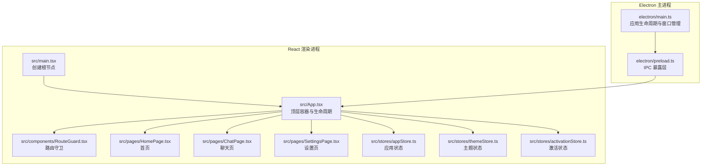
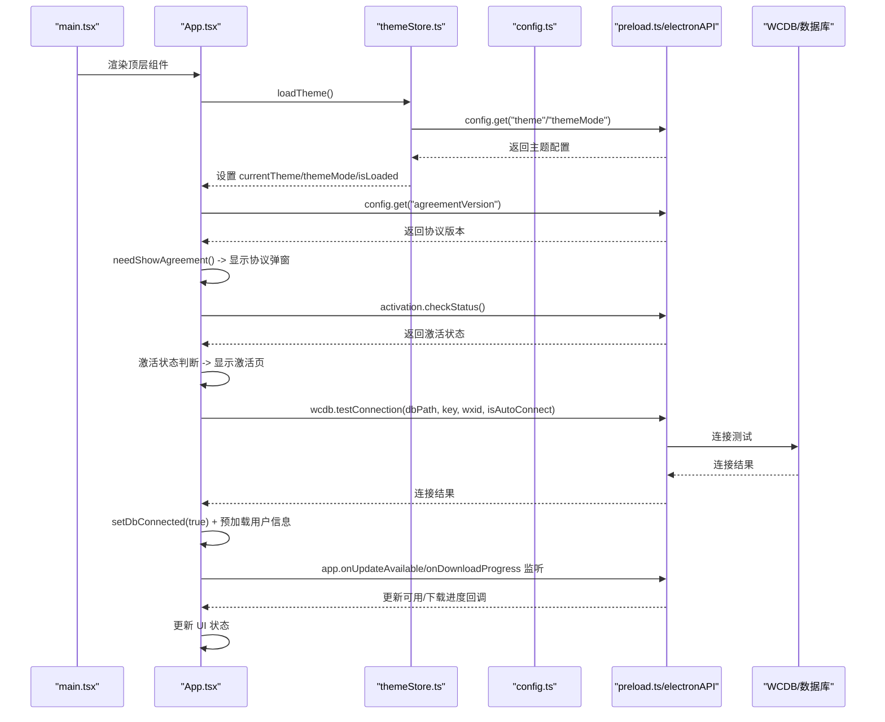
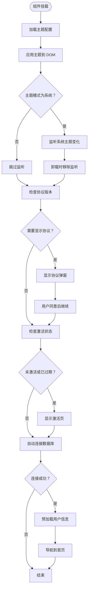
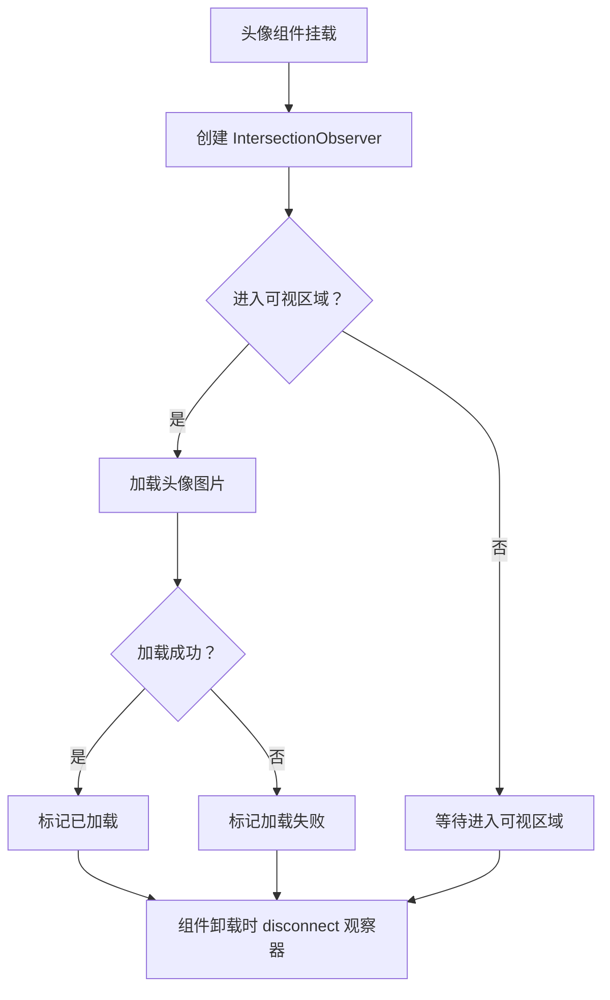
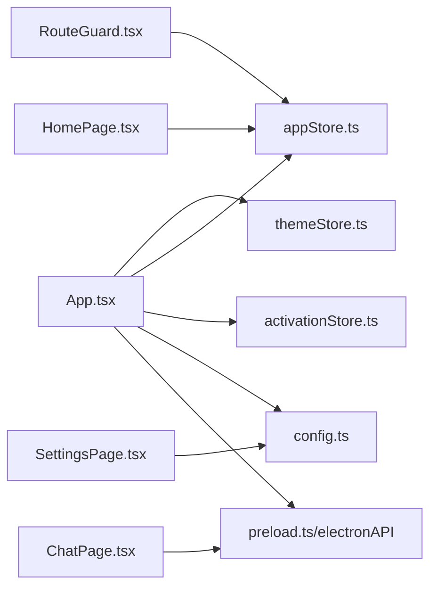

# 组件生命周期管理

<cite>
**本文档引用的文件**
- [src/App.tsx](file://src/App.tsx)
- [src/main.tsx](file://src/main.tsx)
- [electron/main.ts](file://electron/main.ts)
- [electron/preload.ts](file://electron/preload.ts)
- [src/stores/appStore.ts](file://src/stores/appStore.ts)
- [src/stores/themeStore.ts](file://src/stores/themeStore.ts)
- [src/stores/activationStore.ts](file://src/stores/activationStore.ts)
- [src/components/RouteGuard.tsx](file://src/components/RouteGuard.tsx)
- [src/pages/HomePage.tsx](file://src/pages/HomePage.tsx)
- [src/pages/ChatPage.tsx](file://src/pages/ChatPage.tsx)
- [src/pages/SettingsPage.tsx](file://src/pages/SettingsPage.tsx)
- [src/services/config.ts](file://src/services/config.ts)
- [src/utils/lruCache.ts](file://src/utils/lruCache.ts)
</cite>

## 目录
1. [引言](#引言)
2. [项目结构](#项目结构)
3. [核心组件](#核心组件)
4. [架构总览](#架构总览)
5. [详细组件分析](#详细组件分析)
6. [依赖关系分析](#依赖关系分析)
7. [性能考虑](#性能考虑)
8. [故障排查指南](#故障排查指南)
9. [结论](#结论)

## 引言
本文件围绕 CipherTalk 的组件生命周期管理展开，重点覆盖：
- React 函数组件的生命周期模式：useEffect 钩子的使用时机与清理机制、组件挂载与卸载过程、状态初始化与销毁流程
- 主应用组件 App 的生命周期管理：启动初始化、主题切换监听、数据库连接检查、协议与激活状态管理
- 页面组件生命周期：路由切换时的状态保持、数据预加载策略、错误边界处理
- 生命周期优化技巧：避免不必要的重渲染、内存泄漏防护、异步操作清理
- 实际代码示例路径：提供最佳实践参考

## 项目结构
CipherTalk 采用前端 React + Electron 渲染进程的架构。入口在 main.tsx 中创建根节点，App.tsx 作为顶层容器协调主题、协议、激活、数据库连接、路由守卫与页面渲染。

**图表来源**
- [src/main.tsx:1-14](file://src/main.tsx#L1-L14)
- [src/App.tsx:1-538](file://src/App.tsx#L1-L538)
- [electron/main.ts:1-800](file://electron/main.ts#L1-L800)
- [electron/preload.ts:1-454](file://electron/preload.ts#L1-L454)

**章节来源**
- [src/main.tsx:1-14](file://src/main.tsx#L1-L14)
- [src/App.tsx:1-538](file://src/App.tsx#L1-L538)
- [electron/main.ts:1-800](file://electron/main.ts#L1-L800)
- [electron/preload.ts:1-454](file://electron/preload.ts#L1-L454)

## 核心组件
- App.tsx：顶层容器，负责主题加载与应用、协议与激活状态检查、数据库自动连接、更新监听、独立窗口路由、协议弹窗与激活页渲染
- RouteGuard.tsx：路由守卫，根据数据库连接状态与公开路由决定跳转
- appStore.ts：应用全局状态（数据库连接、用户信息、解密进度等）
- themeStore.ts：主题与模式状态（含系统主题监听）
- activationStore.ts：激活状态检查与缓存清理
- 配置服务 config.ts：封装 IPC 配置读写、协议版本管理、自动更新参数等

**章节来源**
- [src/App.tsx:1-538](file://src/App.tsx#L1-L538)
- [src/components/RouteGuard.tsx:1-30](file://src/components/RouteGuard.tsx#L1-L30)
- [src/stores/appStore.ts:1-97](file://src/stores/appStore.ts#L1-L97)
- [src/stores/themeStore.ts:1-146](file://src/stores/themeStore.ts#L1-L146)
- [src/stores/activationStore.ts:1-45](file://src/stores/activationStore.ts#L1-L45)
- [src/services/config.ts:1-574](file://src/services/config.ts#L1-L574)

## 架构总览
App.tsx 通过多个 useEffect 完成启动阶段的初始化与监听：
- 主题加载与系统主题监听
- 协议版本检查与弹窗控制
- 激活状态检查与激活页控制
- 更新通知与下载进度监听
- 数据库自动连接与用户信息预加载
- 独立窗口路由与条件渲染

**图表来源**
- [src/main.tsx:1-14](file://src/main.tsx#L1-L14)
- [src/App.tsx:61-264](file://src/App.tsx#L61-L264)
- [src/stores/themeStore.ts:118-139](file://src/stores/themeStore.ts#L118-L139)
- [src/services/config.ts:265-274](file://src/services/config.ts#L265-L274)
- [electron/preload.ts:47-62](file://electron/preload.ts#L47-L62)
- [electron/preload.ts:150-163](file://electron/preload.ts#L150-L163)

**章节来源**
- [src/App.tsx:61-264](file://src/App.tsx#L61-L264)
- [src/stores/themeStore.ts:118-139](file://src/stores/themeStore.ts#L118-L139)
- [src/services/config.ts:265-274](file://src/services/config.ts#L265-L274)
- [electron/preload.ts:47-62](file://electron/preload.ts#L47-L62)
- [electron/preload.ts:150-163](file://electron/preload.ts#L150-L163)

## 详细组件分析

### App.tsx 生命周期详解
- 主题加载与系统主题监听
  - 首次渲染时触发 loadTheme，读取主题配置并设置 documentElement 属性
  - 当主题模式为 system 时，监听 prefers-color-scheme 媒体查询变化，动态切换模式并在卸载时移除监听
- 协议版本检查
  - 首次渲染时检查协议版本，若需要显示则弹窗；用户同意后继续检查激活状态
- 激活状态管理
  - 协议同意后检查激活状态，未激活或已过期则显示激活页
- 更新与下载监听
  - 监听更新可用与下载进度事件，清理时移除监听器
- 数据库自动连接
  - 非独立窗口场景下，读取配置并尝试连接数据库；连接成功后预加载用户信息并导航到首页
- 独立窗口路由
  - 根据路径判断渲染独立窗口组件，避免重复渲染主布局

**图表来源**
- [src/App.tsx:61-264](file://src/App.tsx#L61-L264)

**章节来源**
- [src/App.tsx:61-264](file://src/App.tsx#L61-L264)

### RouteGuard 路由守卫
- 根据数据库连接状态与公开路由决定是否跳转到欢迎页
- 依赖 appStore 的 isDbConnected 状态，确保非公开路由在未连接时被保护

**章节来源**
- [src/components/RouteGuard.tsx:1-30](file://src/components/RouteGuard.tsx#L1-L30)
- [src/stores/appStore.ts:10-38](file://src/stores/appStore.ts#L10-L38)

### HomePage 页面生命周期
- 首次渲染时检查新版本并决定是否显示“新版本”弹窗
- 根据 appStore 的 isDbConnected、userInfoLoaded、preloadedUserInfo 状态决定加载或使用预加载用户信息
- 未连接数据库时提供跳转到设置页的入口

**章节来源**
- [src/pages/HomePage.tsx:1-175](file://src/pages/HomePage.tsx#L1-L175)
- [src/stores/appStore.ts:10-38](file://src/stores/appStore.ts#L10-L38)

### ChatPage 页面生命周期
- 头像组件使用 IntersectionObserver 实现懒加载，进入可视区域后再加载图片，并在组件卸载时清理观察器
- 监听新消息事件，清理时移除监听器
- 使用 LRU 缓存限制内存占用，避免无限增长

**图表来源**
- [src/pages/ChatPage.tsx:51-83](file://src/pages/ChatPage.tsx#L51-L83)

**章节来源**
- [src/pages/ChatPage.tsx:1-200](file://src/pages/ChatPage.tsx#L1-L200)
- [src/utils/lruCache.ts:1-50](file://src/utils/lruCache.ts#L1-L50)

### SettingsPage 页面生命周期
- 首次渲染时加载各类配置项（解密密钥、数据库路径、缓存路径、STT 语言与模型、AI 摘要配置、日志与缓存大小等）
- 切换到激活标签页时自动刷新激活状态
- 使用大量本地状态管理 UI 行为与交互反馈

**章节来源**
- [src/pages/SettingsPage.tsx:1-200](file://src/pages/SettingsPage.tsx#L1-L200)
- [src/stores/activationStore.ts:20-33](file://src/stores/activationStore.ts#L20-L33)

### 主题与激活状态管理
- 主题状态：支持 light/dark/system 模式，系统模式下监听媒体查询变化并动态切换
- 激活状态：封装检查与缓存清理，避免重复检查与错误状态

**章节来源**
- [src/stores/themeStore.ts:67-140](file://src/stores/themeStore.ts#L67-L140)
- [src/stores/activationStore.ts:15-44](file://src/stores/activationStore.ts#L15-L44)

## 依赖关系分析
- App.tsx 依赖：
  - 主题与激活状态存储（themeStore、activationStore）
  - 配置服务（config.ts）用于协议版本与数据库配置读取
  - Electron IPC（preload.ts）用于数据库连接、更新监听、窗口控制等
- RouteGuard 依赖 appStore 的 isDbConnected 状态
- 页面组件依赖各自状态与 IPC 接口

**图表来源**
- [src/App.tsx:1-538](file://src/App.tsx#L1-L538)
- [src/components/RouteGuard.tsx:1-30](file://src/components/RouteGuard.tsx#L1-L30)
- [src/pages/HomePage.tsx:1-175](file://src/pages/HomePage.tsx#L1-L175)
- [src/pages/ChatPage.tsx:1-200](file://src/pages/ChatPage.tsx#L1-L200)
- [src/pages/SettingsPage.tsx:1-200](file://src/pages/SettingsPage.tsx#L1-L200)
- [src/stores/appStore.ts:1-97](file://src/stores/appStore.ts#L1-L97)
- [src/stores/themeStore.ts:1-146](file://src/stores/themeStore.ts#L1-L146)
- [src/stores/activationStore.ts:1-45](file://src/stores/activationStore.ts#L1-L45)
- [src/services/config.ts:1-574](file://src/services/config.ts#L1-L574)
- [electron/preload.ts:1-454](file://electron/preload.ts#L1-L454)

**章节来源**
- [src/App.tsx:1-538](file://src/App.tsx#L1-L538)
- [src/components/RouteGuard.tsx:1-30](file://src/components/RouteGuard.tsx#L1-L30)
- [src/pages/HomePage.tsx:1-175](file://src/pages/HomePage.tsx#L1-L175)
- [src/pages/ChatPage.tsx:1-200](file://src/pages/ChatPage.tsx#L1-L200)
- [src/pages/SettingsPage.tsx:1-200](file://src/pages/SettingsPage.tsx#L1-L200)
- [src/stores/appStore.ts:1-97](file://src/stores/appStore.ts#L1-L97)
- [src/stores/themeStore.ts:1-146](file://src/stores/themeStore.ts#L1-L146)
- [src/stores/activationStore.ts:1-45](file://src/stores/activationStore.ts#L1-L45)
- [src/services/config.ts:1-574](file://src/services/config.ts#L1-L574)
- [electron/preload.ts:1-454](file://electron/preload.ts#L1-L454)

## 性能考虑
- 避免不必要的重渲染
  - 使用局部状态与 useMemo/useCallback 优化高频渲染组件（如聊天列表行组件）
  - 将依赖数组精简，确保只在必要时触发副作用
- 内存泄漏防护
  - 所有事件监听器在 useEffect 清理函数中移除（媒体查询、下载进度、更新可用、新消息等）
  - 图片懒加载使用 IntersectionObserver，在组件卸载时断开
  - LRU 缓存限制缓存容量，定期清理最久未使用项
- 异步操作清理
  - 在组件卸载时移除 IPC 监听器，防止回调持有已销毁组件的引用
  - 对定时器与超时任务在清理函数中清除

## 故障排查指南
- 协议弹窗不消失
  - 检查协议版本是否正确写入配置，确认 needShowAgreement 逻辑
  - 参考路径：[src/services/config.ts:265-274](file://src/services/config.ts#L265-L274)
- 激活页不出现
  - 确认 activation.checkStatus 是否返回未激活或已过期状态
  - 参考路径：[src/stores/activationStore.ts:20-33](file://src/stores/activationStore.ts#L20-L33)
- 数据库连接失败
  - 检查配置读取与 wcdb.testConnection 调用链路
  - 参考路径：[src/App.tsx:194-240](file://src/App.tsx#L194-L240)、[electron/preload.ts:150-163](file://electron/preload.ts#L150-L163)
- 主题切换无效
  - 确认系统主题监听与 media query 事件处理
  - 参考路径：[src/App.tsx:70-88](file://src/App.tsx#L70-L88)
- 页面无数据或加载缓慢
  - 检查懒加载与缓存策略，确保观察器与缓存清理逻辑正常
  - 参考路径：[src/pages/ChatPage.tsx:51-83](file://src/pages/ChatPage.tsx#L51-L83)、[src/utils/lruCache.ts:1-50](file://src/utils/lruCache.ts#L1-L50)

**章节来源**
- [src/services/config.ts:265-274](file://src/services/config.ts#L265-L274)
- [src/stores/activationStore.ts:20-33](file://src/stores/activationStore.ts#L20-L33)
- [src/App.tsx:194-240](file://src/App.tsx#L194-L240)
- [electron/preload.ts:150-163](file://electron/preload.ts#L150-L163)
- [src/App.tsx:70-88](file://src/App.tsx#L70-L88)
- [src/pages/ChatPage.tsx:51-83](file://src/pages/ChatPage.tsx#L51-L83)
- [src/utils/lruCache.ts:1-50](file://src/utils/lruCache.ts#L1-L50)

## 结论
CipherTalk 的生命周期管理通过 App.tsx 的多处 useEffect 实现启动初始化、主题与协议激活检查、数据库连接与更新监听，并结合 RouteGuard 保障路由安全。页面组件通过懒加载、LRU 缓存与严格的清理机制，有效避免内存泄漏与性能问题。建议在后续迭代中：
- 将公共清理逻辑抽象为自定义 Hook，减少重复代码
- 对长耗时异步操作增加取消机制与错误边界
- 对 IPC 监听器统一注册/注销流程，提升可维护性