# 组件通信机制

<cite>
**本文档引用的文件**
- [App.tsx](file://src/App.tsx)
- [main.tsx](file://src/main.tsx)
- [Sidebar.tsx](file://src/components/Sidebar.tsx)
- [RouteGuard.tsx](file://src/components/RouteGuard.tsx)
- [ChatPage.tsx](file://src/pages/ChatPage.tsx)
- [HomePage.tsx](file://src/pages/HomePage.tsx)
- [ipc.ts](file://src/services/ipc.ts)
- [appStore.ts](file://src/stores/appStore.ts)
- [themeStore.ts](file://src/stores/themeStore.ts)
- [chatStore.ts](file://src/stores/chatStore.ts)
- [updateStatusStore.ts](file://src/stores/updateStatusStore.ts)
- [models.ts](file://src/types/models.ts)
- [preload.ts](file://electron/preload.ts)
- [main.ts](file://electron/main.ts)
- [context.md](file://contexts/context.md)
</cite>

## 目录
1. [简介](#简介)
2. [项目结构](#项目结构)
3. [核心组件](#核心组件)
4. [架构概览](#架构概览)
5. [详细组件分析](#详细组件分析)
6. [依赖关系分析](#依赖关系分析)
7. [性能考虑](#性能考虑)
8. [故障排除指南](#故障排除指南)
9. [结论](#结论)

## 简介

CipherTalk 是一个基于 Electron 和 React 的桌面应用程序，专门用于查看和分析微信聊天记录。该项目实现了多种组件通信机制，包括父子组件通信、兄弟组件通信、跨层级通信以及 Electron 特有的 IPC 通信。

该项目的核心特点包括：
- 使用 React 19 和 TypeScript 构建用户界面
- 采用 Zustand 进行状态管理
- 实现了完整的 Electron IPC 通信系统
- 支持多窗口架构和独立功能窗口
- 提供了丰富的聊天记录查看和分析功能

## 项目结构

项目采用模块化的组织结构，主要分为前端 React 应用和 Electron 主进程两大部分：

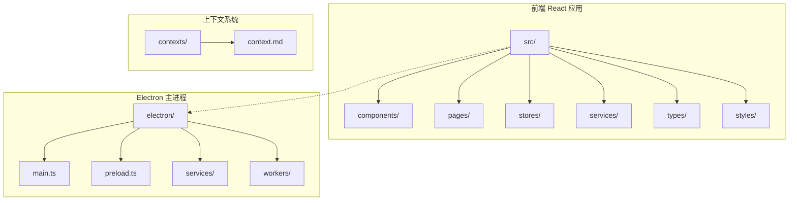

**图表来源**
- [context.md:18-27](file://contexts/context.md#L18-L27)

**章节来源**
- [context.md:1-53](file://contexts/context.md#L1-L53)

## 核心组件

### 状态管理系统

项目使用 Zustand 作为状态管理解决方案，提供了多个专门的状态存储：

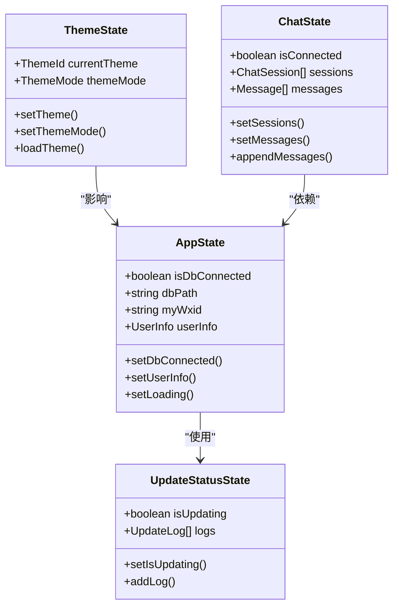

**图表来源**
- [appStore.ts:10-38](file://src/stores/appStore.ts#L10-L38)
- [themeStore.ts:67-77](file://src/stores/themeStore.ts#L67-L77)
- [chatStore.ts:4-49](file://src/stores/chatStore.ts#L4-L49)
- [updateStatusStore.ts:9-14](file://src/stores/updateStatusStore.ts#L9-L14)

### Electron IPC 通信层

项目实现了完整的 IPC 通信封装，提供了统一的 API 接口：

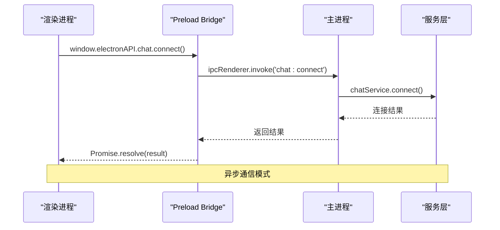

**图表来源**
- [preload.ts:4-435](file://electron/preload.ts#L4-L435)
- [ipc.ts:1-38](file://src/services/ipc.ts#L1-L38)

**章节来源**
- [appStore.ts:1-97](file://src/stores/appStore.ts#L1-L97)
- [themeStore.ts:1-146](file://src/stores/themeStore.ts#L1-L146)
- [chatStore.ts:1-146](file://src/stores/chatStore.ts#L1-L146)
- [updateStatusStore.ts:1-28](file://src/stores/updateStatusStore.ts#L1-L28)

## 架构概览

CipherTalk 采用了分层架构设计，实现了清晰的职责分离：

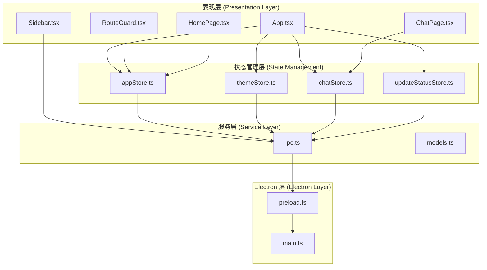

**图表来源**
- [App.tsx:40-538](file://src/App.tsx#L40-L538)
- [main.tsx:1-14](file://src/main.tsx#L1-L14)
- [preload.ts:1-454](file://electron/preload.ts#L1-L454)
- [main.ts:1-800](file://electron/main.ts#L1-L800)

## 详细组件分析

### 父子组件通信模式

#### Props 传递机制

在 CipherTalk 中，父子组件间的 Props 传递主要体现在路由守卫和侧边栏导航中：

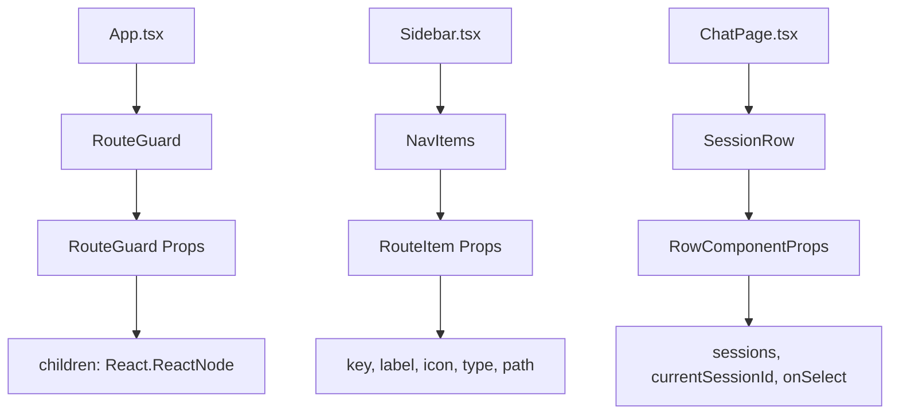

**图表来源**
- [RouteGuard.tsx:5-7](file://src/components/RouteGuard.tsx#L5-L7)
- [Sidebar.tsx:19-35](file://src/components/Sidebar.tsx#L19-L35)
- [ChatPage.tsx:15-26](file://src/pages/ChatPage.tsx#L15-L26)

#### 回调函数传递

组件间通过回调函数实现响应式通信：

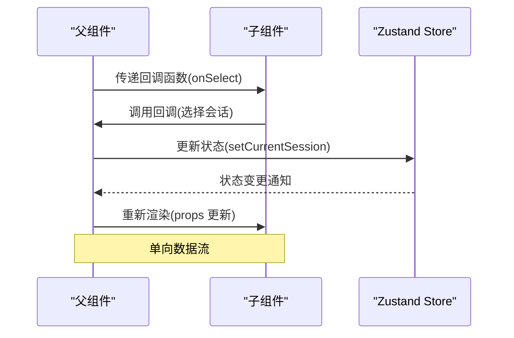

**图表来源**
- [ChatPage.tsx:594-610](file://src/pages/ChatPage.tsx#L594-L610)
- [Sidebar.tsx:154-159](file://src/components/Sidebar.tsx#L154-L159)

#### Context 使用

虽然项目中没有显式的 React Context 实现，但通过 Zustand store 实现了类似的功能：

**章节来源**
- [RouteGuard.tsx:1-30](file://src/components/RouteGuard.tsx#L1-L30)
- [Sidebar.tsx:1-355](file://src/components/Sidebar.tsx#L1-L355)
- [ChatPage.tsx:1-800](file://src/pages/ChatPage.tsx#L1-L800)

### 兄弟组件通信策略

#### 通过共同父组件传递

在 CipherTalk 中，兄弟组件通过共同的父组件进行通信：

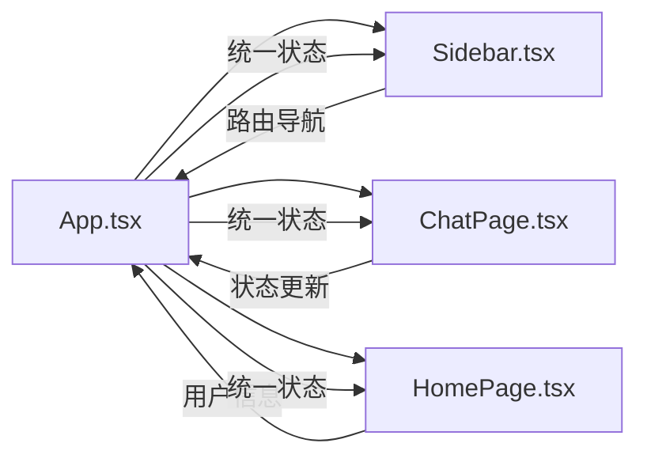

**图表来源**
- [App.tsx:462-534](file://src/App.tsx#L462-L534)
- [Sidebar.tsx:75-85](file://src/components/Sidebar.tsx#L75-L85)

#### 事件总线模式

项目实现了基于 Electron IPC 的事件总线模式：

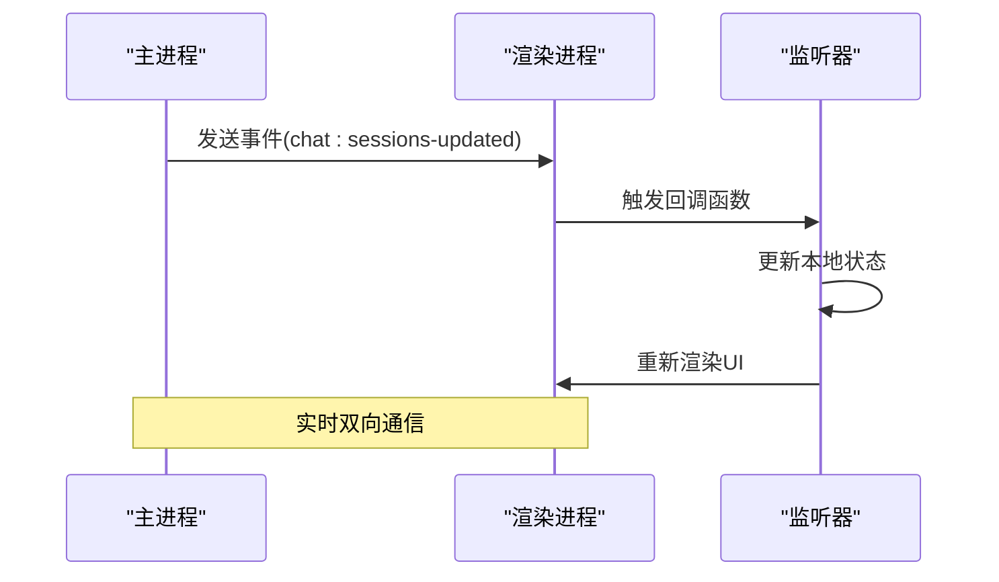

**图表来源**
- [preload.ts:277-286](file://electron/preload.ts#L277-L286)
- [ChatPage.tsx:542-585](file://src/pages/ChatPage.tsx#L542-L585)

#### 状态提升

项目通过状态提升实现组件间共享状态：

**章节来源**
- [App.tsx:40-538](file://src/App.tsx#L40-L538)
- [Sidebar.tsx:37-85](file://src/components/Sidebar.tsx#L37-L85)
- [HomePage.tsx:16-60](file://src/pages/HomePage.tsx#L16-L60)

### 跨层级通信方案

#### React Context API 使用

虽然项目未直接使用 React Context，但通过 Zustand 实现了跨层级状态共享：

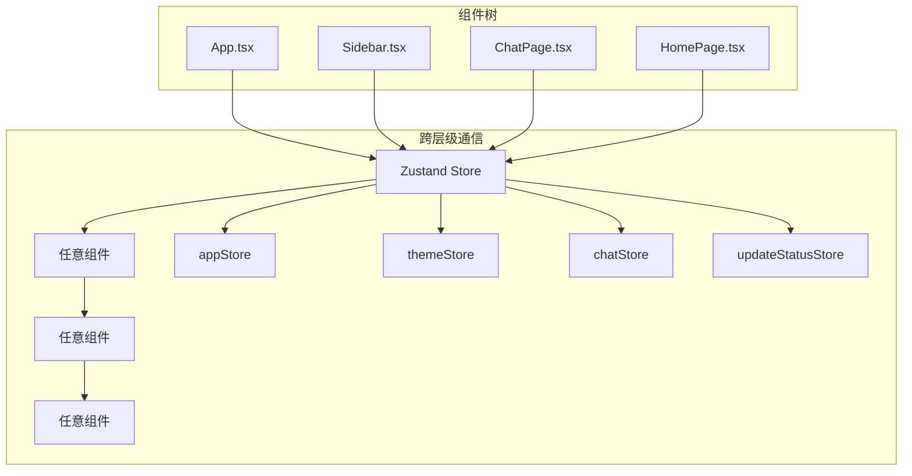

**图表来源**
- [appStore.ts:40-95](file://src/stores/appStore.ts#L40-L95)
- [themeStore.ts:79-140](file://src/stores/themeStore.ts#L79-L140)
- [chatStore.ts:51-145](file://src/stores/chatStore.ts#L51-L145)

#### 自定义事件系统

项目实现了基于 Electron IPC 的自定义事件系统：

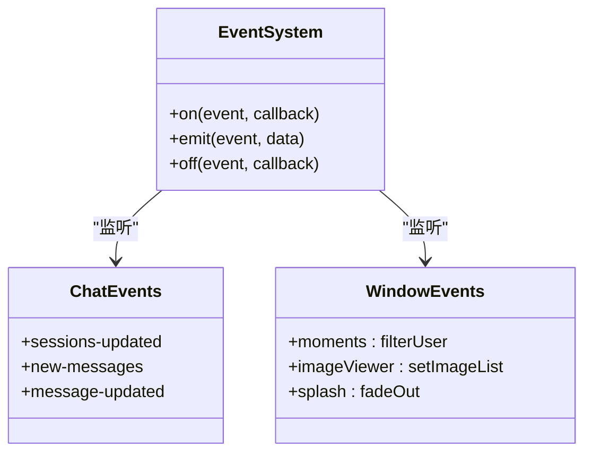

**图表来源**
- [preload.ts:277-286](file://electron/preload.ts#L277-L286)
- [preload.ts:78-81](file://electron/preload.ts#L78-L81)
- [preload.ts:105-113](file://electron/preload.ts#L105-L113)

#### 全局状态共享

通过集中式状态管理实现全局状态共享：

**章节来源**
- [updateStatusStore.ts:1-28](file://src/stores/updateStatusStore.ts#L1-L28)
- [models.ts:1-109](file://src/types/models.ts#L1-L109)

### Electron 特有的通信机制

#### IPC 通信模式

项目实现了完整的 IPC 通信架构：

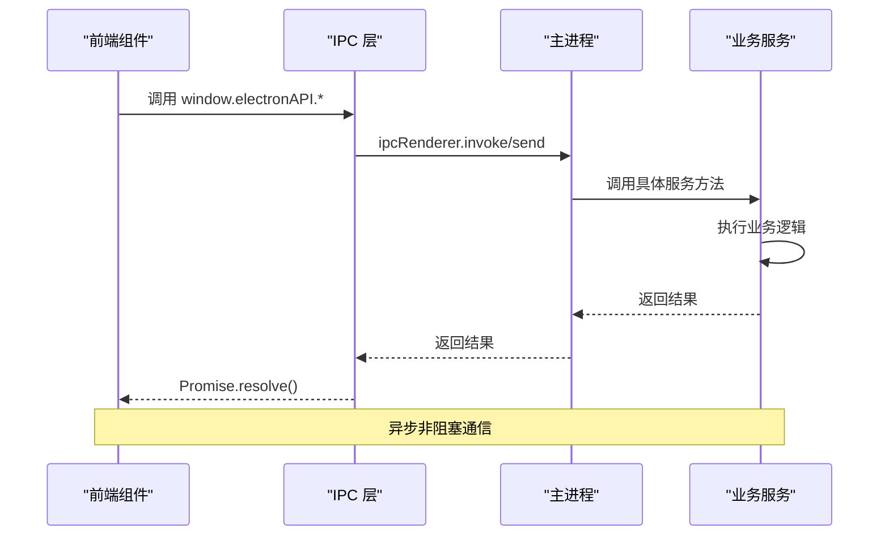

**图表来源**
- [preload.ts:4-435](file://electron/preload.ts#L4-L435)
- [ipc.ts:1-38](file://src/services/ipc.ts#L1-L38)

#### 主进程与渲染进程数据交换

项目实现了双向数据交换机制：

```mermaid
graph LR
subgraph "主进程"
A[main.ts]
B[service layer]
C[database layer]
end
subgraph "渲染进程"
D[preload.ts]
E[frontend components]
F[zustand stores]
end
A < --> D
D < --> E
E < --> F
B --> C
D --> B
E --> D
```

**图表来源**
- [main.ts:1-800](file://electron/main.ts#L1-L800)
- [preload.ts:1-454](file://electron/preload.ts#L1-L454)

#### 异步通信处理

项目采用 Promise-based 异步通信模式：

**章节来源**
- [preload.ts:1-454](file://electron/preload.ts#L1-L454)
- [ipc.ts:1-38](file://src/services/ipc.ts#L1-L38)

### 实际应用场景

#### 路由守卫

路由守卫确保用户在正确的时间访问正确的页面：

```mermaid
flowchart TD
A[用户访问页面] --> B{检查数据库连接}
B --> |未连接且非公开页面| C[重定向到欢迎页]
B --> |已连接或公开页面| D[允许访问]
E[公开路由列表] --> F[/, /settings, /data-management]
C --> G[导航到 /]
D --> H[渲染目标页面]
style A fill:#e1f5fe
style C fill:#ffebee
style D fill:#e8f5e8
```

**图表来源**
- [RouteGuard.tsx:9-24](file://src/components/RouteGuard.tsx#L9-L24)

#### 侧边栏导航

侧边栏实现了复杂的导航逻辑：

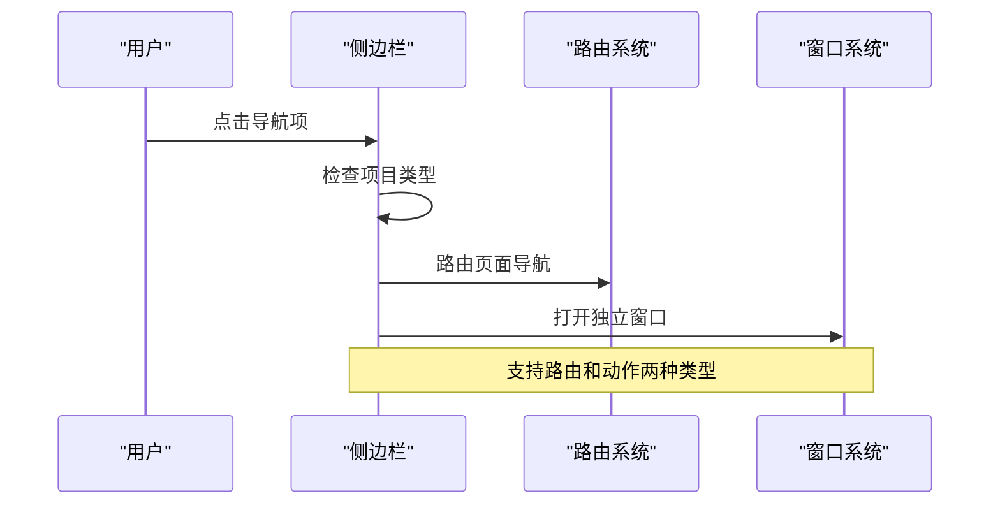

**图表来源**
- [Sidebar.tsx:75-85](file://src/components/Sidebar.tsx#L75-L85)
- [Sidebar.tsx:152-190](file://src/components/Sidebar.tsx#L152-L190)

#### 主题切换

主题切换实现了动态样式更新：

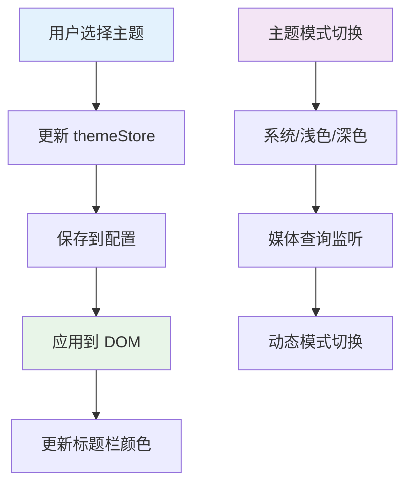

**图表来源**
- [themeStore.ts:85-116](file://src/stores/themeStore.ts#L85-L116)
- [App.tsx:69-88](file://src/App.tsx#L69-L88)

#### 数据库状态同步

数据库状态实现了实时同步：

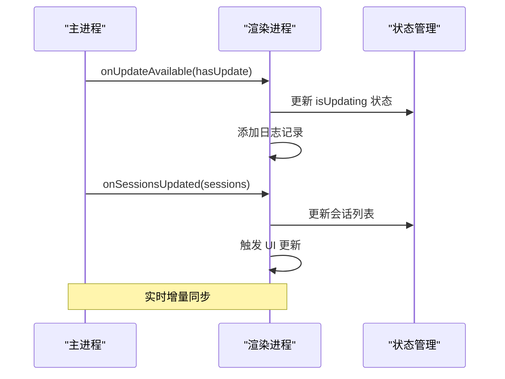

**图表来源**
- [App.tsx:142-161](file://src/App.tsx#L142-L161)
- [App.tsx:155-161](file://src/App.tsx#L155-L161)

**章节来源**
- [RouteGuard.tsx:1-30](file://src/components/RouteGuard.tsx#L1-L30)
- [Sidebar.tsx:37-85](file://src/components/Sidebar.tsx#L37-L85)
- [themeStore.ts:85-139](file://src/stores/themeStore.ts#L85-L139)
- [App.tsx:142-168](file://src/App.tsx#L142-L168)

## 依赖关系分析

项目采用了清晰的依赖层次结构：

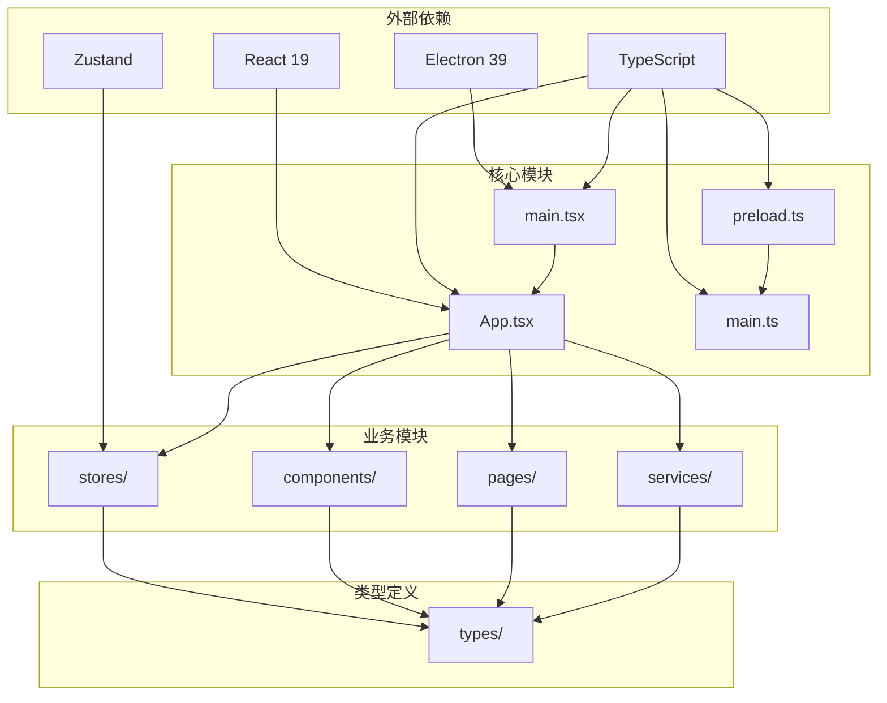

**图表来源**
- [context.md:6-17](file://contexts/context.md#L6-L17)
- [main.tsx:1-14](file://src/main.tsx#L1-L14)
- [preload.ts:1-454](file://electron/preload.ts#L1-L454)

**章节来源**
- [context.md:1-53](file://contexts/context.md#L1-L53)
- [models.ts:1-109](file://src/types/models.ts#L1-L109)

## 性能考虑

### 状态管理优化

项目通过以下方式优化性能：

1. **状态分割**: 将不同领域的状态分离到不同的 store 中
2. **选择器模式**: 使用 Zustand 的选择器减少不必要的重渲染
3. **批量更新**: 合并状态更新操作

### 组件渲染优化

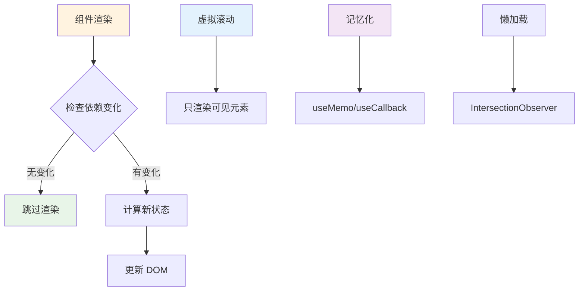

### IPC 通信优化

项目通过以下方式优化 IPC 通信：

1. **Promise 链式调用**: 减少回调地狱
2. **错误处理**: 统一的错误捕获和处理
3. **资源清理**: 及时移除事件监听器

## 故障排除指南

### 常见问题诊断

#### 数据库连接问题

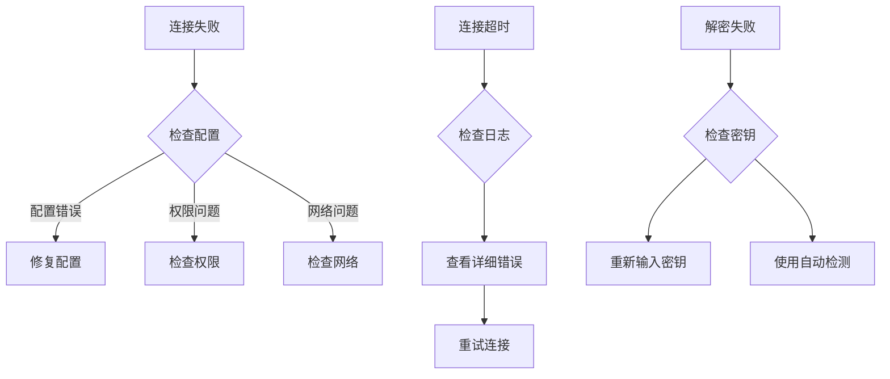

#### 状态同步问题

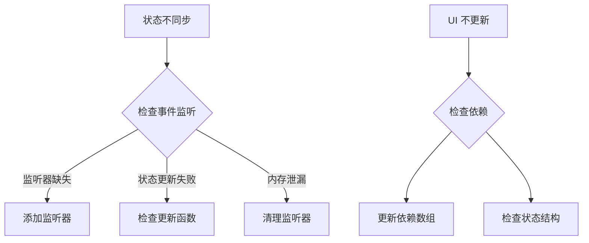

### 调试工具

项目提供了多种调试工具：

1. **日志系统**: 详细的日志记录和错误追踪
2. **状态检查**: 通过浏览器开发者工具检查状态
3. **IPC 调试**: 监控 IPC 通信过程

**章节来源**
- [App.tsx:90-105](file://src/App.tsx#L90-L105)
- [ChatPage.tsx:375-393](file://src/pages/ChatPage.tsx#L375-L393)
- [preload.ts:437-453](file://electron/preload.ts#L437-L453)

## 结论

CipherTalk 项目展示了现代桌面应用的组件通信最佳实践。通过合理的架构设计和多种通信模式的组合，实现了：

1. **清晰的职责分离**: 通过分层架构实现了良好的模块化
2. **灵活的通信机制**: 支持父子、兄弟、跨层级等多种通信模式
3. **强大的 Electron 集成**: 实现了完整的 IPC 通信系统
4. **优秀的性能表现**: 通过状态管理和渲染优化确保了流畅的用户体验

该项目为类似的数据分析和查看类桌面应用提供了很好的参考模板，特别是在组件通信机制方面具有很高的学习价值。