# 路由导航系统

<cite>
**本文档引用的文件**
- [App.tsx](file://src/App.tsx)
- [main.tsx](file://src/main.tsx)
- [RouteGuard.tsx](file://src/components/RouteGuard.tsx)
- [Sidebar.tsx](file://src/components/Sidebar.tsx)
- [ChatHistoryPage.tsx](file://src/pages/ChatHistoryPage.tsx)
- [main.ts](file://electron/main.ts)
- [preload.ts](file://electron/preload.ts)
- [appStore.ts](file://src/stores/appStore.ts)
- [authStore.ts](file://src/stores/authStore.ts)
- [HomePage.tsx](file://src/pages/HomePage.tsx)
</cite>

## 目录
1. [简介](#简介)
2. [项目结构](#项目结构)
3. [核心组件](#核心组件)
4. [架构概览](#架构概览)
5. [详细组件分析](#详细组件分析)
6. [依赖关系分析](#依赖关系分析)
7. [性能考虑](#性能考虑)
8. [故障排除指南](#故障排除指南)
9. [结论](#结论)

## 简介

CipherTalk 是一个基于 Electron 和 React 的微信数据分析工具，采用 React Router 7 实现了完整的路由导航系统。该系统支持多种窗口模式，包括主应用窗口、独立聊天窗口、独立分析窗口等，并实现了完善的权限控制和导航守卫机制。

系统的核心特点包括：
- 基于 HashRouter 的路由配置
- 嵌套路由和动态路由参数支持
- 条件路由渲染和窗口管理
- 完善的权限控制和访问限制
- 独立窗口的路由处理策略

## 项目结构

CipherTalk 的路由导航系统采用模块化设计，主要分为以下几个层次：

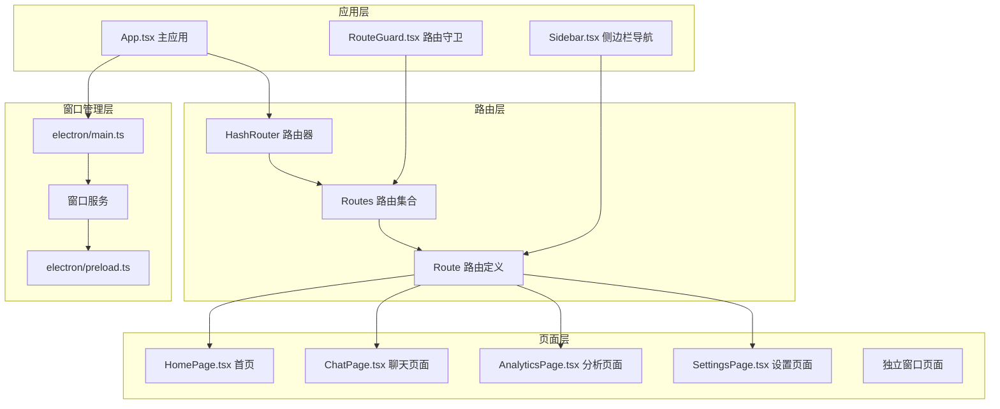

**图表来源**
- [App.tsx:1-538](file://src/App.tsx#L1-L538)
- [main.tsx:1-14](file://src/main.tsx#L1-L14)
- [electron/main.ts:1-800](file://electron/main.ts#L1-L800)

**章节来源**
- [App.tsx:1-538](file://src/App.tsx#L1-L538)
- [main.tsx:1-14](file://src/main.tsx#L1-L14)

## 核心组件

### 路由路由器配置

应用使用 HashRouter 作为基础路由器，支持多种路由模式：

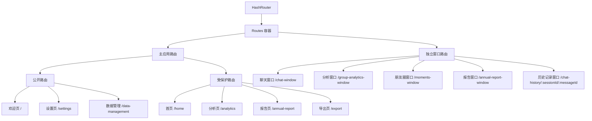

**图表来源**
- [App.tsx:507-519](file://src/App.tsx#L507-L519)
- [App.tsx:184-344](file://src/App.tsx#L184-L344)

### 路由守卫机制

RouteGuard 组件实现了基于数据库连接状态的权限控制：

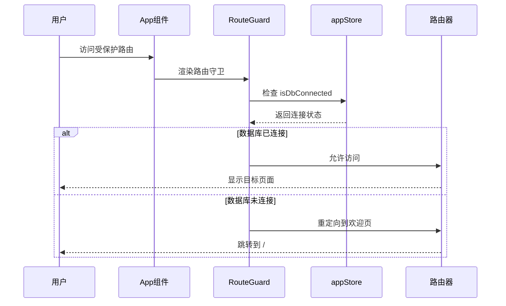

**图表来源**
- [RouteGuard.tsx:12-27](file://src/components/RouteGuard.tsx#L12-L27)
- [appStore.ts:40-95](file://src/stores/appStore.ts#L40-L95)

**章节来源**
- [RouteGuard.tsx:1-29](file://src/components/RouteGuard.tsx#L1-L29)
- [appStore.ts:1-97](file://src/stores/appStore.ts#L1-L97)

## 架构概览

CipherTalk 的路由系统采用三层架构设计：

### 应用层架构

应用层负责整体的路由管理和状态控制：

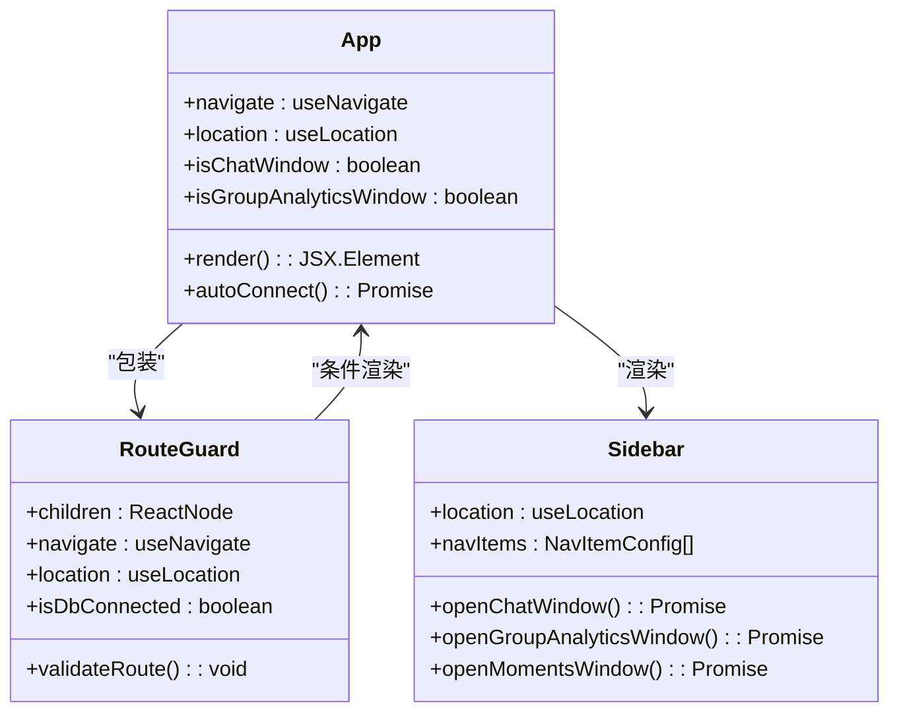

**图表来源**
- [App.tsx:40-538](file://src/App.tsx#L40-L538)
- [RouteGuard.tsx:5-27](file://src/components/RouteGuard.tsx#L5-L27)
- [Sidebar.tsx:37-355](file://src/components/Sidebar.tsx#L37-L355)

### 窗口管理层架构

窗口管理层实现了独立窗口的路由处理：

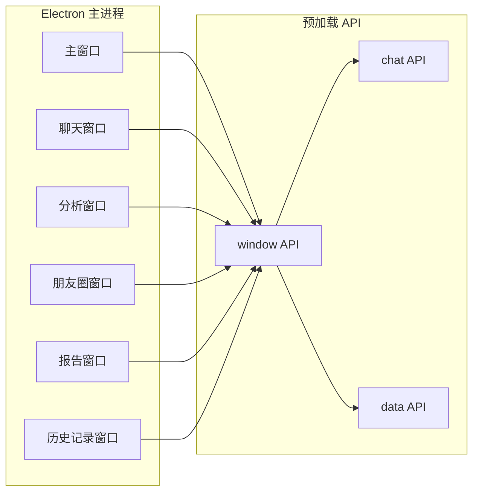

**图表来源**
- [electron/main.ts:286-588](file://electron/main.ts#L286-L588)
- [preload.ts:71-114](file://electron/preload.ts#L71-L114)

**章节来源**
- [App.tsx:184-344](file://src/App.tsx#L184-L344)
- [electron/main.ts:1-800](file://electron/main.ts#L1-L800)

## 详细组件分析

### 主应用路由系统

主应用路由系统实现了完整的页面导航功能：

#### 路由定义结构

```mermaid
flowchart TD
RootRoute[/] --> WelcomePage[欢迎页]
HomeRoute[/home] --> HomePage[首页]
AnalyticsRoute[/analytics] --> AnalyticsPage[私聊分析]
ReportRoute[/annual-report] --> AnnualReportPage[年度报告]
DataRoute[/data-management] --> DataManagementPage[数据管理]
SettingsRoute[/settings] --> SettingsPage[设置页面]
OpenApiRoute[/open-api] --> OpenApiPage[开放接口]
ExportRoute[/export] --> ExportPage[导出数据]
ChatHistoryRoute[/chat-history/:sessionId/:messageId] --> ChatHistoryPage[聊天记录详情]
```

**图表来源**
- [App.tsx:509-518](file://src/App.tsx#L509-L518)

#### 条件路由渲染

应用实现了智能的条件路由渲染机制：

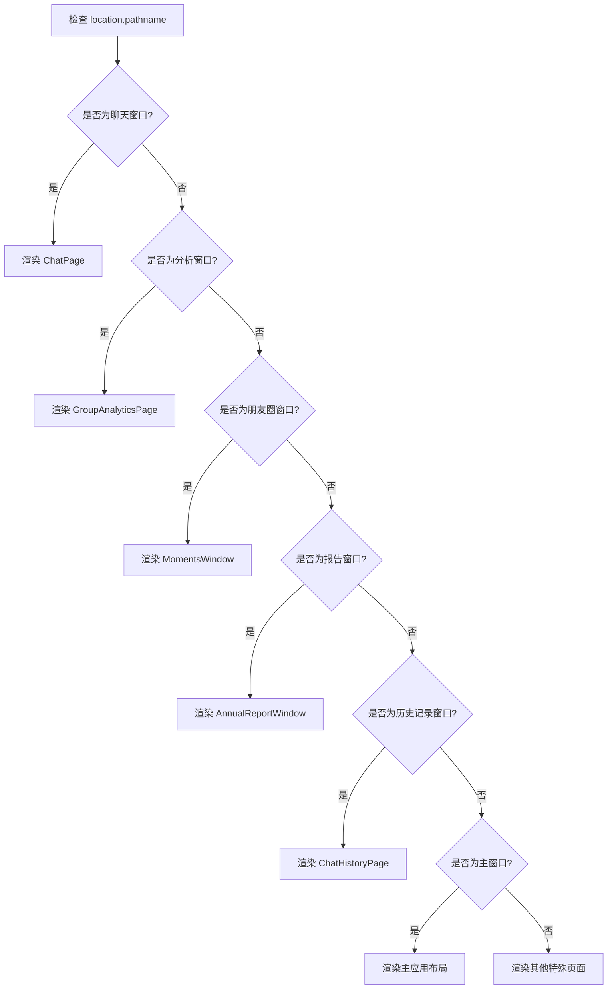

**图表来源**
- [App.tsx:266-344](file://src/App.tsx#L266-L344)

**章节来源**
- [App.tsx:507-534](file://src/App.tsx#L507-L534)

### 侧边栏导航系统

侧边栏导航系统提供了完整的页面导航功能：

#### 导航项配置

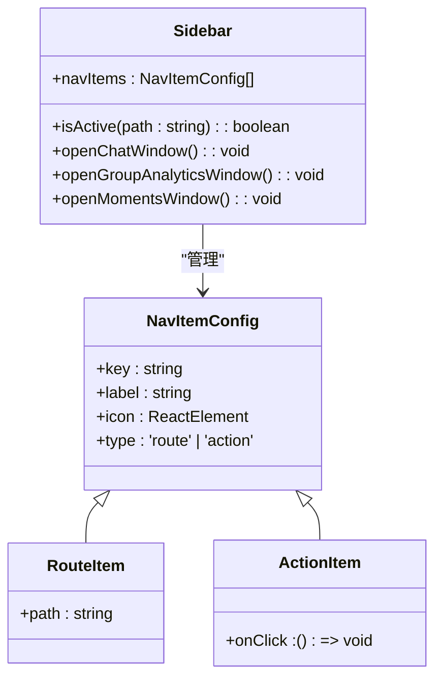

**图表来源**
- [Sidebar.tsx:19-35](file://src/components/Sidebar.tsx#L19-L35)
- [Sidebar.tsx:75-85](file://src/components/Sidebar.tsx#L75-L85)

#### 导航交互流程

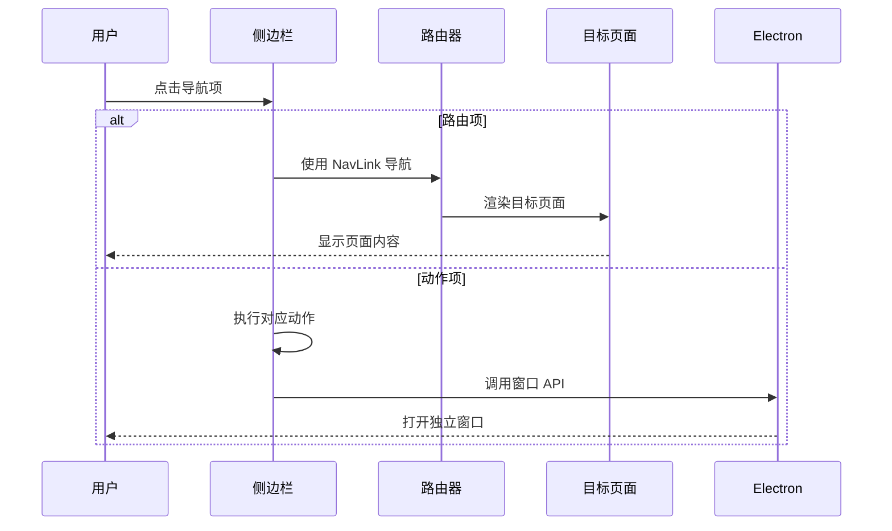

**图表来源**
- [Sidebar.tsx:152-190](file://src/components/Sidebar.tsx#L152-L190)

**章节来源**
- [Sidebar.tsx:1-355](file://src/components/Sidebar.tsx#L1-L355)

### 独立窗口路由处理

独立窗口系统实现了复杂的窗口管理和路由处理：

#### 窗口类型定义

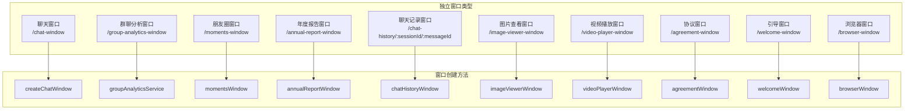

**图表来源**
- [App.tsx:184-344](file://src/App.tsx#L184-L344)
- [electron/main.ts:286-766](file://electron/main.ts#L286-L766)

#### 窗口参数传递

独立窗口支持多种参数传递方式：

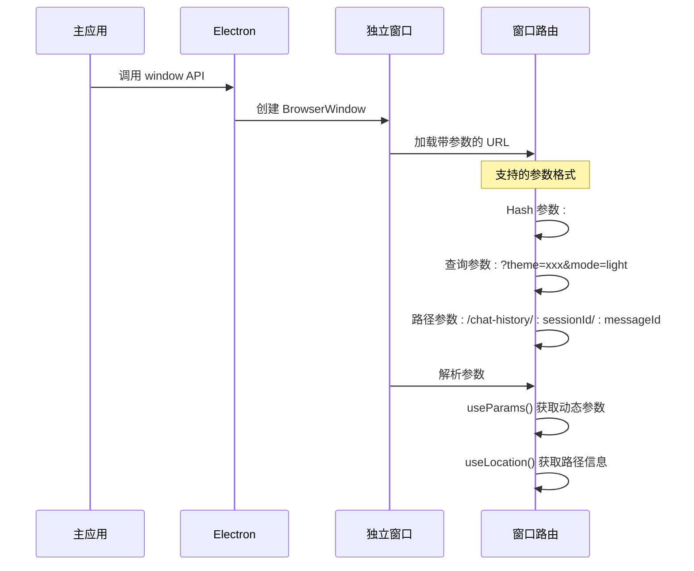

**图表来源**
- [ChatHistoryPage.tsx:9-152](file://src/pages/ChatHistoryPage.tsx#L9-L152)
- [electron/main.ts:522-581](file://electron/main.ts#L522-L581)

**章节来源**
- [App.tsx:184-344](file://src/App.tsx#L184-L344)
- [ChatHistoryPage.tsx:1-239](file://src/pages/ChatHistoryPage.tsx#L1-L239)
- [electron/main.ts:286-766](file://electron/main.ts#L286-L766)

### 动态路由参数处理

动态路由参数系统支持复杂的数据传递：

#### 参数解析机制

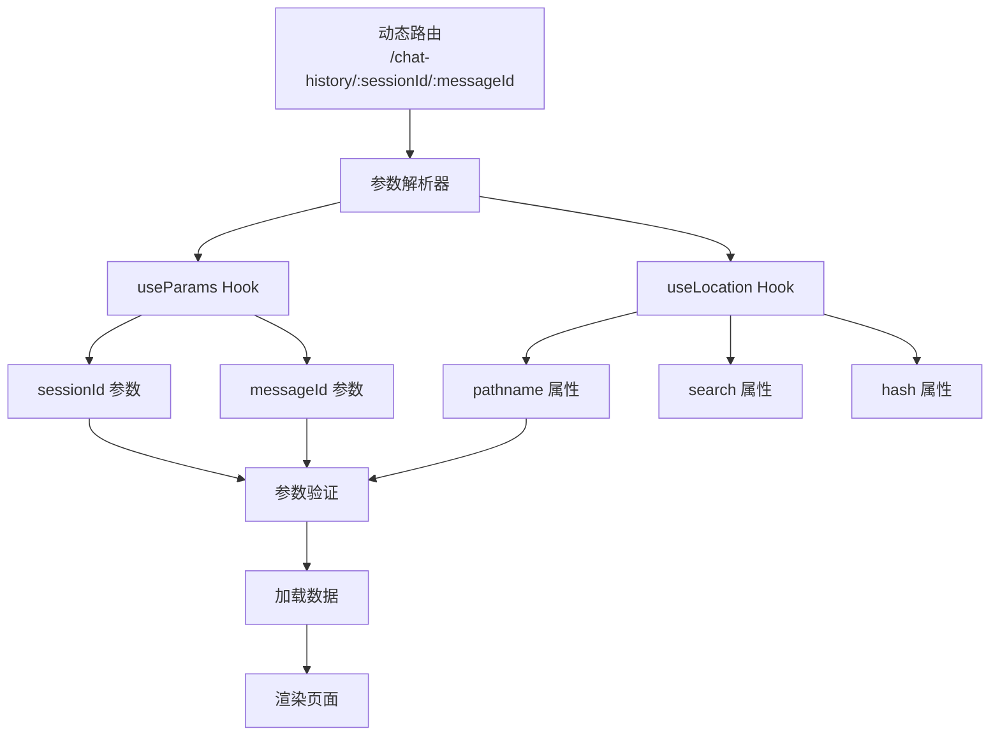

**图表来源**
- [ChatHistoryPage.tsx:9-152](file://src/pages/ChatHistoryPage.tsx#L9-L152)

#### 参数传递最佳实践

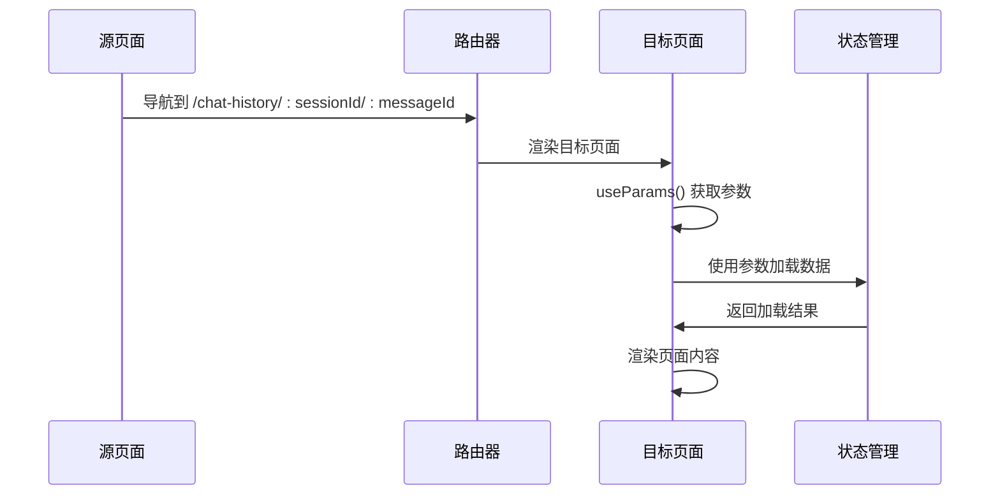

**图表来源**
- [ChatHistoryPage.tsx:114-152](file://src/pages/ChatHistoryPage.tsx#L114-L152)

**章节来源**
- [ChatHistoryPage.tsx:1-239](file://src/pages/ChatHistoryPage.tsx#L1-L239)

## 依赖关系分析

### 组件依赖图

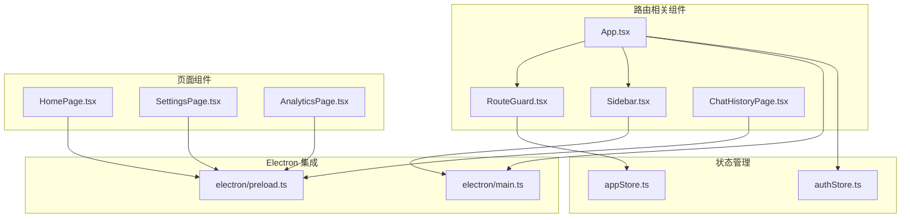

**图表来源**
- [App.tsx:1-538](file://src/App.tsx#L1-L538)
- [RouteGuard.tsx:1-29](file://src/components/RouteGuard.tsx#L1-L29)
- [Sidebar.tsx:1-355](file://src/components/Sidebar.tsx#L1-L355)
- [ChatHistoryPage.tsx:1-239](file://src/pages/ChatHistoryPage.tsx#L1-L239)

### 状态依赖关系

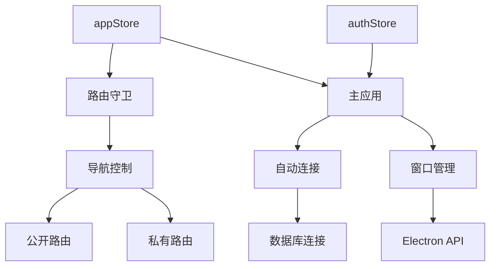

**图表来源**
- [appStore.ts:40-95](file://src/stores/appStore.ts#L40-L95)
- [authStore.ts:52-270](file://src/stores/authStore.ts#L52-L270)

**章节来源**
- [App.tsx:1-538](file://src/App.tsx#L1-L538)
- [appStore.ts:1-97](file://src/stores/appStore.ts#L1-L97)
- [authStore.ts:1-270](file://src/stores/authStore.ts#L1-L270)

## 性能考虑

### 路由性能优化策略

CipherTalk 采用了多项性能优化措施：

#### 路由懒加载
- 使用 React.lazy 实现组件懒加载
- 避免一次性加载所有页面组件
- 减少初始包体积和首屏加载时间

#### 状态管理优化
- 使用 Zustand 替代 Redux，减少样板代码
- 细粒度状态分离，避免不必要的重渲染
- 本地状态与全局状态合理分配

#### 窗口管理优化
- 独立窗口复用机制，避免重复创建
- 窗口间通信优化，减少 IPC 调用频率
- 主题参数预传递，防止窗口闪烁

### 缓存策略

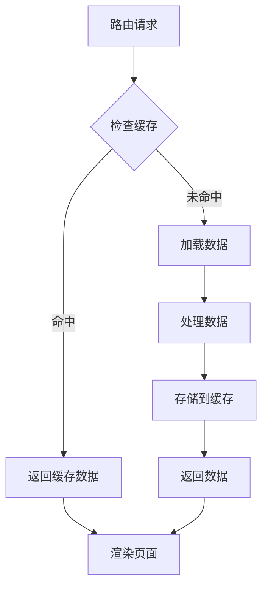

**章节来源**
- [App.tsx:194-264](file://src/App.tsx#L194-L264)
- [ChatHistoryPage.tsx:114-152](file://src/pages/ChatHistoryPage.tsx#L114-L152)

## 故障排除指南

### 常见路由问题

#### 路由守卫失效
**问题描述**: 用户可以访问受保护的路由页面
**解决方案**:
1. 检查 appStore 中的 isDbConnected 状态
2. 确认 RouteGuard 组件正确包裹 Routes
3. 验证数据库连接状态更新逻辑

#### 独立窗口无法打开
**问题描述**: 点击导航项无法打开独立窗口
**解决方案**:
1. 检查 Electron 主进程中的窗口创建函数
2. 验证 preload API 中的 window API 暴露
3. 确认窗口参数传递正确

#### 动态路由参数丢失
**问题描述**: 独立窗口中无法获取动态参数
**解决方案**:
1. 检查 URL 参数格式是否正确
2. 验证 useParams Hook 的使用
3. 确认窗口路由配置

### 调试技巧

#### 路由状态监控
```typescript
// 在开发环境中添加路由状态日志
console.log('Current location:', location.pathname)
console.log('Database connected:', isDbConnected)
console.log('Window type:', getWindowType(location.pathname))
```

#### 窗口通信调试
```typescript
// 监听窗口事件
ipcRenderer.on('window:created', (event, windowType) => {
  console.log(`${windowType} window created`)
})
```

**章节来源**
- [RouteGuard.tsx:17-24](file://src/components/RouteGuard.tsx#L17-L24)
- [electron/main.ts:286-588](file://electron/main.ts#L286-L588)

## 结论

CipherTalk 的路由导航系统展现了现代前端应用的优秀实践：

### 技术亮点

1. **多层次路由架构**: 支持主应用路由和独立窗口路由的统一管理
2. **智能权限控制**: 基于数据库连接状态的动态路由守卫
3. **灵活的窗口管理**: 完善的独立窗口创建和参数传递机制
4. **性能优化策略**: 懒加载、状态管理和缓存优化

### 最佳实践总结

1. **路由守卫设计**: 使用条件渲染而非硬编码重定向
2. **状态管理**: 细粒度状态分离，避免全局状态污染
3. **窗口通信**: 通过 preload API 实现安全的进程间通信
4. **参数处理**: 统一的参数解析和验证机制

### 未来改进方向

1. **路由预加载**: 实现路由级别的预加载策略
2. **错误边界**: 添加路由级别的错误处理机制
3. **性能监控**: 集成路由性能监控和分析
4. **国际化支持**: 扩展多语言路由支持

该路由系统为 CipherTalk 提供了稳定、高效的导航体验，为类似的数据分析类应用提供了优秀的参考模板。