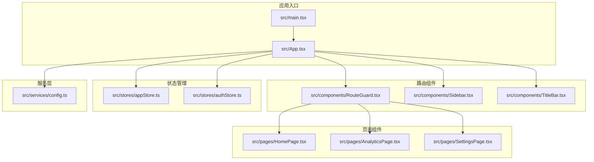
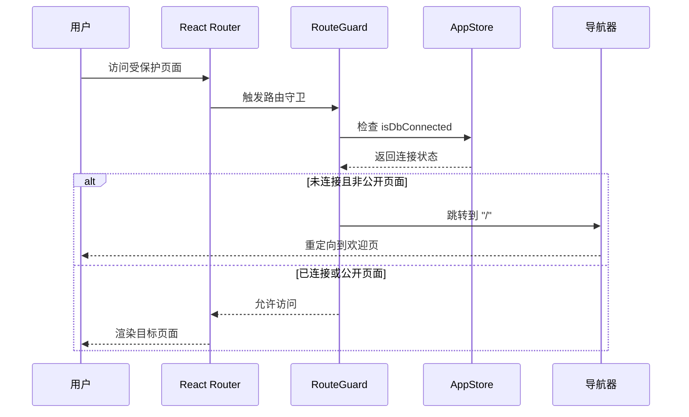
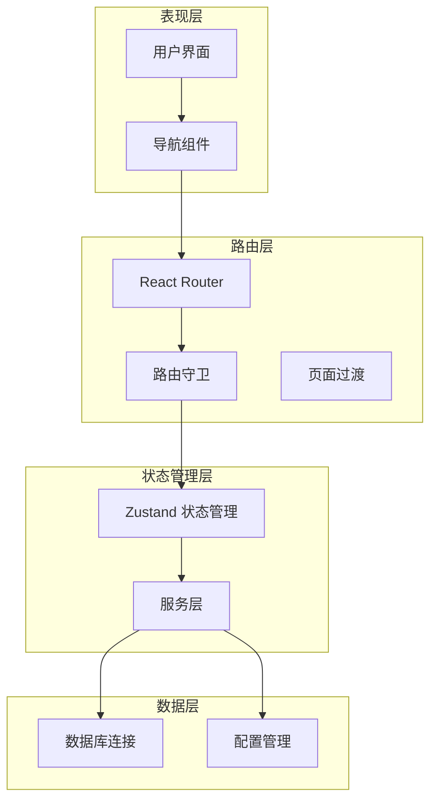
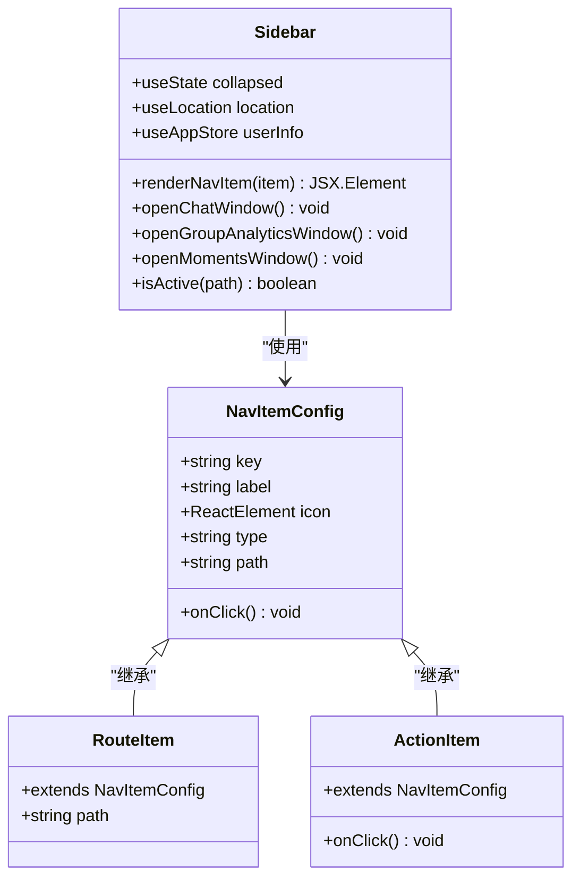
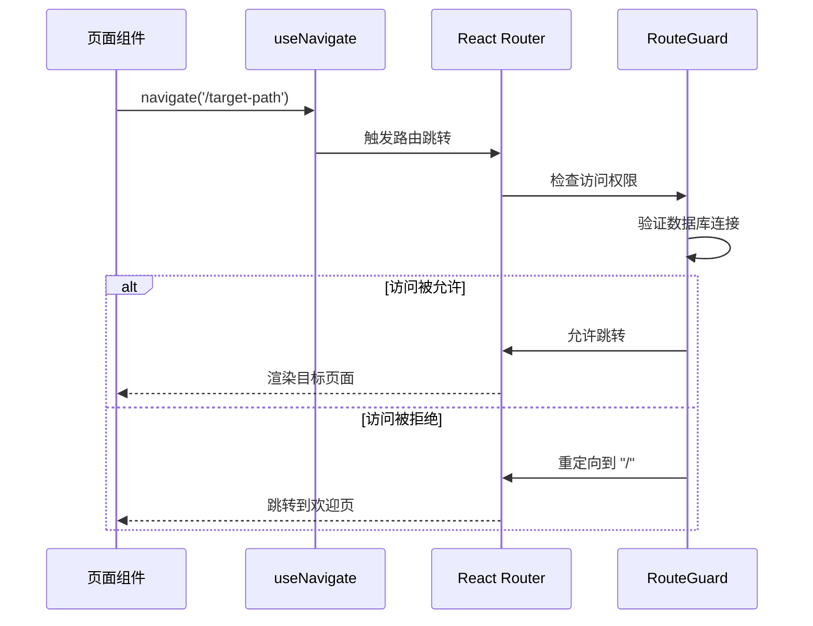
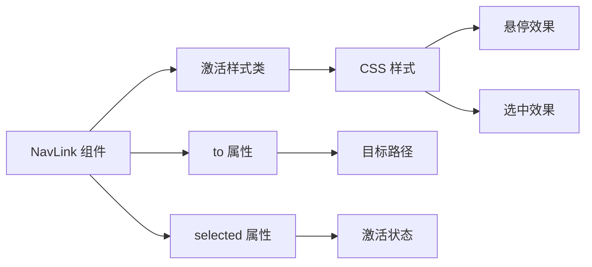
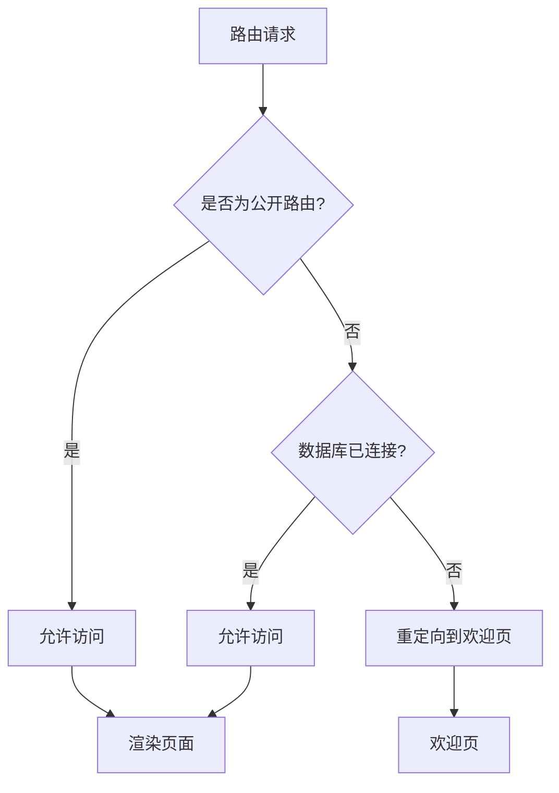
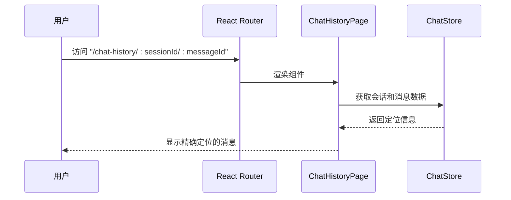
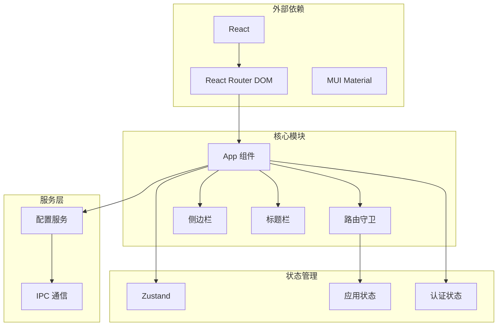
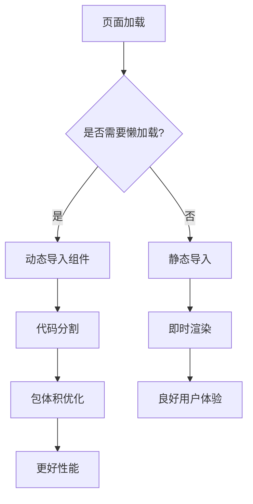

# 路由系统与导航

<cite>
**本文档引用的文件**
- [src/App.tsx](file://src/App.tsx)
- [src/main.tsx](file://src/main.tsx)
- [src/components/RouteGuard.tsx](file://src/components/RouteGuard.tsx)
- [src/components/Sidebar.tsx](file://src/components/Sidebar.tsx)
- [src/components/TitleBar.tsx](file://src/components/TitleBar.tsx)
- [src/pages/HomePage.tsx](file://src/pages/HomePage.tsx)
- [src/pages/AnalyticsPage.tsx](file://src/pages/AnalyticsPage.tsx)
- [src/pages/SettingsPage.tsx](file://src/pages/SettingsPage.tsx)
- [src/stores/appStore.ts](file://src/stores/appStore.ts)
- [src/stores/authStore.ts](file://src/stores/authStore.ts)
- [src/services/config.ts](file://src/services/config.ts)
</cite>

## 目录
1. [简介](#简介)
2. [项目结构](#项目结构)
3. [核心组件](#核心组件)
4. [架构概览](#架构概览)
5. [详细组件分析](#详细组件分析)
6. [依赖关系分析](#依赖关系分析)
7. [性能考虑](#性能考虑)
8. [故障排除指南](#故障排除指南)
9. [结论](#结论)

## 简介

CipherTalk 是一个基于 React 和 Electron 的桌面应用程序，专注于微信数据的分析和处理。本文档深入解析其路由系统与导航架构，涵盖 React Router 配置、页面跳转逻辑、导航设计、路由守卫机制、性能优化策略以及用户体验设计。

## 项目结构

CipherTalk 采用模块化的项目结构，路由系统主要分布在以下几个关键目录：



**图表来源**
- [src/main.tsx:1-14](file://src/main.tsx#L1-L14)
- [src/App.tsx:1-538](file://src/App.tsx#L1-L538)

**章节来源**
- [src/main.tsx:1-14](file://src/main.tsx#L1-L14)
- [src/App.tsx:1-538](file://src/App.tsx#L1-L538)

## 核心组件

### 路由配置与入口点

应用使用 React Router DOM 进行路由管理，采用 HashRouter 作为路由模式，确保在桌面应用中的兼容性。

```mermaid
flowchart TD
Start[应用启动] --> HashRouter[HashRouter 包装]
HashRouter --> App[App 组件]
App --> RouteGuard[RouteGuard 路由守卫]
RouteGuard --> Routes[Routes 容器]
Routes --> Route1[Route "/home"]
Routes --> Route2[Route "/analytics"]
Routes --> Route3[Route "/settings"]
Routes --> Route4[Route "/export"]
Routes --> Route5[Route "/data-management"]
Routes --> Route6[Route "/chat-history/:sessionId/:messageId"]
```

**图表来源**
- [src/main.tsx:3-12](file://src/main.tsx#L3-L12)
- [src/App.tsx:507-519](file://src/App.tsx#L507-L519)

### 路由守卫机制

路由守卫实现了数据库连接状态的强制检查，确保只有在数据库已连接的情况下才能访问受保护的页面。



**图表来源**
- [src/components/RouteGuard.tsx:12-27](file://src/components/RouteGuard.tsx#L12-L27)

**章节来源**
- [src/components/RouteGuard.tsx:1-30](file://src/components/RouteGuard.tsx#L1-L30)

## 架构概览

CipherTalk 的路由系统采用分层架构设计，实现了清晰的关注点分离：



**图表来源**
- [src/App.tsx:40-538](file://src/App.tsx#L40-L538)
- [src/components/Sidebar.tsx:37-355](file://src/components/Sidebar.tsx#L37-L355)

## 详细组件分析

### 侧边栏导航系统

侧边栏实现了响应式的导航菜单，支持折叠/展开功能和动态图标切换。



**图表来源**
- [src/components/Sidebar.tsx:19-35](file://src/components/Sidebar.tsx#L19-L35)
- [src/components/Sidebar.tsx:75-85](file://src/components/Sidebar.tsx#L75-L85)

侧边栏导航特性：
- **响应式设计**：支持 220px 和 72px 两种宽度模式
- **动态图标**：根据折叠状态切换图标显示
- **用户信息集成**：显示当前用户头像和名称
- **快捷功能**：提供独立窗口的快速打开功能

**章节来源**
- [src/components/Sidebar.tsx:1-355](file://src/components/Sidebar.tsx#L1-L355)

### 页面跳转逻辑

应用实现了多种跳转方式，满足不同的用户体验需求：

#### 编程式导航



**图表来源**
- [src/App.tsx:214-232](file://src/App.tsx#L214-L232)
- [src/pages/HomePage.tsx:155](file://src/pages/HomePage.tsx#L155)

#### 声明式导航

侧边栏使用 `NavLink` 实现声明式导航，提供更好的用户体验：



**图表来源**
- [src/components/Sidebar.tsx:157-159](file://src/components/Sidebar.tsx#L157-L159)

#### 条件跳转

应用实现了智能的条件跳转逻辑，根据用户状态和配置自动决定跳转目标：

**章节来源**
- [src/App.tsx:170-264](file://src/App.tsx#L170-L264)
- [src/pages/HomePage.tsx:16-175](file://src/pages/HomePage.tsx#L16-L175)

### 导航设计

#### 面包屑导航

虽然应用没有显式的面包屑组件，但通过路由层级和页面标题管理实现了隐式的导航上下文：

```mermaid
flowchart TD
Root[根路径 "/"] --> Home[首页 "/home"]
Home --> Analytics[分析 "/analytics"]
Home --> Settings[设置 "/settings"]
Home --> Export[导出 "/export"]
Home --> Data[数据管理 "/data-management"]
Analytics --> ContactRankings[联系人排行]
Analytics --> MessageTypes[消息类型]
Analytics --> TimeDistribution[时间分布]
```

#### 页面标题管理

标题栏组件提供了灵活的标题管理机制：

**章节来源**
- [src/components/TitleBar.tsx:1-52](file://src/components/TitleBar.tsx#L1-L52)

### 路由守卫机制

路由守卫实现了多层次的安全控制：



**图表来源**
- [src/components/RouteGuard.tsx:17-24](file://src/components/RouteGuard.tsx#L17-L24)

**章节来源**
- [src/components/RouteGuard.tsx:9-27](file://src/components/RouteGuard.tsx#L9-L27)

### 动态路由参数

应用支持动态路由参数，主要用于聊天历史页面的精确定位：



**图表来源**
- [src/App.tsx:517](file://src/App.tsx#L517)

**章节来源**
- [src/App.tsx:517](file://src/App.tsx#L517)

## 依赖关系分析

路由系统的依赖关系呈现清晰的层次结构：



**图表来源**
- [src/App.tsx:1-538](file://src/App.tsx#L1-L538)
- [src/components/Sidebar.tsx:1-355](file://src/components/Sidebar.tsx#L1-L355)

**章节来源**
- [src/stores/appStore.ts:1-97](file://src/stores/appStore.ts#L1-L97)
- [src/stores/authStore.ts:1-271](file://src/stores/authStore.ts#L1-L271)

## 性能考虑

### 路由懒加载策略

虽然当前实现使用了静态导入，但应用架构为未来的懒加载优化提供了良好的基础：



### 预加载策略

应用实现了智能的预加载机制：

1. **启动时预加载**：在应用启动时预加载用户信息
2. **页面级预加载**：在路由切换前预加载必要的数据
3. **缓存策略**：利用配置服务的缓存机制减少重复请求

**章节来源**
- [src/App.tsx:243-261](file://src/App.tsx#L243-L261)
- [src/services/config.ts:1-574](file://src/services/config.ts#L1-L574)

## 故障排除指南

### 常见路由问题

#### 路由循环重定向

**症状**：页面无限重定向到欢迎页
**原因**：数据库连接状态异常
**解决方案**：
1. 检查数据库连接状态
2. 验证配置服务的连接参数
3. 确认路由守卫逻辑正常工作

#### 导航状态异常

**症状**：侧边栏导航项状态不正确
**原因**：路由状态同步问题
**解决方案**：
1. 检查 `useLocation` hook 的使用
2. 验证 `isActive` 函数的实现
3. 确认导航项的 `selected` 属性绑定

#### 页面跳转失败

**症状**：编程式导航无法跳转
**原因**：导航器实例问题
**解决方案**：
1. 检查 `useNavigate` hook 的使用
2. 验证路由配置的正确性
3. 确认目标路由的存在性

**章节来源**
- [src/components/RouteGuard.tsx:17-24](file://src/components/RouteGuard.tsx#L17-L24)
- [src/components/Sidebar.tsx:47-49](file://src/components/Sidebar.tsx#L47-L49)

## 结论

CipherTalk 的路由系统与导航架构展现了现代前端应用的最佳实践：

### 技术优势

1. **清晰的架构分离**：路由层、状态管理层和服务层职责明确
2. **强大的路由守卫**：实现了多层次的安全控制
3. **灵活的导航设计**：支持多种导航模式和用户偏好
4. **优秀的用户体验**：智能的条件跳转和状态管理

### 改进建议

1. **实现路由懒加载**：提升应用启动性能
2. **增强错误处理**：添加更完善的错误边界和降级策略
3. **优化导航状态**：实现持久化的导航历史记录
4. **扩展路由功能**：支持嵌套路由和路由参数验证

该路由系统为 CipherTalk 提供了稳定、高效且用户友好的导航体验，为后续的功能扩展奠定了坚实的基础。