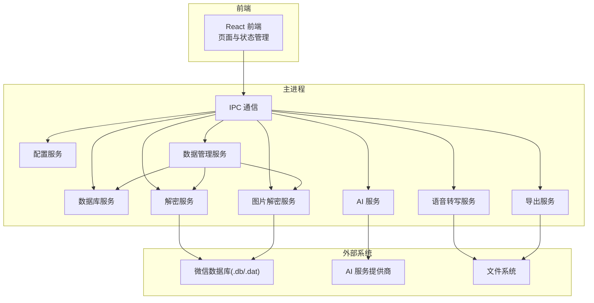
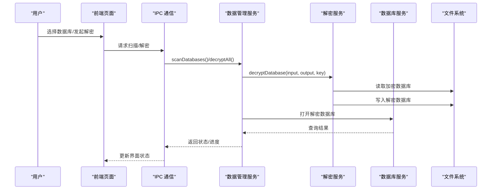
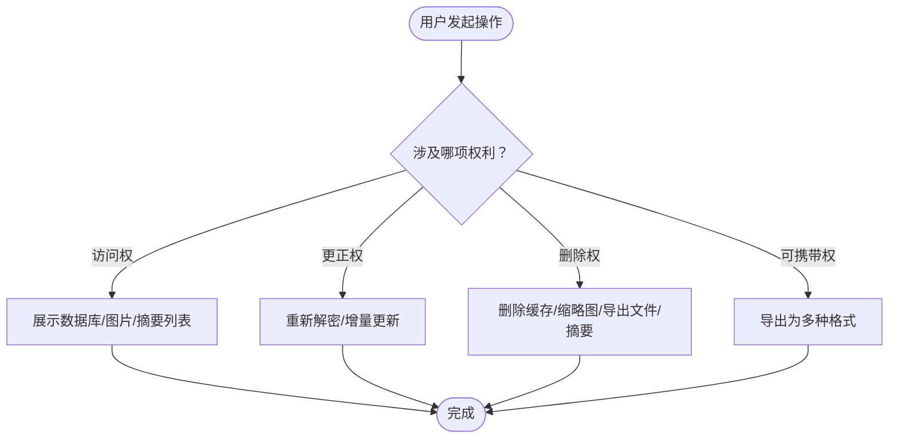
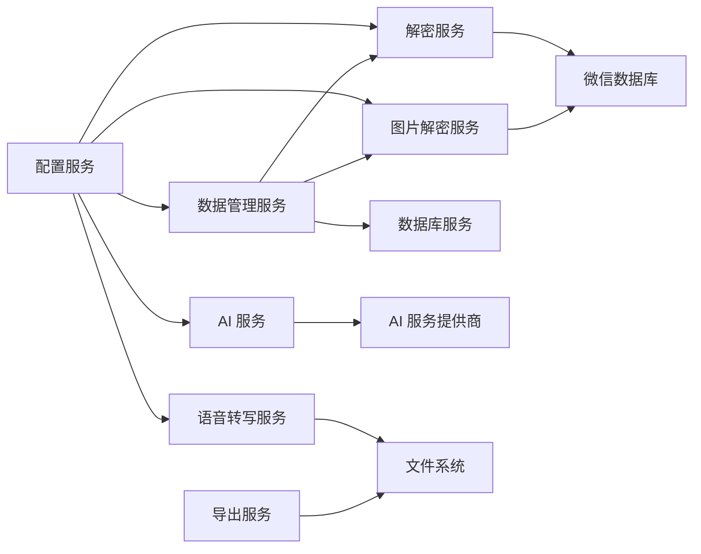

# 合规性考虑

<cite>
**本文档引用的文件**
- [README.md](file://README.md)
- [CONTRIBUTING.md](file://CONTRIBUTING.md)
- [TODO.md](file://TODO.md)
- [DataManagementPage.tsx](file://src/pages/DataManagementPage.tsx)
- [dataManagementService.ts](file://electron/services/dataManagementService.ts)
- [database.ts](file://electron/services/database.ts)
- [decryptService.ts](file://electron/services/decryptService.ts)
- [aiService.ts](file://electron/services/ai/aiService.ts)
- [aiDatabase.ts](file://electron/services/ai/aiDatabase.ts)
- [voiceTranscribeService.ts](file://electron/services/voiceTranscribeService.ts)
- [imageDecryptService.ts](file://electron/services/imageDecryptService.ts)
- [exportService.ts](file://electron/services/exportService.ts)
- [config.ts](file://electron/services/config.ts)
- [appStore.ts](file://src/stores/appStore.ts)
</cite>

## 目录
1. [简介](#简介)
2. [项目结构](#项目结构)
3. [核心组件](#核心组件)
4. [架构总览](#架构总览)
5. [详细组件分析](#详细组件分析)
6. [依赖关系分析](#依赖关系分析)
7. [性能考量](#性能考量)
8. [故障排除指南](#故障排除指南)
9. [结论](#结论)
10. [附录](#附录)

## 简介
本文件面向法务人员与合规顾问，围绕 CipherTalk 的数据处理活动，提供专业的法律与技术合规指导。结合项目源码，系统阐述以下合规议题：
- 数据处理合法性：GDPR 合规要求、个人信息保护法、数据处理目的限制
- 用户权利保障：访问权、更正权、删除权、数据可携带权
- 跨境数据传输：数据本地化要求、传输安全措施、第三国标准条款
- 合规架构设计：隐私影响评估、数据保护官职责、合规培训体系
- 法律声明模板：用户协议范本、隐私政策格式、免责声明条款
- 合规检查清单：数据处理映射、风险评估表格、合规审计清单

## 项目结构
CipherTalk 采用 Electron + React 技术栈，前端负责用户界面与交互，后端服务通过 IPC 与主进程通信，实现数据库解密、AI 摘要、语音转写、图片解密、导出等功能。项目模块化清晰，便于建立数据处理映射与合规控制点。

**图表来源**
- [DataManagementPage.tsx:1-800](file://src/pages/DataManagementPage.tsx#L1-L800)
- [dataManagementService.ts:1-800](file://electron/services/dataManagementService.ts#L1-L800)
- [config.ts:1-395](file://electron/services/config.ts#L1-L395)

**章节来源**
- [README.md:132-160](file://README.md#L132-L160)
- [TODO.md:1-83](file://TODO.md#L1-L83)

## 核心组件
- 数据管理服务：负责扫描、解密、增量更新数据库，维护解密状态与更新标志。
- 配置服务：集中管理数据库路径、密钥、缓存路径、AI 配置等敏感参数。
- 数据库服务：以只读方式打开解密后的 SQLite 数据库，执行查询。
- 解密服务：封装原生解密能力，提供密钥验证与解密流程。
- AI 服务：集成多家 AI 提供商，生成聊天摘要，维护摘要与用量统计。
- 语音转写服务：管理模型下载、缓存与转写任务。
- 图片解密服务：解析微信图片存储结构，解密 dat 文件并缓存结果。
- 导出服务：将聊天记录导出为多种格式，支持媒体文件处理。

**章节来源**
- [dataManagementService.ts:34-164](file://electron/services/dataManagementService.ts#L34-L164)
- [config.ts:6-80](file://electron/services/config.ts#L6-L80)
- [database.ts:5-82](file://electron/services/database.ts#L5-L82)
- [decryptService.ts:7-54](file://electron/services/decryptService.ts#L7-L54)
- [aiService.ts:58-631](file://electron/services/ai/aiService.ts#L58-L631)
- [voiceTranscribeService.ts:70-534](file://electron/services/voiceTranscribeService.ts#L70-L534)
- [imageDecryptService.ts:44-800](file://electron/services/imageDecryptService.ts#L44-L800)
- [exportService.ts:117-800](file://electron/services/exportService.ts#L117-L800)

## 架构总览
下图展示数据在系统内的流转路径，强调数据采集、处理、存储与删除的关键节点，便于映射合规控制点。

**图表来源**
- [DataManagementPage.tsx:55-123](file://src/pages/DataManagementPage.tsx#L55-L123)
- [dataManagementService.ts:285-367](file://electron/services/dataManagementService.ts#L285-L367)
- [decryptService.ts:21-50](file://electron/services/decryptService.ts#L21-L50)
- [database.ts:11-44](file://electron/services/database.ts#L11-L44)

## 详细组件分析

### 数据处理合法性与目的限制
- 处理目的限制：项目明确用于“查看与分析微信聊天记录”，解密与导出均围绕该目的展开，未超出用户授权范围。
- 数据最小化：仅在用户主动触发时读取与解密数据库；语音转写与图片解密按需进行。
- 透明度：前端展示数据库状态、解密进度与更新提示，保障用户知情权。

合规要点：
- 明确告知用户数据处理目的与范围；
- 仅在用户授权范围内处理数据；
- 提供撤销同意与删除数据的途径。

**章节来源**
- [README.md:41-191](file://README.md#L41-L191)
- [DataManagementPage.tsx:55-123](file://src/pages/DataManagementPage.tsx#L55-L123)

### 用户权利保障
- 访问权：前端展示数据库列表、解密状态与更新需求，用户可随时刷新与查看详情。
- 更正权：当前实现未提供直接更正数据库内容的功能，但可通过重新解密与增量更新修正状态。
- 删除权：提供批量删除图片缓存与缩略图功能；导出服务支持删除导出文件；AI 摘要可删除。
- 数据可携带权：导出服务支持多种格式（TXT、HTML、Excel、JSON、SQL 等），满足数据可携带性。

**图表来源**
- [DataManagementPage.tsx:413-535](file://src/pages/DataManagementPage.tsx#L413-L535)
- [exportService.ts:117-800](file://electron/services/exportService.ts#L117-L800)
- [aiDatabase.ts:290-322](file://electron/services/ai/aiDatabase.ts#L290-L322)

**章节来源**
- [DataManagementPage.tsx:413-535](file://src/pages/DataManagementPage.tsx#L413-L535)
- [exportService.ts:86-96](file://electron/services/exportService.ts#L86-L96)

### 跨境数据传输
- 数据本地化：配置服务支持自定义缓存路径，默认缓存目录位于用户文档目录或安装目录，避免将数据存储在境外。
- 传输安全：AI 服务通过代理服务创建代理 Agent，增强网络访问安全性与可控性。
- 第三国标准条款：项目未内置标准合同条款，建议在用户协议中明确第三方服务提供商所在司法管辖区与数据保护水平。

**章节来源**
- [config.ts:387-394](file://electron/services/config.ts#L387-L394)
- [aiService.ts:69-90](file://electron/services/ai/aiService.ts#L69-L90)

### 合规架构设计
- 隐私影响评估：建议对 AI 摘要、语音转写、图片解密等处理活动进行PIA，评估风险并制定控制措施。
- 数据保护官职责：建议指定专人负责数据处理合规监督、培训与审计。
- 合规培训体系：基于项目模块划分，组织前端界面、后端服务、AI 与导出等模块的专项培训。

**章节来源**
- [aiService.ts:58-83](file://electron/services/ai/aiService.ts#L58-L83)
- [voiceTranscribeService.ts:103-137](file://electron/services/voiceTranscribeService.ts#L103-L137)

### 法律声明模板
以下为合规声明模板要点，建议纳入用户协议与隐私政策：

- 用户协议范本要点
  - 明确服务范围与数据处理目的
  - 用户授权与同意机制
  - 免责声明与责任限制
  - 数据删除与可携带权说明

- 隐私政策格式
  - 数据类别与处理目的
  - 数据来源与使用范围
  - 第三方共享与国际传输
  - 用户权利与行使方式
  - 数据保留期限与安全措施

- 免责声明条款
  - 仅供学习与研究使用
  - 遵守法律法规
  - 使用后果自负
  - 不得用于非法用途

**章节来源**
- [README.md:266-298](file://README.md#L266-L298)
- [README.md:301-310](file://README.md#L301-L310)

### 合规检查清单
- 数据处理映射
  - 数据来源：微信数据库(.db/.dat)
  - 处理活动：扫描、解密、增量更新、AI 摘要、语音转写、图片解密、导出
  - 数据去向：本地缓存、用户导出文件、第三方 AI 服务

- 风险评估表格
  - 风险类别：数据泄露、未授权访问、跨境传输、第三方依赖
  - 影响等级：高/中/低
  - 现有控制：密钥管理、代理访问、缓存清理、导出限制
  - 残余风险与缓解措施

- 合规审计清单
  - 配置项检查：密钥、缓存路径、AI 配置
  - 数据生命周期：采集、处理、存储、删除
  - 用户权利实现：访问、更正、删除、可携带
  - 第三方服务：API 密钥、代理配置、传输安全

**章节来源**
- [config.ts:6-80](file://electron/services/config.ts#L6-L80)
- [exportService.ts:86-96](file://electron/services/exportService.ts#L86-L96)

## 依赖关系分析

**图表来源**
- [config.ts:126-134](file://electron/services/config.ts#L126-L134)
- [dataManagementService.ts:34-50](file://electron/services/dataManagementService.ts#L34-L50)
- [aiService.ts:58-64](file://electron/services/ai/aiService.ts#L58-L64)

**章节来源**
- [config.ts:126-134](file://electron/services/config.ts#L126-L134)
- [aiService.ts:58-64](file://electron/services/ai/aiService.ts#L58-L64)

## 性能考量
- 批量解密与增量更新：采用进度事件与 UI 刷新分离，避免阻塞主线程。
- 数据库连接：以只读方式打开数据库，降低并发冲突风险。
- 缓存策略：AI 摘要与语音转写均采用本地缓存，减少重复处理与网络依赖。
- 文件系统：图片解密与导出采用异步与分块处理，提升稳定性。

**章节来源**
- [dataManagementService.ts:350-367](file://electron/services/dataManagementService.ts#L350-L367)
- [database.ts:18-24](file://electron/services/database.ts#L18-L24)
- [aiDatabase.ts:169-176](file://electron/services/ai/aiDatabase.ts#L169-L176)
- [voiceTranscribeService.ts:172-187](file://electron/services/voiceTranscribeService.ts#L172-L187)

## 故障排除指南
- 解密失败
  - 检查密钥配置与数据库路径
  - 确认缓存目录可写
  - 查看进度事件与错误日志

- AI 连接失败
  - 检查 API Key 与代理配置
  - 确认网络可达性
  - 尝试更换提供商或模型

- 图片解密异常
  - 确认 dat 文件存在且可读
  - 检查缓存完整性与扩展名推断
  - 若为 wxgf 格式，检查 ffmpeg 安装

- 导出失败
  - 检查导出路径权限
  - 确认会话消息表存在
  - 清理缓存后重试

**章节来源**
- [DataManagementPage.tsx:258-297](file://src/pages/DataManagementPage.tsx#L258-L297)
- [aiService.ts:544-557](file://electron/services/ai/aiService.ts#L544-L557)
- [imageDecryptService.ts:299-303](file://electron/services/imageDecryptService.ts#L299-L303)
- [exportService.ts:717-748](file://electron/services/exportService.ts#L717-L748)

## 结论
CipherTalk 的数据处理活动围绕“查看与分析微信聊天记录”这一明确目的展开，具备清晰的模块化架构与可观测的处理流程。通过强化配置管理、代理访问与缓存策略，可在保障用户体验的同时满足合规要求。建议结合本文模板与清单，完善用户协议、隐私政策与内部合规体系，持续开展PIA与审计，确保数据处理合法、透明、可追溯。

## 附录
- 术语说明
  - 解密：将微信加密数据库转换为可读 SQLite 数据库的过程
  - 增量更新：仅更新发生变化的数据库文件，保证数据一致性
  - 缓存：本地持久化存储，减少重复处理与网络依赖
  - 代理：通过代理服务器访问第三方 AI 服务，增强可控性与安全性