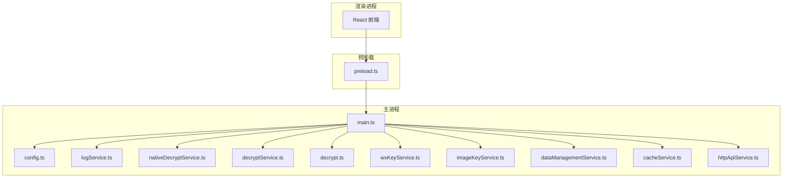
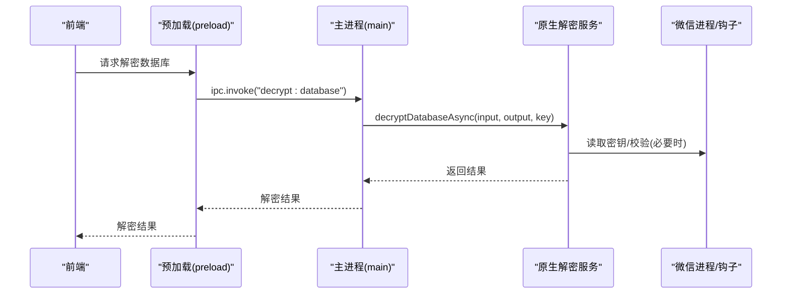
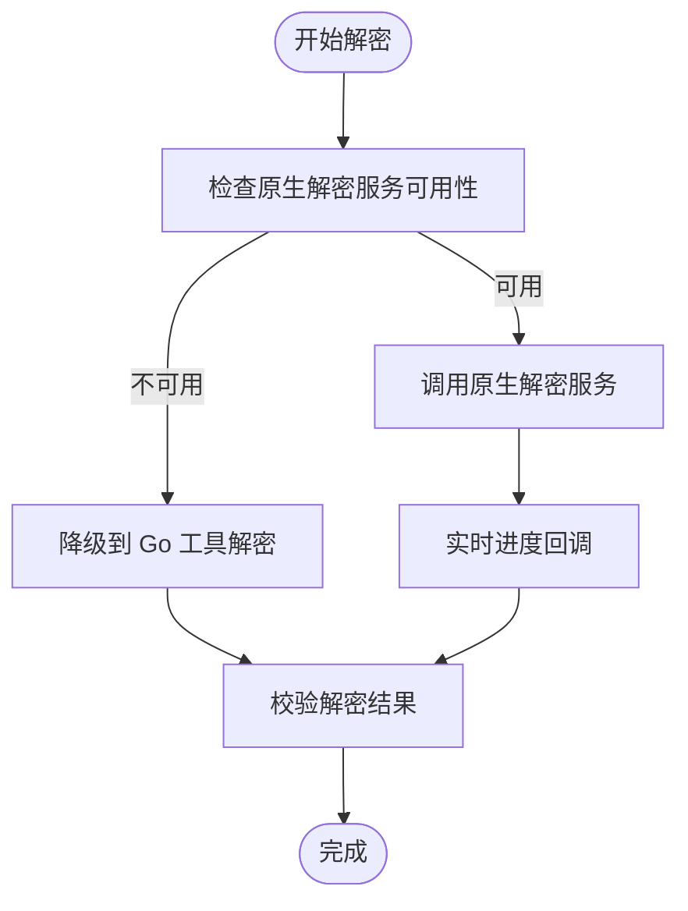
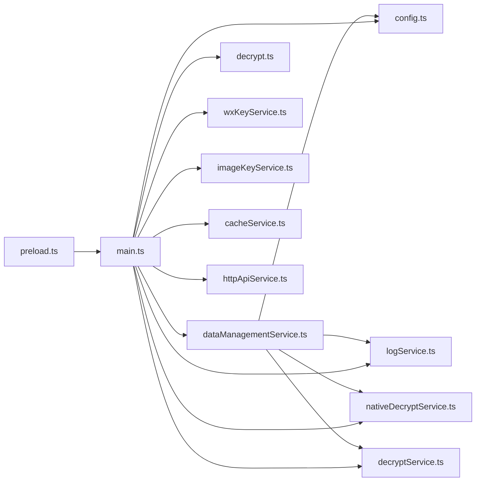

# 安全和隐私

<cite>
**本文引用的文件**
- [decryptService.ts](file://electron/services/decryptService.ts)
- [decrypt.ts](file://electron/services/decrypt.ts)
- [wxKeyService.ts](file://electron/services/wxKeyService.ts)
- [imageKeyService.ts](file://electron/services/imageKeyService.ts)
- [nativeDecryptService.ts](file://electron/services/nativeDecryptService.ts)
- [dataManagementService.ts](file://electron/services/dataManagementService.ts)
- [cacheService.ts](file://electron/services/cacheService.ts)
- [config.ts](file://electron/services/config.ts)
- [logService.ts](file://electron/services/logService.ts)
- [httpApiService.ts](file://electron/services/httpApiService.ts)
- [main.ts](file://electron/main.ts)
- [preload.ts](file://electron/preload.ts)
- [crypto.ts](file://src/utils/crypto.ts)
- [README.md](file://README.md)
</cite>

## 目录
1. [简介](#简介)
2. [项目结构](#项目结构)
3. [核心组件](#核心组件)
4. [架构总览](#架构总览)
5. [详细组件分析](#详细组件分析)
6. [依赖分析](#依赖分析)
7. [性能考量](#性能考量)
8. [故障排查指南](#故障排查指南)
9. [结论](#结论)
10. [附录](#附录)

## 简介
本文件面向安全工程师与合规人员，系统梳理 CipherTalk 在“数据加密处理、隐私保护策略、安全审计机制、合规性考虑、访问控制与安全配置、安全开发最佳实践”等方面的设计与实现要点。重点覆盖微信聊天记录解密链路（密钥获取、数据库与图片解密）、密钥与配置管理、本地缓存与日志策略、HTTP API 安全、以及前端渲染隔离与 IPC 通道安全。

## 项目结构
- 主进程（Electron）负责：
  - 解密服务与密钥服务（数据库、图片、微信进程钩子）
  - 数据管理与缓存清理
  - 配置持久化与日志
  - HTTP API 服务（本地回环）
- 预加载脚本（preload）桥接渲染进程与主进程，暴露受控 API
- 前端（React + TS）通过预加载 API 安全调用主进程能力

图示来源
- [main.ts](file://electron/main.ts)
- [preload.ts](file://electron/preload.ts)
- [config.ts](file://electron/services/config.ts)
- [logService.ts](file://electron/services/logService.ts)
- [nativeDecryptService.ts](file://electron/services/nativeDecryptService.ts)
- [decryptService.ts](file://electron/services/decryptService.ts)
- [decrypt.ts](file://electron/services/decrypt.ts)
- [wxKeyService.ts](file://electron/services/wxKeyService.ts)
- [imageKeyService.ts](file://electron/services/imageKeyService.ts)
- [dataManagementService.ts](file://electron/services/dataManagementService.ts)
- [cacheService.ts](file://electron/services/cacheService.ts)
- [httpApiService.ts](file://electron/services/httpApiService.ts)

章节来源
- [main.ts](file://electron/main.ts)
- [preload.ts](file://electron/preload.ts)

## 核心组件
- 数据库解密链路
  - 原生 Worker 解密服务：[nativeDecryptService.ts](file://electron/services/nativeDecryptService.ts)
  - 解密服务封装：[decryptService.ts](file://electron/services/decryptService.ts)
  - Go 工具解密（备用）：[decrypt.ts](file://electron/services/decrypt.ts)
- 密钥与微信进程集成
  - DLL 钩子与密钥轮询：[wxKeyService.ts](file://electron/services/wxKeyService.ts)
  - 图片密钥内存扫描（兜底）：[imageKeyService.ts](file://electron/services/imageKeyService.ts)
- 数据管理与缓存
  - 数据库扫描与增量更新：[dataManagementService.ts](file://electron/services/dataManagementService.ts)
  - 缓存清理与配额：[cacheService.ts](file://electron/services/cacheService.ts)
- 配置与日志
  - SQLite 配置存储：[config.ts](file://electron/services/config.ts)
  - 日志分级与轮转：[logService.ts](file://electron/services/logService.ts)
- HTTP API
  - 本地回环服务与鉴权：[httpApiService.ts](file://electron/services/httpApiService.ts)
- 前端安全桥接
  - 预加载 API 暴露与隔离：[preload.ts](file://electron/preload.ts)

章节来源
- [nativeDecryptService.ts](file://electron/services/nativeDecryptService.ts)
- [decryptService.ts](file://electron/services/decryptService.ts)
- [decrypt.ts](file://electron/services/decrypt.ts)
- [wxKeyService.ts](file://electron/services/wxKeyService.ts)
- [imageKeyService.ts](file://electron/services/imageKeyService.ts)
- [dataManagementService.ts](file://electron/services/dataManagementService.ts)
- [cacheService.ts](file://electron/services/cacheService.ts)
- [config.ts](file://electron/services/config.ts)
- [logService.ts](file://electron/services/logService.ts)
- [httpApiService.ts](file://electron/services/httpApiService.ts)
- [preload.ts](file://electron/preload.ts)

## 架构总览
CipherTalk 的安全架构围绕“最小权限、本地处理、强隔离、可控暴露”的原则设计：
- 解密与密钥获取均在主进程执行，避免前端直接接触敏感数据
- 通过预加载脚本的 contextBridge 暴露受控 IPC API，前端仅能调用白名单接口
- HTTP API 仅监听本地回环地址，支持可选 Bearer Token 鉴权
- 配置与日志分离存储，日志默认低级别，可动态调整

图示来源
- [preload.ts](file://electron/preload.ts)
- [main.ts](file://electron/main.ts)
- [nativeDecryptService.ts](file://electron/services/nativeDecryptService.ts)
- [decryptService.ts](file://electron/services/decryptService.ts)

## 详细组件分析

### 数据加密处理：微信聊天记录解密算法与密钥管理
- 数据库解密
  - 原生 Worker 解密：通过独立 worker 线程加载 DLL 执行解密，避免主线程阻塞；支持进度回调与错误传播。[nativeDecryptService.ts](file://electron/services/nativeDecryptService.ts)
  - 服务封装：对外提供统一接口，内部检查服务可用性与错误处理。[decryptService.ts](file://electron/services/decryptService.ts)
  - 备用方案：Go 工具解密（spawn 子进程），适用于特定场景或兼容性需求。[decrypt.ts](file://electron/services/decrypt.ts)
- 图片解密
  - XOR 解密：基于文件头特征检测并计算 XOR 密钥，逐字节异或解密。[decrypt.ts](file://electron/services/decrypt.ts)
  - AES 密钥兜底：通过扫描微信进程内存定位密钥，结合模板文件密文验证，确保解密正确性。[imageKeyService.ts](file://electron/services/imageKeyService.ts)
- 密钥管理
  - DLL 钩子：扫描微信进程内存获取密钥，支持轮询与状态上报，失败时提供错误信息。[wxKeyService.ts](file://electron/services/wxKeyService.ts)
  - 配置存储：解密密钥、图片密钥、缓存路径等通过 SQLite 配置表持久化。[config.ts](file://electron/services/config.ts)

图示来源
- [nativeDecryptService.ts](file://electron/services/nativeDecryptService.ts)
- [decryptService.ts](file://electron/services/decryptService.ts)
- [decrypt.ts](file://electron/services/decrypt.ts)

章节来源
- [nativeDecryptService.ts](file://electron/services/nativeDecryptService.ts)
- [decryptService.ts](file://electron/services/decryptService.ts)
- [decrypt.ts](file://electron/services/decrypt.ts)
- [wxKeyService.ts](file://electron/services/wxKeyService.ts)
- [imageKeyService.ts](file://electron/services/imageKeyService.ts)
- [config.ts](file://electron/services/config.ts)

### 隐私保护策略：数据最小化、本地存储限制、用户知情同意
- 数据最小化
  - 仅在用户明确配置数据库路径、wxid、解密密钥后才进行解密与扫描。[dataManagementService.ts](file://electron/services/dataManagementService.ts)
  - 图片与表情包缓存按需清理，支持仅清理数据库缓存而不影响媒体缓存。[cacheService.ts](file://electron/services/cacheService.ts)
- 本地存储限制
  - 缓存目录默认位于用户文档目录或安装目录，避免写入受限路径；支持迁移与清理。[cacheService.ts](file://electron/services/cacheService.ts)
  - 日志默认仅记录警告及以上级别，文件大小与数量限制，定期轮转与清理。[logService.ts](file://electron/services/logService.ts)
- 用户知情同意
  - HTTP API 默认禁用，需在设置中启用并配置 Token；健康状态接口明确提示是否需要配置。[httpApiService.ts](file://electron/services/httpApiService.ts)
  - README 明确免责声明与使用范围，强调仅限学习与研究使用。[README.md](file://README.md)

章节来源
- [dataManagementService.ts](file://electron/services/dataManagementService.ts)
- [cacheService.ts](file://electron/services/cacheService.ts)
- [logService.ts](file://electron/services/logService.ts)
- [httpApiService.ts](file://electron/services/httpApiService.ts)
- [README.md](file://README.md)

### 安全审计机制：代码审查流程、漏洞扫描、安全测试
- 代码审查
  - 通过 GitHub Discussions 与 Issues 进行协作与评审；贡献指南明确提交规范与审查流程。[README.md](file://README.md)
- 漏洞扫描
  - 项目包含依赖与第三方模块说明，建议在 CI 中集成依赖漏洞扫描（例如 npm audit 或 SCA 工具）。
- 安全测试
  - 配置与日志服务具备默认安全阈值（日志级别、文件轮转），便于审计与取证。[config.ts](file://electron/services/config.ts) [logService.ts](file://electron/services/logService.ts)
  - HTTP API 支持鉴权与健康检查，便于自动化安全测试与监控。[httpApiService.ts](file://electron/services/httpApiService.ts)

章节来源
- [README.md](file://README.md)
- [config.ts](file://electron/services/config.ts)
- [logService.ts](file://electron/services/logService.ts)
- [httpApiService.ts](file://electron/services/httpApiService.ts)

### 合规性考虑：数据处理合法性、用户权利保障、跨境数据传输
- 数据处理合法性
  - 项目明确仅限学习与研究使用，禁止商业用途；用户需自行承担使用风险。[README.md](file://README.md)
- 用户权利保障
  - 支持一键清理数据库缓存、图片缓存、表情包缓存与日志，保障用户删除权与可携带权。[cacheService.ts](file://electron/services/cacheService.ts) [logService.ts](file://electron/services/logService.ts)
- 跨境数据传输
  - HTTP API 默认仅监听本地回环地址，避免无意的公网暴露；如需远程访问，应配合企业防火墙与反向代理策略。[httpApiService.ts](file://electron/services/httpApiService.ts)

章节来源
- [README.md](file://README.md)
- [cacheService.ts](file://electron/services/cacheService.ts)
- [logService.ts](file://electron/services/logService.ts)
- [httpApiService.ts](file://electron/services/httpApiService.ts)

### 访问控制：权限管理、身份验证、会话管理
- 权限管理
  - 仅在用户授权后执行微信进程检测与密钥获取；支持关闭微信进程、等待窗口出现等操作。[wxKeyService.ts](file://electron/services/wxKeyService.ts)
- 身份验证
  - HTTP API 支持 Bearer Token 鉴权；未配置 Token 时仅公开健康检查接口。[httpApiService.ts](file://electron/services/httpApiService.ts)
- 会话管理
  - 预加载脚本通过 contextBridge 暴露受控 API，前端仅能调用白名单接口，避免越权访问。[preload.ts](file://electron/preload.ts)

章节来源
- [wxKeyService.ts](file://electron/services/wxKeyService.ts)
- [httpApiService.ts](file://electron/services/httpApiService.ts)
- [preload.ts](file://electron/preload.ts)

### 安全配置：HTTPS 强制、CSP 策略、XSS 防护
- HTTPS 强制
  - HTTP API 仅监听本地回环地址，避免明文 HTTP 暴露于公网。[httpApiService.ts](file://electron/services/httpApiService.ts)
- CSP 策略
  - 主进程窗口创建时启用上下文隔离与 webSecurity 控制，前端通过预加载脚本安全桥接。[main.ts](file://electron/main.ts) [preload.ts](file://electron/preload.ts)
- XSS 防护
  - 通过 contextIsolation 与 contextBridge 限制渲染进程对 Node.js 的直接访问，避免脚本注入风险。[main.ts](file://electron/main.ts) [preload.ts](file://electron/preload.ts)

章节来源
- [main.ts](file://electron/main.ts)
- [preload.ts](file://electron/preload.ts)
- [httpApiService.ts](file://electron/services/httpApiService.ts)

### 安全开发最佳实践：输入验证、输出编码、安全编码规范
- 输入验证
  - HTTP API 对查询参数进行类型解析与范围校验（布尔、整数、时间戳、集合等）。[httpApiService.ts](file://electron/services/httpApiService.ts)
  - 配置项通过 SQLite 存储与默认值约束，避免无效配置影响功能。[config.ts](file://electron/services/config.ts)
- 输出编码
  - 日志记录对复杂数据进行 JSON 序列化与环形引用保护，避免序列化异常。[logService.ts](file://electron/services/logService.ts)
- 安全编码规范
  - 前端密码哈希采用 PBKDF2（Web Crypto Subtle），迭代次数与盐值可控。[crypto.ts](file://src/utils/crypto.ts)
  - 预加载 API 仅暴露必要接口，避免将敏感主进程能力直接暴露给渲染进程。

章节来源
- [httpApiService.ts](file://electron/services/httpApiService.ts)
- [config.ts](file://electron/services/config.ts)
- [logService.ts](file://electron/services/logService.ts)
- [crypto.ts](file://src/utils/crypto.ts)
- [preload.ts](file://electron/preload.ts)

## 依赖分析
- 组件耦合
  - 数据管理服务依赖配置服务、解密服务与聊天服务，形成“扫描—解密—更新—通知”的闭环。[dataManagementService.ts](file://electron/services/dataManagementService.ts)
  - 预加载脚本集中暴露 API，降低渲染进程对主进程细节的耦合度。[preload.ts](file://electron/preload.ts)
- 外部依赖
  - better-sqlite3 用于配置与日志存储；worker_threads 用于原生解密；koffi 用于 DLL 钩子；node:crypto 与 WebCrypto 用于密码学操作。

图示来源
- [dataManagementService.ts](file://electron/services/dataManagementService.ts)
- [config.ts](file://electron/services/config.ts)
- [logService.ts](file://electron/services/logService.ts)
- [nativeDecryptService.ts](file://electron/services/nativeDecryptService.ts)
- [decryptService.ts](file://electron/services/decryptService.ts)
- [decrypt.ts](file://electron/services/decrypt.ts)
- [wxKeyService.ts](file://electron/services/wxKeyService.ts)
- [imageKeyService.ts](file://electron/services/imageKeyService.ts)
- [cacheService.ts](file://electron/services/cacheService.ts)
- [httpApiService.ts](file://electron/services/httpApiService.ts)
- [main.ts](file://electron/main.ts)
- [preload.ts](file://electron/preload.ts)

章节来源
- [dataManagementService.ts](file://electron/services/dataManagementService.ts)
- [preload.ts](file://electron/preload.ts)
- [main.ts](file://electron/main.ts)

## 性能考量
- 解密性能
  - 原生 Worker 解密避免主线程阻塞，支持实时进度回调；数据库完整性检查可配置跳过以提升性能。[nativeDecryptService.ts](file://electron/services/nativeDecryptService.ts) [dataManagementService.ts](file://electron/services/dataManagementService.ts)
- I/O 与缓存
  - 增量更新采用“临时文件—原子替换”策略，减少对用户现有数据库的影响；缓存清理与大小统计支持按需回收空间。[dataManagementService.ts](file://electron/services/dataManagementService.ts) [cacheService.ts](file://electron/services/cacheService.ts)
- 日志与审计
  - 日志文件大小与数量限制、轮转与清理，避免磁盘膨胀影响性能。[logService.ts](file://electron/services/logService.ts)

章节来源
- [nativeDecryptService.ts](file://electron/services/nativeDecryptService.ts)
- [dataManagementService.ts](file://electron/services/dataManagementService.ts)
- [cacheService.ts](file://electron/services/cacheService.ts)
- [logService.ts](file://electron/services/logService.ts)

## 故障排查指南
- 解密失败
  - 检查原生解密服务可用性与错误信息；确认密钥正确、数据库路径与 wxid 配置；必要时启用 Go 工具解密作为备选。[decryptService.ts](file://electron/services/decryptService.ts) [decrypt.ts](file://electron/services/decrypt.ts)
- 密钥获取异常
  - 确认微信进程状态、DLL 加载情况与轮询状态；查看错误信息与日志。[wxKeyService.ts](file://electron/services/wxKeyService.ts)
- HTTP API 无法访问
  - 检查是否启用、端口占用、Token 是否正确；通过健康检查与状态接口诊断。[httpApiService.ts](file://electron/services/httpApiService.ts)
- 缓存与日志问题
  - 使用缓存清理与日志清理功能；检查日志级别与轮转策略。[cacheService.ts](file://electron/services/cacheService.ts) [logService.ts](file://electron/services/logService.ts)

章节来源
- [decryptService.ts](file://electron/services/decryptService.ts)
- [decrypt.ts](file://electron/services/decrypt.ts)
- [wxKeyService.ts](file://electron/services/wxKeyService.ts)
- [httpApiService.ts](file://electron/services/httpApiService.ts)
- [cacheService.ts](file://electron/services/cacheService.ts)
- [logService.ts](file://electron/services/logService.ts)

## 结论
CipherTalk 在安全与隐私方面遵循“最小权限、本地处理、强隔离、可控暴露”的设计原则：解密与密钥获取在主进程执行并通过预加载脚本安全桥接；HTTP API 仅本地回环并支持可选鉴权；配置与日志默认低风险阈值；提供一键清理与合规免责声明。建议在生产环境中进一步强化依赖扫描、网络边界防护与访问审计，以满足更严格的合规与安全要求。

## 附录
- 前端密码哈希（PBKDF2）：[crypto.ts](file://src/utils/crypto.ts)
- 项目免责声明与使用范围：[README.md](file://README.md)