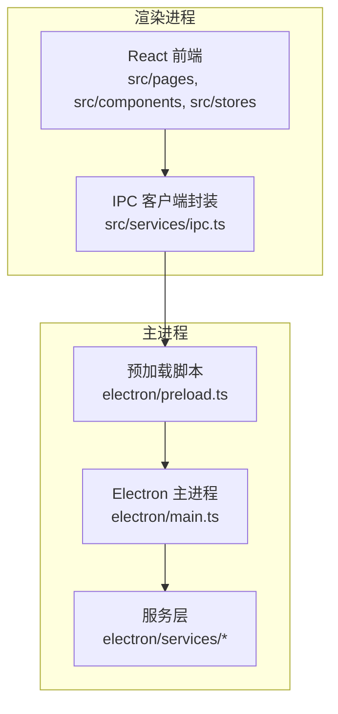
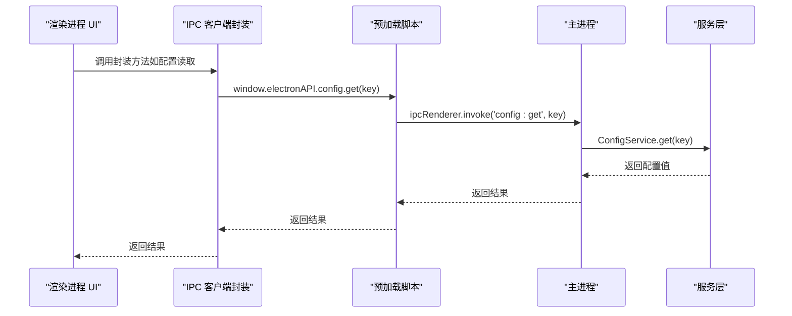
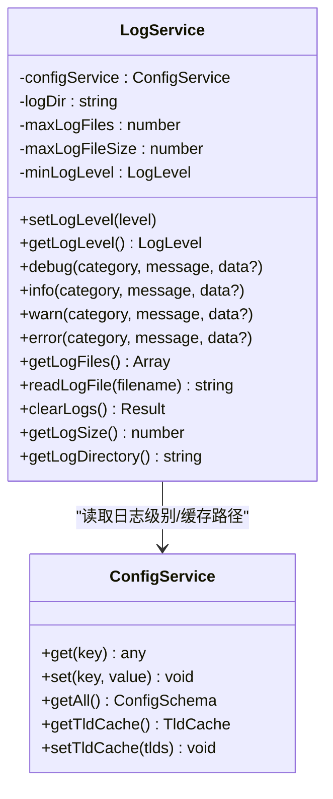
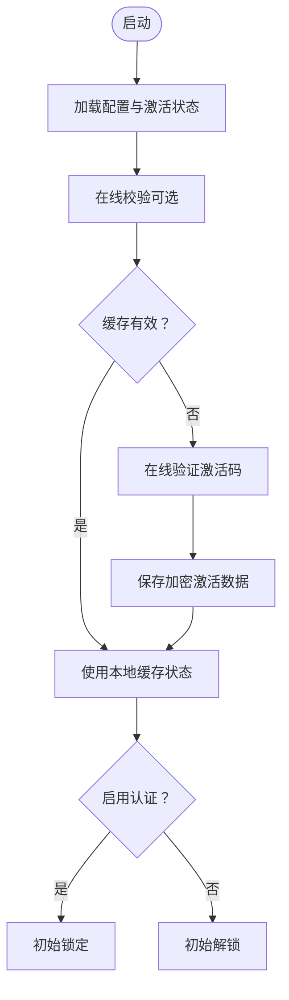
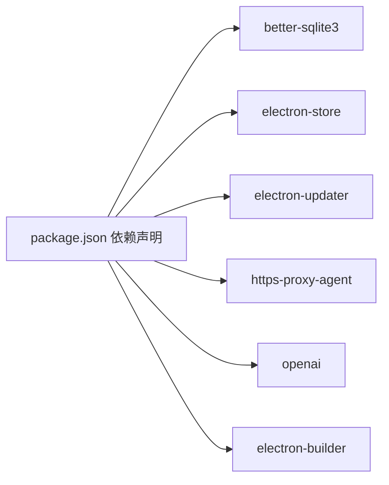

# 安全审计机制

<cite>
**本文档引用的文件**
- [README.md](file://README.md)
- [CONTRIBUTING.md](file://CONTRIBUTING.md)
- [package.json](file://package.json)
- [electron/main.ts](file://electron/main.ts)
- [electron/preload.ts](file://electron/preload.ts)
- [src/services/ipc.ts](file://src/services/ipc.ts)
- [electron/services/logService.ts](file://electron/services/logService.ts)
- [electron/services/activationService.ts](file://electron/services/activationService.ts)
- [electron/services/httpApiService.ts](file://electron/services/httpApiService.ts)
- [electron/services/cacheService.ts](file://electron/services/cacheService.ts)
- [electron/services/config.ts](file://electron/services/config.ts)
- [electron/services/database.ts](file://electron/services/database.ts)
- [src/stores/authStore.ts](file://src/stores/authStore.ts)
</cite>

## 目录
1. [简介](#简介)
2. [项目结构](#项目结构)
3. [核心组件](#核心组件)
4. [架构总览](#架构总览)
5. [详细组件分析](#详细组件分析)
6. [依赖分析](#依赖分析)
7. [性能考虑](#性能考虑)
8. [故障排除指南](#故障排除指南)
9. [结论](#结论)
10. [附录](#附录)

## 简介
本文件为 CipherTalk 的安全审计机制提供系统化技术文档，覆盖代码审查流程、漏洞扫描策略、安全测试方法、访问控制机制、日志审计系统与安全监控工具。文档面向安全工程师与开发团队，旨在提供可操作的实施指导与最佳实践。

## 项目结构
CipherTalk 采用 Electron + React 技术栈，主进程负责系统级能力（数据库、HTTP API、激活、日志、缓存等），渲染进程负责 UI 与业务逻辑。IPC 通道在主进程与渲染进程之间建立受控通信。

**图表来源**
- [electron/main.ts:1-800](file://electron/main.ts#L1-L800)
- [electron/preload.ts:1-454](file://electron/preload.ts#L1-L454)
- [src/services/ipc.ts:1-38](file://src/services/ipc.ts#L1-L38)

**章节来源**
- [README.md:132-159](file://README.md#L132-L159)
- [electron/main.ts:193-281](file://electron/main.ts#L193-L281)
- [electron/preload.ts:4-435](file://electron/preload.ts#L4-L435)
- [src/services/ipc.ts:1-38](file://src/services/ipc.ts#L1-L38)

## 核心组件
- 安全审计核心组件包括：日志服务、激活服务、HTTP API 服务、缓存服务、配置服务、数据库服务、认证状态管理、IPC 通信封装。
- 组件职责边界清晰，主进程集中处理敏感操作（数据库、文件系统、网络请求），渲染进程通过 IPC 请求受限能力。

**章节来源**
- [electron/services/logService.ts:20-331](file://electron/services/logService.ts#L20-L331)
- [electron/services/activationService.ts:38-516](file://electron/services/activationService.ts#L38-L516)
- [electron/services/httpApiService.ts:44-1236](file://electron/services/httpApiService.ts#L44-L1236)
- [electron/services/cacheService.ts:6-486](file://electron/services/cacheService.ts#L6-L486)
- [electron/services/config.ts:126-395](file://electron/services/config.ts#L126-L395)
- [electron/services/database.ts:5-83](file://electron/services/database.ts#L5-L83)
- [src/stores/authStore.ts:1-221](file://src/stores/authStore.ts#L1-L221)
- [electron/preload.ts:4-435](file://electron/preload.ts#L4-L435)

## 架构总览
主进程通过注册自定义协议、创建系统托盘、管理多窗口，以及暴露受控 IPC 接口；预加载脚本通过 contextBridge 暴露有限 API；渲染进程通过封装的 IPC 客户端调用主进程能力。

**图表来源**
- [src/services/ipc.ts:4-7](file://src/services/ipc.ts#L4-L7)
- [electron/preload.ts:6-11](file://electron/preload.ts#L6-L11)
- [electron/main.ts:1-35](file://electron/main.ts#L1-L35)

**章节来源**
- [electron/main.ts:37-56](file://electron/main.ts#L37-L56)
- [electron/main.ts:193-281](file://electron/main.ts#L193-L281)
- [electron/preload.ts:4-435](file://electron/preload.ts#L4-L435)
- [src/services/ipc.ts:1-38](file://src/services/ipc.ts#L1-L38)

## 详细组件分析

### 日志审计系统
- 日志服务支持按日期轮转、最大文件大小限制、保留数量上限、按级别过滤与持久化存储。
- 默认日志级别为警告及以上，可通过配置调整；日志目录基于缓存路径与用户数据目录组合。
- 提供读取、清理、统计日志目录大小等能力，便于审计与容量管理。

**图表来源**
- [electron/services/logService.ts:20-331](file://electron/services/logService.ts#L20-L331)
- [electron/services/config.ts:126-395](file://electron/services/config.ts#L126-L395)

**章节来源**
- [electron/services/logService.ts:27-98](file://electron/services/logService.ts#L27-L98)
- [electron/services/logService.ts:129-177](file://electron/services/logService.ts#L129-L177)
- [electron/services/logService.ts:242-330](file://electron/services/logService.ts#L242-L330)

### 访问控制机制
- 激活服务：设备指纹生成、本地加密存储、在线校验、离线缓存与签名验证，支持多种激活类型与到期计算。
- 认证状态管理：支持生物识别与密码两种解锁方式，状态持久化于配置服务，初始化时根据配置决定锁定/解锁状态。
- HTTP API：支持 Bearer Token 认证，未配置 Token 时默认放行，配置后对非健康检查端点进行鉴权。

**图表来源**
- [electron/services/activationService.ts:247-367](file://electron/services/activationService.ts#L247-L367)
- [src/stores/authStore.ts:67-88](file://src/stores/authStore.ts#L67-L88)

**章节来源**
- [electron/services/activationService.ts:38-516](file://electron/services/activationService.ts#L38-L516)
- [src/stores/authStore.ts:1-221](file://src/stores/authStore.ts#L1-L221)
- [electron/services/httpApiService.ts:164-167](file://electron/services/httpApiService.ts#L164-L167)

### 安全测试方法
- 渗透测试：针对 HTTP API 的鉴权绕过、参数注入、越权访问进行验证；结合日志审计定位异常请求。
- 模糊测试：对数据库查询、文件读写、图像解密等输入进行随机化测试，观察异常行为与崩溃。
- 安全回归测试：建立自动化用例，覆盖激活流程、认证解锁、日志级别变更、缓存清理等关键路径。

[本节为通用方法论说明，不直接分析具体文件]

### 代码审查流程
- Pull Request 审查标准：新增敏感操作需提供安全影响评估；涉及 IPC、文件系统、网络请求的变更需附带测试用例。
- 安全代码检查：启用 ESLint/TypeScript 类型检查，禁止使用 any、避免硬编码密钥、严格控制 NodeIntegration 与 webSecurity。
- 第三方依赖审核：定期扫描依赖漏洞，限制高风险依赖版本，使用 npm audit 或类似工具进行合规性检查。

**章节来源**
- [CONTRIBUTING.md:96-180](file://CONTRIBUTING.md#L96-L180)
- [README.md:96-128](file://README.md#L96-L128)
- [package.json:20-73](file://package.json#L20-L73)

### 漏洞扫描策略
- 静态代码分析：使用 TypeScript 严格模式与 ESLint 规则，检查潜在安全问题（如 XSS、注入、弱加密）。
- 动态安全测试：运行时监控异常日志、错误堆栈、未捕获异常；对 HTTP API 进行压力与边界测试。
- 依赖漏洞检测：集成依赖扫描工具，定期更新依赖并修复已知漏洞。

**章节来源**
- [CONTRIBUTING.md:96-121](file://CONTRIBUTING.md#L96-L121)
- [package.json:20-73](file://package.json#L20-L73)

### 会话安全管理
- 主进程窗口创建时启用 contextIsolation，禁用 NodeIntegration，允许加载本地文件但受 CSP 限制。
- 预加载脚本通过 contextBridge 暴露受控 API，避免直接暴露 Node.js 能力。
- HTTP API 仅监听本地回环地址，端口可配置，建议配合 Token 认证与防火墙策略。

**章节来源**
- [electron/main.ts:202-207](file://electron/main.ts#L202-L207)
- [electron/main.ts:44-56](file://electron/main.ts#L44-L56)
- [electron/preload.ts:4-435](file://electron/preload.ts#L4-L435)
- [electron/services/httpApiService.ts:47-62](file://electron/services/httpApiService.ts#L47-L62)

### 日志审计系统
- 日志轮转与清理：按日切分文件，超限自动轮转，保留固定数量最新文件。
- 审计报告生成：通过日志文件列表与内容读取，聚合异常事件与访问统计，形成审计报告。

**章节来源**
- [electron/services/logService.ts:103-177](file://electron/services/logService.ts#L103-L177)
- [electron/services/logService.ts:242-298](file://electron/services/logService.ts#L242-L298)

### 安全监控工具
- 实时威胁检测：结合日志级别与异常行为规则，触发告警；对频繁失败的认证与 API 请求进行标记。
- 入侵防护：限制 HTTP API 暴露范围（仅本地）、启用 Token 认证、对异常端口占用进行告警。
- 安全告警：通过日志服务记录告警事件，支持告警聚合与阈值配置。

**章节来源**
- [electron/services/httpApiService.ts:81-96](file://electron/services/httpApiService.ts#L81-L96)
- [electron/services/logService.ts:214-237](file://electron/services/logService.ts#L214-L237)

## 依赖分析
- 依赖管理：使用 better-sqlite3 存储配置与缓存，electron-store 管理应用状态，electron-updater 实现自动更新。
- 安全依赖：https-proxy-agent 用于代理，openai 等第三方 AI 服务集成需注意凭据管理与传输安全。
- 构建与打包：electron-builder 配置压缩与文件过滤，减少不必要的二进制文件暴露。

**图表来源**
- [package.json:20-73](file://package.json#L20-L73)
- [package.json:74-167](file://package.json#L74-L167)

**章节来源**
- [package.json:20-73](file://package.json#L20-L73)
- [package.json:74-167](file://package.json#L74-L167)

## 性能考虑
- 日志写入采用追加与轮转策略，避免大文件导致 I/O 延迟。
- 数据库查询使用只读连接，减少锁竞争；缓存清理与大小统计异步执行。
- HTTP API 分页与过滤参数控制查询规模，避免一次性返回大量数据。

[本节提供通用指导，不直接分析具体文件]

## 故障排除指南
- 激活失败：检查网络连通性、设备指纹生成是否成功、本地加密存储是否损坏。
- 日志无法写入：确认缓存路径可写、磁盘空间充足、文件权限正确。
- HTTP API 无法启动：检查端口占用、Token 配置、服务状态与错误信息。
- 认证解锁失败：确认密码哈希与盐值一致性、生物识别凭证有效性。

**章节来源**
- [electron/services/activationService.ts:150-171](file://electron/services/activationService.ts#L150-L171)
- [electron/services/logService.ts:130-162](file://electron/services/logService.ts#L130-L162)
- [electron/services/httpApiService.ts:81-96](file://electron/services/httpApiService.ts#L81-L96)
- [src/stores/authStore.ts:176-197](file://src/stores/authStore.ts#L176-L197)

## 结论
CipherTalk 的安全审计机制通过“主进程集中、渲染进程受限”的架构设计，结合日志审计、激活与认证、HTTP API 鉴权、缓存与配置管理等组件，形成了较为完整的安全体系。建议持续完善代码审查与漏洞扫描流程，强化安全测试与监控告警，确保系统在开发与运维全生命周期内的安全性。

## 附录
- 安全最佳实践清单
  - 严格限制 NodeIntegration 与 webSecurity 配置
  - 使用强加密与安全随机数生成密钥
  - 定期轮换与清理日志与缓存
  - 对外部 API 调用进行速率限制与凭据隔离
  - 建立自动化安全扫描与回归测试