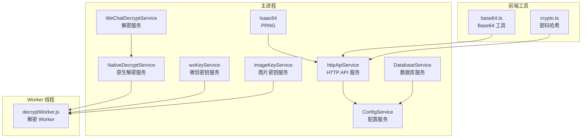
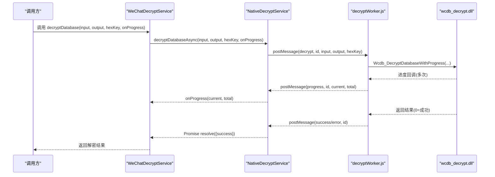
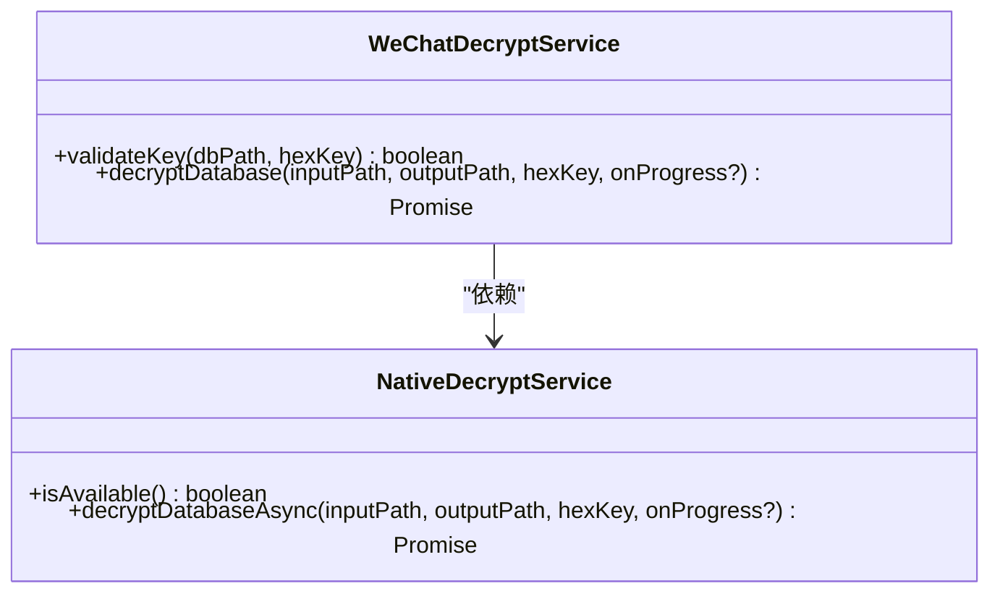
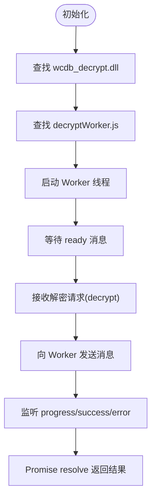
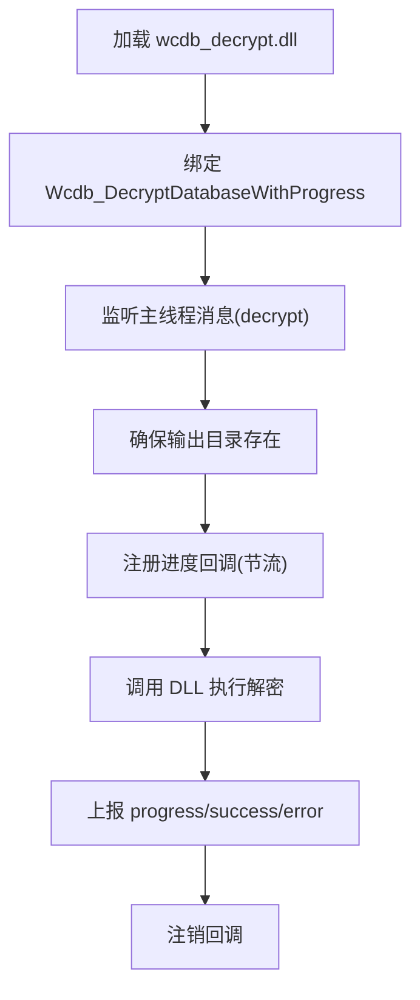
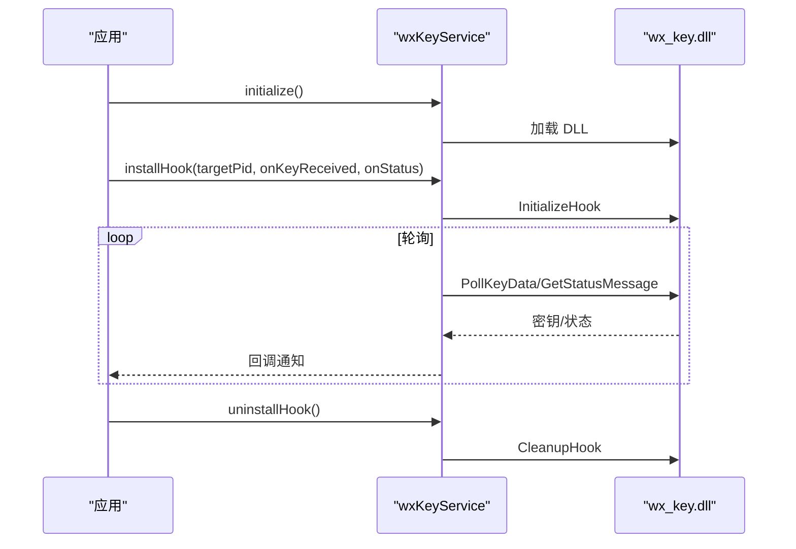
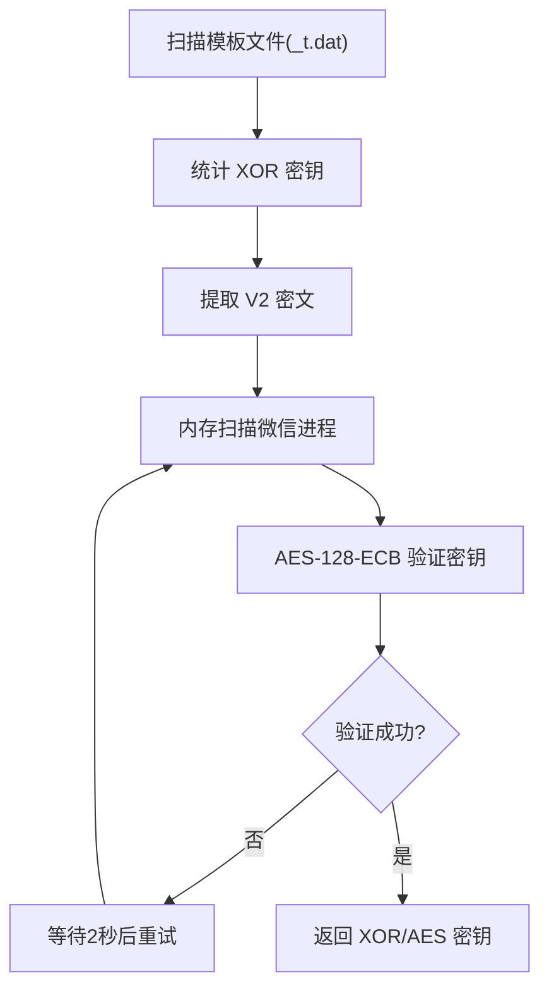
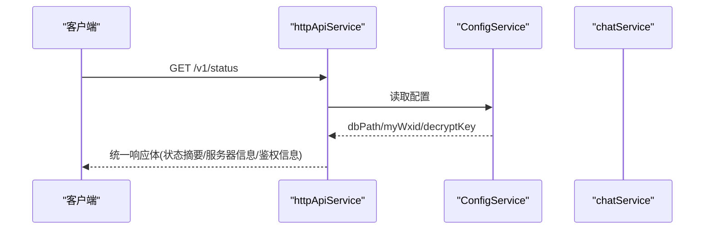
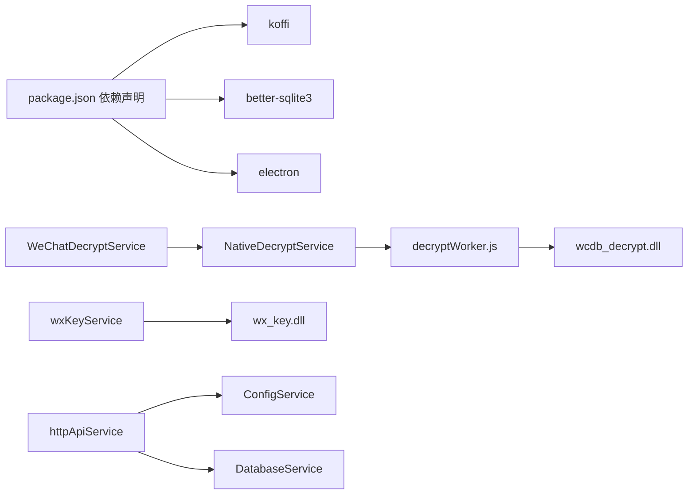

# 数据加密处理

<cite>
**本文档引用的文件**
- [decryptService.ts](file://electron/services/decryptService.ts)
- [nativeDecryptService.ts](file://electron/services/nativeDecryptService.ts)
- [decryptWorker.js](file://electron/workers/decryptWorker.js)
- [wxKeyService.ts](file://electron/services/wxKeyService.ts)
- [imageKeyService.ts](file://electron/services/imageKeyService.ts)
- [isaac64.ts](file://electron/services/isaac64.ts)
- [crypto.ts](file://src/utils/crypto.ts)
- [base64.ts](file://src/utils/base64.ts)
- [config.ts](file://electron/services/config.ts)
- [httpApiService.ts](file://electron/services/httpApiService.ts)
- [database.ts](file://electron/services/database.ts)
- [package.json](file://package.json)
</cite>

## 目录
1. [简介](#简介)
2. [项目结构](#项目结构)
3. [核心组件](#核心组件)
4. [架构总览](#架构总览)
5. [详细组件分析](#详细组件分析)
6. [依赖关系分析](#依赖关系分析)
7. [性能考虑](#性能考虑)
8. [故障排查指南](#故障排查指南)
9. [结论](#结论)
10. [附录](#附录)

## 简介
本文件面向安全工程师与加密开发人员，系统化梳理 CipherTalk 的数据加密处理能力，覆盖微信数据库 v4 解密、原生 DLL 实现与异步解密性能优化、密钥管理策略（验证、存储、轮换）、加密传输协议（数据传输加密、API 通信安全、证书验证）、解密服务架构（WeChatDecryptService 设计模式、错误处理、进度回调）、加密工具函数（Base64、哈希、随机数）、以及加密配置与性能调优。文档以代码为依据，辅以图示帮助理解。

## 项目结构
围绕加密与解密的关键模块分布如下：
- Electron 主进程服务层：解密服务、原生解密服务、密钥服务、图片密钥服务、HTTP API 服务、数据库服务、配置服务、ISAAC-64 随机数生成器
- Worker 线程：独立解密工作线程，承载原生 DLL 调用与进度回调
- 前端工具：Base64 编解码、密码哈希工具
- 依赖与打包：Electron、koffi、better-sqlite3 等

**图表来源**
- [decryptService.ts:1-54](file://electron/services/decryptService.ts#L1-L54)
- [nativeDecryptService.ts:1-216](file://electron/services/nativeDecryptService.ts#L1-L216)
- [decryptWorker.js:1-89](file://electron/workers/decryptWorker.js#L1-L89)
- [wxKeyService.ts:1-498](file://electron/services/wxKeyService.ts#L1-L498)
- [imageKeyService.ts:1-444](file://electron/services/imageKeyService.ts#L1-L444)
- [httpApiService.ts:1-1236](file://electron/services/httpApiService.ts#L1-L1236)
- [database.ts:1-83](file://electron/services/database.ts#L1-L83)
- [config.ts:1-395](file://electron/services/config.ts#L1-L395)
- [base64.ts:1-29](file://src/utils/base64.ts#L1-L29)
- [crypto.ts:1-31](file://src/utils/crypto.ts#L1-L31)
- [isaac64.ts:1-128](file://electron/services/isaac64.ts#L1-L128)

**章节来源**
- [decryptService.ts:1-54](file://electron/services/decryptService.ts#L1-L54)
- [nativeDecryptService.ts:1-216](file://electron/services/nativeDecryptService.ts#L1-L216)
- [decryptWorker.js:1-89](file://electron/workers/decryptWorker.js#L1-L89)
- [wxKeyService.ts:1-498](file://electron/services/wxKeyService.ts#L1-L498)
- [imageKeyService.ts:1-444](file://electron/services/imageKeyService.ts#L1-L444)
- [httpApiService.ts:1-1236](file://electron/services/httpApiService.ts#L1-L1236)
- [database.ts:1-83](file://electron/services/database.ts#L1-L83)
- [config.ts:1-395](file://electron/services/config.ts#L1-L395)
- [base64.ts:1-29](file://src/utils/base64.ts#L1-L29)
- [crypto.ts:1-31](file://src/utils/crypto.ts#L1-L31)
- [isaac64.ts:1-128](file://electron/services/isaac64.ts#L1-L128)

## 核心组件
- WeChatDecryptService：对外暴露的解密服务入口，封装原生 DLL 调用，提供异步解密与进度回调
- NativeDecryptService：负责 Worker 初始化、消息派发、任务管理、错误处理与可用性检测
- decryptWorker.js：独立线程内加载原生 DLL，执行解密并上报进度
- wxKeyService：微信密钥采集（Hook/扫描），支持状态轮询与错误获取
- imageKeyService：图片密钥提取（XOR/AES），内存扫描与密钥验证
- httpApiService：内置 HTTP API，提供认证、跨域、请求封装与响应格式化
- DatabaseService：基于 better-sqlite3 的只读数据库访问
- ConfigService：持久化配置（含密钥、路径、导出、HTTP API 等）
- 工具函数：Base64 编解码、PBKDF2 哈希、ISAAC-64 随机数

**章节来源**
- [decryptService.ts:1-54](file://electron/services/decryptService.ts#L1-L54)
- [nativeDecryptService.ts:1-216](file://electron/services/nativeDecryptService.ts#L1-L216)
- [decryptWorker.js:1-89](file://electron/workers/decryptWorker.js#L1-L89)
- [wxKeyService.ts:1-498](file://electron/services/wxKeyService.ts#L1-L498)
- [imageKeyService.ts:1-444](file://electron/services/imageKeyService.ts#L1-L444)
- [httpApiService.ts:1-1236](file://electron/services/httpApiService.ts#L1-L1236)
- [database.ts:1-83](file://electron/services/database.ts#L1-L83)
- [config.ts:1-395](file://electron/services/config.ts#L1-L395)
- [base64.ts:1-29](file://src/utils/base64.ts#L1-L29)
- [crypto.ts:1-31](file://src/utils/crypto.ts#L1-L31)
- [isaac64.ts:1-128](file://electron/services/isaac64.ts#L1-L128)

## 架构总览
整体采用“主进程服务 + Worker 线程 + 原生 DLL”的解密架构，避免主线程阻塞；密钥通过 DLL Hook 或本地扫描获取；HTTP API 提供外部集成能力；配置持久化与数据库访问由专用服务承担。

**图表来源**
- [decryptService.ts:21-50](file://electron/services/decryptService.ts#L21-L50)
- [nativeDecryptService.ts:180-211](file://electron/services/nativeDecryptService.ts#L180-L211)
- [decryptWorker.js:26-81](file://electron/workers/decryptWorker.js#L26-L81)

**章节来源**
- [decryptService.ts:1-54](file://electron/services/decryptService.ts#L1-L54)
- [nativeDecryptService.ts:1-216](file://electron/services/nativeDecryptService.ts#L1-L216)
- [decryptWorker.js:1-89](file://electron/workers/decryptWorker.js#L1-L89)

## 详细组件分析

### WeChatDecryptService（解密服务）
- 设计要点
  - 对外提供 validateKey 与 decryptDatabase 接口
  - 解密流程委托给 NativeDecryptService，保证异步与进度回调
  - 错误统一包装为 { success, error? } 结构
- 性能与可靠性
  - 通过 Worker 避免主线程阻塞
  - 依赖 isAvailable 健康检查，失败时返回明确错误
- 使用建议
  - 在 UI 层绑定 onProgress 实时展示进度
  - 解密前确保输入输出路径合法

**图表来源**
- [decryptService.ts:7-51](file://electron/services/decryptService.ts#L7-L51)
- [nativeDecryptService.ts:24-211](file://electron/services/nativeDecryptService.ts#L24-L211)

**章节来源**
- [decryptService.ts:1-54](file://electron/services/decryptService.ts#L1-L54)

### NativeDecryptService（原生解密服务）
- 初始化与定位
  - 自动查找 DLL 与 Worker 脚本路径，支持打包与开发两种模式
  - Worker 启动后监听 ready 消息，建立通信通道
- 任务管理
  - 为每个解密请求生成唯一 id，维护任务映射
  - 支持进度回调与错误上报
- 可用性与容错
  - isAvailable 检查 Worker 状态
  - Worker 异常退出时清理状态并允许后续重试初始化

**图表来源**
- [nativeDecryptService.ts:38-86](file://electron/services/nativeDecryptService.ts#L38-L86)
- [nativeDecryptService.ts:180-211](file://electron/services/nativeDecryptService.ts#L180-L211)
- [decryptWorker.js:26-81](file://electron/workers/decryptWorker.js#L26-L81)

**章节来源**
- [nativeDecryptService.ts:1-216](file://electron/services/nativeDecryptService.ts#L1-L216)
- [decryptWorker.js:1-89](file://electron/workers/decryptWorker.js#L1-L89)

### decryptWorker.js（解密 Worker）
- 职责
  - 加载原生 DLL，绑定进度回调
  - 执行 Wcdb_DecryptDatabaseWithProgress，按 100ms 节流上报进度
  - 捕获错误并返回错误信息
- 资源管理
  - 回调注销，避免泄漏
  - 输出目录不存在时自动创建

**图表来源**
- [decryptWorker.js:14-88](file://electron/workers/decryptWorker.js#L14-L88)

**章节来源**
- [decryptWorker.js:1-89](file://electron/workers/decryptWorker.js#L1-L89)

### wxKeyService（微信密钥服务）
- 功能
  - DLL 路径解析、微信进程检测/启动/等待窗口
  - Hook 初始化、轮询密钥与状态、卸载 Hook、错误获取
  - 图片密钥提取（本地扫描 kvcomm 缓存目录，返回 JSON）
- 安全注意
  - Hook 需要管理员权限，需谨慎授权
  - 轮询周期与缓冲区大小需平衡性能与稳定性

**图表来源**
- [wxKeyService.ts:187-322](file://electron/services/wxKeyService.ts#L187-L322)

**章节来源**
- [wxKeyService.ts:1-498](file://electron/services/wxKeyService.ts#L1-L498)

### imageKeyService（图片密钥服务）
- 算法与流程
  - 模板文件扫描（_t.dat），统计 XOR 密钥候选
  - 从 V2 模板文件提取密文，AES-128-ECB 验证候选密钥
  - 内存扫描微信进程，搜索 ASCII/UTF-16 密钥片段并验证
- 重试机制
  - 多次尝试 + 2 秒间隔，提升成功率
- 性能与边界
  - 分块扫描（4MB）+ 重叠（65 字节）避免边界遗漏
  - 进度回调便于用户感知扫描进度

**图表来源**
- [imageKeyService.ts:379-440](file://electron/services/imageKeyService.ts#L379-L440)

**章节来源**
- [imageKeyService.ts:1-444](file://electron/services/imageKeyService.ts#L1-L444)

### httpApiService（HTTP API 服务）
- 能力
  - 健康检查、服务状态、会话列表、消息查询等接口
  - Bearer Token 认证、CORS 支持、统一响应体封装
- 安全
  - 可配置启用/禁用、监听地址、端口、令牌
  - 未配置令牌时对特定端点放行
- 集成
  - 与 ConfigService 协作，读取 dbPath/myWxid/decryptKey 等配置

**图表来源**
- [httpApiService.ts:530-616](file://electron/services/httpApiService.ts#L530-L616)
- [config.ts:126-395](file://electron/services/config.ts#L126-L395)

**章节来源**
- [httpApiService.ts:1-1236](file://electron/services/httpApiService.ts#L1-L1236)
- [config.ts:1-395](file://electron/services/config.ts#L1-L395)

### DatabaseService（数据库服务）
- 职责
  - 打开只读数据库、执行查询/单条查询、关闭数据库
- 使用场景
  - 解密后读取数据库内容，配合 httpApiService 提供消息查询

**章节来源**
- [database.ts:1-83](file://electron/services/database.ts#L1-L83)

### 工具函数
- Base64 工具
  - toBase64Url / fromBase64Url，兼容 URL 安全字符集
- PBKDF2 哈希
  - hashPassword，使用 WebCrypto Subtle，100000 次迭代，返回哈希与盐

**章节来源**
- [base64.ts:1-29](file://src/utils/base64.ts#L1-L29)
- [crypto.ts:1-31](file://src/utils/crypto.ts#L1-L31)

### ISAAC-64 随机数
- 用途
  - WeChat Channels/SNS 视频解密的密钥流生成
- 特性
  - 64 位无符号整数运算，大端序输出，匹配微信行为

**章节来源**
- [isaac64.ts:1-128](file://electron/services/isaac64.ts#L1-L128)

## 依赖关系分析
- 外部依赖
  - koffi：原生 DLL 绑定与回调注册
  - better-sqlite3：数据库访问
  - electron-store：配置持久化
- 模块耦合
  - 解密链路强依赖 Worker 与 DLL；密钥链路依赖 wx_key.dll 与微信进程
  - HTTP API 依赖配置服务与业务服务（会话/消息）

**图表来源**
- [package.json:20-73](file://package.json#L20-L73)
- [decryptService.ts:1-2](file://electron/services/decryptService.ts#L1-L2)
- [nativeDecryptService.ts:1-11](file://electron/services/nativeDecryptService.ts#L1-L11)
- [decryptWorker.js:1-4](file://electron/workers/decryptWorker.js#L1-L4)
- [wxKeyService.ts:189-205](file://electron/services/wxKeyService.ts#L189-L205)
- [httpApiService.ts:1-11](file://electron/services/httpApiService.ts#L1-L11)
- [config.ts:1-5](file://electron/services/config.ts#L1-L5)
- [database.ts:1-3](file://electron/services/database.ts#L1-L3)

**章节来源**
- [package.json:1-169](file://package.json#L1-L169)

## 性能考虑
- 异步解密
  - Worker 独立线程执行，主线程仅负责任务调度与进度转发
  - 进度回调节流（约 100ms），降低 IPC 压力
- 内存扫描
  - 分块扫描（4MB）+ 重叠（65 字节），兼顾速度与覆盖率
  - 进度回调提示扫描进度，避免长时间无反馈
- 数据库访问
  - 只读数据库连接，减少锁竞争
- 配置与缓存
  - ConfigService 使用 SQLite 存储，键值持久化，减少重复初始化成本

**章节来源**
- [nativeDecryptService.ts:196-211](file://electron/services/nativeDecryptService.ts#L196-L211)
- [decryptWorker.js:37-51](file://electron/workers/decryptWorker.js#L37-L51)
- [imageKeyService.ts:289-360](file://electron/services/imageKeyService.ts#L289-L360)
- [database.ts:11-24](file://electron/services/database.ts#L11-L24)
- [config.ts:126-162](file://electron/services/config.ts#L126-L162)

## 故障排查指南
- 原生解密服务不可用
  - 现象：返回“DLL 加载失败或 Worker 未启动”
  - 排查：确认 DLL 与 Worker 路径存在；查看初始化错误；检查 Worker 是否异常退出
- 解密失败
  - 现象：返回错误码或错误信息
  - 排查：核对 hexKey 格式；确认输出目录可写；查看 DLL 错误消息
- 密钥获取失败
  - 现象：Hook 失败或轮询无结果
  - 排查：确认微信进程运行；确保管理员权限；检查 wx_key.dll 是否存在；必要时使用本地扫描方式
- 图片密钥提取失败
  - 现象：未找到模板文件或内存扫描无密钥
  - 排查：确保已打开朋友圈查看图片；重试多次；检查微信进程内存可读性
- HTTP API 无法启动
  - 现象：端口占用或未启用
  - 排查：检查端口占用；确认已启用；核对令牌配置

**章节来源**
- [decryptService.ts:28-50](file://electron/services/decryptService.ts#L28-L50)
- [nativeDecryptService.ts:42-86](file://electron/services/nativeDecryptService.ts#L42-L86)
- [decryptWorker.js:9-12](file://electron/workers/decryptWorker.js#L9-L12)
- [wxKeyService.ts:215-322](file://electron/services/wxKeyService.ts#L215-L322)
- [imageKeyService.ts:379-440](file://electron/services/imageKeyService.ts#L379-L440)
- [httpApiService.ts:81-96](file://electron/services/httpApiService.ts#L81-L96)

## 结论
CipherTalk 的加密处理体系以原生 DLL 为核心，结合 Worker 异步解密、密钥 Hook/扫描、HTTP API 与配置持久化，形成完整的解密与数据访问闭环。通过合理的任务调度、进度回调与错误封装，既满足性能要求也兼顾易用性。建议在生产环境中强化密钥存储与传输安全，完善证书校验与审计日志，持续优化内存扫描与解密性能。

## 附录

### 密钥管理策略
- 密钥验证流程
  - 解密阶段通过 DLL 返回结果与错误消息进行验证
  - 图片密钥通过 AES-128-ECB 解密验证 JPEG 头
- 密钥存储安全
  - 使用 ConfigService 持久化密钥与路径
  - 建议在更高安全级别下对敏感字段进行额外保护（如平台密钥链）
- 密钥轮换机制
  - 通过重新 Hook/扫描获取最新密钥
  - HTTP API 与数据库访问前校验配置完整性

**章节来源**
- [decryptWorker.js:62-72](file://electron/workers/decryptWorker.js#L62-L72)
- [imageKeyService.ts:209-223](file://electron/services/imageKeyService.ts#L209-L223)
- [config.ts:126-162](file://electron/services/config.ts#L126-L162)

### 加密传输协议
- 数据传输加密
  - 本项目未发现通用传输加密实现，建议在外部集成中使用 HTTPS/TLS
- API 通信安全
  - Bearer Token 认证，支持 CORS
  - 建议强制启用令牌并定期轮换
- 证书验证
  - 本项目未涉及自定义证书校验逻辑，建议在需要时引入证书固定或校验

**章节来源**
- [httpApiService.ts:164-167](file://electron/services/httpApiService.ts#L164-L167)
- [httpApiService.ts:221-231](file://electron/services/httpApiService.ts#L221-L231)
- [httpApiService.ts:215-219](file://electron/services/httpApiService.ts#L215-L219)

### 加密工具函数
- Base64 编码解码
  - URL 安全字符集，支持填充省略
- 哈希计算
  - PBKDF2-SHA-256，100000 次迭代，返回哈希与盐
- 随机数生成
  - ISAAC-64，64 位大端序输出，适配微信视频解密

**章节来源**
- [base64.ts:1-29](file://src/utils/base64.ts#L1-L29)
- [crypto.ts:1-31](file://src/utils/crypto.ts#L1-L31)
- [isaac64.ts:109-127](file://electron/services/isaac64.ts#L109-L127)

### 加密配置
- 加密参数设置
  - HTTP API：启用开关、主机、端口、令牌
  - 数据库：dbPath、decryptKey、myWxid
  - 缓存：cachePath、lastOpenedDb、lastSession
- 性能调优
  - 解密：Worker 进度节流、输出目录预创建
  - 内存扫描：分块大小与重叠长度、重试次数与间隔
- 内存管理
  - Worker 回调注销、进程句柄关闭、只读数据库连接

**章节来源**
- [config.ts:57-124](file://electron/services/config.ts#L57-L124)
- [httpApiService.ts:56-62](file://electron/services/httpApiService.ts#L56-L62)
- [decryptWorker.js:56-57](file://electron/workers/decryptWorker.js#L56-L57)
- [imageKeyService.ts:370-373](file://electron/services/imageKeyService.ts#L370-L373)