# 隐私保护策略

<cite>
**本文档引用的文件**
- [config.ts](file://src/services/config.ts)
- [dataManagementService.ts](file://electron/services/dataManagementService.ts)
- [cacheService.ts](file://electron/services/cacheService.ts)
- [analyticsService.ts](file://electron/services/analyticsService.ts)
- [logService.ts](file://electron/services/logService.ts)
- [decryptService.ts](file://electron/services/decryptService.ts)
- [imageDecryptService.ts](file://electron/services/imageDecryptService.ts)
- [DataManagementPage.tsx](file://src/pages/DataManagementPage.tsx)
- [SettingsPage.tsx](file://src/pages/SettingsPage.tsx)
- [AgreementPage.tsx](file://src/pages/AgreementPage.tsx)
- [main.ts](file://electron/main.ts)
</cite>

## 目录
1. [简介](#简介)
2. [项目结构](#项目结构)
3. [核心组件](#核心组件)
4. [架构概览](#架构概览)
5. [详细组件分析](#详细组件分析)
6. [依赖关系分析](#依赖关系分析)
7. [性能考虑](#性能考虑)
8. [故障排除指南](#故障排除指南)
9. [结论](#结论)

## 简介

CipherTalk 是一款专注于微信本地数据处理的桌面应用程序。本隐私保护策略文档旨在为隐私保护专员和合规人员提供专业的实施指导，涵盖数据最小化原则、本地存储限制、用户知情同意机制、数据生命周期管理、隐私配置选项以及隐私审计功能。

## 项目结构

CipherTalk 采用前后端分离的架构设计，主要分为三个层次：

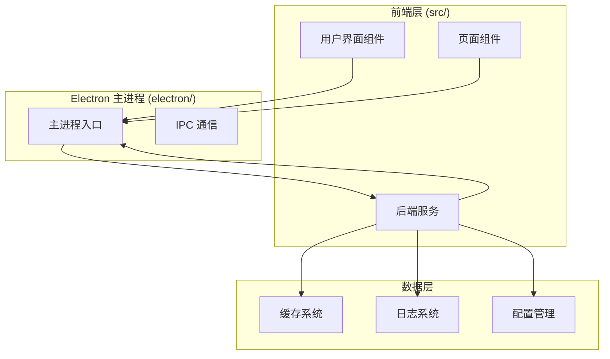

**图表来源**
- [main.ts:1-100](file://electron/main.ts#L1-L100)
- [config.ts:1-50](file://src/services/config.ts#L1-L50)

**章节来源**
- [main.ts:1-200](file://electron/main.ts#L1-L200)
- [config.ts:1-100](file://src/services/config.ts#L1-L100)

## 核心组件

### 配置管理系统
负责管理所有用户配置和隐私设置，采用安全的配置存储机制。

### 数据管理服务
提供数据库扫描、解密、增量更新等功能，确保数据处理的安全性和效率。

### 缓存服务
管理本地缓存文件，包括图片、表情包、数据库文件等，提供清理和监控功能。

### 分析服务
提供聊天数据分析功能，支持统计信息和使用情况分析。

### 日志服务
记录系统运行日志，支持日志级别管理和文件轮转。

**章节来源**
- [config.ts:1-200](file://src/services/config.ts#L1-L200)
- [dataManagementService.ts:1-100](file://electron/services/dataManagementService.ts#L1-L100)
- [cacheService.ts:1-100](file://electron/services/cacheService.ts#L1-L100)
- [analyticsService.ts:1-100](file://electron/services/analyticsService.ts#L1-L100)
- [logService.ts:1-100](file://electron/services/logService.ts#L1-L100)

## 架构概览

CipherTalk 采用多层架构设计，确保数据处理的隐私性和安全性：

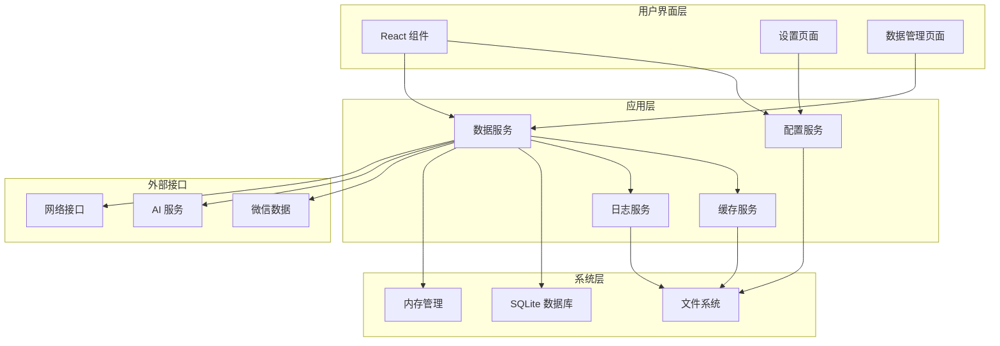

**图表来源**
- [main.ts:1-300](file://electron/main.ts#L1-L300)
- [SettingsPage.tsx:1-200](file://src/pages/SettingsPage.tsx#L1-L200)
- [DataManagementPage.tsx:1-200](file://src/pages/DataManagementPage.tsx#L1-L200)

## 详细组件分析

### 数据最小化原则实现

#### 仅收集必要数据
系统严格遵循数据最小化原则，只收集实现功能所必需的信息：

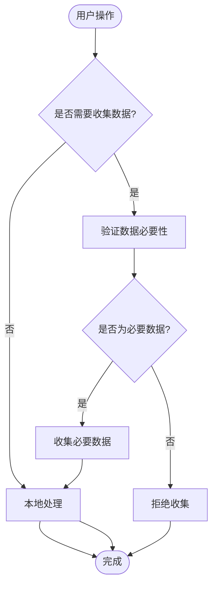

**图表来源**
- [AgreementPage.tsx:50-70](file://src/pages/AgreementPage.tsx#L50-L70)
- [config.ts:1-50](file://src/services/config.ts#L1-L50)

#### 数据去标识化和匿名化
系统采用多种技术手段确保数据的去标识化：

1. **路径去标识化**：使用相对路径而非绝对路径存储
2. **缓存去标识化**：图片和文件缓存使用哈希值命名
3. **日志匿名化**：日志系统支持敏感信息过滤

**章节来源**
- [imageDecryptService.ts:1-200](file://electron/services/imageDecryptService.ts#L1-L200)
- [cacheService.ts:1-200](file://electron/services/cacheService.ts#L1-L200)

### 本地存储限制

#### 缓存数据清理
系统提供完善的缓存清理机制：

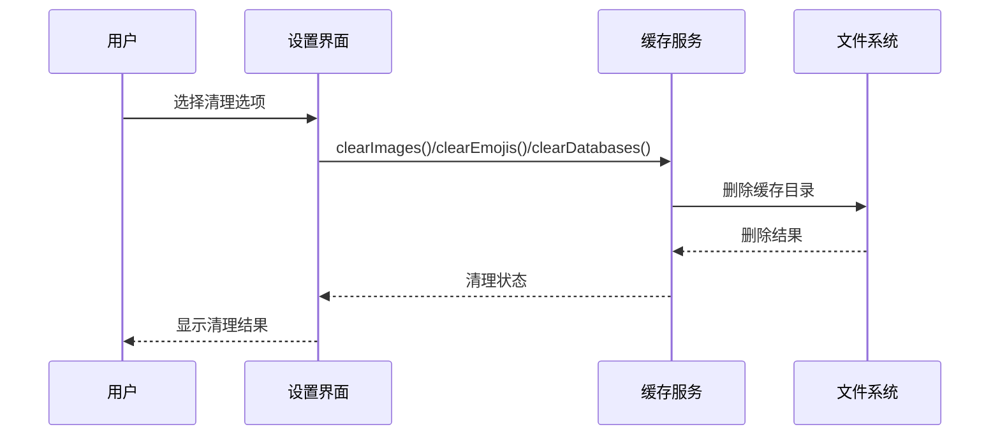

**图表来源**
- [cacheService.ts:70-190](file://electron/services/cacheService.ts#L70-L190)
- [SettingsPage.tsx:480-560](file://src/pages/SettingsPage.tsx#L480-L560)

#### 临时文件管理
系统采用严格的临时文件管理策略：

1. **安全解密流程**：使用 `.tmp` 临时文件进行解密
2. **原子替换**：解密完成后进行原子文件替换
3. **自动清理**：异常情况下自动清理临时文件

**章节来源**
- [dataManagementService.ts:480-595](file://electron/services/dataManagementService.ts#L480-L595)
- [decryptService.ts:20-50](file://electron/services/decryptService.ts#L20-L50)

#### 存储空间控制
系统提供存储空间监控和控制功能：

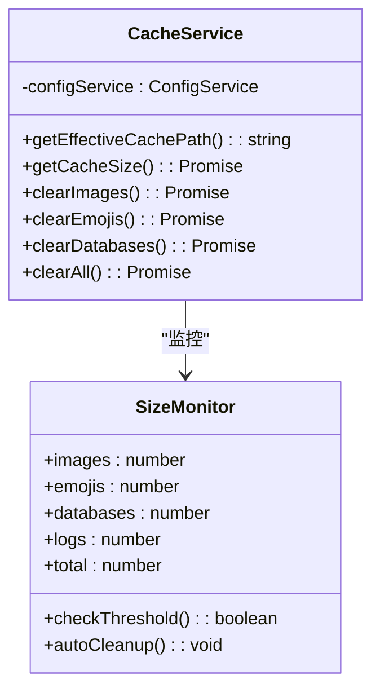

**图表来源**
- [cacheService.ts:310-362](file://electron/services/cacheService.ts#L310-L362)
- [SettingsPage.tsx:338-350](file://src/pages/SettingsPage.tsx#L338-L350)

**章节来源**
- [cacheService.ts:1-200](file://electron/services/cacheService.ts#L1-L200)
- [SettingsPage.tsx:338-350](file://src/pages/SettingsPage.tsx#L338-L350)

### 用户知情同意机制

#### 隐私政策透明度
系统提供详细的隐私政策说明：

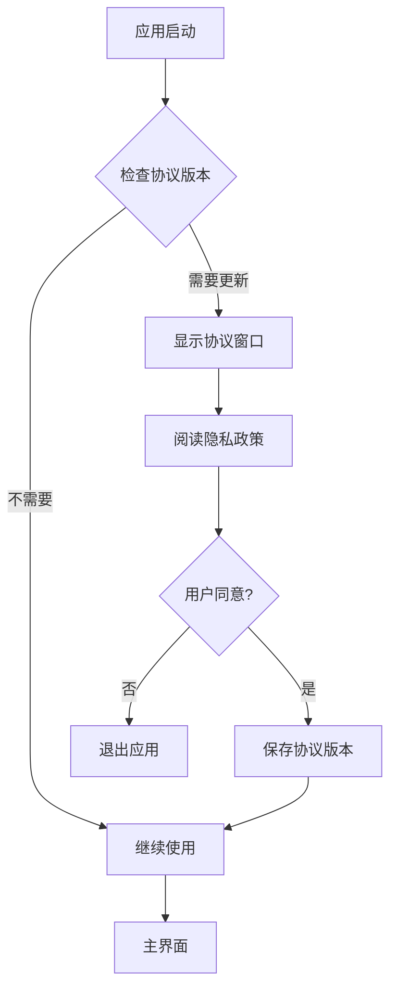

**图表来源**
- [AgreementPage.tsx:1-100](file://src/pages/AgreementPage.tsx#L1-L100)
- [config.ts:254-275](file://src/services/config.ts#L254-L275)

#### 用户授权流程
系统实现严格的用户授权流程：

1. **协议展示**：启动时显示用户协议和隐私政策
2. **版本控制**：协议版本变更时强制重新同意
3. **明确同意**：用户必须明确点击同意才能继续使用

**章节来源**
- [AgreementPage.tsx:49-85](file://src/pages/AgreementPage.tsx#L49-L85)
- [config.ts:254-275](file://src/services/config.ts#L254-L275)

### 数据生命周期管理

#### 数据保留期限
系统支持灵活的数据保留策略：

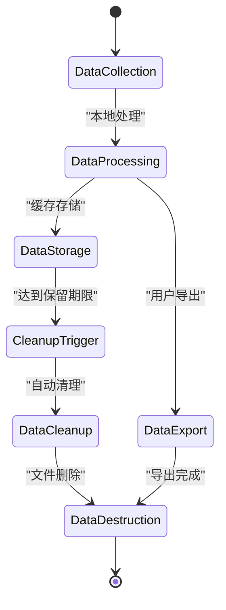

**图表来源**
- [dataManagementService.ts:410-612](file://electron/services/dataManagementService.ts#L410-L612)
- [cacheService.ts:190-245](file://electron/services/cacheService.ts#L190-L245)

#### 自动清理策略
系统提供多种自动清理策略：

1. **定时清理**：基于时间的定期清理
2. **容量清理**：基于存储空间的清理
3. **任务清理**：基于任务完成的清理

**章节来源**
- [logService.ts:180-209](file://electron/services/logService.ts#L180-L209)
- [cacheService.ts:190-245](file://electron/services/cacheService.ts#L190-L245)

#### 数据销毁流程
系统实现安全的数据销毁机制：

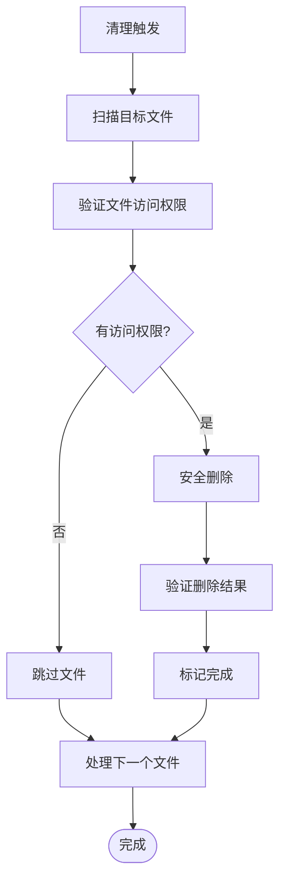

**图表来源**
- [cacheService.ts:247-281](file://electron/services/cacheService.ts#L247-L281)
- [dataManagementService.ts:666-705](file://electron/services/dataManagementService.ts#L666-L705)

**章节来源**
- [cacheService.ts:247-281](file://electron/services/cacheService.ts#L247-L281)
- [dataManagementService.ts:666-705](file://electron/services/dataManagementService.ts#L666-L705)

### 隐私配置选项

#### 用户隐私设置
系统提供全面的隐私配置选项：

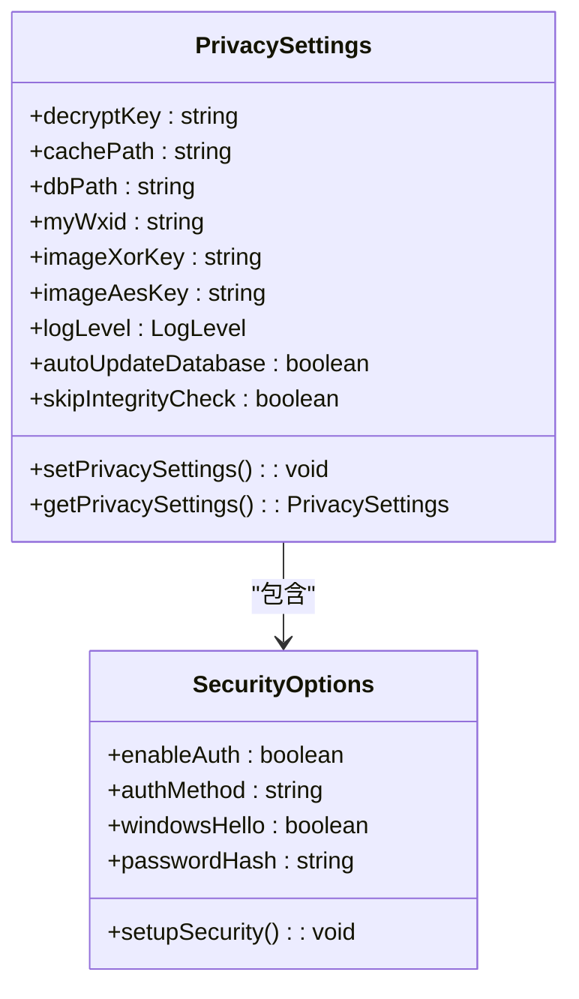

**图表来源**
- [config.ts:1-36](file://src/services/config.ts#L1-L36)
- [SettingsPage.tsx:150-200](file://src/pages/SettingsPage.tsx#L150-L200)

#### 数据共享控制
系统提供细粒度的数据共享控制：

1. **AI 功能控制**：可选择是否启用 AI 摘要功能
2. **数据导出控制**：可设置导出数据的范围和格式
3. **分析功能控制**：可选择是否启用数据分析功能

**章节来源**
- [SettingsPage.tsx:130-145](file://src/pages/SettingsPage.tsx#L130-L145)
- [config.ts:370-426](file://src/services/config.ts#L370-L426)

#### 个性化服务开关
系统支持个性化服务的灵活开关：

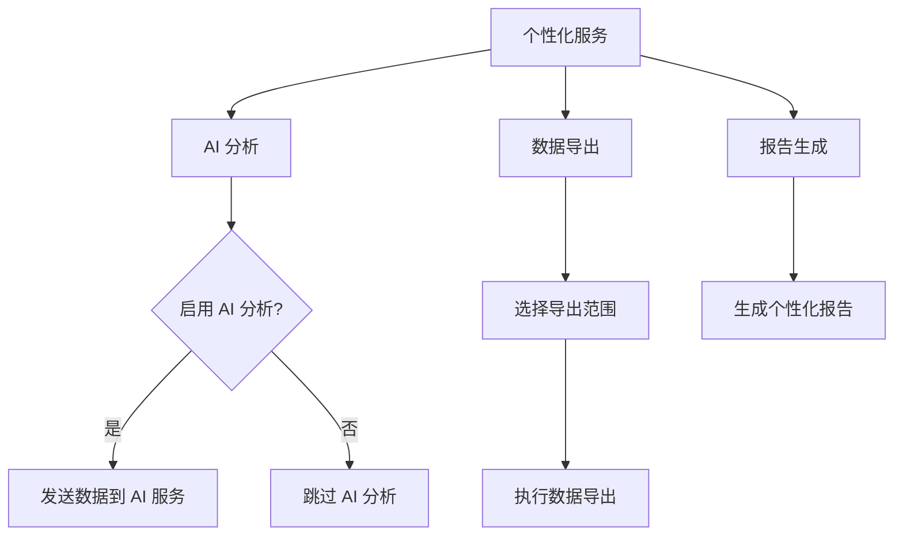

**图表来源**
- [SettingsPage.tsx:130-145](file://src/pages/SettingsPage.tsx#L130-L145)
- [analyticsService.ts:269-450](file://electron/services/analyticsService.ts#L269-L450)

**章节来源**
- [SettingsPage.tsx:130-145](file://src/pages/SettingsPage.tsx#L130-L145)
- [analyticsService.ts:269-450](file://electron/services/analyticsService.ts#L269-L450)

### 隐私审计功能

#### 数据访问日志
系统提供完整的数据访问审计：

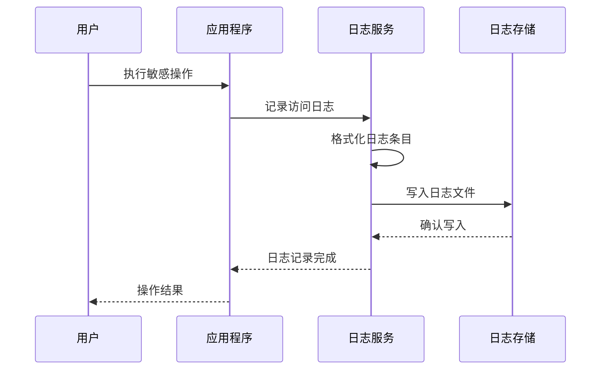

**图表来源**
- [logService.ts:126-162](file://electron/services/logService.ts#L126-L162)
- [main.ts:220-230](file://electron/main.ts#L220-L230)

#### 使用情况统计
系统提供使用情况统计功能：

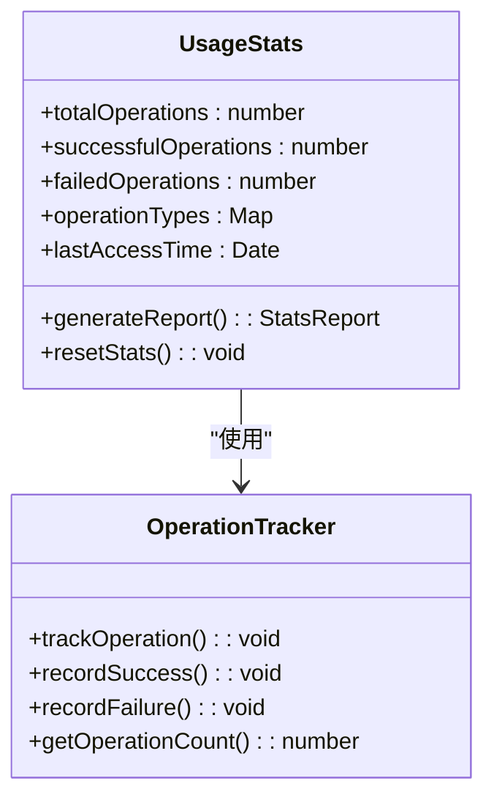

**图表来源**
- [analyticsService.ts:7-37](file://electron/services/analyticsService.ts#L7-L37)
- [logService.ts:240-278](file://electron/services/logService.ts#L240-L278)

#### 合规性检查
系统支持合规性检查功能：

1. **协议版本检查**：自动检查协议版本更新
2. **配置合规检查**：验证隐私设置的合规性
3. **数据处理审计**：跟踪所有数据处理操作

**章节来源**
- [logService.ts:1-100](file://electron/services/logService.ts#L1-L100)
- [analyticsService.ts:1-100](file://electron/services/analyticsService.ts#L1-L100)

## 依赖关系分析

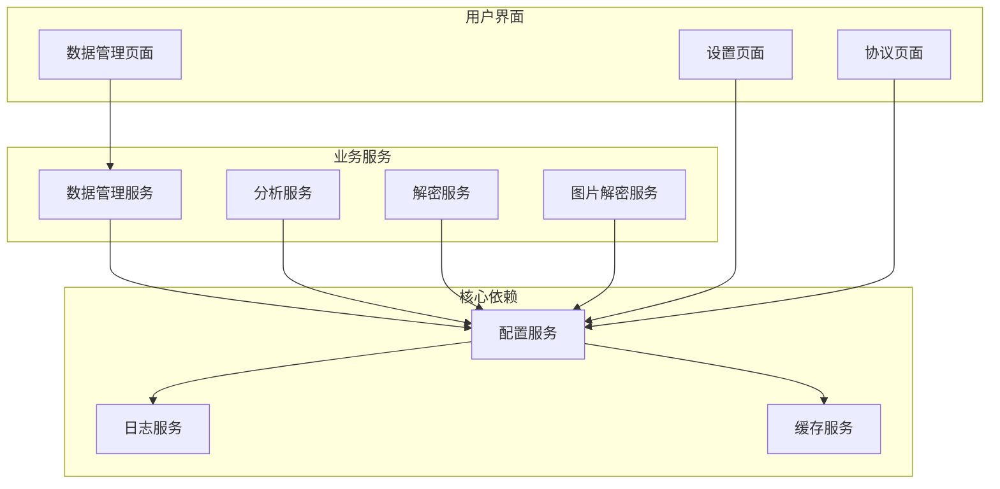

**图表来源**
- [main.ts:1-100](file://electron/main.ts#L1-L100)
- [config.ts:1-50](file://src/services/config.ts#L1-L50)

**章节来源**
- [main.ts:1-200](file://electron/main.ts#L1-L200)
- [config.ts:1-100](file://src/services/config.ts#L1-L100)

## 性能考虑

### 数据处理性能
系统采用多种优化策略确保数据处理性能：

1. **异步处理**：大量使用 Promise 和 async/await
2. **缓存机制**：智能缓存减少重复计算
3. **增量更新**：只处理变化的数据文件

### 存储性能
系统提供高效的存储管理：

1. **文件系统优化**：合理组织文件结构
2. **内存管理**：及时释放不再使用的资源
3. **并发控制**：避免同时进行大量 I/O 操作

## 故障排除指南

### 常见问题及解决方案

#### 解密失败
- 检查解密密钥是否正确
- 确认数据库路径配置
- 验证文件权限设置

#### 缓存清理失败
- 检查文件是否被其他进程占用
- 确认有足够的磁盘空间
- 重启应用程序后重试

#### 日志记录异常
- 检查日志目录权限
- 验证磁盘空间充足
- 检查日志级别配置

**章节来源**
- [decryptService.ts:13-50](file://electron/services/decryptService.ts#L13-L50)
- [cacheService.ts:190-245](file://electron/services/cacheService.ts#L190-L245)
- [logService.ts:180-209](file://electron/services/logService.ts#L180-L209)

## 结论

CipherTalk 的隐私保护策略通过多层次的设计实现了全面的隐私保护：

1. **技术层面**：采用本地处理、数据去标识化、安全存储等技术手段
2. **管理层面**：提供完善的配置选项、审计功能和合规检查
3. **用户层面**：通过明确的协议和透明的隐私政策保障用户知情权

该策略为隐私保护专员和合规人员提供了专业的实施指导，确保在提供强大功能的同时，最大限度地保护用户隐私和数据安全。