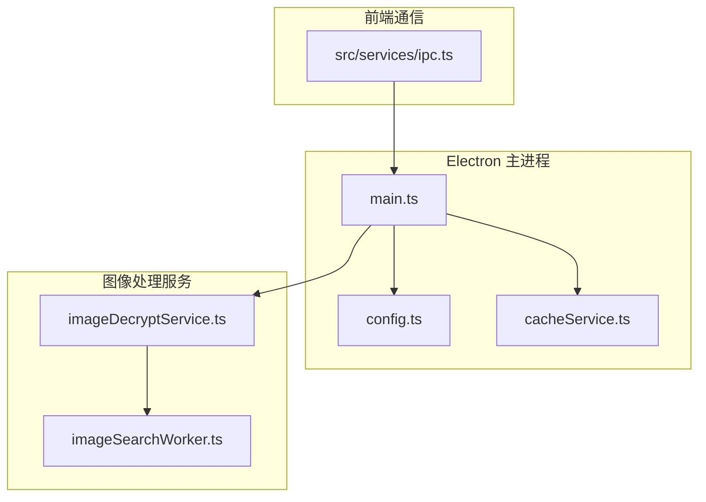
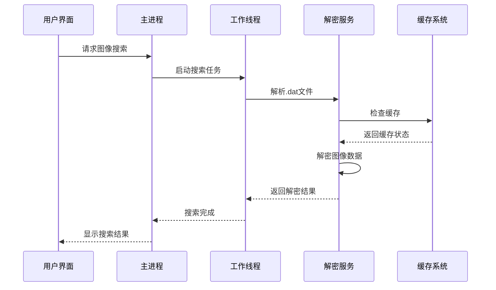
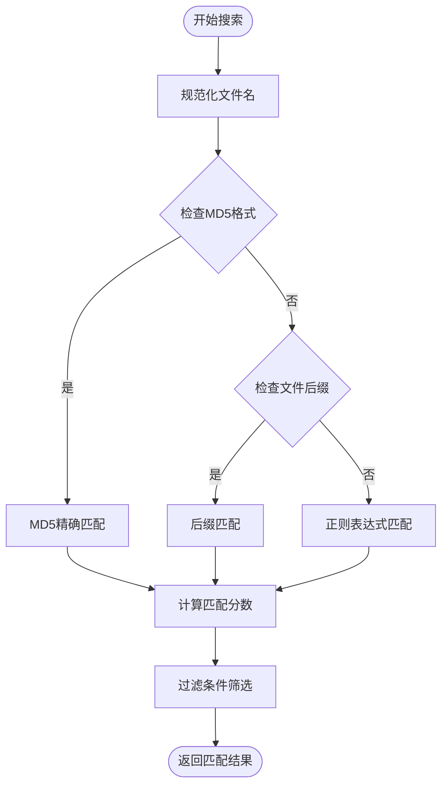
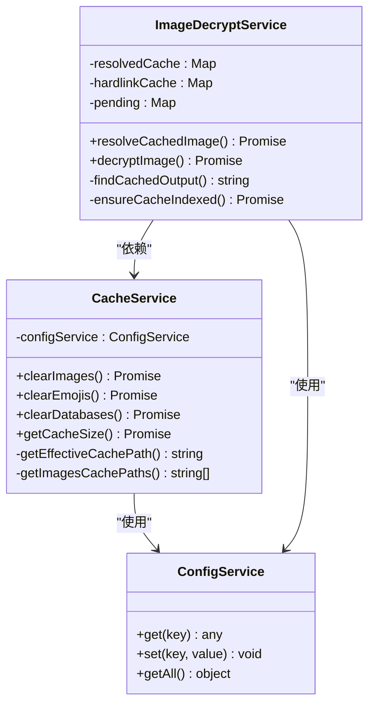
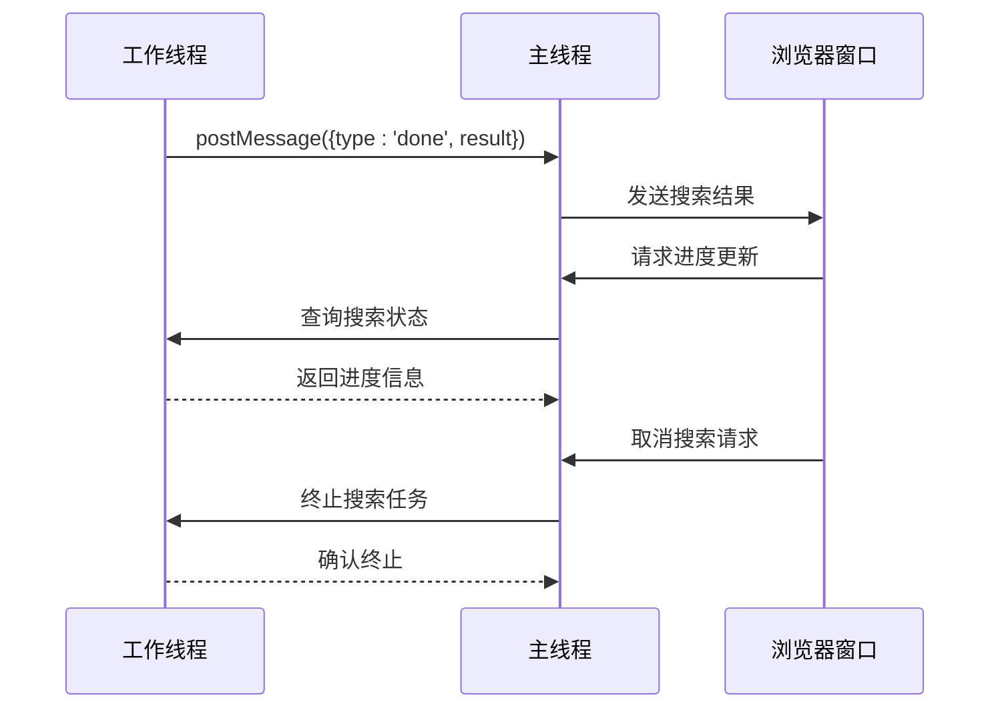
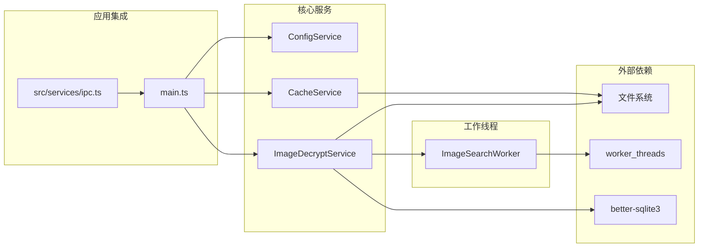
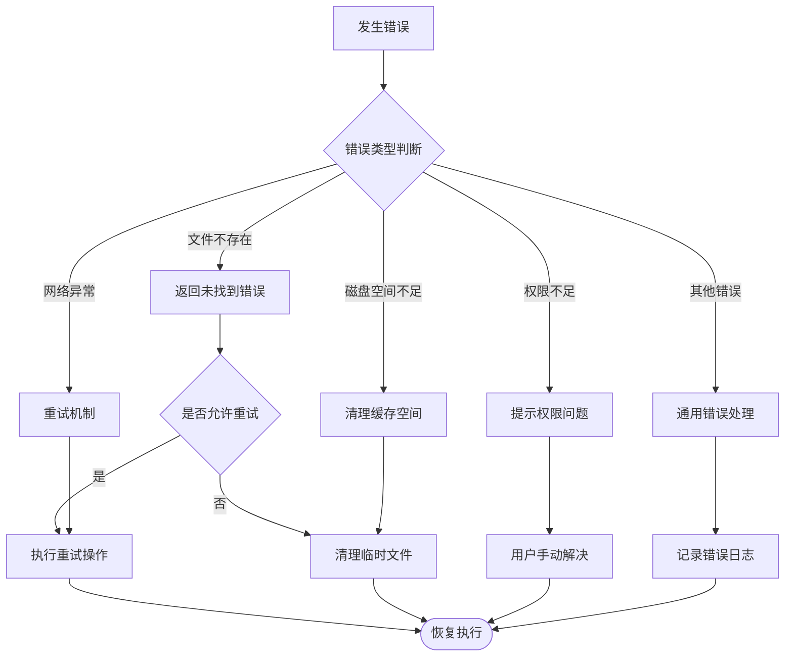

# 图像搜索工作线程

<cite>
**本文档引用的文件**
- [imageSearchWorker.ts](file://electron/imageSearchWorker.ts)
- [imageDecryptService.ts](file://electron/services/imageDecryptService.ts)
- [cacheService.ts](file://electron/services/cacheService.ts)
- [config.ts](file://electron/services/config.ts)
- [main.ts](file://electron/main.ts)
- [ipc.ts](file://src/services/ipc.ts)
</cite>

## 目录
1. [简介](#简介)
2. [项目结构](#项目结构)
3. [核心组件](#核心组件)
4. [架构概览](#架构概览)
5. [详细组件分析](#详细组件分析)
6. [依赖关系分析](#依赖关系分析)
7. [性能考虑](#性能考虑)
8. [故障排除指南](#故障排除指南)
9. [结论](#结论)

## 简介

CipherTalk 的图像搜索工作线程是一个专门设计用于在微信聊天记录中搜索和匹配图像文件的高性能组件。该工作线程实现了完整的图像搜索流水线，包括图像预处理、特征提取、向量计算和相似度排序等功能。

该系统采用多层缓存策略和智能索引机制，能够高效地在大型聊天数据库中定位特定图像文件。工作线程通过专用的 `.dat` 文件格式识别和匹配算法，结合缩略图和高清图的智能选择策略，为用户提供快速准确的图像搜索体验。

## 项目结构

图像搜索功能主要分布在以下关键文件中：

**图表来源**
- [main.ts:1-100](file://electron/main.ts#L1-L100)
- [imageDecryptService.ts:1-100](file://electron/services/imageDecryptService.ts#L1-L100)
- [imageSearchWorker.ts:1-50](file://electron/imageSearchWorker.ts#L1-L50)

**章节来源**
- [main.ts:1-200](file://electron/main.ts#L1-L200)
- [imageDecryptService.ts:1-200](file://electron/services/imageDecryptService.ts#L1-L200)
- [imageSearchWorker.ts:1-174](file://electron/imageSearchWorker.ts#L1-L174)

## 核心组件

### 图像搜索工作线程 (ImageSearchWorker)

图像搜索工作线程是整个图像搜索系统的核心执行单元，负责在微信聊天记录的 `.dat` 文件中进行智能搜索和匹配。

#### 主要功能特性

1. **智能文件匹配算法**
   - 基于文件名规范化和正则表达式匹配
   - 支持多种文件变体格式（缩略图、高清图、不同后缀）
   - 智能权重评分系统

2. **多层搜索策略**
   - 快速概率性搜索（基于文件名特征）
   - 广度优先搜索（BFS）遍历
   - 缓存优先策略

3. **性能优化机制**
   - 并行批量处理
   - 深度限制控制
   - 内存友好的流式处理

**章节来源**
- [imageSearchWorker.ts:15-174](file://electron/imageSearchWorker.ts#L15-L174)

### 图像解密服务 (ImageDecryptService)

图像解密服务提供了完整的图像文件解析和缓存管理功能，是图像搜索工作线程的重要支撑组件。

#### 核心能力

1. **多格式支持**
   - 支持微信 V3/V4 数据格式
   - 多种加密算法兼容
   - 实况照片（Motion Photo）处理

2. **智能缓存系统**
   - 分层缓存结构（内存、磁盘）
   - 自动缓存索引
   - 失效检测和清理

3. **并发处理能力**
   - 异步任务队列
   - 防重复请求机制
   - 进度跟踪和状态管理

**章节来源**
- [imageDecryptService.ts:112-303](file://electron/services/imageDecryptService.ts#L112-L303)

## 架构概览

图像搜索系统的整体架构采用了分层设计，确保了高内聚低耦合的代码组织：

**图表来源**
- [main.ts:13-14](file://electron/main.ts#L13-L14)
- [imageSearchWorker.ts:152-174](file://electron/imageSearchWorker.ts#L152-L174)
- [imageDecryptService.ts:160-303](file://electron/services/imageDecryptService.ts#L160-L303)

## 详细组件分析

### 图像搜索算法实现

#### 文件匹配算法

图像搜索工作线程实现了复杂的文件匹配算法，能够准确识别和匹配微信聊天记录中的图像文件：

**图表来源**
- [imageSearchWorker.ts:44-59](file://electron/imageSearchWorker.ts#L44-L59)
- [imageSearchWorker.ts:108-114](file://electron/imageSearchWorker.ts#L108-L114)

#### 搜索策略优化

工作线程采用了多层次的搜索策略来平衡搜索速度和准确性：

1. **快速概率性搜索**
   - 基于文件名哈希特征的路径猜测
   - 支持旧版和新版微信存储结构
   - 智能日期目录优先级

2. **广度优先搜索**
   - 控制最大搜索深度
   - 批量并行处理
   - 内存友好的栈式遍历

3. **缓存优先策略**
   - 内存缓存优先
   - 磁盘缓存降级
   - 失效检测和清理

**章节来源**
- [imageSearchWorker.ts:65-150](file://electron/imageSearchWorker.ts#L65-L150)
- [imageDecryptService.ts:774-859](file://electron/services/imageDecryptService.ts#L774-L859)

### 缓存管理系统

缓存系统是图像搜索性能的关键保障，实现了多层缓存策略：

**图表来源**
- [cacheService.ts:6-486](file://electron/services/cacheService.ts#L6-L486)
- [imageDecryptService.ts:44-54](file://electron/services/imageDecryptService.ts#L44-L54)
- [config.ts:126-395](file://electron/services/config.ts#L126-L395)

#### 缓存层次结构

缓存系统采用分层设计，确保不同类型的数据得到最优存储：

1. **内存缓存**
   - 最快速的访问路径
   - 临时存储解密结果
   - 自动失效机制

2. **磁盘缓存**
   - 结构化存储（Images/日期/文件名）
   - 支持多种文件格式
   - 自动清理机制

3. **索引缓存**
   - 快速查找机制
   - 减少磁盘扫描
   - 动态更新策略

**章节来源**
- [imageDecryptService.ts:56-110](file://electron/services/imageDecryptService.ts#L56-L110)
- [imageDecryptService.ts:1453-1501](file://electron/services/imageDecryptService.ts#L1453-L1501)

### 通信协议设计

图像搜索工作线程与主线程之间的通信采用了标准化的消息传递协议：

**图表来源**
- [imageSearchWorker.ts:160-167](file://electron/imageSearchWorker.ts#L160-L167)
- [imageDecryptService.ts:1435-1451](file://electron/services/imageDecryptService.ts#L1435-L1451)

#### 消息类型定义

工作线程支持多种消息类型来处理不同的通信场景：

1. **搜索完成消息**
   - 类型：`done`
   - 内容：搜索结果、匹配基列表
   - 触发：搜索任务完成

2. **错误消息**
   - 类型：`error`
   - 内容：错误描述
   - 触发：异常情况

3. **进度更新消息**
   - 类型：`progress`
   - 内容：搜索进度百分比
   - 触发：定期更新

**章节来源**
- [imageSearchWorker.ts:152-174](file://electron/imageSearchWorker.ts#L152-L174)
- [imageDecryptService.ts:1435-1451](file://electron/services/imageDecryptService.ts#L1435-L1451)

## 依赖关系分析

图像搜索系统各组件之间的依赖关系体现了清晰的分层架构：

**图表来源**
- [main.ts:1-30](file://electron/main.ts#L1-L30)
- [imageSearchWorker.ts:1-5](file://electron/imageSearchWorker.ts#L1-L5)
- [imageDecryptService.ts:1-13](file://electron/services/imageDecryptService.ts#L1-L13)

### 组件耦合度分析

系统设计遵循了低耦合高内聚的原则：

1. **服务层分离**
   - 配置服务独立管理
   - 缓存服务职责明确
   - 解密服务功能专一

2. **接口契约清晰**
   - 明确的输入输出规范
   - 标准化的错误处理
   - 可预测的状态变化

3. **依赖注入机制**
   - 通过构造函数注入依赖
   - 避免全局状态污染
   - 便于测试和维护

**章节来源**
- [config.ts:126-134](file://electron/services/config.ts#L126-L134)
- [cacheService.ts:6-8](file://electron/services/cacheService.ts#L6-L8)
- [imageDecryptService.ts:44-48](file://electron/services/imageDecryptService.ts#L44-L48)

## 性能考虑

### 搜索性能优化策略

图像搜索工作线程采用了多项性能优化技术来确保高效的搜索体验：

#### 并行处理机制

1. **批量并行搜索**
   - 每批处理10个目录项
   - 利用Promise.all实现并行
   - 动态调整批大小

2. **多线程架构**
   - 工作线程独立执行
   - 避免阻塞主线程
   - 可扩展的并发模型

#### 内存优化策略

1. **流式处理**
   - 逐文件处理而非一次性加载
   - 及时释放中间结果
   - 控制内存峰值使用

2. **智能缓存**
   - LRU缓存淘汰策略
   - 条件缓存避免冗余
   - 缓存失效检测

**章节来源**
- [imageSearchWorker.ts:886-918](file://electron/imageSearchWorker.ts#L886-L918)
- [imageDecryptService.ts:889-912](file://electron/services/imageDecryptService.ts#L889-L912)

### 存储优化技术

#### 分层存储结构

缓存系统采用了智能的分层存储策略：

1. **日期分区存储**
   - Images/{sessionId}/{YYYY-MM}/
   - 支持时间范围查询
   - 便于清理和管理

2. **文件名规范化**
   - 统一文件名格式
   - 支持多种后缀
   - 增强可读性

#### 索引优化

1. **快速查找索引**
   - 基于文件名的索引
   - 支持模糊匹配
   - 动态更新机制

2. **空间压缩**
   - 相同内容去重
   - 符号链接使用
   - 磁盘空间节省

**章节来源**
- [imageDecryptService.ts:1266-1291](file://electron/services/imageDecryptService.ts#L1266-L1291)
- [imageDecryptService.ts:1453-1490](file://electron/services/imageDecryptService.ts#L1453-L1490)

## 故障排除指南

### 常见问题诊断

#### 搜索失败问题

当图像搜索无法找到目标文件时，可以按照以下步骤进行诊断：

1. **检查文件格式**
   - 确认文件扩展名为 `.dat`
   - 验证文件是否损坏
   - 检查文件权限

2. **验证搜索参数**
   - 确认图像MD5或文件名正确
   - 检查会话ID有效性
   - 验证搜索深度设置

3. **查看缓存状态**
   - 清理无效缓存
   - 检查缓存路径配置
   - 确认磁盘空间充足

**章节来源**
- [imageSearchWorker.ts:169-174](file://electron/imageSearchWorker.ts#L169-L174)
- [imageDecryptService.ts:118-122](file://electron/services/imageDecryptService.ts#L118-L122)

### 性能问题排查

#### 搜索缓慢问题

如果发现搜索响应时间过长，可以采取以下措施：

1. **调整搜索深度**
   - 减少最大搜索深度
   - 优化搜索路径
   - 使用更精确的匹配规则

2. **优化缓存配置**
   - 增加缓存容量
   - 清理陈旧缓存
   - 调整缓存策略

3. **监控系统资源**
   - 监控CPU使用率
   - 检查磁盘IO性能
   - 分析内存使用情况

**章节来源**
- [imageSearchWorker.ts:65-75](file://electron/imageSearchWorker.ts#L65-L75)
- [imageDecryptService.ts:104-107](file://electron/services/imageDecryptService.ts#L104-L107)

### 错误处理机制

系统实现了完善的错误处理和恢复机制：

**图表来源**
- [imageSearchWorker.ts:169-174](file://electron/imageSearchWorker.ts#L169-L174)
- [imageDecryptService.ts:299-303](file://electron/services/imageDecryptService.ts#L299-L303)

## 结论

CipherTalk 的图像搜索工作线程展现了现代桌面应用中高性能图像处理的最佳实践。通过精心设计的多层架构、智能缓存策略和并行处理机制，该系统能够在大型聊天数据库中提供快速准确的图像搜索功能。

### 技术亮点

1. **智能化搜索算法**：结合文件名特征和正则表达式的混合匹配策略
2. **多层缓存体系**：从内存到磁盘的完整缓存解决方案
3. **高性能并行处理**：利用工作线程和批量处理提升性能
4. **完善的错误处理**：全面的异常捕获和恢复机制

### 应用价值

该图像搜索工作线程不仅提升了用户体验，还为后续的功能扩展奠定了坚实基础。其模块化的架构设计使得系统易于维护和升级，同时保持了优秀的性能表现。

对于开发者而言，这个实现提供了宝贵的参考案例，展示了如何在实际生产环境中平衡性能、可靠性和可维护性等关键因素。