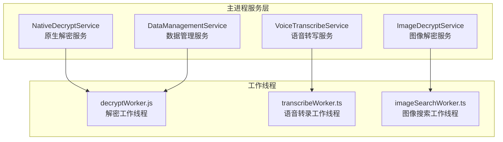
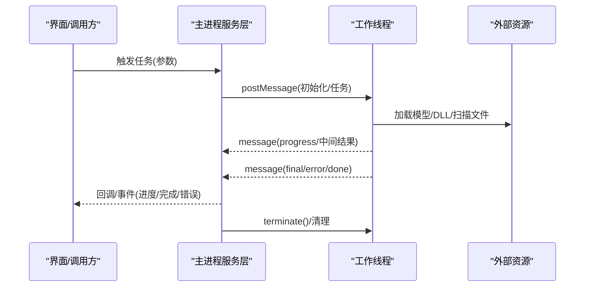
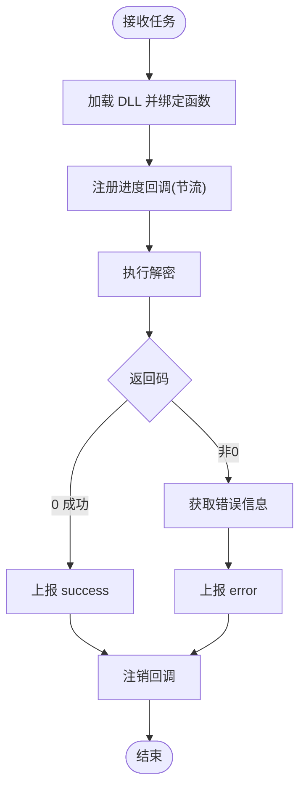
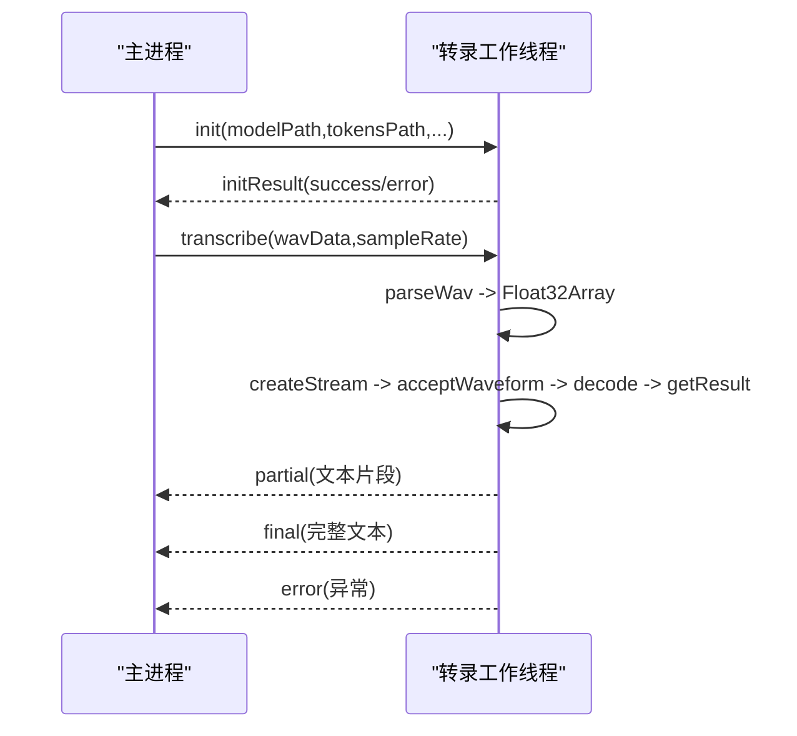
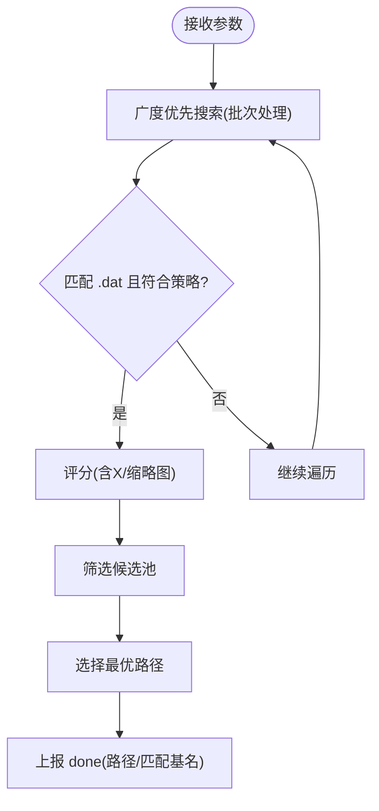
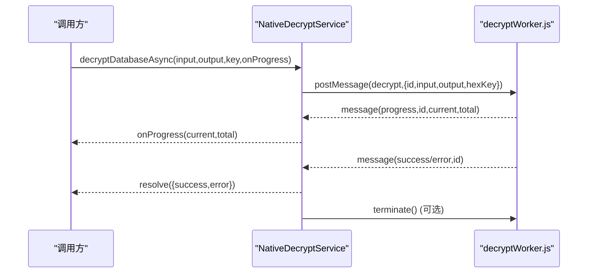
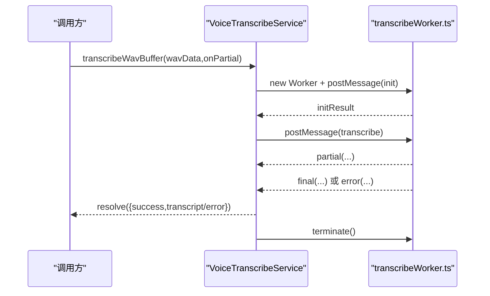
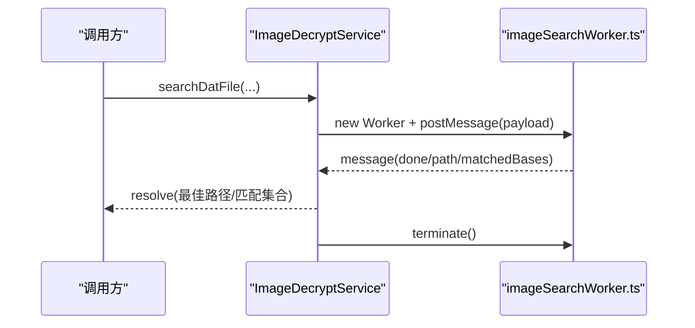
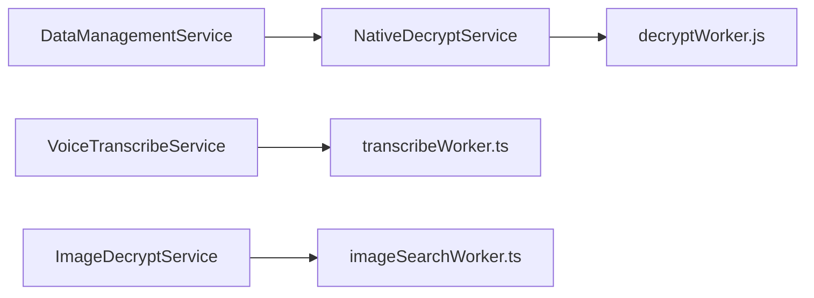

# 工作线程开发

<cite>
**本文引用的文件**
- [decryptWorker.js](file://electron/workers/decryptWorker.js)
- [transcribeWorker.ts](file://electron/transcribeWorker.ts)
- [imageSearchWorker.ts](file://electron/imageSearchWorker.ts)
- [nativeDecryptService.ts](file://electron/services/nativeDecryptService.ts)
- [decryptService.ts](file://electron/services/decryptService.ts)
- [voiceTranscribeService.ts](file://electron/services/voiceTranscribeService.ts)
- [imageDecryptService.ts](file://electron/services/imageDecryptService.ts)
- [dataManagementService.ts](file://electron/services/dataManagementService.ts)
</cite>

## 目录
1. [简介](#简介)
2. [项目结构](#项目结构)
3. [核心组件](#核心组件)
4. [架构总览](#架构总览)
5. [详细组件分析](#详细组件分析)
6. [依赖关系分析](#依赖关系分析)
7. [性能考量](#性能考量)
8. [故障排查指南](#故障排查指南)
9. [结论](#结论)
10. [附录](#附录)

## 简介
本文件面向前端开发者，系统性讲解 CipherTalk 中工作线程（Web Worker/Node Worker）的设计与实现，覆盖三大类 CPU 密集型任务的并行化：解密任务、语音转录、图像搜索。文档重点包括：
- 工作线程的使用场景与并行化策略
- 解密工作线程的实现细节：算法执行、进度上报、错误处理
- 语音转录工作线程：音频解析、模型初始化、转录执行、结果返回
- 图像搜索工作线程：文件扫描、相似度判定、结果返回
- 主线程与工作线程的通信机制：消息传递、数据序列化、性能优化
- 生命周期管理：线程创建、销毁、资源清理
- 最佳实践与调试技巧

## 项目结构
CipherTalk 的工作线程主要分布在以下位置：
- Electron 主进程服务层：负责工作线程的创建、消息路由、生命周期管理与错误处理
- 工作线程脚本：位于 electron 目录下，分别处理不同类型的并行任务
- 业务服务：封装工作线程调用，提供统一的 API 接口

**图表来源**
- [nativeDecryptService.ts:1-216](file://electron/services/nativeDecryptService.ts#L1-216)
- [voiceTranscribeService.ts:368-448](file://electron/services/voiceTranscribeService.ts#L368-448)
- [imageDecryptService.ts:869-918](file://electron/services/imageDecryptService.ts#L869-918)
- [decryptWorker.js:1-89](file://electron/workers/decryptWorker.js#L1-89)
- [transcribeWorker.ts:1-261](file://electron/transcribeWorker.ts#L1-261)
- [imageSearchWorker.ts:1-174](file://electron/imageSearchWorker.ts#L1-174)

**章节来源**
- [nativeDecryptService.ts:1-216](file://electron/services/nativeDecryptService.ts#L1-216)
- [voiceTranscribeService.ts:368-448](file://electron/services/voiceTranscribeService.ts#L368-448)
- [imageDecryptService.ts:869-918](file://electron/services/imageDecryptService.ts#L869-918)
- [decryptWorker.js:1-89](file://electron/workers/decryptWorker.js#L1-89)
- [transcribeWorker.ts:1-261](file://electron/transcribeWorker.ts#L1-261)
- [imageSearchWorker.ts:1-174](file://electron/imageSearchWorker.ts#L1-174)

## 核心组件
- 原生解密服务（NativeDecryptService）：封装 Worker 线程的创建、消息派发与进度回调，提供异步解密 API
- 语音转写服务（VoiceTranscribeService）：负责模型下载与校验、Worker 初始化与转写调度、缓存与错误处理
- 图像解密服务（ImageDecryptService）：负责图像缓存与硬链接映射、DAT 文件搜索、Worker 并行扫描
- 解密工作线程（decryptWorker.js）：加载原生 DLL、执行解密、进度回调、错误上报
- 语音转录工作线程（transcribeWorker.ts）：动态加载 Sherpa-ONNX、解析 WAV、执行转录、分段/最终结果上报
- 图像搜索工作线程（imageSearchWorker.ts）：深度优先扫描、DAT 文件匹配、候选评分与最优路径选择

**章节来源**
- [nativeDecryptService.ts:24-216](file://electron/services/nativeDecryptService.ts#L24-216)
- [voiceTranscribeService.ts:70-534](file://electron/services/voiceTranscribeService.ts#L70-534)
- [imageDecryptService.ts:44-303](file://electron/services/imageDecryptService.ts#L44-303)
- [decryptWorker.js:14-88](file://electron/workers/decryptWorker.js#L14-88)
- [transcribeWorker.ts:11-261](file://electron/transcribeWorker.ts#L11-261)
- [imageSearchWorker.ts:15-174](file://electron/imageSearchWorker.ts#L15-174)

## 架构总览
工作线程架构围绕“主进程服务层 + 工作线程”的模式展开。主进程负责：
- 资源准备（模型文件、DLL、缓存目录）
- Worker 生命周期管理（创建、监听、终止）
- 任务编排与进度/错误回调
- 结果聚合与 UI 更新

工作线程负责：
- 纯计算密集型任务（解密、转录、扫描）
- 与主进程通过消息通道交互（进度、结果、错误）

**图表来源**
- [nativeDecryptService.ts:66-117](file://electron/services/nativeDecryptService.ts#L66-117)
- [voiceTranscribeService.ts:415-447](file://electron/services/voiceTranscribeService.ts#L415-447)
- [imageSearchWorker.ts:169-174](file://electron/imageSearchWorker.ts#L169-174)

## 详细组件分析

### 解密工作线程（decryptWorker.js）
职责与流程：
- 接收主进程消息，携带输入输出路径、密钥与任务 ID
- 加载原生 DLL，绑定回调函数原型
- 注册进度回调（带节流，避免频繁消息）
- 执行解密并根据返回值上报 success/error
- 异常捕获并上报错误

关键特性：
- 进度节流：每约 100ms 上报一次，兼顾实时性与性能
- 错误处理：捕获 DLL 调用错误与系统异常，统一上报
- 资源释放：回调注销，避免句柄泄漏

**图表来源**
- [decryptWorker.js:14-88](file://electron/workers/decryptWorker.js#L14-88)

**章节来源**
- [decryptWorker.js:14-88](file://electron/workers/decryptWorker.js#L14-88)

### 语音转录工作线程（transcribeWorker.ts）
职责与流程：
- 启动时可直接初始化并执行一次性转录
- 支持动态初始化与多次转录请求
- 解析 WAV 数据，构建浮点样本数组
- 使用 Sherpa-ONNX 的离线识别器进行完整音频转写
- 支持多语言过滤与线程数自适应（CPU 核心数的一半）

关键特性：
- 模型动态加载：避免预热成本过高
- 线程数自适应：高配机器充分利用 CPU
- 分段/最终结果：支持 partial 与 final 消息
- 文本过滤：按配置过滤不允许的语言字符

**图表来源**
- [transcribeWorker.ts:81-131](file://electron/transcribeWorker.ts#L81-131)
- [transcribeWorker.ts:164-200](file://electron/transcribeWorker.ts#L164-200)
- [transcribeWorker.ts:233-259](file://electron/transcribeWorker.ts#L233-259)

**章节来源**
- [transcribeWorker.ts:11-261](file://electron/transcribeWorker.ts#L11-261)

### 图像搜索工作线程（imageSearchWorker.ts）
职责与流程：
- 接收根目录、目标 DAT 名称、最大深度、缩略图策略等参数
- 使用栈模拟的深度优先搜索，遍历目录寻找匹配的 .dat 文件
- 基于文件名规范化与后缀规则进行匹配与评分
- 优先策略：thumbOnly、allowThumbnail、仅高清图
- 返回最佳路径与匹配基名集合

关键特性：
- BFS 批处理：每次取出一批目录项并行处理，提升 IO 吞吐
- 文件名规范化：去除变体后缀，统一大小写与扩展名
- 评分与优先级：优先含 X 变体的文件，其次考虑缩略图

**图表来源**
- [imageSearchWorker.ts:65-150](file://electron/imageSearchWorker.ts#L65-150)

**章节来源**
- [imageSearchWorker.ts:15-174](file://electron/imageSearchWorker.ts#L15-174)

### 主线程服务层与通信机制

#### 原生解密服务（NativeDecryptService）
- 负责 Worker 初始化、消息派发与进度回调
- 任务队列与 ID 管理，确保多任务并发安全
- 自动重启与错误上报，保障稳定性

**图表来源**
- [nativeDecryptService.ts:66-117](file://electron/services/nativeDecryptService.ts#L66-117)
- [decryptWorker.js:25-81](file://electron/workers/decryptWorker.js#L25-81)

**章节来源**
- [nativeDecryptService.ts:24-216](file://electron/services/nativeDecryptService.ts#L24-216)
- [decryptWorker.js:25-81](file://electron/workers/decryptWorker.js#L25-81)

#### 语音转写服务（VoiceTranscribeService）
- 模型下载与校验、缓存数据库初始化
- Worker 创建与消息监听，支持 partial/final/error
- 任务完成后主动终止 Worker，避免资源泄露

**图表来源**
- [voiceTranscribeService.ts:389-447](file://electron/services/voiceTranscribeService.ts#L389-447)
- [transcribeWorker.ts:233-259](file://electron/transcribeWorker.ts#L233-259)

**章节来源**
- [voiceTranscribeService.ts:368-448](file://electron/services/voiceTranscribeService.ts#L368-448)
- [transcribeWorker.ts:233-259](file://electron/transcribeWorker.ts#L233-259)

#### 图像解密服务（ImageDecryptService）
- 负责缓存、硬链接映射、DAT 文件搜索
- 对大范围扫描采用 Worker 并行 BFS，提升性能
- 支持缩略图/高清图策略切换与更新检测

**图表来源**
- [imageDecryptService.ts:869-918](file://electron/services/imageDecryptService.ts#L869-918)
- [imageSearchWorker.ts:152-167](file://electron/imageSearchWorker.ts#L152-167)

**章节来源**
- [imageDecryptService.ts:869-918](file://electron/services/imageDecryptService.ts#L869-918)
- [imageSearchWorker.ts:152-167](file://electron/imageSearchWorker.ts#L152-167)

## 依赖关系分析
- 服务层依赖 Node Worker Threads API 创建与管理 Worker
- 工作线程依赖外部资源（DLL/模型/文件系统）
- 主线程通过消息通道与工作线程解耦，避免阻塞 UI
- 服务层维护任务队列与回调，确保并发安全与资源回收

**图表来源**
- [nativeDecryptService.ts:62-64](file://electron/services/nativeDecryptService.ts#L62-64)
- [voiceTranscribeService.ts:389-411](file://electron/services/voiceTranscribeService.ts#L389-411)
- [imageDecryptService.ts:870-876](file://electron/services/imageDecryptService.ts#L870-876)

**章节来源**
- [nativeDecryptService.ts:62-64](file://electron/services/nativeDecryptService.ts#L62-64)
- [voiceTranscribeService.ts:389-411](file://electron/services/voiceTranscribeService.ts#L389-411)
- [imageDecryptService.ts:870-876](file://electron/services/imageDecryptService.ts#L870-876)

## 性能考量
- 进度节流：解密工作线程每约 100ms 上报一次，平衡实时性与消息开销
- 线程数自适应：语音转录根据 CPU 核心数动态分配线程，最大化吞吐
- 批处理扫描：图像搜索对目录项进行批处理，提升 IO 吞吐
- 让出主线程：批量解密时定期让出时间片，避免 UI 卡顿
- 资源回收：任务完成后及时终止 Worker，释放内存与句柄

**章节来源**
- [decryptWorker.js:37-51](file://electron/workers/decryptWorker.js#L37-51)
- [transcribeWorker.ts:103-107](file://electron/transcribeWorker.ts#L103-107)
- [imageSearchWorker.ts:884-912](file://electron/imageSearchWorker.ts#L884-912)
- [dataManagementService.ts:350-352](file://electron/services/dataManagementService.ts#L350-352)

## 故障排查指南
常见问题与处理建议：
- Worker 未启动或路径错误
  - 检查 DLL/Worker 脚本路径解析逻辑，确认打包后路径
  - 查看初始化阶段的日志与错误码
- 解密失败
  - 检查输入输出路径、密钥有效性
  - 查看错误信息字符串与返回码
- 语音转录异常
  - 确认模型文件存在且可读
  - 检查网络与下载进度回调
- 图像搜索无结果
  - 调整最大深度与允许缩略图策略
  - 核对 DAT 文件命名与变体规则

**章节来源**
- [nativeDecryptService.ts:122-137](file://electron/services/nativeDecryptService.ts#L122-137)
- [decryptWorker.js:9-12](file://electron/workers/decryptWorker.js#L9-12)
- [voiceTranscribeService.ts:293-363](file://electron/services/voiceTranscribeService.ts#L293-363)
- [imageSearchWorker.ts:65-150](file://electron/imageSearchWorker.ts#L65-150)

## 结论
CipherTalk 的工作线程体系通过“主进程服务层 + 工作线程”的架构，有效将 CPU 密集型任务从主线程剥离，显著提升了 UI 响应性与整体性能。解密、语音转录、图像搜索三类任务分别由专用工作线程实现，配合完善的通信机制、进度上报与错误处理，形成了稳定可靠的并行化方案。遵循本文的最佳实践与调试方法，可帮助前端开发者高效开发与维护工作线程。

## 附录
- 最佳实践
  - 任务粒度：将长耗时操作拆分为可中断的任务单元
  - 进度上报：采用节流策略，避免消息风暴
  - 资源管理：任务完成后及时终止 Worker，释放外部资源
  - 错误处理：统一捕获与上报，提供可读的错误信息
  - 数据序列化：避免传输大型对象，必要时使用 ArrayBuffer
- 调试技巧
  - 启用详细日志：记录 Worker 初始化、消息流转与异常
  - 使用最小化样例：先验证 Worker 能力，再集成业务逻辑
  - 性能剖析：关注 CPU 占用与内存峰值，优化算法与数据结构