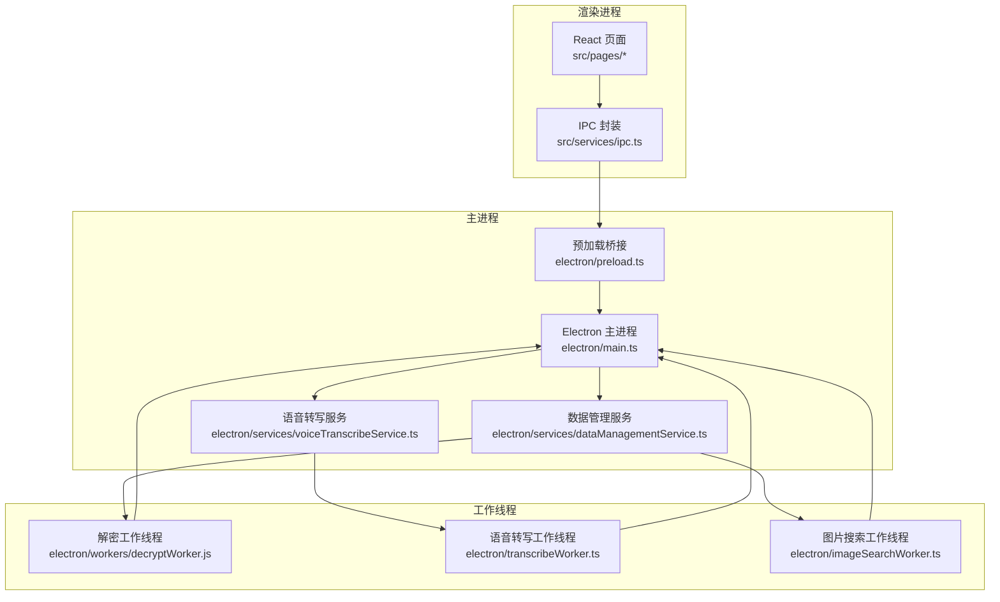
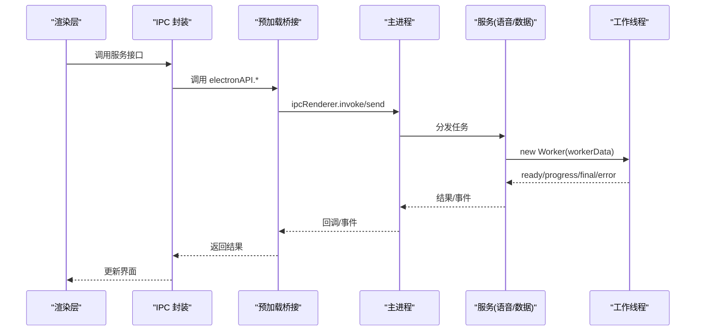
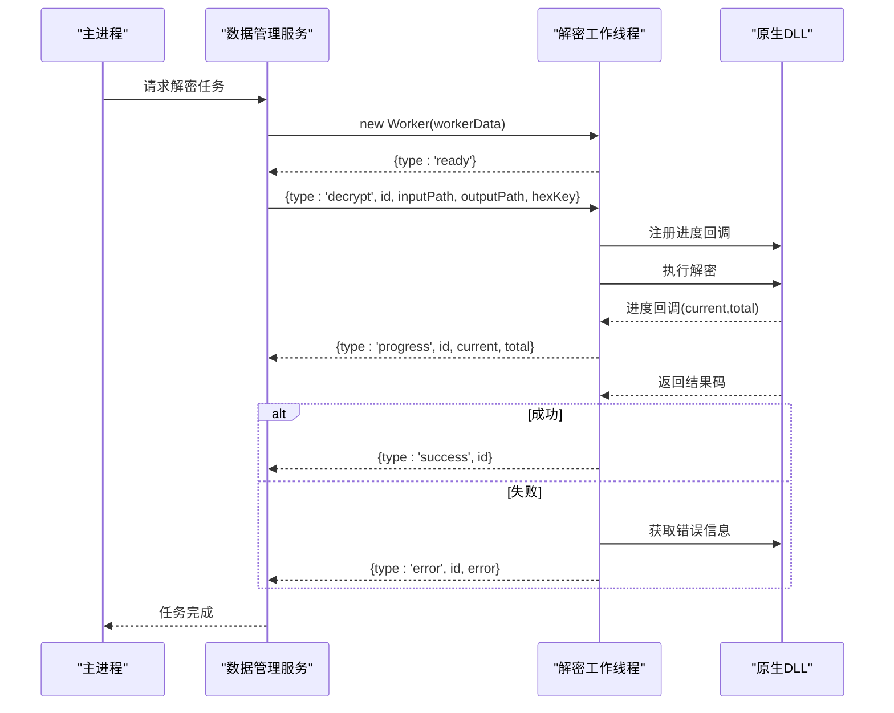
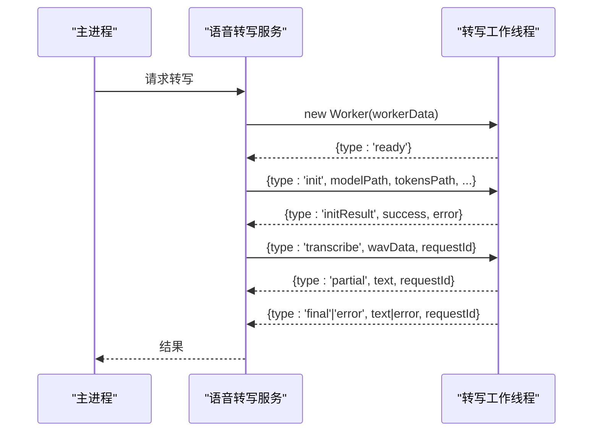
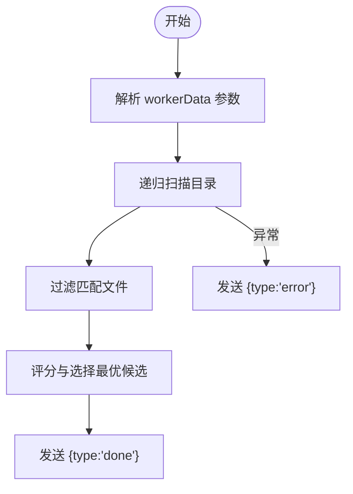
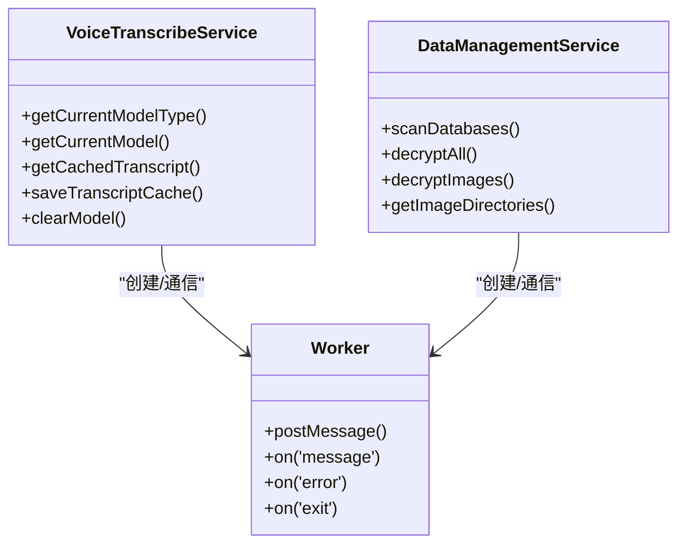
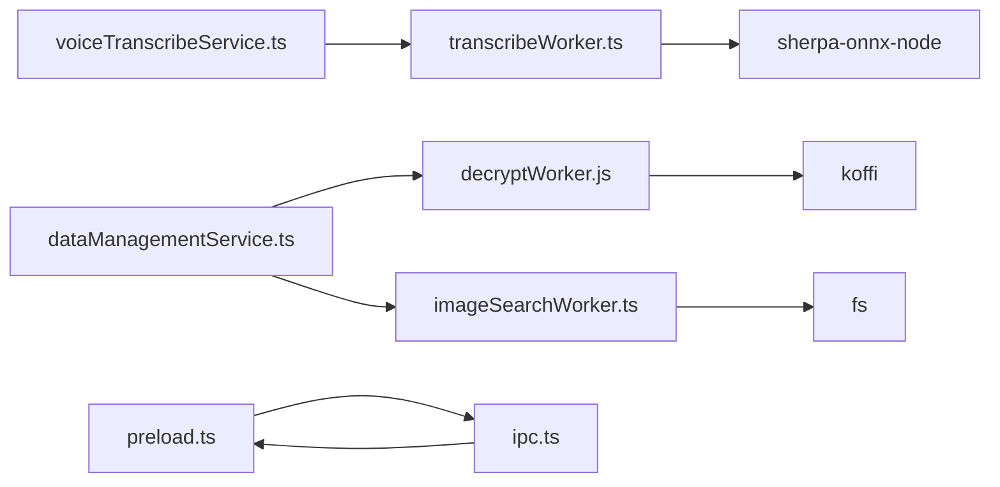

# 工作线程通信机制

<cite>
**本文档引用的文件**
- [decryptWorker.js](file://electron/workers/decryptWorker.js)
- [transcribeWorker.ts](file://electron/transcribeWorker.ts)
- [imageSearchWorker.ts](file://electron/imageSearchWorker.ts)
- [main.ts](file://electron/main.ts)
- [preload.ts](file://electron/preload.ts)
- [ipc.ts](file://src/services/ipc.ts)
- [voiceTranscribeService.ts](file://electron/services/voiceTranscribeService.ts)
- [dataManagementService.ts](file://electron/services/dataManagementService.ts)
- [wasm_video_decode.js](file://electron/assets/wasm/wasm_video_decode.js)
</cite>

## 目录
1. [简介](#简介)
2. [项目结构](#项目结构)
3. [核心组件](#核心组件)
4. [架构总览](#架构总览)
5. [详细组件分析](#详细组件分析)
6. [依赖关系分析](#依赖关系分析)
7. [性能考虑](#性能考虑)
8. [故障排除指南](#故障排除指南)
9. [结论](#结论)
10. [附录](#附录)

## 简介
本文件系统性梳理 CipherTalk 的工作线程通信机制，重点覆盖以下方面：
- 工作线程与主线程的通信协议：消息传递机制、数据序列化方案、事件驱动模型
- 通信接口设计：消息格式定义、参数传递规范、返回值约定
- 错误处理机制：异常传播、错误码定义、降级策略
- 性能优化策略：消息批量处理、内存共享、零拷贝技术
- 工作线程生命周期管理：线程创建销毁、资源分配回收、状态同步
- 通信调试工具和监控方法
- 面向开发者的完整实现指南和最佳实践

## 项目结构
CipherTalk 在 Electron 环境中通过 worker_threads 实现多工作线程并发处理，主要涉及三类工作线程：
- 解密工作线程：调用原生 DLL 执行数据库解密，实时上报进度
- 语音转写工作线程：基于 Sherpa-ONNX 的本地离线识别，支持部分结果流式输出
- 图片搜索工作线程：在文件系统中检索匹配的图片数据文件

主线程通过 IPC 暴露统一 API，渲染层通过封装的服务接口发起任务；工作线程通过 parentPort 与主线程通信。

**图表来源**
- [main.ts](file://electron/main.ts)
- [preload.ts](file://electron/preload.ts)
- [ipc.ts](file://src/services/ipc.ts)
- [voiceTranscribeService.ts](file://electron/services/voiceTranscribeService.ts)
- [dataManagementService.ts](file://electron/services/dataManagementService.ts)
- [decryptWorker.js](file://electron/workers/decryptWorker.js)
- [transcribeWorker.ts](file://electron/transcribeWorker.ts)
- [imageSearchWorker.ts](file://electron/imageSearchWorker.ts)

**章节来源**
- [main.ts](file://electron/main.ts)
- [preload.ts](file://electron/preload.ts)
- [ipc.ts](file://src/services/ipc.ts)

## 核心组件
- 工作线程宿主与消息协议
  - 工作线程通过 worker_threads 的 parentPort 接收主线程消息，通过 postMessage 发送事件
  - 消息类型包括：初始化、任务执行、进度、最终结果、错误等
- 主线程服务编排
  - 语音转写服务负责创建工作线程、参数组装、结果聚合与缓存
  - 数据管理服务负责扫描、解密、增量更新等任务的调度
- 预加载桥接与 IPC
  - preload 暴露 electronAPI 到渲染进程，统一调用入口
  - 渲染层通过 src/services/ipc.ts 的封装调用

**章节来源**
- [decryptWorker.js](file://electron/workers/decryptWorker.js)
- [transcribeWorker.ts](file://electron/transcribeWorker.ts)
- [imageSearchWorker.ts](file://electron/imageSearchWorker.ts)
- [voiceTranscribeService.ts](file://electron/services/voiceTranscribeService.ts)
- [dataManagementService.ts](file://electron/services/dataManagementService.ts)
- [preload.ts](file://electron/preload.ts)
- [ipc.ts](file://src/services/ipc.ts)

## 架构总览
工作线程通信采用事件驱动的消息模型：
- 渲染层通过 IPC 请求触发主进程服务
- 主进程服务创建工作线程并传递 workerData
- 工作线程执行任务并通过 parentPort 发送事件
- 主进程接收事件并转发给渲染层或持久化

**图表来源**
- [main.ts](file://electron/main.ts)
- [preload.ts](file://electron/preload.ts)
- [ipc.ts](file://src/services/ipc.ts)
- [voiceTranscribeService.ts](file://electron/services/voiceTranscribeService.ts)
- [transcribeWorker.ts](file://electron/transcribeWorker.ts)

## 详细组件分析

### 解密工作线程（数据库解密）
- 职责：加载原生 DLL，执行数据库解密，回调上报进度，返回成功/错误
- 通信协议：
  - 主线程发送消息：{ type: 'decrypt', id, inputPath, outputPath, hexKey }
  - 工作线程发送消息：{ type: 'ready' }（就绪）、{ type: 'progress', id, current, total }（进度）、{ type: 'success', id }（成功）、{ type: 'error', id, error }（错误）
- 数据序列化：使用 Buffer/字符串传递路径与密钥；进度通过数值字段传递
- 错误处理：捕获异常并上报；调用原生接口获取错误信息
- 生命周期：初始化加载 DLL，注册回调，执行完成后注销回调；就绪后等待任务

**图表来源**
- [decryptWorker.js](file://electron/workers/decryptWorker.js)
- [dataManagementService.ts](file://electron/services/dataManagementService.ts)

**章节来源**
- [decryptWorker.js](file://electron/workers/decryptWorker.js)

### 语音转写工作线程（Sherpa-ONNX）
- 职责：初始化识别器、解析 WAV、执行转写、过滤语言、流式返回部分结果
- 通信协议：
  - 主线程发送消息：{ type: 'init', modelPath, tokensPath, sampleRate, language, allowedLanguages } 或 { type: 'transcribe', wavData, requestId }
  - 工作线程发送消息：{ type: 'initResult', success, error }、{ type: 'partial', text }、{ type: 'final', text, error }、{ type: 'error', error }
- 数据序列化：WAV 数据以 Buffer 形式传递；识别器配置以对象形式传递
- 错误处理：初始化失败、解析失败、识别异常均通过 error 消息上报
- 生命周期：启动时可直接初始化并处理一次性任务；后续可通过消息动态初始化与转写

**图表来源**
- [transcribeWorker.ts](file://electron/transcribeWorker.ts)
- [voiceTranscribeService.ts](file://electron/services/voiceTranscribeService.ts)

**章节来源**
- [transcribeWorker.ts](file://electron/transcribeWorker.ts)
- [voiceTranscribeService.ts](file://electron/services/voiceTranscribeService.ts)

### 图片搜索工作线程（文件系统扫描）
- 职责：在指定根目录递归扫描匹配的图片数据文件，返回最佳候选
- 通信协议：
  - 主线程发送消息：workerData 包含 { root, datName, maxDepth, allowThumbnail, thumbOnly }
  - 工作线程发送消息：{ type: 'done', path, matchedBases }
- 数据序列化：使用对象传递扫描参数；结果为路径与匹配基集合
- 错误处理：异常通过 { type: 'error', error } 上报

**图表来源**
- [imageSearchWorker.ts](file://electron/imageSearchWorker.ts)

**章节来源**
- [imageSearchWorker.ts](file://electron/imageSearchWorker.ts)

### 主线程服务编排与 IPC
- 预加载桥接：将 ipcRenderer 暴露为 window.electronAPI，渲染层通过封装的 ipc.ts 调用
- 语音转写服务：负责模型管理、缓存、任务调度；创建 Worker 并监听消息
- 数据管理服务：负责数据库扫描、解密、增量更新；创建解密/图片搜索 Worker 并监听进度

**图表来源**
- [voiceTranscribeService.ts](file://electron/services/voiceTranscribeService.ts)
- [dataManagementService.ts](file://electron/services/dataManagementService.ts)

**章节来源**
- [preload.ts](file://electron/preload.ts)
- [ipc.ts](file://src/services/ipc.ts)
- [voiceTranscribeService.ts](file://electron/services/voiceTranscribeService.ts)
- [dataManagementService.ts](file://electron/services/dataManagementService.ts)

## 依赖关系分析
- 工作线程依赖
  - 解密工作线程依赖原生 DLL 与回调机制
  - 语音转写工作线程依赖 Sherpa-ONNX 模型与动态加载
  - 图片搜索工作线程依赖 Node.js 文件系统 API
- 主线程服务依赖
  - 语音转写服务依赖模型缓存数据库与网络下载
  - 数据管理服务依赖文件系统与配置服务
- IPC 层依赖
  - 预加载桥接依赖 Electron 的 contextBridge 与 ipcRenderer
  - 渲染层封装依赖预加载暴露的 electronAPI

**图表来源**
- [transcribeWorker.ts](file://electron/transcribeWorker.ts)
- [decryptWorker.js](file://electron/workers/decryptWorker.js)
- [imageSearchWorker.ts](file://electron/imageSearchWorker.ts)
- [voiceTranscribeService.ts](file://electron/services/voiceTranscribeService.ts)
- [dataManagementService.ts](file://electron/services/dataManagementService.ts)
- [preload.ts](file://electron/preload.ts)
- [ipc.ts](file://src/services/ipc.ts)

**章节来源**
- [transcribeWorker.ts](file://electron/transcribeWorker.ts)
- [decryptWorker.js](file://electron/workers/decryptWorker.js)
- [imageSearchWorker.ts](file://electron/imageSearchWorker.ts)
- [voiceTranscribeService.ts](file://electron/services/voiceTranscribeService.ts)
- [dataManagementService.ts](file://electron/services/dataManagementService.ts)
- [preload.ts](file://electron/preload.ts)
- [ipc.ts](file://src/services/ipc.ts)

## 性能考虑
- 消息批量处理
  - 解密工作线程对进度回调进行节流（约 100ms 一次），避免频繁 UI 更新
  - 语音转写工作线程在识别过程中流式返回部分结果，提升感知速度
- 内存共享与零拷贝
  - 语音转写工作线程直接使用 Float32Array 与 Buffer，避免重复拷贝
  - WASM 视频解码脚本展示了内存视图与堆缓冲区的直接映射，体现零拷贝思路
- 资源管理
  - 工作线程在任务结束后主动注销回调/释放资源，避免泄漏
  - 服务层在任务完成后终止 Worker，确保资源回收

**章节来源**
- [decryptWorker.js](file://electron/workers/decryptWorker.js)
- [transcribeWorker.ts](file://electron/transcribeWorker.ts)
- [wasm_video_decode.js](file://electron/assets/wasm/wasm_video_decode.js)

## 故障排除指南
- 常见错误类型
  - DLL 路径缺失或不可访问：解密工作线程会直接上报错误并退出
  - 识别器初始化失败：语音转写工作线程返回初始化错误
  - WAV 数据解析失败：语音转写工作线程返回解析错误
  - 任务执行异常：工作线程捕获异常并上报错误
- 错误传播路径
  - 工作线程 -> 服务层 -> 主进程 -> 预加载桥接 -> 渲染层
- 诊断建议
  - 检查 workerData 参数完整性
  - 确认模型/文件路径存在且可读
  - 关注进度事件，定位卡顿阶段
  - 使用日志服务查看详细错误栈

**章节来源**
- [decryptWorker.js](file://electron/workers/decryptWorker.js)
- [transcribeWorker.ts](file://electron/transcribeWorker.ts)
- [voiceTranscribeService.ts](file://electron/services/voiceTranscribeService.ts)

## 结论
CipherTalk 的工作线程通信机制以 worker_threads 为核心，结合 Electron 的 IPC 与预加载桥接，实现了清晰的任务分发与事件驱动的异步交互。通过标准化的消息协议、严格的错误处理与资源管理，系统在复杂 I/O 与计算密集型任务中保持了良好的稳定性与性能。开发者在扩展新的工作线程时，应遵循既有的消息格式、参数规范与生命周期管理最佳实践，确保整体架构的一致性与可维护性。

## 附录

### 通信接口设计规范
- 消息格式定义
  - 初始化：{ type: 'init', ...参数 }
  - 任务执行：{ type: 'decrypt' | 'transcribe', ...参数 }
  - 进度：{ type: 'progress', id, current, total }
  - 结果：{ type: 'success' | 'final', id | requestId, text? }
  - 错误：{ type: 'error', id | requestId, error }
- 参数传递规范
  - 路径与密钥使用字符串
  - 音频数据使用 Buffer
  - 配置使用对象，字段明确
- 返回值约定
  - 成功：对应成功消息
  - 失败：统一 error 字段，包含可读错误信息

**章节来源**
- [decryptWorker.js](file://electron/workers/decryptWorker.js)
- [transcribeWorker.ts](file://electron/transcribeWorker.ts)
- [imageSearchWorker.ts](file://electron/imageSearchWorker.ts)

### 生命周期管理最佳实践
- 创建：服务层负责创建 Worker，并传递必要的 workerData
- 就绪：工作线程发送 ready 消息，服务层开始下发任务
- 执行：工作线程按需注册回调/句柄，执行任务并上报进度
- 结束：工作线程在任务完成后注销回调并终止，服务层回收资源

**章节来源**
- [decryptWorker.js](file://electron/workers/decryptWorker.js)
- [transcribeWorker.ts](file://electron/transcribeWorker.ts)
- [imageSearchWorker.ts](file://electron/imageSearchWorker.ts)