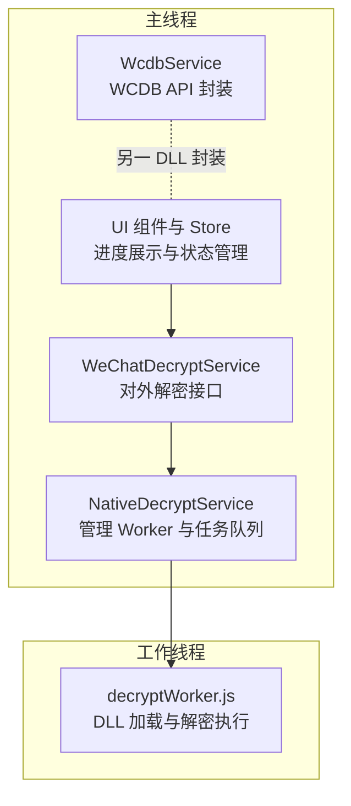
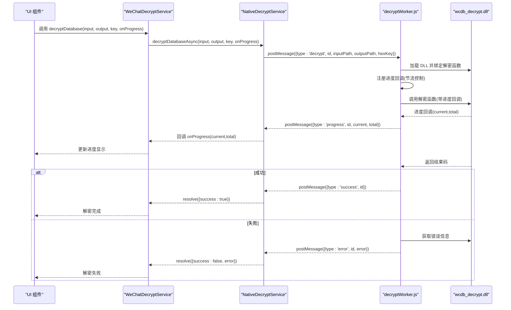
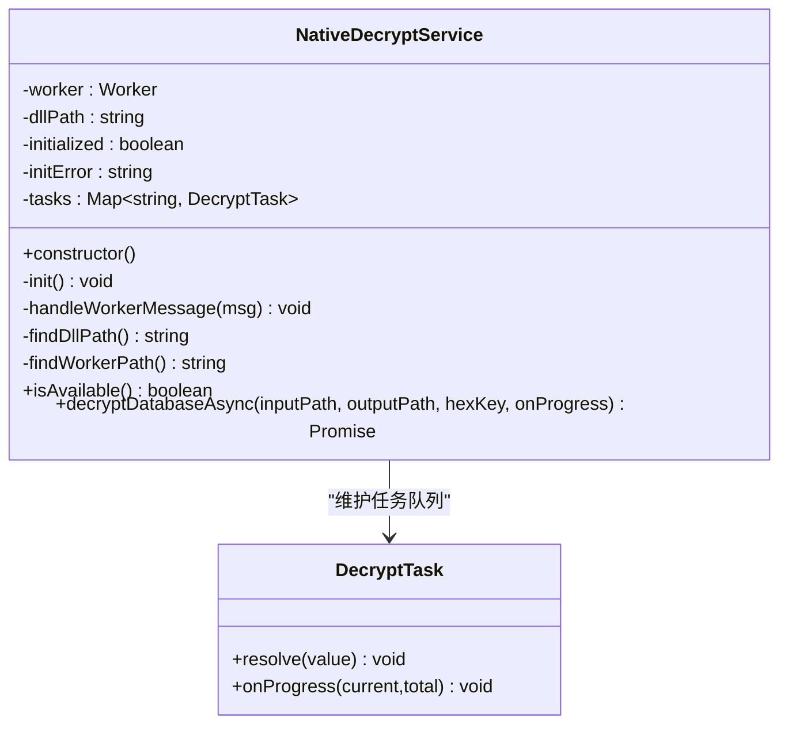
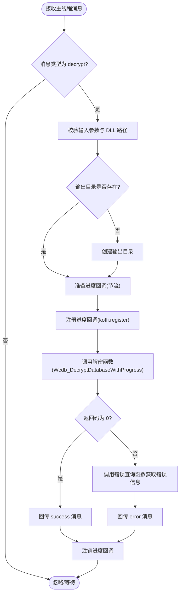
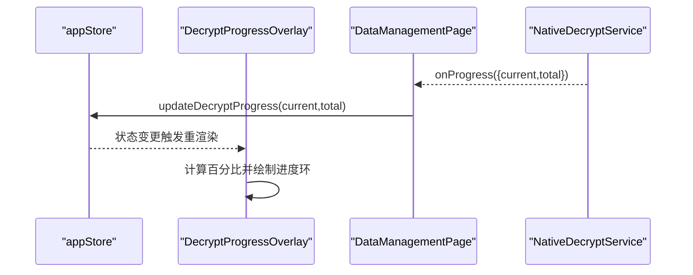
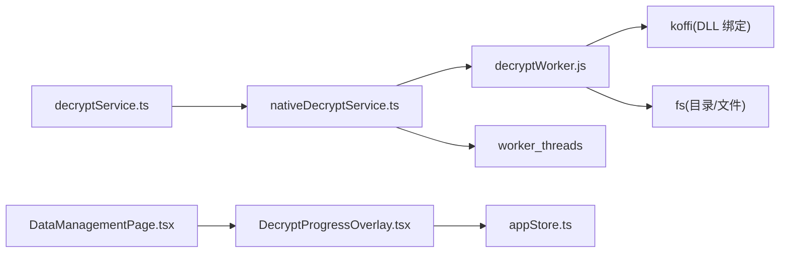

# 解密工作线程

<cite>
**本文档引用的文件**
- [electron/workers/decryptWorker.js](file://electron/workers/decryptWorker.js)
- [electron/services/nativeDecryptService.ts](file://electron/services/nativeDecryptService.ts)
- [electron/services/decryptService.ts](file://electron/services/decryptService.ts)
- [electron/services/decrypt.ts](file://electron/services/decrypt.ts)
- [electron/services/wcdbService.ts](file://electron/services/wcdbService.ts)
- [src/components/DecryptProgressOverlay.tsx](file://src/components/DecryptProgressOverlay.tsx)
- [src/stores/appStore.ts](file://src/stores/appStore.ts)
- [src/pages/DataManagementPage.tsx](file://src/pages/DataManagementPage.tsx)
</cite>

## 目录
1. [简介](#简介)
2. [项目结构](#项目结构)
3. [核心组件](#核心组件)
4. [架构总览](#架构总览)
5. [详细组件分析](#详细组件分析)
6. [依赖关系分析](#依赖关系分析)
7. [性能考虑](#性能考虑)
8. [故障排查指南](#故障排查指南)
9. [结论](#结论)
10. [附录](#附录)

## 简介
本文件针对 CipherTalk 的解密工作线程进行深入技术文档整理，重点覆盖以下方面：
- 基于 Electron worker_threads 的解密任务执行模型
- 原生 DLL 动态加载与函数绑定
- 进度回调机制与节流控制
- 解密流程实现：输入参数验证、输出目录创建、解密算法调用、错误处理
- 与主线程的通信协议：消息格式、数据序列化、异常处理
- 生命周期管理：线程初始化、任务调度、资源清理
- 性能优化策略与调试技巧
- 面向开发者的完整实现指导

## 项目结构
围绕解密工作线程的相关模块分布如下：
- 主线程服务层：负责 Worker 线程的生命周期管理、任务派发与进度回传整合
- 工作线程：负责 DLL 动态加载、进度回调注册与解密执行
- UI 层：展示解密进度与状态，驱动用户交互

**图表来源**
- [electron/services/nativeDecryptService.ts:24-216](file://electron/services/nativeDecryptService.ts#L24-L216)
- [electron/workers/decryptWorker.js:1-89](file://electron/workers/decryptWorker.js#L1-L89)
- [electron/services/decryptService.ts:7-54](file://electron/services/decryptService.ts#L7-L54)
- [electron/services/wcdbService.ts:5-390](file://electron/services/wcdbService.ts#L5-L390)
- [src/components/DecryptProgressOverlay.tsx:4-56](file://src/components/DecryptProgressOverlay.tsx#L4-L56)
- [src/stores/appStore.ts:10-97](file://src/stores/appStore.ts#L10-L97)

**章节来源**
- [electron/services/nativeDecryptService.ts:24-216](file://electron/services/nativeDecryptService.ts#L24-L216)
- [electron/workers/decryptWorker.js:1-89](file://electron/workers/decryptWorker.js#L1-L89)
- [electron/services/decryptService.ts:7-54](file://electron/services/decryptService.ts#L7-L54)
- [electron/services/wcdbService.ts:5-390](file://electron/services/wcdbService.ts#L5-L390)
- [src/components/DecryptProgressOverlay.tsx:4-56](file://src/components/DecryptProgressOverlay.tsx#L4-L56)
- [src/stores/appStore.ts:10-97](file://src/stores/appStore.ts#L10-L97)

## 核心组件
- NativeDecryptService：主线程侧的原生解密服务，负责 Worker 初始化、任务注册与消息路由
- decryptWorker.js：工作线程侧的解密执行器，负责 DLL 加载、进度回调与结果回传
- WeChatDecryptService：对外暴露的解密服务接口，封装异步调用与错误处理
- UI 进度组件与 Store：负责展示解密进度、百分比与状态文本

关键职责与交互：
- NativeDecryptService 通过 worker_threads 启动 decryptWorker.js，并将解密任务以消息形式下发
- decryptWorker.js 加载原生 DLL，绑定解密函数与进度回调，执行解密并将进度与结果回传主线程
- UI 通过 Store 与组件监听进度事件，实时展示解密状态

**章节来源**
- [electron/services/nativeDecryptService.ts:24-216](file://electron/services/nativeDecryptService.ts#L24-L216)
- [electron/workers/decryptWorker.js:1-89](file://electron/workers/decryptWorker.js#L1-L89)
- [electron/services/decryptService.ts:7-54](file://electron/services/decryptService.ts#L7-L54)
- [src/components/DecryptProgressOverlay.tsx:4-56](file://src/components/DecryptProgressOverlay.tsx#L4-L56)
- [src/stores/appStore.ts:10-97](file://src/stores/appStore.ts#L10-L97)

## 架构总览
解密工作线程采用“主线程服务 + 工作线程”的双层架构，确保解密过程不阻塞 UI。

**图表来源**
- [electron/services/decryptService.ts:21-51](file://electron/services/decryptService.ts#L21-L51)
- [electron/services/nativeDecryptService.ts:180-211](file://electron/services/nativeDecryptService.ts#L180-L211)
- [electron/workers/decryptWorker.js:25-81](file://electron/workers/decryptWorker.js#L25-L81)

## 详细组件分析

### NativeDecryptService（主线程服务）
- 职责
  - 查找 DLL 与 Worker 脚本路径，支持开发与打包两种模式
  - 初始化 Worker 线程并监听消息
  - 维护任务队列 Map，按任务 ID 分发进度、成功与错误消息
  - 提供 isAvailable 与 decryptDatabaseAsync 接口
- 关键实现要点
  - 任务 ID 生成：使用随机字符串，保证唯一性
  - 消息路由：根据消息类型分发至对应任务的回调或 resolve
  - Worker 异常处理：捕获 error 与 exit 事件，重置内部状态
  - 路径解析：多候选路径，优先命中存在项

**图表来源**
- [electron/services/nativeDecryptService.ts:24-216](file://electron/services/nativeDecryptService.ts#L24-L216)

**章节来源**
- [electron/services/nativeDecryptService.ts:24-216](file://electron/services/nativeDecryptService.ts#L24-L216)

### decryptWorker.js（工作线程）
- 职责
  - 加载 DLL 并绑定解密函数与错误查询函数
  - 注册进度回调，带节流控制（每 100ms 至少一次）
  - 执行解密，成功返回 success，失败通过 DLL 获取错误信息并回传 error
  - 通知主线程 ready，处理异常并回传 error
- 关键实现要点
  - DLL 路径校验：若不存在直接回传错误并退出
  - 输出目录创建：确保目标目录存在
  - 进度回调节流：lastUpdate 记录上次更新时间，避免频繁消息
  - 回调注销：解密完成后注销回调，释放资源

**图表来源**
- [electron/workers/decryptWorker.js:25-81](file://electron/workers/decryptWorker.js#L25-L81)

**章节来源**
- [electron/workers/decryptWorker.js:1-89](file://electron/workers/decryptWorker.js#L1-L89)

### WeChatDecryptService（对外接口）
- 职责
  - 对外提供 decryptDatabase(inputPath, outputPath, hexKey, onProgress) 接口
  - 校验 nativeDecryptService 可用性，调用异步解密并处理返回结果
- 关键实现要点
  - 依赖 nativeDecryptService 的 isAvailable 与 decryptDatabaseAsync
  - 统一错误处理与日志输出

**章节来源**
- [electron/services/decryptService.ts:7-54](file://electron/services/decryptService.ts#L7-L54)

### UI 进度展示（组件与状态）
- DecryptProgressOverlay：根据 Store 中的 isDecrypting、decryptProgress、decryptTotal 渲染圆形进度条与百分比
- appStore：集中管理解密状态字段与更新方法
- DataManagementPage：监听来自后端的进度事件，动态更新进度弹窗

**图表来源**
- [src/components/DecryptProgressOverlay.tsx:4-56](file://src/components/DecryptProgressOverlay.tsx#L4-L56)
- [src/stores/appStore.ts:40-97](file://src/stores/appStore.ts#L40-L97)
- [src/pages/DataManagementPage.tsx:172-192](file://src/pages/DataManagementPage.tsx#L172-L192)

**章节来源**
- [src/components/DecryptProgressOverlay.tsx:4-56](file://src/components/DecryptProgressOverlay.tsx#L4-L56)
- [src/stores/appStore.ts:10-97](file://src/stores/appStore.ts#L10-L97)
- [src/pages/DataManagementPage.tsx:172-192](file://src/pages/DataManagementPage.tsx#L172-L192)

## 依赖关系分析
- NativeDecryptService 依赖 worker_threads 启动 decryptWorker.js，并通过 postMessage 与 Worker 通信
- decryptWorker.js 依赖 koffi 动态加载 DLL 并绑定函数，依赖 fs 进行目录与文件操作
- WeChatDecryptService 依赖 NativeDecryptService 的异步接口
- UI 层通过 Store 与组件监听进度事件，形成闭环

**图表来源**
- [electron/services/decryptService.ts:1-54](file://electron/services/decryptService.ts#L1-L54)
- [electron/services/nativeDecryptService.ts:1-216](file://electron/services/nativeDecryptService.ts#L1-L216)
- [electron/workers/decryptWorker.js:1-89](file://electron/workers/decryptWorker.js#L1-L89)
- [src/components/DecryptProgressOverlay.tsx:1-56](file://src/components/DecryptProgressOverlay.tsx#L1-L56)
- [src/stores/appStore.ts:1-97](file://src/stores/appStore.ts#L1-L97)
- [src/pages/DataManagementPage.tsx:1-200](file://src/pages/DataManagementPage.tsx#L1-L200)

**章节来源**
- [electron/services/decryptService.ts:1-54](file://electron/services/decryptService.ts#L1-L54)
- [electron/services/nativeDecryptService.ts:1-216](file://electron/services/nativeDecryptService.ts#L1-L216)
- [electron/workers/decryptWorker.js:1-89](file://electron/workers/decryptWorker.js#L1-L89)
- [src/components/DecryptProgressOverlay.tsx:1-56](file://src/components/DecryptProgressOverlay.tsx#L1-L56)
- [src/stores/appStore.ts:1-97](file://src/stores/appStore.ts#L1-L97)
- [src/pages/DataManagementPage.tsx:1-200](file://src/pages/DataManagementPage.tsx#L1-L200)

## 性能考虑
- 进度节流：工作线程内对进度回调设置最小更新间隔，降低主线程压力
- 异步解密：通过 Worker 独立线程执行，避免阻塞 UI
- 资源释放：解密完成后注销进度回调，减少内存占用
- 路径查找：多候选路径策略，优先命中存在项，减少 IO 失败
- 日志控制：减少高频日志输出，避免影响性能

[本节为通用性能建议，无需特定文件引用]

## 故障排查指南
- DLL 路径错误
  - 现象：Worker 启动即报错或立即退出
  - 排查：确认 DLL 存在；检查 NativeDecryptService 的路径查找逻辑
  - 参考
    - [electron/services/nativeDecryptService.ts:122-137](file://electron/services/nativeDecryptService.ts#L122-L137)
    - [electron/workers/decryptWorker.js:9-12](file://electron/workers/decryptWorker.js#L9-L12)
- Worker 未就绪或异常退出
  - 现象：任务无法发起或中途中断
  - 排查：检查 Worker 初始化日志与 error/exit 事件处理
  - 参考
    - [electron/services/nativeDecryptService.ts:62-78](file://electron/services/nativeDecryptService.ts#L62-L78)
- 进度不更新
  - 现象：UI 无进度变化
  - 排查：确认进度回调节流阈值与消息路由；检查 UI 监听逻辑
  - 参考
    - [electron/workers/decryptWorker.js:37-51](file://electron/workers/decryptWorker.js#L37-L51)
    - [electron/services/nativeDecryptService.ts:91-117](file://electron/services/nativeDecryptService.ts#L91-L117)
- 解密失败
  - 现象：返回 error 消息
  - 排查：查看 DLL 返回码与错误信息；核对输入参数与密钥
  - 参考
    - [electron/workers/decryptWorker.js:59-72](file://electron/workers/decryptWorker.js#L59-L72)

**章节来源**
- [electron/services/nativeDecryptService.ts:62-78](file://electron/services/nativeDecryptService.ts#L62-L78)
- [electron/workers/decryptWorker.js:9-12](file://electron/workers/decryptWorker.js#L9-L12)
- [electron/workers/decryptWorker.js:37-51](file://electron/workers/decryptWorker.js#L37-L51)
- [electron/workers/decryptWorker.js:59-72](file://electron/workers/decryptWorker.js#L59-L72)

## 结论
CipherTalk 的解密工作线程通过“主线程服务 + 工作线程”的架构实现了高性能、可扩展的解密能力。其关键优势包括：
- 使用 worker_threads 避免 UI 阻塞
- 通过 koffi 动态绑定原生 DLL，提升解密效率
- 进度回调节流与清晰的消息协议，保障实时反馈
- 完整的生命周期管理与错误处理，增强稳定性

[本节为总结性内容，无需特定文件引用]

## 附录

### 消息协议与数据格式
- 主线程 -> Worker
  - 类型：decrypt
  - 字段：id（任务 ID）、inputPath（输入路径）、outputPath（输出路径）、hexKey（十六进制密钥）
- Worker -> 主线程
  - 类型：ready（初始化完成）
  - 类型：progress（进度更新）：id、current、total
  - 类型：success（成功）：id
  - 类型：error（失败）：id、error（错误信息）

**章节来源**
- [electron/services/nativeDecryptService.ts:196-211](file://electron/services/nativeDecryptService.ts#L196-L211)
- [electron/workers/decryptWorker.js:25-81](file://electron/workers/decryptWorker.js#L25-L81)

### 与 WCDB API 的对比
- WCDB API 封装（非解密工作线程）
  - 通过 wcdb_api.dll 提供数据库连接、查询等能力
  - 与解密工作线程的 DLL（wcdb_decrypt.dll）不同，职责分离
- 参考
  - [electron/services/wcdbService.ts:25-31](file://electron/services/wcdbService.ts#L25-L31)
  - [electron/services/wcdbService.ts:97-104](file://electron/services/wcdbService.ts#L97-L104)

**章节来源**
- [electron/services/wcdbService.ts:25-31](file://electron/services/wcdbService.ts#L25-L31)
- [electron/services/wcdbService.ts:97-104](file://electron/services/wcdbService.ts#L97-L104)