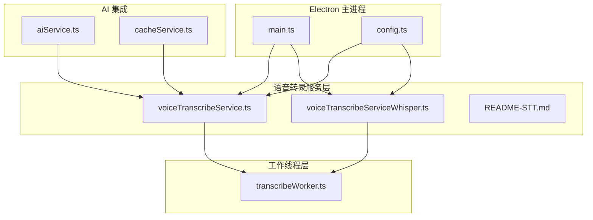
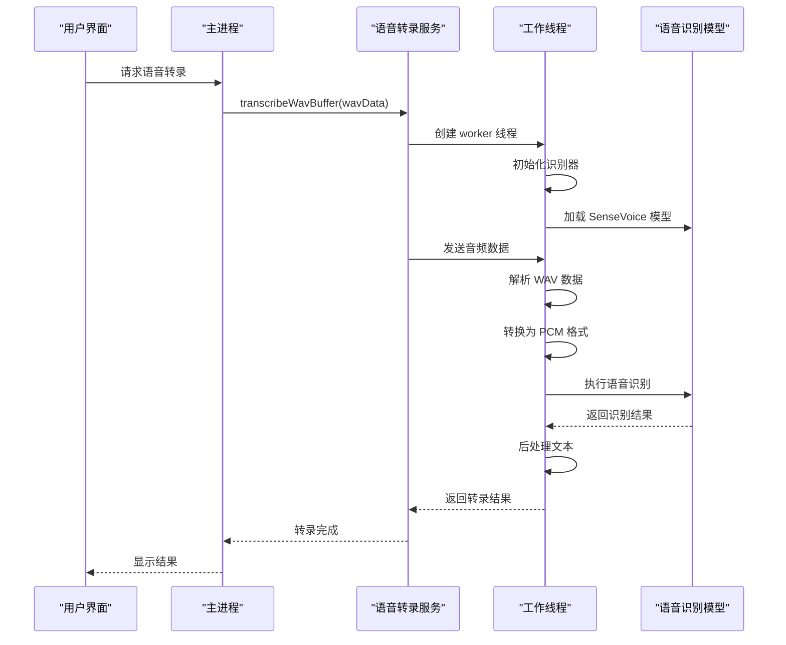
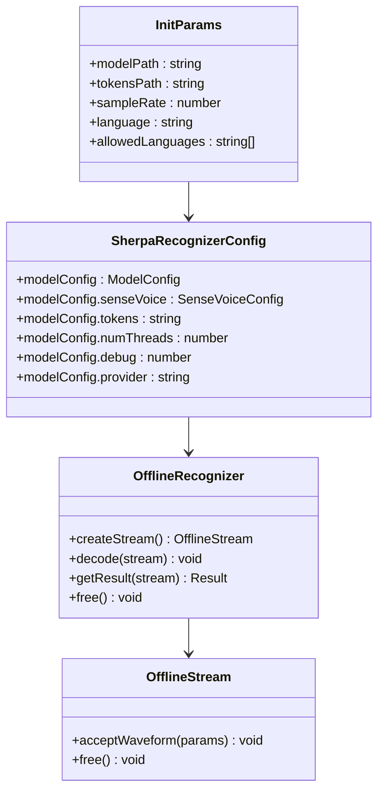
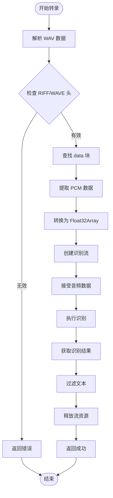
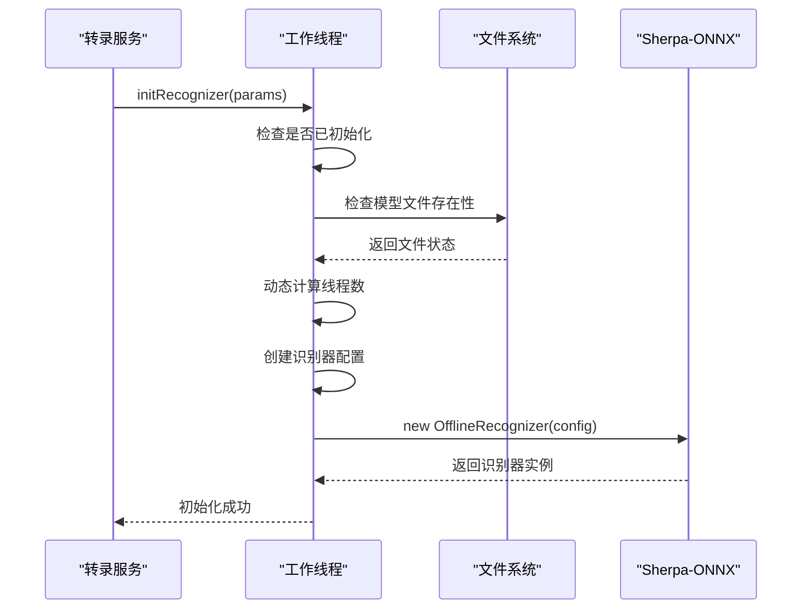
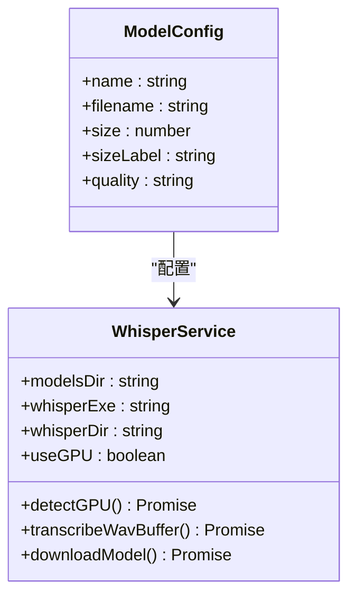
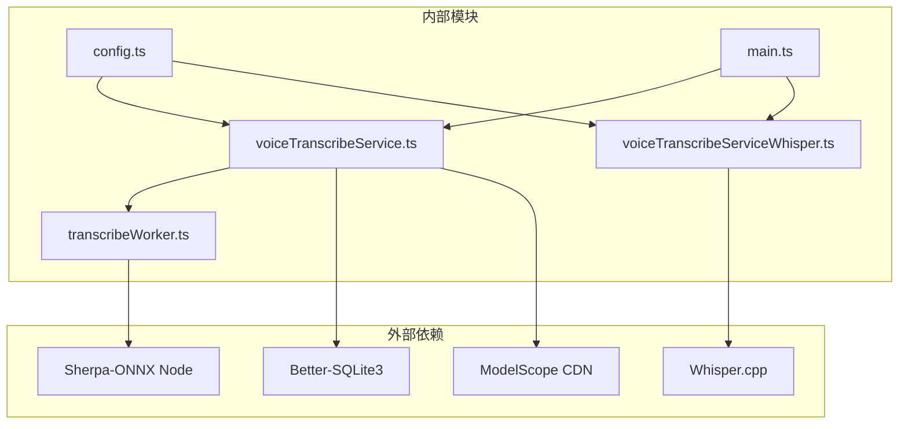
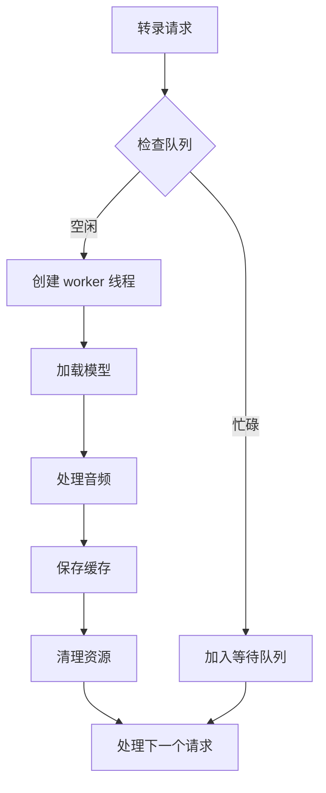
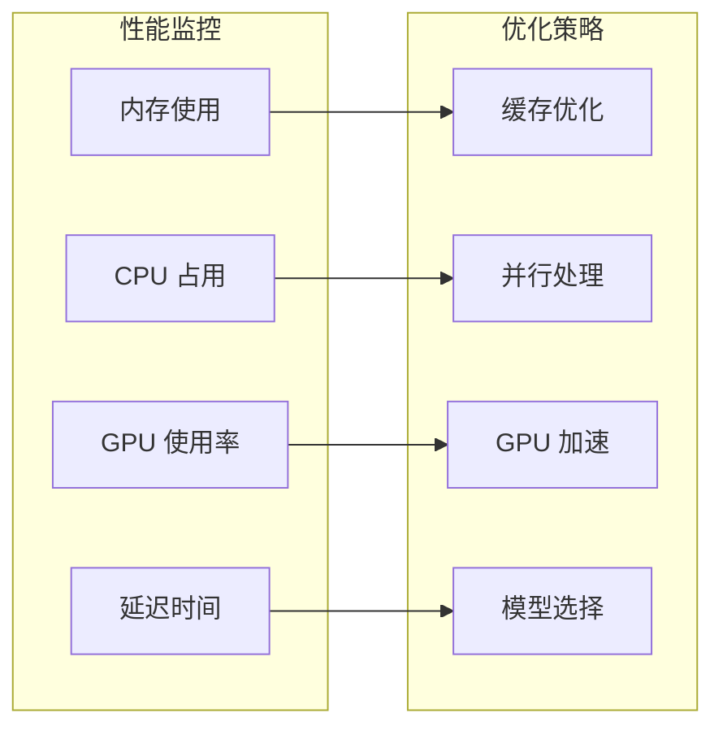

# 语音转录工作线程

<cite>
**本文档引用的文件**
- [transcribeWorker.ts](file://electron/transcribeWorker.ts)
- [voiceTranscribeService.ts](file://electron/services/voiceTranscribeService.ts)
- [voiceTranscribeServiceWhisper.ts](file://electron/services/voiceTranscribeServiceWhisper.ts)
- [README-STT.md](file://electron/services/README-STT.md)
- [config.ts](file://electron/services/config.ts)
- [main.ts](file://electron/main.ts)
- [aiService.ts](file://electron/services/ai/aiService.ts)
- [cacheService.ts](file://electron/services/cacheService.ts)
</cite>

## 目录
1. [简介](#简介)
2. [项目结构](#项目结构)
3. [核心组件](#核心组件)
4. [架构概览](#架构概览)
5. [详细组件分析](#详细组件分析)
6. [依赖关系分析](#依赖关系分析)
7. [性能考虑](#性能考虑)
8. [故障排除指南](#故障排除指南)
9. [结论](#结论)

## 简介

CipherTalk 的语音转录工作线程是一个高性能的音频处理系统，专门设计用于在 Electron 应用中执行实时语音识别任务。该系统提供了两种不同的识别引擎：基于 SenseVoice 的本地 CPU 识别和基于 Whisper.cpp 的 GPU 加速识别，为不同硬件配置的用户提供最佳的性能体验。

系统采用多线程架构，通过 worker_threads 实现音频数据的异步处理，确保主线程的流畅响应。支持多种音频格式转换、智能模型缓存、并发任务管理和内存优化策略。

## 项目结构

语音转录功能在 CipherTalk 项目中的组织结构如下：



**图表来源**
- [main.ts:23-25](file://electron/main.ts#L23-L25)
- [voiceTranscribeService.ts:70](file://electron/services/voiceTranscribeService.ts#L70-L77)
- [voiceTranscribeServiceWhisper.ts:79](file://electron/services/voiceTranscribeServiceWhisper.ts#L79-L83)

**章节来源**
- [main.ts:23-25](file://electron/main.ts#L23-L25)
- [voiceTranscribeService.ts:70](file://electron/services/voiceTranscribeService.ts#L70-L77)
- [voiceTranscribeServiceWhisper.ts:79](file://electron/services/voiceTranscribeServiceWhisper.ts#L79-L83)

## 核心组件

### 语音转录工作线程 (transcribeWorker.ts)

语音转录工作线程是整个系统的执行核心，负责：

- **音频格式解析**：支持 WAV 格式的动态解析和 PCM 数据提取
- **模型初始化**：动态加载 Sherpa-ONNX 识别器和 SenseVoice 模型
- **转录执行**：完整的音频转写流程，包括数据预处理和结果后处理
- **异步通信**：通过 worker_threads 与主线程进行消息传递

### 语音转录服务 (voiceTranscribeService.ts)

语音转录服务提供高级别的转录管理功能：

- **模型管理**：自动下载、验证和清理 SenseVoice 模型文件
- **缓存系统**：基于 SQLite 的转录结果缓存机制
- **配置集成**：与全局配置系统集成，支持多语言配置
- **任务调度**：协调多个转录任务的执行和资源管理

### Whisper 语音转录服务 (voiceTranscribeServiceWhisper.ts)

Whisper 语音转录服务提供 GPU 加速的替代方案：

- **多模型支持**：支持 tiny、base、small、medium、large-v3 等多种模型
- **GPU 检测**：自动检测和配置 NVIDIA CUDA 加速
- **跨平台兼容**：支持 CPU 和 GPU 模式的自动回退
- **性能优化**：针对不同硬件配置提供最优的模型选择建议

**章节来源**
- [transcribeWorker.ts:1-261](file://electron/transcribeWorker.ts#L1-L261)
- [voiceTranscribeService.ts:70-534](file://electron/services/voiceTranscribeService.ts#L70-L534)
- [voiceTranscribeServiceWhisper.ts:79-512](file://electron/services/voiceTranscribeServiceWhisper.ts#L79-L512)

## 架构概览

语音转录系统的整体架构采用分层设计，确保了模块化和可扩展性：



**图表来源**
- [voiceTranscribeService.ts:368-448](file://electron/services/voiceTranscribeService.ts#L368-L448)
- [transcribeWorker.ts:164-200](file://electron/transcribeWorker.ts#L164-L200)

### 异步处理机制

系统实现了完善的异步处理机制：

- **任务队列管理**：每个转录请求创建独立的 worker 线程
- **并发控制**：通过 worker_threads 限制同时运行的转录任务数量
- **内存优化**：及时释放 worker 线程和模型资源
- **错误恢复**：自动处理 worker 异常和模型加载失败

**章节来源**
- [voiceTranscribeService.ts:389-448](file://electron/services/voiceTranscribeService.ts#L389-L448)
- [transcribeWorker.ts:202-260](file://electron/transcribeWorker.ts#L202-L260)

## 详细组件分析

### 语音转录工作线程详细分析

#### 核心数据结构



**图表来源**
- [transcribeWorker.ts:11-43](file://electron/transcribeWorker.ts#L11-L43)

#### 音频格式转换流程



**图表来源**
- [transcribeWorker.ts:54-199](file://electron/transcribeWorker.ts#L54-L199)

#### 模型初始化流程



**图表来源**
- [transcribeWorker.ts:81-131](file://electron/transcribeWorker.ts#L81-L131)

**章节来源**
- [transcribeWorker.ts:54-199](file://electron/transcribeWorker.ts#L54-L199)
- [transcribeWorker.ts:81-131](file://electron/transcribeWorker.ts#L81-L131)

### 语音转录服务详细分析

#### 模型管理系统

语音转录服务实现了完整的模型生命周期管理：

- **模型类型**：支持 int8 量化版和 float32 完整版两种模型
- **下载机制**：从 ModelScope 服务器下载模型文件
- **状态监控**：实时监控模型文件的存在性和完整性
- **清理策略**：提供模型文件的清理和重新下载功能

#### 缓存系统架构

```mermaid
erDiagram
TRANSCRIPT_CACHE {
CACHE_KEY PK
SESSION_ID
CREATE_TIME
TRANSCRIPT
CREATED_AT
}
CONFIG {
KEY PK
VALUE
}
TRANSCRIPT_CACHE ||--|| CONFIG : "使用缓存路径"
```

**图表来源**
- [voiceTranscribeService.ts:115-131](file://electron/services/voiceTranscribeService.ts#L115-L131)
- [voiceTranscribeService.ts:142-144](file://electron/services/voiceTranscribeService.ts#L142-L144)

#### 任务调度机制

服务层负责协调多个转录任务的执行：

- **并发限制**：通过 worker_threads 限制同时运行的任务数量
- **资源管理**：自动管理模型文件和临时文件的生命周期
- **错误处理**：提供完善的错误捕获和恢复机制
- **进度通知**：支持下载进度和转录进度的实时反馈

**章节来源**
- [voiceTranscribeService.ts:115-187](file://electron/services/voiceTranscribeService.ts#L115-L187)
- [voiceTranscribeService.ts:293-363](file://electron/services/voiceTranscribeService.ts#L293-L363)

### Whisper 语音转录服务详细分析

#### GPU 加速架构

Whisper 服务提供了完整的 GPU 加速解决方案：

- **硬件检测**：自动检测 NVIDIA GPU 和 CUDA 支持
- **模型选择**：根据硬件能力选择最优的模型大小
- **性能优化**：针对不同硬件配置提供性能建议
- **回退机制**：GPU 不可用时自动回退到 CPU 模式

#### 模型配置管理



**图表来源**
- [voiceTranscribeServiceWhisper.ts:12-77](file://electron/services/voiceTranscribeServiceWhisper.ts#L12-L77)
- [voiceTranscribeServiceWhisper.ts:79-106](file://electron/services/voiceTranscribeServiceWhisper.ts#L79-L106)

#### 性能优化策略

Whisper 服务实现了多项性能优化：

- **GPU 检测**：通过 nvidia-smi 命令检测 GPU 可用性
- **自动回退**：GPU 不可用时自动使用 CPU 模式
- **模型压缩**：提供多种模型大小以适应不同硬件配置
- **内存管理**：优化临时文件的创建和清理

**章节来源**
- [voiceTranscribeServiceWhisper.ts:128-201](file://electron/services/voiceTranscribeServiceWhisper.ts#L128-L201)
- [voiceTranscribeServiceWhisper.ts:248-332](file://electron/services/voiceTranscribeServiceWhisper.ts#L248-L332)

## 依赖关系分析

语音转录系统的依赖关系体现了清晰的分层架构：



**图表来源**
- [main.ts:23-25](file://electron/main.ts#L23-L25)
- [voiceTranscribeService.ts:6](file://electron/services/voiceTranscribeService.ts#L6-L12)
- [voiceTranscribeServiceWhisper.ts:5](file://electron/services/voiceTranscribeServiceWhisper.ts#L5-L10)

### 模块耦合度分析

系统采用了低耦合的设计原则：

- **服务层独立**：语音转录服务与具体实现分离
- **配置解耦**：通过配置服务统一管理所有设置
- **接口标准化**：两种识别引擎提供相同的接口
- **资源隔离**：每个转录任务都有独立的资源管理

**章节来源**
- [main.ts:23-25](file://electron/main.ts#L23-L25)
- [config.ts:6](file://electron/services/config.ts#L6-L80)

## 性能考虑

### 模型缓存策略

系统实现了多层次的缓存机制：

- **模型文件缓存**：下载的模型文件永久保存在本地
- **转录结果缓存**：基于 SQLite 的结果缓存，支持快速查询
- **配置缓存**：配置信息持久化存储，避免重复初始化
- **临时文件管理**：自动清理转录过程中的临时文件

### 并发控制机制



**图表来源**
- [voiceTranscribeService.ts:389-448](file://electron/services/voiceTranscribeService.ts#L389-L448)

### 内存优化策略

系统采用了多项内存优化技术：

- **流式处理**：音频数据以流的形式处理，避免大内存占用
- **及时释放**：worker 线程和模型资源在使用后立即释放
- **缓存管理**：定期清理过期的缓存数据
- **资源监控**：监控内存使用情况，防止内存泄漏

**章节来源**
- [voiceTranscribeService.ts:115-187](file://electron/services/voiceTranscribeService.ts#L115-L187)
- [transcribeWorker.ts:192-194](file://electron/transcribeWorker.ts#L192-L194)

## 故障排除指南

### 常见问题诊断

#### 模型文件问题

**症状**：转录服务报告模型文件不存在

**解决方案**：
1. 检查模型下载状态：`await voiceTranscribeService.getModelStatus()`
2. 重新下载模型：`await voiceTranscribeService.downloadModel()`
3. 验证文件完整性：检查模型文件大小和存在性

#### GPU 加速问题

**症状**：Whisper 服务无法使用 GPU 加速

**解决方案**：
1. 检查 GPU 检测：`await voiceTranscribeServiceWhisper.detectGPU()`
2. 验证 CUDA 支持：确认 ggml-cuda.dll 文件存在
3. 检查显存容量：确保有足够的显存支持所选模型

#### 内存泄漏问题

**症状**：应用内存使用持续增长

**解决方案**：
1. 检查 worker 线程状态：确认线程正确终止
2. 监控模型资源：验证模型文件正确释放
3. 清理缓存数据：定期清理过期的转录结果

### 调试方法

#### 日志记录

系统提供了全面的日志记录机制：

- **错误级别**：详细的错误信息和堆栈跟踪
- **性能指标**：转录耗时和资源使用情况
- **状态监控**：模型加载和转录进度的实时状态

#### 性能分析



**图表来源**
- [README-STT.md:55-69](file://electron/services/README-STT.md#L55-L69)

**章节来源**
- [README-STT.md:166-190](file://electron/services/README-STT.md#L166-L190)
- [voiceTranscribeService.ts:133-137](file://electron/services/voiceTranscribeService.ts#L133-L137)

## 结论

CipherTalk 的语音转录工作线程系统展现了现代桌面应用的优秀实践：

### 技术优势

- **双引擎架构**：提供 CPU 和 GPU 两种识别方案，满足不同硬件需求
- **异步处理**：通过 worker_threads 实现非阻塞的音频处理
- **智能缓存**：多层次的缓存机制确保高效的重复使用
- **错误恢复**：完善的错误处理和自动恢复机制

### 开发价值

- **模块化设计**：清晰的分层架构便于维护和扩展
- **配置灵活**：支持多种配置选项适应不同使用场景
- **性能优化**：针对不同硬件配置提供最优的性能表现
- **易于集成**：标准化的接口设计便于与其他组件集成

### 未来发展方向

1. **批量处理**：支持多个音频文件的批量转录
2. **实时流式**：实现实时音频流的连续转录
3. **模型微调**：支持用户自定义模型的加载和使用
4. **云服务集成**：提供云端语音识别服务的可选集成

该系统为开发者提供了一个完整的语音转录解决方案，既保证了高性能，又确保了良好的用户体验。