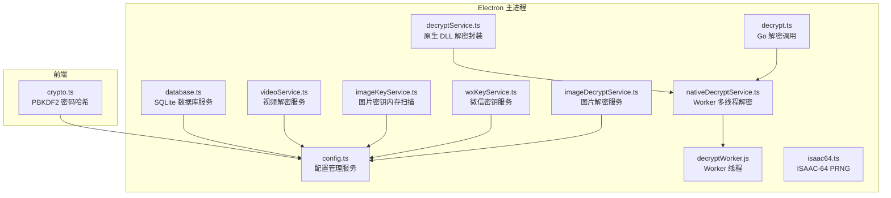
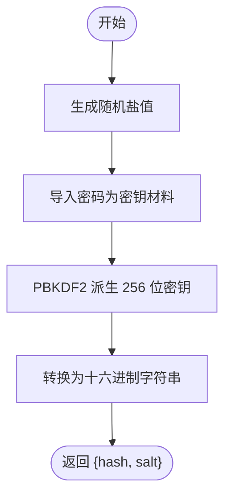
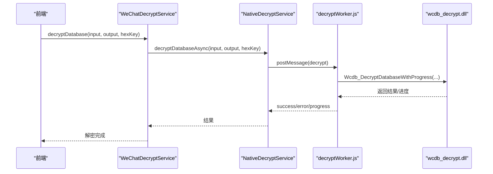
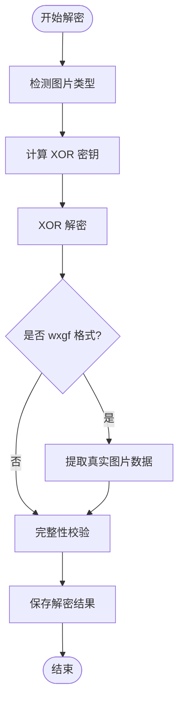
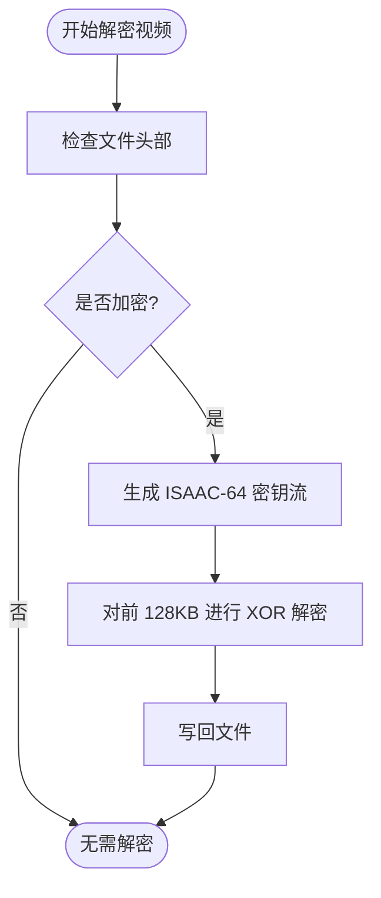
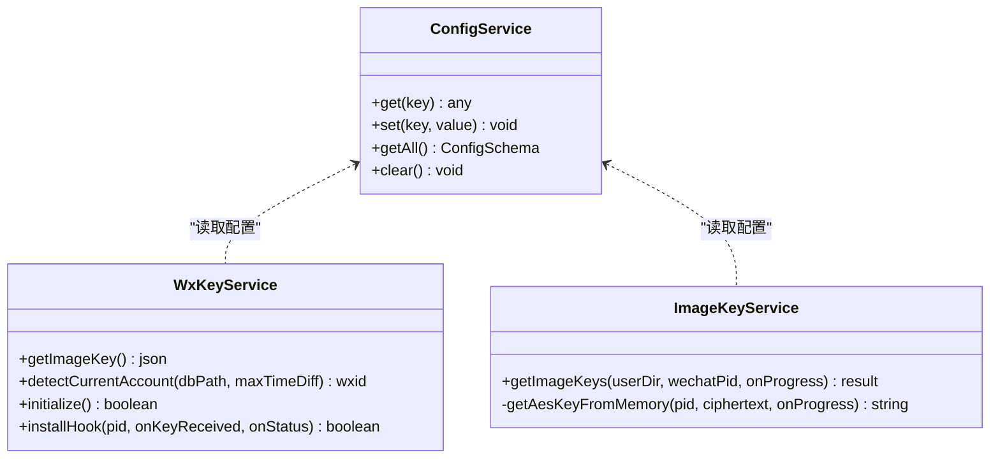
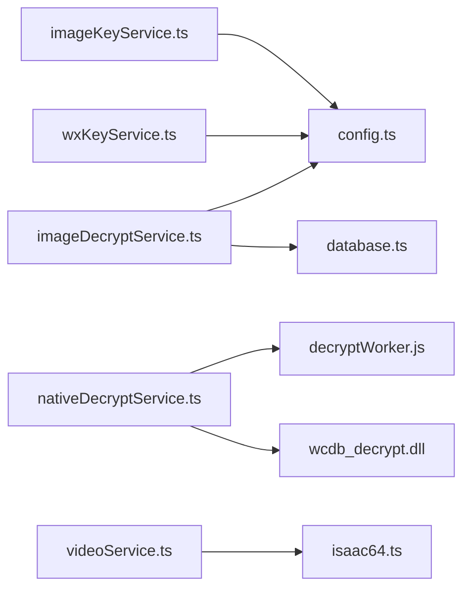

# 加密解密工具

<cite>
**本文档引用的文件**
- [decrypt.ts](file://electron/services/decrypt.ts)
- [decryptService.ts](file://electron/services/decryptService.ts)
- [imageDecryptService.ts](file://electron/services/imageDecryptService.ts)
- [wxKeyService.ts](file://electron/services/wxKeyService.ts)
- [nativeDecryptService.ts](file://electron/services/nativeDecryptService.ts)
- [imageKeyService.ts](file://electron/services/imageKeyService.ts)
- [videoService.ts](file://electron/services/videoService.ts)
- [crypto.ts](file://src/utils/crypto.ts)
- [config.ts](file://electron/services/config.ts)
- [database.ts](file://electron/services/database.ts)
- [decryptWorker.js](file://electron/workers/decryptWorker.js)
- [isaac64.ts](file://electron/services/isaac64.ts)
- [README.md](file://README.md)
</cite>

## 目录
1. [简介](#简介)
2. [项目结构](#项目结构)
3. [核心组件](#核心组件)
4. [架构总览](#架构总览)
5. [详细组件分析](#详细组件分析)
6. [依赖关系分析](#依赖关系分析)
7. [性能考虑](#性能考虑)
8. [故障排除指南](#故障排除指南)
9. [结论](#结论)
10. [附录](#附录)

## 简介
CipherTalk 是一款现代化的微信聊天记录查看与分析工具，提供安全可靠的加密解密能力。本文档深入解析其加密解密工具的技术实现，涵盖密码哈希算法 PBKDF2、微信数据解密流程（数据库、图片、音频）、密钥管理策略以及性能与安全性评估。

## 项目结构
该项目采用 Electron + React 架构，加密解密相关的核心逻辑集中在 electron/services 目录中，前端工具函数位于 src/utils。

**图表来源**
- [decrypt.ts:1-109](file://electron/services/decrypt.ts#L1-L109)
- [decryptService.ts:1-54](file://electron/services/decryptService.ts#L1-L54)
- [nativeDecryptService.ts:1-216](file://electron/services/nativeDecryptService.ts#L1-L216)
- [imageDecryptService.ts:1-800](file://electron/services/imageDecryptService.ts#L1-L800)
- [wxKeyService.ts:1-498](file://electron/services/wxKeyService.ts#L1-L498)
- [imageKeyService.ts:1-444](file://electron/services/imageKeyService.ts#L1-L444)
- [videoService.ts:1-567](file://electron/services/videoService.ts#L1-L567)
- [database.ts:1-83](file://electron/services/database.ts#L1-L83)
- [config.ts:1-395](file://electron/services/config.ts#L1-L395)
- [decryptWorker.js:1-89](file://electron/workers/decryptWorker.js#L1-L89)
- [isaac64.ts:1-128](file://electron/services/isaac64.ts#L1-L128)
- [crypto.ts:1-31](file://src/utils/crypto.ts#L1-L31)

**章节来源**
- [README.md:132-160](file://README.md#L132-L160)

## 核心组件
- PBKDF2 密码哈希：基于浏览器 WebCrypto SubtleCrypto 实现，使用 SHA-256，迭代次数 100000，随机盐值。
- 微信数据库解密：支持 Go 工具链和原生 DLL 两种方式，后者通过 Worker 线程异步执行，避免主线程阻塞。
- 图片解密：支持 XOR 解密与 AES 解密，自动识别 wxgf 格式并通过 ffmpeg 转换。
- 音频/视频解密：基于 ISAAC-64 流密码对视频号内容进行解密。
- 密钥管理：通过配置服务持久化密钥，支持密钥轮换与自动检测。

**章节来源**
- [crypto.ts:1-31](file://src/utils/crypto.ts#L1-L31)
- [decrypt.ts:18-48](file://electron/services/decrypt.ts#L18-L48)
- [decryptService.ts:17-50](file://electron/services/decryptService.ts#L17-L50)
- [imageDecryptService.ts:112-303](file://electron/services/imageDecryptService.ts#L112-L303)
- [videoService.ts:498-553](file://electron/services/videoService.ts#L498-L553)
- [config.ts:6-80](file://electron/services/config.ts#L6-L80)

## 架构总览
CipherTalk 的加密解密架构分为三层：
- 应用层：前端界面与用户交互，调用后端服务。
- 服务层：各类解密服务（数据库、图片、视频、密钥）封装业务逻辑。
- 原生层：通过 DLL、Worker 线程、系统 API 实现高性能解密。

```mermaid
sequenceDiagram
participant UI as "前端界面"
participant CFG as "配置服务"
participant IMG as "图片解密服务"
participant KEY as "图片密钥服务"
participant DB as "数据库服务"
UI->>CFG : 读取密钥配置
CFG-->>UI : 返回 XOR/AES 密钥
UI->>IMG : 请求解密图片
IMG->>KEY : 获取密钥内存扫描/本地文件
KEY-->>IMG : 返回密钥
IMG->>IMG : XOR/AES 解密
IMG->>DB : 查询硬链接信息
DB-->>IMG : 返回文件路径
IMG-->>UI : 返回解密结果
```

**图表来源**
- [imageDecryptService.ts:160-303](file://electron/services/imageDecryptService.ts#L160-L303)
- [imageKeyService.ts:379-440](file://electron/services/imageKeyService.ts#L379-L440)
- [database.ts:29-64](file://electron/services/database.ts#L29-L64)

## 详细组件分析

### PBKDF2 密码哈希实现
- 算法：PBKDF2，哈希函数 SHA-256，迭代次数 100000。
- 盐值：使用浏览器随机生成的 UUID。
- 输出：返回十六进制哈希与盐值，便于后续验证与存储。

**图表来源**
- [crypto.ts:1-31](file://src/utils/crypto.ts#L1-L31)

**章节来源**
- [crypto.ts:1-31](file://src/utils/crypto.ts#L1-L31)

### 微信数据库解密流程
支持两种解密方式：
- Go 工具链：通过子进程调用外部可执行文件，适合简单场景。
- 原生 DLL：通过 Worker 线程加载 DLL，异步执行，支持进度回调，性能更优。

**图表来源**
- [decryptService.ts:21-50](file://electron/services/decryptService.ts#L21-L50)
- [nativeDecryptService.ts:180-211](file://electron/services/nativeDecryptService.ts#L180-L211)
- [decryptWorker.js:26-81](file://electron/workers/decryptWorker.js#L26-L81)

**章节来源**
- [decrypt.ts:22-48](file://electron/services/decrypt.ts#L22-L48)
- [decryptService.ts:21-50](file://electron/services/decryptService.ts#L21-L50)
- [nativeDecryptService.ts:177-211](file://electron/services/nativeDecryptService.ts#L177-L211)
- [decryptWorker.js:14-81](file://electron/workers/decryptWorker.js#L14-L81)

### 图片解密流程
图片解密包含 XOR 解密与 AES 解密两阶段：
- XOR 解密：通过文件头特征识别图片类型并计算 XOR 密钥。
- AES 解密：从本地 kv 缓存或微信进程内存中提取 AES 密钥，解密图片数据。
- wxgf 格式：检测并转换为标准图片格式，必要时提示安装 ffmpeg。

**图表来源**
- [decrypt.ts:76-107](file://electron/services/decrypt.ts#L76-L107)
- [imageDecryptService.ts:238-299](file://electron/services/imageDecryptService.ts#L238-L299)

**章节来源**
- [decrypt.ts:54-107](file://electron/services/decrypt.ts#L54-L107)
- [imageDecryptService.ts:112-303](file://electron/services/imageDecryptService.ts#L112-L303)

### 视频解密流程（视频号/朋友圈）
视频号内容采用 ISAAC-64 流密码进行解密，仅对文件前 128KB 进行解密以恢复播放。

**图表来源**
- [videoService.ts:498-553](file://electron/services/videoService.ts#L498-L553)
- [isaac64.ts:109-126](file://electron/services/isaac64.ts#L109-L126)

**章节来源**
- [videoService.ts:498-553](file://electron/services/videoService.ts#L498-L553)
- [isaac64.ts:1-128](file://electron/services/isaac64.ts#L1-L128)

### 密钥管理策略
- 密钥生成：PBKDF2 生成强密钥，盐值随机且独立存储。
- 密钥存储：通过配置服务持久化到本地 SQLite 数据库，支持多字段存储。
- 密钥轮换：支持动态更新密钥，配置变更后立即生效；图片密钥可通过内存扫描或本地文件获取。
- 安全性：密钥不暴露在前端，仅在主进程服务中处理；图片密钥通过 DLL 或内存扫描获取，避免直接读取微信进程。

**图表来源**
- [config.ts:248-273](file://electron/services/config.ts#L248-L273)
- [wxKeyService.ts:354-384](file://electron/services/wxKeyService.ts#L354-L384)
- [imageKeyService.ts:379-440](file://electron/services/imageKeyService.ts#L379-L440)

**章节来源**
- [config.ts:6-80](file://electron/services/config.ts#L6-L80)
- [wxKeyService.ts:354-384](file://electron/services/wxKeyService.ts#L354-L384)
- [imageKeyService.ts:276-374](file://electron/services/imageKeyService.ts#L276-L374)

## 依赖关系分析
- 组件耦合：图片解密服务依赖配置服务与数据库服务；原生解密服务依赖 Worker 线程与 DLL；视频解密服务依赖 ISAAC-64。
- 外部依赖：better-sqlite3、worker_threads、koffi、ffmpeg-static 等。
- 潜在风险：DLL 路径与 Worker 脚本路径在打包后可能变化，需确保资源路径正确。

**图表来源**
- [imageDecryptService.ts:44-53](file://electron/services/imageDecryptService.ts#L44-L53)
- [nativeDecryptService.ts:24-33](file://electron/services/nativeDecryptService.ts#L24-L33)
- [videoService.ts:45-50](file://electron/services/videoService.ts#L45-L50)
- [wxKeyService.ts:6-11](file://electron/services/wxKeyService.ts#L6-L11)
- [imageKeyService.ts:1-4](file://electron/services/imageKeyService.ts#L1-L4)

**章节来源**
- [imageDecryptService.ts:44-53](file://electron/services/imageDecryptService.ts#L44-L53)
- [nativeDecryptService.ts:24-33](file://electron/services/nativeDecryptService.ts#L24-L33)
- [videoService.ts:45-50](file://electron/services/videoService.ts#L45-L50)
- [wxKeyService.ts:6-11](file://electron/services/wxKeyService.ts#L6-L11)
- [imageKeyService.ts:1-4](file://electron/services/imageKeyService.ts#L1-L4)

## 性能考虑
- 异步解密：原生 DLL 通过 Worker 线程异步执行，避免阻塞主线程，支持实时进度反馈。
- 缓存策略：图片解密服务内置内存缓存与磁盘缓存，减少重复解密；硬链接数据库查询加速文件定位。
- I/O 优化：批量读取与写入，避免频繁文件操作；对大文件采用分块处理。
- 算法选择：PBKDF2 迭代次数 100000，在保证安全性的同时兼顾性能；ISAAC-64 仅对前 128KB 解密，满足播放需求。

[本节为通用性能讨论，无需特定文件引用]

## 故障排除指南
- DLL 加载失败：检查 DLL 路径与权限，确认资源目录包含 wcdb_decrypt.dll。
- Worker 异常退出：查看 Worker 错误日志，确认脚本路径与依赖库存在。
- 图片解密失败：确认 XOR/AES 密钥配置正确；若为 wxgf 格式，检查 ffmpeg 是否可用。
- 视频解密失败：确认密钥正确且文件头部特征符合预期；检查 ISAAC-64 密钥流生成。

**章节来源**
- [nativeDecryptService.ts:68-86](file://electron/services/nativeDecryptService.ts#L68-L86)
- [decryptWorker.js:86-89](file://electron/workers/decryptWorker.js#L86-L89)
- [imageDecryptService.ts:285-293](file://electron/services/imageDecryptService.ts#L285-L293)
- [videoService.ts:524-553](file://electron/services/videoService.ts#L524-L553)

## 结论
CipherTalk 的加密解密工具通过 PBKDF2、XOR/AES 解密、ISAAC-64 流密码与原生 DLL 解密相结合，提供了高效、安全、易用的微信数据解密能力。配合完善的密钥管理与缓存策略，能够在保证安全性的同时提升用户体验。

[本节为总结性内容，无需特定文件引用]

## 附录

### 使用示例与最佳实践
- PBKDF2 使用：调用密码哈希函数，存储返回的哈希与盐值，验证时重新派生比对。
- 数据库解密：优先使用原生 DLL 方案，确保 Worker 正常运行；提供进度回调以改善用户体验。
- 图片解密：优先使用本地 kv 缓存提取密钥；若失败，尝试微信进程内存扫描；注意 wxgf 格式与 ffmpeg 依赖。
- 视频解密：仅对前 128KB 进行解密，确保播放流畅；密钥来源于视频号内容解析或内存扫描。

**章节来源**
- [crypto.ts:1-31](file://src/utils/crypto.ts#L1-L31)
- [decryptService.ts:21-50](file://electron/services/decryptService.ts#L21-L50)
- [imageDecryptService.ts:112-303](file://electron/services/imageDecryptService.ts#L112-L303)
- [videoService.ts:498-553](file://electron/services/videoService.ts#L498-L553)