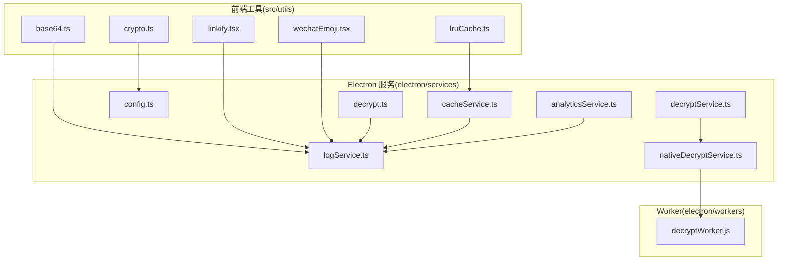
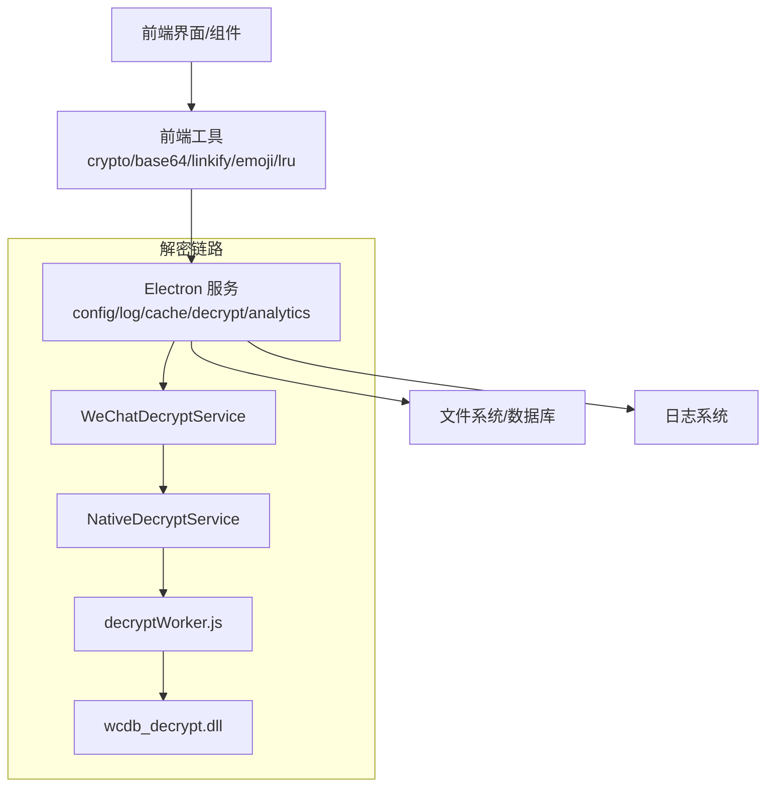
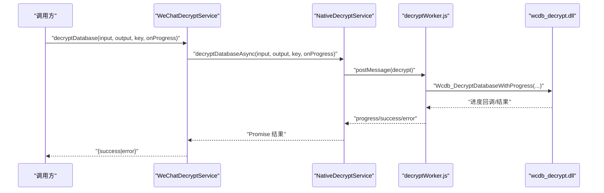
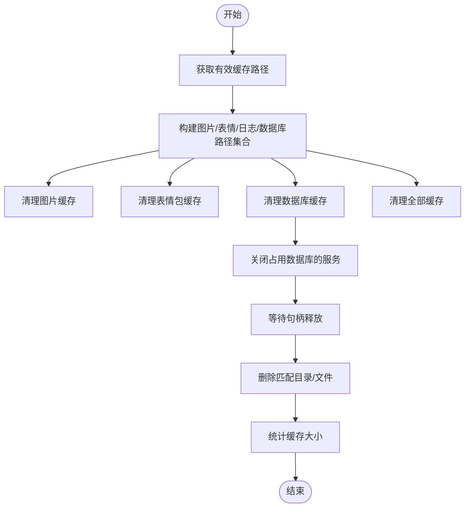
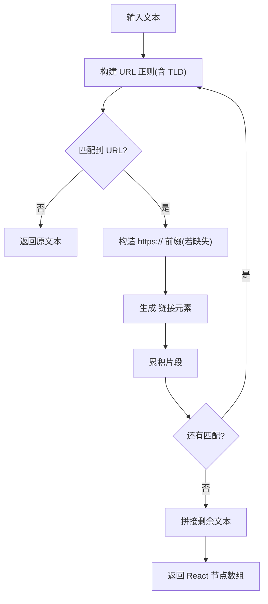
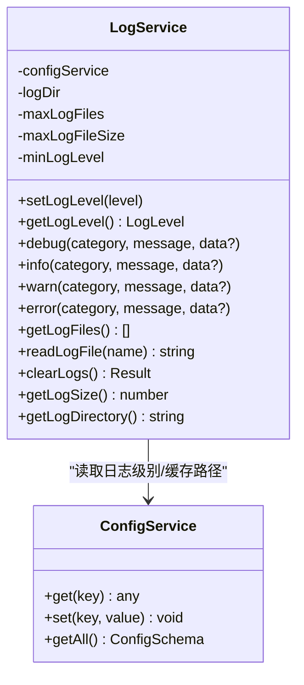
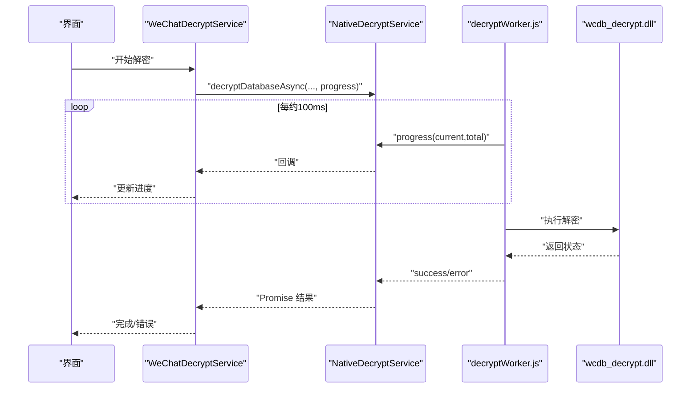
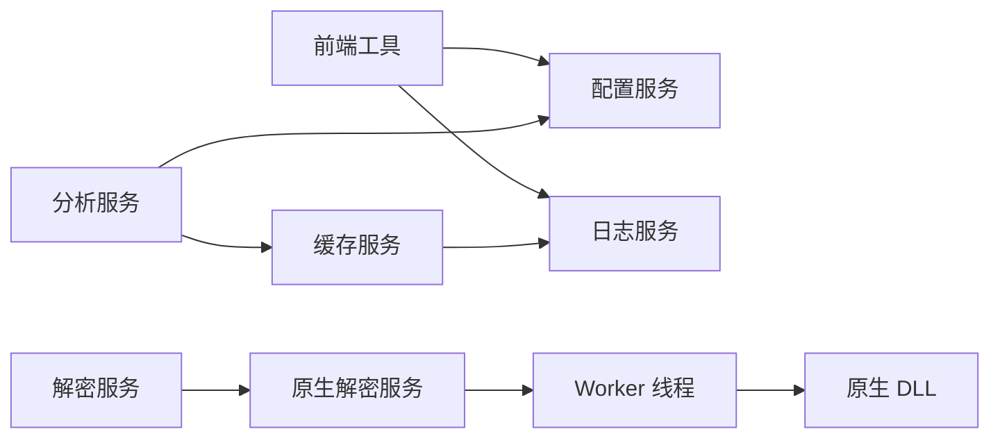

# 工具类和实用函数

<cite>
**本文引用的文件**
- [crypto.ts](file://src/utils/crypto.ts)
- [lruCache.ts](file://src/utils/lruCache.ts)
- [base64.ts](file://src/utils/base64.ts)
- [linkify.tsx](file://src/utils/linkify.tsx)
- [wechatEmoji.tsx](file://src/utils/wechatEmoji.tsx)
- [decrypt.ts](file://electron/services/decrypt.ts)
- [decryptService.ts](file://electron/services/decryptService.ts)
- [nativeDecryptService.ts](file://electron/services/nativeDecryptService.ts)
- [decryptWorker.js](file://electron/workers/decryptWorker.js)
- [logService.ts](file://electron/services/logService.ts)
- [cacheService.ts](file://electron/services/cacheService.ts)
- [analyticsService.ts](file://electron/services/analyticsService.ts)
- [config.ts](file://electron/services/config.ts)
</cite>

## 目录
1. [简介](#简介)
2. [项目结构](#项目结构)
3. [核心组件](#核心组件)
4. [架构总览](#架构总览)
5. [详细组件分析](#详细组件分析)
6. [依赖关系分析](#依赖关系分析)
7. [性能考量](#性能考量)
8. [故障排查指南](#故障排查指南)
9. [结论](#结论)
10. [附录](#附录)

## 简介
本文件面向开发者，系统性梳理 CipherTalk 中的工具类与实用函数，覆盖以下主题：
- 加密解密工具：微信数据解密算法、密钥管理、安全性考虑
- 缓存管理工具：LRU 缓存实现、缓存策略、内存优化
- 数据处理工具：Base64 编解码、链接识别、文本处理
- 日志系统：日志级别、日志格式、日志收集
- 性能监控工具：性能指标、性能分析、瓶颈识别
- 错误处理工具：异常捕获、错误分类、降级策略
- 使用示例与最佳实践

## 项目结构
围绕工具与实用函数的关键目录与文件如下：
- 前端工具（src/utils）：密码学、LRU 缓存、Base64、链接识别、微信表情解析
- Electron 服务（electron/services）：日志、缓存、解密、配置、分析
- Worker（electron/workers）：原生 DLL 解密工作线程

图表来源
- [crypto.ts:1-31](file://src/utils/crypto.ts#L1-L31)
- [lruCache.ts:1-51](file://src/utils/lruCache.ts#L1-L51)
- [base64.ts:1-29](file://src/utils/base64.ts#L1-L29)
- [linkify.tsx:1-115](file://src/utils/linkify.tsx#L1-L115)
- [wechatEmoji.tsx:1-157](file://src/utils/wechatEmoji.tsx#L1-L157)
- [decrypt.ts:1-109](file://electron/services/decrypt.ts#L1-L109)
- [decryptService.ts:1-54](file://electron/services/decryptService.ts#L1-L54)
- [nativeDecryptService.ts:1-216](file://electron/services/nativeDecryptService.ts#L1-L216)
- [decryptWorker.js:1-89](file://electron/workers/decryptWorker.js#L1-L89)
- [logService.ts:1-331](file://electron/services/logService.ts#L1-L331)
- [cacheService.ts:1-486](file://electron/services/cacheService.ts#L1-L486)
- [analyticsService.ts:1-759](file://electron/services/analyticsService.ts#L1-L759)
- [config.ts:1-395](file://electron/services/config.ts#L1-L395)

章节来源
- [crypto.ts:1-31](file://src/utils/crypto.ts#L1-L31)
- [lruCache.ts:1-51](file://src/utils/lruCache.ts#L1-L51)
- [base64.ts:1-29](file://src/utils/base64.ts#L1-L29)
- [linkify.tsx:1-115](file://src/utils/linkify.tsx#L1-L115)
- [wechatEmoji.tsx:1-157](file://src/utils/wechatEmoji.tsx#L1-L157)
- [decrypt.ts:1-109](file://electron/services/decrypt.ts#L1-L109)
- [decryptService.ts:1-54](file://electron/services/decryptService.ts#L1-L54)
- [nativeDecryptService.ts:1-216](file://electron/services/nativeDecryptService.ts#L1-L216)
- [decryptWorker.js:1-89](file://electron/workers/decryptWorker.js#L1-L89)
- [logService.ts:1-331](file://electron/services/logService.ts#L1-L331)
- [cacheService.ts:1-486](file://electron/services/cacheService.ts#L1-L486)
- [analyticsService.ts:1-759](file://electron/services/analyticsService.ts#L1-L759)
- [config.ts:1-395](file://electron/services/config.ts#L1-L395)

## 核心组件
- 密码学与密钥管理：浏览器 WebCrypto PBKDF2 派生哈希；配置服务持久化密钥与参数
- 缓存管理：LRU 缓存与磁盘缓存清理策略
- 数据处理：Base64 URL 安全编解码、链接识别与点击打开、微信表情解析与导出
- 日志系统：分级日志、按日轮转、大小限制、目录清理
- 性能监控：原生 DLL 解密 + Worker 多线程 + 进度回调
- 错误处理：统一异常捕获、错误分类、降级策略

章节来源
- [crypto.ts:1-31](file://src/utils/crypto.ts#L1-L31)
- [config.ts:1-395](file://electron/services/config.ts#L1-L395)
- [lruCache.ts:1-51](file://src/utils/lruCache.ts#L1-L51)
- [cacheService.ts:1-486](file://electron/services/cacheService.ts#L1-L486)
- [base64.ts:1-29](file://src/utils/base64.ts#L1-L29)
- [linkify.tsx:1-115](file://src/utils/linkify.tsx#L1-L115)
- [wechatEmoji.tsx:1-157](file://src/utils/wechatEmoji.tsx#L1-L157)
- [logService.ts:1-331](file://electron/services/logService.ts#L1-L331)
- [decrypt.ts:1-109](file://electron/services/decrypt.ts#L1-L109)
- [decryptService.ts:1-54](file://electron/services/decryptService.ts#L1-L54)
- [nativeDecryptService.ts:1-216](file://electron/services/nativeDecryptService.ts#L1-L216)
- [decryptWorker.js:1-89](file://electron/workers/decryptWorker.js#L1-L89)
- [analyticsService.ts:1-759](file://electron/services/analyticsService.ts#L1-L759)

## 架构总览
CipherTalk 的工具链横跨前端与 Electron 后端，形成“前端工具 + 后端服务 + 原生 Worker”的协同架构。

图表来源
- [decryptService.ts:1-54](file://electron/services/decryptService.ts#L1-L54)
- [nativeDecryptService.ts:1-216](file://electron/services/nativeDecryptService.ts#L1-L216)
- [decryptWorker.js:1-89](file://electron/workers/decryptWorker.js#L1-L89)
- [logService.ts:1-331](file://electron/services/logService.ts#L1-L331)
- [config.ts:1-395](file://electron/services/config.ts#L1-L395)

## 详细组件分析

### 加密解密工具
- 微信数据库解密（原生 DLL + Worker）
  - WeChatDecryptService：对外暴露解密接口，校验服务可用性，异步调用原生解密
  - NativeDecryptService：Worker 线程加载 DLL，注册进度回调，处理成功/失败消息
  - decryptWorker.js：加载 DLL，绑定解密函数与进度回调，向主线程汇报结果
  - 传统解密（图片等）：electron/services/decrypt.ts 提供基于 XOR 的图片解密与类型检测
- 密钥管理与安全性
  - 前端密码派生：PBKDF2 + SHA-256，高迭代次数，随机盐，返回哈希与盐
  - 配置服务：集中存储密钥、路径、日志级别等敏感配置，提供默认值与迁移逻辑

图表来源
- [decryptService.ts:1-54](file://electron/services/decryptService.ts#L1-L54)
- [nativeDecryptService.ts:1-216](file://electron/services/nativeDecryptService.ts#L1-L216)
- [decryptWorker.js:1-89](file://electron/workers/decryptWorker.js#L1-L89)

章节来源
- [decryptService.ts:1-54](file://electron/services/decryptService.ts#L1-L54)
- [nativeDecryptService.ts:1-216](file://electron/services/nativeDecryptService.ts#L1-L216)
- [decryptWorker.js:1-89](file://electron/workers/decryptWorker.js#L1-L89)
- [decrypt.ts:1-109](file://electron/services/decrypt.ts#L1-L109)
- [crypto.ts:1-31](file://src/utils/crypto.ts#L1-L31)
- [config.ts:1-395](file://electron/services/config.ts#L1-L395)

### 缓存管理工具
- LRU 缓存（前端）
  - 基于 Map 的 LRU 实现，支持容量上限、刷新最近使用、删除最久未使用项
- 磁盘缓存（Electron）
  - CacheService：根据安装位置与配置选择缓存根路径，兼容旧路径；提供清理图片/表情/数据库/全部缓存；统计各分区大小；关闭占用文件句柄的服务后再清理
  - 支持多种 wxid 目录形态匹配，避免误删

图表来源
- [cacheService.ts:1-486](file://electron/services/cacheService.ts#L1-L486)
- [lruCache.ts:1-51](file://src/utils/lruCache.ts#L1-L51)

章节来源
- [lruCache.ts:1-51](file://src/utils/lruCache.ts#L1-L51)
- [cacheService.ts:1-486](file://electron/services/cacheService.ts#L1-L486)

### 数据处理工具
- Base64 编解码（URL 安全）
  - toBase64Url：二进制转 Base64，替换字符为 URL 安全
  - fromBase64Url：URL 安全字符还原，补齐填充，再解码为二进制
- 链接识别
  - initTldList：从 IANA 获取顶级域名列表，缓存到配置数据库，按长度排序优先匹配
  - linkifyText：扫描文本，自动识别 URL 并生成可点击链接，点击通过 shell 打开外部链接
- 文本处理（微信表情）
  - parseWechatEmoji：将 [表情名] 替换为图片
  - parseWechatEmojiHtml：将表情转为内联 Base64，便于导出离线查看

图表来源
- [linkify.tsx:1-115](file://src/utils/linkify.tsx#L1-L115)

章节来源
- [base64.ts:1-29](file://src/utils/base64.ts#L1-L29)
- [linkify.tsx:1-115](file://src/utils/linkify.tsx#L1-L115)
- [wechatEmoji.tsx:1-157](file://src/utils/wechatEmoji.tsx#L1-L157)

### 日志系统
- 日志级别：DEBUG/INFO/WARN/ERROR
- 日志格式：时间戳 + 级别 + 分类 + 消息 + 可选数据（JSON 序列化，循环引用保护）
- 存储策略：按日文件名，超限轮转，保留固定数量的旧日志文件
- 管理能力：设置级别、读取文件、清空日志、统计大小、获取目录

图表来源
- [logService.ts:1-331](file://electron/services/logService.ts#L1-L331)
- [config.ts:1-395](file://electron/services/config.ts#L1-L395)

章节来源
- [logService.ts:1-331](file://electron/services/logService.ts#L1-L331)
- [config.ts:1-395](file://electron/services/config.ts#L1-L395)

### 性能监控工具
- 原生解密性能
  - 原生 DLL + Worker 多线程，避免主线程阻塞
  - 进度回调节流（约 100ms），实时反馈解密进度
- 数据库分析
  - AnalyticsService：统计消息总数、类型分布、联系人排行、时间分布；缓存数据库连接与行 ID 映射，减少重复查询
- 缓存与 IO
  - LRU 缓存控制内存占用
  - CacheService 清理策略与大小统计，避免磁盘膨胀

图表来源
- [decryptService.ts:1-54](file://electron/services/decryptService.ts#L1-L54)
- [nativeDecryptService.ts:1-216](file://electron/services/nativeDecryptService.ts#L1-L216)
- [decryptWorker.js:1-89](file://electron/workers/decryptWorker.js#L1-L89)

章节来源
- [decryptService.ts:1-54](file://electron/services/decryptService.ts#L1-L54)
- [nativeDecryptService.ts:1-216](file://electron/services/nativeDecryptService.ts#L1-L216)
- [decryptWorker.js:1-89](file://electron/workers/decryptWorker.js#L1-L89)
- [analyticsService.ts:1-759](file://electron/services/analyticsService.ts#L1-L759)

### 错误处理工具
- 统一捕获与分类
  - 解密：Worker 异常、DLL 错误码、回调错误消息
  - 缓存：文件占用（EBUSY/EPERM）跳过删除并告警
  - 日志：写入失败、轮转失败、清理失败均记录并兜底
- 降级策略
  - TLD 列表获取失败时回退到内置列表
  - 表情 Base64 获取失败时保留纯文本，避免渲染破损
  - 原生解密不可用时返回明确错误提示

章节来源
- [linkify.tsx:1-115](file://src/utils/linkify.tsx#L1-L115)
- [wechatEmoji.tsx:1-157](file://src/utils/wechatEmoji.tsx#L1-L157)
- [decrypt.ts:1-109](file://electron/services/decrypt.ts#L1-L109)
- [cacheService.ts:1-486](file://electron/services/cacheService.ts#L1-L486)
- [logService.ts:1-331](file://electron/services/logService.ts#L1-L331)

## 依赖关系分析
- 前端工具依赖 Electron 配置与 IPC（如链接识别中的 TLD 缓存读写）
- 解密链路依赖原生 DLL 与 Worker 线程，避免主线程阻塞
- 日志与缓存服务依赖配置服务读取路径与级别
- 分析服务依赖数据库连接与缓存，减少重复查询

图表来源
- [config.ts:1-395](file://electron/services/config.ts#L1-L395)
- [logService.ts:1-331](file://electron/services/logService.ts#L1-L331)
- [decryptService.ts:1-54](file://electron/services/decryptService.ts#L1-L54)
- [nativeDecryptService.ts:1-216](file://electron/services/nativeDecryptService.ts#L1-L216)
- [decryptWorker.js:1-89](file://electron/workers/decryptWorker.js#L1-L89)
- [cacheService.ts:1-486](file://electron/services/cacheService.ts#L1-L486)
- [analyticsService.ts:1-759](file://electron/services/analyticsService.ts#L1-L759)

章节来源
- [config.ts:1-395](file://electron/services/config.ts#L1-L395)
- [logService.ts:1-331](file://electron/services/logService.ts#L1-L331)
- [decryptService.ts:1-54](file://electron/services/decryptService.ts#L1-L54)
- [nativeDecryptService.ts:1-216](file://electron/services/nativeDecryptService.ts#L1-L216)
- [decryptWorker.js:1-89](file://electron/workers/decryptWorker.js#L1-L89)
- [cacheService.ts:1-486](file://electron/services/cacheService.ts#L1-L486)
- [analyticsService.ts:1-759](file://electron/services/analyticsService.ts#L1-L759)

## 性能考量
- 解密性能
  - 使用原生 DLL 与 Worker 线程，避免主线程阻塞；进度回调节流，降低主线程压力
  - 对于大文件，建议分块处理与进度上报，避免 UI 卡顿
- 缓存策略
  - LRU 缓存控制内存；磁盘缓存定期清理与大小统计，避免无限增长
- 数据库分析
  - 使用连接与行 ID 缓存，减少重复查询；按私聊表过滤，避免群聊干扰
- I/O 与网络
  - TLD 列表本地缓存，减少网络请求；表情 Base64 缓存，避免重复下载

## 故障排查指南
- 解密失败
  - 检查原生 DLL 与 Worker 是否可用（服务可用性检查）
  - 查看 Worker 错误与 DLL 错误码，确认输入路径、密钥格式
  - 若失败，读取最后错误消息定位问题
- 缓存清理无效
  - 确认目标目录是否存在；检查是否被占用（EBUSY/EPERM），等待句柄释放
  - 确认 wxid 匹配规则是否正确
- 日志异常
  - 检查日志目录权限与磁盘空间；确认轮转与清理逻辑是否触发
- 链接识别失效
  - 检查 TLD 缓存是否加载成功；若失败，回退到内置列表
- 表情渲染异常
  - 检查表情资源是否可访问；获取 Base64 失败时保留纯文本

章节来源
- [decryptService.ts:1-54](file://electron/services/decryptService.ts#L1-L54)
- [nativeDecryptService.ts:1-216](file://electron/services/nativeDecryptService.ts#L1-L216)
- [decryptWorker.js:1-89](file://electron/workers/decryptWorker.js#L1-L89)
- [cacheService.ts:1-486](file://electron/services/cacheService.ts#L1-L486)
- [logService.ts:1-331](file://electron/services/logService.ts#L1-L331)
- [linkify.tsx:1-115](file://src/utils/linkify.tsx#L1-L115)
- [wechatEmoji.tsx:1-157](file://src/utils/wechatEmoji.tsx#L1-L157)

## 结论
CipherTalk 的工具链在安全性、性能与可维护性方面做了系统设计：
- 解密采用原生 DLL + Worker，兼顾性能与线程安全
- 配置与日志服务提供一致的运行时管理
- 缓存与分析工具提升用户体验与可观测性
- 错误处理与降级策略保障稳定性

## 附录
- 使用示例与最佳实践（基于现有实现的建议）
  - 密码派生：使用 PBKDF2 + 随机盐，迭代次数足够高；盐与哈希同时持久化
  - 解密流程：先检查服务可用性，再发起异步解密，注册进度回调，失败时读取最后错误消息
  - 缓存清理：先关闭占用数据库的服务，等待句柄释放，再执行删除；定期统计大小
  - 日志级别：生产环境默认 WARN，问题定位时临时提升到 DEBUG；避免在高频路径打印过多日志
  - 链接识别：首次初始化时拉取并缓存 TLD 列表；点击链接通过 shell 打开，避免在 UI 内嵌浏览器
  - 表情导出：优先使用 Base64 内联，失败时保留纯文本，保证导出内容可读