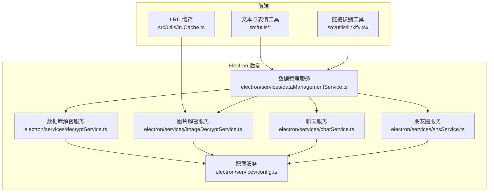
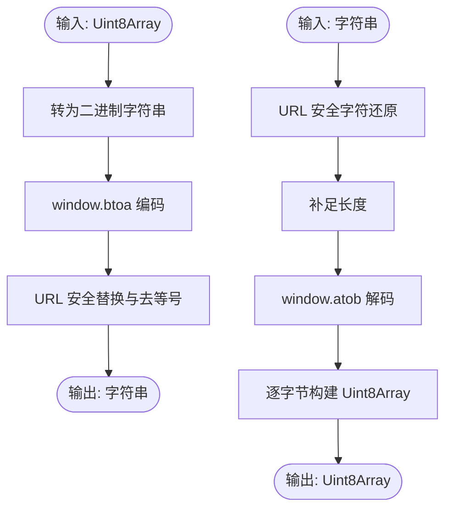
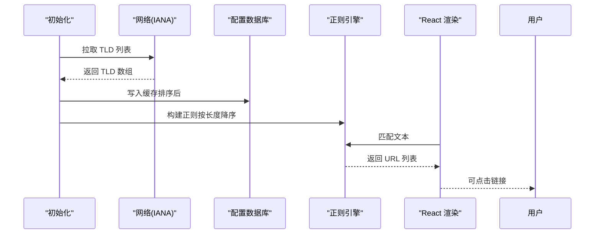
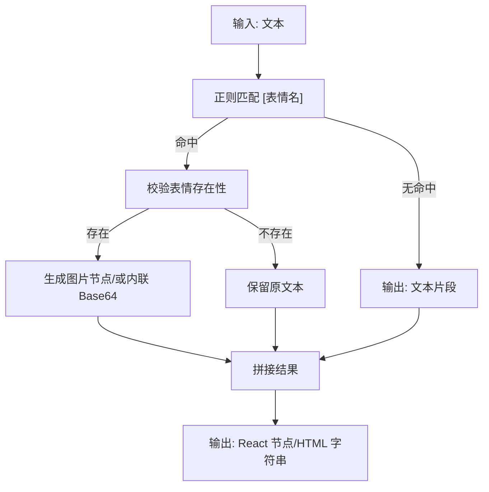
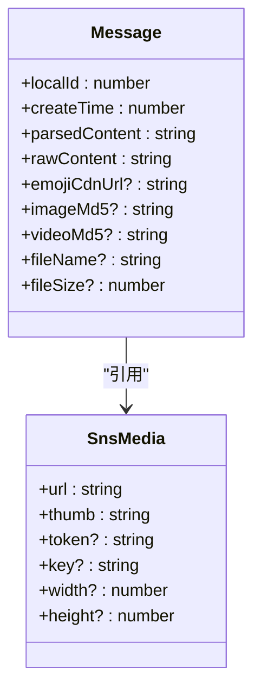
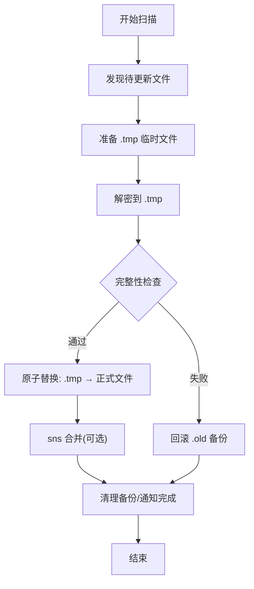
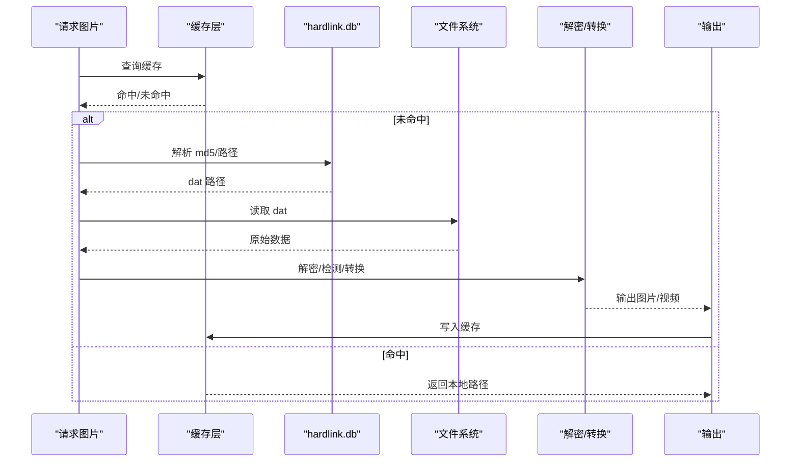
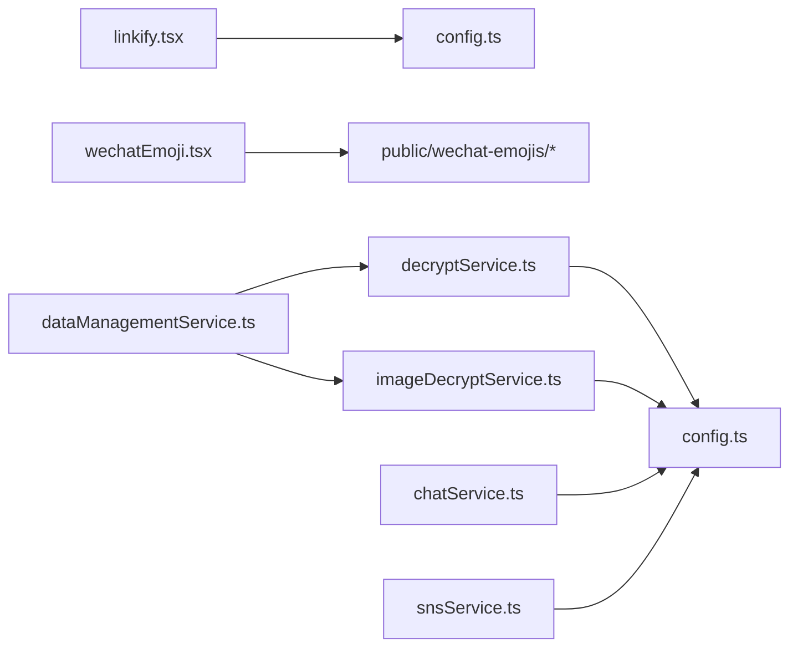

# 数据处理工具

<cite>
**本文档引用的文件**
- [src/utils/base64.ts](file://src/utils/base64.ts)
- [src/utils/linkify.tsx](file://src/utils/linkify.tsx)
- [src/utils/wechatEmoji.tsx](file://src/utils/wechatEmoji.tsx)
- [src/utils/lruCache.ts](file://src/utils/lruCache.ts)
- [src/utils/crypto.ts](file://src/utils/crypto.ts)
- [electron/services/dataManagementService.ts](file://electron/services/dataManagementService.ts)
- [electron/services/decryptService.ts](file://electron/services/decryptService.ts)
- [electron/services/imageDecryptService.ts](file://electron/services/imageDecryptService.ts)
- [electron/services/chatService.ts](file://electron/services/chatService.ts)
- [electron/services/snsService.ts](file://electron/services/snsService.ts)
- [electron/services/config.ts](file://electron/services/config.ts)
</cite>

## 目录
1. [简介](#简介)
2. [项目结构](#项目结构)
3. [核心组件](#核心组件)
4. [架构总览](#架构总览)
5. [详细组件分析](#详细组件分析)
6. [依赖关系分析](#依赖关系分析)
7. [性能考量](#性能考量)
8. [故障排查指南](#故障排查指南)
9. [结论](#结论)
10. [附录](#附录)

## 简介
本文件面向开发者，系统性梳理 CipherTalk 的数据处理工具链，重点覆盖以下能力：
- Base64 编解码工具：编码算法、性能优化、内存效率
- 链接识别工具：URL 检测、链接格式化、安全过滤
- 微信表情包处理：表情映射、渲染优化、本地化支持
- 数据转换工具：格式转换、类型检查、数据验证
- 数据处理最佳实践与性能优化建议

目标是帮助开发者高效使用并扩展这些工具，同时理解其内部实现原理与性能特征。

## 项目结构
围绕数据处理的核心代码分布在前端工具函数与 Electron 后端服务之间，形成“前端解析 + 后端解密”的协作架构：
- 前端工具层：负责文本与表情的解析、链接识别、基础加密与缓存
- Electron 服务层：负责数据库扫描、增量更新、图片解密、聊天与社交数据解析



图表来源
- [src/utils/linkify.tsx:1-115](file://src/utils/linkify.tsx#L1-L115)
- [src/utils/lruCache.ts:1-51](file://src/utils/lruCache.ts#L1-L51)
- [electron/services/dataManagementService.ts:1-1611](file://electron/services/dataManagementService.ts#L1-L1611)
- [electron/services/decryptService.ts:1-54](file://electron/services/decryptService.ts#L1-L54)
- [electron/services/imageDecryptService.ts:1-2315](file://electron/services/imageDecryptService.ts#L1-L2315)
- [electron/services/chatService.ts:1-5004](file://electron/services/chatService.ts#L1-L5004)
- [electron/services/snsService.ts:1-1806](file://electron/services/snsService.ts#L1-L1806)
- [electron/services/config.ts:1-395](file://electron/services/config.ts#L1-L395)

章节来源
- [src/utils/base64.ts:1-29](file://src/utils/base64.ts#L1-L29)
- [src/utils/linkify.tsx:1-115](file://src/utils/linkify.tsx#L1-L115)
- [src/utils/wechatEmoji.tsx:1-157](file://src/utils/wechatEmoji.tsx#L1-L157)
- [src/utils/lruCache.ts:1-51](file://src/utils/lruCache.ts#L1-L51)
- [src/utils/crypto.ts:1-31](file://src/utils/crypto.ts#L1-L31)
- [electron/services/dataManagementService.ts:1-1611](file://electron/services/dataManagementService.ts#L1-L1611)
- [electron/services/decryptService.ts:1-54](file://electron/services/decryptService.ts#L1-L54)
- [electron/services/imageDecryptService.ts:1-2315](file://electron/services/imageDecryptService.ts#L1-L2315)
- [electron/services/chatService.ts:1-5004](file://electron/services/chatService.ts#L1-L5004)
- [electron/services/snsService.ts:1-1806](file://electron/services/snsService.ts#L1-L1806)
- [electron/services/config.ts:1-395](file://electron/services/config.ts#L1-L395)

## 核心组件
- Base64 工具：提供 URL 安全的 Base64 编解码，适配浏览器原生接口，避免额外依赖
- 链接识别：基于 TLD 列表构建正则，支持 www/协议前缀/域名等多形态 URL，点击打开外部链接
- 微信表情：将 [表情名] 转换为图片，支持导出 HTML 时内联 Base64，具备缓存与容错
- LRU 缓存：通用内存控制，避免无限增长导致内存泄漏
- 加密工具：基于 Web Crypto PBKDF2，生成稳定哈希与盐值
- 数据管理：扫描数据库、增量更新、原子替换、备份回滚、sns 合并
- 图片解密：基于 hardlink.db 与目录结构定位 dat 文件，解密并缓存，支持实况照片
- 聊天与社交：消息模型、表情包缓存、头像缓存、预编译语句、结构化数据解析

章节来源
- [src/utils/base64.ts:1-29](file://src/utils/base64.ts#L1-L29)
- [src/utils/linkify.tsx:1-115](file://src/utils/linkify.tsx#L1-L115)
- [src/utils/wechatEmoji.tsx:1-157](file://src/utils/wechatEmoji.tsx#L1-L157)
- [src/utils/lruCache.ts:1-51](file://src/utils/lruCache.ts#L1-L51)
- [src/utils/crypto.ts:1-31](file://src/utils/crypto.ts#L1-L31)
- [electron/services/dataManagementService.ts:1-1611](file://electron/services/dataManagementService.ts#L1-L1611)
- [electron/services/imageDecryptService.ts:1-2315](file://electron/services/imageDecryptService.ts#L1-L2315)
- [electron/services/chatService.ts:1-5004](file://electron/services/chatService.ts#L1-L5004)
- [electron/services/snsService.ts:1-1806](file://electron/services/snsService.ts#L1-L1806)

## 架构总览
整体流程：前端对文本进行链接识别与表情渲染；后端负责数据库扫描、增量更新与图片解密；服务间通过配置中心与事件通道协同。

```mermaid
sequenceDiagram
participant UI as "界面"
participant Link as "链接识别<br/>linkify.tsx"
participant Emoji as "表情处理<br/>wechatEmoji.tsx"
participant DM as "数据管理<br/>dataManagementService.ts"
participant DEC as "数据库解密<br/>decryptService.ts"
participant IMG as "图片解密<br/>imageDecryptService.ts"
UI->>Link : 文本输入
Link-->>UI : React 节点可点击链接
UI->>Emoji : 文本输入
Emoji-->>UI : React 节点表情图片
UI->>DM : 请求扫描/增量更新
DM->>DEC : 解密数据库
DEC-->>DM : 结果成功/失败
DM->>IMG : 解密图片按需
IMG-->>UI : 图片路径/实况视频
```

图表来源
- [src/utils/linkify.tsx:69-114](file://src/utils/linkify.tsx#L69-L114)
- [src/utils/wechatEmoji.tsx:21-66](file://src/utils/wechatEmoji.tsx#L21-L66)
- [electron/services/dataManagementService.ts:285-367](file://electron/services/dataManagementService.ts#L285-L367)
- [electron/services/decryptService.ts:21-50](file://electron/services/decryptService.ts#L21-L50)
- [electron/services/imageDecryptService.ts:112-158](file://electron/services/imageDecryptService.ts#L112-L158)

## 详细组件分析

### Base64 编解码工具
- 编码算法
  - 将二进制缓冲区转为 ASCII 字符串，使用浏览器原生 Base64 编码
  - URL 安全替换：+→-，/→_，去除 = 号，便于 URL 传输
- 解码算法
  - 将 URL 安全字符还原为标准 Base64
  - 补齐长度并在解码后重建 Uint8Array
- 性能与内存
  - 使用原生 btoa/atob，避免额外依赖
  - 编码阶段一次性拼接二进制字符串，解码阶段一次性遍历构建数组
  - 适合中小尺寸数据；大块数据建议分片或流式处理



图表来源
- [src/utils/base64.ts:1-29](file://src/utils/base64.ts#L1-L29)

章节来源
- [src/utils/base64.ts:1-29](file://src/utils/base64.ts#L1-L29)

### 链接识别工具
- URL 检测
  - 动态构建正则表达式，支持 http/https/www/协议前缀
  - 通过 IANA TLD 列表缓存，按长度降序优先匹配，提升准确性
- 链接格式化
  - 自动补全协议前缀（无协议时加 https://）
  - React 节点渲染，点击触发外部浏览器打开
- 安全过滤
  - 严格限定匹配字符集，避免注入与越界
  - 仅在初始化时拉取 TLD 列表并缓存，后续使用本地缓存



图表来源
- [src/utils/linkify.tsx:16-64](file://src/utils/linkify.tsx#L16-L64)
- [src/utils/linkify.tsx:69-114](file://src/utils/linkify.tsx#L69-L114)

章节来源
- [src/utils/linkify.tsx:1-115](file://src/utils/linkify.tsx#L1-L115)
- [electron/services/config.ts:147-161](file://electron/services/config.ts#L147-L161)

### 微信表情包处理
- 表情映射
  - 将 [表情名] 匹配为本地资源路径，使用第三方库进行有效性校验
- 渲染优化
  - React 组件按文本片段拆分，仅在命中时插入图片节点
  - 支持导出 HTML 时将图片转为 Base64 内联，避免离线访问时的资源缺失
- 本地化支持
  - 通过公共资源目录加载表情包，支持开发与生产环境路径差异
  - 对中文文件名进行 URI 编码，保证跨平台兼容



图表来源
- [src/utils/wechatEmoji.tsx:21-66](file://src/utils/wechatEmoji.tsx#L21-L66)
- [src/utils/wechatEmoji.tsx:87-155](file://src/utils/wechatEmoji.tsx#L87-L155)

章节来源
- [src/utils/wechatEmoji.tsx:1-157](file://src/utils/wechatEmoji.tsx#L1-L157)

### 数据转换与验证工具
- 类型检查与数据验证
  - 聊天服务中对消息字段进行结构化定义，包含表情、图片、视频、文件等扩展属性
  - 社交服务对媒体 URL、Token、尺寸等进行格式修正与类型推断
- 格式转换
  - URL 规范化：HTTP→HTTPS，缩略图尺寸→原图，自动拼接 Token 参数
  - 媒体类型检测：根据文件头判断图像/视频 MIME 类型
- 加密与校验
  - PBKDF2 哈希：生成稳定哈希与随机盐，便于安全存储与比较



图表来源
- [electron/services/chatService.ts:32-94](file://electron/services/chatService.ts#L32-L94)
- [electron/services/snsService.ts:23-34](file://electron/services/snsService.ts#L23-L34)

章节来源
- [electron/services/chatService.ts:1-5004](file://electron/services/chatService.ts#L1-L5004)
- [electron/services/snsService.ts:1-1806](file://electron/services/snsService.ts#L1-L1806)
- [src/utils/crypto.ts:1-31](file://src/utils/crypto.ts#L1-L31)

### 数据管理与增量更新
- 扫描与识别
  - 智能识别 db_storage 目录与账号目录，递归查找 .db 文件
  - 比较源文件与解密文件修改时间，判定是否需要更新
- 增量更新策略
  - 先解密到 .tmp，验证完整性后原子替换
  - 失败时回滚 .old 备份，避免数据丢失
  - sns.db 特殊处理：合并旧数据，防止“三天可见”等设置导致数据丢失
- 性能与稳定性
  - 批处理时主动让出主线程时间片，避免 UI 卡顿
  - 完整性检查可配置跳过，兼顾速度与安全



图表来源
- [electron/services/dataManagementService.ts:413-612](file://electron/services/dataManagementService.ts#L413-L612)
- [electron/services/dataManagementService.ts:620-664](file://electron/services/dataManagementService.ts#L620-L664)

章节来源
- [electron/services/dataManagementService.ts:1-1611](file://electron/services/dataManagementService.ts#L1-L1611)

### 图片解密与缓存
- 定位与解密
  - 通过 hardlink.db 与目录结构定位 dat 文件，支持旧版/新版路径
  - 支持 wxgf 格式解包与扩展名检测，必要时触发 ffmpeg 转换
- 缓存与更新
  - 内存缓存 + 文件缓存双层结构，LRU 控制容量
  - 缩略图检测与高清图更新提示，避免重复解密
- 实况照片
  - 从 JPEG 中提取 Motion Photo 视频轨道，提供视频播放能力



图表来源
- [electron/services/imageDecryptService.ts:112-158](file://electron/services/imageDecryptService.ts#L112-L158)
- [electron/services/imageDecryptService.ts:408-505](file://electron/services/imageDecryptService.ts#L408-L505)
- [electron/services/imageDecryptService.ts:267-293](file://electron/services/imageDecryptService.ts#L267-L293)

章节来源
- [electron/services/imageDecryptService.ts:1-2315](file://electron/services/imageDecryptService.ts#L1-L2315)
- [src/utils/lruCache.ts:1-51](file://src/utils/lruCache.ts#L1-L51)

## 依赖关系分析
- 前端工具依赖
  - 链接识别依赖配置服务的 TLD 缓存接口
  - 表情处理依赖第三方表情库与公共资源目录
- 后端服务依赖
  - 数据管理依赖解密服务与图片解密服务
  - 聊天与社交服务依赖配置服务与数据库连接
  - 图片解密依赖硬链接数据库与文件系统扫描



图表来源
- [src/utils/linkify.tsx:35-64](file://src/utils/linkify.tsx#L35-L64)
- [electron/services/dataManagementService.ts:1-1611](file://electron/services/dataManagementService.ts#L1-L1611)
- [electron/services/decryptService.ts:1-54](file://electron/services/decryptService.ts#L1-L54)
- [electron/services/imageDecryptService.ts:1-2315](file://electron/services/imageDecryptService.ts#L1-L2315)
- [electron/services/chatService.ts:1-5004](file://electron/services/chatService.ts#L1-L5004)
- [electron/services/snsService.ts:1-1806](file://electron/services/snsService.ts#L1-L1806)
- [electron/services/config.ts:1-395](file://electron/services/config.ts#L1-L395)

章节来源
- [electron/services/config.ts:1-395](file://electron/services/config.ts#L1-L395)

## 性能考量
- 编解码
  - 使用原生接口，避免额外依赖；大对象建议分片或流式处理
- 链接识别
  - TLD 列表缓存与正则预构建，避免重复网络与计算
- 表情处理
  - Base64 缓存避免重复下载；HTML 导出时内联可提升离线可用性
- 图片解密
  - 硬链接与目录结构快速定位，缓存命中优先；必要时异步转换
- 数据管理
  - 增量更新与原子替换，避免全量重写；完整性检查可按需开关
- 通用建议
  - 使用 LRU 缓存控制内存占用
  - 批处理时主动让出主线程，保持 UI 流畅
  - 对网络请求设置超时与重试策略

[本节为通用指导，无需特定文件引用]

## 故障排查指南
- 链接识别
  - 若链接未被识别：确认 TLD 缓存是否有效；检查正则构建与匹配范围
  - 点击无效：确认外部打开调用是否被拦截
- 表情渲染
  - 表情缺失：检查表情名是否存在于库；确认资源路径与编码
  - 导出 HTML 显示异常：检查 Base64 缓存与内容类型判断
- 图片解密
  - 无法解密：核对 XOR/AES 密钥配置；检查 dat 文件是否存在
  - wxgf 格式无法显示：确认 ffmpeg 是否可用
  - 实况照片无视频：确认 JPEG 中是否包含 Motion Photo 数据
- 数据管理
  - 增量更新失败：查看 .tmp 与 .old 备份；确认完整性检查结果
  - sns 合并失败：检查表结构差异与权限

章节来源
- [src/utils/linkify.tsx:16-64](file://src/utils/linkify.tsx#L16-L64)
- [src/utils/wechatEmoji.tsx:87-155](file://src/utils/wechatEmoji.tsx#L87-L155)
- [electron/services/imageDecryptService.ts:254-293](file://electron/services/imageDecryptService.ts#L254-L293)
- [electron/services/dataManagementService.ts:489-595](file://electron/services/dataManagementService.ts#L489-L595)

## 结论
CipherTalk 的数据处理工具以“前端解析 + 后端解密”为核心，结合缓存与增量更新机制，在保证安全性的同时兼顾性能与用户体验。开发者可基于现有工具扩展新的数据处理场景，遵循本文档的性能与可靠性建议，确保系统的稳定与高效。

[本节为总结，无需特定文件引用]

## 附录
- 最佳实践清单
  - 使用 URL 安全的 Base64 传输二进制数据
  - 对外链进行协议补全与安全校验
  - 表情导出时优先使用内联 Base64，降低离线访问风险
  - 图片解密前先检查缓存，避免重复 IO
  - 数据库更新采用增量与原子替换，配合备份回滚
  - 合理设置缓存容量与失效策略，防止内存泄漏

[本节为通用指导，无需特定文件引用]