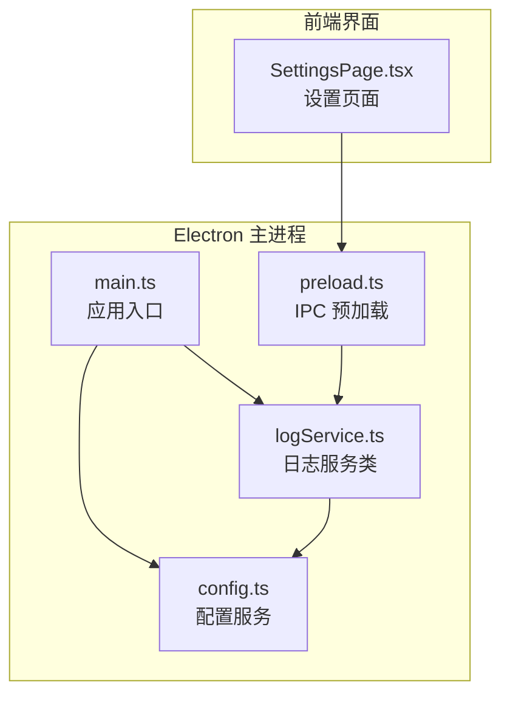
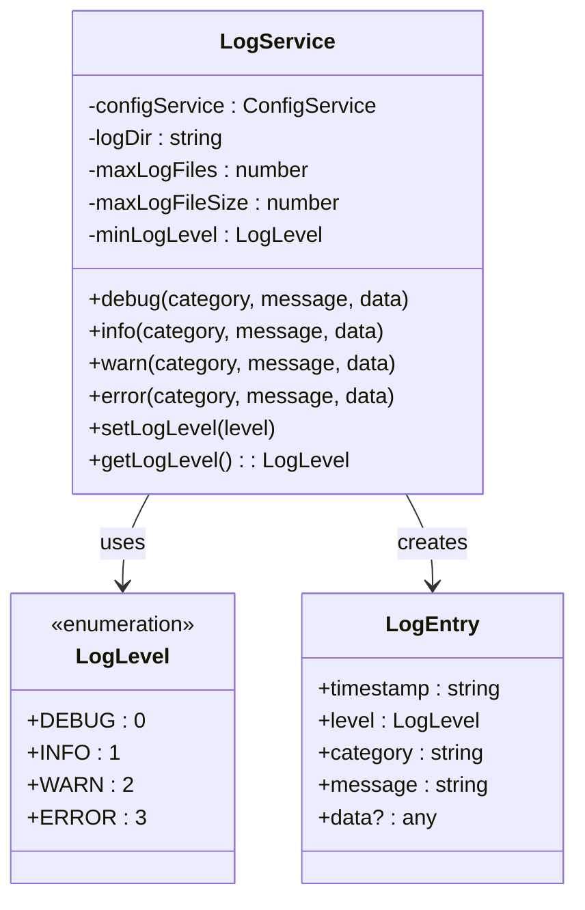
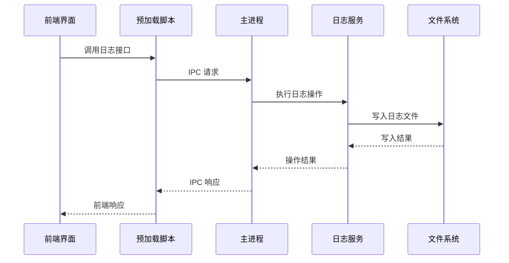
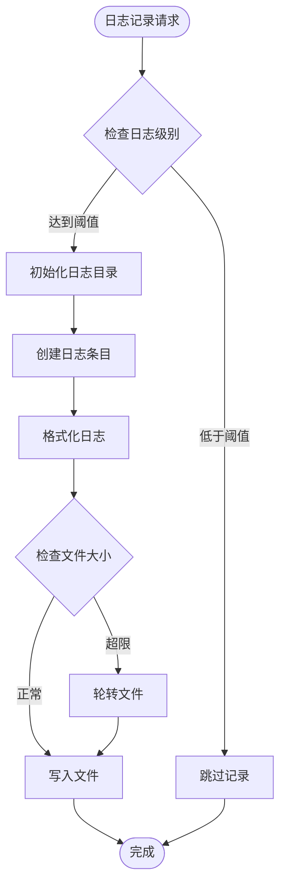
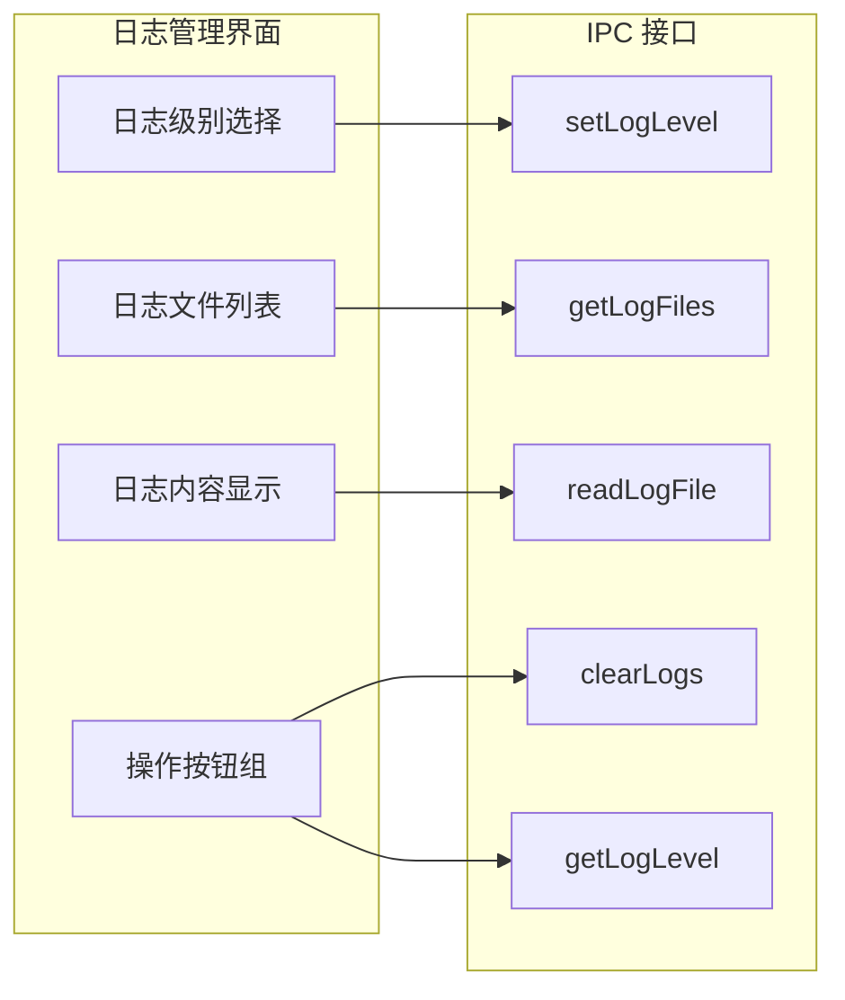
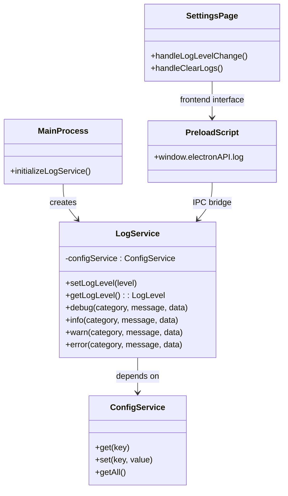

# 日志系统

<cite>
**本文档引用的文件**
- [logService.ts](file://electron/services/logService.ts)
- [config.ts](file://electron/services/config.ts)
- [main.ts](file://electron/main.ts)
- [preload.ts](file://electron/preload.ts)
- [SettingsPage.tsx](file://src/pages/SettingsPage.tsx)
</cite>

## 目录
1. [简介](#简介)
2. [项目结构](#项目结构)
3. [核心组件](#核心组件)
4. [架构概览](#架构概览)
5. [详细组件分析](#详细组件分析)
6. [依赖关系分析](#依赖关系分析)
7. [性能考虑](#性能考虑)
8. [故障排除指南](#故障排除指南)
9. [结论](#结论)
10. [附录](#附录)

## 简介

CipherTalk 的日志系统是一个完整的日志管理解决方案，专为 Electron 应用设计。该系统提供了多级别的日志记录能力、灵活的日志格式化、智能的日志文件管理和丰富的前端管理界面。

日志系统的核心目标是：
- 提供结构化的日志记录机制
- 支持多种日志级别和动态级别切换
- 实现自动化的日志文件轮转和清理
- 提供直观的前端日志管理界面
- 支持日志级别的配置和持久化存储

## 项目结构

日志系统主要分布在以下文件中：



**图表来源**
- [main.ts:221-224](file://electron/main.ts#L221-L224)
- [logService.ts:27-31](file://electron/services/logService.ts#L27-L31)
- [preload.ts:358-366](file://electron/preload.ts#L358-L366)

**章节来源**
- [main.ts:1-50](file://electron/main.ts#L1-L50)
- [logService.ts:1-50](file://electron/services/logService.ts#L1-L50)

## 核心组件

### 日志级别体系

日志系统实现了标准的四层日志级别体系：



**图表来源**
- [logService.ts:5-18](file://electron/services/logService.ts#L5-L18)
- [logService.ts:20-331](file://electron/services/logService.ts#L20-L331)

### 默认配置

系统采用以下默认配置：
- **默认日志级别**: WARN（仅记录警告和错误）
- **最大日志文件数量**: 10个
- **单文件最大大小**: 10MB
- **日志目录**: 用户数据目录下的 cache/logs 子目录

**章节来源**
- [config.ts:104](file://electron/services/config.ts#L104)
- [logService.ts:22-25](file://electron/services/logService.ts#L22-L25)

## 架构概览

日志系统的整体架构采用分层设计：



**图表来源**
- [preload.ts:358-366](file://electron/preload.ts#L358-L366)
- [main.ts:2714-2801](file://electron/main.ts#L2714-L2801)

## 详细组件分析

### LogService 类详解

LogService 是日志系统的核心实现类，负责所有日志相关的功能：

#### 核心功能模块

1. **日志级别控制**
   - 动态设置和获取日志级别
   - 支持 DEBUG/INFO/WARN/ERROR 四级
   - 配置持久化存储

2. **日志文件管理**
   - 按日期创建日志文件（ciphertalk-YYYY-MM-DD.log）
   - 自动文件轮转机制
   - 智能清理旧日志文件

3. **日志格式化**
   - 标准化的日志格式
   - 时间戳精确到毫秒
   - 结构化数据字段

#### 关键实现细节



**图表来源**
- [logService.ts:129-162](file://electron/services/logService.ts#L129-L162)

**章节来源**
- [logService.ts:20-331](file://electron/services/logService.ts#L20-L331)

### 日志格式规范

#### 时间戳格式
- **ISO 8601 标准格式**: `YYYY-MM-DDTHH:mm:ss.sssZ`
- **精确到毫秒**: 支持高精度时间记录
- **UTC 格式**: 统一时间基准

#### 日志结构
每个日志条目包含以下标准化字段：

| 字段名 | 类型 | 必需 | 描述 |
|--------|------|------|------|
| timestamp | string | ✓ | ISO 8601 时间戳 |
| level | LogLevel | ✓ | 日志级别枚举 |
| category | string | ✓ | 日志分类标识 |
| message | string | ✓ | 日志消息内容 |
| data | any | ✗ | 结构化数据负载 |

#### 输出格式示例
```
[2024-01-15T10:30:45.123Z] [INFO] [Database] 连接数据库成功 | Data: {"host":"localhost","port":3306}
```

**章节来源**
- [logService.ts:111-124](file://electron/services/logService.ts#L111-L124)

### 日志收集机制

#### 文件轮转策略
系统采用基于大小的轮转机制：

1. **轮转触发条件**: 当前日志文件大小超过 10MB
2. **轮转命名规则**: `ciphertalk-YYYY-MM-DD-HH-mm-ss-fff.log`
3. **保留策略**: 最多保留 10 个最新日志文件

#### 自动清理机制
- **启动时清理**: 应用启动时自动清理超出保留数量的旧文件
- **异常处理**: 清理过程中遇到错误会记录到控制台但不影响主流程

**章节来源**
- [logService.ts:167-177](file://electron/services/logService.ts#L167-L177)
- [logService.ts:182-209](file://electron/services/logService.ts#L182-L209)

### 前端管理界面

#### 设置页面集成
前端通过 SettingsPage 提供完整的日志管理功能：



**图表来源**
- [SettingsPage.tsx:398-444](file://src/pages/SettingsPage.tsx#L398-L444)
- [preload.ts:358-366](file://electron/preload.ts#L358-L366)

**章节来源**
- [SettingsPage.tsx:144-151](file://src/pages/SettingsPage.tsx#L144-L151)

## 依赖关系分析

### 组件耦合关系



**图表来源**
- [main.ts:221-224](file://electron/main.ts#L221-L224)
- [logService.ts:27-31](file://electron/services/logService.ts#L27-L31)
- [preload.ts:358-366](file://electron/preload.ts#L358-L366)

### 外部依赖

日志系统依赖以下外部组件：
- **Node.js fs 模块**: 文件系统操作
- **Electron app**: 应用程序路径获取
- **ConfigService**: 配置管理
- **IPC 通信**: 前后端数据交换

**章节来源**
- [logService.ts:1-3](file://electron/services/logService.ts#L1-L3)

## 性能考虑

### 写入性能优化

1. **同步写入策略**: 使用 `appendFileSync` 确保数据一致性
2. **内存管理**: 避免大对象序列化导致的内存压力
3. **文件操作优化**: 批量文件操作减少系统调用次数

### 存储效率

- **压缩策略**: 日志文件采用纯文本格式，便于后续压缩处理
- **索引机制**: 按日期分割文件，便于快速定位
- **清理策略**: 自动清理机制避免磁盘空间无限增长

### 并发处理

- **单线程写入**: 避免多进程并发写入冲突
- **异常隔离**: 文件操作异常不影响主业务流程
- **资源清理**: 正确的文件句柄管理和异常处理

## 故障排除指南

### 常见问题及解决方案

#### 日志文件无法创建
**症状**: 应用启动时报错，日志文件创建失败
**原因**: 日志目录权限不足或路径不存在
**解决**: 检查用户数据目录权限，确保应用程序有写入权限

#### 日志级别设置无效
**症状**: 修改日志级别后无效果
**原因**: 配置服务异常或 IPC 通信失败
**解决**: 重启应用，检查配置数据库状态

#### 日志文件过大
**症状**: 磁盘空间占用过高
**解决**: 系统会自动轮转，如需立即清理可使用前端界面的清除功能

#### 前端日志界面无响应
**症状**: 设置页面无法加载日志文件列表
**原因**: IPC 接口异常或日志服务未初始化
**解决**: 检查主进程日志，确认 LogService 实例创建成功

**章节来源**
- [logService.ts:95-98](file://electron/services/logService.ts#L95-L98)
- [logService.ts:159-162](file://electron/services/logService.ts#L159-L162)

## 结论

CipherTalk 的日志系统是一个设计精良、功能完备的日志管理解决方案。其特点包括：

1. **标准化程度高**: 采用统一的日志格式和结构
2. **可扩展性强**: 支持动态级别调整和灵活的配置
3. **用户体验好**: 提供直观的前端管理界面
4. **可靠性高**: 完善的错误处理和异常恢复机制
5. **性能优化**: 合理的文件轮转和清理策略

该系统为开发者提供了强大的调试和监控能力，同时为最终用户提供了透明的日志管理体验。

## 附录

### 配置选项参考

| 配置项 | 类型 | 默认值 | 描述 |
|--------|------|--------|------|
| logLevel | string | 'WARN' | 日志级别 (DEBUG/INFO/WARN/ERROR) |
| cachePath | string | 用户缓存目录 | 日志文件存储根目录 |
| maxLogFiles | number | 10 | 最大保留日志文件数量 |
| maxLogFileSize | number | 10MB | 单个日志文件最大大小 |

### 使用建议

1. **开发阶段**: 使用 DEBUG 级别获取详细信息
2. **测试阶段**: 使用 INFO 级别平衡信息量和性能
3. **生产环境**: 使用 WARN 级别专注于重要信息
4. **问题排查**: 临时提升到 DEBUG 级别进行深入分析

### 维护最佳实践

1. **定期清理**: 建议定期检查和清理过期日志文件
2. **监控磁盘**: 关注日志目录的磁盘使用情况
3. **备份策略**: 重要日志文件建议定期备份
4. **性能监控**: 注意日志写入对系统性能的影响