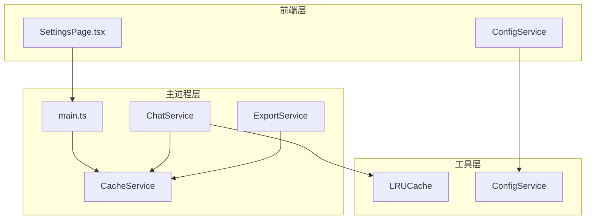
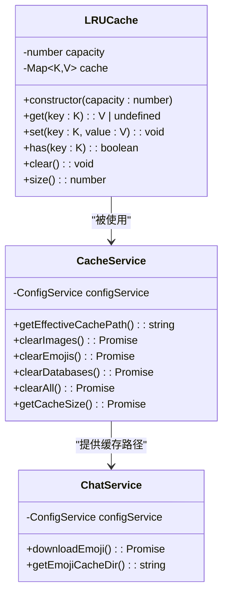
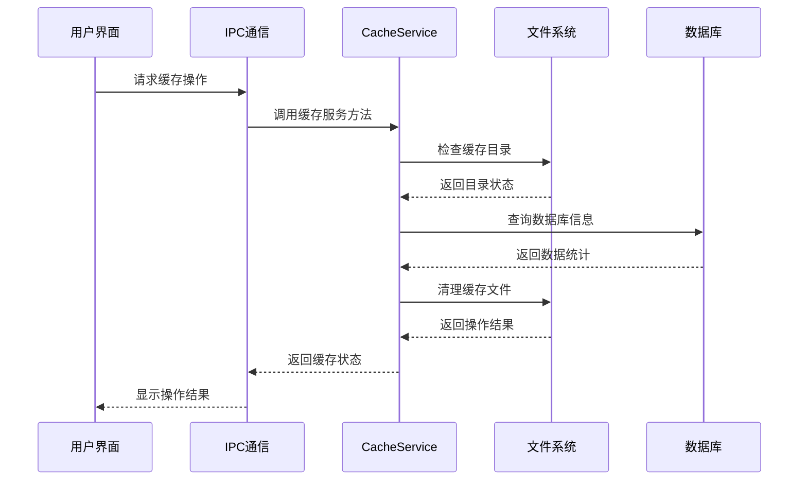
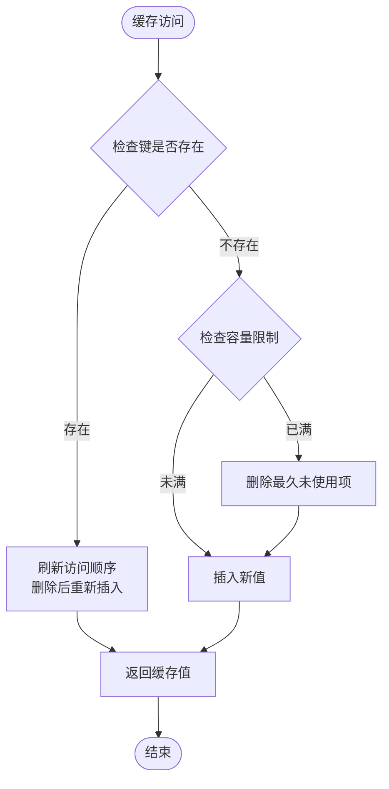
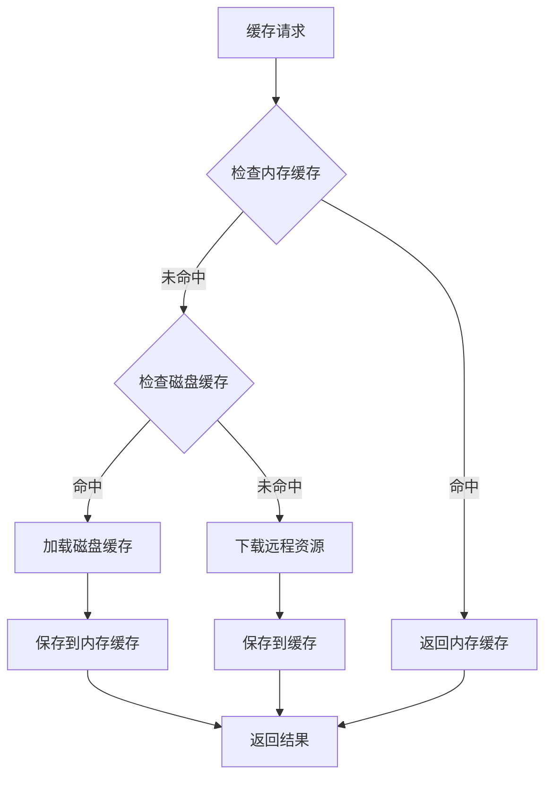
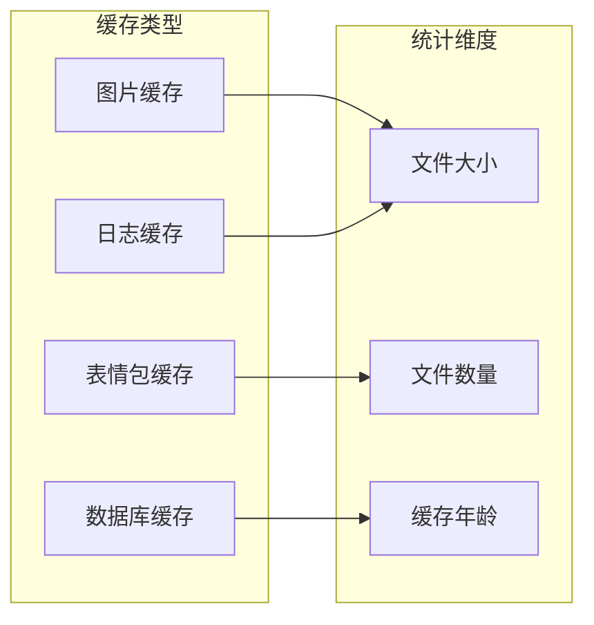
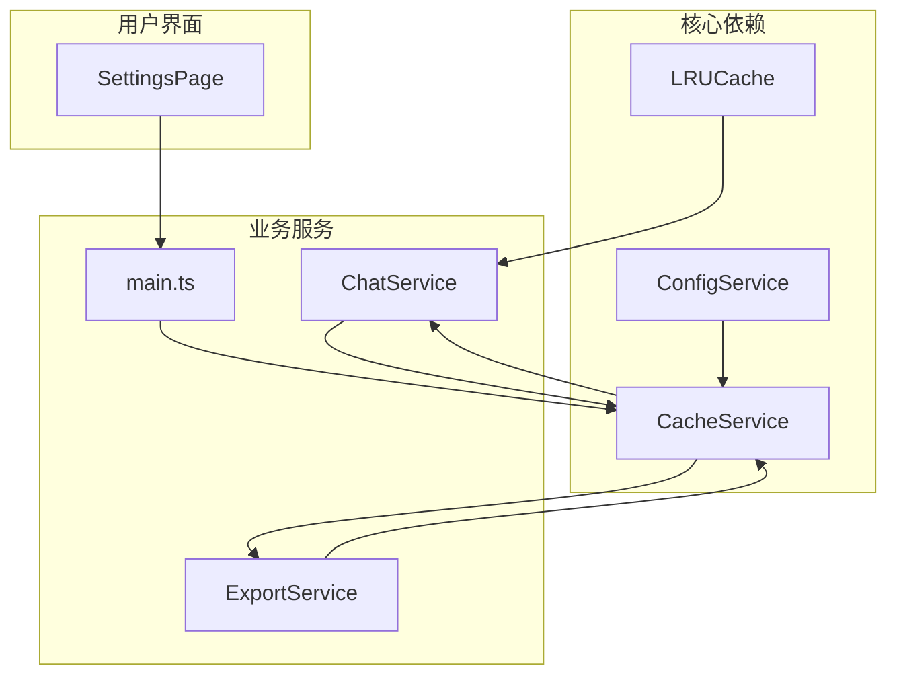

# 缓存管理工具

<cite>
**本文档引用的文件**
- [lruCache.ts](file://src/utils/lruCache.ts)
- [cacheService.ts](file://electron/services/cacheService.ts)
- [chatService.ts](file://electron/services/chatService.ts)
- [exportService.ts](file://electron/services/exportService.ts)
- [config.ts](file://src/services/config.ts)
- [main.ts](file://electron/main.ts)
- [SettingsPage.tsx](file://src/pages/SettingsPage.tsx)
</cite>

## 目录
1. [简介](#简介)
2. [项目结构](#项目结构)
3. [核心组件](#核心组件)
4. [架构概览](#架构概览)
5. [详细组件分析](#详细组件分析)
6. [依赖关系分析](#依赖关系分析)
7. [性能考虑](#性能考虑)
8. [故障排除指南](#故障排除指南)
9. [结论](#结论)
10. [附录](#附录)

## 简介

CipherTalk 的缓存管理工具是一个综合性的缓存解决方案，旨在高效管理应用中的各种缓存数据。该工具提供了多层次的缓存策略，包括内存缓存、磁盘缓存和配置缓存，支持多种缓存类型和复杂的缓存管理功能。

本工具的核心特性包括：
- LRU（最近最少使用）内存缓存实现
- 多种缓存类型的统一管理（图片、表情包、数据库、配置）
- 智能缓存路径解析和兼容性处理
- 缓存大小监控和统计功能
- 批量缓存操作和清理功能
- 缓存配置管理和调优参数

## 项目结构

缓存管理系统在项目中的组织结构如下：

**图表来源**
- [SettingsPage.tsx:2454-2515](file://src/pages/SettingsPage.tsx#L2454-L2515)
- [main.ts:2619-2712](file://electron/main.ts#L2619-L2712)
- [cacheService.ts:1-486](file://electron/services/cacheService.ts#L1-L486)

**章节来源**
- [SettingsPage.tsx:2454-2515](file://src/pages/SettingsPage.tsx#L2454-L2515)
- [main.ts:2619-2712](file://electron/main.ts#L2619-L2712)

## 核心组件

### LRU 内存缓存

LRU（Least Recently Used）缓存是缓存管理系统的核心组件，采用 Map 数据结构实现高效的缓存管理。

**图表来源**
- [lruCache.ts:5-50](file://src/utils/lruCache.ts#L5-L50)
- [cacheService.ts:6-41](file://electron/services/cacheService.ts#L6-L41)
- [chatService.ts:3749-3756](file://electron/services/chatService.ts#L3749-L3756)

### 缓存服务架构

缓存服务采用分层架构设计，支持多种缓存类型和灵活的配置管理。

**章节来源**
- [lruCache.ts:1-51](file://src/utils/lruCache.ts#L1-L51)
- [cacheService.ts:1-486](file://electron/services/cacheService.ts#L1-L486)

## 架构概览

缓存管理系统的整体架构采用模块化设计，各组件职责明确，协作高效。

**图表来源**
- [main.ts:2619-2712](file://electron/main.ts#L2619-L2712)
- [cacheService.ts:312-362](file://electron/services/cacheService.ts#L312-L362)

## 详细组件分析

### LRU 缓存实现

LRU 缓存采用 Map 数据结构实现，具有以下特点：

#### 核心算法原理

**图表来源**
- [lruCache.ts:14-37](file://src/utils/lruCache.ts#L14-L37)

#### 内存管理机制

LRU 缓存通过以下机制实现高效的内存管理：

1. **容量控制**：通过构造函数设置最大容量，超出容量时自动删除最久未使用的项
2. **访问刷新**：每次访问都会将该项移动到最新位置
3. **内存回收**：当缓存项被删除时，JavaScript 引擎自动进行垃圾回收

**章节来源**
- [lruCache.ts:5-50](file://src/utils/lruCache.ts#L5-L50)

### 缓存策略设计

#### 缓存键设计

缓存键的设计遵循以下原则：

1. **唯一性**：确保每个缓存键对应唯一的缓存值
2. **稳定性**：缓存键不应频繁变化
3. **可预测性**：缓存键应能反映缓存值的内容特征

在表情包缓存中，缓存键通过以下方式生成：
- MD5 值直接作为缓存键
- URL 的哈希值作为备用缓存键

#### 过期机制

当前实现采用基于容量的过期策略，通过 LRU 算法自动管理缓存生命周期。

#### 失效策略

缓存失效采用主动清理和被动淘汰相结合的方式：
- 主动清理：用户手动清除特定类型的缓存
- 被动淘汰：超过容量限制时自动删除最久未使用的缓存项

**章节来源**
- [chatService.ts:3768-3770](file://electron/services/chatService.ts#L3768-L3770)

### 缓存优化技术

#### 预加载策略

系统实现了智能的预加载机制：

**图表来源**
- [chatService.ts:3771-3810](file://electron/services/chatService.ts#L3771-L3810)

#### 批量操作

缓存服务支持多种批量操作：

1. **批量清理**：支持同时清理图片、表情包、数据库等多种缓存类型
2. **批量统计**：一次性计算所有缓存类型的大小
3. **批量配置**：支持批量修改缓存相关配置

#### 内存回收

系统采用多层内存回收策略：

1. **LRU 自动回收**：超出容量时自动删除最久未使用的项
2. **手动清理**：用户可主动触发缓存清理
3. **定时清理**：后台定期执行缓存清理任务

**章节来源**
- [cacheService.ts:196-245](file://electron/services/cacheService.ts#L196-L245)

### 缓存性能监控

#### 命中率统计

系统提供缓存性能监控功能，包括：

1. **缓存大小统计**：实时统计各类缓存的大小
2. **访问频率监控**：跟踪缓存访问模式
3. **性能指标收集**：收集缓存操作的性能数据

#### 内存使用情况

缓存服务能够精确统计各类缓存的内存使用情况：

**图表来源**
- [cacheService.ts:312-362](file://electron/services/cacheService.ts#L312-L362)

**章节来源**
- [cacheService.ts:312-441](file://electron/services/cacheService.ts#L312-L441)

## 依赖关系分析

缓存管理系统各组件之间的依赖关系如下：

**图表来源**
- [lruCache.ts:5-12](file://src/utils/lruCache.ts#L5-L12)
- [cacheService.ts:6-7](file://electron/services/cacheService.ts#L6-L7)
- [chatService.ts:3749-3750](file://electron/services/chatService.ts#L3749-L3750)

**章节来源**
- [main.ts:2619-2712](file://electron/main.ts#L2619-L2712)
- [config.ts:1-36](file://src/services/config.ts#L1-L36)

## 性能考虑

### 时间复杂度分析

LRU 缓存的时间复杂度：
- **get 操作**：O(1) 平均时间复杂度
- **set 操作**：O(1) 平均时间复杂度
- **空间复杂度**：O(n)，其中 n 为缓存项数量

### 内存优化策略

1. **容量限制**：通过构造函数设置合理的缓存容量
2. **及时清理**：定期清理过期或不再使用的缓存项
3. **智能回收**：利用 JavaScript 引擎的垃圾回收机制

### I/O 性能优化

缓存服务在文件系统操作方面采用了多项优化措施：
- **异步操作**：所有文件系统操作都采用异步方式
- **批量处理**：支持批量文件操作减少 I/O 次数
- **错误处理**：完善的错误处理机制避免阻塞操作

## 故障排除指南

### 常见问题及解决方案

#### 缓存清理失败

**问题描述**：缓存清理操作失败，返回错误信息。

**可能原因**：
1. 文件被其他进程占用
2. 权限不足
3. 路径不存在

**解决方案**：
1. 确保没有其他进程使用目标文件
2. 以管理员权限运行应用
3. 检查缓存路径配置

#### 缓存大小统计不准确

**问题描述**：缓存大小统计结果与实际不符。

**可能原因**：
1. 权限不足导致无法读取某些文件
2. 文件系统权限问题
3. 缓存路径配置错误

**解决方案**：
1. 检查应用权限设置
2. 验证缓存路径配置
3. 手动检查目标目录的文件权限

#### 缓存性能问题

**问题描述**：缓存操作响应缓慢。

**可能原因**：
1. 缓存容量过大
2. 磁盘 I/O 性能瓶颈
3. 内存不足

**解决方案**：
1. 调整缓存容量设置
2. 检查磁盘性能
3. 增加系统内存

**章节来源**
- [cacheService.ts:82-84](file://electron/services/cacheService.ts#L82-L84)
- [cacheService.ts:187-190](file://electron/services/cacheService.ts#L187-L190)

## 结论

CipherTalk 的缓存管理工具提供了一个完整、高效的缓存解决方案。通过 LRU 算法实现的内存缓存、多层缓存管理策略以及完善的性能监控功能，该工具能够有效提升应用的性能和用户体验。

主要优势包括：
- **高效性**：LRU 算法确保缓存的高效访问
- **可靠性**：完善的错误处理和恢复机制
- **可扩展性**：模块化的架构设计便于功能扩展
- **易用性**：直观的用户界面和丰富的配置选项

未来可以考虑的改进方向：
- 实现更精细的缓存过期策略
- 增加缓存预热功能
- 优化大文件缓存的处理效率

## 附录

### 缓存配置参数

| 参数名称 | 类型 | 默认值 | 描述 |
|---------|------|--------|------|
| cachePath | string | 系统文档目录 | 缓存文件存储路径 |
| cacheCapacity | number | 1000 | LRU 缓存容量限制 |
| autoCleanup | boolean | true | 是否自动清理过期缓存 |
| maxCacheAge | number | 7天 | 缓存最大存活时间 |

### 调优建议

1. **内存缓存调优**
   - 根据应用内存使用情况调整 LRU 容量
   - 对于内存敏感的应用，建议设置较小的缓存容量

2. **磁盘缓存调优**
   - 定期清理不需要的缓存文件
   - 监控磁盘空间使用情况，及时清理过期缓存

3. **网络缓存调优**
   - 对于频繁访问的资源，适当增加缓存时间
   - 对于经常变化的资源，设置较短的缓存时间

4. **性能监控**
   - 定期检查缓存命中率
   - 监控缓存操作的平均响应时间