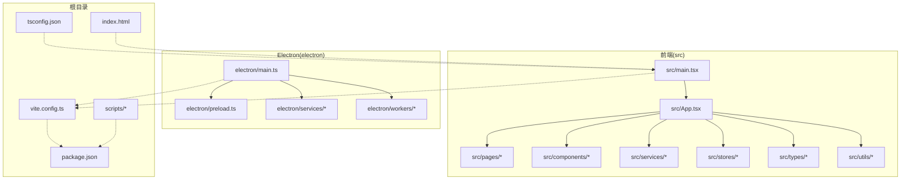
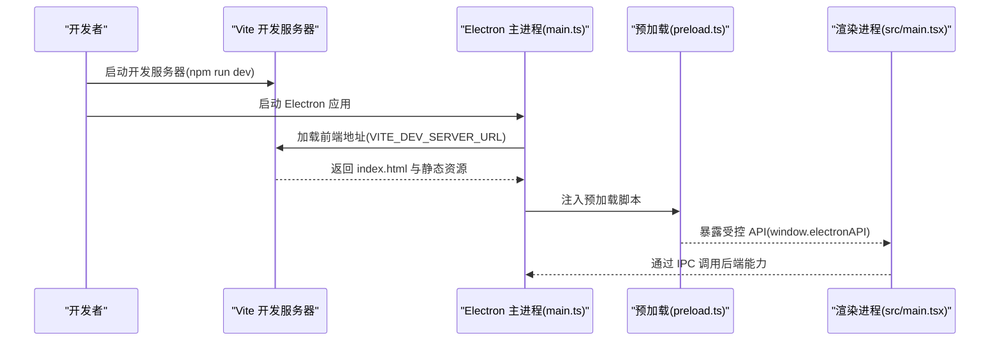
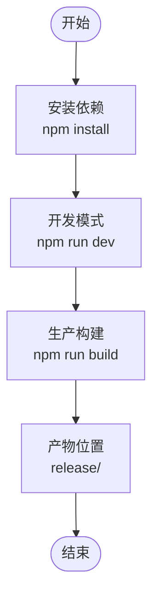
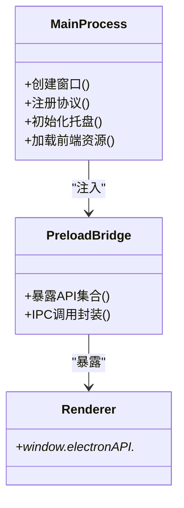
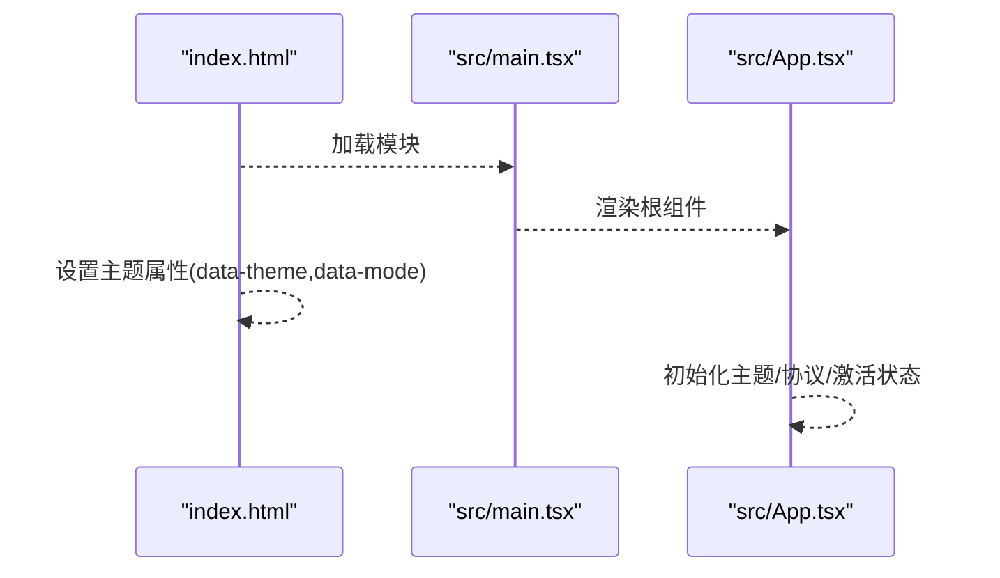
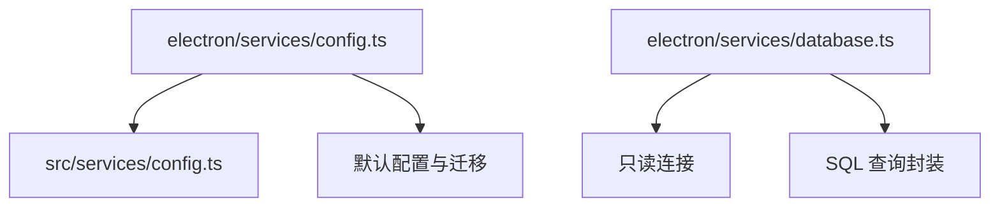
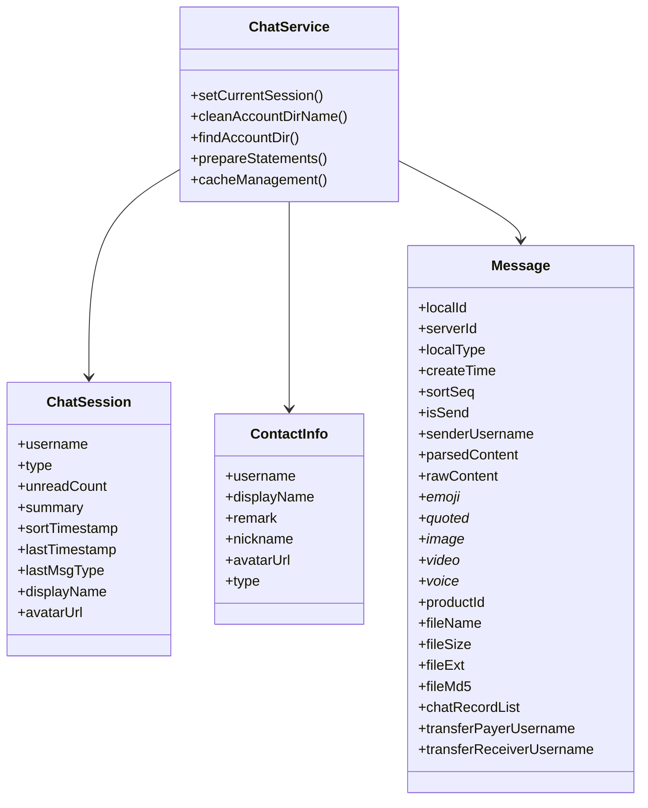
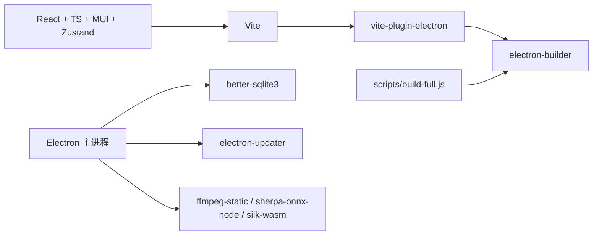

# 快速开始

<cite>
**本文引用的文件**
- [README.md](file://README.md)
- [package.json](file://package.json)
- [vite.config.ts](file://vite.config.ts)
- [tsconfig.json](file://tsconfig.json)
- [electron/main.ts](file://electron/main.ts)
- [electron/preload.ts](file://electron/preload.ts)
- [src/main.tsx](file://src/main.tsx)
- [index.html](file://index.html)
- [electron/services/config.ts](file://electron/services/config.ts)
- [src/services/config.ts](file://src/services/config.ts)
- [electron/services/database.ts](file://electron/services/database.ts)
- [electron/services/chatService.ts](file://electron/services/chatService.ts)
- [scripts/build-full.js](file://scripts/build-full.js)
</cite>

## 目录
1. [简介](#简介)
2. [项目结构](#项目结构)
3. [核心组件](#核心组件)
4. [架构总览](#架构总览)
5. [详细组件分析](#详细组件分析)
6. [依赖分析](#依赖分析)
7. [性能考虑](#性能考虑)
8. [故障排除指南](#故障排除指南)
9. [结论](#结论)
10. [附录](#附录)

## 简介
CipherTalk 是一款现代化的微信聊天记录查看与分析工具，基于 Electron + React + Vite 技术栈构建，支持 Windows 10/11，提供聊天记录查看、AI 摘要、数据分析、全文搜索、数据导出等功能。本“快速开始”旨在帮助不同经验水平的开发者快速搭建开发环境、运行项目并理解核心目录与文件职责。

## 项目结构
项目采用“前端 + Electron 主进程 + 辅助脚本”的分层组织方式：
- 前端源码位于 src/，包含组件、页面、状态管理、服务层、类型与工具函数
- Electron 主进程位于 electron/，包含主进程入口、预加载脚本与各类服务
- 构建与打包脚本位于 scripts/，包含完整安装包构建流程
- 根目录提供构建配置（vite.config.ts、tsconfig.json）、包管理（package.json）与说明文档（README.md）

**图示来源**
- [src/main.tsx:1-14](file://src/main.tsx#L1-L14)
- [electron/main.ts:1-800](file://electron/main.ts#L1-L800)
- [electron/preload.ts:1-454](file://electron/preload.ts#L1-L454)
- [vite.config.ts:1-78](file://vite.config.ts#L1-L78)
- [tsconfig.json:1-26](file://tsconfig.json#L1-L26)
- [index.html:1-37](file://index.html#L1-L37)
- [scripts/build-full.js:1-157](file://scripts/build-full.js#L1-L157)

**章节来源**
- [README.md: 第132-159行:132-159](file://README.md#L132-L159)
- [vite.config.ts: 第15-77行:15-77](file://vite.config.ts#L15-L77)
- [tsconfig.json: 第1-26行:1-26](file://tsconfig.json#L1-L26)

## 核心组件
- 前端入口与路由
  - src/main.tsx：创建根节点并挂载 HashRouter 与 App
  - index.html：设置主题属性，阻塞脚本在渲染前注入主题，避免闪烁
- Electron 主进程
  - electron/main.ts：初始化窗口、注册协议、托盘、自动更新；根据开发/生产环境加载前端资源
  - electron/preload.ts：通过 contextBridge 暴露受控 API 至渲染进程，封装 IPC 调用
- 配置与数据库服务
  - electron/services/config.ts：基于 better-sqlite3 的配置存储（用户数据目录）
  - src/services/config.ts：前端侧配置封装，统一键名与默认值
  - electron/services/database.ts：只读数据库连接与查询封装
- 构建与打包
  - vite.config.ts：配置 React 插件、Electron 插件、渲染器插件、路径别名与构建输出
  - scripts/build-full.js：完整安装包构建脚本（含 NSIS 打包、WPF 外壳、校验信息更新）

**章节来源**
- [src/main.tsx: 第1-14行:1-14](file://src/main.tsx#L1-L14)
- [index.html: 第7-30行:7-30](file://index.html#L7-L30)
- [electron/main.ts: 第193-281行:193-281](file://electron/main.ts#L193-L281)
- [electron/preload.ts: 第1-454行:1-454](file://electron/preload.ts#L1-L454)
- [electron/services/config.ts: 第126-200行:126-200](file://electron/services/config.ts#L126-L200)
- [src/services/config.ts: 第1-200行:1-200](file://src/services/config.ts#L1-L200)
- [electron/services/database.ts: 第1-83行:1-83](file://electron/services/database.ts#L1-L83)
- [vite.config.ts: 第15-77行:15-77](file://vite.config.ts#L15-L77)
- [scripts/build-full.js: 第20-157行:20-157](file://scripts/build-full.js#L20-L157)

## 架构总览
下图展示了开发模式与生产模式的关键交互：Vite 开发服务器与 Electron 主进程如何协作加载前端资源，并通过预加载脚本暴露受控 API。

**图示来源**
- [vite.config.ts: 第17-20行:17-20](file://vite.config.ts#L17-L20)
- [electron/main.ts: 第260-277行:260-277](file://electron/main.ts#L260-L277)
- [electron/preload.ts: 第1-454行:1-454](file://electron/preload.ts#L1-L454)
- [src/main.tsx: 第1-L14:1-14](file://src/main.tsx#L1-L14)

## 详细组件分析

### 组件 A：开发与运行流程
- 环境要求
  - Node.js 18.x 或更高版本
  - 操作系统：Windows 10/11
  - 内存：建议 4GB 以上
- 安装与启动
  - 克隆仓库后执行 npm install 安装依赖
  - npm run dev 启动开发服务器（支持热重载）
  - npm run build 构建完整安装包（包含 NSIS 打包、WPF 外壳、校验更新）
- 生产构建产物
  - 产物位于 release/ 目录，包含安装包与更新元数据

**图示来源**
- [README.md: 第96-128行:96-128](file://README.md#L96-L128)
- [package.json: 第8-18行:8-18](file://package.json#L8-L18)
- [scripts/build-full.js: 第20-41行:20-41](file://scripts/build-full.js#L20-L41)

**章节来源**
- [README.md: 第96-128行:96-128](file://README.md#L96-L128)
- [package.json: 第8-18行:8-18](file://package.json#L8-L18)
- [scripts/build-full.js: 第20-157行:20-157](file://scripts/build-full.js#L20-L157)

### 组件 B：Electron 主进程与预加载桥接
- 主进程职责
  - 注册自定义协议、初始化托盘、窗口生命周期管理
  - 根据开发/生产环境加载前端资源（开发时加载 Vite 地址，生产时加载 dist/index.html）
- 预加载桥接
  - 通过 contextBridge.exposeInMainWorld 暴露受控 API，统一 IPC 调用入口
  - 包含配置、数据库、解密、对话框、文件、Shell、HTTP API、窗口控制、AI 摘要、语音转写、缓存、日志等模块

**图示来源**
- [electron/main.ts: 第193-281行:193-281](file://electron/main.ts#L193-L281)
- [electron/preload.ts: 第1-454行:1-454](file://electron/preload.ts#L1-L454)

**章节来源**
- [electron/main.ts: 第193-281行:193-281](file://electron/main.ts#L193-L281)
- [electron/preload.ts: 第1-454行:1-454](file://electron/preload.ts#L1-L454)

### 组件 C：前端入口与主题初始化
- src/main.tsx：创建根节点并挂载 HashRouter 与 App
- index.html：在渲染前通过内联脚本读取 URL 参数或 localStorage，设置 data-theme 与 data-mode，避免主题闪烁
- App.tsx：加载主题、协议与激活状态，监听更新与增量同步事件，处理独立窗口路由

**图示来源**
- [index.html: 第7-30行:7-30](file://index.html#L7-L30)
- [src/main.tsx: 第1-L14:1-14](file://src/main.tsx#L1-L14)
- [src/App.tsx: 第40-88行:40-88](file://src/App.tsx#L40-L88)

**章节来源**
- [index.html: 第7-30行:7-30](file://index.html#L7-L30)
- [src/main.tsx: 第1-L14:1-14](file://src/main.tsx#L1-L14)
- [src/App.tsx: 第40-88行:40-88](file://src/App.tsx#L40-L88)

### 组件 D：配置与数据库服务
- 配置服务
  - electron/services/config.ts：基于 better-sqlite3 的配置存储，提供默认值、迁移与键值管理
  - src/services/config.ts：前端侧配置封装，统一键名常量与默认值
- 数据库服务
  - electron/services/database.ts：提供只读数据库连接、SQL 查询与关闭接口

**图示来源**
- [electron/services/config.ts: 第126-200行:126-200](file://electron/services/config.ts#L126-L200)
- [src/services/config.ts: 第1-36行:1-36](file://src/services/config.ts#L1-L36)
- [electron/services/database.ts: 第1-83行:1-83](file://electron/services/database.ts#L1-L83)

**章节来源**
- [electron/services/config.ts: 第126-200行:126-200](file://electron/services/config.ts#L126-L200)
- [src/services/config.ts: 第1-36行:1-36](file://src/services/config.ts#L1-L36)
- [electron/services/database.ts: 第1-83行:1-83](file://electron/services/database.ts#L1-L83)

### 组件 E：聊天服务与消息模型
- 聊天服务
  - electron/services/chatService.ts：定义会话、联系人、消息等数据模型，提供缓存、增量同步、SQL 预编译等高性能实现
- 典型数据模型
  - ChatSession、ContactInfo、Message、ChatRecordItem 等，涵盖文本、表情、图片、视频、语音、文件、转账等消息类型

**图示来源**
- [electron/services/chatService.ts: 第11-L152:11-152](file://electron/services/chatService.ts#L11-L152)

**章节来源**
- [electron/services/chatService.ts: 第11-L152:11-152](file://electron/services/chatService.ts#L11-L152)

## 依赖分析
- 构建与打包
  - Vite + vite-plugin-electron + vite-plugin-electron-renderer：前端与 Electron 主进程并行构建
  - electron-builder：NSIS 安装包打包
  - scripts/build-full.js：完整安装包构建流程（含 WPF 外壳与校验更新）
- 前端生态
  - React 19 + TypeScript + MUI Material + Zustand：现代前端技术栈
  - SCSS + CSS 变量：主题系统与样式组织
- Electron 生态
  - better-sqlite3：本地配置与数据库访问
  - electron-store、electron-updater：配置持久化与自动更新
  - ffmpeg-static、sherpa-onnx-node、silk-wasm：音视频与语音处理
- 开发与调试
  - electron-rebuild：Node 原生模块重建
  - vite 预览：本地预览

**图示来源**
- [vite.config.ts: 第21-66行:21-66](file://vite.config.ts#L21-L66)
- [package.json: 第58-73行:58-73](file://package.json#L58-L73)
- [scripts/build-full.js: 第20-70行:20-70](file://scripts/build-full.js#L20-L70)

**章节来源**
- [vite.config.ts: 第21-66行:21-66](file://vite.config.ts#L21-L66)
- [package.json: 第58-73行:58-73](file://package.json#L58-L73)
- [scripts/build-full.js: 第20-70行:20-70](file://scripts/build-full.js#L20-L70)

## 性能考虑
- 构建性能
  - 使用 vite-plugin-electron 与 vite-plugin-electron-renderer 实现主进程与渲染进程并行构建
  - Rollup external 配置减少打包体积，asarUnpack 仅解压必要二进制
- 运行性能
  - better-sqlite3 提供高性能 SQLite 访问
  - 聊天服务中大量使用 SQL 预编译与缓存策略（会话表缓存、列结构缓存、头像缓存等）
  - 语音转写支持 Whisper GPU 加速与 SenseVoice CPU 模式，按需选择
- 资源与网络
  - 自动更新禁用差分下载，保证一致性
  - 代理检测与系统代理支持，提升网络稳定性

[本节为通用指导，无需特定文件引用]

## 故障排除指南
- 端口占用
  - Vite 默认端口 3000，若被占用会自动尝试下一个端口。可在开发时确认端口占用情况并重启
- 依赖安装失败
  - 确保 Node.js 版本满足要求（18.x+），并使用 npm install 安装依赖
  - 若原生模块报错，执行 npm run postinstall 或手动 electron-rebuild
- 开发工具快捷键
  - 开发环境下按 F12 或 Ctrl+Shift+I 打开/关闭开发者工具（主进程与子窗口均支持）
- 构建失败
  - 确认 .NET SDK 已安装（WPF 外壳编译需要）
  - 检查 release 目录是否存在目标安装包，latest.yml 校验信息是否正确更新
- 数据库连接失败
  - 确认数据库路径与密钥配置正确，使用只读连接进行查询
- 语音转写模型下载
  - STT 模型下载与 GPU 组件检测失败时，检查网络代理与磁盘空间

**章节来源**
- [vite.config.ts: 第17-20行:17-20](file://vite.config.ts#L17-L20)
- [electron/main.ts: 第265-274行:265-274](file://electron/main.ts#L265-L274)
- [scripts/build-full.js: 第64-70行:64-70](file://scripts/build-full.js#L64-L70)
- [electron/services/database.ts: 第11-24行:11-24](file://electron/services/database.ts#L11-L24)
- [electron/preload.ts: 第387-404行:387-404](file://electron/preload.ts#L387-L404)

## 结论
通过本“快速开始”，你可以在 Windows 10/11 上使用 Node.js 18.x+ 快速搭建 CipherTalk 开发环境，理解前端与 Electron 主进程的协作方式，掌握开发模式与生产构建流程，并了解核心配置与数据库服务。建议新手从 npm run dev 开始，逐步熟悉目录结构与关键文件，再尝试生产构建与部署。

[本节为总结，无需特定文件引用]

## 附录

### A. 环境要求与安装步骤
- 环境要求
  - Node.js：18.x 或更高版本
  - 操作系统：Windows 10/11
  - 内存：建议 4GB 以上
- 安装步骤
  - 克隆仓库后执行 npm install
  - npm run dev 启动开发服务器
  - npm run build 构建完整安装包
- 构建产物
  - 产物位于 release/ 目录

**章节来源**
- [README.md: 第96-128行:96-128](file://README.md#L96-L128)
- [package.json: 第8-18行:8-18](file://package.json#L8-L18)

### B. 目录结构与主要文件说明
- src/：前端源码
  - components/：可复用组件（如标题栏、侧边栏、AI 组件等）
  - pages/：页面组件（聊天页、分析页、设置页等）
  - stores/：状态管理（Zustand）
  - services/：前端服务层（配置、数据库、IPC 封装）
  - types/：TypeScript 类型定义
  - utils/：工具函数
  - styles/：全局样式
- electron/：Electron 主进程与服务
  - main.ts：主进程入口
  - preload.ts：预加载脚本
  - services/：后端服务（AI、聊天、数据库、导出、分析等）
  - workers/：工作线程（解密、转录等）
- scripts/：构建与打包脚本
- public/：静态资源
- 根目录配置
  - vite.config.ts：Vite 与 Electron 构建配置
  - tsconfig.json：TypeScript 编译配置
  - package.json：依赖与脚本
  - index.html：入口 HTML，主题初始化脚本

**章节来源**
- [README.md: 第132-159行:132-159](file://README.md#L132-L159)
- [vite.config.ts: 第15-77行:15-77](file://vite.config.ts#L15-L77)
- [tsconfig.json: 第18-22行:18-22](file://tsconfig.json#L18-L22)
- [package.json: 第1-L169:1-169](file://package.json#L1-L169)
- [index.html: 第7-30行:7-30](file://index.html#L7-L30)

### C. 开发环境配置建议与 IDE 推荐
- VS Code
  - 推荐插件：ESLint、Prettier、TypeScript Importer、Bracket Pair Colorizer
  - 设置：启用 TypeScript 自动导入、格式化保存、ESLint 检查
- 路径别名
  - 使用 @/* 别名映射到 src/*，便于导入
- 构建与调试
  - 在开发模式下使用 F12 或 Ctrl+Shift+I 打开/关闭开发者工具
  - 关注控制台日志与 IPC 事件，排查前后端通信问题

**章节来源**
- [tsconfig.json: 第18-22行:18-22](file://tsconfig.json#L18-L22)
- [vite.config.ts: 第67-71行:67-71](file://vite.config.ts#L67-L71)
- [electron/main.ts: 第265-274行:265-274](file://electron/main.ts#L265-L274)

### D. 不同经验水平的入门路径
- 新手
  - 安装 Node.js 18.x+ 与 Git，克隆仓库，执行 npm install
  - 运行 npm run dev，观察浏览器中 Electron 应用启动
  - 浏览 README.md 了解功能特性与项目结构
- 中级开发者
  - 熟悉 vite.config.ts 与 tsconfig.json 的关键配置
  - 阅读 electron/main.ts 与 electron/preload.ts 的 IPC 暴露与窗口管理
  - 修改 src/App.tsx 的主题初始化逻辑，理解独立窗口路由
- 高级开发者
  - 分析 scripts/build-full.js 的完整构建流程
  - 深入理解 electron/services/chatService.ts 的缓存与增量同步机制
  - 优化 better-sqlite3 查询与预编译语句，提升大数据量场景性能

**章节来源**
- [README.md: 第96-128行:96-128](file://README.md#L96-L128)
- [vite.config.ts: 第15-77行:15-77](file://vite.config.ts#L15-L77)
- [electron/main.ts: 第193-281行:193-281](file://electron/main.ts#L193-L281)
- [electron/preload.ts: 第1-454行:1-454](file://electron/preload.ts#L1-L454)
- [scripts/build-full.js: 第20-157行:20-157](file://scripts/build-full.js#L20-L157)
- [electron/services/chatService.ts: 第11-L152:11-152](file://electron/services/chatService.ts#L11-L152)