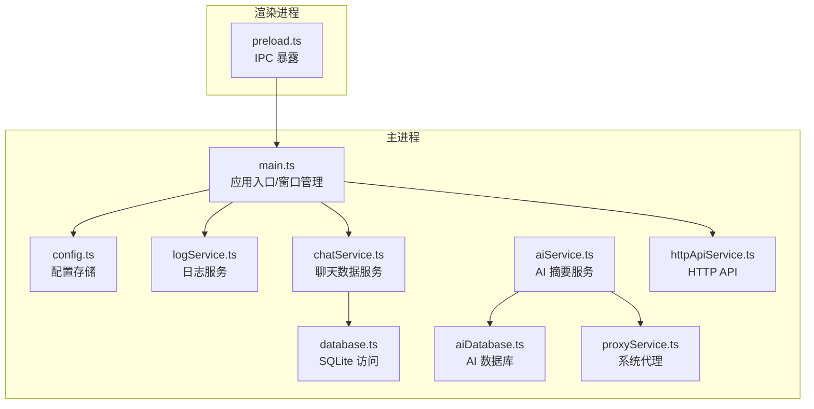
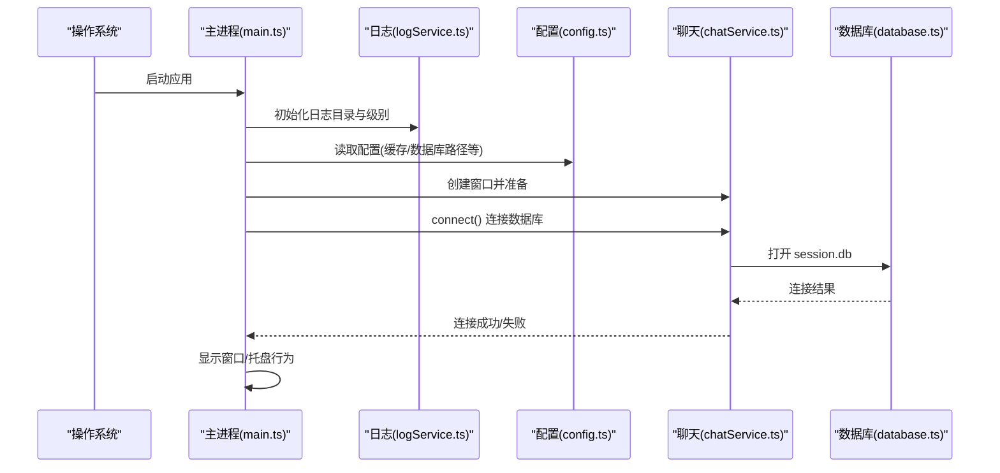
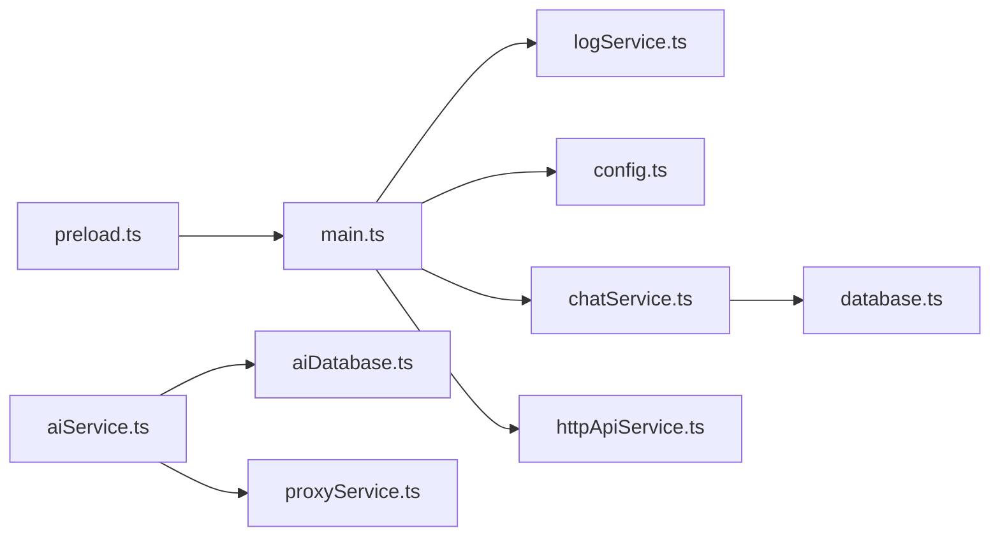
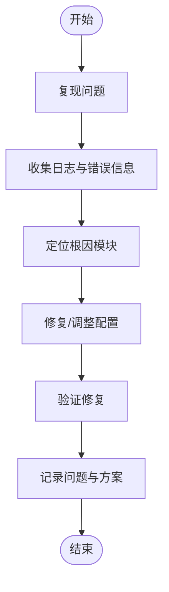

# 故障排除和调试

<cite>
**本文档引用的文件**
- [main.ts](file://electron/main.ts)
- [preload.ts](file://electron/preload.ts)
- [logService.ts](file://electron/services/logService.ts)
- [config.ts](file://electron/services/config.ts)
- [database.ts](file://electron/services/database.ts)
- [chatService.ts](file://electron/services/chatService.ts)
- [aiService.ts](file://electron/services/ai/aiService.ts)
- [aiDatabase.ts](file://electron/services/ai/aiDatabase.ts)
- [proxyService.ts](file://electron/services/ai/proxyService.ts)
- [httpApiService.ts](file://electron/services/httpApiService.ts)
- [README.md](file://README.md)
</cite>

## 目录
1. [简介](#简介)
2. [项目结构](#项目结构)
3. [核心组件](#核心组件)
4. [架构总览](#架构总览)
5. [详细组件分析](#详细组件分析)
6. [依赖分析](#依赖分析)
7. [性能考虑](#性能考虑)
8. [故障排除指南](#故障排除指南)
9. [结论](#结论)
10. [附录](#附录)

## 简介
本文件面向技术支持人员与高级用户，提供 CipherTalk 的系统化故障排除与调试指南。内容覆盖启动失败、数据库连接问题、AI 服务异常、性能问题等常见场景；并提供日志分析、错误追踪、性能分析工具使用、开发与生产环境调试策略，以及问题排查流程与常见错误代码对照。

## 项目结构
CipherTalk 采用 Electron + React 架构，主进程负责数据库连接、AI 服务、HTTP API、日志与系统代理等能力，渲染进程负责 UI 与用户交互。关键调试相关模块分布如下：
- 主进程入口与窗口管理：electron/main.ts
- 渲染进程桥接：electron/preload.ts
- 日志服务：electron/services/logService.ts
- 配置服务：electron/services/config.ts
- 数据库服务：electron/services/database.ts
- 聊天服务：electron/services/chatService.ts
- AI 服务与数据库：electron/services/ai/aiService.ts、electron/services/ai/aiDatabase.ts
- 代理服务：electron/services/ai/proxyService.ts
- HTTP API 服务：electron/services/httpApiService.ts
- 项目说明：README.md

**图示来源**
- [main.ts:1-120](file://electron/main.ts#L1-L120)
- [preload.ts:1-120](file://electron/preload.ts#L1-L120)
- [logService.ts:1-80](file://electron/services/logService.ts#L1-L80)
- [config.ts:126-140](file://electron/services/config.ts#L126-L140)
- [database.ts:1-40](file://electron/services/database.ts#L1-L40)
- [chatService.ts:110-160](file://electron/services/chatService.ts#L110-L160)
- [aiService.ts:58-90](file://electron/services/ai/aiService.ts#L58-L90)
- [aiDatabase.ts:8-35](file://electron/services/ai/aiDatabase.ts#L8-L35)
- [proxyService.ts:16-40](file://electron/services/ai/proxyService.ts#L16-L40)
- [httpApiService.ts:44-65](file://electron/services/httpApiService.ts#L44-L65)

**章节来源**
- [main.ts:1-120](file://electron/main.ts#L1-L120)
- [preload.ts:1-120](file://electron/preload.ts#L1-L120)
- [README.md:132-160](file://README.md#L132-L160)

## 核心组件
- 应用入口与窗口生命周期：负责应用启动、托盘、窗口创建与关闭行为、开发者工具快捷键等。
- 日志服务：统一日志级别、文件轮转、清理与读取。
- 配置服务：持久化配置、默认值、迁移与 AI 配置结构。
- 数据库服务：SQLite 打开、查询、关闭与连接状态。
- 聊天服务：数据库连接、表结构探测、消息数据库缓存与增量更新。
- AI 服务：提供商选择、系统提示词、消息格式化、摘要生成、使用统计与缓存。
- 代理服务：系统代理检测、代理 Agent 构建与测试。
- HTTP API 服务：本地 HTTP 服务、鉴权、端口冲突处理、端点说明。

**章节来源**
- [main.ts:193-281](file://electron/main.ts#L193-L281)
- [logService.ts:20-98](file://electron/services/logService.ts#L20-L98)
- [config.ts:126-140](file://electron/services/config.ts#L126-L140)
- [database.ts:5-44](file://electron/services/database.ts#L5-L44)
- [chatService.ts:283-346](file://electron/services/chatService.ts#L283-L346)
- [aiService.ts:58-120](file://electron/services/ai/aiService.ts#L58-L120)
- [proxyService.ts:16-76](file://electron/services/ai/proxyService.ts#L16-L76)
- [httpApiService.ts:64-97](file://electron/services/httpApiService.ts#L64-L97)

## 架构总览
应用启动流程与关键调试节点如下：

**图示来源**
- [main.ts:218-235](file://electron/main.ts#L218-L235)
- [logService.ts:76-98](file://electron/services/logService.ts#L76-L98)
- [config.ts:248-273](file://electron/services/config.ts#L248-L273)
- [chatService.ts:283-346](file://electron/services/chatService.ts#L283-L346)
- [database.ts:11-24](file://electron/services/database.ts#L11-L24)

## 详细组件分析

### 日志服务（LogService）
- 功能：按日志级别写入文件、文件轮转、清理旧日志、读取日志、获取目录大小与路径。
- 关键点：默认只记录警告及以上；日志目录位于缓存路径 logs 子目录；单文件最大 10MB，最多保留 10 个文件。
- 调试建议：在问题复现阶段提升日志级别，定位到具体模块；结合“日志收集”章节进行采集。

**章节来源**
- [logService.ts:20-98](file://electron/services/logService.ts#L20-L98)
- [logService.ts:129-162](file://electron/services/logService.ts#L129-L162)
- [logService.ts:167-177](file://electron/services/logService.ts#L167-L177)
- [logService.ts:182-209](file://electron/services/logService.ts#L182-L209)
- [logService.ts:242-298](file://electron/services/logService.ts#L242-L298)

### 配置服务（ConfigService）
- 功能：配置表初始化、默认值注入、迁移（AI 配置、baseUrl 兼容）、读取/设置、TLD 缓存。
- 关键点：AI 配置结构支持多提供商；默认日志级别为 WARN；HTTP API 默认关闭。
- 调试建议：检查配置项是否正确写入；关注迁移日志；必要时清空配置后重试。

**章节来源**
- [config.ts:136-146](file://electron/services/config.ts#L136-L146)
- [config.ts:166-173](file://electron/services/config.ts#L166-L173)
- [config.ts:187-242](file://electron/services/config.ts#L187-L242)
- [config.ts:348-385](file://electron/services/config.ts#L348-L385)

### 数据库服务（DatabaseService）
- 功能：打开只读 SQLite 数据库、执行查询、关闭、连接状态检查。
- 关键点：文件不存在或打开失败会记录错误；查询异常会抛出错误。
- 调试建议：确认 dbPath 存在且可读；检查权限与杀软拦截。

**章节来源**
- [database.ts:11-24](file://electron/services/database.ts#L11-L24)
- [database.ts:29-44](file://electron/services/database.ts#L29-L44)
- [database.ts:69-74](file://electron/services/database.ts#L69-L74)

### 聊天服务（ChatService）
- 功能：连接数据库、会话列表、联系人列表、消息查询、头像解析、消息数据库缓存与索引、增量更新。
- 关键点：多数据库文件扫描与缓存；会话表名探测；头像 URL 优先级；异常时记录错误。
- 调试建议：检查账号目录与 session.db 是否存在；确认缓存清理后重新连接；关注增量更新时的数据库关闭时机。

**章节来源**
- [chatService.ts:283-346](file://electron/services/chatService.ts#L283-L346)
- [chatService.ts:451-520](file://electron/services/chatService.ts#L451-L520)
- [chatService.ts:586-713](file://electron/services/chatService.ts#L586-L713)
- [chatService.ts:718-742](file://electron/services/chatService.ts#L718-L742)
- [chatService.ts:747-777](file://electron/services/chatService.ts#L747-L777)

### AI 服务（AIService）
- 功能：提供商选择与校验、系统提示词构建、消息格式化、摘要生成（流式）、使用统计、历史记录与缓存。
- 关键点：初始化需 cachePath 与 myWxid；AI 数据库存放于缓存根目录；支持代理检测与测试。
- 调试建议：检查 API Key 与提供商配置；确认 AI 数据库初始化；观察流式回调与缓存键生成。

**章节来源**
- [aiService.ts:69-83](file://electron/services/ai/aiService.ts#L69-L83)
- [aiService.ts:109-163](file://electron/services/ai/aiService.ts#L109-L163)
- [aiService.ts:168-238](file://electron/services/ai/aiService.ts#L168-L238)
- [aiService.ts:439-539](file://electron/services/ai/aiService.ts#L439-L539)
- [aiService.ts:544-557](file://electron/services/ai/aiService.ts#L544-L557)

### AI 数据库（AIDatabase）
- 功能：AI 摘要表、使用统计表、缓存表的创建与维护；保存摘要、缓存、查询历史、更新统计、清理过期缓存。
- 关键点：表结构包含索引；支持列动态添加；缓存键按天对齐。
- 调试建议：检查表是否存在与索引；核对缓存键与过期时间；关注删除与重命名操作。

**章节来源**
- [aiDatabase.ts:15-30](file://electron/services/ai/aiDatabase.ts#L15-L30)
- [aiDatabase.ts:117-164](file://electron/services/ai/aiDatabase.ts#L117-L164)
- [aiDatabase.ts:214-226](file://electron/services/ai/aiDatabase.ts#L214-L226)
- [aiDatabase.ts:256-287](file://electron/services/ai/aiDatabase.ts#L256-L287)
- [aiDatabase.ts:327-332](file://electron/services/ai/aiDatabase.ts#L327-L332)

### 代理服务（ProxyService）
- 功能：通过 Electron session.resolveProxy 获取系统代理；构建 HttpsProxyAgent；测试代理连通性。
- 关键点：缓存代理信息；区分 SOCKS5/HTTP/HTTPS；异常时降级直连。
- 调试建议：确认系统代理可用；测试代理连通性；必要时清除缓存刷新。

**章节来源**
- [proxyService.ts:26-76](file://electron/services/ai/proxyService.ts#L26-L76)
- [proxyService.ts:83-99](file://electron/services/ai/proxyService.ts#L83-L99)
- [proxyService.ts:115-146](file://electron/services/ai/proxyService.ts#L115-L146)

### HTTP API 服务（HttpApiService）
- 功能：本地 HTTP 服务、鉴权、端点、健康检查、状态查询、错误封装。
- 关键点：端口占用错误码处理；鉴权 Bearer Token；端点兼容旧路径；状态聚合。
- 调试建议：检查端口占用；核对 Token；查看状态端点返回。

**章节来源**
- [httpApiService.ts:64-97](file://electron/services/httpApiService.ts#L64-L97)
- [httpApiService.ts:164-167](file://electron/services/httpApiService.ts#L164-L167)
- [httpApiService.ts:443-517](file://electron/services/httpApiService.ts#L443-L517)
- [httpApiService.ts:530-616](file://electron/services/httpApiService.ts#L530-L616)

## 依赖分析
- 主进程入口依赖日志、配置、聊天、HTTP API 等服务。
- 聊天服务依赖数据库服务与配置服务。
- AI 服务依赖配置服务、AI 数据库与代理服务。
- 预加载脚本暴露 IPC 接口，供渲染进程调用主进程能力。

**图示来源**
- [main.ts:1-30](file://electron/main.ts#L1-L30)
- [preload.ts:4-435](file://electron/preload.ts#L4-L435)
- [chatService.ts:110-152](file://electron/services/chatService.ts#L110-L152)
- [aiService.ts:58-64](file://electron/services/ai/aiService.ts#L58-L64)

**章节来源**
- [main.ts:1-30](file://electron/main.ts#L1-L30)
- [preload.ts:4-435](file://electron/preload.ts#L4-L435)

## 性能考虑
- 数据库查询缓存：聊天服务对会话表、联系人列信息、消息数据库连接与预编译语句均做缓存，减少重复 IO 与解析。
- 文件轮转与日志大小限制：日志文件最大 10MB，最多保留 10 个，避免磁盘膨胀。
- 增量更新：聊天服务通过检查 session.db 与 WAL 文件修改时间，避免不必要的全量扫描。
- 代理缓存：代理服务缓存系统代理信息 1 分钟，降低 resolveProxy 频率。

**章节来源**
- [chatService.ts:121-139](file://electron/services/chatService.ts#L121-L139)
- [logService.ts:23-25](file://electron/services/logService.ts#L23-L25)
- [chatService.ts:4732-4774](file://electron/services/chatService.ts#L4732-L4774)
- [proxyService.ts:18-19](file://electron/services/ai/proxyService.ts#L18-L19)

## 故障排除指南

### 启动失败
- 现象：应用无法启动或启动屏卡住。
- 排查步骤：
  1) 检查日志目录与权限：确认缓存路径存在且可写。
  2) 查看启动时数据库连接：主进程会在启动屏完成后尝试连接数据库，失败会记录错误。
  3) 检查配置：确认 dbPath、myWxid、decryptKey 等关键配置存在。
  4) 检查托盘与窗口行为：确认关闭到托盘配置与窗口创建逻辑。
- 相关代码路径：
  - [main.ts:218-235](file://electron/main.ts#L218-L235)
  - [main.ts:3650-3688](file://electron/main.ts#L3650-L3688)
  - [logService.ts:76-98](file://electron/services/logService.ts#L76-L98)
  - [config.ts:248-273](file://electron/services/config.ts#L248-L273)

**章节来源**
- [main.ts:218-235](file://electron/main.ts#L218-L235)
- [main.ts:3650-3688](file://electron/main.ts#L3650-L3688)
- [logService.ts:76-98](file://electron/services/logService.ts#L76-L98)
- [config.ts:248-273](file://electron/services/config.ts#L248-L273)

### 数据库连接问题
- 现象：提示未找到数据库、数据库文件不存在、打开失败。
- 排查步骤：
  1) 确认 dbPath 指向的数据库文件存在且可读。
  2) 检查账号目录与 session.db 是否存在。
  3) 关注数据库打开异常与错误信息，必要时重新解密或迁移。
  4) 检查缓存清理后是否重新连接。
- 相关代码路径：
  - [database.ts:11-24](file://electron/services/database.ts#L11-L24)
  - [chatService.ts:283-346](file://electron/services/chatService.ts#L283-L346)
  - [chatService.ts:747-777](file://electron/services/chatService.ts#L747-L777)

**章节来源**
- [database.ts:11-24](file://electron/services/database.ts#L11-L24)
- [chatService.ts:283-346](file://electron/services/chatService.ts#L283-L346)
- [chatService.ts:747-777](file://electron/services/chatService.ts#L747-L777)

### AI 服务异常
- 现象：AI 摘要生成失败、提供商不可用、代理不通。
- 排查步骤：
  1) 检查 AI 配置：当前提供商、API Key、模型、baseURL。
  2) 初始化检查：cachePath 与 myWxid 是否配置。
  3) 代理检测：通过代理服务获取系统代理并测试连通性。
  4) 连接测试：使用 testConnection 方法验证提供商连通性。
- 相关代码路径：
  - [aiService.ts:69-83](file://electron/services/ai/aiService.ts#L69-L83)
  - [aiService.ts:109-163](file://electron/services/ai/aiService.ts#L109-L163)
  - [aiService.ts:544-557](file://electron/services/ai/aiService.ts#L544-L557)
  - [proxyService.ts:26-76](file://electron/services/ai/proxyService.ts#L26-L76)
  - [proxyService.ts:115-146](file://electron/services/ai/proxyService.ts#L115-L146)

**章节来源**
- [aiService.ts:69-83](file://electron/services/ai/aiService.ts#L69-L83)
- [aiService.ts:109-163](file://electron/services/ai/aiService.ts#L109-L163)
- [aiService.ts:544-557](file://electron/services/ai/aiService.ts#L544-L557)
- [proxyService.ts:26-76](file://electron/services/ai/proxyService.ts#L26-L76)
- [proxyService.ts:115-146](file://electron/services/ai/proxyService.ts#L115-L146)

### 性能问题
- 现象：启动慢、查询慢、内存占用高。
- 排查步骤：
  1) 启用更细粒度日志，定位慢点。
  2) 检查数据库缓存与索引：确认消息数据库连接与索引创建。
  3) 检查代理缓存：避免频繁 resolveProxy。
  4) 检查增量更新：确认 session.db 与 WAL 文件修改时间检查逻辑。
- 相关代码路径：
  - [chatService.ts:718-742](file://electron/services/chatService.ts#L718-L742)
  - [chatService.ts:4732-4774](file://electron/services/chatService.ts#L4732-L4774)
  - [proxyService.ts:26-76](file://electron/services/ai/proxyService.ts#L26-L76)

**章节来源**
- [chatService.ts:718-742](file://electron/services/chatService.ts#L718-L742)
- [chatService.ts:4732-4774](file://electron/services/chatService.ts#L4732-L4774)
- [proxyService.ts:26-76](file://electron/services/ai/proxyService.ts#L26-L76)

### 调试技巧

#### 日志分析
- 步骤：提升日志级别至 DEBUG/WARN，复现问题，收集当日日志文件，定位错误堆栈与关键参数。
- 工具：日志服务提供读取与清理能力，便于批量收集。

**章节来源**
- [logService.ts:36-59](file://electron/services/logService.ts#L36-L59)
- [logService.ts:242-298](file://electron/services/logService.ts#L242-L298)

#### 错误追踪
- 步骤：在关键函数入口/出口打印上下文参数；利用 IPC 层暴露的日志读取接口；结合浏览器开发者工具查看渲染进程错误。
- 工具：preload.ts 暴露日志读取与级别设置接口。

**章节来源**
- [preload.ts:358-366](file://electron/preload.ts#L358-L366)

#### 性能分析工具使用
- 步骤：使用 Node.js Profiler/Chrome DevTools 对主进程与渲染进程进行采样；关注数据库查询耗时、代理检测频率、消息数据库连接次数。
- 工具：Electron DevTools、V8 性能分析器。

[本节为通用指导，无需特定文件引用]

#### 开发调试
- 步骤：开发模式下按 F12 或 Ctrl+Shift+I 打开开发者工具；在主进程窗口事件中监听输入事件以开关 DevTools；检查 IPC 通信与错误。
- 工具：Electron DevTools、React DevTools（如集成）。

**章节来源**
- [main.ts:264-274](file://electron/main.ts#L264-L274)

#### 生产环境调试
- 步骤：通过 HTTP API 状态端点检查服务状态与鉴权；使用日志服务读取与清理；必要时临时提升日志级别；收集日志目录大小与文件列表。
- 工具：HTTP API 服务、日志服务。

**章节来源**
- [httpApiService.ts:530-616](file://electron/services/httpApiService.ts#L530-L616)
- [logService.ts:242-330](file://electron/services/logService.ts#L242-L330)

### 问题排查流程
- 复现：在受控环境中复现问题，记录操作步骤与预期/实际结果。
- 根因：结合日志、错误码与关键参数，定位到具体模块（日志/配置/数据库/聊天/AI/代理/HTTP API）。
- 验证：修改配置或代码后再次复现，确认问题解决。
- 记录：将问题与解决方案写入知识库，便于后续检索。

[本图为概念流程图，无需图示来源]

### 常见错误代码与解决方案

- 数据库错误
  - 文件不存在：检查 dbPath 与文件权限；确认数据库已解密。
  - 打开失败：检查只读模式与文件损坏；尝试重新解密。
  - 未找到 session.db：确认账号目录与 session.db 是否存在。
  - 参考路径：
    - [database.ts:11-24](file://electron/services/database.ts#L11-L24)
    - [chatService.ts:283-346](file://electron/services/chatService.ts#L283-L346)

- 网络错误
  - 端口占用：更换端口或释放占用进程；HTTP API 服务会返回端口占用错误。
  - 代理不可用：通过代理服务检测系统代理并测试连通性。
  - 参考路径：
    - [httpApiService.ts:81-88](file://electron/services/httpApiService.ts#L81-L88)
    - [proxyService.ts:115-146](file://electron/services/ai/proxyService.ts#L115-L146)

- 权限错误
  - 缓存路径不可写：检查缓存目录权限；确保应用以足够权限运行。
  - 日志写入失败：检查日志目录与磁盘空间。
  - 参考路径：
    - [logService.ts:76-98](file://electron/services/logService.ts#L76-L98)
    - [logService.ts:129-162](file://electron/services/logService.ts#L129-L162)

- AI 配置错误
  - API Key 未配置：检查当前提供商配置与 API Key。
  - 提供商不支持：确认提供商名称与配置项。
  - 参考路径：
    - [aiService.ts:109-163](file://electron/services/ai/aiService.ts#L109-L163)
    - [config.ts:348-385](file://electron/services/config.ts#L348-L385)

### 用户问题支持
- FAQ：参见项目说明中的功能特性与技术栈介绍。
- 帮助文档：README.md 提供快速开始与项目结构说明。
- 社区支持：提供 GitHub Issues/Discussions、Telegram 群组等渠道。

**章节来源**
- [README.md:94-128](file://README.md#L94-L128)
- [README.md:312-324](file://README.md#L312-L324)

## 结论
通过系统化的日志、配置、数据库、聊天、AI、代理与 HTTP API 能力，CipherTalk 提供了完善的故障排除与调试基础。建议在日常运维中：
- 启用适当日志级别，定期轮转与清理；
- 在变更配置后进行回归验证；
- 使用代理与 HTTP API 的测试能力快速定位网络问题；
- 对数据库与消息缓存进行监控，及时发现异常。

[本节为总结，无需特定文件引用]

## 附录

### 调试常用 IPC 接口（来自 preload.ts）
- 日志：读取日志、清理、获取大小、设置/获取级别。
- 配置：读取/设置配置项。
- 数据库：打开/查询/关闭数据库。
- 聊天：会话/联系人/消息查询。
- AI：提供商列表、代理状态、连接测试、摘要生成、使用统计。
- HTTP API：状态、重启、端点说明。

**章节来源**
- [preload.ts:5-435](file://electron/preload.ts#L5-L435)