# 图表组件设计

<cite>
**本文档引用的文件**
- [AnalyticsPage.tsx](file://src/pages/AnalyticsPage.tsx)
- [GroupAnalyticsPage.tsx](file://src/pages/GroupAnalyticsPage.tsx)
- [analyticsStore.ts](file://src/stores/analyticsStore.ts)
- [analytics.ts](file://src/types/analytics.ts)
- [AnalyticsPage.scss](file://src/pages/AnalyticsPage.scss)
- [GroupAnalyticsPage.scss](file://src/pages/GroupAnalyticsPage.scss)
- [main.scss](file://src/styles/main.scss)
- [themeStore.ts](file://src/stores/themeStore.ts)
- [ipc.ts](file://src/services/ipc.ts)
- [package.json](file://package.json)
</cite>

## 目录
1. [简介](#简介)
2. [项目结构](#项目结构)
3. [核心组件](#核心组件)
4. [架构概览](#架构概览)
5. [详细组件分析](#详细组件分析)
6. [依赖关系分析](#依赖关系分析)
7. [性能考虑](#性能考虑)
8. [故障排除指南](#故障排除指南)
9. [结论](#结论)
10. [附录](#附录)

## 简介

CipherTalk 是一个基于 Electron 和 React 的微信聊天记录查看工具，其图表组件设计专注于数据分析和可视化展示。本文档深入解析了 ECharts 图表库在项目中的集成与配置，涵盖图表选项配置、主题定制、响应式布局等关键方面。

项目采用现代化的前端技术栈，包括 React 19、TypeScript、Zustand 状态管理、以及 ECharts 5.6.0 图表库。图表组件主要分布在私聊分析页面和群聊分析页面，提供了丰富的数据可视化功能。

## 项目结构

项目采用模块化组织方式，图表相关代码主要集中在以下目录：

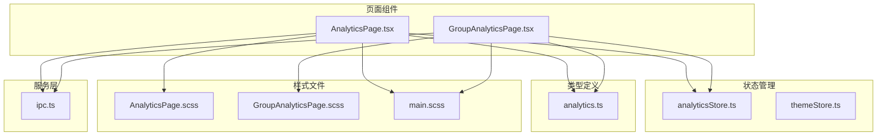

**图表来源**
- [AnalyticsPage.tsx:1-189](file://src/pages/AnalyticsPage.tsx#L1-L189)
- [GroupAnalyticsPage.tsx:1-537](file://src/pages/GroupAnalyticsPage.tsx#L1-L537)
- [analyticsStore.ts:1-71](file://src/stores/analyticsStore.ts#L1-L71)

**章节来源**
- [AnalyticsPage.tsx:1-189](file://src/pages/AnalyticsPage.tsx#L1-L189)
- [GroupAnalyticsPage.tsx:1-537](file://src/pages/GroupAnalyticsPage.tsx#L1-L537)

## 核心组件

### 私聊分析图表组件

私聊分析页面包含了三个核心图表组件：

1. **消息类型分布饼图** - 展示不同类型消息的占比
2. **发送/接收比例饼图** - 对比发送和接收消息数量
3. **每小时消息分布柱状图** - 显示24小时内的消息分布情况

### 群聊分析图表组件

群聊分析页面提供了更丰富的图表功能：

1. **活跃时段柱状图** - 展示群聊成员的活跃时间分布
2. **媒体内容统计饼图** - 分析不同类型媒体内容的占比
3. **成员排行列表** - 展示群聊成员的消息统计排行

**章节来源**
- [AnalyticsPage.tsx:63-100](file://src/pages/AnalyticsPage.tsx#L63-L100)
- [GroupAnalyticsPage.tsx:181-235](file://src/pages/GroupAnalyticsPage.tsx#L181-L235)

## 架构概览

图表组件的整体架构采用分层设计，确保了良好的可维护性和扩展性：

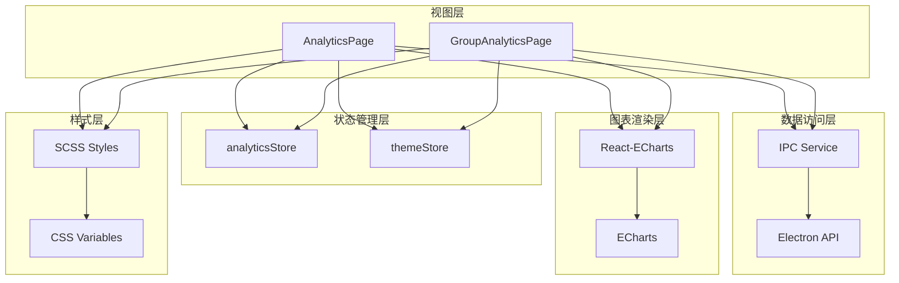

**图表来源**
- [AnalyticsPage.tsx:1-189](file://src/pages/AnalyticsPage.tsx#L1-L189)
- [GroupAnalyticsPage.tsx:1-537](file://src/pages/GroupAnalyticsPage.tsx#L1-L537)
- [analyticsStore.ts:52-71](file://src/stores/analyticsStore.ts#L52-L71)

## 详细组件分析

### 饼图组件分析

#### 消息类型分布饼图

该饼图展示了不同类型消息的占比情况，采用了环形饼图的设计：

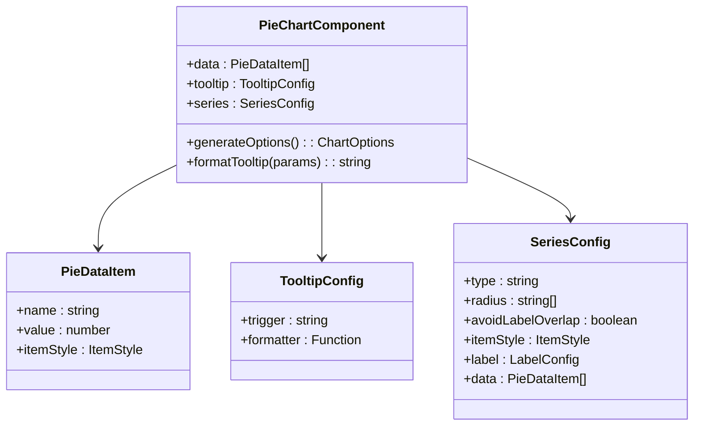

**图表来源**
- [AnalyticsPage.tsx:63-77](file://src/pages/AnalyticsPage.tsx#L63-L77)

#### 发送/接收比例饼图

该饼图专门用于对比发送和接收消息的数量差异：

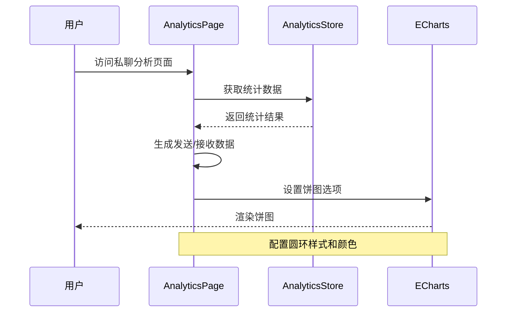

**图表来源**
- [AnalyticsPage.tsx:79-88](file://src/pages/AnalyticsPage.tsx#L79-L88)

#### 媒体内容统计饼图

群聊分析页面的媒体内容饼图具有更复杂的颜色映射和标签逻辑：

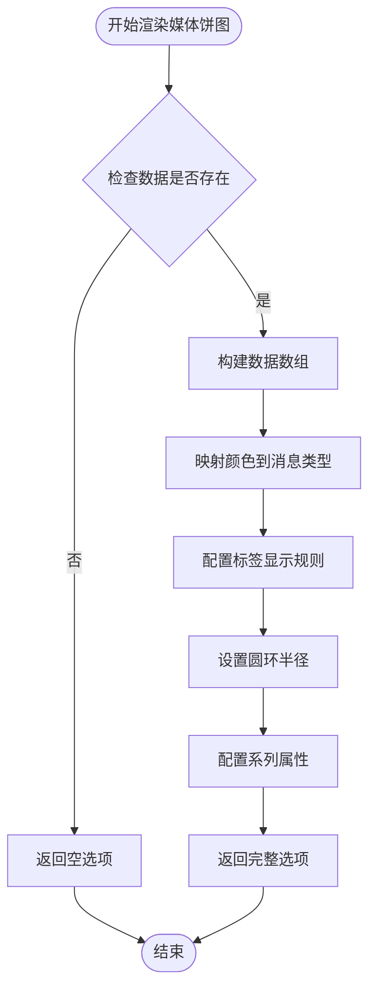

**图表来源**
- [GroupAnalyticsPage.tsx:192-235](file://src/pages/GroupAnalyticsPage.tsx#L192-L235)

**章节来源**
- [AnalyticsPage.tsx:63-88](file://src/pages/AnalyticsPage.tsx#L63-L88)
- [GroupAnalyticsPage.tsx:192-235](file://src/pages/GroupAnalyticsPage.tsx#L192-L235)

### 柱状图组件分析

#### 每小时消息分布柱状图

该柱状图展示了24小时内消息的分布情况：

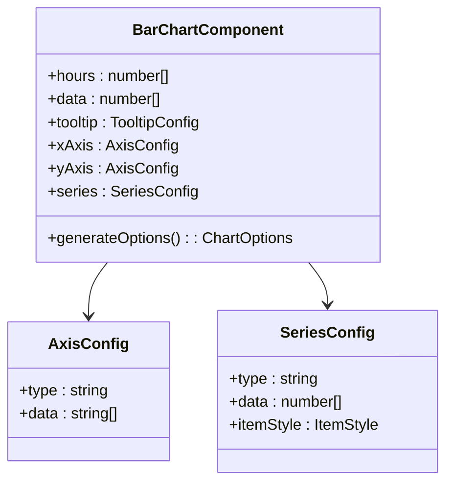

**图表来源**
- [AnalyticsPage.tsx:90-100](file://src/pages/AnalyticsPage.tsx#L90-L100)
- [GroupAnalyticsPage.tsx:181-190](file://src/pages/GroupAnalyticsPage.tsx#L181-L190)

#### 群聊活跃时段柱状图

群聊分析页面的活跃时段柱状图具有更高的复杂度：

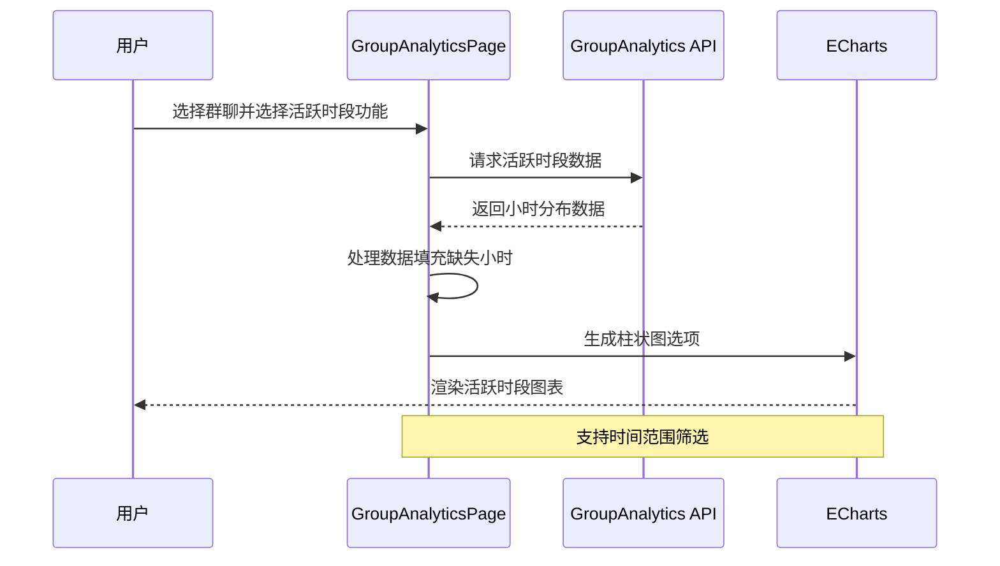

**图表来源**
- [GroupAnalyticsPage.tsx:138-174](file://src/pages/GroupAnalyticsPage.tsx#L138-L174)

**章节来源**
- [AnalyticsPage.tsx:90-100](file://src/pages/AnalyticsPage.tsx#L90-L100)
- [GroupAnalyticsPage.tsx:181-190](file://src/pages/GroupAnalyticsPage.tsx#L181-L190)

### 排行榜组件分析

排行榜组件结合了数据可视化和列表展示：

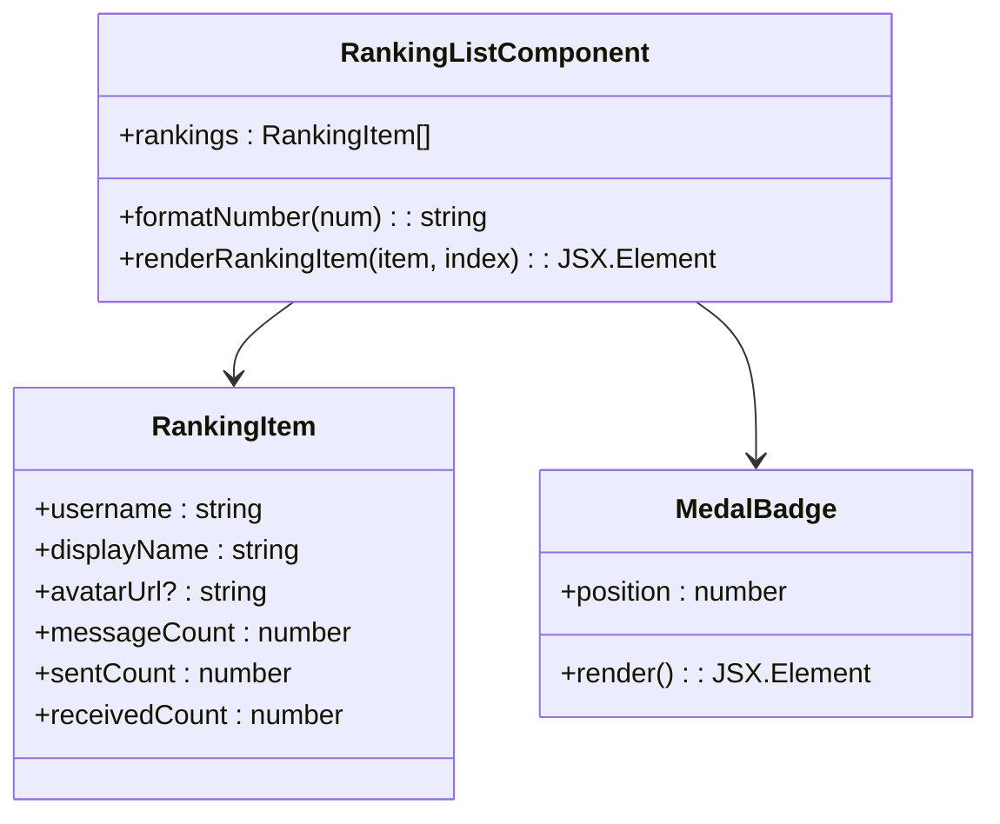

**图表来源**
- [AnalyticsPage.tsx:166-181](file://src/pages/AnalyticsPage.tsx#L166-L181)

**章节来源**
- [AnalyticsPage.tsx:166-181](file://src/pages/AnalyticsPage.tsx#L166-L181)

## 依赖关系分析

### ECharts 集成

项目使用了 `echarts-for-react` 包来集成 ECharts 图表库：

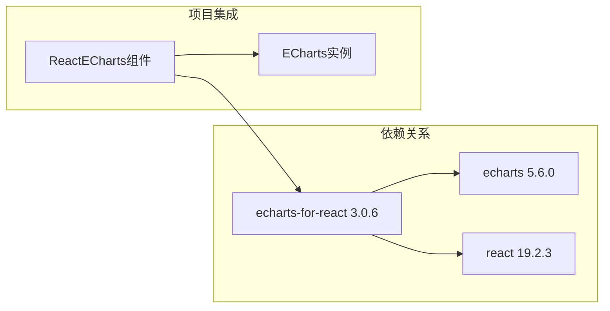

**图表来源**
- [package.json:32-33](file://package.json#L32-L33)

### 状态管理依赖

图表组件通过 Zustand 状态管理库实现数据共享：

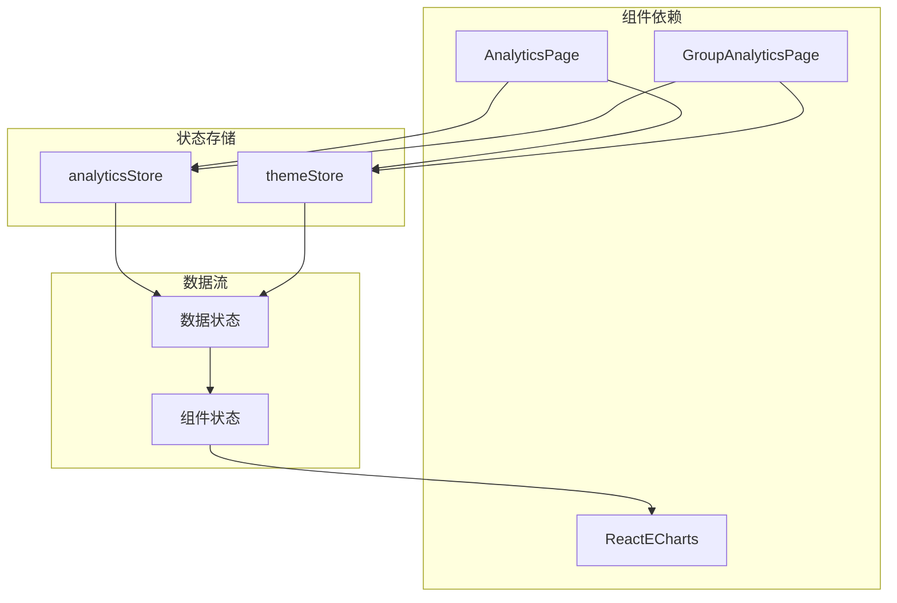

**图表来源**
- [analyticsStore.ts:52-71](file://src/stores/analyticsStore.ts#L52-L71)
- [themeStore.ts:79-140](file://src/stores/themeStore.ts#L79-L140)

**章节来源**
- [package.json:32-33](file://package.json#L32-L33)
- [analyticsStore.ts:52-71](file://src/stores/analyticsStore.ts#L52-L71)

## 性能考虑

### 图表渲染优化

1. **懒加载策略** - 图表仅在数据加载完成后渲染
2. **内存管理** - 使用 `echarts-for-react` 的自动销毁机制
3. **数据缓存** - 通过 Zustand 状态管理避免重复计算

### 响应式设计

项目实现了多层次的响应式布局：

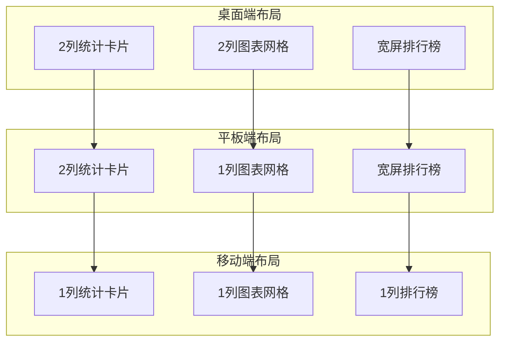

**图表来源**
- [AnalyticsPage.scss:245-263](file://src/pages/AnalyticsPage.scss#L245-L263)
- [GroupAnalyticsPage.scss:721-744](file://src/pages/GroupAnalyticsPage.scss#L721-L744)

**章节来源**
- [AnalyticsPage.scss:245-263](file://src/pages/AnalyticsPage.scss#L245-L263)
- [GroupAnalyticsPage.scss:721-744](file://src/pages/GroupAnalyticsPage.scss#L721-L744)

## 故障排除指南

### 常见问题及解决方案

1. **图表不显示问题**
   - 检查容器高度设置
   - 确认数据格式正确
   - 验证 ECharts 库版本兼容性

2. **数据加载失败**
   - 检查 Electron IPC 通信
   - 验证数据库连接状态
   - 确认权限设置

3. **样式冲突问题**
   - 检查 CSS 变量覆盖
   - 验证主题切换逻辑
   - 确认媒体查询断点

**章节来源**
- [AnalyticsPage.tsx:15-45](file://src/pages/AnalyticsPage.tsx#L15-L45)
- [GroupAnalyticsPage.tsx:138-174](file://src/pages/GroupAnalyticsPage.tsx#L138-L174)

## 结论

CipherTalk 的图表组件设计展现了现代前端数据可视化的最佳实践。通过合理的架构设计、完善的类型系统和灵活的主题定制，实现了既美观又实用的数据展示功能。

主要优势包括：
- **模块化设计** - 清晰的组件分离和职责划分
- **类型安全** - 完整的 TypeScript 类型定义
- **主题一致性** - 统一的视觉风格和交互体验
- **性能优化** - 合理的状态管理和渲染策略
- **可扩展性** - 灵活的配置接口和插件机制

## 附录

### 最佳实践建议

1. **图表配置标准化**
   - 统一图表选项配置模板
   - 建立主题变量映射表
   - 实现配置继承机制

2. **数据处理优化**
   - 实现数据预处理管道
   - 建立缓存策略
   - 优化大数据集渲染

3. **用户体验提升**
   - 添加加载状态指示器
   - 实现错误边界处理
   - 提供数据导出功能

### 扩展方法

1. **新图表类型支持**
   - 添加新的图表组件基类
   - 实现通用配置接口
   - 建立样式定制规范

2. **交互功能增强**
   - 实现图表间联动
   - 添加缩放和平移功能
   - 支持多维度筛选

3. **性能监控**
   - 添加渲染性能指标
   - 实现内存使用监控
   - 建立性能基准测试