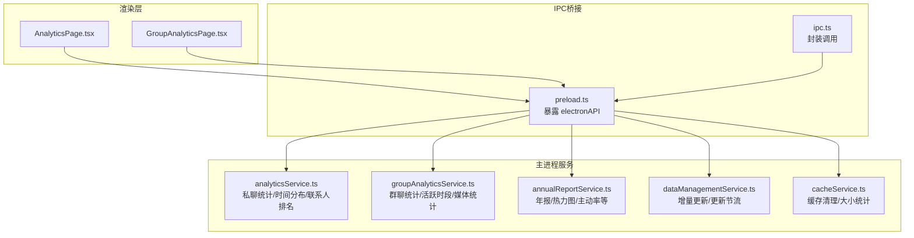
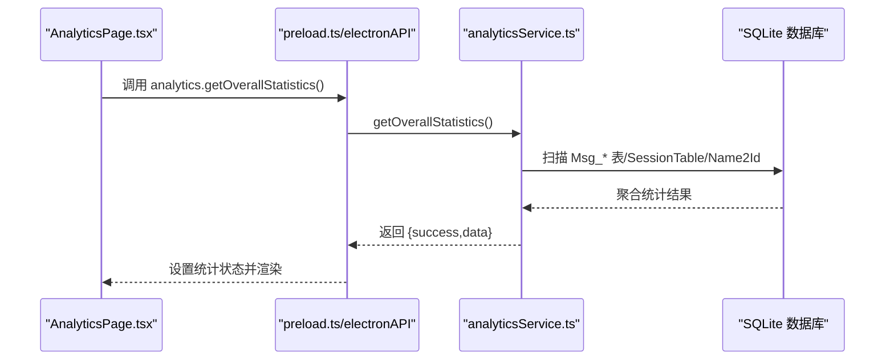
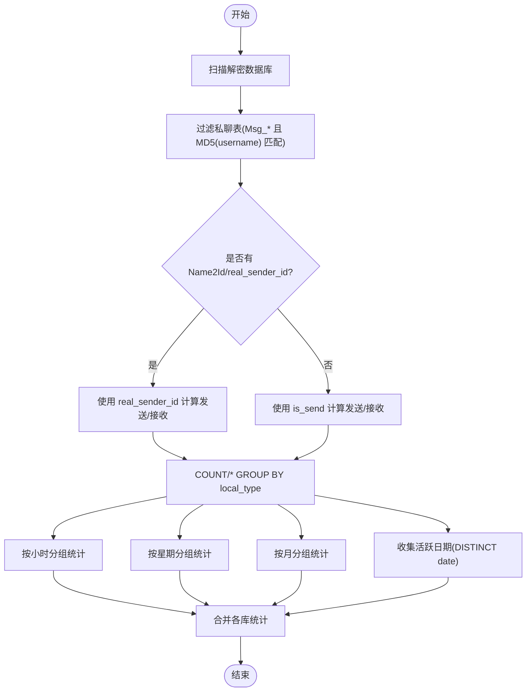
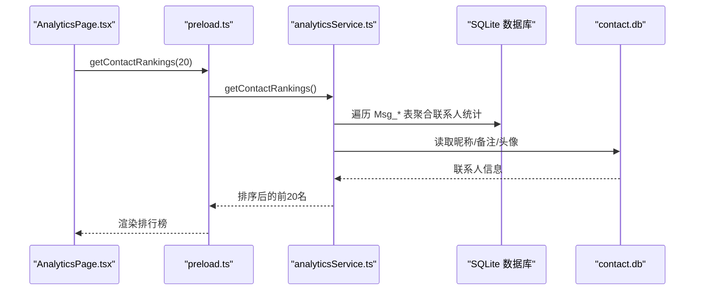
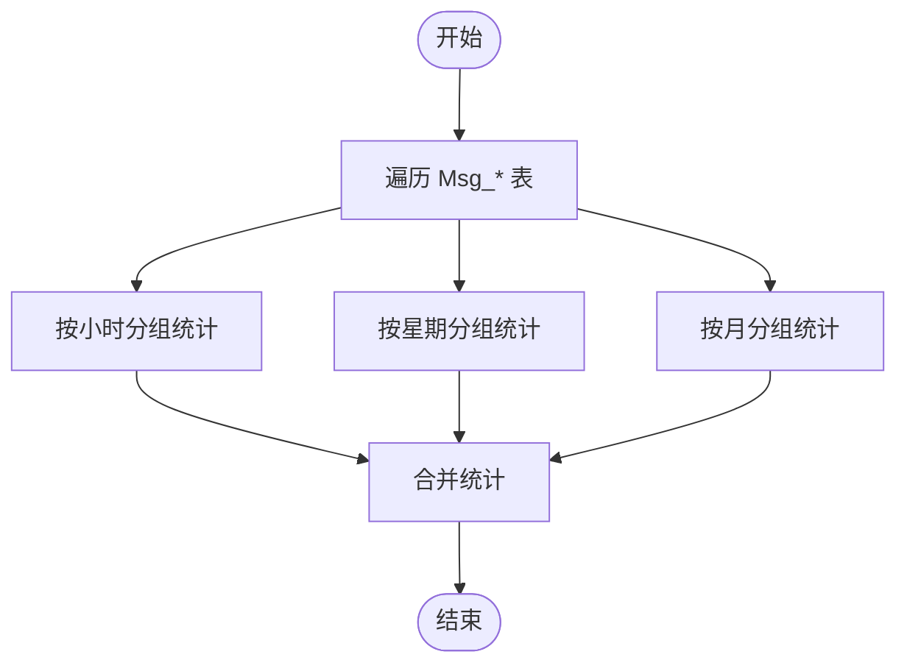
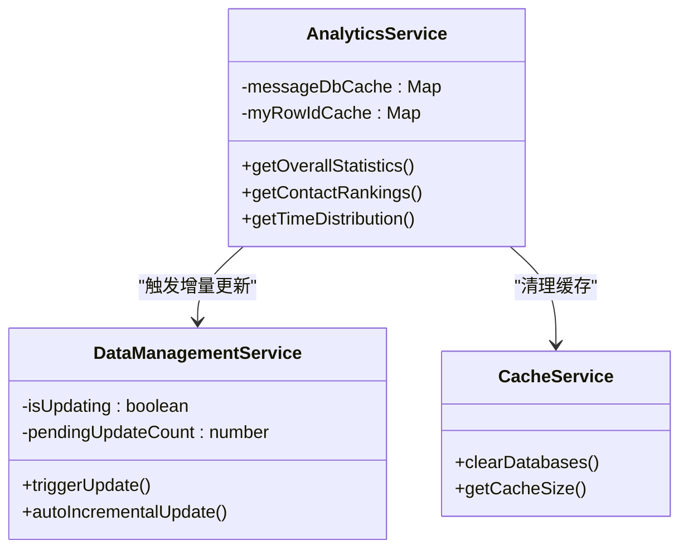
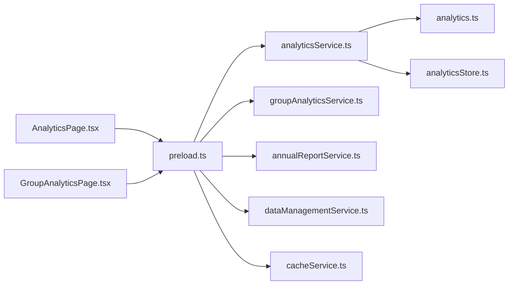

# 数据分析算法

<cite>
**本文引用的文件**   
- [analyticsService.ts](file://electron/services/analyticsService.ts)
- [analytics.ts](file://src/types/analytics.ts)
- [analyticsStore.ts](file://src/stores/analyticsStore.ts)
- [AnalyticsPage.tsx](file://src/pages/AnalyticsPage.tsx)
- [groupAnalyticsService.ts](file://electron/services/groupAnalyticsService.ts)
- [GroupAnalyticsPage.tsx](file://src/pages/GroupAnalyticsPage.tsx)
- [annualReportService.ts](file://electron/services/annualReportService.ts)
- [dataManagementService.ts](file://electron/services/dataManagementService.ts)
- [cacheService.ts](file://electron/services/cacheService.ts)
- [preload.ts](file://electron/preload.ts)
- [ipc.ts](file://src/services/ipc.ts)
</cite>

## 目录
1. [引言](#引言)
2. [项目结构](#项目结构)
3. [核心组件](#核心组件)
4. [架构总览](#架构总览)
5. [详细组件分析](#详细组件分析)
6. [依赖关系分析](#依赖关系分析)
7. [性能考量](#性能考量)
8. [故障排查指南](#故障排查指南)
9. [结论](#结论)
10. [附录](#附录)

## 引言
本文件面向数据分析师与算法开发者，系统化梳理 CipherTalk 的数据分析算法与实现，覆盖以下主题：
- 统计分析算法：消息总数统计、类型分布计算、时间分布分析
- 排名算法：联系人活跃度计算、消息量排序、权重因子
- 时间序列分析：每日消息统计、小时分布计算、活跃时间段识别
- 数据聚合策略：按时间窗口聚合、按用户分组、按消息类型分类
- 性能优化算法：增量更新、缓存策略、查询优化
- 数据准确性保证：边界条件处理、异常值检测、数据完整性验证
- 算法扩展与自定义方法

## 项目结构
前端通过 Electron 的 contextBridge 暴露 API，渲染进程调用主进程服务执行数据库分析与聚合；主进程服务负责：
- 扫描解密后的数据库文件
- 过滤私聊/群聊会话
- 执行 SQL 聚合统计
- 缓存数据库连接与查询结果
- 提供增量更新与缓存清理能力

**图表来源**
- [AnalyticsPage.tsx:15-45](file://src/pages/AnalyticsPage.tsx#L15-L45)
- [GroupAnalyticsPage.tsx:109-122](file://src/pages/GroupAnalyticsPage.tsx#L109-L122)
- [preload.ts:4-287](file://electron/preload.ts#L4-L287)
- [analyticsService.ts:269-450](file://electron/services/analyticsService.ts#L269-L450)
- [groupAnalyticsService.ts:204-350](file://electron/services/groupAnalyticsService.ts#L204-L350)
- [annualReportService.ts:31-886](file://electron/services/annualReportService.ts#L31-L886)
- [dataManagementService.ts:1495-1540](file://electron/services/dataManagementService.ts#L1495-L1540)
- [cacheService.ts:112-191](file://electron/services/cacheService.ts#L112-L191)

**章节来源**
- [AnalyticsPage.tsx:1-189](file://src/pages/AnalyticsPage.tsx#L1-L189)
- [GroupAnalyticsPage.tsx:1-537](file://src/pages/GroupAnalyticsPage.tsx#L1-L537)
- [preload.ts:1-287](file://electron/preload.ts#L1-L287)
- [analyticsService.ts:1-759](file://electron/services/analyticsService.ts#L1-L759)
- [groupAnalyticsService.ts:1-718](file://electron/services/groupAnalyticsService.ts#L1-L718)
- [annualReportService.ts:31-886](file://electron/services/annualReportService.ts#L31-L886)
- [dataManagementService.ts:1-200](file://electron/services/dataManagementService.ts#L1-L200)
- [cacheService.ts:1-486](file://electron/services/cacheService.ts#L1-L486)

## 核心组件
- 统计服务（私聊）：消息总量、发送/接收、类型分布、活跃天数、时间范围
- 时间分布服务：小时分布、星期分布、月度分布
- 联系人排名服务：按消息量排序，区分发送/接收
- 群聊分析服务：群成员、发言排行、活跃时段、媒体类型统计
- 年报服务：热力图、主动率、最长连击、深夜之王等
- 数据管理与缓存：增量更新、缓存清理、数据库大小统计

**章节来源**
- [analyticsService.ts:269-450](file://electron/services/analyticsService.ts#L269-L450)
- [analyticsService.ts:628-743](file://electron/services/analyticsService.ts#L628-L743)
- [analyticsService.ts:453-625](file://electron/services/analyticsService.ts#L453-L625)
- [groupAnalyticsService.ts:204-350](file://electron/services/groupAnalyticsService.ts#L204-L350)
- [groupAnalyticsService.ts:423-531](file://electron/services/groupAnalyticsService.ts#L423-L531)
- [groupAnalyticsService.ts:534-604](file://electron/services/groupAnalyticsService.ts#L534-L604)
- [groupAnalyticsService.ts:606-707](file://electron/services/groupAnalyticsService.ts#L606-L707)
- [annualReportService.ts:31-886](file://electron/services/annualReportService.ts#L31-L886)
- [dataManagementService.ts:1495-1540](file://electron/services/dataManagementService.ts#L1495-L1540)
- [cacheService.ts:112-191](file://electron/services/cacheService.ts#L112-L191)

## 架构总览
渲染层通过 electronAPI 调用主进程服务，主进程服务对解密后的 SQLite 数据库执行聚合查询，并将结果返回给前端展示。

**图表来源**
- [AnalyticsPage.tsx:15-45](file://src/pages/AnalyticsPage.tsx#L15-L45)
- [preload.ts:4-287](file://electron/preload.ts#L4-L287)
- [analyticsService.ts:269-450](file://electron/services/analyticsService.ts#L269-L450)

## 详细组件分析

### 统计分析算法：消息总数、类型分布、时间分布
- 消息总数统计
  - 遍历账户目录下所有解密数据库，筛选私聊表（基于 MD5(username) 匹配 Msg_* 表名）
  - 使用 COUNT(*) 统计总消息数；按 local_type 统计各类消息数量
  - 计算发送/接收数量（优先使用 real_sender_id/Name2Id，否则回退 is_send）
  - 记录最早/最晚消息时间，计算活跃天数（去重日期集合）
- 类型分布计算
  - 若存在 messageTypeCounts，则按消息类型映射到中文标签并累加
  - 否则使用内置字段直接汇总
- 时间分布分析
  - 小时分布：按 create_time 的小时分组统计
  - 星期分布：strftime('%w') 转换为 1-7（周日=0 转为 7）
  - 月度分布：按年-月分组统计

**图表来源**
- [analyticsService.ts:325-425](file://electron/services/analyticsService.ts#L325-L425)
- [analyticsService.ts:688-725](file://electron/services/analyticsService.ts#L688-L725)

**章节来源**
- [analyticsService.ts:269-450](file://electron/services/analyticsService.ts#L269-L450)
- [analyticsService.ts:628-743](file://electron/services/analyticsService.ts#L628-L743)
- [analytics.ts:56-92](file://src/types/analytics.ts#L56-L92)

### 排名算法：联系人活跃度、消息量排序、权重因子
- 数据来源
  - 遍历私聊会话列表，逐库聚合每个联系人的消息总数、发送数、接收数、最后消息时间
  - 读取 contact.db 获取备注/昵称与头像 URL
- 排序规则
  - 以消息总数降序排序，取前 N 名
- 权重因子（可扩展）
  - 当前实现未引入额外权重；可在排序前对发送/接收、最近活跃时间、消息类型进行加权

**图表来源**
- [AnalyticsPage.tsx:29-33](file://src/pages/AnalyticsPage.tsx#L29-L33)
- [preload.ts:4-287](file://electron/preload.ts#L4-L287)
- [analyticsService.ts:453-625](file://electron/services/analyticsService.ts#L453-L625)

**章节来源**
- [analyticsService.ts:453-625](file://electron/services/analyticsService.ts#L453-L625)
- [analyticsStore.ts:19-27](file://src/stores/analyticsStore.ts#L19-L27)

### 时间序列分析：每日/小时/活跃时段
- 每日消息统计
  - 通过 date(create_time,'unixepoch','localtime') 去重收集活跃日期，集合大小即活跃天数
- 小时分布计算
  - CAST(strftime('%H', create_time, 'unixepoch', 'localtime') AS INTEGER) 分组统计
- 活跃时间段识别
  - 结合小时分布与星期分布，可识别早高峰/晚高峰/周末低谷等模式

**图表来源**
- [analyticsService.ts:688-725](file://electron/services/analyticsService.ts#L688-L725)

**章节来源**
- [analyticsService.ts:628-743](file://electron/services/analyticsService.ts#L628-L743)
- [analytics.ts:79-92](file://src/types/analytics.ts#L79-L92)

### 数据聚合策略：按时间窗口、用户、消息类型
- 按时间窗口聚合
  - 通过 WHERE 子句限定 create_time 范围，支持起止时间过滤
- 按用户分组
  - 私聊：按 MD5(username) 匹配 Msg_* 表，聚合发送/接收/总数
  - 群聊：按 chatroomId 的 MD5 匹配 Msg_* 表，聚合发送者或 sender 字段
- 按消息类型分类
  - GROUP BY local_type，结合类型映射输出中文标签

**章节来源**
- [groupAnalyticsService.ts:448-506](file://electron/services/groupAnalyticsService.ts#L448-L506)
- [groupAnalyticsService.ts:562-596](file://electron/services/groupAnalyticsService.ts#L562-L596)
- [groupAnalyticsService.ts:646-683](file://electron/services/groupAnalyticsService.ts#L646-L683)

### 性能优化算法：增量更新、缓存策略、查询优化
- 增量更新
  - 数据管理服务维护更新节流与待处理队列，避免频繁刷新
  - autoIncrementalUpdate 根据配置自动执行增量更新
- 缓存策略
  - 数据库连接缓存：messageDbCache 复用连接，减少打开/关闭成本
  - 用户行 ID 缓存：myRowIdCache 避免重复查询 Name2Id
  - 缓存清理：clearDatabases 清理指定 wxid 的数据库缓存目录
- 查询优化
  - 仅扫描 Msg_* 表，按表名哈希过滤私聊/群聊
  - 使用原生 SQL 聚合（COUNT/GROUP BY）减少内存拷贝
  - 优先使用 real_sender_id/Name2Id，回退 is_send 降低跨表 JOIN

**图表来源**
- [analyticsService.ts:40-46](file://electron/services/analyticsService.ts#L40-L46)
- [dataManagementService.ts:1495-1540](file://electron/services/dataManagementService.ts#L1495-L1540)
- [cacheService.ts:112-191](file://electron/services/cacheService.ts#L112-L191)

**章节来源**
- [analyticsService.ts:167-215](file://electron/services/analyticsService.ts#L167-L215)
- [dataManagementService.ts:1495-1540](file://electron/services/dataManagementService.ts#L1495-L1540)
- [cacheService.ts:112-191](file://electron/services/cacheService.ts#L112-L191)

### 数据准确性保证：边界条件、异常值、完整性
- 边界条件处理
  - firstMessageTime/lastMessageTime 为空时返回 null
  - activeDays 基于去重日期集合，避免重复计算
- 异常值检测
  - 表扫描与查询异常时跳过（try/catch），保证整体流程稳定
- 数据完整性验证
  - 会话过滤：排除群聊、公众号、系统账号等
  - 字段回退：优先 real_sender_id/Name2Id，否则使用 is_send/sender
  - 多数据库合并：同一会话可能分布在多个数据库，需累加统计

**章节来源**
- [analyticsService.ts:217-253](file://electron/services/analyticsService.ts#L217-L253)
- [analyticsService.ts:344-424](file://electron/services/analyticsService.ts#L344-L424)
- [groupAnalyticsService.ts:470-506](file://electron/services/groupAnalyticsService.ts#L470-L506)

### 算法扩展与自定义
- 新增统计维度
  - 在 getOverallStatistics 中添加新的 COUNT/SUM 条件
  - 在 getTimeDistribution 中新增分组（如季度、节假日标记）
- 自定义排序权重
  - 在 getContactRankings 排序前加入加权因子（如最近活跃权重）
- 时间窗口扩展
  - 在 groupAnalyticsService 中支持更灵活的时间过滤与窗口聚合
- 可视化扩展
  - 在前端页面中新增图表（如热力图、趋势线）并对接服务端返回的数据

**章节来源**
- [analyticsService.ts:344-424](file://electron/services/analyticsService.ts#L344-L424)
- [groupAnalyticsService.ts:448-506](file://electron/services/groupAnalyticsService.ts#L448-L506)

## 依赖关系分析

**图表来源**
- [AnalyticsPage.tsx:1-189](file://src/pages/AnalyticsPage.tsx#L1-L189)
- [GroupAnalyticsPage.tsx:1-537](file://src/pages/GroupAnalyticsPage.tsx#L1-L537)
- [preload.ts:4-287](file://electron/preload.ts#L4-L287)
- [analyticsService.ts:1-759](file://electron/services/analyticsService.ts#L1-L759)
- [groupAnalyticsService.ts:1-718](file://electron/services/groupAnalyticsService.ts#L1-L718)
- [annualReportService.ts:31-886](file://electron/services/annualReportService.ts#L31-L886)
- [dataManagementService.ts:1-200](file://electron/services/dataManagementService.ts#L1-L200)
- [cacheService.ts:1-486](file://electron/services/cacheService.ts#L1-L486)
- [analytics.ts:1-92](file://src/types/analytics.ts#L1-L92)
- [analyticsStore.ts:1-71](file://src/stores/analyticsStore.ts#L1-L71)

**章节来源**
- [preload.ts:4-287](file://electron/preload.ts#L4-L287)
- [ipc.ts:1-38](file://src/services/ipc.ts#L1-L38)

## 性能考量
- I/O 优化
  - 使用数据库连接缓存与只读模式，减少打开/关闭开销
  - 仅扫描私聊表，避免无关表的 I/O
- 内存优化
  - 使用 Set 收集活跃日期，避免重复计算
  - 聚合阶段直接累加，减少中间对象创建
- 并发与节流
  - 更新请求排队与最小间隔限制，避免频繁刷新
- 前端渲染
  - ECharts 按需渲染，避免全量重绘

[本节为通用建议，无需特定文件引用]

## 故障排查指南
- 未找到账号目录或数据库
  - 检查 myWxid 配置与缓存路径
  - 确认解密数据库目录存在
- 统计结果异常
  - 检查会话过滤逻辑（群聊/公众号/系统账号）
  - 核对 real_sender_id/Name2Id 是否可用，必要时回退 is_send/sender
- 增量更新无效
  - 检查 autoUpdateMinInterval 配置
  - 确认 pendingUpdateCount 与 isUpdating 状态
- 缓存问题
  - 使用 clearDatabases 清理指定 wxid 的缓存目录
  - 使用 getCacheSize 检查缓存占用

**章节来源**
- [analyticsService.ts:269-300](file://electron/services/analyticsService.ts#L269-L300)
- [dataManagementService.ts:1495-1540](file://electron/services/dataManagementService.ts#L1495-L1540)
- [cacheService.ts:112-191](file://electron/services/cacheService.ts#L112-L191)

## 结论
CipherTalk 的数据分析模块以 SQLite 聚合为核心，结合 Electron 主进程服务与前端可视化，实现了高效、可扩展的私聊与群聊分析能力。通过缓存、增量更新与严格的会话过滤，系统在大数据量场景下仍保持稳定与高性能。开发者可在此基础上灵活扩展统计维度、排序权重与可视化形式，满足多样化的分析需求。

## 附录
- 常用接口路径参考
  - 私聊统计：[analyticsService.ts:269-450](file://electron/services/analyticsService.ts#L269-L450)
  - 时间分布：[analyticsService.ts:628-743](file://electron/services/analyticsService.ts#L628-L743)
  - 联系人排名：[analyticsService.ts:453-625](file://electron/services/analyticsService.ts#L453-L625)
  - 群聊分析：[groupAnalyticsService.ts:204-350](file://electron/services/groupAnalyticsService.ts#L204-L350)
  - 年报生成：[annualReportService.ts:31-886](file://electron/services/annualReportService.ts#L31-L886)
  - 增量更新：[dataManagementService.ts:1495-1540](file://electron/services/dataManagementService.ts#L1495-L1540)
  - 缓存清理：[cacheService.ts:112-191](file://electron/services/cacheService.ts#L112-L191)