# 数据可视化分析

<cite>
**本文档引用的文件**
- [AnalyticsPage.tsx](file://src/pages/AnalyticsPage.tsx)
- [GroupAnalyticsPage.tsx](file://src/pages/GroupAnalyticsPage.tsx)
- [analyticsStore.ts](file://src/stores/analyticsStore.ts)
- [analytics.ts](file://src/types/analytics.ts)
- [DateRangePicker.tsx](file://src/components/DateRangePicker.tsx)
- [analyticsService.ts](file://electron/services/analyticsService.ts)
- [groupAnalyticsService.ts](file://electron/services/groupAnalyticsService.ts)
- [main.ts](file://electron/main.ts)
- [AnalyticsPage.scss](file://src/pages/AnalyticsPage.scss)
- [GroupAnalyticsPage.scss](file://src/pages/GroupAnalyticsPage.scss)
- [lruCache.ts](file://src/utils/lruCache.ts)
- [cacheService.ts](file://electron/services/cacheService.ts)
</cite>

## 目录
1. [简介](#简介)
2. [项目结构](#项目结构)
3. [核心组件](#核心组件)
4. [架构概览](#架构概览)
5. [详细组件分析](#详细组件分析)
6. [依赖关系分析](#依赖关系分析)
7. [性能考虑](#性能考虑)
8. [故障排除指南](#故障排除指南)
9. [结论](#结论)

## 简介

CipherTalk 的数据可视化分析功能是一个基于 Electron 和 React 的桌面应用，专门用于分析微信聊天数据并提供丰富的可视化图表。该系统通过 ECharts 图表库实现了多种分析图表，包括消息统计、时间分布、词云分析和群聊关系图等。

该系统的核心目标是为用户提供直观的数据洞察，帮助用户理解自己的聊天习惯、社交模式和沟通行为。通过深度挖掘微信数据库中的消息数据，系统能够生成详细的统计报告和可视化展示。

## 项目结构

项目采用模块化架构设计，主要分为以下几个层次：

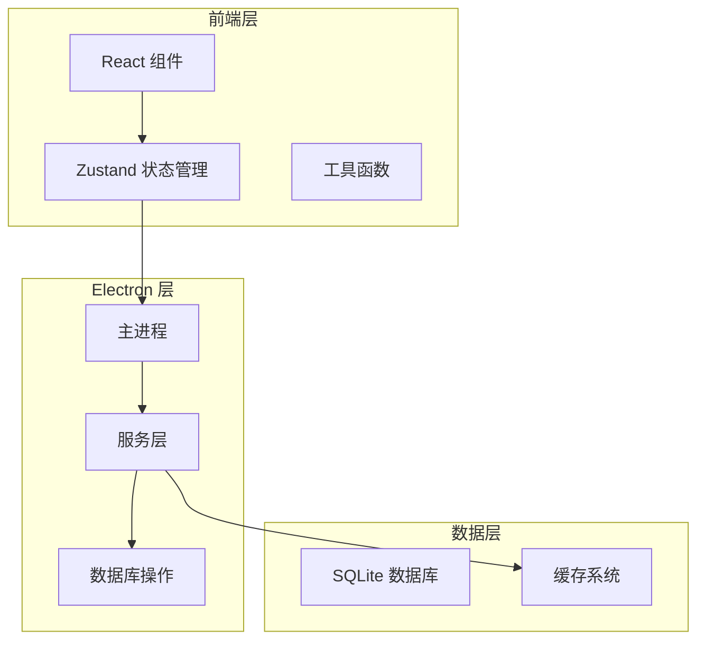

**图表来源**
- [AnalyticsPage.tsx:1-189](file://src/pages/AnalyticsPage.tsx#L1-L189)
- [analyticsStore.ts:1-71](file://src/stores/analyticsStore.ts#L1-L71)
- [main.ts:2428-2460](file://electron/main.ts#L2428-L2460)

**章节来源**
- [AnalyticsPage.tsx:1-189](file://src/pages/AnalyticsPage.tsx#L1-L189)
- [GroupAnalyticsPage.tsx:1-537](file://src/pages/GroupAnalyticsPage.tsx#L1-L537)
- [analyticsStore.ts:1-71](file://src/stores/analyticsStore.ts#L1-L71)

## 核心组件

### 数据可视化架构

系统采用分层架构设计，确保数据处理、业务逻辑和界面展示的分离：

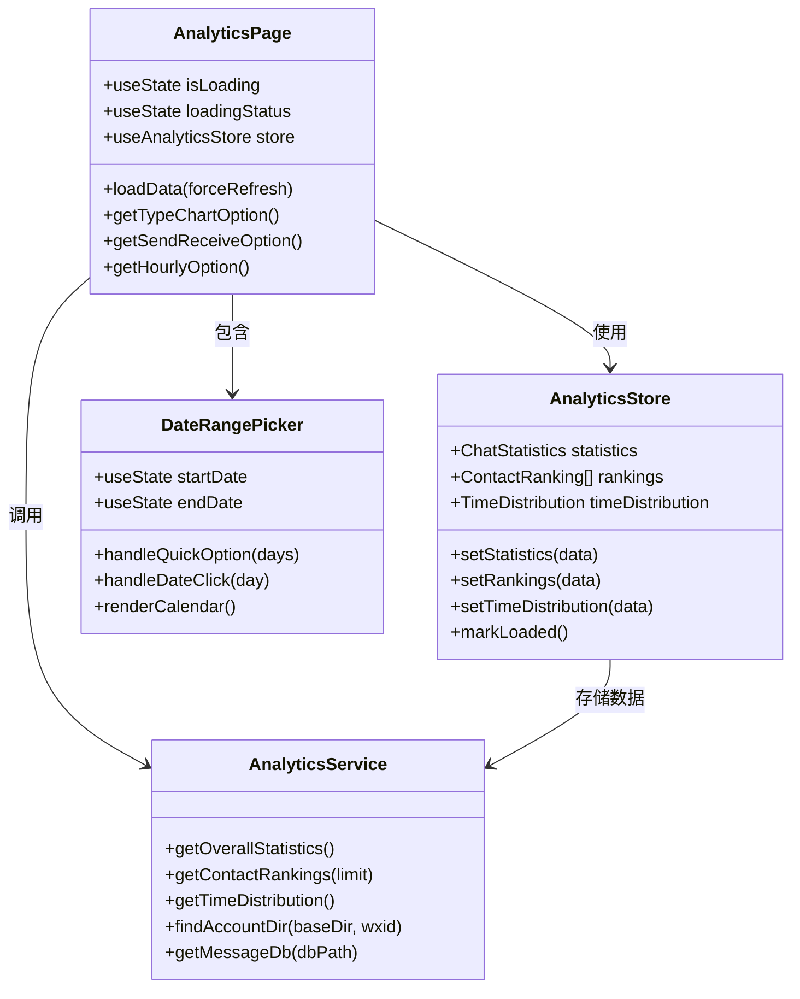

**图表来源**
- [AnalyticsPage.tsx:8-189](file://src/pages/AnalyticsPage.tsx#L8-L189)
- [analyticsStore.ts:34-71](file://src/stores/analyticsStore.ts#L34-L71)
- [analyticsService.ts:39-759](file://electron/services/analyticsService.ts#L39-L759)
- [DateRangePicker.tsx:26-240](file://src/components/DateRangePicker.tsx#L26-L240)

### ECharts 集成架构

系统使用 ECharts-for-React 库实现图表渲染，支持多种图表类型和交互功能：

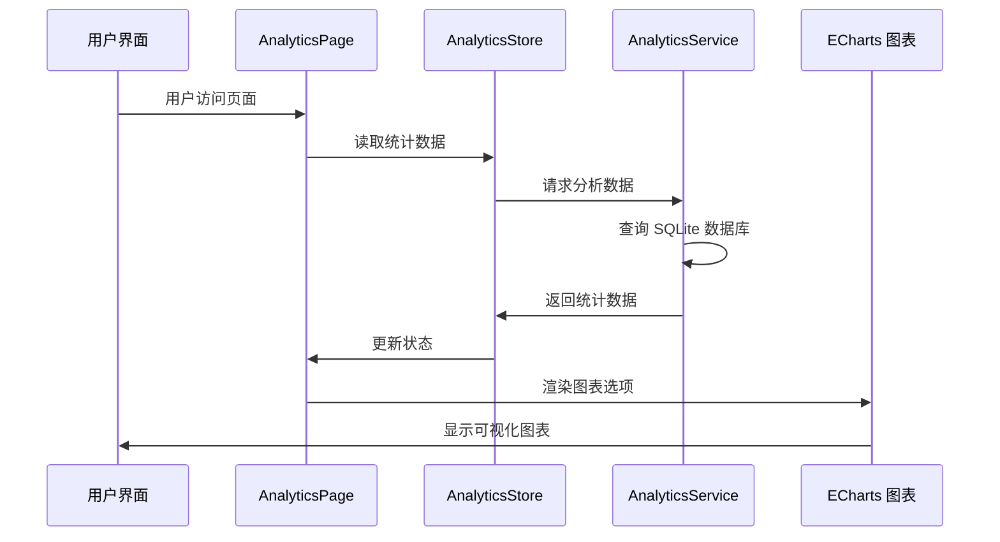

**图表来源**
- [AnalyticsPage.tsx:15-45](file://src/pages/AnalyticsPage.tsx#L15-L45)
- [analyticsService.ts:269-450](file://electron/services/analyticsService.ts#L269-L450)

**章节来源**
- [AnalyticsPage.tsx:63-100](file://src/pages/AnalyticsPage.tsx#L63-L100)
- [analyticsStore.ts:34-50](file://src/stores/analyticsStore.ts#L34-L50)
- [analyticsService.ts:39-759](file://electron/services/analyticsService.ts#L39-L759)

## 架构概览

### 数据流架构

系统采用异步数据流架构，确保良好的用户体验和性能表现：

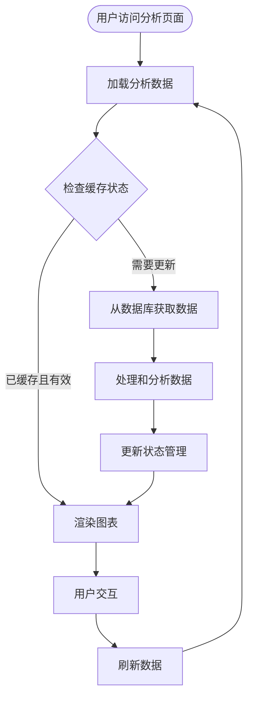

**图表来源**
- [AnalyticsPage.tsx:15-45](file://src/pages/AnalyticsPage.tsx#L15-L45)
- [analyticsStore.ts:52-70](file://src/stores/analyticsStore.ts#L52-L70)

### 图表组件设计

系统提供了多种图表组件，每种都有特定的功能和用途：

| 图表类型 | 数据源 | 配置选项 | 用途 |
|---------|--------|----------|------|
| 饼图 | 消息类型分布 | 半径、标签、颜色 | 显示不同类型消息的比例 |
| 柱状图 | 每小时消息分布 | 坐标轴、系列、样式 | 展示消息的时间分布模式 |
| 排行榜 | 联系人排名 | 排名、头像、统计信息 | 显示最活跃的联系人 |

**章节来源**
- [AnalyticsPage.tsx:63-100](file://src/pages/AnalyticsPage.tsx#L63-L100)
- [GroupAnalyticsPage.tsx:181-235](file://src/pages/GroupAnalyticsPage.tsx#L181-L235)

## 详细组件分析

### 私聊分析页面

私聊分析页面是系统的核心组件，提供了全面的消息分析功能：

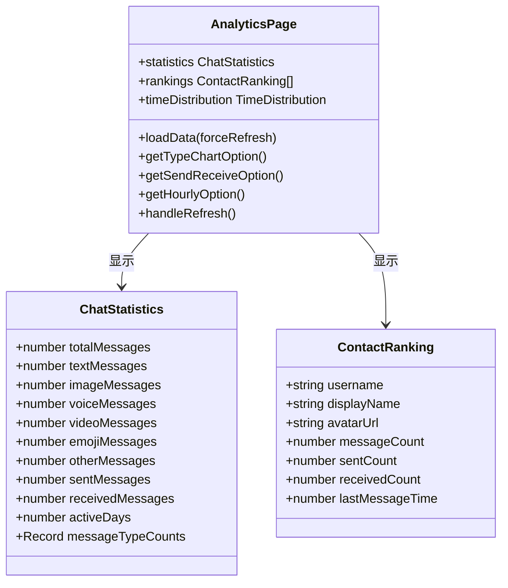

**图表来源**
- [AnalyticsPage.tsx:8-189](file://src/pages/AnalyticsPage.tsx#L8-L189)
- [analytics.ts:3-36](file://src/types/analytics.ts#L3-L36)

#### 数据处理流程

系统通过以下步骤处理和分析聊天数据：

1. **数据收集**：从 SQLite 数据库中提取消息数据
2. **数据清洗**：过滤群聊、公众号等非私聊会话
3. **统计计算**：计算各种统计指标和分布
4. **数据转换**：将原始数据转换为图表友好的格式
5. **缓存存储**：将结果存储在状态管理中

**章节来源**
- [AnalyticsPage.tsx:15-45](file://src/pages/AnalyticsPage.tsx#L15-L45)
- [analyticsService.ts:269-450](file://electron/services/analyticsService.ts#L269-L450)

### 群聊分析页面

群聊分析页面提供了更复杂的分析功能，支持多维度的数据探索：

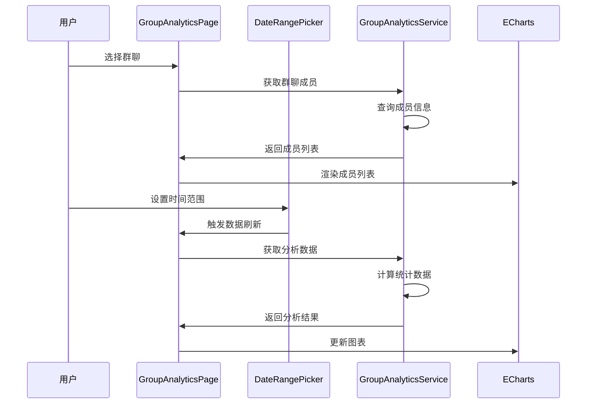

**图表来源**
- [GroupAnalyticsPage.tsx:132-174](file://src/pages/GroupAnalyticsPage.tsx#L132-L174)
- [DateRangePicker.tsx:60-93](file://src/components/DateRangePicker.tsx#L60-L93)

#### 群聊分析功能

系统支持以下群聊分析功能：

| 功能 | 描述 | 数据源 | 输出格式 |
|------|------|--------|----------|
| 群成员查看 | 显示群聊所有成员信息 | contact.db | 成员列表卡片 |
| 发言排行 | 按消息数量排序群成员 | Msg_* 表 | 排行榜列表 |
| 活跃时段 | 显示群聊消息时间分布 | Msg_* 表 | 柱状图 |
| 媒体统计 | 统计不同类型媒体内容 | Msg_* 表 | 饼图 + 详情表 |

**章节来源**
- [GroupAnalyticsPage.tsx:132-174](file://src/pages/GroupAnalyticsPage.tsx#L132-L174)
- [groupAnalyticsService.ts:423-531](file://electron/services/groupAnalyticsService.ts#L423-L531)

### ECharts 图表配置

系统使用 ECharts 提供丰富的图表配置选项：

#### 饼图配置（消息类型分布）

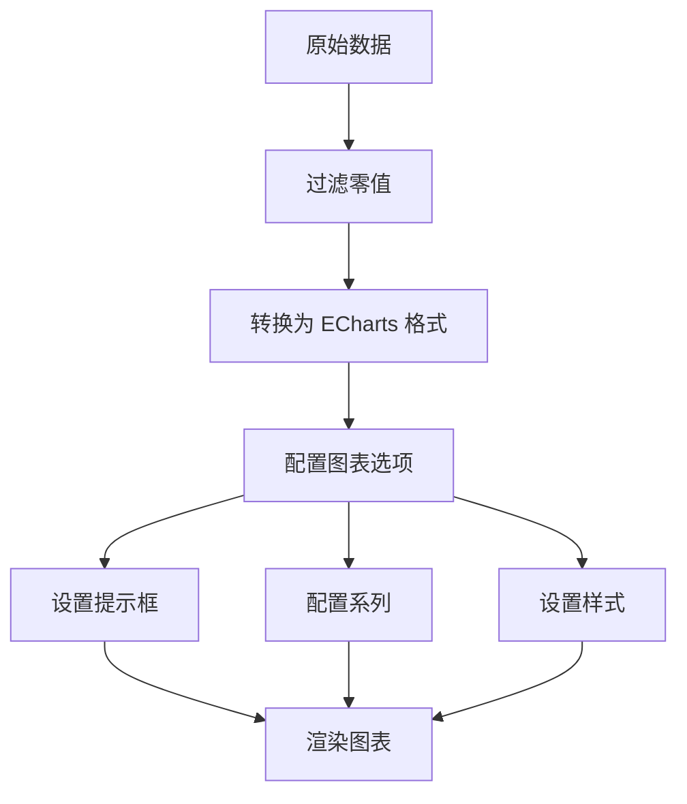

**图表来源**
- [AnalyticsPage.tsx:63-77](file://src/pages/AnalyticsPage.tsx#L63-L77)

#### 柱状图配置（时间分布）

系统使用柱状图展示消息的时间分布特征：

| 配置项 | 值 | 说明 |
|--------|----|------|
| 图表类型 | bar | 柱状图 |
| 坐标轴类型 | category/value | 分类/数值坐标轴 |
| 数据点 | 24个 | 每小时的消息数量 |
| 样式 | 绿色渐变 | 代表积极的沟通氛围 |
| 圆角 | 4px | 现代化的视觉效果 |

**章节来源**
- [AnalyticsPage.tsx:90-100](file://src/pages/AnalyticsPage.tsx#L90-L100)
- [GroupAnalyticsPage.tsx:181-189](file://src/pages/GroupAnalyticsPage.tsx#L181-L189)

## 依赖关系分析

### 组件依赖图

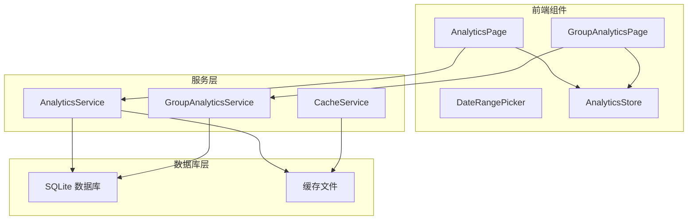

**图表来源**
- [main.ts:2428-2460](file://electron/main.ts#L2428-L2460)
- [analyticsService.ts:41-42](file://electron/services/analyticsService.ts#L41-L42)
- [cacheService.ts:6-7](file://electron/services/cacheService.ts#L6-L7)

### 数据流依赖

系统采用事件驱动的数据流架构：

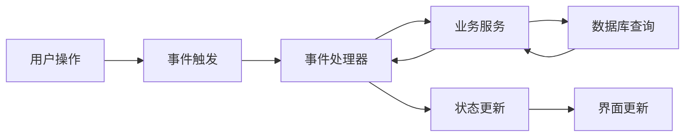

**图表来源**
- [AnalyticsPage.tsx:15-45](file://src/pages/AnalyticsPage.tsx#L15-L45)
- [GroupAnalyticsPage.tsx:138-174](file://src/pages/GroupAnalyticsPage.tsx#L138-L174)

**章节来源**
- [main.ts:2428-2460](file://electron/main.ts#L2428-L2460)
- [analyticsStore.ts:52-70](file://src/stores/analyticsStore.ts#L52-L70)

## 性能考虑

### 缓存策略

系统实现了多层次的缓存机制来优化性能：

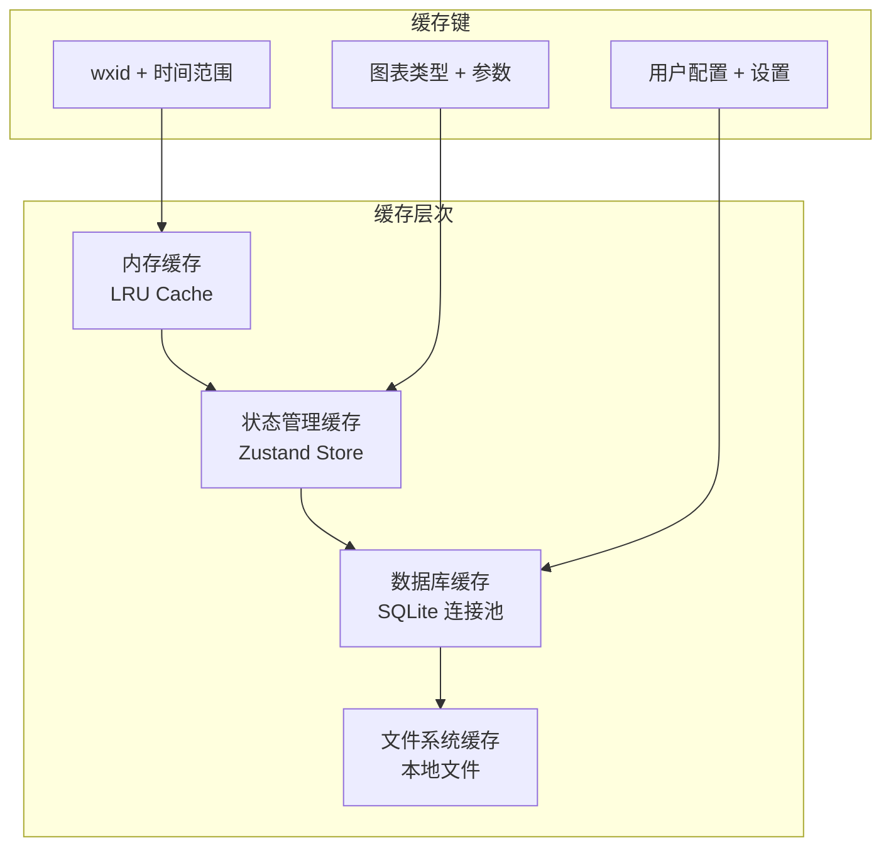

**图表来源**
- [lruCache.ts:5-51](file://src/utils/lruCache.ts#L5-L51)
- [analyticsStore.ts:52-70](file://src/stores/analyticsStore.ts#L52-L70)

### 数据库优化

系统通过以下方式优化数据库查询性能：

1. **连接池管理**：复用 SQLite 数据库连接
2. **索引优化**：合理使用数据库索引
3. **查询优化**：优化 SQL 查询语句
4. **批量处理**：批量处理数据以减少 I/O 操作

**章节来源**
- [analyticsService.ts:41-42](file://electron/services/analyticsService.ts#L41-L42)
- [cacheService.ts:112-191](file://electron/services/cacheService.ts#L112-L191)

## 故障排除指南

### 常见问题及解决方案

| 问题类型 | 症状 | 可能原因 | 解决方案 |
|----------|------|----------|----------|
| 数据加载失败 | 页面空白或错误提示 | 数据库文件损坏 | 清理缓存并重新加载 |
| 图表显示异常 | 图表不显示或显示错误 | ECharts 初始化失败 | 检查网络连接和依赖库 |
| 性能问题 | 页面响应缓慢 | 数据量过大 | 实施分页加载和懒加载 |
| 权限错误 | 无法访问数据库 | 文件权限不足 | 检查文件系统权限 |

### 错误处理机制

系统实现了完善的错误处理机制：

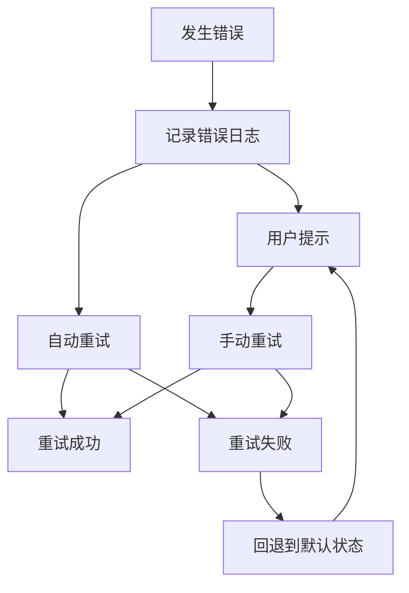

**图表来源**
- [AnalyticsPage.tsx:102-108](file://src/pages/AnalyticsPage.tsx#L102-L108)
- [GroupAnalyticsPage.tsx:169-171](file://src/pages/GroupAnalyticsPage.tsx#L169-L171)

**章节来源**
- [AnalyticsPage.tsx:102-108](file://src/pages/AnalyticsPage.tsx#L102-L108)
- [GroupAnalyticsPage.tsx:169-171](file://src/pages/GroupAnalyticsPage.tsx#L169-L171)

## 结论

CipherTalk 的数据可视化分析功能通过精心设计的架构和高效的实现，为用户提供了强大的数据分析能力。系统的主要优势包括：

1. **模块化设计**：清晰的分层架构便于维护和扩展
2. **高性能优化**：多级缓存和数据库优化确保流畅体验
3. **丰富的可视化**：多样化的图表类型满足不同分析需求
4. **用户友好**：直观的界面设计和交互体验

未来可以考虑的功能扩展包括：
- 更高级的机器学习分析算法
- 实时数据更新功能
- 导出和分享机制
- 更多的图表类型和自定义选项

该系统为数据分析师和前端开发者提供了优秀的参考实现，展示了如何在 Electron 应用中集成复杂的数据可视化功能。