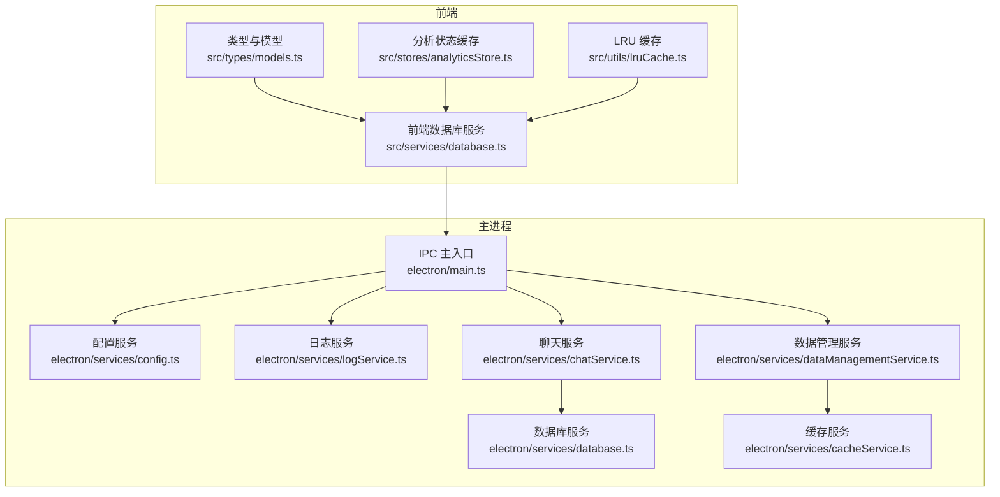
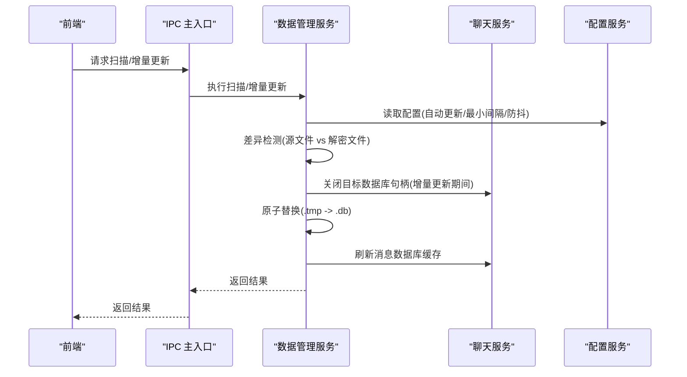
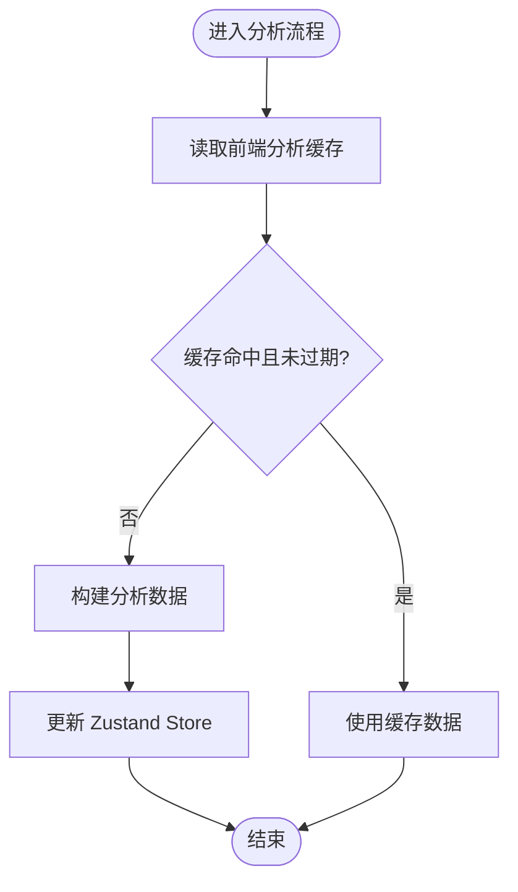
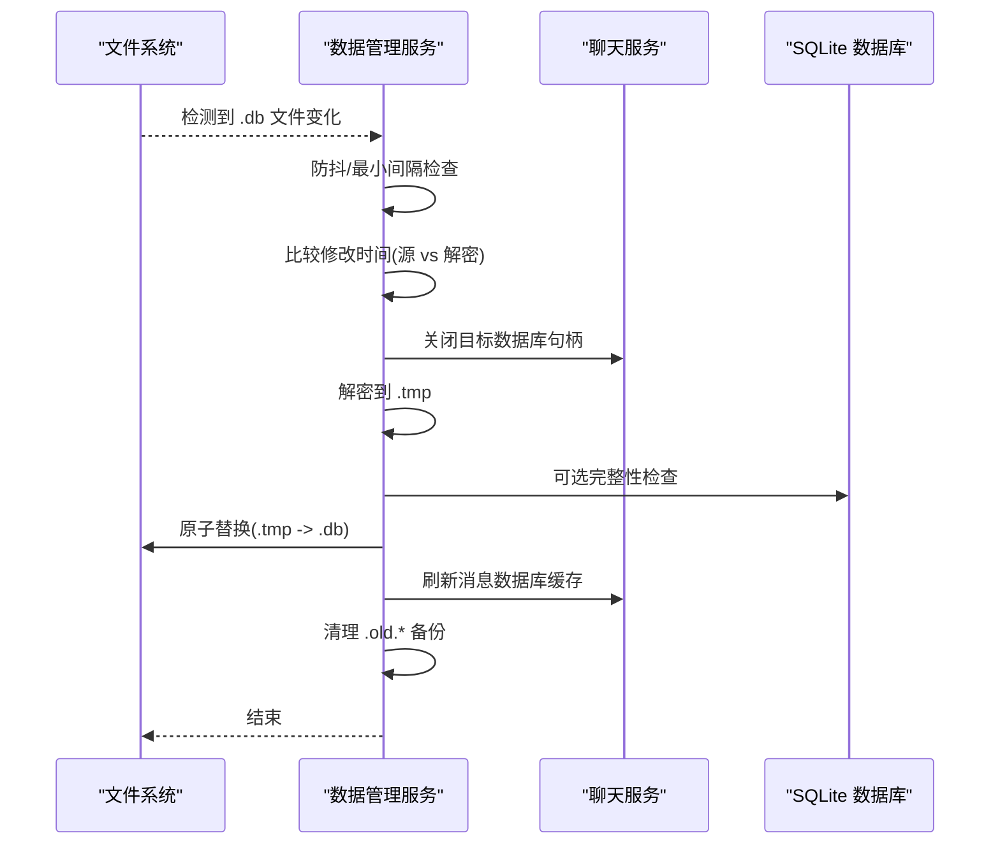
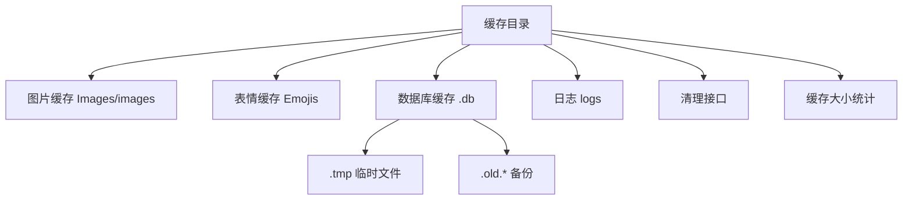
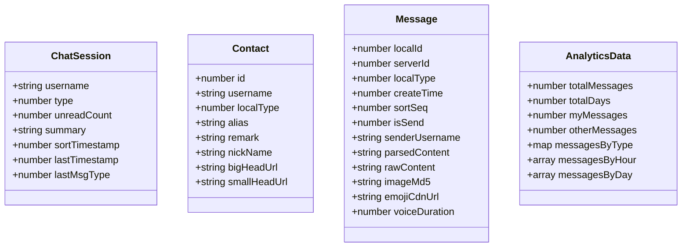
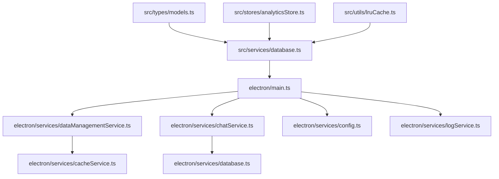

# 数据存储策略

<cite>
**本文引用的文件**
- [cacheService.ts](file://electron/services/cacheService.ts)
- [database.ts](file://electron/services/database.ts)
- [database.ts](file://src/services/database.ts)
- [dataManagementService.ts](file://electron/services/dataManagementService.ts)
- [chatService.ts](file://electron/services/chatService.ts)
- [config.ts](file://electron/services/config.ts)
- [models.ts](file://src/types/models.ts)
- [analyticsStore.ts](file://src/stores/analyticsStore.ts)
- [lruCache.ts](file://src/utils/lruCache.ts)
- [logService.ts](file://electron/services/logService.ts)
- [main.ts](file://electron/main.ts)
</cite>

## 目录
1. [简介](#简介)
2. [项目结构](#项目结构)
3. [核心组件](#核心组件)
4. [架构总览](#架构总览)
5. [详细组件分析](#详细组件分析)
6. [依赖关系分析](#依赖关系分析)
7. [性能考量](#性能考量)
8. [故障排查指南](#故障排查指南)
9. [结论](#结论)
10. [附录](#附录)

## 简介
本文件面向后端开发者与数据工程师，系统性梳理 CipherTalk 的数据可视化数据存储策略，覆盖以下关键主题：
- 分析结果缓存：缓存策略设计、过期机制、内存管理
- 增量更新机制：差异检测、部分刷新、性能优化
- 数据持久化：本地存储、临时缓存、清理策略
- 数据结构设计：分析数据模型、索引策略、查询优化
- 并发访问控制：锁机制、数据一致性、冲突解决
- 数据迁移与版本管理：向后兼容、数据升级、备份恢复
- 存储性能监控与优化方法

## 项目结构
围绕数据存储的关键模块包括：
- 电子端服务层：负责数据库解密、增量更新、缓存管理、配置持久化、日志与监控
- 前端服务层：封装 IPC 调用，提供数据库查询接口
- 类型与状态：定义消息、联系人、会话与分析数据模型，以及分析状态缓存
- 工具与缓存：LRU 缓存与通用工具

**图表来源**
- [main.ts](file://electron/main.ts)
- [config.ts](file://electron/services/config.ts)
- [logService.ts](file://electron/services/logService.ts)
- [dataManagementService.ts](file://electron/services/dataManagementService.ts)
- [chatService.ts](file://electron/services/chatService.ts)
- [database.ts](file://electron/services/database.ts)
- [cacheService.ts](file://electron/services/cacheService.ts)
- [database.ts](file://src/services/database.ts)
- [models.ts](file://src/types/models.ts)
- [analyticsStore.ts](file://src/stores/analyticsStore.ts)
- [lruCache.ts](file://src/utils/lruCache.ts)

**章节来源**
- [main.ts](file://electron/main.ts)
- [config.ts](file://electron/services/config.ts)
- [logService.ts](file://electron/services/logService.ts)
- [dataManagementService.ts](file://electron/services/dataManagementService.ts)
- [chatService.ts](file://electron/services/chatService.ts)
- [database.ts](file://electron/services/database.ts)
- [cacheService.ts](file://electron/services/cacheService.ts)
- [database.ts](file://src/services/database.ts)
- [models.ts](file://src/types/models.ts)
- [analyticsStore.ts](file://src/stores/analyticsStore.ts)
- [lruCache.ts](file://src/utils/lruCache.ts)

## 核心组件
- 配置服务：基于 SQLite 的键值配置存储，支持默认值注入、字段迁移与 TLD 缓存表
- 数据管理服务：扫描数据库、增量更新、自动同步、备份恢复、缓存迁移
- 聊天服务：数据库连接与缓存、消息表定位、预编译语句缓存、增量游标
- 数据库服务：轻量 SQLite 访问封装
- 缓存服务：图片/表情/数据库/日志缓存的统一管理与清理
- 前端数据库服务：封装 IPC 查询、消息解析与搜索
- 类型与状态：消息、联系人、会话与分析数据模型；分析状态缓存 Store
- 工具与缓存：LRU 缓存实现

**章节来源**
- [config.ts](file://electron/services/config.ts)
- [dataManagementService.ts](file://electron/services/dataManagementService.ts)
- [chatService.ts](file://electron/services/chatService.ts)
- [database.ts](file://electron/services/database.ts)
- [cacheService.ts](file://electron/services/cacheService.ts)
- [database.ts](file://src/services/database.ts)
- [models.ts](file://src/types/models.ts)
- [analyticsStore.ts](file://src/stores/analyticsStore.ts)
- [lruCache.ts](file://src/utils/lruCache.ts)

## 架构总览
整体采用“前端服务层 + 主进程服务层”的分层架构：
- 前端通过 IPC 调用主进程数据库服务，主进程负责实际的数据库操作与缓存管理
- 数据管理服务负责增量更新与自动同步，确保解密后的数据库与源数据库保持一致
- 聊天服务维护多级缓存（会话表、消息表、预编译语句、头像等），提升查询性能
- 配置服务提供持久化配置与迁移能力，日志服务提供分级日志与轮转

**图表来源**
- [main.ts](file://electron/main.ts)
- [dataManagementService.ts](file://electron/services/dataManagementService.ts)
- [chatService.ts](file://electron/services/chatService.ts)
- [config.ts](file://electron/services/config.ts)

## 详细组件分析

### 分析结果缓存：策略、过期与内存管理
- 缓存策略
  - 前端分析状态缓存：使用 Zustand Store 存储统计、排行、时间分布等分析结果，并提供 clearCache 清空接口
  - 聊天服务缓存：会话表缓存、消息数据库文件集合、预编译语句缓存、联系人列信息缓存、头像 Base64 缓存
  - LRU 缓存：提供通用 LRU 实现，可用于限制内存中缓存对象数量，防止内存泄漏
- 过期机制
  - 会话表缓存设置固定过期时间（毫秒级），到期后清空并重新构建
  - 增量更新后主动清空相关缓存，确保后续查询获取最新数据
- 内存管理
  - 显式关闭数据库连接与缓存清理，避免句柄泄漏
  - LRU 缓存按容量上限淘汰最久未使用项

**图表来源**
- [analyticsStore.ts](file://src/stores/analyticsStore.ts)
- [chatService.ts](file://electron/services/chatService.ts)
- [lruCache.ts](file://src/utils/lruCache.ts)

**章节来源**
- [analyticsStore.ts](file://src/stores/analyticsStore.ts)
- [chatService.ts](file://electron/services/chatService.ts)
- [lruCache.ts](file://src/utils/lruCache.ts)

### 增量更新机制：差异检测、部分刷新与性能优化
- 差异检测
  - 基于源文件与解密文件的修改时间比较，判断是否需要更新
  - 对 FTS 数据库可选择跳过完整性检查
- 部分刷新
  - 仅对变更的数据库文件执行解密与替换，避免全量重建
  - 增量更新期间关闭目标数据库句柄，降低锁竞争
- 性能优化
  - 防抖与最小更新间隔：通过配置项控制检查频率与最小间隔，避免频繁触发
  - 原子替换：先写入 .tmp，校验通过后 rename 替换，保证一致性
  - sns.db 特殊合并：将旧备份中缺失但新库不存在的记录合并，避免数据丢失
  - 中断恢复：清理残留 .tmp 与 .old.* 备份，保障一致性

**图表来源**
- [dataManagementService.ts](file://electron/services/dataManagementService.ts)
- [chatService.ts](file://electron/services/chatService.ts)

**章节来源**
- [dataManagementService.ts](file://electron/services/dataManagementService.ts)
- [chatService.ts](file://electron/services/chatService.ts)

### 数据持久化：本地存储、临时缓存与清理策略
- 本地存储
  - 配置持久化：基于 SQLite 的键值存储，支持默认值注入与字段迁移
  - 日志持久化：按日期轮转，限制文件数量与大小
- 临时缓存
  - 增量更新使用 .tmp 作为临时文件，校验通过后替换
  - .old.* 作为备份，异常时可恢复
- 清理策略
  - 统一缓存目录：图片、表情、数据库、日志分目录管理
  - 清理接口：按类别清理（图片、表情、数据库、全部）、清理配置、计算缓存大小
  - 迁移缓存：支持从旧路径迁移到新路径

**图表来源**
- [cacheService.ts](file://electron/services/cacheService.ts)
- [logService.ts](file://electron/services/logService.ts)
- [config.ts](file://electron/services/config.ts)

**章节来源**
- [cacheService.ts](file://electron/services/cacheService.ts)
- [logService.ts](file://electron/services/logService.ts)
- [config.ts](file://electron/services/config.ts)

### 数据结构设计：模型、索引与查询优化
- 数据模型
  - 会话、联系人、消息、分析数据等模型定义清晰，便于前后端协作
  - 消息模型包含多种媒体类型字段，便于解析与展示
- 索引与查询优化
  - 聊天服务维护预编译语句缓存，避免重复编译带来的开销
  - 会话表缓存与消息数据库文件集合缓存，减少扫描与查找成本
  - 增量游标（按会话维护最大 sortSeq）支持增量查询

**图表来源**
- [models.ts](file://src/types/models.ts)

**章节来源**
- [models.ts](file://src/types/models.ts)
- [chatService.ts](file://electron/services/chatService.ts)

### 并发访问控制：锁机制、一致性与冲突解决
- 锁机制
  - 增量更新期间显式关闭目标数据库句柄，避免文件占用与锁冲突
  - 通过 .tmp 与 .old.* 的原子替换，确保替换过程的一致性
- 数据一致性
  - 完整性检查（可配置跳过）与 sns.db 合并逻辑，降低数据丢失风险
  - 增量更新后刷新缓存，确保后续查询获取最新数据
- 冲突解决
  - 中断恢复：清理残留 .tmp 与 .old.*，必要时从备份恢复
  - 防抖与最小间隔：避免频繁触发导致的资源争用

**章节来源**
- [dataManagementService.ts](file://electron/services/dataManagementService.ts)
- [chatService.ts](file://electron/services/chatService.ts)

### 数据迁移与版本管理：兼容、升级与备份恢复
- 向后兼容
  - 配置迁移：STT 语言配置修复、AI 配置结构迁移、baseUrl -> baseURL 字段迁移
  - 路径兼容：支持多种缓存目录布局与旧路径兼容
- 数据升级
  - 增量更新与自动同步：检测源数据库变化，按需升级解密缓存
  - sns.db 合并：保留旧数据，避免因隐私设置导致的历史数据丢失
- 备份恢复
  - 原子替换前生成 .old.* 备份，替换失败时可恢复
  - 中断恢复：启动时清理残留 .tmp 与 .old.*

**章节来源**
- [config.ts](file://electron/services/config.ts)
- [dataManagementService.ts](file://electron/services/dataManagementService.ts)

### 存储性能监控与优化方法
- 监控
  - 日志分级与轮转：按级别输出，限制文件大小与数量
  - 缓存大小统计：支持按类别统计缓存占用，辅助容量规划
- 优化
  - 预编译语句缓存与会话表缓存：减少重复编译与扫描
  - LRU 缓存：限制内存占用，避免内存泄漏
  - 增量更新与最小间隔：降低 I/O 与 CPU 占用
  - 防抖：避免频繁触发导致的资源争用

**章节来源**
- [logService.ts](file://electron/services/logService.ts)
- [cacheService.ts](file://electron/services/cacheService.ts)
- [chatService.ts](file://electron/services/chatService.ts)
- [lruCache.ts](file://src/utils/lruCache.ts)

## 依赖关系分析

**图表来源**
- [main.ts](file://electron/main.ts)
- [dataManagementService.ts](file://electron/services/dataManagementService.ts)
- [chatService.ts](file://electron/services/chatService.ts)
- [config.ts](file://electron/services/config.ts)
- [logService.ts](file://electron/services/logService.ts)
- [cacheService.ts](file://electron/services/cacheService.ts)
- [database.ts](file://electron/services/database.ts)
- [database.ts](file://src/services/database.ts)
- [models.ts](file://src/types/models.ts)
- [analyticsStore.ts](file://src/stores/analyticsStore.ts)
- [lruCache.ts](file://src/utils/lruCache.ts)

**章节来源**
- [main.ts](file://electron/main.ts)
- [dataManagementService.ts](file://electron/services/dataManagementService.ts)
- [chatService.ts](file://electron/services/chatService.ts)
- [config.ts](file://electron/services/config.ts)
- [logService.ts](file://electron/services/logService.ts)
- [cacheService.ts](file://electron/services/cacheService.ts)
- [database.ts](file://electron/services/database.ts)
- [database.ts](file://src/services/database.ts)
- [models.ts](file://src/types/models.ts)
- [analyticsStore.ts](file://src/stores/analyticsStore.ts)
- [lruCache.ts](file://src/utils/lruCache.ts)

## 性能考量
- I/O 与 CPU
  - 增量更新与最小间隔配置有效降低 I/O 与 CPU 占用
  - 预编译语句与缓存减少重复工作
- 内存
  - LRU 缓存限制内存占用，避免长期运行导致的内存泄漏
- 并发
  - 增量更新期间关闭目标数据库句柄，减少锁竞争
  - 防抖与最小间隔避免频繁触发

[本节为通用性能讨论，不直接分析具体文件]

## 故障排查指南
- 增量更新失败
  - 检查源文件可读性与完整性，确认 .tmp 写入与 .old.* 备份状态
  - 查看日志级别与轮转情况，定位异常原因
- 缓存清理无效
  - 确认缓存目录路径与兼容路径，检查权限与占用
  - 使用缓存大小统计接口核对清理效果
- 配置异常
  - 检查配置数据库初始化与迁移是否成功
  - 通过配置服务接口读取与设置关键配置项

**章节来源**
- [dataManagementService.ts](file://electron/services/dataManagementService.ts)
- [cacheService.ts](file://electron/services/cacheService.ts)
- [logService.ts](file://electron/services/logService.ts)
- [config.ts](file://electron/services/config.ts)

## 结论
CipherTalk 的数据存储策略以“增量更新 + 多级缓存 + 配置持久化”为核心，结合严格的原子替换与备份恢复机制，确保在复杂场景下的数据一致性与性能表现。通过前端分析缓存、聊天服务缓存与 LRU 缓存的协同，系统在可用性与资源占用之间取得平衡。建议在生产环境中合理配置自动更新参数与日志级别，并定期清理缓存以维持最佳性能。

[本节为总结性内容，不直接分析具体文件]

## 附录
- IPC 接口示例（与缓存与数据管理相关）
  - 清除所有缓存、清除配置、获取缓存大小、执行增量更新等
- 前端数据库服务接口
  - 会话列表、联系人、消息查询与搜索、消息计数等

**章节来源**
- [main.ts](file://electron/main.ts)
- [database.ts](file://src/services/database.ts)