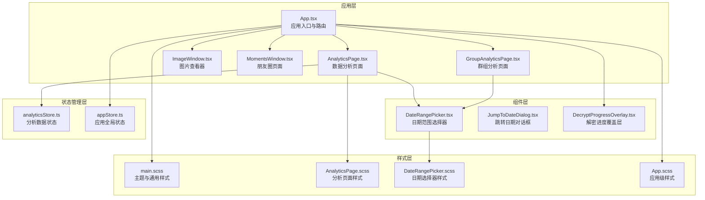
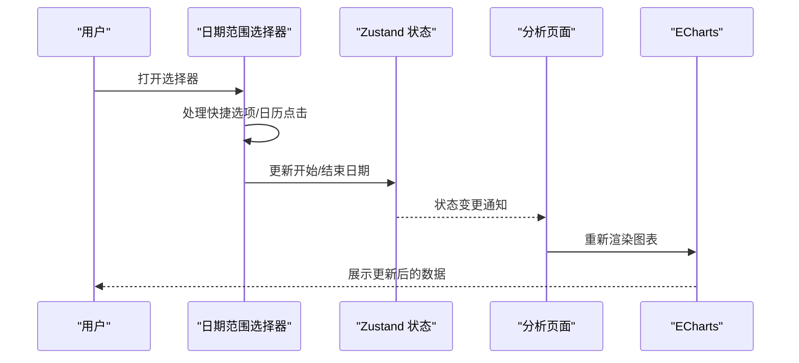
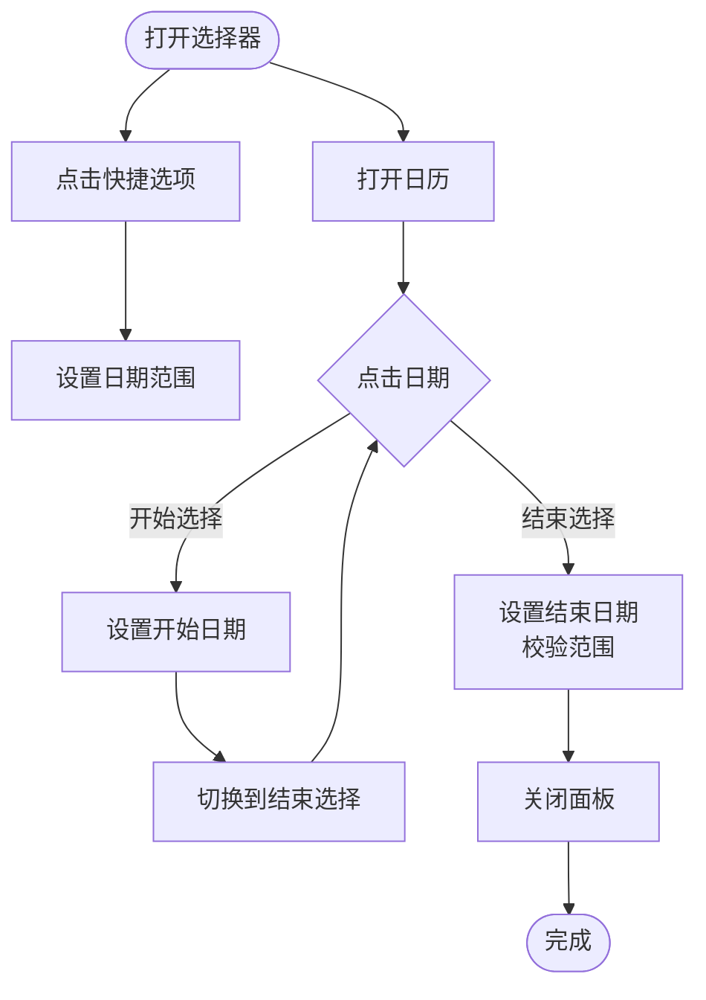
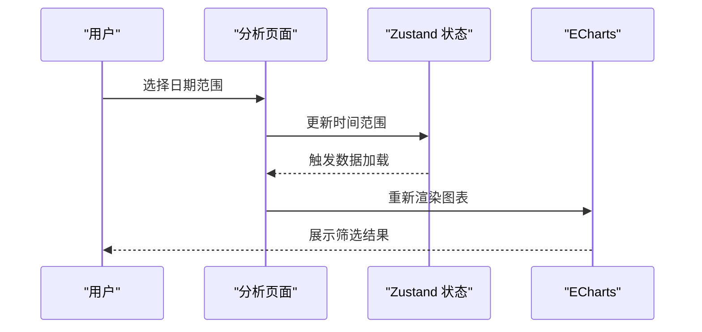
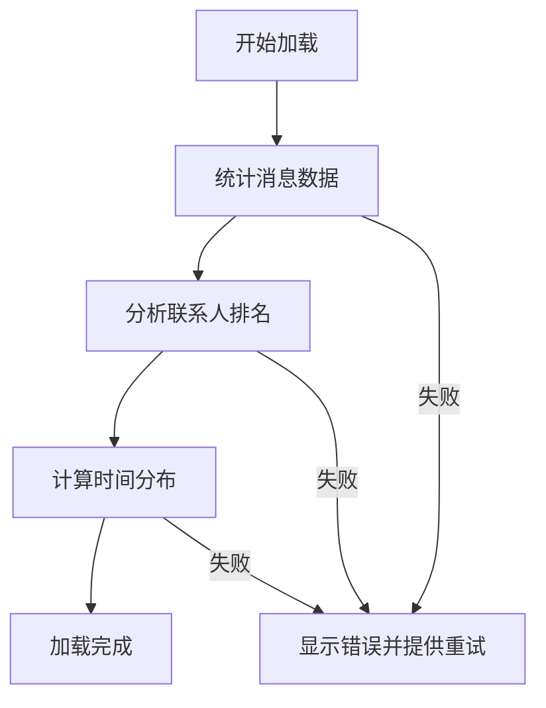
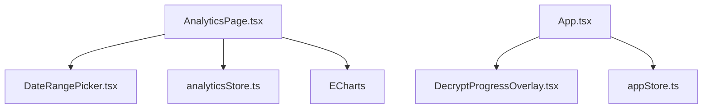

# 用户交互设计

<cite>
**本文档引用的文件**
- [src/components/DateRangePicker.tsx](file://src/components/DateRangePicker.tsx)
- [src/components/DateRangePicker.scss](file://src/components/DateRangePicker.scss)
- [src/pages/AnalyticsPage.tsx](file://src/pages/AnalyticsPage.tsx)
- [src/stores/analyticsStore.ts](file://src/stores/analyticsStore.ts)
- [src/components/JumpToDateDialog.tsx](file://src/components/JumpToDateDialog.tsx)
- [src/components/DecryptProgressOverlay.tsx](file://src/components/DecryptProgressOverlay.tsx)
- [src/stores/appStore.ts](file://src/stores/appStore.ts)
- [src/App.tsx](file://src/App.tsx)
- [src/styles/main.scss](file://src/styles/main.scss)
- [src/pages/AnalyticsPage.scss](file://src/pages/AnalyticsPage.scss)
- [src/App.scss](file://src/App.scss)
- [src/pages/GroupAnalyticsPage.tsx](file://src/pages/GroupAnalyticsPage.tsx)
- [src/pages/ImageWindow.tsx](file://src/pages/ImageWindow.tsx)
- [src/pages/MomentsWindow.tsx](file://src/pages/MomentsWindow.tsx)
</cite>

## 目录
1. [引言](#引言)
2. [项目结构](#项目结构)
3. [核心组件](#核心组件)
4. [架构概览](#架构概览)
5. [详细组件分析](#详细组件分析)
6. [依赖关系分析](#依赖关系分析)
7. [性能考虑](#性能考虑)
8. [故障排除指南](#故障排除指南)
9. [结论](#结论)
10. [附录](#附录)

## 引言
本文件为 CipherTalk 数据可视化用户交互设计的专业技术文档，面向 UX/UI 设计师与前端开发者。文档围绕以下目标展开：
- 交互设计理念：直观性、响应性、可访问性
- 日期范围选择器：时间选择逻辑、范围验证、默认值设置
- 图表交互功能：点击钻取、悬停提示、缩放平移、数据筛选
- 用户反馈机制：加载状态显示、错误处理、进度指示
- 响应式设计：不同屏幕尺寸适配、移动端优化、触摸交互
- 无障碍访问支持：键盘导航、屏幕阅读器兼容、高对比度模式
- 交互原型设计与用户体验优化建议

## 项目结构
CipherTalk 采用 React + Electron 架构，前端使用 TypeScript 和 SCSS 进行开发。数据可视化主要集中在分析页面，使用 ECharts 进行图表渲染，配合自定义日期选择器与全局状态管理。

**图表来源**
- [src/App.tsx:1-538](file://src/App.tsx#L1-L538)
- [src/pages/AnalyticsPage.tsx:1-189](file://src/pages/AnalyticsPage.tsx#L1-L189)
- [src/pages/GroupAnalyticsPage.tsx:74-485](file://src/pages/GroupAnalyticsPage.tsx#L74-L485)
- [src/pages/ImageWindow.tsx:292-362](file://src/pages/ImageWindow.tsx#L292-L362)
- [src/pages/MomentsWindow.tsx:1578-1594](file://src/pages/MomentsWindow.tsx#L1578-L1594)
- [src/components/DateRangePicker.tsx:1-240](file://src/components/DateRangePicker.tsx#L1-L240)
- [src/components/JumpToDateDialog.tsx:1-180](file://src/components/JumpToDateDialog.tsx#L1-L180)
- [src/components/DecryptProgressOverlay.tsx:1-56](file://src/components/DecryptProgressOverlay.tsx#L1-L56)
- [src/stores/analyticsStore.ts:1-71](file://src/stores/analyticsStore.ts#L1-L71)
- [src/stores/appStore.ts:1-97](file://src/stores/appStore.ts#L1-L97)
- [src/styles/main.scss:1-427](file://src/styles/main.scss#L1-L427)
- [src/pages/AnalyticsPage.scss:1-264](file://src/pages/AnalyticsPage.scss#L1-L264)
- [src/components/DateRangePicker.scss:1-213](file://src/components/DateRangePicker.scss#L1-L213)
- [src/App.scss:1-317](file://src/App.scss#L1-L317)

**章节来源**
- [src/App.tsx:1-538](file://src/App.tsx#L1-L538)
- [src/styles/main.scss:1-427](file://src/styles/main.scss#L1-L427)

## 核心组件
本节聚焦于与数据可视化交互直接相关的核心组件，包括日期范围选择器、图表页面、状态管理与反馈机制。

- 日期范围选择器：提供快速选项、日历选择、范围验证与面板定位逻辑
- 分析页面：加载状态、错误处理、图表渲染与数据格式化
- 状态管理：分析数据与应用全局状态的集中管理
- 反馈机制：解密进度覆盖层、下载进度胶囊、加载动画与错误提示

**章节来源**
- [src/components/DateRangePicker.tsx:1-240](file://src/components/DateRangePicker.tsx#L1-L240)
- [src/pages/AnalyticsPage.tsx:1-189](file://src/pages/AnalyticsPage.tsx#L1-L189)
- [src/stores/analyticsStore.ts:1-71](file://src/stores/analyticsStore.ts#L1-L71)
- [src/components/DecryptProgressOverlay.tsx:1-56](file://src/components/DecryptProgressOverlay.tsx#L1-L56)

## 架构概览
数据可视化交互遵循以下架构原则：
- 组件化：每个交互元素独立封装，职责单一
- 状态驱动：通过 Zustand 管理分析数据与应用状态
- 视图渲染：ECharts 渲染图表，结合 React 组件实现交互
- 反馈闭环：加载、错误、进度状态统一管理与展示

**图表来源**
- [src/components/DateRangePicker.tsx:26-130](file://src/components/DateRangePicker.tsx#L26-L130)
- [src/pages/AnalyticsPage.tsx:15-45](file://src/pages/AnalyticsPage.tsx#L15-L45)
- [src/stores/analyticsStore.ts:52-70](file://src/stores/analyticsStore.ts#L52-L70)

## 详细组件分析

### 日期范围选择器设计与实现
- 交互理念
  - 直观性：清晰的日历网格、快速选项、今日高亮
  - 响应性：面板自动定位、点击外部关闭、即时状态更新
  - 可访问性：键盘可聚焦、禁用态明确、颜色对比度满足要求
- 时间选择逻辑
  - 快捷选项：支持“今天”、“最近7天/30天/90天/一年”、“全部时间”
  - 日历选择：单击选择开始/结束日期，自动校验范围合法性
  - 范围验证：结束日期不能早于开始日期，清空无效范围
  - 默认值设置：无输入时显示占位文本，支持一键清空
- 面板定位与样式
  - 根据触发按钮位置自动判断向上或向下展开
  - 使用 CSS 变量实现主题适配与高对比度支持

**图表来源**
- [src/components/DateRangePicker.tsx:60-130](file://src/components/DateRangePicker.tsx#L60-L130)
- [src/components/DateRangePicker.scss:53-213](file://src/components/DateRangePicker.scss#L53-L213)

**章节来源**
- [src/components/DateRangePicker.tsx:1-240](file://src/components/DateRangePicker.tsx#L1-L240)
- [src/components/DateRangePicker.scss:1-213](file://src/components/DateRangePicker.scss#L1-L213)

### 图表交互功能
- 点击钻取：通过日期范围联动，实现按时间粒度钻取
- 悬停提示：ECharts tooltip 提供数值与百分比信息
- 缩放平移：图片查看器支持滚轮缩放与拖拽平移
- 数据筛选：群组分析页面支持按群组与功能筛选

**图表来源**
- [src/pages/AnalyticsPage.tsx:15-45](file://src/pages/AnalyticsPage.tsx#L15-L45)
- [src/stores/analyticsStore.ts:52-70](file://src/stores/analyticsStore.ts#L52-L70)

**章节来源**
- [src/pages/AnalyticsPage.tsx:1-189](file://src/pages/AnalyticsPage.tsx#L1-L189)
- [src/pages/GroupAnalyticsPage.tsx:74-485](file://src/pages/GroupAnalyticsPage.tsx#L74-L485)
- [src/pages/ImageWindow.tsx:292-362](file://src/pages/ImageWindow.tsx#L292-L362)

### 用户反馈机制
- 加载状态显示：骨架屏与旋转动画，分步骤提示加载进度
- 错误处理：错误容器与重试按钮，捕获异常并展示
- 进度指示：解密进度覆盖层与下载进度胶囊，实时更新百分比

**图表来源**
- [src/pages/AnalyticsPage.tsx:15-45](file://src/pages/AnalyticsPage.tsx#L15-L45)
- [src/components/DecryptProgressOverlay.tsx:4-53](file://src/components/DecryptProgressOverlay.tsx#L4-L53)
- [src/App.tsx:522-532](file://src/App.tsx#L522-L532)

**章节来源**
- [src/pages/AnalyticsPage.tsx:1-189](file://src/pages/AnalyticsPage.tsx#L1-L189)
- [src/components/DecryptProgressOverlay.tsx:1-56](file://src/components/DecryptProgressOverlay.tsx#L1-L56)
- [src/App.tsx:1-538](file://src/App.tsx#L1-L538)

### 响应式设计
- 网格布局：统计卡片与图表卡片在不同屏幕宽度下自动换行
- 交互适配：日历网格与列表项在小屏设备上优化显示
- 主题系统：CSS 变量支持多主题与深色模式，提升可访问性

**图表来源**
- [src/pages/AnalyticsPage.scss:244-264](file://src/pages/AnalyticsPage.scss#L244-L264)
- [src/styles/main.scss:187-321](file://src/styles/main.scss#L187-L321)

**章节来源**
- [src/pages/AnalyticsPage.scss:1-264](file://src/pages/AnalyticsPage.scss#L1-L264)
- [src/styles/main.scss:1-427](file://src/styles/main.scss#L1-L427)

### 无障碍访问支持
- 键盘导航：按钮与交互元素具备可聚焦状态
- 屏幕阅读器兼容：语义化标签与清晰的文本描述
- 高对比度模式：主题变量与边框颜色满足 WCAG 对比度要求
- 禁用态与状态提示：禁用按钮与加载动画提供明确反馈

**章节来源**
- [src/components/DateRangePicker.scss:17-51](file://src/components/DateRangePicker.scss#L17-L51)
- [src/styles/main.scss:187-321](file://src/styles/main.scss#L187-L321)

## 依赖关系分析
- 组件耦合
  - 分析页面依赖日期选择器与状态管理，形成清晰的数据流向
  - 图片查看器与朋友圈页面分别实现独立的交互模式
- 状态管理
  - 分析数据通过 Zustand 管理，避免跨组件重复请求
  - 应用全局状态统一管理解密进度与下载进度
- 外部依赖
  - ECharts 用于图表渲染，提供丰富的交互能力
  - Electron API 用于系统级功能集成

**图表来源**
- [src/pages/AnalyticsPage.tsx:1-189](file://src/pages/AnalyticsPage.tsx#L1-L189)
- [src/components/DateRangePicker.tsx:1-240](file://src/components/DateRangePicker.tsx#L1-L240)
- [src/stores/analyticsStore.ts:1-71](file://src/stores/analyticsStore.ts#L1-L71)
- [src/App.tsx:1-538](file://src/App.tsx#L1-L538)
- [src/components/DecryptProgressOverlay.tsx:1-56](file://src/components/DecryptProgressOverlay.tsx#L1-L56)
- [src/stores/appStore.ts:1-97](file://src/stores/appStore.ts#L1-L97)

**章节来源**
- [src/pages/AnalyticsPage.tsx:1-189](file://src/pages/AnalyticsPage.tsx#L1-L189)
- [src/components/DateRangePicker.tsx:1-240](file://src/components/DateRangePicker.tsx#L1-L240)
- [src/stores/analyticsStore.ts:1-71](file://src/stores/analyticsStore.ts#L1-L71)
- [src/App.tsx:1-538](file://src/App.tsx#L1-L538)
- [src/components/DecryptProgressOverlay.tsx:1-56](file://src/components/DecryptProgressOverlay.tsx#L1-L56)
- [src/stores/appStore.ts:1-97](file://src/stores/appStore.ts#L1-L97)

## 性能考虑
- 图表渲染优化：按需加载与懒渲染，减少首屏压力
- 状态更新策略：批量更新与防抖，避免频繁重渲染
- 资源加载：解密进度与下载进度采用增量更新，降低阻塞
- 响应式布局：媒体查询与弹性布局，减少重排重绘

## 故障排除指南
- 加载失败
  - 检查网络与权限，确认错误信息并提供重试按钮
  - 查看控制台日志，定位具体错误来源
- 日期范围异常
  - 校验开始/结束日期边界，确保结束日期不早于开始日期
  - 清空无效范围并提示用户重新选择
- 图表无数据
  - 确认时间范围与数据源可用性，必要时扩大范围
  - 检查 ECharts 配置与数据格式

**章节来源**
- [src/pages/AnalyticsPage.tsx:102-108](file://src/pages/AnalyticsPage.tsx#L102-L108)
- [src/components/DateRangePicker.tsx:110-129](file://src/components/DateRangePicker.tsx#L110-L129)

## 结论
CipherTalk 的数据可视化交互设计以用户为中心，通过直观的日期选择、响应式的图表展示与完善的反馈机制，提供了流畅且可访问的用户体验。建议在后续迭代中进一步增强键盘导航与屏幕阅读器支持，并持续优化移动端交互细节。

## 附录
- 交互原型设计建议
  - 增加键盘快捷键：Enter 打开、Esc 关闭、方向键移动
  - 提供“回到今天”快捷按钮，简化常用操作
  - 在图表上增加“重置视图”按钮，便于用户恢复默认状态
- 用户体验优化建议
  - 增加加载骨架屏，改善感知性能
  - 优化错误提示文案，提供具体解决方案
  - 增强高对比度主题的视觉一致性