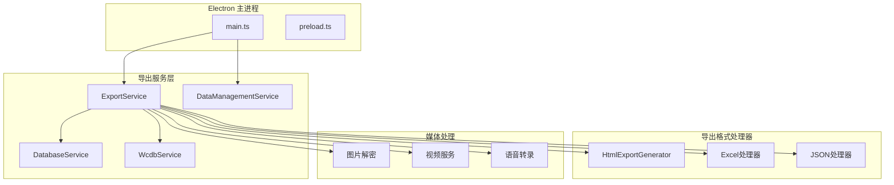
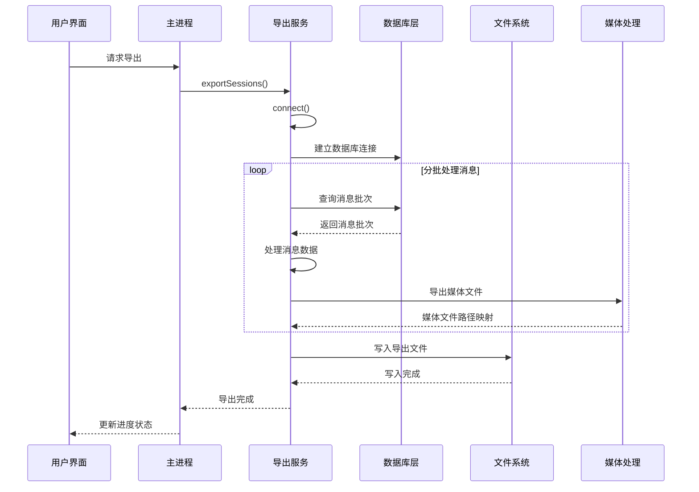
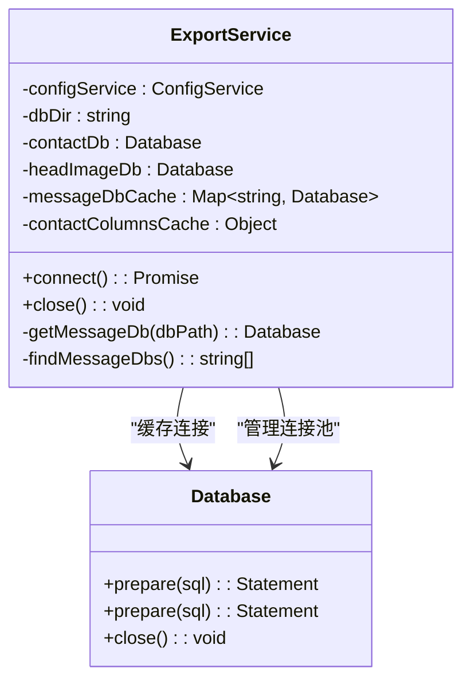
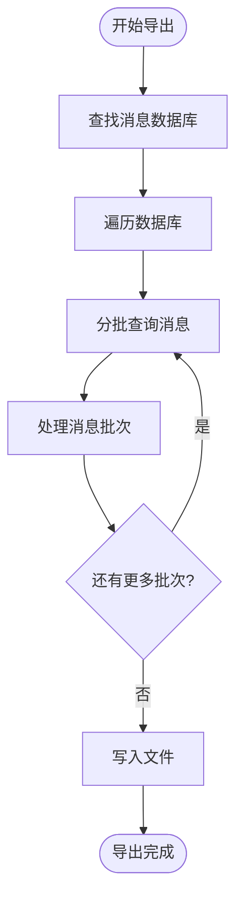
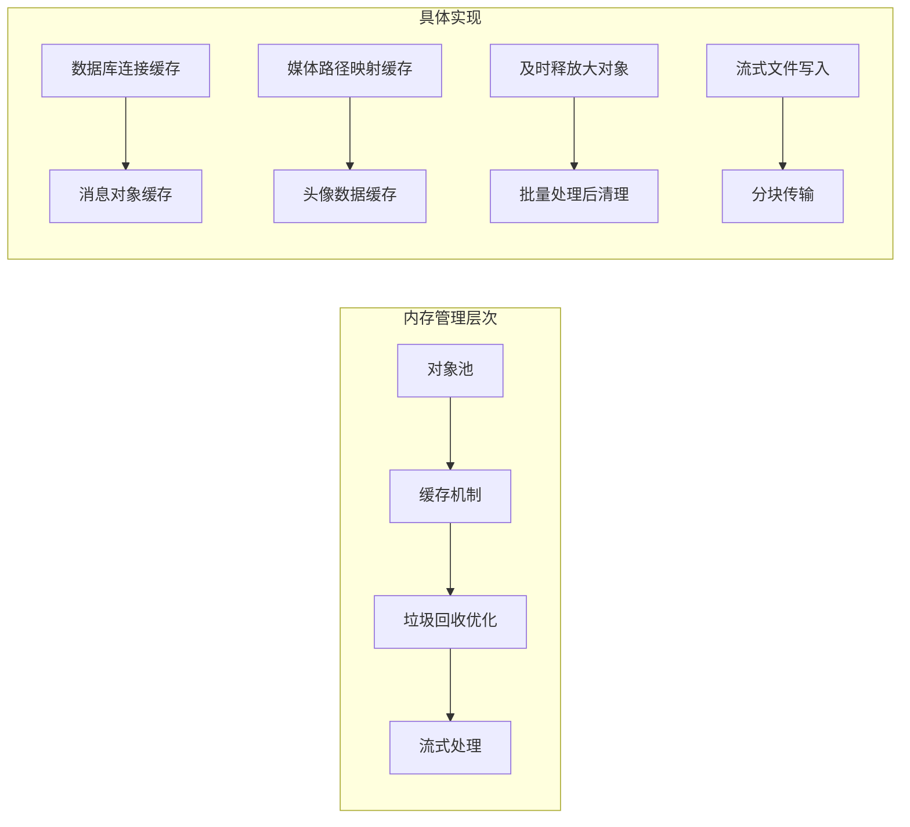
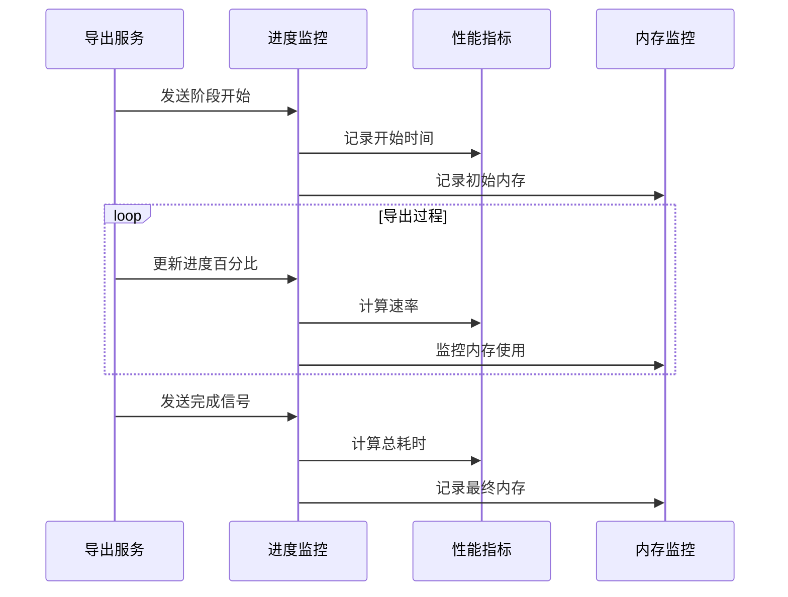
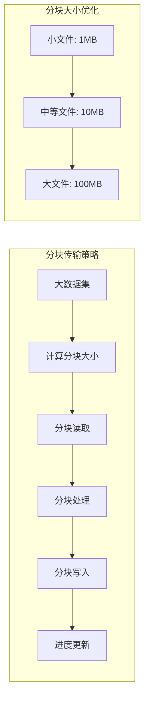
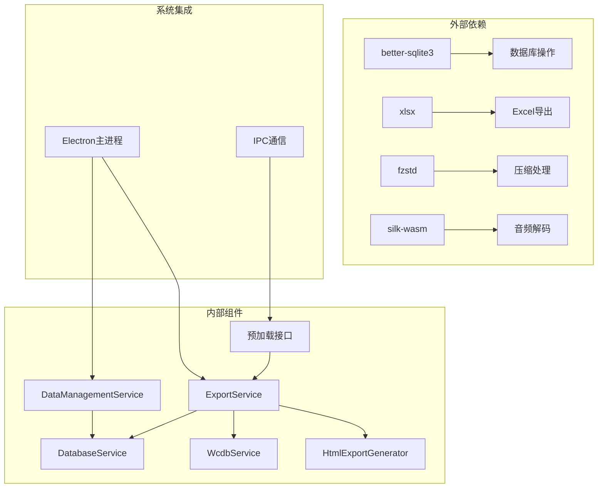

# 导出性能优化

<cite>
**本文档引用的文件**
- [exportService.ts](file://electron/services/exportService.ts)
- [dataManagementService.ts](file://electron/services/dataManagementService.ts)
- [database.ts](file://electron/services/database.ts)
- [wcdbService.ts](file://electron/services/wcdbService.ts)
- [htmlExportGenerator.ts](file://electron/services/htmlExportGenerator.ts)
- [main.ts](file://electron/main.ts)
- [preload.ts](file://electron/preload.ts)
</cite>

## 目录
1. [简介](#简介)
2. [项目结构](#项目结构)
3. [核心组件](#核心组件)
4. [架构概览](#架构概览)
5. [详细组件分析](#详细组件分析)
6. [依赖关系分析](#依赖关系分析)
7. [性能考虑](#性能考虑)
8. [故障排除指南](#故障排除指南)
9. [结论](#结论)

## 简介

CipherTalk 的导出性能优化功能旨在为用户提供高效、稳定的聊天记录导出体验。该系统针对大文件处理进行了深度优化，包括数据库连接池管理、消息分批读取、内存使用控制、垃圾回收优化等多个方面。

本技术文档专注于导出性能优化的核心机制，涵盖以下关键领域：

- **大文件处理策略**：数据库连接池管理、消息分批读取、内存使用控制、垃圾回收优化
- **性能监控机制**：导出进度计算、剩余时间估算、实时性能指标
- **异步导出架构**：后台线程管理、并发处理策略、任务队列调度
- **内存管理技术**：流式写入、临时文件处理、大数据集分块传输
- **性能瓶颈分析**：数据库查询优化、I/O 操作优化、CPU 使用率控制

## 项目结构

CipherTalk 的导出功能采用模块化架构设计，主要组件分布如下：

**图表来源**
- [main.ts:19-28](file://electron/main.ts#L19-L28)
- [exportService.ts:117-127](file://electron/services/exportService.ts#L117-L127)

**章节来源**
- [main.ts:1-100](file://electron/main.ts#L1-L100)
- [exportService.ts:1-120](file://electron/services/exportService.ts#L1-L120)

## 核心组件

### ExportService - 导出服务核心

ExportService 是导出功能的核心组件，负责协调整个导出流程。其主要职责包括：

- **数据库连接管理**：智能连接和缓存数据库连接
- **消息读取**：分批读取大量消息数据
- **格式转换**：支持多种导出格式（JSON、Excel、HTML等）
- **媒体处理**：导出图片、视频、表情包等多媒体内容
- **进度监控**：实时跟踪导出进度和状态

### DataManagementService - 数据管理服务

DataManagementService 负责数据库文件的扫描、解密和管理：

- **数据库扫描**：自动发现和识别数据库文件
- **批量解密**：支持批量解密多个数据库文件
- **增量更新**：智能检测和更新变更的数据库
- **缓存管理**：优化文件系统访问和缓存策略

### DatabaseService - 数据库服务

DatabaseService 提供基础的数据库连接和查询功能：

- **连接池管理**：维护数据库连接状态
- **查询执行**：安全执行 SQL 查询
- **资源清理**：自动管理数据库连接资源

**章节来源**
- [exportService.ts:117-127](file://electron/services/exportService.ts#L117-L127)
- [dataManagementService.ts:34-50](file://electron/services/dataManagementService.ts#L34-L50)
- [database.ts:5-82](file://electron/services/database.ts#L5-L82)

## 架构概览

导出系统的整体架构采用分层设计，确保高性能和可扩展性：

**图表来源**
- [exportService.ts:2119-2228](file://electron/services/exportService.ts#L2119-L2228)
- [exportService.ts:717-1090](file://electron/services/exportService.ts#L717-L1090)

## 详细组件分析

### 数据库连接池管理

ExportService 实现了智能的数据库连接池管理机制：

**图表来源**
- [exportService.ts:117-127](file://electron/services/exportService.ts#L117-L127)
- [exportService.ts:266-277](file://electron/services/exportService.ts#L266-L277)

关键特性：
- **连接缓存**：使用 Map 缓存已建立的数据库连接
- **延迟初始化**：按需创建数据库连接，避免不必要的资源消耗
- **自动清理**：提供连接关闭和资源清理机制

**章节来源**
- [exportService.ts:220-264](file://electron/services/exportService.ts#L220-L264)
- [exportService.ts:266-277](file://electron/services/exportService.ts#L266-L277)

### 消息分批读取策略

系统实现了高效的分批读取策略来处理大量消息数据：

**图表来源**
- [exportService.ts:744-783](file://electron/services/exportService.ts#L744-L783)
- [exportService.ts:1491-1507](file://electron/services/exportService.ts#L1491-L1507)

分批读取的优势：
- **内存控制**：避免一次性加载所有消息到内存
- **进度反馈**：提供准确的导出进度
- **错误恢复**：单个批次失败不影响整体导出

**章节来源**
- [exportService.ts:744-882](file://electron/services/exportService.ts#L744-L882)
- [exportService.ts:1491-1604](file://electron/services/exportService.ts#L1491-L1604)

### 内存使用控制

系统采用了多层内存管理策略：

**图表来源**
- [exportService.ts:121-123](file://electron/services/exportService.ts#L121-L123)
- [exportService.ts:220-264](file://electron/services/exportService.ts#L220-L264)

关键优化点：
- **对象池**：重用数据库连接和消息对象
- **缓存策略**：智能缓存常用数据结构
- **及时释放**：处理完大对象后立即释放内存

**章节来源**
- [exportService.ts:121-123](file://electron/services/exportService.ts#L121-L123)
- [exportService.ts:254-263](file://electron/services/exportService.ts#L254-L263)

### 垃圾回收优化

系统通过以下方式优化垃圾回收：

- **批量处理**：减少频繁的小对象创建
- **对象重用**：重复使用已创建的对象实例
- **及时清理**：处理完成后立即清理临时变量
- **内存监控**：定期检查内存使用情况

**章节来源**
- [exportService.ts:220-264](file://electron/services/exportService.ts#L220-L264)
- [exportService.ts:254-263](file://electron/services/exportService.ts#L254-L263)

### 性能监控机制

系统实现了全面的性能监控体系：

**图表来源**
- [exportService.ts:109-115](file://electron/services/exportService.ts#L109-L115)
- [exportService.ts:736-742](file://electron/services/exportService.ts#L736-L742)

**章节来源**
- [exportService.ts:109-115](file://electron/services/exportService.ts#L109-L115)
- [exportService.ts:736-742](file://electron/services/exportService.ts#L736-L742)

### 异步导出架构

系统采用异步架构确保 UI 响应性和导出效率：

**图表来源**
- [exportService.ts:2212-2214](file://electron/services/exportService.ts#L2212-L2214)
- [exportService.ts:350-353](file://electron/services/exportService.ts#L350-L353)

**章节来源**
- [exportService.ts:2212-2214](file://electron/services/exportService.ts#L2212-L2214)
- [dataManagementService.ts:350-353](file://electron/services/dataManagementService.ts#L350-L353)

### 内存管理技术

系统实现了多种内存管理技术来优化大文件处理：

#### 流式写入

**图表来源**
- [exportService.ts:1057-1075](file://electron/services/exportService.ts#L1057-L1075)
- [exportService.ts:1895-1902](file://electron/services/exportService.ts#L1895-L1902)

#### 临时文件处理

系统使用临时文件来处理大型导出文件：

- **临时文件目录**：在缓存目录中创建临时文件
- **原子替换**：使用临时文件完成后再替换原文件
- **清理机制**：自动清理临时文件和备份文件

#### 大数据集分块传输

**图表来源**
- [exportService.ts:2454-2604](file://electron/services/exportService.ts#L2454-L2604)
- [exportService.ts:2529-2595](file://electron/services/exportService.ts#L2529-L2595)

**章节来源**
- [exportService.ts:1057-1075](file://electron/services/exportService.ts#L1057-L1075)
- [exportService.ts:2454-2604](file://electron/services/exportService.ts#L2454-L2604)

## 依赖关系分析

导出系统的依赖关系体现了清晰的分层架构：

**图表来源**
- [exportService.ts:5-12](file://electron/services/exportService.ts#L5-L12)
- [main.ts:19-28](file://electron/main.ts#L19-L28)

**章节来源**
- [exportService.ts:5-12](file://electron/services/exportService.ts#L5-L12)
- [main.ts:19-28](file://electron/main.ts#L19-L28)

## 性能考虑

### 数据库查询优化

系统通过以下方式优化数据库查询性能：

- **索引利用**：合理使用 create_time 索引进行时间范围查询
- **查询优化**：使用 LIMIT 和 OFFSET 实现分页查询
- **连接复用**：避免频繁创建和销毁数据库连接
- **批量操作**：使用事务批量执行多个操作

### I/O 操作优化

I/O 操作优化策略包括：

- **异步读取**：使用异步 API 避免阻塞主线程
- **缓冲写入**：使用缓冲区减少磁盘写入次数
- **流式处理**：对于大文件采用流式处理方式
- **并发 I/O**：合理安排文件读写的并发度

### CPU 使用率控制

系统通过以下方式控制 CPU 使用率：

- **事件循环让出**：使用 setImmediate 让出事件循环
- **批处理策略**：将小任务合并为批处理
- **优先级调度**：高优先级任务优先执行
- **资源限制**：设置合理的并发度限制

## 故障排除指南

### 常见性能问题

#### 导出速度慢

**可能原因**：
- 数据库连接不足
- 内存使用过高
- I/O 瓶颈
- 媒体文件处理耗时

**解决方案**：
- 增加数据库连接池大小
- 调整分批大小
- 优化文件系统访问
- 并行处理媒体文件

#### 内存泄漏

**诊断方法**：
- 监控内存使用趋势
- 检查对象生命周期
- 确认资源正确释放

**预防措施**：
- 及时清理临时变量
- 使用弱引用避免循环引用
- 定期进行垃圾回收

#### 导出中断

**恢复机制**：
- 增量导出支持
- 断点续传功能
- 自动重试机制

**章节来源**
- [exportService.ts:2212-2214](file://electron/services/exportService.ts#L2212-L2214)
- [dataManagementService.ts:447-452](file://electron/services/dataManagementService.ts#L447-L452)

## 结论

CipherTalk 的导出性能优化功能通过多层次的技术手段实现了高效的大文件处理能力。系统的核心优势包括：

1. **智能连接管理**：通过连接池和缓存机制优化数据库访问
2. **分批处理策略**：有效控制内存使用和提高响应性
3. **全面监控体系**：提供详细的性能指标和进度反馈
4. **异步架构设计**：确保 UI 响应性和处理效率
5. **内存优化技术**：采用多种技术手段控制内存使用

这些优化措施使得 CipherTalk 能够处理大规模聊天记录导出需求，同时保持良好的用户体验和系统稳定性。对于性能工程师而言，这些技术实现提供了宝贵的参考和实践指导。