# 导出数据处理

<cite>
**本文档引用的文件**
- [exportService.ts](file://electron/services/exportService.ts)
- [chatService.ts](file://electron/services/chatService.ts)
- [imageDecryptService.ts](file://electron/services/imageDecryptService.ts)
- [videoService.ts](file://electron/services/videoService.ts)
- [voiceTranscribeService.ts](file://electron/services/voiceTranscribeService.ts)
- [htmlExportGenerator.ts](file://electron/services/htmlExportGenerator.ts)
- [dataManagementService.ts](file://electron/services/dataManagementService.ts)
- [decryptService.ts](file://electron/services/decryptService.ts)
- [isaac64.ts](file://electron/services/isaac64.ts)
</cite>

## 目录
1. [简介](#简介)
2. [项目结构](#项目结构)
3. [核心组件](#核心组件)
4. [架构概览](#架构概览)
5. [详细组件分析](#详细组件分析)
6. [依赖关系分析](#依赖关系分析)
7. [性能考虑](#性能考虑)
8. [故障排除指南](#故障排除指南)
9. [结论](#结论)

## 简介

CipherTalk 是一个微信数据导出工具，专注于将微信聊天记录转换为多种标准格式。该系统提供了完整的数据处理管道，从原始数据库解密到最终格式化导出，涵盖了消息内容处理、类型转换、数据清理、媒体文件处理、数据完整性保证等核心功能。

该导出系统支持多种输出格式，包括 ChatLab 标准格式、JSON、Excel、HTML 等，能够处理文本、图片、视频、语音、表情等多种消息类型，并提供丰富的数据清理和格式化功能。

## 项目结构

CipherTalk 采用模块化的架构设计，各个服务组件职责明确，相互协作完成完整的数据导出流程：

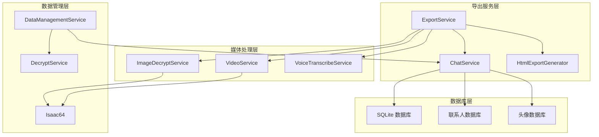

**图表来源**
- [exportService.ts:117-127](file://electron/services/exportService.ts#L117-L127)
- [chatService.ts:110-152](file://electron/services/chatService.ts#L110-L152)
- [imageDecryptService.ts:44-54](file://electron/services/imageDecryptService.ts#L44-L54)

**章节来源**
- [exportService.ts:1-100](file://electron/services/exportService.ts#L1-L100)
- [chatService.ts:1-100](file://electron/services/chatService.ts#L1-L100)

## 核心组件

### 导出服务 (ExportService)

ExportService 是整个导出系统的核心控制器，负责协调各个组件完成完整的数据导出流程。它实现了多种导出格式的支持，包括 ChatLab 标准格式、JSON、Excel、HTML 等。

**主要功能特性：**
- 多格式导出支持（JSON、Excel、HTML、ChatLab）
- 消息类型智能转换
- 媒体文件导出和路径映射
- 数据清理和格式化
- 进度跟踪和错误处理

**章节来源**
- [exportService.ts:117-127](file://electron/services/exportService.ts#L117-L127)
- [exportService.ts:717-1090](file://electron/services/exportService.ts#L717-L1090)

### 聊天服务 (ChatService)

ChatService 提供底层的数据库访问和消息查询功能，负责与微信数据库进行交互，获取原始消息数据并进行初步处理。

**核心能力：**
- 数据库连接管理
- 消息表查找和访问
- 联系人信息获取
- 缓存机制优化性能

**章节来源**
- [chatService.ts:110-152](file://electron/services/chatService.ts#L110-L152)
- [chatService.ts:283-346](file://electron/services/chatService.ts#L283-L346)

### 媒体处理服务

系统提供了专门的媒体处理服务来处理各种类型的媒体文件：

**图片解密服务 (ImageDecryptService)**
- 支持微信图片格式解密
- 缓存机制优化性能
- 实况照片处理
- 多种图片格式支持

**视频服务 (VideoService)**
- 视频文件查找和访问
- 视频号内容处理
- 加密视频解密
- 视频封面和缩略图处理

**语音转录服务 (VoiceTranscribeService)**
- 语音转文字功能
- 多语言支持
- 模型管理和缓存
- 实时转录进度反馈

**章节来源**
- [imageDecryptService.ts:44-54](file://electron/services/imageDecryptService.ts#L44-L54)
- [videoService.ts:45-50](file://electron/services/videoService.ts#L45-L50)
- [voiceTranscribeService.ts:70-77](file://electron/services/voiceTranscribeService.ts#L70-L77)

## 架构概览

CipherTalk 采用了分层架构设计，确保各组件职责清晰、耦合度低：

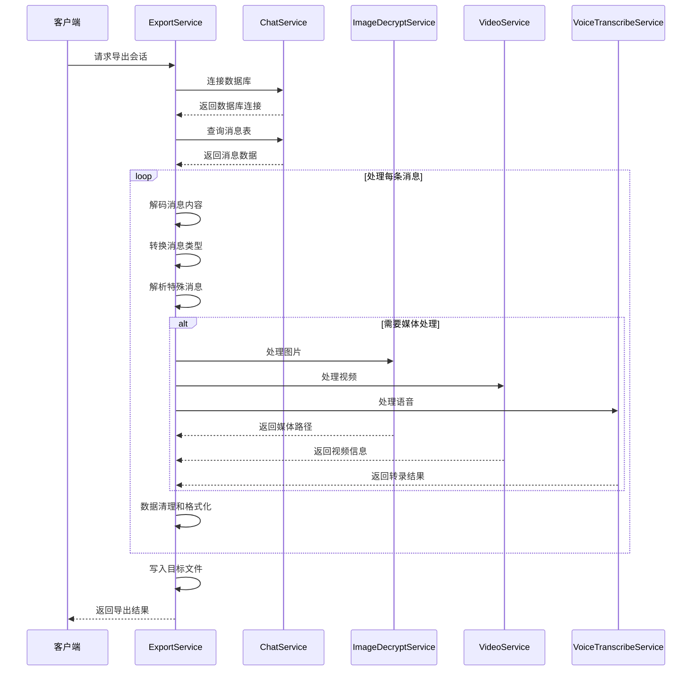

**图表来源**
- [exportService.ts:717-1090](file://electron/services/exportService.ts#L717-L1090)
- [chatService.ts:451-520](file://electron/services/chatService.ts#L451-L520)

## 详细组件分析

### 消息内容处理

系统实现了复杂的消息内容处理机制，能够处理各种格式的消息数据：

#### 文本内容解码

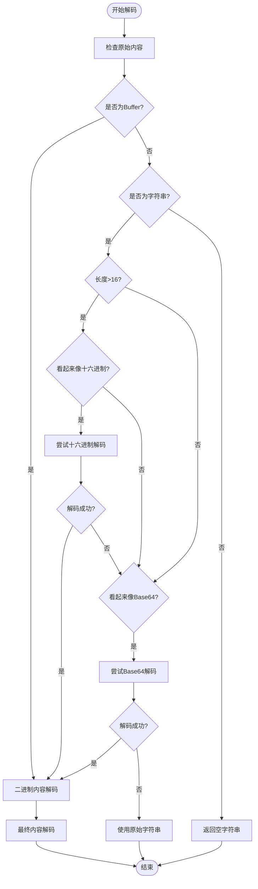

**图表来源**
- [exportService.ts:462-516](file://electron/services/exportService.ts#L462-L516)

#### 压缩内容处理

系统支持多种压缩格式的自动识别和解压：

**章节来源**
- [exportService.ts:470-516](file://electron/services/exportService.ts#L470-L516)

#### 编码格式识别

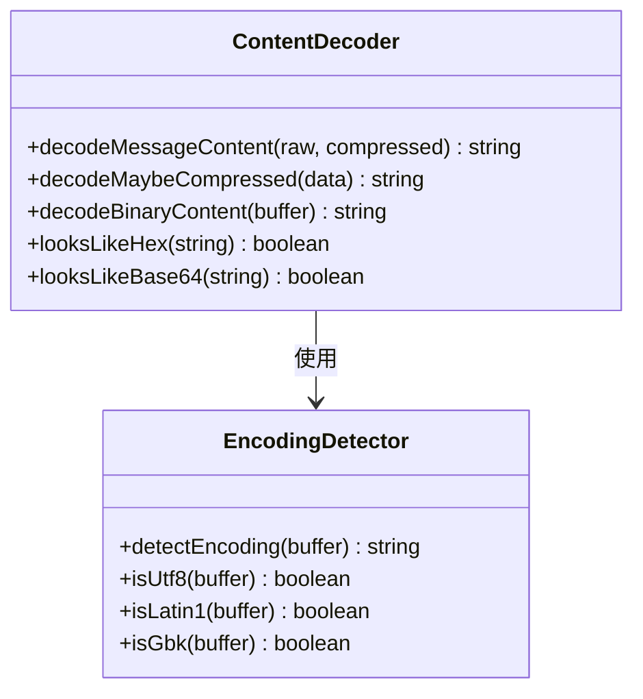

**图表来源**
- [exportService.ts:462-526](file://electron/services/exportService.ts#L462-L526)

**章节来源**
- [exportService.ts:462-526](file://electron/services/exportService.ts#L462-L526)

### 消息类型转换

系统实现了微信本地类型到 ChatLab 类型的完整映射：

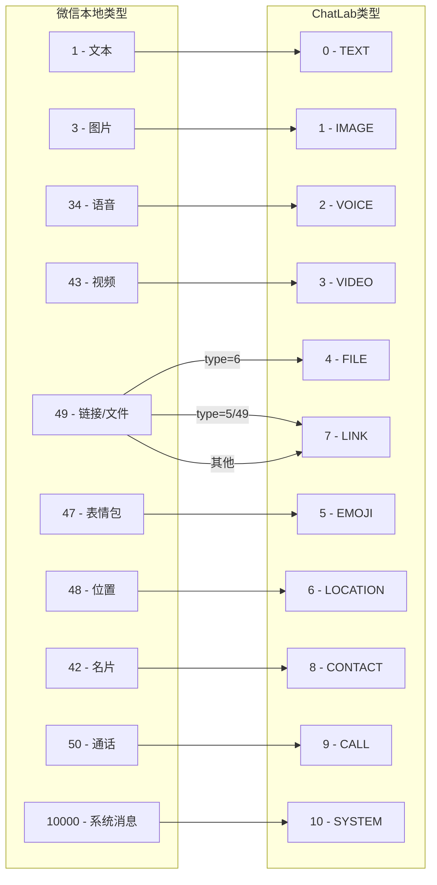

**图表来源**
- [exportService.ts:72-84](file://electron/services/exportService.ts#L72-L84)
- [exportService.ts:435-457](file://electron/services/exportService.ts#L435-L457)

**章节来源**
- [exportService.ts:72-84](file://electron/services/exportService.ts#L72-L84)
- [exportService.ts:435-457](file://electron/services/exportService.ts#L435-L457)

### XML 内容解析

系统提供了强大的 XML 内容解析能力，能够处理微信消息中的复杂 XML 结构：

**章节来源**
- [exportService.ts:693-700](file://electron/services/exportService.ts#L693-L700)
- [exportService.ts:1111-1157](file://electron/services/exportService.ts#L1111-L1157)

### 特殊消息类型处理

#### 转账消息处理

系统能够解析微信转账消息的 XML 结构，提取转账详情：

**章节来源**
- [exportService.ts:398-430](file://electron/services/exportService.ts#L398-L430)

#### 撤回消息处理

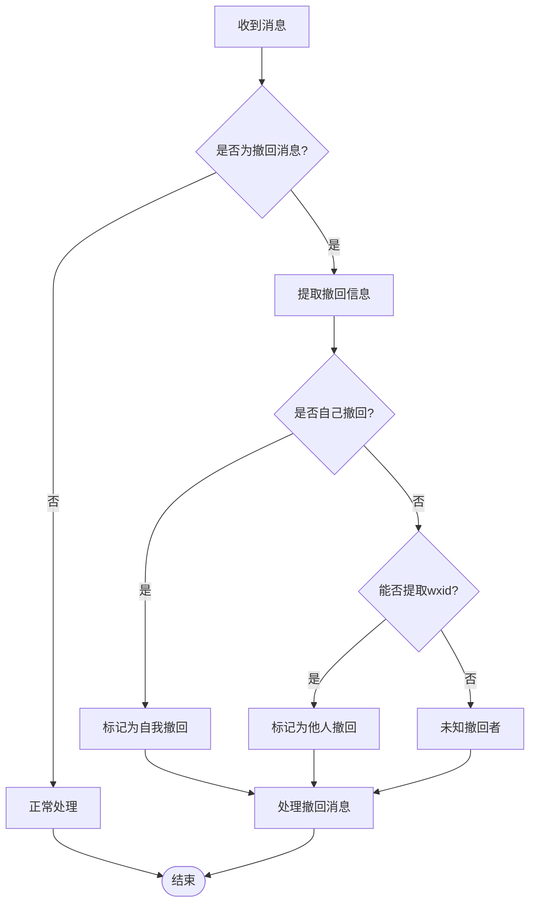

**图表来源**
- [exportService.ts:660-691](file://electron/services/exportService.ts#L660-L691)

**章节来源**
- [exportService.ts:660-691](file://electron/services/exportService.ts#L660-L691)

#### 群公告处理

系统能够识别和处理微信群公告消息，提取公告内容：

**章节来源**
- [exportService.ts:577-584](file://electron/services/exportService.ts#L577-L584)

### 数据清理和格式化

#### HTML 标签移除

系统提供了完整的 HTML 标签清理功能：

**章节来源**
- [exportService.ts:702-712](file://electron/services/exportService.ts#L702-L712)

#### 特殊字符处理

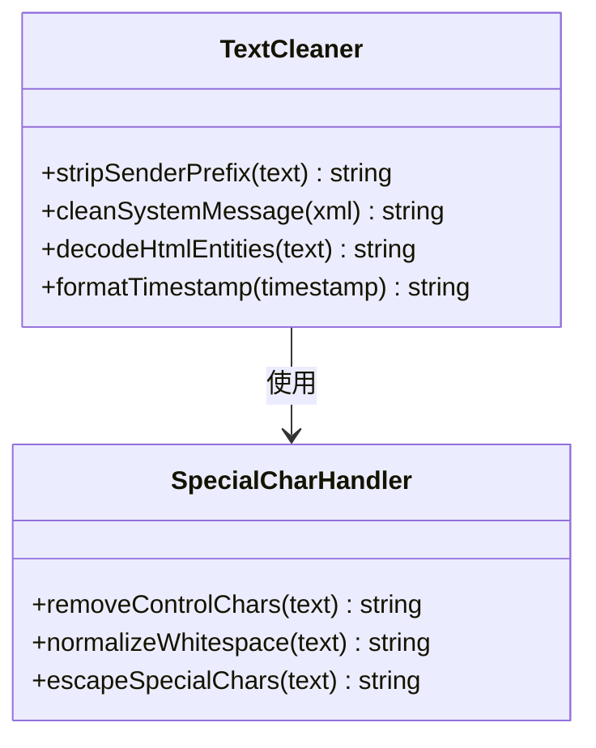

**图表来源**
- [exportService.ts:650-652](file://electron/services/exportService.ts#L650-L652)
- [exportService.ts:1162-1171](file://electron/services/exportService.ts#L1162-L1171)

**章节来源**
- [exportService.ts:650-652](file://electron/services/exportService.ts#L650-L652)
- [exportService.ts:1162-1171](file://electron/services/exportService.ts#L1162-L1171)

#### URL 转换

系统支持 URL 的自动识别和转换：

**章节来源**
- [exportService.ts:1162-1171](file://electron/services/exportService.ts#L1162-L1171)

#### 时间戳格式化

**章节来源**
- [exportService.ts:1438-1447](file://electron/services/exportService.ts#L1438-L1447)

### 媒体文件处理

#### 图片导出

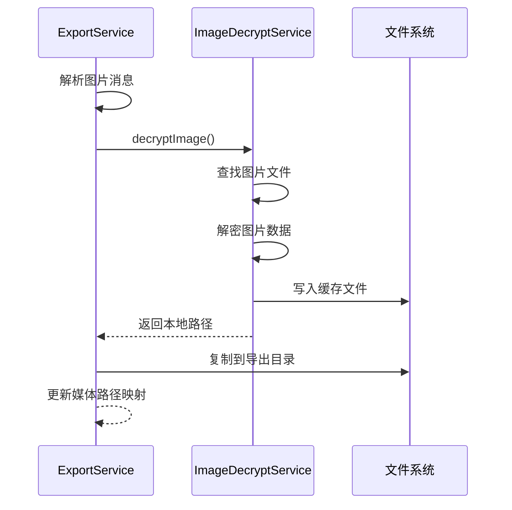

**图表来源**
- [exportService.ts:2318-2360](file://electron/services/exportService.ts#L2318-L2360)
- [imageDecryptService.ts:112-158](file://electron/services/imageDecryptService.ts#L112-L158)

**章节来源**
- [exportService.ts:2318-2360](file://electron/services/exportService.ts#L2318-L2360)
- [imageDecryptService.ts:112-158](file://electron/services/imageDecryptService.ts#L112-L158)

#### 视频文件处理

**章节来源**
- [exportService.ts:2363-2387](file://electron/services/exportService.ts#L2363-L2387)
- [videoService.ts:194-245](file://electron/services/videoService.ts#L194-L245)

#### 语音转录

**章节来源**
- [exportService.ts:2456-2604](file://electron/services/exportService.ts#L2456-L2604)
- [voiceTranscribeService.ts:368-448](file://electron/services/voiceTranscribeService.ts#L368-L448)

#### 文件路径映射

系统维护媒体文件的路径映射表，确保导出文件的相对路径正确：

**章节来源**
- [exportService.ts:2240-2241](file://electron/services/exportService.ts#L2240-L2241)

### 数据完整性保证

#### 重复数据去重

系统通过多种机制确保数据的唯一性和完整性：

**章节来源**
- [exportService.ts:884-885](file://electron/services/exportService.ts#L884-L885)

#### 缺失数据处理

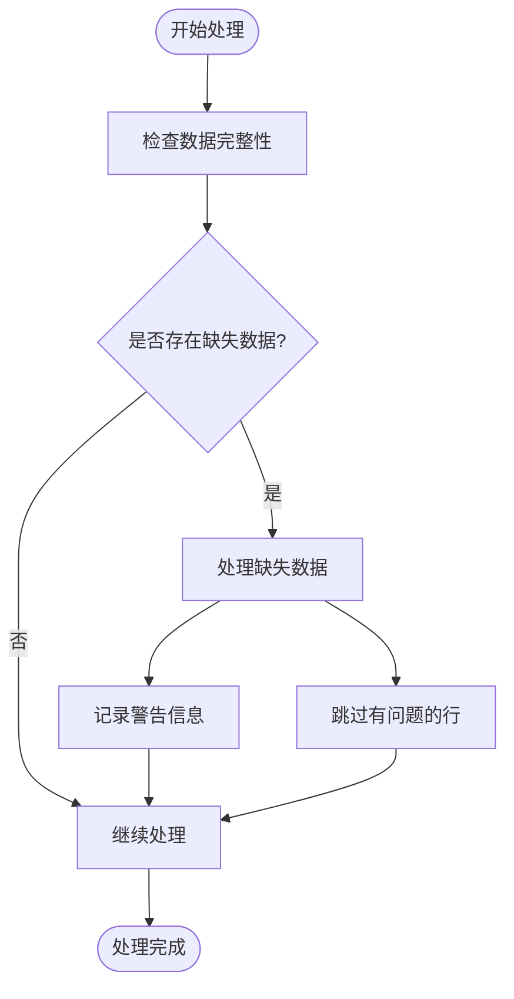

**图表来源**
- [exportService.ts:2448-2451](file://electron/services/exportService.ts#L2448-L2451)

#### 关联数据维护

系统通过外键约束和索引维护确保关联数据的一致性：

**章节来源**
- [chatService.ts:121-132](file://electron/services/chatService.ts#L121-L132)

## 依赖关系分析

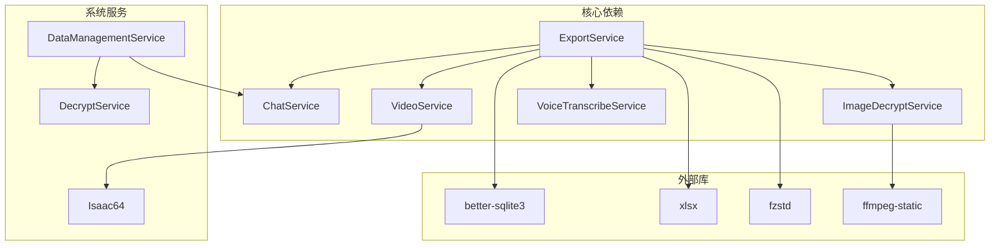

**图表来源**
- [exportService.ts:1-12](file://electron/services/exportService.ts#L1-L12)
- [imageDecryptService.ts:1-13](file://electron/services/imageDecryptService.ts#L1-L13)

**章节来源**
- [exportService.ts:1-12](file://electron/services/exportService.ts#L1-L12)
- [imageDecryptService.ts:1-13](file://electron/services/imageDecryptService.ts#L1-L13)

## 性能考虑

### 缓存策略

系统实现了多层次的缓存机制来提升性能：

**章节来源**
- [chatService.ts:118-136](file://electron/services/chatService.ts#L118-L136)
- [imageDecryptService.ts:46-54](file://electron/services/imageDecryptService.ts#L46-L54)

### 并发处理

系统采用异步处理和并发控制机制：

**章节来源**
- [exportService.ts:2213-2214](file://electron/services/exportService.ts#L2213-L2214)

### 内存管理

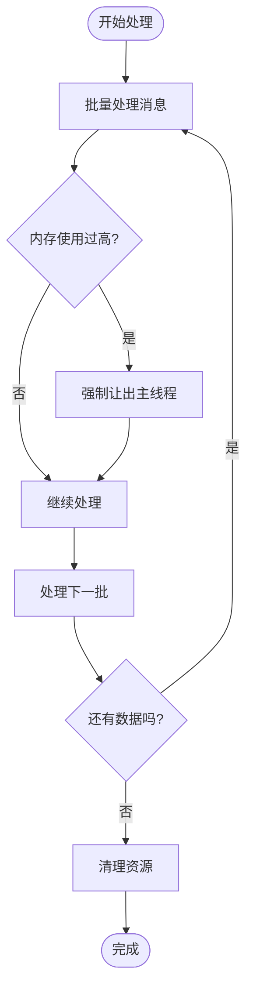

**图表来源**
- [exportService.ts:350-353](file://electron/services/exportService.ts#L350-L353)
- [exportService.ts:594-595](file://electron/services/exportService.ts#L594-L595)

## 故障排除指南

### 常见问题及解决方案

#### 数据库连接失败

**症状：** 导出过程中出现数据库连接错误

**解决方案：**
1. 检查数据库路径配置
2. 确认数据库文件完整性
3. 验证解密密钥正确性

**章节来源**
- [chatService.ts:283-346](file://electron/services/chatService.ts#L283-L346)

#### 媒体文件导出失败

**症状：** 图片、视频或语音文件导出异常

**解决方案：**
1. 检查媒体文件路径
2. 验证解密服务可用性
3. 确认网络连接（对于在线媒体）

**章节来源**
- [exportService.ts:2357-2359](file://electron/services/exportService.ts#L2357-L2359)

#### 内存不足问题

**症状：** 大规模导出时出现内存溢出

**解决方案：**
1. 分批处理大量数据
2. 及时清理缓存
3. 优化数据库查询

**章节来源**
- [exportService.ts:2529-2595](file://electron/services/exportService.ts#L2529-L2595)

### 调试技巧

#### 启用详细日志

系统提供了详细的日志输出，便于问题诊断：

**章节来源**
- [exportService.ts:309-318](file://electron/services/exportService.ts#L309-L318)

#### 性能监控

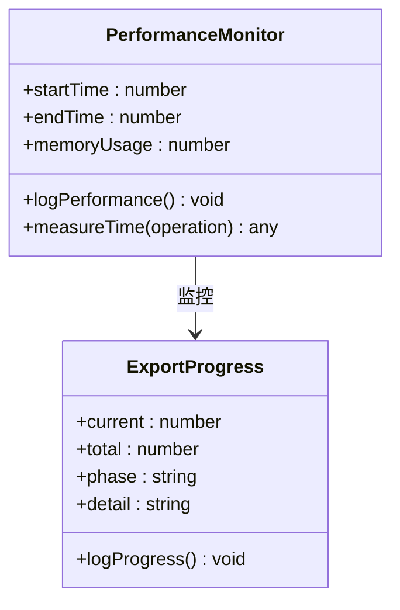

**图表来源**
- [exportService.ts:109-115](file://electron/services/exportService.ts#L109-L115)

## 结论

CipherTalk 的导出数据处理系统展现了高度的专业性和完整性。通过模块化的设计和完善的错误处理机制，系统能够稳定地处理各种复杂的微信数据导出需求。

**主要优势：**
- **多格式支持：** 支持多种标准格式导出
- **完整性保证：** 多层次的数据验证和清理
- **性能优化：** 缓存机制和并发处理
- **错误处理：** 完善的异常捕获和恢复机制
- **扩展性：** 模块化架构便于功能扩展

**技术亮点：**
- 智能的消息类型转换
- 完整的媒体文件处理链路
- 高效的数据清理和格式化
- 健壮的错误处理和恢复机制

该系统为微信数据导出提供了一个可靠、高效、易用的解决方案，适用于个人用户和企业级应用场景。