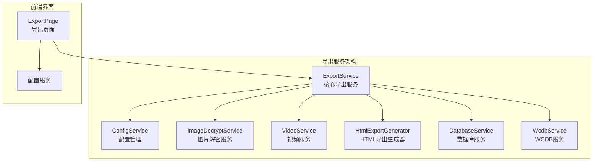
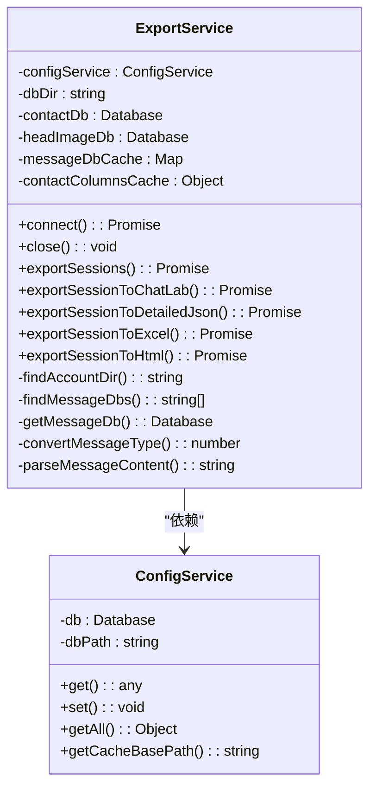
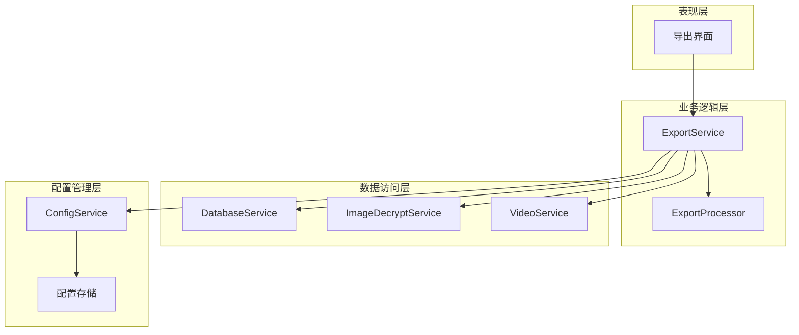
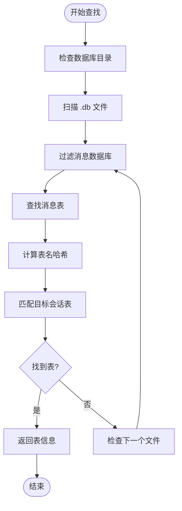
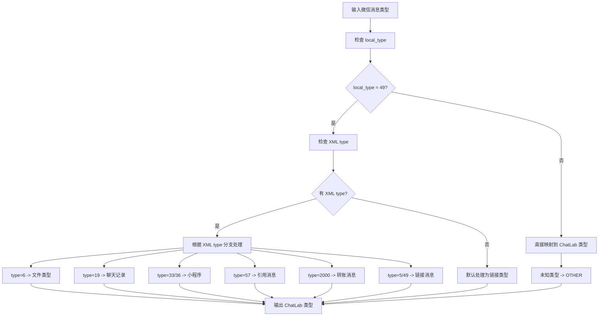
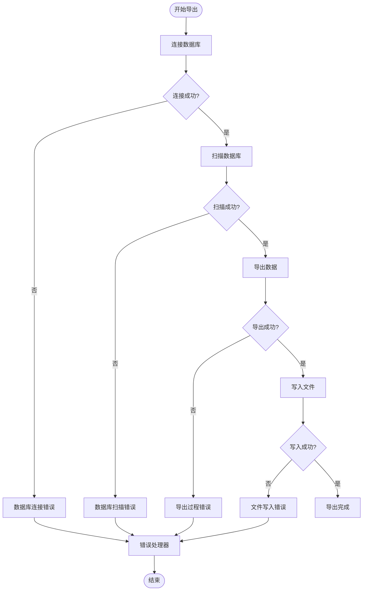
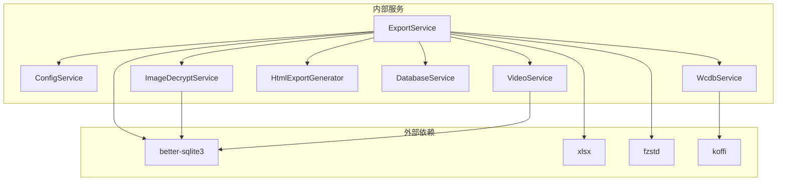
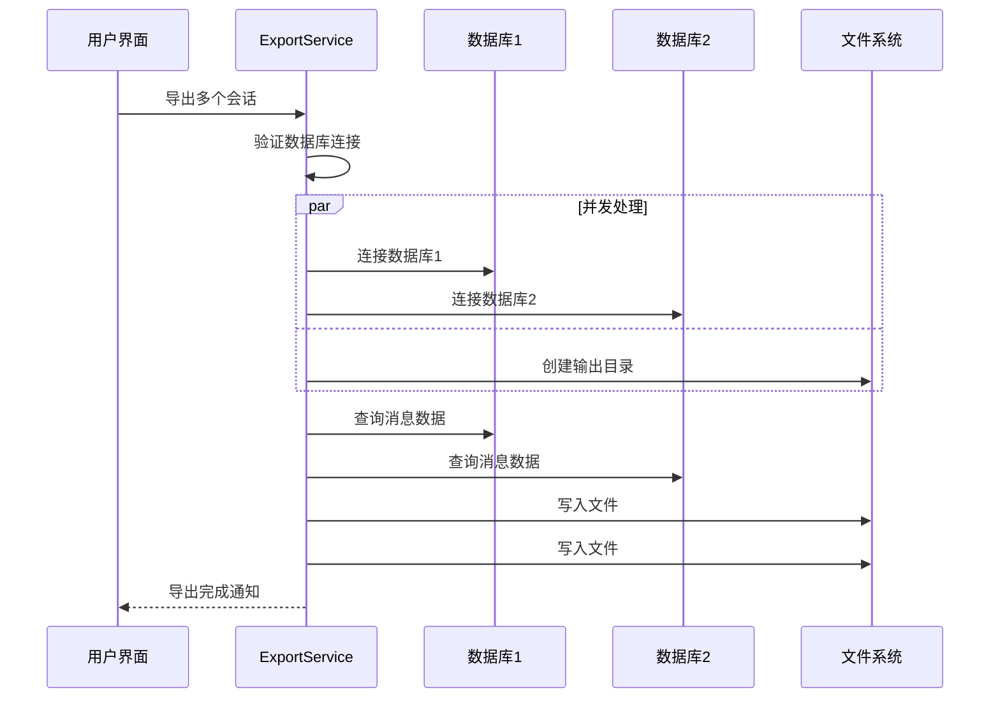

# 导出服务核心

<cite>
**本文档引用的文件**
- [exportService.ts](file://electron/services/exportService.ts)
- [config.ts](file://electron/services/config.ts)
- [database.ts](file://electron/services/database.ts)
- [wcdbService.ts](file://electron/services/wcdbService.ts)
- [htmlExportGenerator.ts](file://electron/services/htmlExportGenerator.ts)
- [imageDecryptService.ts](file://electron/services/imageDecryptService.ts)
- [videoService.ts](file://electron/services/videoService.ts)
- [ExportPage.tsx](file://src/pages/ExportPage.tsx)
- [dbPathService.ts](file://electron/services/dbPathService.ts)
- [dataManagementService.ts](file://electron/services/dataManagementService.ts)
</cite>

## 目录
1. [简介](#简介)
2. [项目结构](#项目结构)
3. [核心组件](#核心组件)
4. [架构概览](#架构概览)
5. [详细组件分析](#详细组件分析)
6. [依赖关系分析](#依赖关系分析)
7. [性能考虑](#性能考虑)
8. [故障排除指南](#故障排除指南)
9. [结论](#结论)

## 简介

CipherTalk 的导出服务是一个功能强大的消息导出系统，支持多种格式的消息导出，包括 ChatLab 格式、JSON、HTML、Excel 等。该服务提供了完整的数据库连接管理、消息表查找机制、导出选项配置和数据处理逻辑。

导出服务的核心设计模式采用了单例模式和工厂模式相结合的方式，通过 ExportService 类统一管理所有导出操作。系统支持多种消息类型的转换、内容解码、XML 解析和撤回消息处理，为用户提供灵活的导出选项和丰富的数据格式。

## 项目结构

导出服务位于 Electron 主进程中，采用模块化设计，各个组件职责清晰：

**图表来源**
- [exportService.ts:117-127](file://electron/services/exportService.ts#L117-L127)
- [config.ts:126-134](file://electron/services/config.ts#L126-L134)

**章节来源**
- [exportService.ts:1-800](file://electron/services/exportService.ts#L1-L800)
- [config.ts:1-395](file://electron/services/config.ts#L1-L395)

## 核心组件

### ExportService 类设计

ExportService 是导出服务的核心类，采用了以下设计模式：

- **单例模式**：确保整个应用只有一个导出服务实例
- **策略模式**：针对不同的导出格式提供不同的处理策略
- **模板方法模式**：统一导出流程，具体格式由子类实现

**图表来源**
- [exportService.ts:117-127](file://electron/services/exportService.ts#L117-L127)
- [config.ts:126-134](file://electron/services/config.ts#L126-L134)

### 数据库连接管理

导出服务实现了智能的数据库连接管理机制：

- **缓存机制**：使用 Map 缓存已连接的数据库实例，避免重复连接
- **自动发现**：自动扫描解密后的数据库目录，支持多种命名格式
- **连接池**：为每个消息数据库维护独立的连接实例

**章节来源**
- [exportService.ts:220-264](file://electron/services/exportService.ts#L220-L264)
- [exportService.ts:266-277](file://electron/services/exportService.ts#L266-L277)

## 架构概览

导出服务的整体架构采用分层设计，各层职责明确：

**图表来源**
- [exportService.ts:117-127](file://electron/services/exportService.ts#L117-L127)
- [config.ts:126-134](file://electron/services/config.ts#L126-L134)

## 详细组件分析

### 导出选项配置系统

导出服务提供了灵活的配置选项系统，支持多种导出格式和控制参数：

#### ExportOptions 接口

| 参数名 | 类型 | 默认值 | 描述 |
|--------|------|--------|------|
| format | 'chatlab' \| 'chatlab-jsonl' \| 'json' \| 'html' \| 'txt' \| 'excel' \| 'sql' | 'chatlab' | 导出格式类型 |
| dateRange | { start: number; end: number } \| null | null | 日期范围过滤器 |
| exportMedia | boolean | false | 是否导出媒体文件 |
| exportAvatars | boolean | true | 是否导出头像 |
| exportImages | boolean | false | 是否导出图片 |
| exportVideos | boolean | false | 是否导出视频 |
| exportEmojis | boolean | false | 是否导出表情包 |
| exportVoices | boolean | false | 是否导出语音 |
| mediaPathMap | Map<number, string> | undefined | 媒体文件路径映射 |

#### ContactExportOptions 接口

| 参数名 | 类型 | 默认值 | 描述 |
|--------|------|--------|------|
| format | 'json' \| 'csv' \| 'vcf' | 'json' | 通讯录导出格式 |
| exportAvatars | boolean | true | 是否导出头像 |
| contactTypes | Object | - | 联系人类型过滤 |
| selectedUsernames | string[] | undefined | 选定的用户名列表 |

**章节来源**
- [exportService.ts:86-107](file://electron/services/exportService.ts#L86-L107)

### 消息表查找机制

导出服务实现了智能的消息表查找机制，支持多种数据库布局：

**图表来源**
- [exportService.ts:279-327](file://electron/services/exportService.ts#L279-L327)

**章节来源**
- [exportService.ts:279-327](file://electron/services/exportService.ts#L279-L327)

### 数据处理逻辑

#### 消息类型转换

导出服务实现了复杂的消息类型转换逻辑：

**图表来源**
- [exportService.ts:435-457](file://electron/services/exportService.ts#L435-L457)

#### 内容解码机制

导出服务实现了多层次的内容解码机制：

| 解码类型 | 触发条件 | 解码方法 |
|----------|----------|----------|
| 压缩内容 | compress_content 存在 | decodeMaybeCompressed |
| 消息内容 | message_content | decodeMaybeCompressed |
| 二进制内容 | Buffer.isBuffer | decodeBinaryContent |
| HEX 编码 | 长度 > 16 且看起来像 HEX | Buffer.from(hex, 'hex') |
| Base64 编码 | 长度 > 16 且看起来像 Base64 | Buffer.from(base64, 'base64') |
| Latin1 编码 | UTF-8 解码失败 | data.toString('latin1') |

**章节来源**
- [exportService.ts:462-516](file://electron/services/exportService.ts#L462-L516)

### 错误处理机制

导出服务实现了完善的错误处理机制：

**图表来源**
- [exportService.ts:220-251](file://electron/services/exportService.ts#L220-L251)

**章节来源**
- [exportService.ts:220-251](file://electron/services/exportService.ts#L220-L251)

## 依赖关系分析

导出服务的依赖关系体现了清晰的分层架构：

**图表来源**
- [exportService.ts:1-13](file://electron/services/exportService.ts#L1-L13)
- [imageDecryptService.ts:1-13](file://electron/services/imageDecryptService.ts#L1-L13)

**章节来源**
- [exportService.ts:1-13](file://electron/services/exportService.ts#L1-L13)

## 性能考虑

### 内存管理

导出服务采用了多项内存优化策略：

- **数据库连接缓存**：使用 Map 缓存数据库连接，避免重复创建
- **消息分批处理**：对大量消息采用分批处理，避免内存峰值
- **及时释放资源**：在导出完成后及时释放数据库连接和缓存

### 并发处理

系统支持并发导出多个会话：

**图表来源**
- [exportService.ts:2119-2228](file://electron/services/exportService.ts#L2119-L2228)

### 缓存策略

导出服务实现了多级缓存机制：

- **数据库连接缓存**：缓存已连接的数据库实例
- **联系人信息缓存**：缓存联系人信息和头像 URL
- **表结构缓存**：缓存 contact.db 的表结构信息

**章节来源**
- [exportService.ts:120-124](file://electron/services/exportService.ts#L120-L124)

## 故障排除指南

### 常见问题及解决方案

#### 数据库连接失败

**症状**：导出时提示数据库连接失败

**可能原因**：
1. 解密密钥配置错误
2. 数据库路径配置不正确
3. 数据库文件损坏

**解决步骤**：
1. 检查配置中的解密密钥
2. 验证数据库路径的有效性
3. 重新解密数据库文件

#### 媒体文件导出失败

**症状**：图片或视频导出失败

**可能原因**：
1. 媒体文件在缓存中不存在
2. 文件权限问题
3. 磁盘空间不足

**解决步骤**：
1. 确保微信中已查看过相应媒体文件
2. 检查输出目录的写入权限
3. 清理磁盘空间

#### 内存不足错误

**症状**：导出大量数据时出现内存不足

**解决步骤**：
1. 减少同时导出的会话数量
2. 选择更小的导出范围
3. 增加系统内存或使用 64 位版本

**章节来源**
- [exportService.ts:220-251](file://electron/services/exportService.ts#L220-L251)

## 结论

CipherTalk 的导出服务是一个设计精良、功能完整的消息导出系统。其核心特点包括：

1. **模块化设计**：采用清晰的分层架构，各组件职责明确
2. **灵活配置**：支持多种导出格式和详细的导出选项
3. **智能处理**：实现了复杂的消息类型转换和内容解码逻辑
4. **性能优化**：采用缓存和并发处理技术提升导出效率
5. **错误处理**：提供了完善的错误处理和故障排除机制

该导出服务为用户提供了强大而灵活的消息导出能力，支持从个人聊天记录到企业数据管理的各种应用场景。通过合理的架构设计和性能优化，确保了在处理大量数据时的稳定性和效率。