# ChatLab 格式

<cite>
**本文档引用的文件**
- [exportService.ts](file://electron/services/exportService.ts)
- [ExportPage.tsx](file://src/pages/ExportPage.tsx)
- [main.ts](file://electron/main.ts)
- [htmlExportGenerator.ts](file://electron/services/htmlExportGenerator.ts)
</cite>

## 目录
1. [简介](#简介)
2. [项目结构](#项目结构)
3. [核心组件](#核心组件)
4. [架构概览](#架构概览)
5. [详细组件分析](#详细组件分析)
6. [依赖分析](#依赖分析)
7. [性能考虑](#性能考虑)
8. [故障排除指南](#故障排除指南)
9. [结论](#结论)
10. [附录](#附录)

## 简介

CipherTalk 是一款现代化的微信聊天记录查看与分析工具，其中 ChatLab 格式导出功能是该项目的重要组成部分。ChatLab 格式是一种标准化的数据交换格式，旨在为第三方软件提供统一的聊天记录导入能力。

本文档深入解释了 ChatLab 0.0.2 格式的设计理念和数据结构，包括头部信息、元数据、成员信息和消息列表的完整定义。同时详细说明了消息类型映射机制、数据转换逻辑以及格式配置选项。

## 项目结构

CipherTalk 项目采用前后端分离的架构设计，主要分为以下层次：

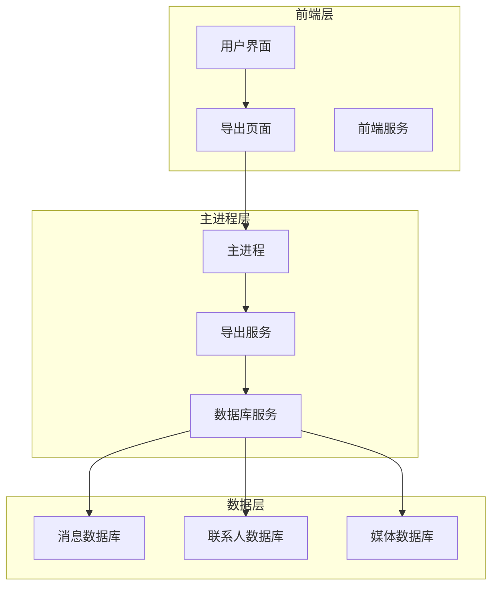

**图表来源**
- [exportService.ts:1-100](file://electron/services/exportService.ts#L1-L100)
- [ExportPage.tsx:1-100](file://src/pages/ExportPage.tsx#L1-L100)

**章节来源**
- [exportService.ts:1-100](file://electron/services/exportService.ts#L1-L100)
- [ExportPage.tsx:1-100](file://src/pages/ExportPage.tsx#L1-L100)

## 核心组件

### ChatLab 数据模型

ChatLab 格式定义了四个核心数据结构：

#### ChatLabHeader（头部信息）
- **version**: 字符串，格式版本标识
- **exportedAt**: 数字，导出时间戳
- **generator**: 字符串，生成器名称
- **description**: 可选字符串，描述信息

#### ChatLabMeta（元数据）
- **name**: 字符串，会话名称
- **platform**: 字符串，平台标识（固定为 "wechat"）
- **type**: 字符串，会话类型（'group' | 'private'）
- **groupId**: 可选字符串，群组ID
- **groupAvatar**: 可选字符串，群组头像URL
- **ownerId**: 可选字符串，所有者ID

#### ChatLabMember（成员信息）
- **platformId**: 字符串，平台用户ID
- **accountName**: 字符串，账户名称
- **groupNickname**: 可选字符串，群昵称
- **avatar**: 可选字符串，头像URL
- **roles**: 可选角色数组

#### ChatLabMessage（消息）
- **sender**: 字符串，发送者平台ID
- **accountName**: 字符串，发送者账户名称
- **groupNickname**: 可选字符串，发送者群昵称
- **timestamp**: 数字，消息时间戳
- **type**: 数字，消息类型代码
- **content**: 字符串或null，消息内容
- **platformMessageId**: 可选字符串，平台消息ID
- **replyToMessageId**: 可选字符串，回复消息ID
- **chatRecords**: 可选嵌套聊天记录数组

**章节来源**
- [exportService.ts:14-70](file://electron/services/exportService.ts#L14-L70)

### 导出服务架构

导出服务采用模块化设计，主要包含以下功能模块：

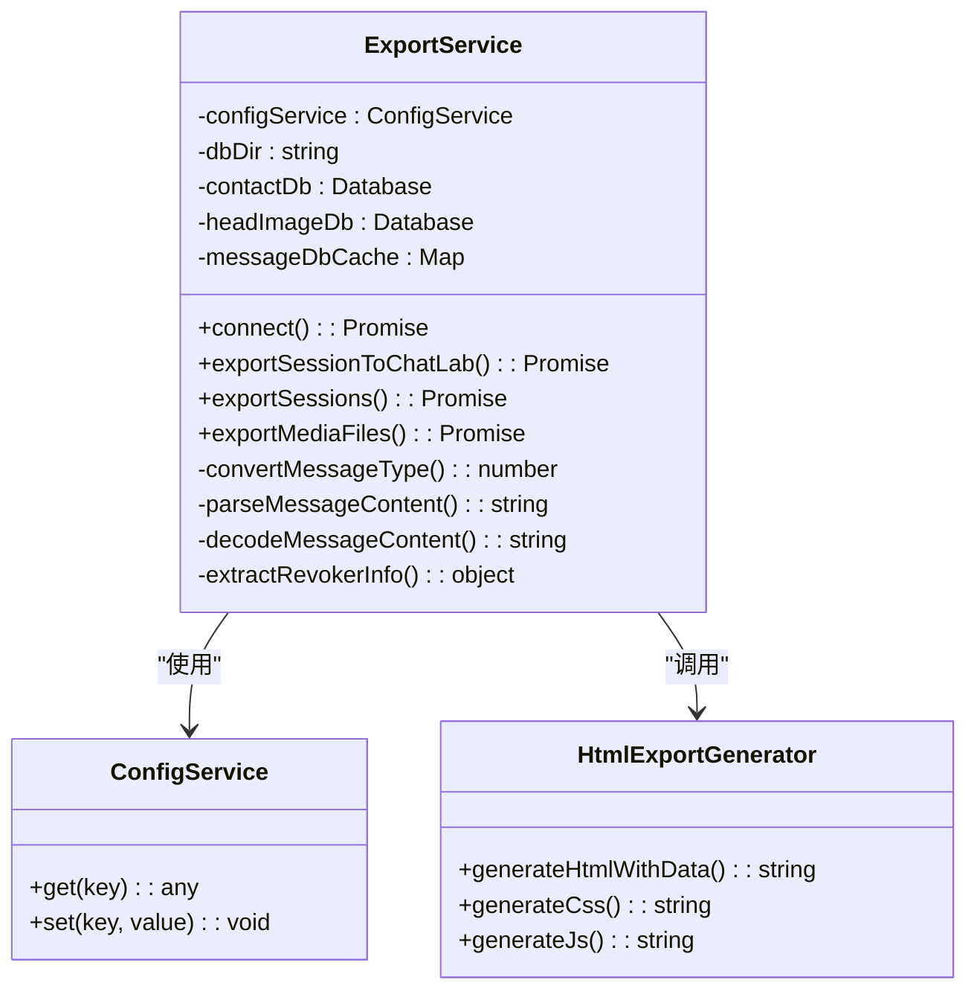

**图表来源**
- [exportService.ts:117-127](file://electron/services/exportService.ts#L117-L127)
- [htmlExportGenerator.ts:51-50](file://electron/services/htmlExportGenerator.ts#L51-L50)

**章节来源**
- [exportService.ts:117-127](file://electron/services/exportService.ts#L117-L127)
- [htmlExportGenerator.ts:51-50](file://electron/services/htmlExportGenerator.ts#L51-L50)

## 架构概览

### 导出流程架构

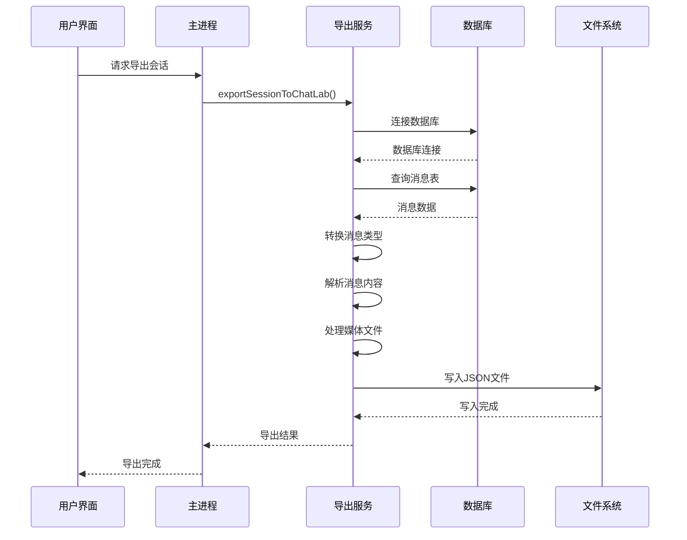

**图表来源**
- [exportService.ts:717-1090](file://electron/services/exportService.ts#L717-L1090)
- [main.ts:2416-2420](file://electron/main.ts#L2416-L2420)

### 数据转换管道

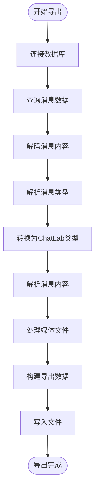

**图表来源**
- [exportService.ts:785-924](file://electron/services/exportService.ts#L785-L924)

**章节来源**
- [exportService.ts:717-1090](file://electron/services/exportService.ts#L717-L1090)
- [main.ts:2416-2420](file://electron/main.ts#L2416-L2420)

## 详细组件分析

### 消息类型映射机制

ChatLab 格式实现了微信本地类型到 ChatLab 类型的精确映射：

| 微信 localType | ChatLab 类型 | 类型名称 | 备注 |
|---------------|-------------|----------|------|
| 1 | 0 | TEXT | 文本消息 |
| 3 | 1 | IMAGE | 图片消息 |
| 34 | 2 | VOICE | 语音消息 |
| 43 | 3 | VIDEO | 视频消息 |
| 49 | 7 | LINK | 链接/文件消息 |
| 47 | 5 | EMOJI | 表情包消息 |
| 48 | 8 | LOCATION | 位置消息 |
| 42 | 27 | CONTACT | 名片消息 |
| 50 | 23 | CALL | 通话消息 |
| 10000 | 80 | SYSTEM | 系统消息 |

#### 特殊类型处理

对于 type 49 的复杂消息，ChatLab 实现了更精细的分类：

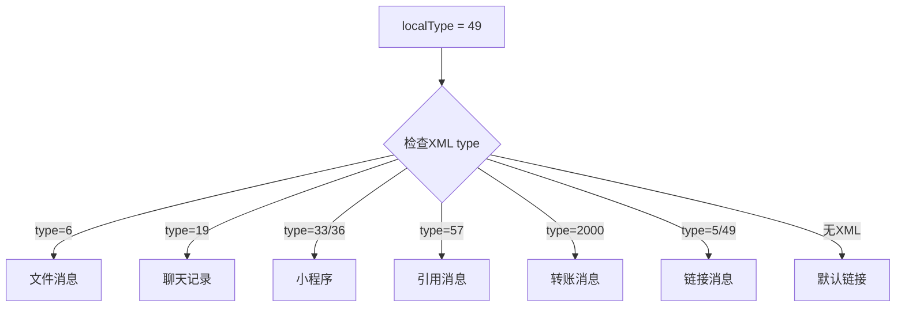

**图表来源**
- [exportService.ts:440-456](file://electron/services/exportService.ts#L440-L456)

**章节来源**
- [exportService.ts:72-84](file://electron/services/exportService.ts#L72-L84)
- [exportService.ts:435-457](file://electron/services/exportService.ts#L435-L457)

### 数据转换逻辑

#### 内容解码处理

消息内容可能采用多种编码方式存储，导出服务实现了多层次的解码机制：

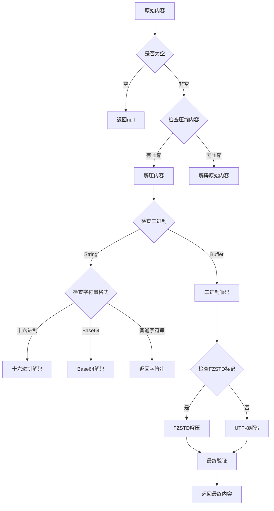

**图表来源**
- [exportService.ts:462-516](file://electron/services/exportService.ts#L462-L516)

#### XML 解析机制

对于包含 XML 结构的消息，导出服务提供了灵活的解析能力：

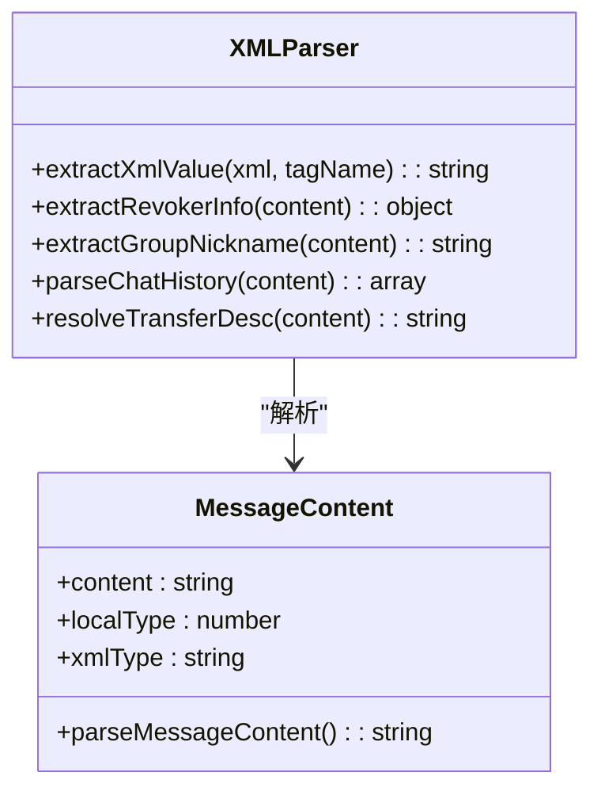

**图表来源**
- [exportService.ts:693-700](file://electron/services/exportService.ts#L693-L700)
- [exportService.ts:1095-1106](file://electron/services/exportService.ts#L1095-L1106)

**章节来源**
- [exportService.ts:462-516](file://electron/services/exportService.ts#L462-L516)
- [exportService.ts:693-700](file://electron/services/exportService.ts#L693-L700)
- [exportService.ts:1095-1106](file://electron/services/exportService.ts#L1095-L1106)

### 撤回消息处理

ChatLab 格式对微信的撤回消息进行了特殊处理，以保持消息历史的完整性：

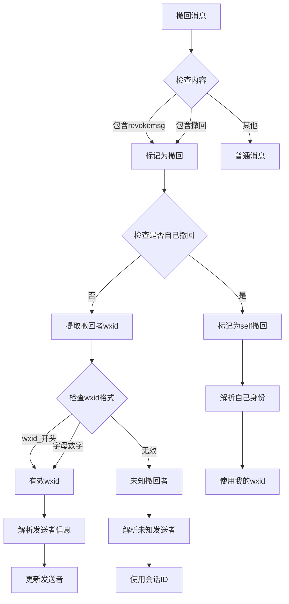

**图表来源**
- [exportService.ts:660-691](file://electron/services/exportService.ts#L660-L691)

**章节来源**
- [exportService.ts:660-691](file://electron/services/exportService.ts#L660-L691)

### 转账消息特殊处理

转账消息在 ChatLab 格式中得到了特殊的处理，不仅保留了原始的转账信息，还增加了"谁转账给谁"的描述：

```mermaid
flowchart TD
TransferMsg[转账消息] --> CheckXMLType{检查XML type}
CheckXMLType --> |type=2000| ParseTransfer[解析转账信息]
CheckXMLType --> |其他| NormalTransfer[普通处理]
ParseTransfer --> ExtractFields[提取字段]
ExtractFields --> ResolvePayer[解析付款人]
ExtractFields --> ResolveReceiver[解析收款人]
ExtractFields --> ExtractMemo[提取备注]
ResolvePayer --> CheckMyWxid{检查是否我的wxid}
CheckMyWxid --> |是| UseMe[使用"我"]
CheckMyWxid --> |否| UseContact[使用联系人名称]
ResolveReceiver --> CheckMyWxid2{检查是否我的wxid}
CheckMyWxid2 --> |是| UseMe2[使用"我"]
CheckMyWxid2 --> |否| UseContact2[使用联系人名称]
UseMe --> BuildDesc[构建转账描述]
UseContact --> BuildDesc
UseMe2 --> BuildDesc
UseContact2 --> BuildDesc
ExtractMemo --> BuildDesc
BuildDesc --> AppendToContent[附加到消息内容]
```

**图表来源**
- [exportService.ts:398-430](file://electron/services/exportService.ts#L398-L430)

**章节来源**
- [exportService.ts:398-430](file://electron/services/exportService.ts#L398-L430)

### 格式配置选项

ChatLab 导出支持丰富的配置选项，用户可以根据需求定制导出内容：

#### 基础导出选项
- **format**: 导出格式（'chatlab' | 'chatlab-jsonl' | 'json' | 'html' | 'txt' | 'excel' | 'sql'）
- **dateRange**: 日期范围过滤（可选）
- **exportMedia**: 是否导出媒体文件
- **exportAvatars**: 是否导出头像

#### 媒体导出选项
- **exportImages**: 导出图片
- **exportVideos**: 导出视频
- **exportEmojis**: 导出表情包
- **exportVoices**: 导出语音

#### 前端导出界面

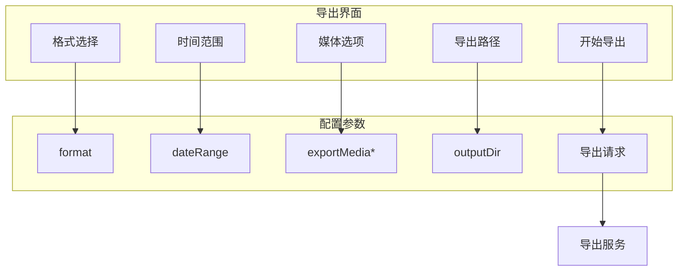

**图表来源**
- [ExportPage.tsx:81-90](file://src/pages/ExportPage.tsx#L81-L90)
- [ExportPage.tsx:638-707](file://src/pages/ExportPage.tsx#L638-L707)

**章节来源**
- [ExportPage.tsx:81-90](file://src/pages/ExportPage.tsx#L81-L90)
- [ExportPage.tsx:638-707](file://src/pages/ExportPage.tsx#L638-L707)

### 导出示例

#### ChatLab JSON 格式示例

```json
{
  "chatlab": {
    "version": "0.0.2",
    "exportedAt": 1703654400,
    "generator": "CipherTalk"
  },
  "meta": {
    "name": "团队聊天",
    "platform": "wechat",
    "type": "group",
    "groupId": "team_chat@chatroom",
    "ownerId": "wxid_123456"
  },
  "members": [
    {
      "platformId": "wxid_123456",
      "accountName": "张三",
      "groupNickname": "技术负责人",
      "avatar": "https://example.com/avatar.jpg"
    }
  ],
  "messages": [
    {
      "sender": "wxid_123456",
      "accountName": "张三",
      "groupNickname": "技术负责人",
      "timestamp": 1703654400,
      "type": 0,
      "content": "大家好，这是测试消息",
      "platformMessageId": "msg_123456"
    }
  ]
}
```

#### ChatLab JSONL 格式示例

JSONL 格式将每个实体分别序列化为独立的行：

```
{"_type":"header","chatlab":{"version":"0.0.2","exportedAt":1703654400,"generator":"CipherTalk"},"meta":{"name":"团队聊天","platform":"wechat","type":"group","groupId":"team_chat@chatroom","ownerId":"wxid_123456"}}
{"_type":"member","platformId":"wxid_123456","accountName":"张三","groupNickname":"技术负责人","avatar":"https://example.com/avatar.jpg"}
{"_type":"message","sender":"wxid_123456","accountName":"张三","groupNickname":"技术负责人","timestamp":1703654400,"type":0,"content":"大家好，这是测试消息","platformMessageId":"msg_123456"}
```

**章节来源**
- [exportService.ts:1057-1075](file://electron/services/exportService.ts#L1057-L1075)

## 依赖分析

### 核心依赖关系

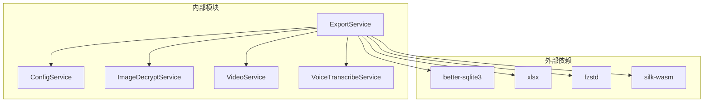

**图表来源**
- [exportService.ts:1-12](file://electron/services/exportService.ts#L1-L12)

### 数据库依赖

导出服务依赖于多个数据库来获取完整的信息：

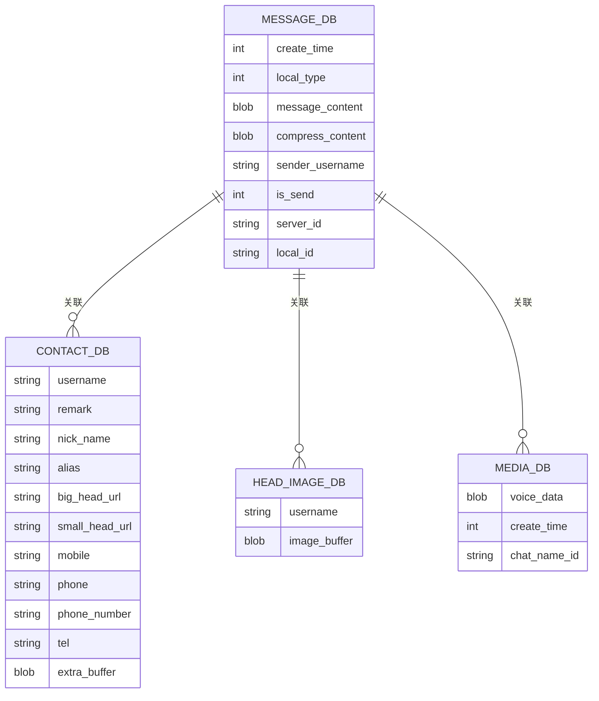

**图表来源**
- [exportService.ts:237-245](file://electron/services/exportService.ts#L237-L245)

**章节来源**
- [exportService.ts:1-12](file://electron/services/exportService.ts#L1-L12)
- [exportService.ts:237-245](file://electron/services/exportService.ts#L237-L245)

## 性能考虑

### 数据库查询优化

导出服务采用了多种策略来优化数据库查询性能：

1. **数据库连接池**: 使用缓存机制避免重复连接
2. **消息表查找**: 通过MD5哈希快速定位消息表
3. **分页处理**: 大量消息采用分批处理减少内存占用
4. **索引利用**: 合理使用create_time索引进行排序

### 内存管理

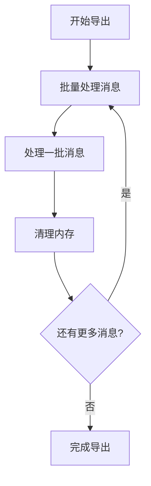

### 并发处理

对于媒体文件导出，系统采用了异步并发处理：

- **图片导出**: 并行处理多个图片消息
- **视频导出**: 并行处理多个视频消息  
- **表情包导出**: 并行处理多个表情包消息
- **语音导出**: 串行处理避免内存溢出

**章节来源**
- [exportService.ts:266-277](file://electron/services/exportService.ts#L266-L277)
- [exportService.ts:2529-2595](file://electron/services/exportService.ts#L2529-L2595)

## 故障排除指南

### 常见问题及解决方案

#### 数据库连接失败

**症状**: 导出过程中出现数据库连接错误

**原因分析**:
1. 账号目录不存在
2. 数据库文件损坏
3. 权限不足

**解决步骤**:
1. 检查账号ID配置
2. 验证数据库文件完整性
3. 确认文件权限

#### 消息类型识别错误

**症状**: 某些消息类型显示为未知类型

**原因分析**:
1. 新版本微信的消息类型变化
2. XML解析失败
3. 缓存数据过期

**解决步骤**:
1. 更新消息类型映射表
2. 检查XML结构完整性
3. 清理解析缓存

#### 媒体文件导出失败

**症状**: 媒体文件无法正确导出

**原因分析**:
1. 媒体数据库未找到
2. 网络下载超时
3. 文件权限问题

**解决步骤**:
1. 检查媒体数据库路径
2. 验证网络连接
3. 检查目标目录权限

**章节来源**
- [exportService.ts:220-251](file://electron/services/exportService.ts#L220-L251)
- [exportService.ts:2828-2841](file://electron/services/exportService.ts#L2828-L2841)

### 调试信息收集

导出服务提供了详细的进度反馈和错误信息：

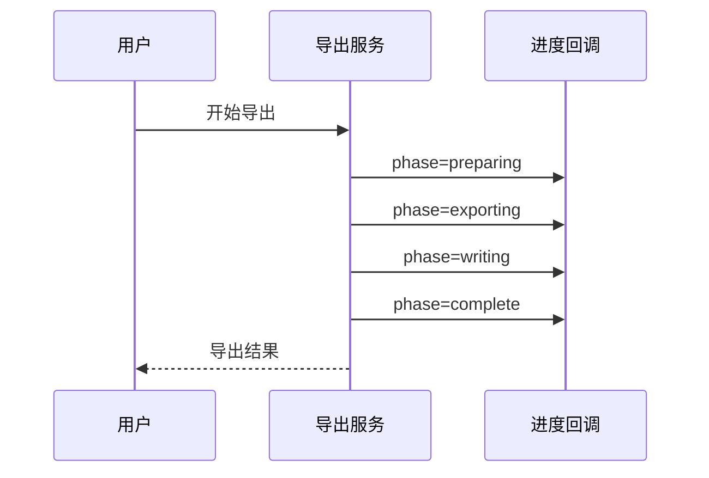

**图表来源**
- [exportService.ts:736-742](file://electron/services/exportService.ts#L736-L742)

## 结论

ChatLab 格式导出功能展现了 CipherTalk 项目在数据标准化和互操作性方面的卓越设计。通过精心设计的数据模型、完善的类型映射机制和灵活的配置选项，该功能为用户提供了强大而便捷的聊天记录导出能力。

主要优势包括：
- **标准化格式**: ChatLab 0.0.2 格式确保了与其他软件的兼容性
- **完整性保证**: 撤回消息、转账消息等特殊场景得到妥善处理
- **灵活性配置**: 丰富的导出选项满足不同用户需求
- **性能优化**: 多层次的优化策略确保大规模数据的高效处理

未来可以考虑的方向：
- 支持更多消息类型的细粒度分类
- 增加导出进度的实时监控
- 提供更多的格式转换选项
- 优化大文件导出的用户体验

## 附录

### API 定义

#### 导出接口

| 参数 | 类型 | 必需 | 描述 |
|------|------|------|------|
| sessionId | string | 是 | 会话ID |
| outputPath | string | 是 | 输出文件路径 |
| options | ExportOptions | 是 | 导出配置选项 |

#### 导出选项

| 选项 | 类型 | 默认值 | 描述 |
|------|------|--------|------|
| format | 'chatlab' \| 'chatlab-jsonl' \| 'json' \| 'html' \| 'txt' \| 'excel' \| 'sql' | 'chatlab' | 导出格式 |
| dateRange | {start: number, end: number} | null | 日期范围过滤 |
| exportMedia | boolean | false | 是否导出媒体文件 |
| exportAvatars | boolean | true | 是否导出头像 |
| exportImages | boolean | false | 是否导出图片 |
| exportVideos | boolean | false | 是否导出视频 |
| exportEmojis | boolean | false | 是否导出表情包 |
| exportVoices | boolean | false | 是否导出语音 |

**章节来源**
- [exportService.ts:86-96](file://electron/services/exportService.ts#L86-L96)
- [ExportPage.tsx:27-47](file://src/pages/ExportPage.tsx#L27-L47)