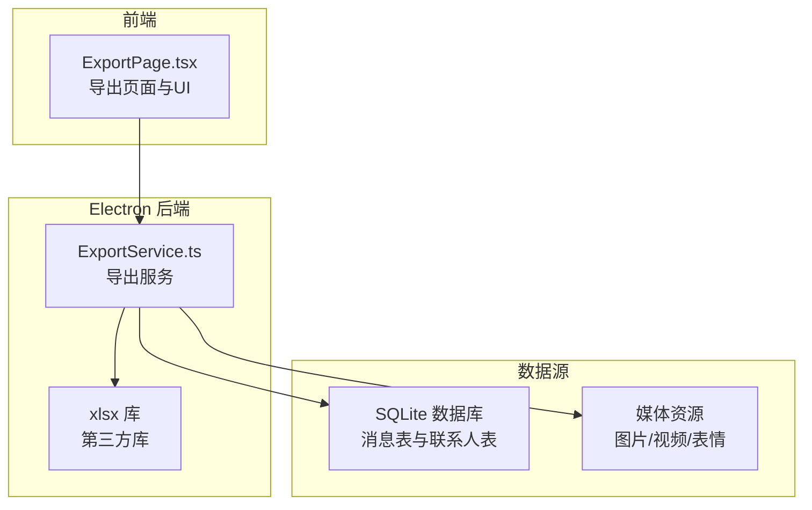
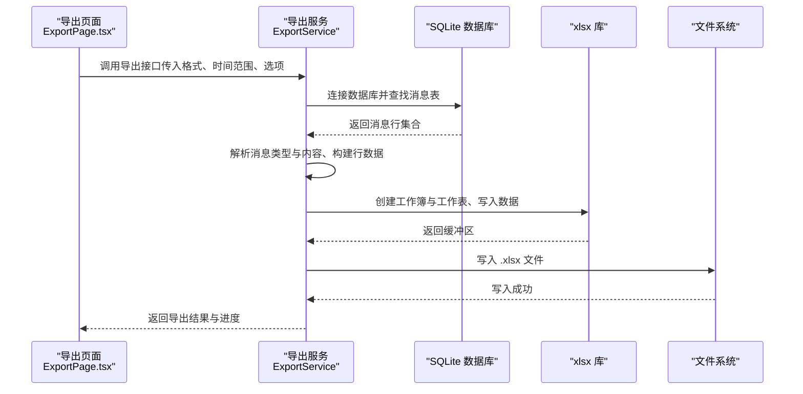
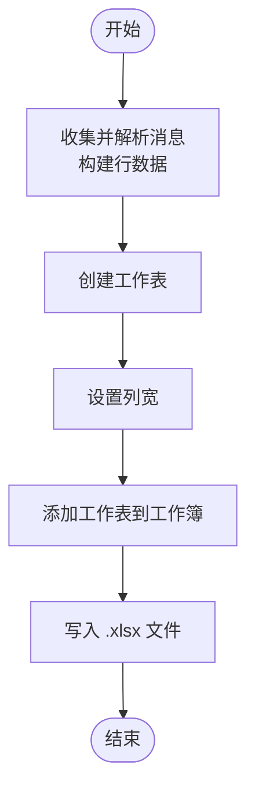
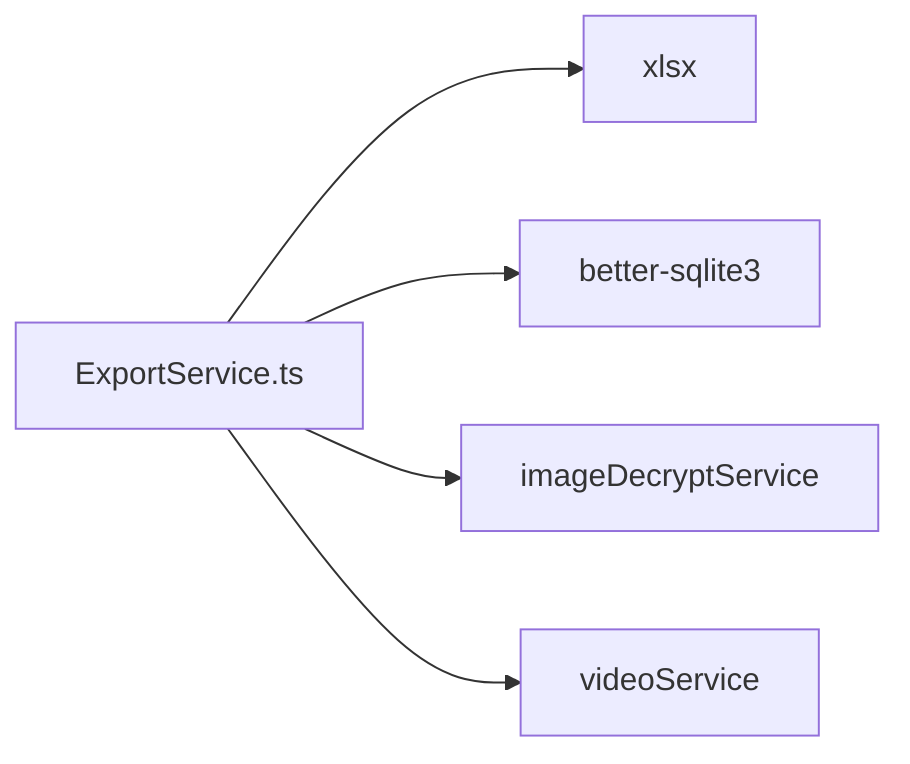

# Excel 格式

<cite>
**本文档引用的文件**
- [exportService.ts](file://electron/services/exportService.ts)
- [ExportPage.tsx](file://src/pages/ExportPage.tsx)
- [package.json](file://package.json)
- [package-lock.json](file://package-lock.json)
</cite>

## 目录
1. [简介](#简介)
2. [项目结构](#项目结构)
3. [核心组件](#核心组件)
4. [架构总览](#架构总览)
5. [详细组件分析](#详细组件分析)
6. [依赖关系分析](#依赖关系分析)
7. [性能考量](#性能考量)
8. [故障排除指南](#故障排除指南)
9. [结论](#结论)

## 简介
本文件针对 CipherTalk 的 Excel 格式导出功能进行系统化技术文档整理，重点覆盖以下方面：
- Excel 表格布局设计：xlsx 库集成、工作簿与工作表创建、单元格格式设置、数据类型处理
- 表格结构：列定义（时间戳、发送者、消息类型、内容、媒体链接等）、行数据组织、表头样式、数据验证规则
- 格式特性：多工作表支持、条件格式、数据透视、公式计算
- 导出选项：列宽自动调整、冻结窗格设置、筛选器添加、批注插入
- 兼容性与性能：Excel 兼容性考虑、文件大小限制、大数据量处理、错误处理机制与导出性能优化

## 项目结构
Excel 导出功能位于 Electron 后端服务模块中，前端通过页面组件触发导出流程，并传递导出参数与进度回调。

图表来源
- [exportService.ts:1681-1910](file://electron/services/exportService.ts#L1681-L1910)
- [ExportPage.tsx:410-448](file://src/pages/ExportPage.tsx#L410-L448)
- [package.json:55-55](file://package.json#L55-L55)

章节来源
- [exportService.ts:1681-1910](file://electron/services/exportService.ts#L1681-L1910)
- [ExportPage.tsx:410-448](file://src/pages/ExportPage.tsx#L410-L448)

## 核心组件
- 导出服务（ExportService）：负责连接数据库、读取消息、解析消息类型与内容、生成 Excel 工作簿与工作表、写入文件。
- Excel 工作簿与工作表：使用 xlsx 库创建工作簿、将 JSON 数据写入工作表、设置列宽与工作表名称。
- 前端导出页面（ExportPage.tsx）：提供导出格式选择、时间范围、导出选项（头像、媒体等），并监听导出进度。

章节来源
- [exportService.ts:1681-1910](file://electron/services/exportService.ts#L1681-L1910)
- [ExportPage.tsx:410-448](file://src/pages/ExportPage.tsx#L410-L448)

## 架构总览
Excel 导出的端到端流程如下：

图表来源
- [exportService.ts:1681-1910](file://electron/services/exportService.ts#L1681-L1910)
- [ExportPage.tsx:410-448](file://src/pages/ExportPage.tsx#L410-L448)

## 详细组件分析

### Excel 表格布局设计与实现
- xlsx 库集成：通过 npm 依赖引入，用于创建工作簿、工作表以及将 JSON 数据写入工作表。
- 工作簿与工作表创建：使用工作簿工厂创建新工作簿，将数组对象转换为工作表，再将工作表附加到工作簿。
- 单元格格式设置：通过设置工作表的列宽属性控制列宽；工作表名称按规则截断与替换特殊字符。
- 数据类型处理：将时间戳转换为本地化日期/时间字符串；消息类型映射为可读文本；聊天记录详情作为多行文本写入。

图表来源
- [exportService.ts:1858-1893](file://electron/services/exportService.ts#L1858-L1893)

章节来源
- [exportService.ts:1681-1910](file://electron/services/exportService.ts#L1681-L1910)

### 表格结构与列定义
- 表头列（固定列）：序号、时间、日期、时刻、星期、发送者、微信ID、消息类型、消息内容、原始类型代码、时间戳。
- 可选列：
  - 头像链接：当启用导出头像时添加。
  - 聊天记录详情：当存在聊天记录消息时添加，内容为多条记录的拼接。
- 行数据组织：按时间升序排列，每条消息生成一行，字段来自解析后的消息对象。
- 表头样式：通过列宽设置实现基础样式；未设置字体、颜色等样式属性。
- 数据验证规则：未实现显式的数据验证规则；可通过后续扩展添加。

章节来源
- [exportService.ts:1819-1856](file://electron/services/exportService.ts#L1819-L1856)

### 格式特性
- 多工作表支持：当前实现为每个会话创建一个工作表，工作表名为会话显示名称（截断与替换特殊字符）。
- 条件格式：未实现条件格式。
- 数据透视：未实现数据透视表。
- 公式计算：未实现公式列或计算字段。

章节来源
- [exportService.ts:1889-1893](file://electron/services/exportService.ts#L1889-L1893)

### 导出选项与界面联动
- 导出格式：前端提供多种格式选项，Excel 作为其中之一。
- 时间范围：前端允许设置起止日期，转换为时间戳后传递给后端。
- 导出选项：头像、图片、视频、表情、语音等可选开关，影响消息内容与媒体导出。
- 导出位置：前端选择导出目录，后端在该目录下创建会话子目录存放导出文件与媒体。

章节来源
- [ExportPage.tsx:410-448](file://src/pages/ExportPage.tsx#L410-L448)
- [ExportPage.tsx:81-90](file://src/pages/ExportPage.tsx#L81-L90)

### 媒体导出与路径映射
- 媒体导出：当启用图片/视频/表情导出时，后端会扫描消息表，提取媒体相关信息并复制到输出目录的子文件夹。
- 路径映射：将媒体文件的创建时间作为键，生成相对路径映射，用于在 Excel 中显示媒体链接。
- 语音导出：语音消息可生成转录文本，若启用导出则在消息内容中体现。

章节来源
- [exportService.ts:2233-2389](file://electron/services/exportService.ts#L2233-L2389)

## 依赖关系分析
- xlsx 库：用于创建工作簿、工作表与写入文件。
- better-sqlite3：用于读取 SQLite 数据库中的消息表与联系人表。
- 媒体服务：图片解密与视频解析服务，用于媒体导出。

图表来源
- [package.json:29-29](file://package.json#L29-L29)
- [package.json:55-55](file://package.json#L55-L55)
- [package-lock.json:10378-10398](file://package-lock.json#L10378-L10398)

章节来源
- [package.json:29-29](file://package.json#L29-L29)
- [package.json:55-55](file://package.json#L55-L55)
- [package-lock.json:10378-10398](file://package-lock.json#L10378-L10398)

## 性能考量
- 大数据量处理：当前实现逐条读取消息并构建行数据，未采用分页或流式写入策略。对于超大规模导出，建议：
  - 分批读取与分批写入：将消息分批处理，减少内存占用。
  - 流式写入：使用 xlsx 的流式 API 或分块写入，降低内存峰值。
- 列宽设置：根据是否导出头像与聊天记录详情动态设置列宽，避免不必要的宽度浪费。
- 并发与让出：导出过程中通过让出事件循环避免阻塞主进程，提升 UI 响应性。
- 媒体导出：媒体文件复制操作可能成为瓶颈，建议异步处理与并发限制。

## 故障排除指南
- 数据库未连接：检查账户目录与数据库是否存在，确认连接流程成功。
- 未找到消息表：确认会话 ID 正确且消息表存在，必要时检查数据库版本差异。
- 文件写入失败：检查输出路径权限与磁盘空间，确保目标文件未被占用。
- 导出空数据：确认时间范围设置合理，避免过滤掉所有消息。
- 媒体导出异常：检查媒体资源是否存在与可访问，网络或权限问题可能导致复制失败。

章节来源
- [exportService.ts:1688-1690](file://electron/services/exportService.ts#L1688-L1690)
- [exportService.ts:1698-1700](file://electron/services/exportService.ts#L1698-L1700)
- [exportService.ts:1896-1902](file://electron/services/exportService.ts#L1896-L1902)

## 结论
CipherTalk 的 Excel 导出功能基于 xlsx 库实现了从 SQLite 数据库读取消息、解析内容与类型、生成工作簿与工作表，并写入 .xlsx 文件。当前实现具备良好的可扩展性，可在不破坏现有结构的前提下增加条件格式、数据透视、公式计算、筛选器与冻结窗格等功能。同时，建议针对大数据量场景引入分页与流式写入策略，以提升性能与稳定性。