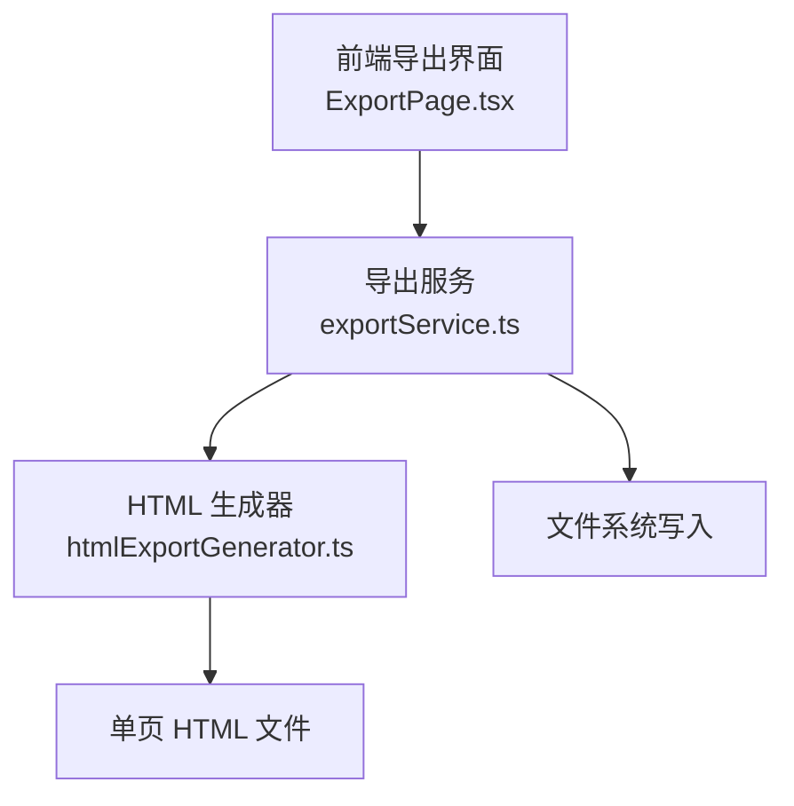
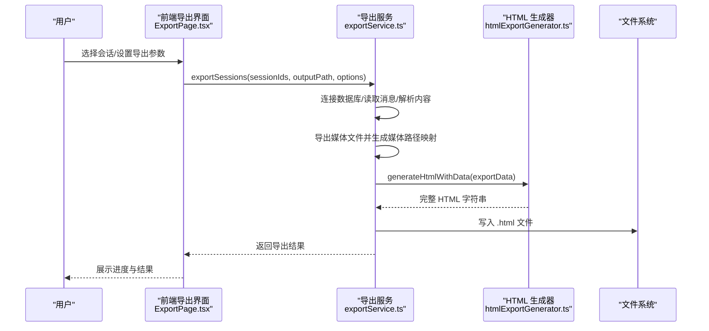
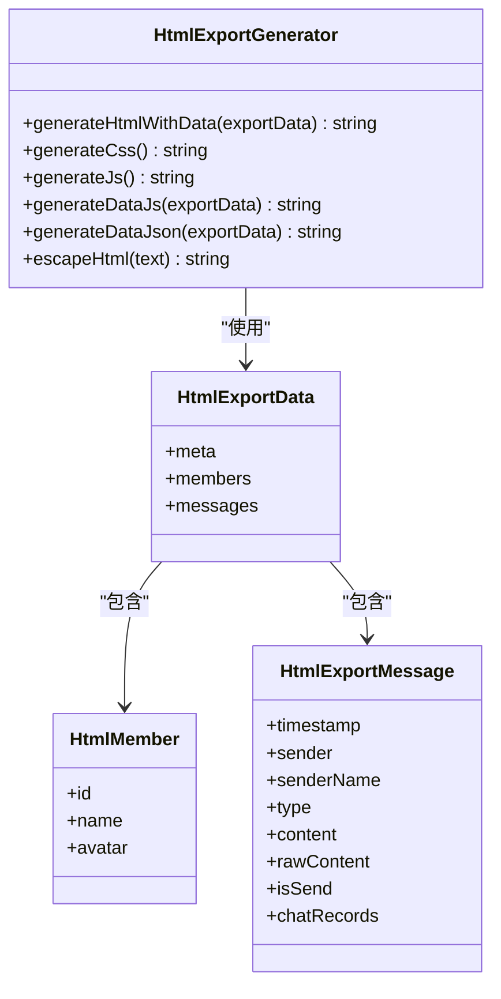
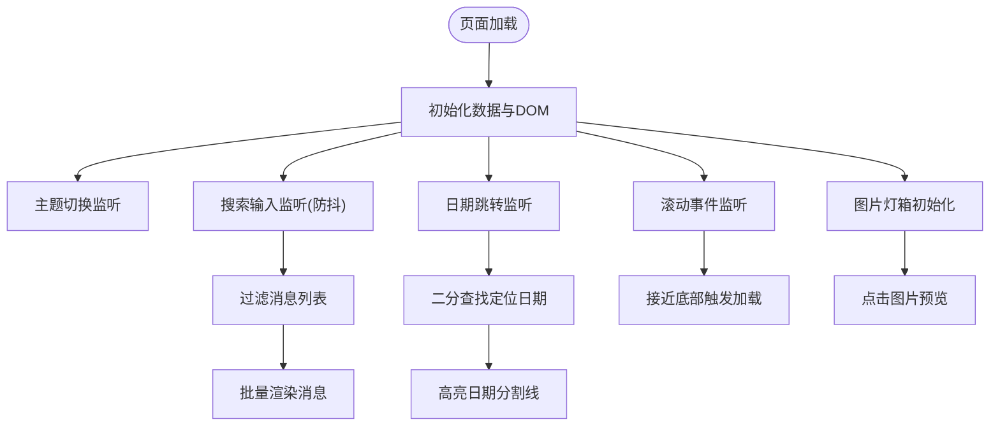
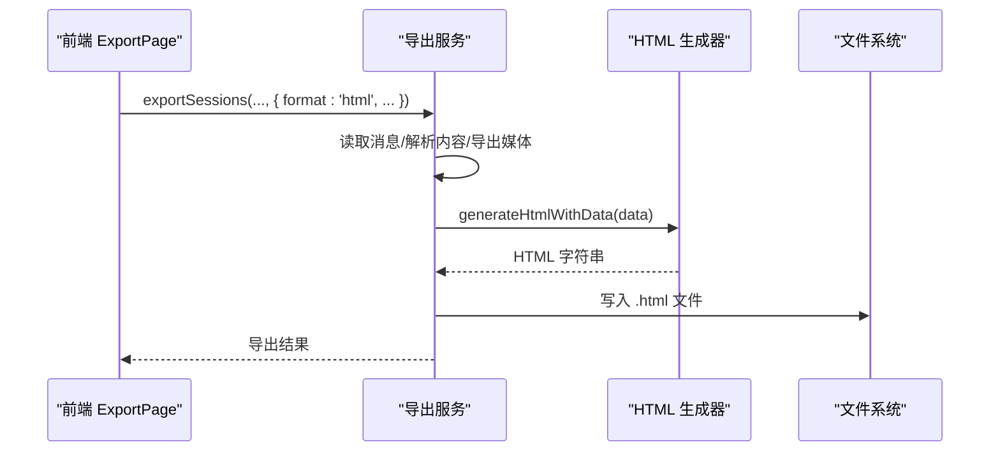
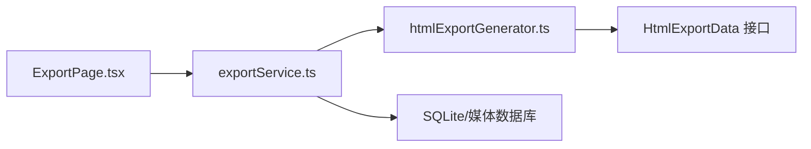

# HTML 格式

<cite>
**本文档引用的文件**
- [htmlExportGenerator.ts](file://electron/services/htmlExportGenerator.ts)
- [exportService.ts](file://electron/services/exportService.ts)
- [ExportPage.tsx](file://src/pages/ExportPage.tsx)
- [ExportPage.scss](file://src/pages/ExportPage.scss)
</cite>

## 目录
1. [简介](#简介)
2. [项目结构](#项目结构)
3. [核心组件](#核心组件)
4. [架构总览](#架构总览)
5. [详细组件分析](#详细组件分析)
6. [依赖关系分析](#依赖关系分析)
7. [性能考量](#性能考量)
8. [故障排除指南](#故障排除指南)
9. [结论](#结论)

## 简介
本文件针对 CipherTalk 的 HTML 格式导出功能进行深入技术文档化，重点围绕 HtmlExportGenerator 类的设计与实现，系统阐述其生成完整单页 HTML 的机制、CSS 样式体系、JavaScript 交互能力，以及与后端导出服务的协作流程。文档同时覆盖 HTML 输出结构、模板系统、导出特性（时间线、头像、链接跳转、图片预览）、定制选项、样式覆盖方法、浏览器兼容性与性能优化策略。

## 项目结构
HTML 导出功能涉及三层协作：
- 前端导出界面：负责用户交互、参数收集与进度展示
- 导出服务：负责数据库读取、消息解析、媒体导出与最终文件写入
- HTML 生成器：负责构建单页 HTML，内嵌 CSS/JS/数据

图表来源
- [ExportPage.tsx:410-448](file://src/pages/ExportPage.tsx#L410-L448)
- [exportService.ts:1914-2075](file://electron/services/exportService.ts#L1914-L2075)
- [htmlExportGenerator.ts:55-124](file://electron/services/htmlExportGenerator.ts#L55-L124)

章节来源
- [ExportPage.tsx:1-1017](file://src/pages/ExportPage.tsx#L1-L1017)
- [exportService.ts:1914-2075](file://electron/services/exportService.ts#L1914-L2075)
- [htmlExportGenerator.ts:51-124](file://electron/services/htmlExportGenerator.ts#L51-L124)

## 核心组件
- HtmlExportGenerator：静态类，提供生成完整 HTML 的核心方法，包括 generateHtmlWithData、generateCss、generateJs、generateDataJs、generateDataJson、escapeHtml 等。
- ExportService：后端服务，负责数据库连接、消息读取、内容解析、媒体导出、HTML 导出入口（exportSessionToHtml）等。
- 前端 ExportPage：提供导出界面与交互，调用 Electron API 触发导出流程。

章节来源
- [htmlExportGenerator.ts:51-1078](file://electron/services/htmlExportGenerator.ts#L51-L1078)
- [exportService.ts:1914-2075](file://electron/services/exportService.ts#L1914-L2075)
- [ExportPage.tsx:410-448](file://src/pages/ExportPage.tsx#L410-L448)

## 架构总览
HTML 导出的端到端流程如下：

图表来源
- [ExportPage.tsx:410-448](file://src/pages/ExportPage.tsx#L410-L448)
- [exportService.ts:1914-2075](file://electron/services/exportService.ts#L1914-L2075)
- [htmlExportGenerator.ts:55-124](file://electron/services/htmlExportGenerator.ts#L55-L124)

## 详细组件分析

### HtmlExportGenerator 类设计与实现
- 数据模型接口
  - HtmlExportData：包含 meta（会话信息、导出时间、消息计数、日期范围）、members（成员列表）、messages（消息列表）
  - HtmlExportMessage：消息项，包含时间戳、发送方、类型、内容、是否发送、可选的聊天记录数组
  - HtmlMember：成员信息，包含 id、name、可选头像
- 生成流程
  - generateHtmlWithData：拼装 DOCTYPE、meta、title、内联 CSS、消息容器、底部信息、图片预览层、内联数据与内联 JS
  - generateCss：提供深浅主题变量与完整样式规则，含响应式适配
  - generateJs：提供主题切换、搜索、日期跳转、滚动加载、图片灯箱、消息渲染等交互逻辑
  - escapeHtml：对用户输入与内容进行 HTML 转义，防止 XSS
- 输出结构要点
  - DOCTYPE 声明与 lang 属性
  - meta charset、viewport、title
  - 内联样式与内联脚本
  - 头部区域（头像、名称、消息数、日期范围）
  - 搜索栏与日期跳转栏
  - 消息容器与加载指示器
  - 底部版权信息
  - 图片预览灯箱

图表来源
- [htmlExportGenerator.ts:7-49](file://electron/services/htmlExportGenerator.ts#L7-L49)
- [htmlExportGenerator.ts:51-124](file://electron/services/htmlExportGenerator.ts#L51-L124)

章节来源
- [htmlExportGenerator.ts:51-1078](file://electron/services/htmlExportGenerator.ts#L51-L1078)

### CSS 样式系统与主题
- 主题变量：通过 CSS 变量定义浅色/深色主题的颜色体系，支持 data-theme 属性切换
- 布局结构：头部、搜索栏、日期跳转栏、消息体、底部版权、图片灯箱
- 消息样式：日期分割线、系统消息、消息行、头像、气泡、时间、媒体（图片/视频/表情/语音）
- 响应式：在小屏设备上限制最大宽度与媒体尺寸
- 样式覆盖：可通过外部注入 CSS 或修改 data-theme 属性实现主题定制

章节来源
- [htmlExportGenerator.ts:129-672](file://electron/services/htmlExportGenerator.ts#L129-L672)

### JavaScript 交互功能
- 主题切换：通过 data-theme 属性切换深浅主题
- 搜索：输入框防抖搜索，支持消息内容与发送者名称模糊匹配，显示结果数量
- 日期跳转：设置日期范围，二分查找定位目标日期第一条消息并高亮
- 滚动加载：虚拟批处理加载消息，提升大数据量下的性能
- 媒体处理：图片/视频/表情渲染，错误占位，点击预览；语音播放器
- 渲染引擎：按消息类型渲染内容，支持聊天记录引用块

图表来源
- [htmlExportGenerator.ts:678-1046](file://electron/services/htmlExportGenerator.ts#L678-L1046)

章节来源
- [htmlExportGenerator.ts:678-1046](file://electron/services/htmlExportGenerator.ts#L678-L1046)

### 导出服务与媒体导出
- 导出入口：exportSessionToHtml 将消息与成员信息整理为 HtmlExportData，调用 HtmlExportGenerator 生成完整 HTML 并写入文件
- 媒体导出：根据选项导出图片、视频、表情、语音，生成 createTime → 相对路径 的映射表，供 HTML 中的媒体渲染使用
- 前端触发：ExportPage 收集用户选择的会话、时间范围、导出选项，调用 Electron API 触发导出

图表来源
- [ExportPage.tsx:410-448](file://src/pages/ExportPage.tsx#L410-L448)
- [exportService.ts:1914-2075](file://electron/services/exportService.ts#L1914-L2075)
- [htmlExportGenerator.ts:55-124](file://electron/services/htmlExportGenerator.ts#L55-L124)

章节来源
- [exportService.ts:1914-2075](file://electron/services/exportService.ts#L1914-L2075)
- [ExportPage.tsx:410-448](file://src/pages/ExportPage.tsx#L410-L448)

### HTML 输出结构详解
- 文档声明与语言：标准 DOCTYPE 与 lang="zh-CN"
- 元信息：charset、viewport、title（会话名 + 聊天记录）
- 样式：内联 CSS，包含主题变量、布局、消息样式、媒体样式、响应式规则
- 结构：头部（头像、名称、消息数、日期范围）、搜索栏、日期跳转栏、消息体容器、底部版权、图片灯箱
- 数据与脚本：内联 window.CHAT_DATA，内联 JS 负责渲染与交互
- 响应式：在小屏设备上限制气泡宽度与媒体尺寸

章节来源
- [htmlExportGenerator.ts:66-124](file://electron/services/htmlExportGenerator.ts#L66-L124)

### 模板系统与动态内容
- 主题样式选择：通过 data-theme 属性切换深浅主题，CSS 变量自动更新
- 自定义 CSS 注入：HTML 采用内联样式，不支持外链样式；如需覆盖，可在外部页面引入额外样式或修改主题变量
- 动态内容填充：消息列表按时间顺序渲染，日期分割线按天生成；搜索与日期跳转实时更新 DOM
- 媒体文件内联处理：图片/视频/表情/语音导出为本地文件，HTML 中以相对路径引用

章节来源
- [htmlExportGenerator.ts:129-672](file://electron/services/htmlExportGenerator.ts#L129-L672)
- [exportService.ts:2233-2614](file://electron/services/exportService.ts#L2233-L2614)

### 导出特性
- 消息时间线显示：按天分隔，支持高亮动画
- 联系人头像展示：优先使用真实头像，失败时回退到首字母占位
- 链接点击跳转：文本中的链接可点击跳转
- 图片预览功能：点击图片弹出灯箱，支持点击外部关闭

章节来源
- [htmlExportGenerator.ts:902-946](file://electron/services/htmlExportGenerator.ts#L902-L946)
- [htmlExportGenerator.ts:854-873](file://electron/services/htmlExportGenerator.ts#L854-L873)

## 依赖关系分析
- 前端导出界面依赖 Electron API 与导出服务
- 导出服务依赖数据库连接、消息解析、媒体导出工具
- HTML 生成器独立于前端，仅依赖数据模型与内联资源

图表来源
- [ExportPage.tsx:410-448](file://src/pages/ExportPage.tsx#L410-L448)
- [exportService.ts:1914-2075](file://electron/services/exportService.ts#L1914-L2075)
- [htmlExportGenerator.ts:51-124](file://electron/services/htmlExportGenerator.ts#L51-L124)

章节来源
- [ExportPage.tsx:1-1017](file://src/pages/ExportPage.tsx#L1-L1017)
- [exportService.ts:1914-2075](file://electron/services/exportService.ts#L1914-L2075)
- [htmlExportGenerator.ts:51-124](file://electron/services/htmlExportGenerator.ts#L51-L124)

## 性能考量
- 滚动加载：采用批处理（BATCH=50）按需渲染，避免一次性渲染大量消息导致卡顿
- 防抖搜索：输入防抖 300ms，降低频繁重渲染
- 二分查找：日期跳转使用二分查找快速定位目标日期第一条消息
- 媒体懒加载：图片与视频使用 loading="lazy"，减少初始渲染压力
- 内联资源：CSS/JS/数据内联，减少网络请求，提升首屏渲染速度

章节来源
- [htmlExportGenerator.ts:694-743](file://electron/services/htmlExportGenerator.ts#L694-L743)
- [htmlExportGenerator.ts:1008-1038](file://electron/services/htmlExportGenerator.ts#L1008-L1038)

## 故障排除指南
- HTML 无法显示或样式异常
  - 检查是否正确生成内联 CSS/JS/数据
  - 确认 data-theme 属性与主题变量一致
- 搜索无结果或异常
  - 确认搜索输入已触发防抖逻辑
  - 检查消息内容与发送者名称是否包含关键词
- 日期跳转无效
  - 确认消息时间戳范围与日期选择器范围一致
  - 检查二分查找逻辑与目标日期是否存在消息
- 媒体加载失败
  - 检查媒体导出是否成功与路径映射是否正确
  - 确认图片 onerror 回退逻辑是否生效

章节来源
- [htmlExportGenerator.ts:703-743](file://electron/services/htmlExportGenerator.ts#L703-L743)
- [htmlExportGenerator.ts:745-852](file://electron/services/htmlExportGenerator.ts#L745-L852)
- [htmlExportGenerator.ts:866-873](file://electron/services/htmlExportGenerator.ts#L866-L873)

## 结论
HtmlExportGenerator 通过内联 CSS/JS/数据的方式，实现了轻量、可移植、无需外部依赖的单页 HTML 导出方案。配合导出服务的数据库读取、消息解析与媒体导出能力，以及前端导出界面的交互体验，形成了完整的 HTML 导出闭环。该方案在保证功能完整性的同时，兼顾了性能与易用性，适合离线查看与分享聊天记录场景。