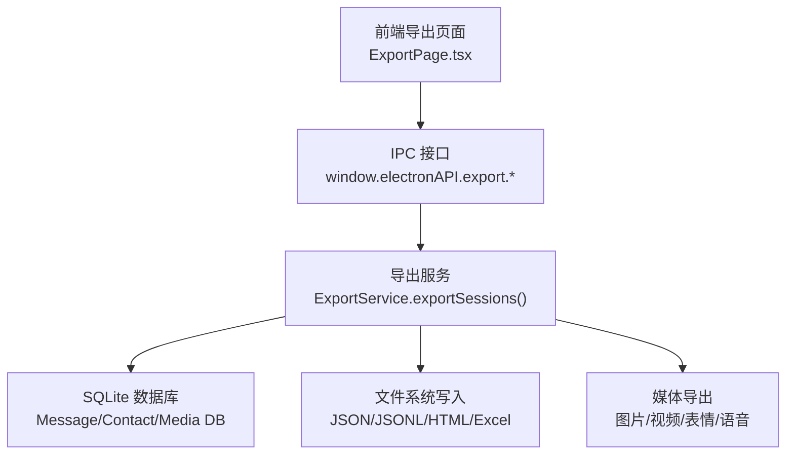
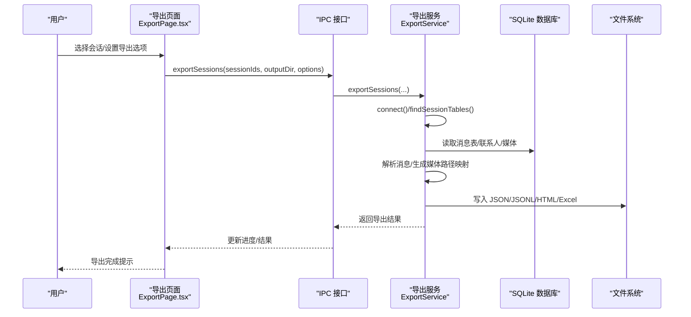
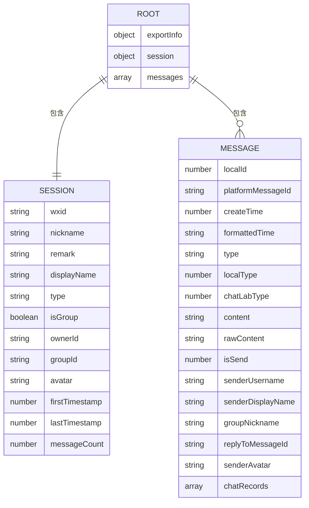
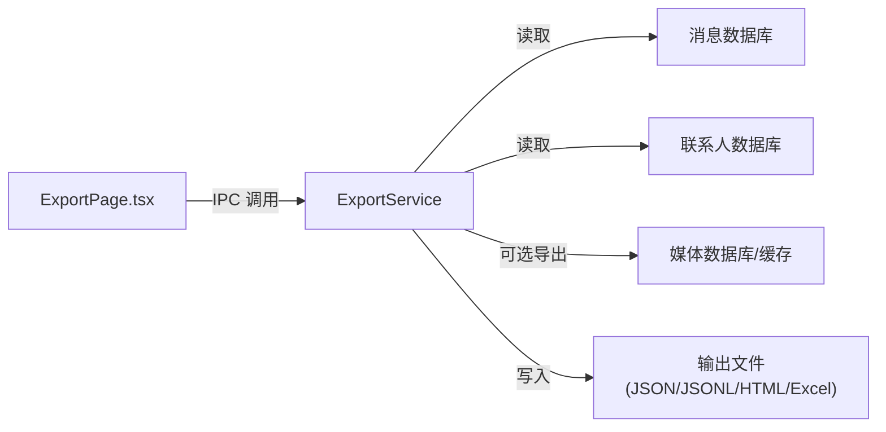

# JSON 格式

<cite>
**本文档引用的文件**
- [exportService.ts](file://electron/services/exportService.ts)
- [ExportPage.tsx](file://src/pages/ExportPage.tsx)
</cite>

## 目录
1. [简介](#简介)
2. [项目结构](#项目结构)
3. [核心组件](#核心组件)
4. [架构总览](#架构总览)
5. [详细组件分析](#详细组件分析)
6. [依赖关系分析](#依赖关系分析)
7. [性能考虑](#性能考虑)
8. [故障排除指南](#故障排除指南)
9. [结论](#结论)
10. [附录](#附录)

## 简介
本文件面向 CipherTalk 的 JSON 格式导出功能，提供技术文档与使用说明。重点涵盖：
- JSON 层次化数据组织结构：根对象包含导出元信息、会话基本信息、消息数组、联系人信息等
- 消息对象字段定义：时间戳、发送者信息、消息类型、内容文本、媒体文件路径、引用消息标识
- JSON 格式的优点：易于解析、跨平台兼容、适合程序处理
- 导出选项：日期范围过滤、媒体文件包含、头像导出、消息类型过滤
- JSON Schema 定义与实际导出示例，展示不同场景下的输出格式差异

## 项目结构
与 JSON 导出相关的核心模块位于 Electron 主进程服务层与前端导出页面之间，形成“前端配置 + 主进程导出”的协作关系。

图表来源
- [ExportPage.tsx:1-800](file://src/pages/ExportPage.tsx#L1-L800)
- [exportService.ts:2119-2228](file://electron/services/exportService.ts#L2119-L2228)

章节来源
- [ExportPage.tsx:1-800](file://src/pages/ExportPage.tsx#L1-L800)
- [exportService.ts:2119-2228](file://electron/services/exportService.ts#L2119-L2228)

## 核心组件
- 导出服务（ExportService）：负责连接数据库、读取消息、解析内容、导出媒体、生成 JSON/JSONL/HTML/Excel 等格式
- 导出页面（ExportPage）：提供导出配置界面，包括格式选择、时间范围、媒体导出开关、导出位置等

章节来源
- [exportService.ts:117-127](file://electron/services/exportService.ts#L117-L127)
- [ExportPage.tsx:81-90](file://src/pages/ExportPage.tsx#L81-L90)

## 架构总览
下面的序列图展示了从用户选择导出到最终生成 JSON 文件的关键流程：

图表来源
- [ExportPage.tsx:410-448](file://src/pages/ExportPage.tsx#L410-L448)
- [exportService.ts:2119-2228](file://electron/services/exportService.ts#L2119-L2228)
- [exportService.ts:1452-1677](file://electron/services/exportService.ts#L1452-L1677)

## 详细组件分析

### JSON 导出数据模型
- 根对象包含导出元信息与会话/消息数据
- 会话信息包含会话 ID、显示名称、类型（群聊/私聊）、头像、消息计数、时间范围等
- 消息数组包含每条消息的完整字段，支持媒体路径映射与聊天记录嵌套

图表来源
- [exportService.ts:1636-1660](file://electron/services/exportService.ts#L1636-L1660)
- [exportService.ts:1573-1591](file://electron/services/exportService.ts#L1573-L1591)

章节来源
- [exportService.ts:1636-1660](file://electron/services/exportService.ts#L1636-L1660)
- [exportService.ts:1573-1591](file://electron/services/exportService.ts#L1573-L1591)

### 消息对象字段定义
- 时间戳与格式化时间：createTime（秒）、formattedTime（YYYY-MM-DD HH:mm:ss）
- 发送者信息：senderUsername、senderDisplayName、senderAvatar（可选）
- 消息类型：type（人类可读）、localType（原始类型）、chatLabType（标准化类型）
- 内容文本：content（解析后的可读文本，含媒体占位符）
- 平台消息标识：platformMessageId（server_id/local_id）
- 引用消息标识：replyToMessageId（XML type=57 时提取）
- 群昵称：groupNickname（群聊时提取）
- 聊天记录嵌套：chatRecords（XML type=19 时解析）

章节来源
- [exportService.ts:1573-1591](file://electron/services/exportService.ts#L1573-L1591)
- [exportService.ts:1554-1561](file://electron/services/exportService.ts#L1554-L1561)
- [exportService.ts:1566-1571](file://electron/services/exportService.ts#L1566-L1571)

### 导出选项与行为
- 日期范围过滤：按 create_time 在指定范围内筛选
- 媒体文件包含：导出图片/视频/表情/语音，并生成媒体路径映射，消息内容替换为相对路径占位符
- 头像导出：联系人与消息发送者头像可选导出
- 消息类型过滤：通过消息类型映射与解析逻辑控制导出内容

章节来源
- [exportService.ts:1512-1516](file://electron/services/exportService.ts#L1512-L1516)
- [exportService.ts:2170-2188](file://electron/services/exportService.ts#L2170-L2188)
- [exportService.ts:2233-2614](file://electron/services/exportService.ts#L2233-L2614)
- [ExportPage.tsx:419-430](file://src/pages/ExportPage.tsx#L419-L430)

### JSON Schema 定义
以下为 JSON 输出的 Schema 要点（基于代码实现归纳）：
- 根对象字段
  - exportInfo：版本、导出时间、生成器、格式标识
  - session：会话元信息（wxid、nickname、remark、displayName、type、isGroup、ownerId、groupId、avatar、firstTimestamp、lastTimestamp、messageCount）
  - messages：消息数组，每条消息包含上述“消息对象字段定义”中的字段
- 消息对象字段
  - 必填：localId、platformMessageId、createTime、formattedTime、type、localType、chatLabType、content、isSend、senderUsername、senderDisplayName
  - 可选：groupNickname、replyToMessageId、senderAvatar、chatRecords、rawContent
- 聊天记录（chatRecords）
  - 数组项包含：sender、senderDisplayName、timestamp、formattedTime、type、datatype、content、senderAvatar（可选）、fileExt（可选）、fileSize（可选）

章节来源
- [exportService.ts:1636-1660](file://electron/services/exportService.ts#L1636-L1660)
- [exportService.ts:1176-1257](file://electron/services/exportService.ts#L1176-L1257)

### 实际导出示例（场景差异）
- 场景 A：仅导出文本消息（不包含媒体）
  - 消息 content 为纯文本或占位符；不生成媒体路径映射
- 场景 B：导出包含图片/视频/表情/语音
  - 消息 content 中的媒体以相对路径占位符形式出现（如 images/yyyyMMdd/filename.ext）
  - 生成媒体目录与文件，同时在消息中记录 createTime → 相对路径 的映射
- 场景 C：包含聊天记录与引用消息
  - chatRecords：嵌套消息列表
  - replyToMessageId：引用消息标识
- 场景 D：包含头像
  - session.avatar 与消息 senderAvatar 可选出现在根对象与消息对象中

章节来源
- [exportService.ts:2170-2188](file://electron/services/exportService.ts#L2170-L2188)
- [exportService.ts:1588-1589](file://electron/services/exportService.ts#L1588-L1589)
- [exportService.ts:1176-1257](file://electron/services/exportService.ts#L1176-L1257)

## 依赖关系分析
- 前端导出页面通过 IPC 调用主进程导出服务
- 导出服务依赖 SQLite 数据库读取消息与联系人信息，必要时导出媒体文件
- 媒体导出涉及图片/视频/表情/语音的多源获取与解密流程

图表来源
- [ExportPage.tsx:410-448](file://src/pages/ExportPage.tsx#L410-L448)
- [exportService.ts:2119-2228](file://electron/services/exportService.ts#L2119-L2228)

章节来源
- [ExportPage.tsx:410-448](file://src/pages/ExportPage.tsx#L410-L448)
- [exportService.ts:2119-2228](file://electron/services/exportService.ts#L2119-L2228)

## 性能考虑
- 分批读取与排序：按 create_time 升序读取，避免一次性加载过多消息导致内存压力
- 媒体导出串行化：语音导出采用串行策略，降低内存占用与 I/O 压力
- 媒体路径映射：通过 createTime → 相对路径 的映射减少重复 I/O
- 压缩与解压：对压缩内容进行解压后再解析，确保文本正确性

## 故障排除指南
- 未找到会话消息：检查 sessionId 是否正确，确认消息表是否存在
- 数据库未连接：确认已成功连接并定位到正确的账户目录
- 媒体导出失败：检查媒体数据库与缓存路径，确认网络可达性（下载 CDN 表情）
- 文件写入失败：检查输出目录权限与磁盘空间

章节来源
- [exportService.ts:744-748](file://electron/services/exportService.ts#L744-L748)
- [exportService.ts:2130-2134](file://electron/services/exportService.ts#L2130-L2134)
- [exportService.ts:2456-2604](file://electron/services/exportService.ts#L2456-L2604)

## 结论
CipherTalk 的 JSON 导出功能以清晰的层次化结构与丰富的字段定义，提供了高可读性与强兼容性的数据格式。通过灵活的导出选项与完善的媒体处理机制，能够满足多样化的归档与分析需求。建议在大规模导出时结合日期范围与媒体导出开关，以平衡性能与完整性。

## 附录

### JSON 字段对照表
- 根对象
  - exportInfo.version/exportedAt/generator/format
  - session.wxid/session.nickname/session.remark/session.displayName/session.type/session.isGroup/session.ownerId/session.groupId/session.avatar/session.firstTimestamp/session.lastTimestamp/session.messageCount
  - messages[]
- 消息对象
  - localId/platformMessageId/createTime/formattedTime/type/localType/chatLabType/content/rawContent/isSend/senderUsername/senderDisplayName/groupNickname/replyToMessageId/senderAvatar/chatRecords/rawContent

章节来源
- [exportService.ts:1636-1660](file://electron/services/exportService.ts#L1636-L1660)
- [exportService.ts:1573-1591](file://electron/services/exportService.ts#L1573-L1591)