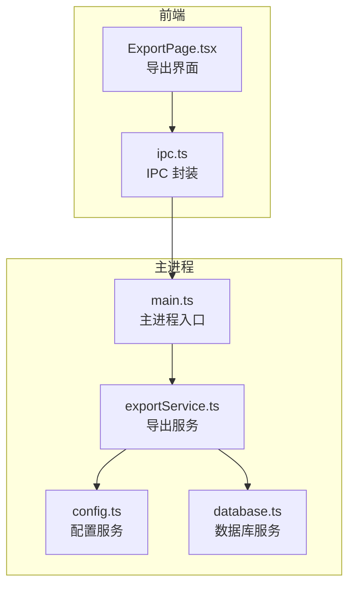
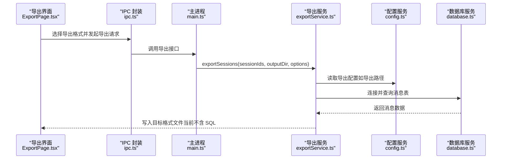
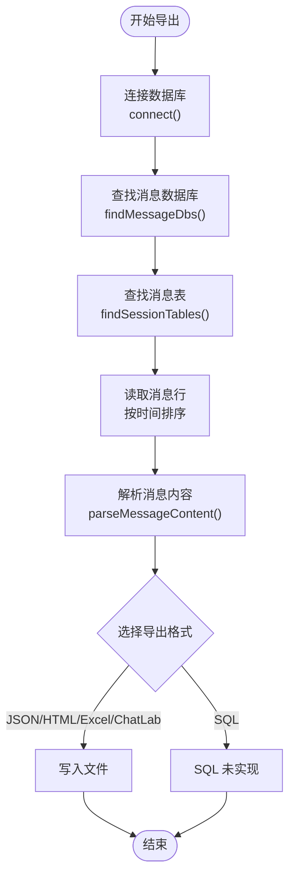
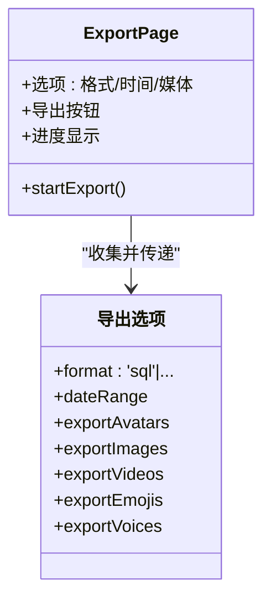
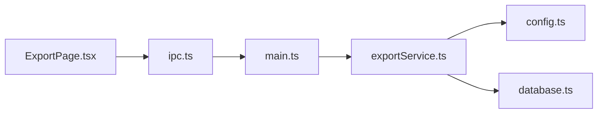
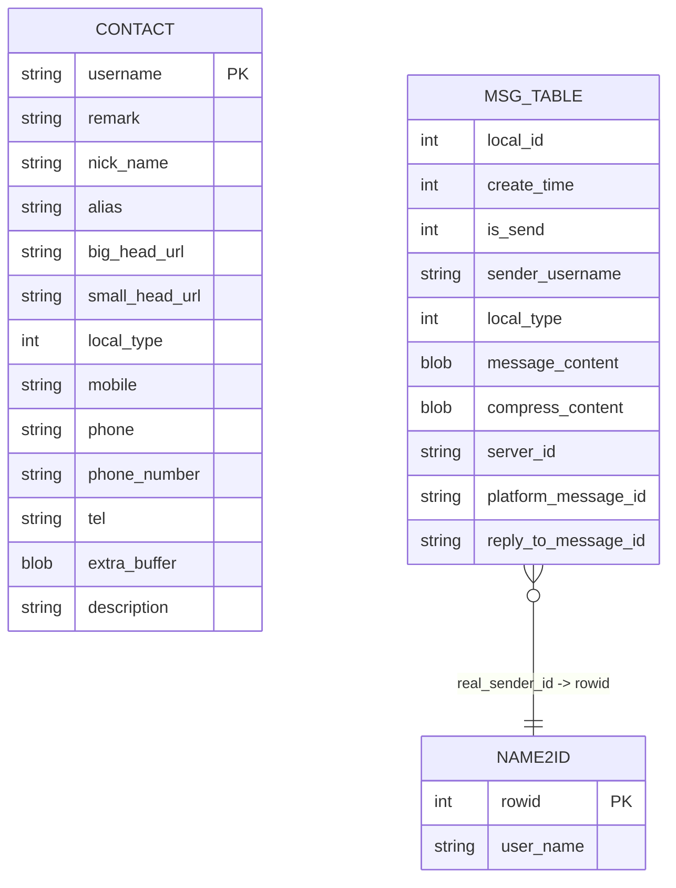
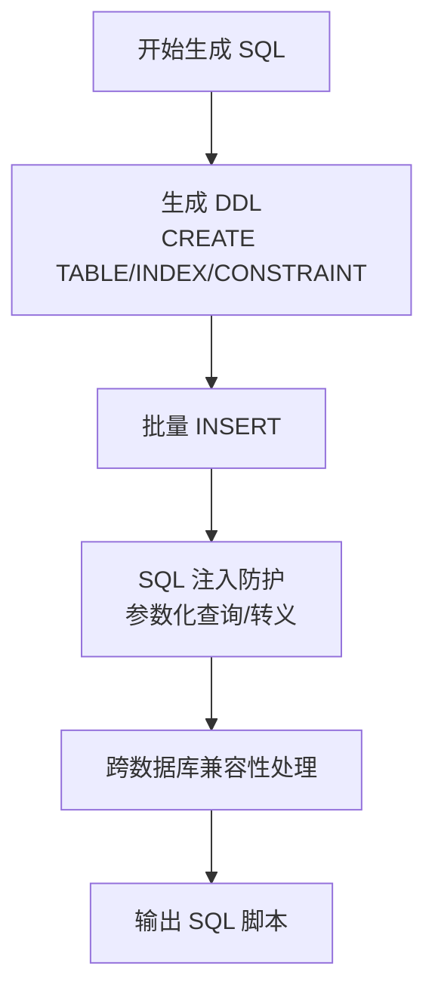

# SQL 格式

<cite>
**本文档引用的文件**
- [exportService.ts](file://electron/services/exportService.ts)
- [ExportPage.tsx](file://src/pages/ExportPage.tsx)
- [main.ts](file://electron/main.ts)
- [config.ts](file://electron/services/config.ts)
- [database.ts](file://electron/services/database.ts)
- [ipc.ts](file://src/services/ipc.ts)
- [README.md](file://README.md)
- [package.json](file://package.json)
</cite>

## 目录
1. [简介](#简介)
2. [项目结构](#项目结构)
3. [核心组件](#核心组件)
4. [架构总览](#架构总览)
5. [详细组件分析](#详细组件分析)
6. [依赖分析](#依赖分析)
7. [性能考量](#性能考量)
8. [故障排除指南](#故障排除指南)
9. [结论](#结论)
10. [附录](#附录)

## 简介
本文件针对 CipherTalk 的 SQL 格式导出功能进行深入技术说明。当前项目在导出界面中提供了 "PostgreSQL" 格式选项，但经源码分析发现，实际导出实现并未包含 SQL 脚本生成逻辑。本文档基于现有代码，梳理了导出功能的现状、数据库结构设计、消息数据转换与安全处理机制，并提供 SQL 脚本生成的实现建议与最佳实践。

## 项目结构
- 前端导出界面位于 `src/pages/ExportPage.tsx`，负责用户交互与导出参数配置。
- 导出核心逻辑位于 `electron/services/exportService.ts`，包含多种格式导出（JSON、HTML、Excel、ChatLab 等）。
- 主进程通过 IPC 与前端通信，注册导出相关接口。
- 配置服务与数据库服务分别提供配置读取与 SQLite 数据访问能力。

**图示来源**
- [ExportPage.tsx:476-484](file://src/pages/ExportPage.tsx#L476-L484)
- [main.ts:19-19](file://electron/main.ts#L19-L19)
- [exportService.ts:86-127](file://electron/services/exportService.ts#L86-L127)
- [config.ts:126-134](file://electron/services/config.ts#L126-L134)
- [database.ts:5-82](file://electron/services/database.ts#L5-L82)

**章节来源**
- [ExportPage.tsx:476-484](file://src/pages/ExportPage.tsx#L476-L484)
- [main.ts:19-19](file://electron/main.ts#L19-L19)
- [exportService.ts:86-127](file://electron/services/exportService.ts#L86-L127)
- [config.ts:126-134](file://electron/services/config.ts#L126-L134)
- [database.ts:5-82](file://electron/services/database.ts#L5-L82)

## 核心组件
- 导出服务（ExportService）：负责连接数据库、读取消息表、解析消息内容、生成目标格式文件。
- 配置服务（ConfigService）：提供导出路径、微信 ID 等配置项。
- 数据库服务（DatabaseService）：提供 SQLite 只读连接与查询能力。
- 导出界面（ExportPage.tsx）：提供导出格式选择（含 PostgreSQL 选项）与导出控制。

**章节来源**
- [exportService.ts:117-127](file://electron/services/exportService.ts#L117-L127)
- [config.ts:126-134](file://electron/services/config.ts#L126-L134)
- [database.ts:5-82](file://electron/services/database.ts#L5-L82)
- [ExportPage.tsx:476-484](file://src/pages/ExportPage.tsx#L476-L484)

## 架构总览
导出流程从前端界面触发，通过 IPC 调用主进程的导出服务，导出服务连接数据库并读取消息表，解析消息内容后生成目标格式文件。

**图示来源**
- [ExportPage.tsx:432-441](file://src/pages/ExportPage.tsx#L432-L441)
- [ipc.ts:1-38](file://src/services/ipc.ts#L1-L38)
- [main.ts:19-19](file://electron/main.ts#L19-L19)
- [exportService.ts:2119-2228](file://electron/services/exportService.ts#L2119-L2228)
- [config.ts:248-273](file://electron/services/config.ts#L248-L273)
- [database.ts:11-44](file://electron/services/database.ts#L11-L44)

## 详细组件分析

### 导出服务（ExportService）
- 连接与数据库：通过 `connect()` 方法定位账户目录下的数据库文件，建立只读连接；支持缓存多个消息数据库连接。
- 消息表查找：通过 `findSessionTables()` 在多个消息数据库中查找对应会话的消息表。
- 消息解析：提供多种消息类型的解析与转换逻辑，包括文本、图片、语音、视频、表情、链接、小程序、转账等。
- 导出格式：当前实现包含 ChatLab、JSON、HTML、Excel 等格式导出，但未包含 SQL 脚本生成。

**图示来源**
- [exportService.ts:220-251](file://electron/services/exportService.ts#L220-L251)
- [exportService.ts:279-327](file://electron/services/exportService.ts#L279-L327)
- [exportService.ts:717-1090](file://electron/services/exportService.ts#L717-L1090)
- [exportService.ts:2119-2228](file://electron/services/exportService.ts#L2119-L2228)

**章节来源**
- [exportService.ts:220-251](file://electron/services/exportService.ts#L220-L251)
- [exportService.ts:279-327](file://electron/services/exportService.ts#L279-L327)
- [exportService.ts:717-1090](file://electron/services/exportService.ts#L717-L1090)
- [exportService.ts:2119-2228](file://electron/services/exportService.ts#L2119-L2228)

### 导出界面（ExportPage.tsx）
- 导出格式选项：包含 ChatLab、JSON、HTML、TXT、Excel、PostgreSQL 等格式。
- 参数配置：支持时间范围、导出头像、图片、视频、表情、语音等选项。
- 导出触发：调用 IPC 接口执行导出，当前对 PostgreSQL 选项会提示“开发中”。

**图示来源**
- [ExportPage.tsx:27-90](file://src/pages/ExportPage.tsx#L27-L90)
- [ExportPage.tsx:476-484](file://src/pages/ExportPage.tsx#L476-L484)
- [ExportPage.tsx:432-441](file://src/pages/ExportPage.tsx#L432-L441)

**章节来源**
- [ExportPage.tsx:27-90](file://src/pages/ExportPage.tsx#L27-L90)
- [ExportPage.tsx:476-484](file://src/pages/ExportPage.tsx#L476-L484)
- [ExportPage.tsx:432-441](file://src/pages/ExportPage.tsx#L432-L441)

### 数据库服务（DatabaseService）
- 提供 SQLite 只读连接、查询与关闭能力，用于导出服务读取数据库表数据。

**章节来源**
- [database.ts:5-82](file://electron/services/database.ts#L5-L82)

### 配置服务（ConfigService）
- 提供导出路径、微信 ID 等配置项，导出服务通过该服务读取配置。

**章节来源**
- [config.ts:248-273](file://electron/services/config.ts#L248-L273)

## 依赖分析
- 依赖关系：导出服务依赖配置服务与数据库服务；前端通过 IPC 与主进程通信；主进程注册导出接口。
- 外部依赖：better-sqlite3 用于 SQLite 访问；xlsx 用于 Excel 导出；fzstd 用于解压；silk-wasm 用于语音解码等。

**图示来源**
- [exportService.ts:117-127](file://electron/services/exportService.ts#L117-L127)
- [config.ts:126-134](file://electron/services/config.ts#L126-L134)
- [database.ts:5-82](file://electron/services/database.ts#L5-L82)
- [ExportPage.tsx:1-38](file://src/pages/ExportPage.tsx#L1-L38)
- [ipc.ts:1-38](file://src/services/ipc.ts#L1-L38)
- [main.ts:19-19](file://electron/main.ts#L19-L19)

**章节来源**
- [exportService.ts:117-127](file://electron/services/exportService.ts#L117-L127)
- [config.ts:126-134](file://electron/services/config.ts#L126-L134)
- [database.ts:5-82](file://electron/services/database.ts#L5-L82)
- [ExportPage.tsx:1-38](file://src/pages/ExportPage.tsx#L1-L38)
- [ipc.ts:1-38](file://src/services/ipc.ts#L1-L38)
- [main.ts:19-19](file://electron/main.ts#L19-L19)

## 性能考量
- 数据库连接缓存：导出服务对消息数据库连接进行缓存，减少重复打开连接的开销。
- 分页与批量处理：当前实现为一次性读取表数据，对于超大数据量建议采用分页或流式处理策略。
- 媒体导出：图片、视频、表情、语音导出涉及文件 IO 与网络下载，建议异步处理并提供进度反馈。
- 内存管理：语音解码使用 silk-wasm，需注意内存释放与错误处理。

**章节来源**
- [exportService.ts:122-123](file://electron/services/exportService.ts#L122-L123)
- [exportService.ts:2486-2601](file://electron/services/exportService.ts#L2486-L2601)

## 故障排除指南
- 数据库未连接：检查微信 ID 配置与数据库目录是否存在。
- 未找到消息表：确认会话 ID 正确且消息数据库文件存在。
- 导出格式不可用：当前 PostgreSQL 选项提示“开发中”，需等待后续实现。
- 文件写入失败：检查导出目录权限与磁盘空间。

**章节来源**
- [exportService.ts:220-251](file://electron/services/exportService.ts#L220-L251)
- [exportService.ts:314-327](file://electron/services/exportService.ts#L314-L327)
- [ExportPage.tsx:439-441](file://src/pages/ExportPage.tsx#L439-L441)

## 结论
- 当前项目在导出界面提供了 PostgreSQL 格式选项，但导出服务尚未实现 SQL 脚本生成逻辑。
- 导出服务具备完善的数据库连接、消息解析与多格式导出能力，可作为 SQL 导出功能的基础设施。
- 建议在现有基础上扩展 SQL 脚本生成模块，遵循数据库兼容性与安全性原则。

## 附录

### 数据库结构设计（基于现有实现）
- 消息表：通过 `Msg_<hash>` 命名规则在消息数据库中查找，支持 Name2Id 关联真实发送者。
- 联系人表：contact 表包含用户名、备注、昵称、头像等字段，部分版本包含手机号字段。
- 媒体数据库：MediaDb 包含 VoiceInfo 等表，用于语音消息的解码与导出。

**图示来源**
- [exportService.ts:337-350](file://electron/services/exportService.ts#L337-L350)
- [exportService.ts:1493-1505](file://electron/services/exportService.ts#L1493-L1505)
- [exportService.ts:2508-2526](file://electron/services/exportService.ts#L2508-L2526)

**章节来源**
- [exportService.ts:337-350](file://electron/services/exportService.ts#L337-L350)
- [exportService.ts:1493-1505](file://electron/services/exportService.ts#L1493-L1505)
- [exportService.ts:2508-2526](file://electron/services/exportService.ts#L2508-L2526)

### SQL 语句生成逻辑（实现建议）
- CREATE TABLE 语句生成：根据 contact 与消息表结构动态生成，包含主键、外键、索引。
- INSERT 语句批量构建：使用批量插入语法（如 PostgreSQL 的 `COPY` 或批量 `INSERT`）提升性能。
- 索引与约束：为主键、外键、时间戳、消息类型等字段建立索引，确保查询效率。
- 安全与兼容性：对 SQL 注入进行防护，使用参数化查询；处理字符转义与编码问题；支持 SQLite、MySQL、PostgreSQL 等数据库差异。

[此图为概念性流程，无需代码映射]

### 导出选项与执行指南
- 数据库类型选择：当前界面提供 PostgreSQL 选项，需扩展为 SQLite、MySQL、PostgreSQL 等。
- 事务处理：建议在生成 SQL 脚本时使用事务包裹，确保一致性。
- 回滚机制：在错误发生时回滚事务并记录错误日志。
- 错误恢复：提供断点续导与错误重试机制。

[本节为通用指导，无需具体文件映射]