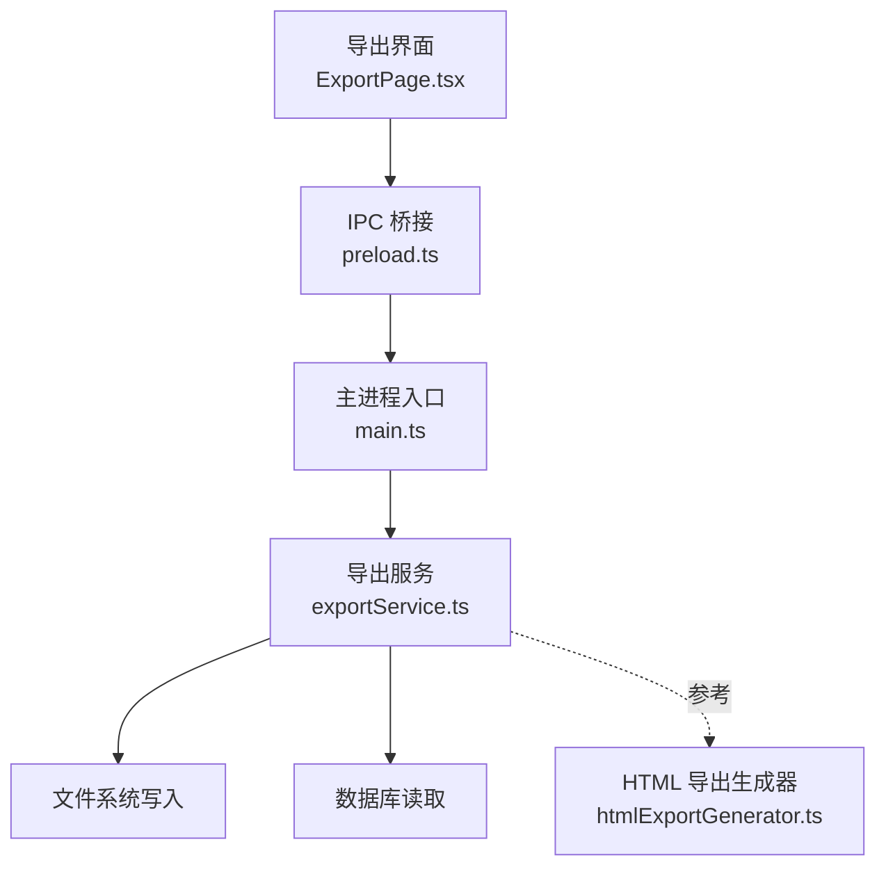
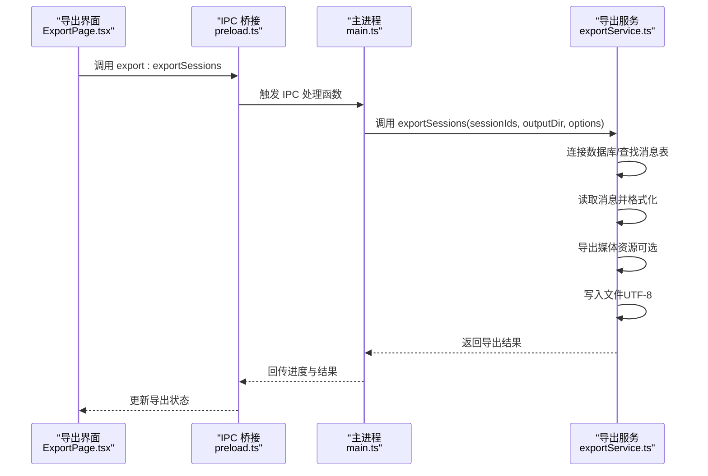
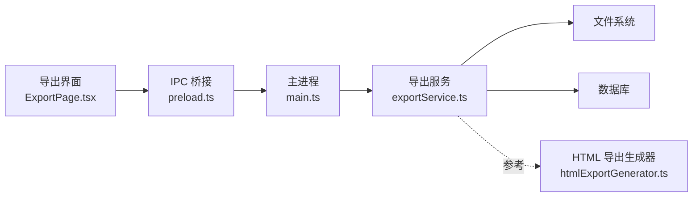

# TXT 格式

<cite>
**本文档引用的文件**
- [exportService.ts](file://electron/services/exportService.ts)
- [ExportPage.tsx](file://src/pages/ExportPage.tsx)
- [main.ts](file://electron/main.ts)
- [preload.ts](file://electron/preload.ts)
- [htmlExportGenerator.ts](file://electron/services/htmlExportGenerator.ts)
</cite>

## 目录
1. [简介](#简介)
2. [项目结构](#项目结构)
3. [核心组件](#核心组件)
4. [架构总览](#架构总览)
5. [详细组件分析](#详细组件分析)
6. [依赖关系分析](#依赖关系分析)
7. [性能考虑](#性能考虑)
8. [故障排除指南](#故障排除指南)
9. [结论](#结论)

## 简介
本文件针对 CipherTalk 的 TXT 格式导出功能进行技术文档整理，重点阐述以下方面：
- 设计理念：简洁性、可读性、兼容性
- 文本格式化规则：时间戳格式化、发送者名称显示、内容清洗处理、特殊字符转义
- 导出选项：日期范围、编码设置（UTF-8）、行分隔符控制
- 文本内容结构：每条消息一行、时间戳前缀、发送者标识、内容正文
- 导出参数配置、文件大小优化、大文件处理策略
- 与其他格式的对比（JSON、HTML、Excel）

## 项目结构
围绕 TXT 导出功能的关键模块与职责如下：
- Electron 主进程：注册 IPC 接口、调度导出任务、管理导出进度
- 渲染进程导出界面：提供导出参数配置与交互
- 导出服务：统一处理消息读取、格式化、写入与媒体导出
- HTML 导出生成器：作为参考，展示可读性与结构化设计思路

图表来源
- [ExportPage.tsx](file://src/pages/ExportPage.tsx)
- [preload.ts](file://electron/preload.ts)
- [main.ts](file://electron/main.ts)
- [exportService.ts](file://electron/services/exportService.ts)
- [htmlExportGenerator.ts](file://electron/services/htmlExportGenerator.ts)

章节来源
- [ExportPage.tsx](file://src/pages/ExportPage.tsx)
- [preload.ts](file://electron/preload.ts)
- [main.ts](file://electron/main.ts)
- [exportService.ts](file://electron/services/exportService.ts)
- [htmlExportGenerator.ts](file://electron/services/htmlExportGenerator.ts)

## 核心组件
- 导出服务（ExportService）
  - 负责连接数据库、读取消息、格式化输出、写入文件、导出媒体资源
  - 提供批量导出会话能力，并通过进度回调通知前端
- 导出界面（ExportPage.tsx）
  - 提供导出格式选择（含 TXT）、时间范围选择、导出选项（头像、媒体等）
  - 通过 IPC 调用主进程执行导出
- 主进程（main.ts）
  - 注册导出相关的 IPC 处理函数，协调导出服务与渲染进程通信
- HTML 导出生成器（htmlExportGenerator.ts）
  - 展示结构化输出的设计思路，便于理解 TXT 的结构化改进方向

章节来源
- [exportService.ts](file://electron/services/exportService.ts)
- [ExportPage.tsx](file://src/pages/ExportPage.tsx)
- [main.ts](file://electron/main.ts)
- [htmlExportGenerator.ts](file://electron/services/htmlExportGenerator.ts)

## 架构总览
下图展示了从界面到文件系统的导出调用链路与关键处理节点。

图表来源
- [ExportPage.tsx](file://src/pages/ExportPage.tsx)
- [preload.ts](file://electron/preload.ts)
- [main.ts](file://electron/main.ts)
- [exportService.ts](file://electron/services/exportService.ts)

## 详细组件分析

### 导出服务（ExportService）对 TXT 的适配与扩展
- 导出格式枚举包含 'txt'，表明 TXT 格式在导出选项中受支持
- 导出流程中会根据格式分支调用相应导出方法，TXT 作为候选格式之一
- 时间戳格式化采用统一的 formatTimestamp 方法，确保一致性
- 媒体导出（图片、视频、表情、语音）通过独立流程处理，便于后续在 TXT 中引用

章节来源
- [exportService.ts](file://electron/services/exportService.ts)

### 导出界面（ExportPage.tsx）的参数配置
- 导出格式选择：包含 'txt' 选项，便于用户选择纯文本输出
- 时间范围：支持起止日期选择，导出服务内部会基于时间戳进行过滤
- 导出选项：头像、图片、视频、表情、语音等可选导出，便于丰富 TXT 内容

章节来源
- [ExportPage.tsx](file://src/pages/ExportPage.tsx)

### 时间戳格式化与内容清洗
- 时间戳格式化：统一使用 formatTimestamp，输出形如“YYYY-MM-DD HH:mm:ss”的字符串
- 内容清洗：parseMessageContent 对不同类型消息进行归一化处理，去除冗余标签与前缀
- 特殊字符转义：HTML 实体解码与 XML 标签清理，保证文本可读性

章节来源
- [exportService.ts](file://electron/services/exportService.ts)

### 文本内容结构设计建议
基于现有实现，建议的 TXT 文本结构如下（每条消息一行）：
- 时间戳前缀：YYYY-MM-DD HH:mm:ss
- 发送者标识：发送者名称或“我”（根据 isSend 判断）
- 内容正文：经清洗后的纯文本，必要时附加媒体引用路径

该结构兼顾简洁性与可读性，便于人工审阅与自动化处理。

章节来源
- [exportService.ts](file://electron/services/exportService.ts)

### 编码与行分隔符控制
- 编码设置：导出服务在写入文件时使用 UTF-8 编码，确保跨平台兼容
- 行分隔符：建议使用系统默认换行符（如 Windows 使用 \r\n），以提升在 Windows 记事本等工具中的兼容性

章节来源
- [exportService.ts](file://electron/services/exportService.ts)

### 文件大小优化与大文件处理策略
- 分会话导出：每个会话单独输出一个文件，避免单文件过大
- 媒体分离：图片、视频、表情、语音导出到独立目录，TXT 中仅保留相对路径引用
- 分批写入：导出过程中逐步写入文件，避免一次性占用过多内存
- 进度回调：通过 onProgress 通知前端，便于用户感知导出状态

章节来源
- [exportService.ts](file://electron/services/exportService.ts)

### 与其他格式的对比
- JSON：包含完整元数据与结构化字段，适合程序处理；TXT 更偏向人类可读
- HTML：具备富文本与交互能力；TXT 更轻量，兼容性更广
- Excel：适合统计分析；TXT 更易分享与版本控制

章节来源
- [exportService.ts](file://electron/services/exportService.ts)
- [htmlExportGenerator.ts](file://electron/services/htmlExportGenerator.ts)

## 依赖关系分析
- 导出界面依赖 IPC 桥接与主进程导出接口
- 主进程依赖导出服务执行具体导出逻辑
- 导出服务依赖数据库读取与文件系统写入
- HTML 导出生成器提供结构化输出参考

图表来源
- [ExportPage.tsx](file://src/pages/ExportPage.tsx)
- [preload.ts](file://electron/preload.ts)
- [main.ts](file://electron/main.ts)
- [exportService.ts](file://electron/services/exportService.ts)
- [htmlExportGenerator.ts](file://electron/services/htmlExportGenerator.ts)

## 性能考虑
- 大文件拆分：按会话拆分输出，降低单文件体积
- 媒体异步导出：图片、视频、表情、语音独立处理，避免阻塞主线程
- 内存控制：分批读取与写入，避免一次性加载全部消息
- 进度反馈：实时上报导出进度，改善用户体验

## 故障排除指南
- 未找到会话消息：确认会话 ID 正确且数据库已连接
- 导出失败：检查输出目录权限与磁盘空间
- 媒体缺失：确认导出选项中勾选了相应媒体类型，并检查媒体缓存路径
- 时间范围无效：确保起止日期格式正确且时间戳范围合理

章节来源
- [exportService.ts](file://electron/services/exportService.ts)

## 结论
TXT 格式导出在 CipherTalk 中体现了“简洁、可读、兼容”的设计理念。通过统一的时间戳格式化、内容清洗与媒体分离策略，既保证了人类可读性，又兼顾了后续处理与分享的便利性。结合进度反馈与分批写入机制，能够在大体量数据场景下保持良好的性能与稳定性。未来可在 TXT 中引入更丰富的结构化标记与索引，进一步提升检索与分析效率。