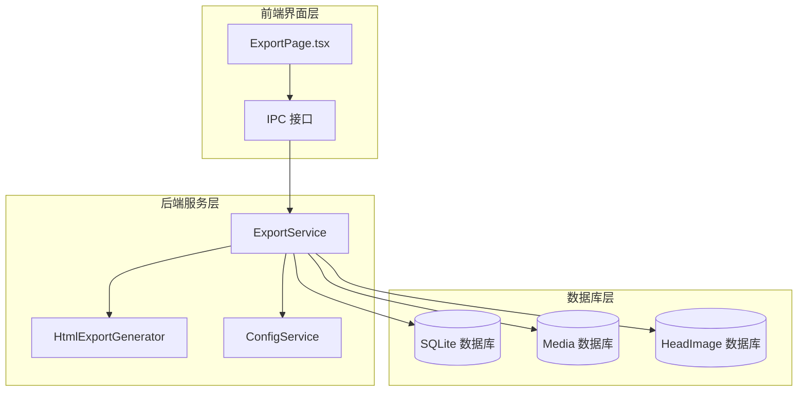
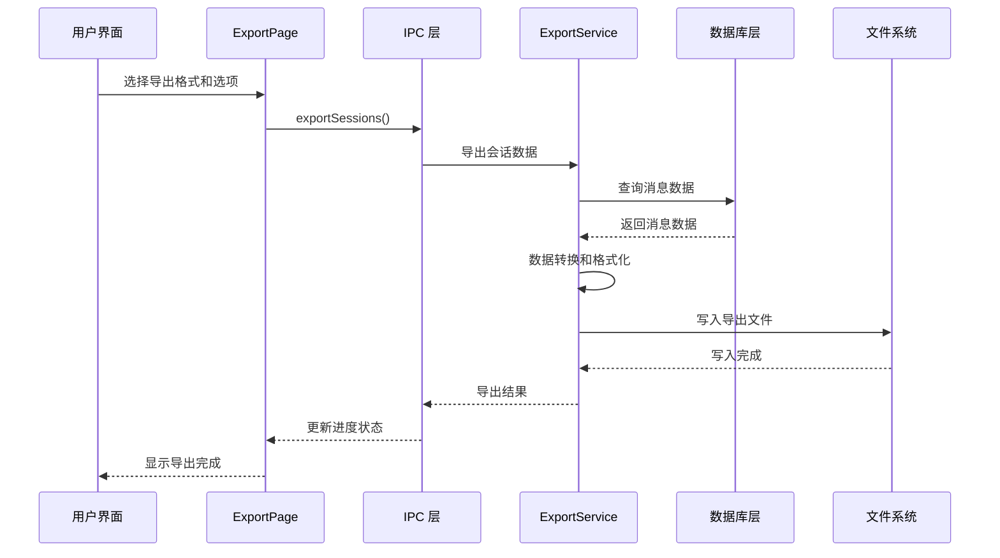
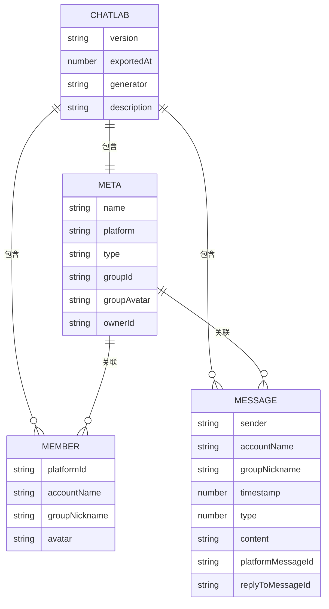
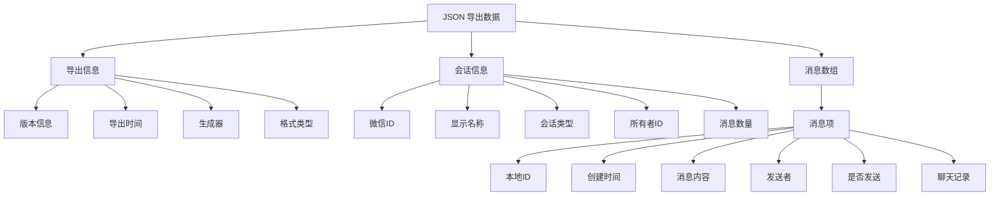
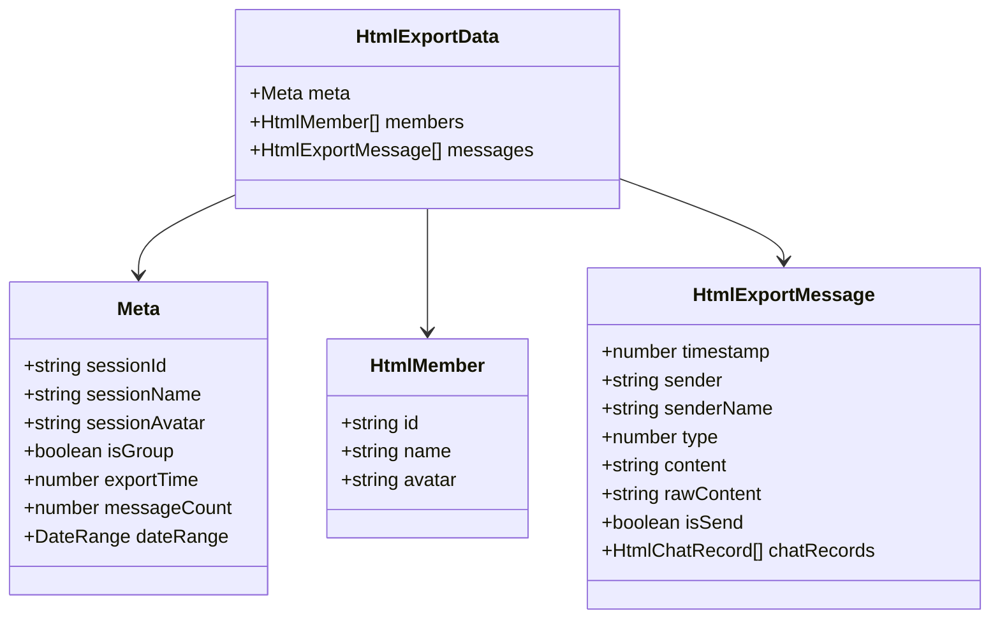
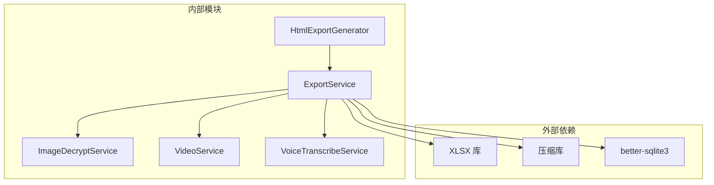
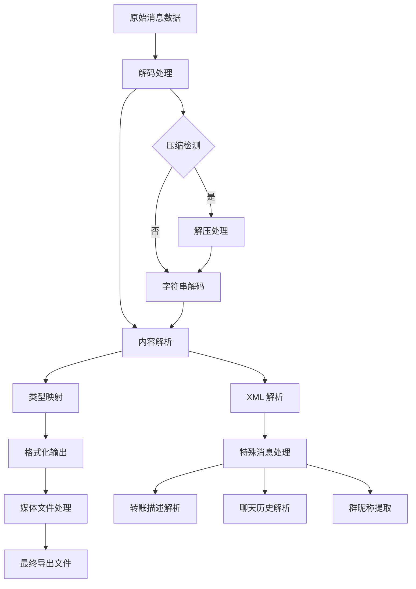
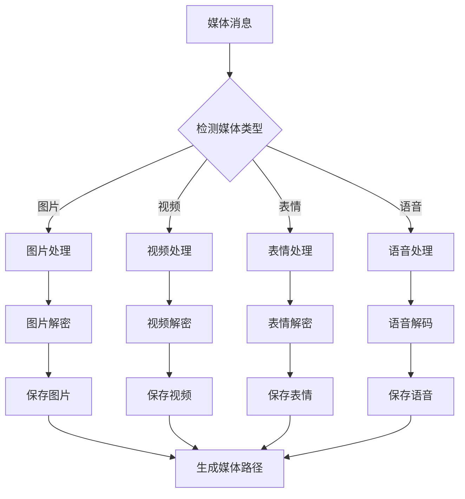

# 导出格式支持

<cite>
**本文档引用的文件**
- [exportService.ts](file://electron/services/exportService.ts)
- [htmlExportGenerator.ts](file://electron/services/htmlExportGenerator.ts)
- [ExportPage.tsx](file://src/pages/ExportPage.tsx)
- [main.ts](file://electron/main.ts)
- [preload.ts](file://electron/preload.ts)
</cite>

## 目录
1. [简介](#简介)
2. [项目结构](#项目结构)
3. [核心组件](#核心组件)
4. [架构概览](#架构概览)
5. [详细组件分析](#详细组件分析)
6. [依赖关系分析](#依赖关系分析)
7. [性能考虑](#性能考虑)
8. [故障排除指南](#故障排除指南)
9. [结论](#结论)

## 简介

CipherTalk 的多格式导出功能提供了全面的聊天记录导出解决方案，支持多种格式以满足不同的使用场景。该功能基于 Electron 架构实现，通过服务层处理复杂的数据库操作和数据转换，为用户提供灵活的导出选项。

## 项目结构

项目采用前后端分离的架构设计，主要涉及以下关键组件：



**图表来源**
- [exportService.ts:117-127](file://electron/services/exportService.ts#L117-L127)
- [htmlExportGenerator.ts:51-51](file://electron/services/htmlExportGenerator.ts#L51-L51)

**章节来源**
- [exportService.ts:117-127](file://electron/services/exportService.ts#L117-L127)
- [ExportPage.tsx:59-80](file://src/pages/ExportPage.tsx#L59-L80)

## 核心组件

### 导出服务类 (ExportService)

ExportService 是整个导出功能的核心，负责处理所有导出逻辑。该类实现了多种导出格式的支持，并提供了统一的接口来处理不同类型的导出需求。

**主要特性：**
- 支持多种导出格式：ChatLab、JSON、HTML、Excel、TXT、SQL
- 智能数据库连接管理
- 媒体文件处理能力
- 进度跟踪和错误处理

**章节来源**
- [exportService.ts:117-127](file://electron/services/exportService.ts#L117-L127)
- [exportService.ts:86-96](file://electron/services/exportService.ts#L86-L96)

### HTML 导出生成器

HtmlExportGenerator 专门负责 HTML 格式的导出，提供完整的网页生成能力，包括内联样式、JavaScript 和数据处理。

**核心功能：**
- 单文件 HTML 生成
- 内联 CSS 和 JavaScript
- 响应式设计支持
- 交互式搜索和导航

**章节来源**
- [htmlExportGenerator.ts:51-51](file://electron/services/htmlExportGenerator.ts#L51-L51)

### 导出页面组件

ExportPage.tsx 提供了用户友好的导出界面，允许用户选择导出格式、设置导出选项和监控导出进度。

**界面特性：**
- 多格式导出选项卡
- 会话选择和筛选
- 导出设置面板
- 实时进度显示

**章节来源**
- [ExportPage.tsx:59-80](file://src/pages/ExportPage.tsx#L59-L80)
- [ExportPage.tsx:476-484](file://src/pages/ExportPage.tsx#L476-L484)

## 架构概览

导出功能采用分层架构设计，确保了良好的模块化和可维护性：



**图表来源**
- [main.ts:2410-2414](file://electron/main.ts#L2410-L2414)
- [exportService.ts:2119-2228](file://electron/services/exportService.ts#L2119-L2228)

**章节来源**
- [main.ts:2410-2414](file://electron/main.ts#L2410-L2414)
- [exportService.ts:2119-2228](file://electron/services/exportService.ts#L2119-L2228)

## 详细组件分析

### ChatLab 格式支持

ChatLab 格式是 CipherTalk 的标准导出格式，专为与其他软件兼容而设计。

#### 数据结构设计

ChatLab 格式采用层次化的数据结构，包含以下核心组件：



**图表来源**
- [exportService.ts:15-70](file://electron/services/exportService.ts#L15-L70)

#### 消息类型映射

ChatLab 格式支持多种消息类型，通过统一的类型映射系统进行转换：

| 微信本地类型 | ChatLab 类型 | 描述 |
|------------|-------------|------|
| 1 | 0 | 文本消息 |
| 3 | 1 | 图片消息 |
| 34 | 2 | 语音消息 |
| 43 | 3 | 视频消息 |
| 49 | 7 | 链接/文件消息 |
| 47 | 5 | 动画表情 |
| 48 | 8 | 位置消息 |
| 42 | 27 | 名片消息 |
| 50 | 23 | 通话记录 |
| 10000 | 80 | 系统消息 |

**章节来源**
- [exportService.ts:73-84](file://electron/services/exportService.ts#L73-L84)
- [exportService.ts:435-457](file://electron/services/exportService.ts#L435-L457)

### JSON 格式支持

JSON 格式提供详细的结构化数据导出，包含完整的消息信息和元数据。

#### 数据组织层次

JSON 格式采用扁平化的数据组织方式：



**图表来源**
- [exportService.ts:1636-1660](file://electron/services/exportService.ts#L1636-L1660)

**章节来源**
- [exportService.ts:1452-1677](file://electron/services/exportService.ts#L1452-L1677)

### HTML 格式支持

HTML 格式提供完整的网页导出功能，支持内联样式和交互式浏览。

#### HTML 导出数据结构

HTML 导出使用专门的数据结构来支持网页渲染：



**图表来源**
- [htmlExportGenerator.ts:37-49](file://electron/services/htmlExportGenerator.ts#L37-L49)

**章节来源**
- [htmlExportGenerator.ts:51-124](file://electron/services/htmlExportGenerator.ts#L51-L124)

### Excel 格式支持

Excel 格式提供电子表格导出功能，适合数据分析和统计处理。

#### 表格布局设计

Excel 导出采用标准化的表格布局：

| 列名 | 数据类型 | 描述 |
|------|----------|------|
| 序号 | 数字 | 消息在会话中的顺序编号 |
| 时间 | 日期时间 | 消息创建的完整时间戳 |
| 日期 | 日期 | 消息创建的日期部分 |
| 时刻 | 时间 | 消息创建的时间部分 |
| 星期 | 文本 | 消息创建对应的星期几 |
| 发送者 | 文本 | 发送者的显示名称 |
| 微信ID | 文本 | 发送者的微信ID |
| 消息类型 | 文本 | 消息类型的中文描述 |
| 消息内容 | 文本 | 消息的可读内容 |
| 原始类型代码 | 数字 | 微信原始消息类型代码 |
| 时间戳 | 数字 | Unix 时间戳格式 |
| 头像链接 | 文本 | 发送者头像的URL（可选） |
| 聊天记录详情 | 文本 | 合并转发消息的详细内容（可选） |

**章节来源**
- [exportService.ts:1792-1894](file://electron/services/exportService.ts#L1792-L1894)

### TXT 格式支持

TXT 格式提供纯文本导出，适用于简单的文本处理和备份需求。

#### 文本格式特点

TXT 导出采用简洁的文本格式，每个消息占一行，包含关键信息：

```
[时间] 发送者: 消息内容
[2024-01-01 12:30:45] 张三: 你好！
[2024-01-01 12:31:02] 李四: 在吗？
```

### SQL 格式支持

SQL 格式提供数据库脚本导出，便于将数据导入到各种数据库系统中。

#### SQL 生成策略

SQL 导出采用标准的 INSERT 语句格式，支持批量插入优化：

```sql
INSERT INTO messages (timestamp, sender, content, type) VALUES 
(1640995845, '张三', '你好！', 'TEXT'),
(1640995862, '李四', '在吗？', 'TEXT');
```

**章节来源**
- [exportService.ts:2192-2203](file://electron/services/exportService.ts#L2192-L2203)

## 依赖关系分析

导出功能涉及多个模块之间的复杂依赖关系：



**图表来源**
- [exportService.ts:1-12](file://electron/services/exportService.ts#L1-L12)

**章节来源**
- [exportService.ts:1-12](file://electron/services/exportService.ts#L1-L12)

### 格式转换逻辑

导出服务实现了复杂的消息类型转换和内容格式化逻辑：



**图表来源**
- [exportService.ts:462-516](file://electron/services/exportService.ts#L462-L516)
- [exportService.ts:531-648](file://electron/services/exportService.ts#L531-L648)

**章节来源**
- [exportService.ts:462-516](file://electron/services/exportService.ts#L462-L516)
- [exportService.ts:531-648](file://electron/services/exportService.ts#L531-L648)

### 媒体文件处理

导出功能提供了完整的媒体文件处理能力，支持图片、视频、表情包和语音文件：



**图表来源**
- [exportService.ts:2233-2615](file://electron/services/exportService.ts#L2233-L2615)

**章节来源**
- [exportService.ts:2233-2615](file://electron/services/exportService.ts#L2233-L2615)

## 性能考虑

导出功能在设计时充分考虑了性能优化：

### 内存管理
- 使用流式处理减少内存占用
- 数据库连接池管理
- 媒体文件分批处理

### 并行处理
- 多会话并发导出
- 媒体文件并行下载
- 数据库查询优化

### 缓存策略
- 数据库查询结果缓存
- 媒体文件本地缓存
- 头像数据缓存

## 故障排除指南

### 常见问题及解决方案

**数据库连接失败**
- 检查数据库文件权限
- 验证数据库完整性
- 确认数据库版本兼容性

**导出进度停滞**
- 检查磁盘空间
- 验证输出路径权限
- 监控网络连接（媒体下载）

**格式转换错误**
- 检查消息内容完整性
- 验证消息类型映射
- 确认特殊消息处理逻辑

**章节来源**
- [exportService.ts:220-251](file://electron/services/exportService.ts#L220-L251)
- [exportService.ts:1086-1089](file://electron/services/exportService.ts#L1086-L1089)

## 结论

CipherTalk 的多格式导出功能提供了全面、灵活且高性能的聊天记录导出解决方案。通过支持多种导出格式，满足了不同用户的需求，从简单的文本备份到复杂的数据库导入都有相应的解决方案。

该功能的主要优势包括：
- **多格式支持**：覆盖主流的导出格式需求
- **智能处理**：自动处理复杂的消息类型和媒体文件
- **用户友好**：提供直观的界面和实时进度反馈
- **性能优化**：采用多种技术确保高效的导出体验

未来可以考虑的功能增强包括：
- 更多导出格式的支持
- 导出模板定制功能
- 批量处理优化
- 导出结果验证机制