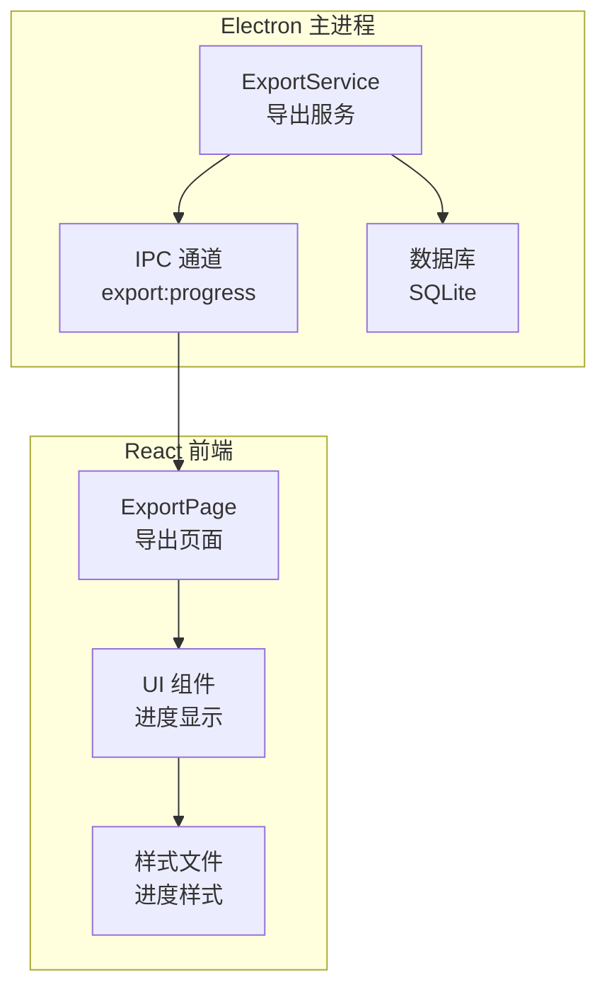
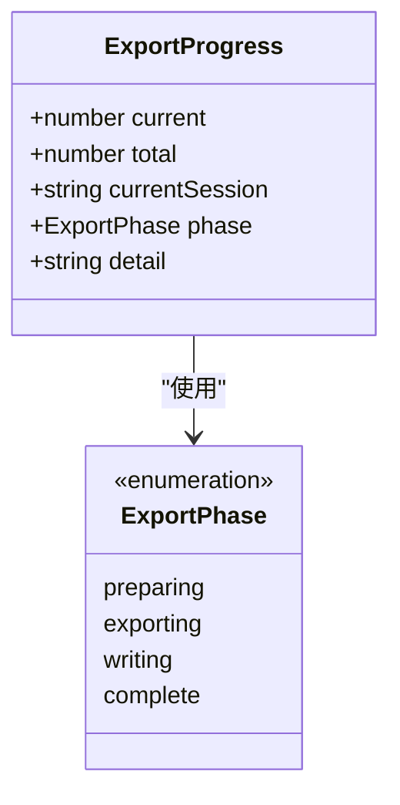
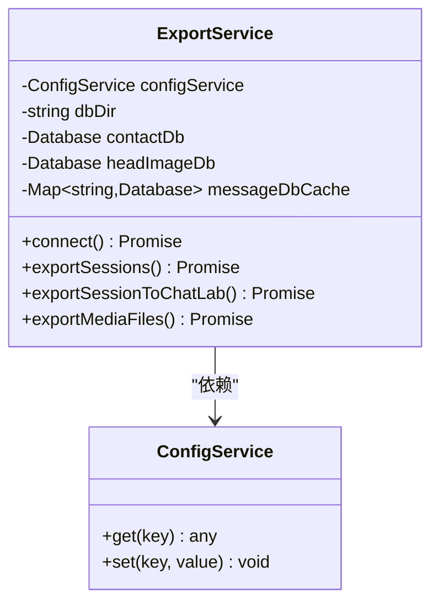
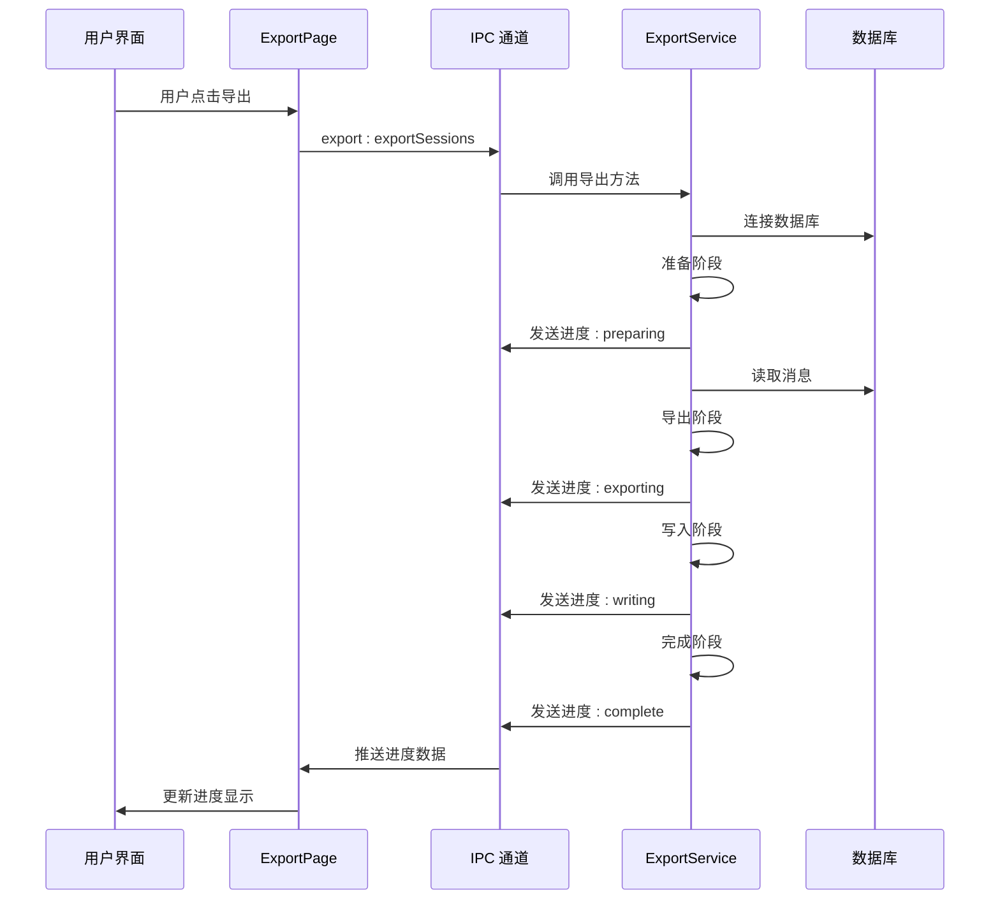
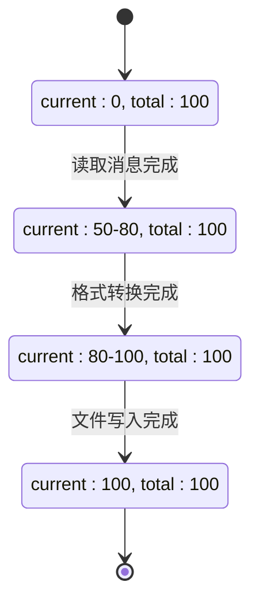
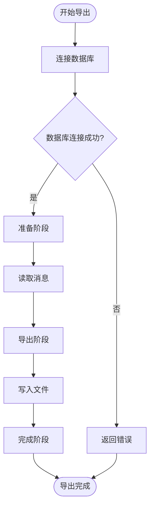
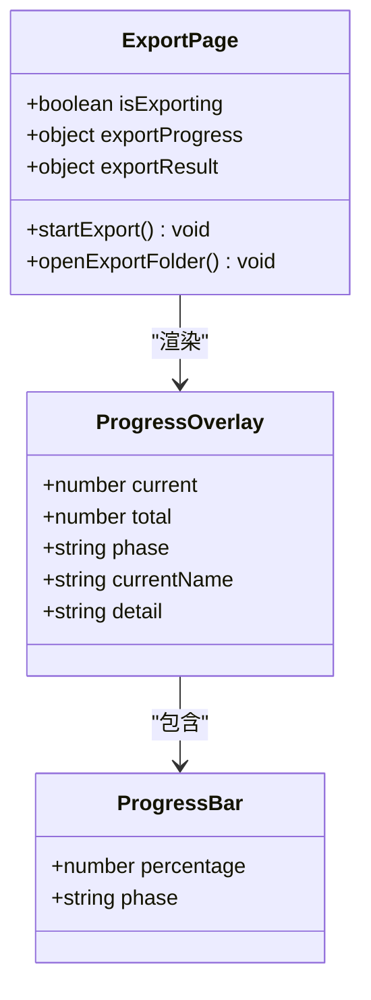
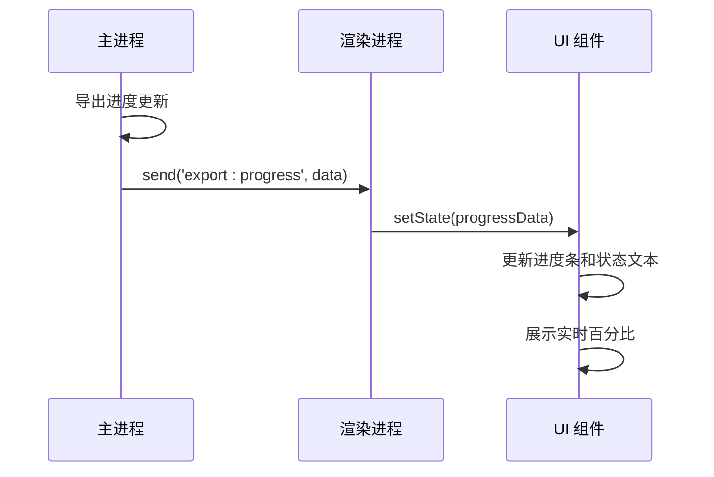
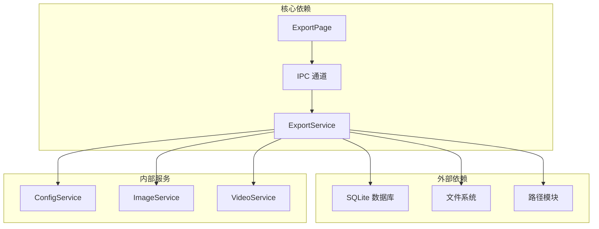
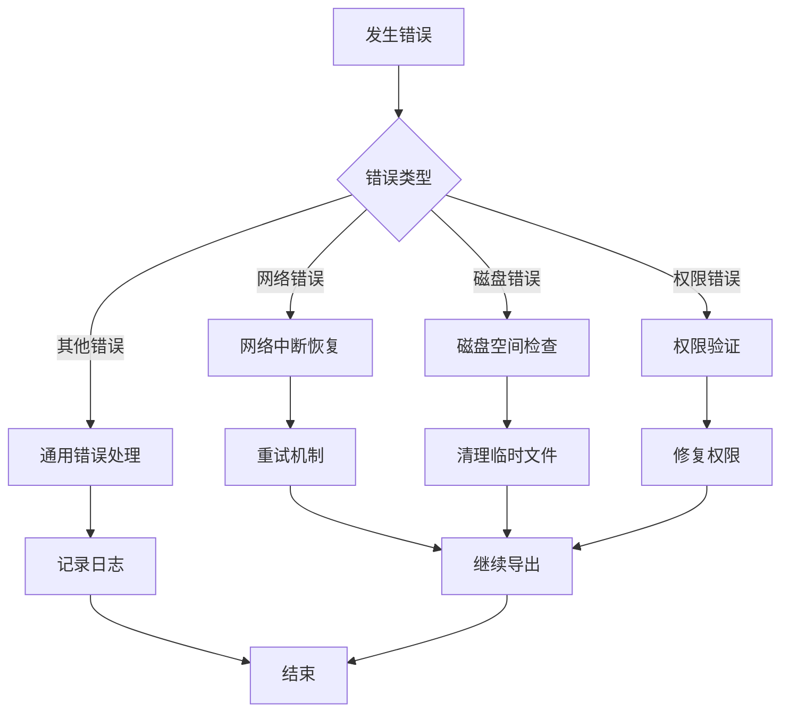

# 导出进度监控

<cite>
**本文档引用的文件**
- [exportService.ts](file://electron/services/exportService.ts)
- [ExportPage.tsx](file://src/pages/ExportPage.tsx)
- [ExportPage.scss](file://src/pages/ExportPage.scss)
- [preload.ts](file://electron/preload.ts)
- [main.ts](file://electron/main.ts)
- [DecryptProgressOverlay.tsx](file://src/components/DecryptProgressOverlay.tsx)
</cite>

## 目录
1. [简介](#简介)
2. [项目结构](#项目结构)
3. [核心组件](#核心组件)
4. [架构概览](#架构概览)
5. [详细组件分析](#详细组件分析)
6. [依赖关系分析](#依赖关系分析)
7. [性能考虑](#性能考虑)
8. [故障排除指南](#故障排除指南)
9. [结论](#结论)

## 简介

CipherTalk 的导出进度监控功能是一个完整的端到端进度跟踪系统，实现了从底层数据库导出到用户界面实时反馈的全流程监控。该系统通过 ExportProgress 接口提供标准化的进度数据结构，支持多阶段状态管理和实时进度更新。

## 项目结构

导出进度监控功能分布在 Electron 主进程和 React 前端两个主要层面：

**图表来源**
- [exportService.ts:109-115](file://electron/services/exportService.ts#L109-L115)
- [main.ts:2410-2426](file://electron/main.ts#L2410-L2426)
- [ExportPage.tsx:160-182](file://src/pages/ExportPage.tsx#L160-L182)

## 核心组件

### ExportProgress 接口设计

ExportProgress 接口是整个进度监控系统的核心数据结构，提供了标准化的进度信息表示：

**图表来源**
- [exportService.ts:109-115](file://electron/services/exportService.ts#L109-L115)

### 导出服务架构

ExportService 类负责处理所有导出逻辑，包括数据库连接、消息读取、格式转换和文件写入：

**图表来源**
- [exportService.ts:117-127](file://electron/services/exportService.ts#L117-L127)

**章节来源**
- [exportService.ts:109-115](file://electron/services/exportService.ts#L109-L115)
- [exportService.ts:117-127](file://electron/services/exportService.ts#L117-L127)

## 架构概览

导出进度监控采用分层架构设计，确保了良好的模块分离和可维护性：

**图表来源**
- [main.ts:2410-2426](file://electron/main.ts#L2410-L2426)
- [exportService.ts:2119-2228](file://electron/services/exportService.ts#L2119-L2228)
- [ExportPage.tsx:160-182](file://src/pages/ExportPage.tsx#L160-L182)

## 详细组件分析

### 导出进度状态管理

系统实现了四阶段的状态管理模式，每个阶段都有明确的职责和进度范围：

**图表来源**
- [exportService.ts:736-742](file://electron/services/exportService.ts#L736-L742)
- [exportService.ts:887-893](file://electron/services/exportService.ts#L887-L893)
- [exportService.ts:1048-1054](file://electron/services/exportService.ts#L1048-L1054)
- [exportService.ts:1077-1083](file://electron/services/exportService.ts#L1077-L1083)

### 进度事件处理流程

进度事件处理采用了异步回调机制，确保 UI 能够实时响应导出过程中的各个阶段：

**图表来源**
- [exportService.ts:2129-2134](file://electron/services/exportService.ts#L2129-L2134)
- [exportService.ts:2141-2151](file://electron/services/exportService.ts#L2141-L2151)
- [exportService.ts:2216-2222](file://electron/services/exportService.ts#L2216-L2222)

### 用户界面集成

前端界面通过 React 组件实现了完整的进度监控和用户交互：

**图表来源**
- [ExportPage.tsx:60-80](file://src/pages/ExportPage.tsx#L60-L80)
- [ExportPage.tsx:941-978](file://src/pages/ExportPage.tsx#L941-L978)

**章节来源**
- [ExportPage.tsx:60-80](file://src/pages/ExportPage.tsx#L60-L80)
- [ExportPage.tsx:941-978](file://src/pages/ExportPage.tsx#L941-L978)

### 实时反馈机制

系统采用了高效的实时反馈机制，通过 IPC 通道实现主进程和渲染进程之间的双向通信：

**图表来源**
- [main.ts:2411-2413](file://electron/main.ts#L2411-L2413)
- [preload.ts:335-338](file://electron/preload.ts#L335-L338)
- [ExportPage.tsx:160-182](file://src/pages/ExportPage.tsx#L160-L182)

## 依赖关系分析

导出进度监控功能涉及多个模块间的复杂依赖关系：

**图表来源**
- [exportService.ts:118-123](file://electron/services/exportService.ts#L118-L123)
- [main.ts:2410-2426](file://electron/main.ts#L2410-L2426)

**章节来源**
- [exportService.ts:118-123](file://electron/services/exportService.ts#L118-L123)
- [main.ts:2410-2426](file://electron/main.ts#L2410-L2426)

## 性能考虑

### 进度更新频率优化

系统通过智能的进度更新策略避免了过度的 IPC 通信：

- **批量进度更新**：在媒体导出过程中，每处理 10 个文件才更新一次进度
- **事件循环让出**：使用 `setImmediate` 让出事件循环，避免阻塞主进程
- **节流机制**：在高频更新场景下实施节流策略

### 内存管理

- **数据库连接池**：使用 Map 缓存数据库连接，避免重复创建
- **消息缓存**：合理管理消息数据的内存占用
- **文件操作**：采用流式写入方式处理大文件

## 故障排除指南

### 常见问题及解决方案

| 问题类型 | 症状 | 可能原因 | 解决方案 |
|---------|------|----------|----------|
| 进度停滞 | 进度条长时间不动 | 数据库连接失败 | 检查数据库路径和权限 |
| 导出失败 | 导出结果为失败 | 磁盘空间不足 | 清理磁盘空间或选择其他位置 |
| 进度异常 | 百分比超过100% | 进度计算错误 | 检查进度更新逻辑 |
| UI卡顿 | 界面响应缓慢 | 进度更新过于频繁 | 实施进度更新节流 |

### 错误处理机制

系统实现了多层次的错误处理机制：

**章节来源**
- [exportService.ts:2182-2184](file://electron/services/exportService.ts#L2182-L2184)
- [exportService.ts:2225-2227](file://electron/services/exportService.ts#L2225-L2227)

## 结论

CipherTalk 的导出进度监控功能展现了优秀的软件工程实践，通过精心设计的架构和完善的错误处理机制，为用户提供了流畅、可靠的导出体验。系统的四个核心特性——标准化的进度接口、多阶段状态管理、实时反馈机制和健壮的错误处理——共同构成了一个高质量的进度监控解决方案。

该实现不仅满足了当前的功能需求，还为未来的扩展和优化奠定了坚实的基础。通过合理的模块分离和清晰的接口设计，系统具备了良好的可维护性和可扩展性。