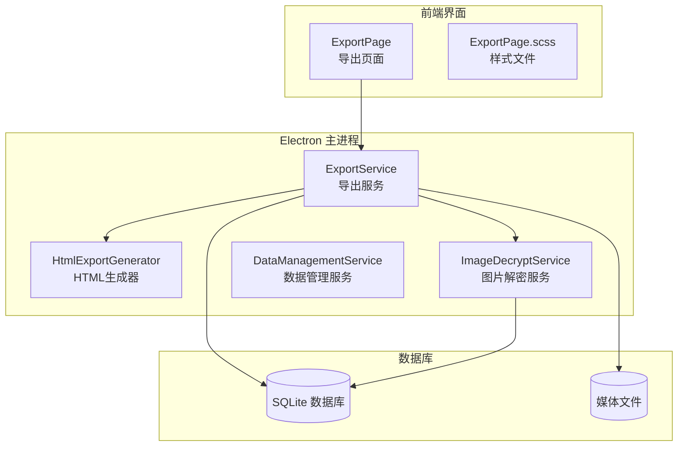
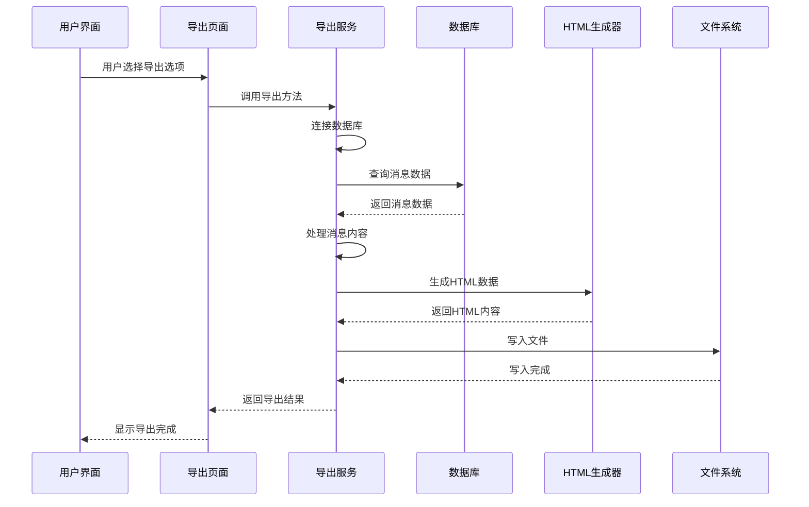
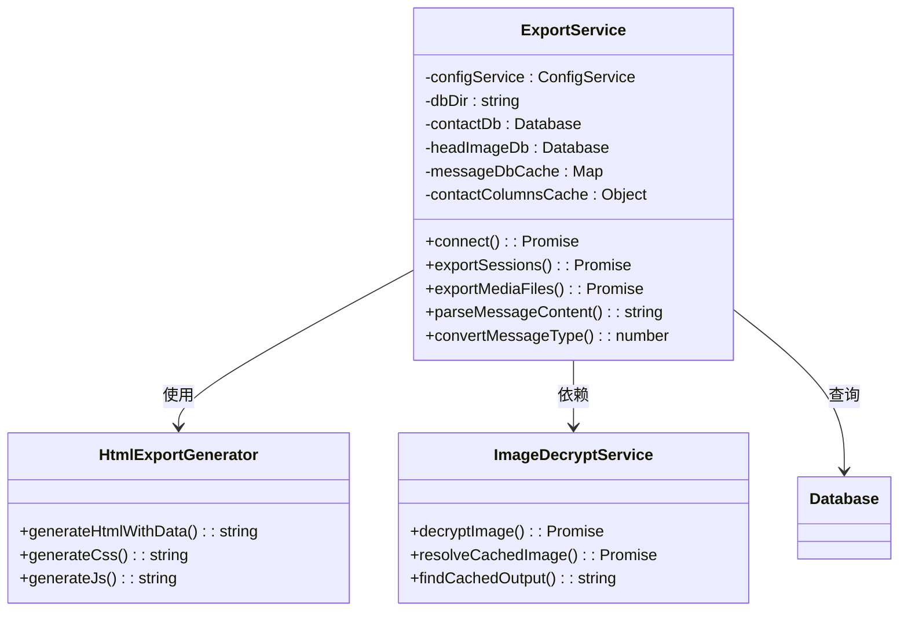
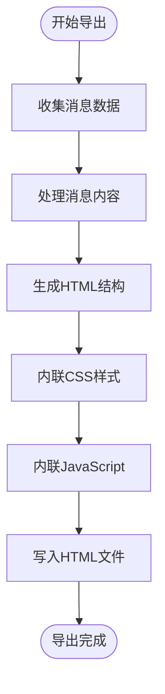
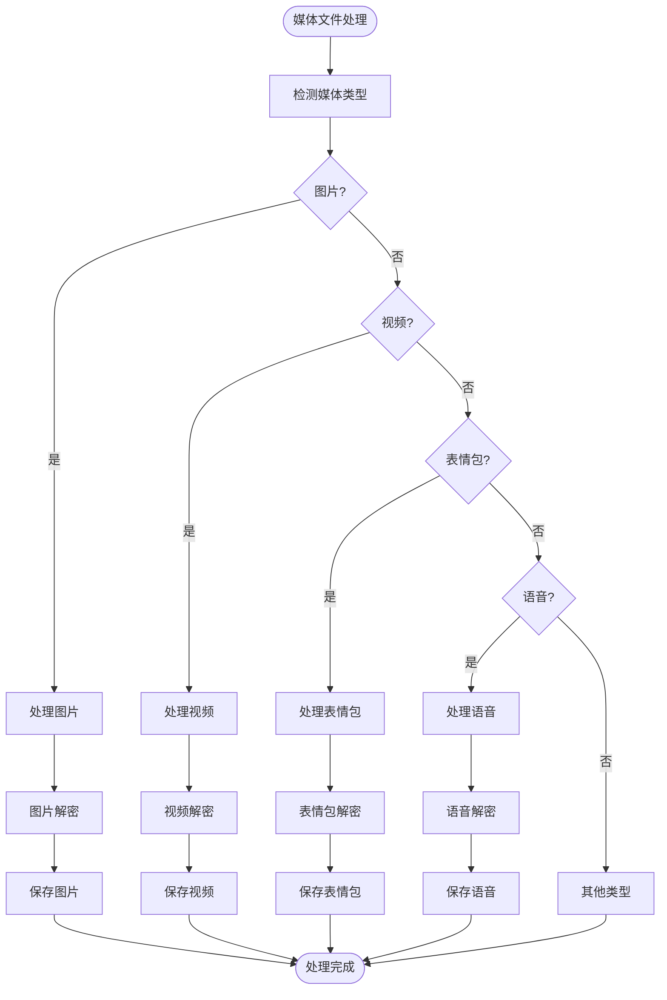
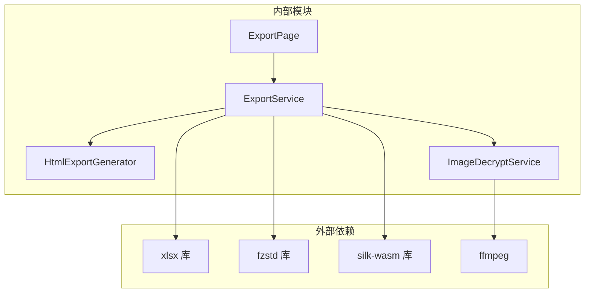

# 数据导出功能

<cite>
**本文档引用的文件**
- [exportService.ts](file://electron/services/exportService.ts)
- [htmlExportGenerator.ts](file://electron/services/htmlExportGenerator.ts)
- [ExportPage.tsx](file://src/pages/ExportPage.tsx)
- [ExportPage.scss](file://src/pages/ExportPage.scss)
- [imageDecryptService.ts](file://electron/services/imageDecryptService.ts)
- [dataManagementService.ts](file://electron/services/dataManagementService.ts)
</cite>

## 目录
1. [简介](#简介)
2. [项目结构](#项目结构)
3. [核心组件](#核心组件)
4. [架构概览](#架构概览)
5. [详细组件分析](#详细组件分析)
6. [依赖关系分析](#依赖关系分析)
7. [性能考虑](#性能考虑)
8. [故障排除指南](#故障排除指南)
9. [结论](#结论)

## 简介

CipherTalk 的数据导出功能是一个完整的后端导出系统，支持多种格式的数据导出，包括 ChatLab 格式、JSON、HTML、Excel 等。该系统提供了完整的导出流程管理、格式适配器、进度跟踪和媒体文件处理功能。

## 项目结构

导出功能主要分布在以下模块中：

**图表来源**
- [exportService.ts:117-127](file://electron/services/exportService.ts#L117-L127)
- [htmlExportGenerator.ts:51-51](file://electron/services/htmlExportGenerator.ts#L51-L51)
- [ExportPage.tsx:59-80](file://src/pages/ExportPage.tsx#L59-L80)

**章节来源**
- [exportService.ts:1-100](file://electron/services/exportService.ts#L1-L100)
- [ExportPage.tsx:1-100](file://src/pages/ExportPage.tsx#L1-L100)

## 核心组件

### 导出服务 (ExportService)

导出服务是整个导出系统的核心，负责协调各种导出操作：

- **数据库连接管理**：自动发现和连接微信数据库
- **格式适配器**：支持多种导出格式的转换
- **进度跟踪**：提供详细的导出进度反馈
- **媒体文件处理**：处理图片、视频、表情包等媒体资源

### HTML 导出生成器

专门负责生成美观的 HTML 导出文件：

- **单文件 HTML**：内联 CSS、JavaScript 和数据
- **响应式设计**：支持桌面和移动设备
- **交互功能**：搜索、主题切换、日期跳转
- **多媒体支持**：内联显示图片和视频

### 导出页面 (ExportPage)

提供用户友好的导出界面：

- **格式选择**：支持多种导出格式
- **时间范围过滤**：按日期范围导出
- **进度显示**：实时显示导出进度
- **配置选项**：灵活的导出参数设置

**章节来源**
- [exportService.ts:117-265](file://electron/services/exportService.ts#L117-L265)
- [htmlExportGenerator.ts:51-124](file://electron/services/htmlExportGenerator.ts#L51-L124)
- [ExportPage.tsx:59-107](file://src/pages/ExportPage.tsx#L59-L107)

## 架构概览

**图表来源**
- [ExportPage.tsx:410-448](file://src/pages/ExportPage.tsx#L410-L448)
- [exportService.ts:2119-2228](file://electron/services/exportService.ts#L2119-L2228)

## 详细组件分析

### 导出服务架构

**图表来源**
- [exportService.ts:117-127](file://electron/services/exportService.ts#L117-L127)
- [htmlExportGenerator.ts:51-51](file://electron/services/htmlExportGenerator.ts#L51-L51)
- [imageDecryptService.ts:44-53](file://electron/services/imageDecryptService.ts#L44-L53)

#### 数据库连接管理

导出服务实现了智能的数据库连接机制：

1. **自动路径发现**：自动查找微信数据库目录
2. **多格式支持**：兼容不同版本的目录命名
3. **缓存机制**：缓存数据库连接以提高性能
4. **错误处理**：完善的异常处理和恢复机制

#### 消息内容处理

系统能够正确处理各种类型的消息内容：

- **文本消息**：清理发送者前缀
- **图片消息**：提取 MD5 和 dat 文件名
- **语音消息**：支持语音转文字
- **视频消息**：处理视频文件链接
- **表情包**：支持静态和动态表情
- **系统消息**：特殊处理撤回、转账等消息

**章节来源**
- [exportService.ts:147-265](file://electron/services/exportService.ts#L147-L265)
- [exportService.ts:528-648](file://electron/services/exportService.ts#L528-L648)

### HTML 导出系统

HTML 导出系统生成完整的单文件 HTML 页面：

**图表来源**
- [htmlExportGenerator.ts:55-124](file://electron/services/htmlExportGenerator.ts#L55-L124)

HTML 导出的主要特性：

- **主题切换**：支持明暗主题切换
- **搜索功能**：支持按内容和发送者搜索
- **日期跳转**：快速跳转到指定日期
- **响应式布局**：适配不同屏幕尺寸
- **多媒体内联**：图片和视频直接内嵌

**章节来源**
- [htmlExportGenerator.ts:129-673](file://electron/services/htmlExportGenerator.ts#L129-L673)

### Excel 导出系统

Excel 导出系统提供专业的表格格式：

- **列宽自适应**：根据内容自动调整列宽
- **数据类型支持**：正确处理各种数据类型
- **聊天记录支持**：支持导出聊天历史记录
- **头像链接**：可选导出头像链接
- **工作表命名**：自动处理工作表名称

**章节来源**
- [exportService.ts:1682-1909](file://electron/services/exportService.ts#L1682-L1909)

### JSON 导出系统

JSON 导出系统提供结构化的数据格式：

- **ChatLab 兼容**：支持 ChatLab 标准格式
- **详细信息**：包含完整的消息元数据
- **时间范围**：支持按时间范围过滤
- **媒体路径**：包含媒体文件的相对路径

**章节来源**
- [exportService.ts:1635-1677](file://electron/services/exportService.ts#L1635-L1677)

### 媒体文件处理

系统提供了完整的媒体文件处理能力：

**图表来源**
- [exportService.ts:2233-2615](file://electron/services/exportService.ts#L2233-L2615)

媒体处理的关键功能：

- **图片解密**：支持多种图片格式和加密方式
- **视频处理**：处理视频文件和实况照片
- **表情包支持**：支持静态和动态表情包
- **语音转换**：将 SILK 格式转换为 WAV
- **缓存机制**：避免重复下载和解密

**章节来源**
- [exportService.ts:2233-2615](file://electron/services/exportService.ts#L2233-L2615)
- [imageDecryptService.ts:112-303](file://electron/services/imageDecryptService.ts#L112-L303)

## 依赖关系分析

**图表来源**
- [exportService.ts:1-12](file://electron/services/exportService.ts#L1-L12)
- [imageDecryptService.ts:1-13](file://electron/services/imageDecryptService.ts#L1-L13)

**章节来源**
- [exportService.ts:1-12](file://electron/services/exportService.ts#L1-L12)
- [imageDecryptService.ts:1-13](file://electron/services/imageDecryptService.ts#L1-L13)

## 性能考虑

### 内存管理

系统采用了多种内存优化策略：

1. **数据库连接池**：缓存数据库连接，避免频繁创建销毁
2. **消息分批处理**：按批次处理消息，避免内存溢出
3. **渐进式导出**：边处理边写入，减少内存占用
4. **及时释放**：及时释放不再使用的资源

### 大文件处理

针对大文件导出的优化：

- **流式处理**：使用流式 API 处理大文件
- **分块写入**：将大文件分成小块写入
- **进度反馈**：提供详细的进度信息
- **错误恢复**：支持断点续传和错误恢复

### 并发处理

系统支持并发处理多个会话：

- **异步操作**：所有数据库操作都是异步的
- **事件循环让出**：定期让出事件循环给 UI
- **进度回调**：实时反馈导出进度
- **错误隔离**：单个会话的错误不影响其他会话

## 故障排除指南

### 常见问题及解决方案

#### 数据库连接失败

**问题症状**：导出时提示数据库未连接

**解决方法**：
1. 检查微信数据库路径配置
2. 确认数据库文件存在且可读
3. 验证解密密钥配置正确
4. 重启应用重新连接数据库

#### 导出进度停滞

**问题症状**：导出进度长时间不变化

**解决方法**：
1. 检查网络连接（下载媒体文件时需要网络）
2. 增加系统内存
3. 减少同时导出的会话数量
4. 检查磁盘空间是否充足

#### 媒体文件导出失败

**问题症状**：图片、视频或表情包导出失败

**解决方法**：
1. 检查媒体文件是否仍然存在于原位置
2. 验证解密密钥配置正确
3. 确认有足够的磁盘空间
4. 检查文件权限设置

#### Excel 文件损坏

**问题症状**：导出的 Excel 文件无法打开

**解决方法**：
1. 检查 xlsx 库版本兼容性
2. 确认导出的数据格式正确
3. 尝试使用不同的 Excel 版本
4. 检查文件编码设置

**章节来源**
- [exportService.ts:220-265](file://electron/services/exportService.ts#L220-L265)
- [exportService.ts:2886-2999](file://electron/services/exportService.ts#L2886-L2999)

## 结论

CipherTalk 的数据导出功能是一个设计精良、功能完整的系统。它提供了多种导出格式、完善的进度跟踪、强大的媒体处理能力和良好的性能表现。

### 主要优势

1. **多格式支持**：支持 ChatLab、JSON、HTML、Excel 等多种格式
2. **完整的媒体处理**：支持图片、视频、表情包、语音等多种媒体类型
3. **用户友好**：提供直观的导出界面和详细的进度反馈
4. **性能优化**：采用多种优化策略处理大文件和大量数据
5. **错误处理**：完善的错误处理和恢复机制

### 技术特点

- **模块化设计**：清晰的模块分离和职责划分
- **异步架构**：基于异步操作的设计，避免 UI 阻塞
- **缓存机制**：多级缓存提升性能
- **扩展性强**：易于添加新的导出格式和功能

这个导出系统为 CipherTalk 用户提供了强大而灵活的数据导出能力，满足了各种数据导出需求。