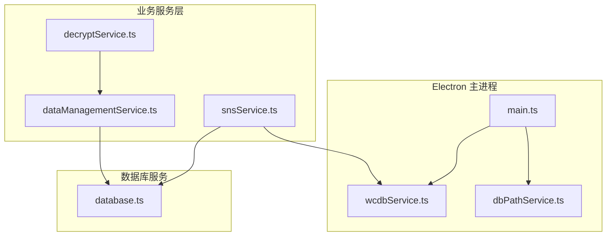
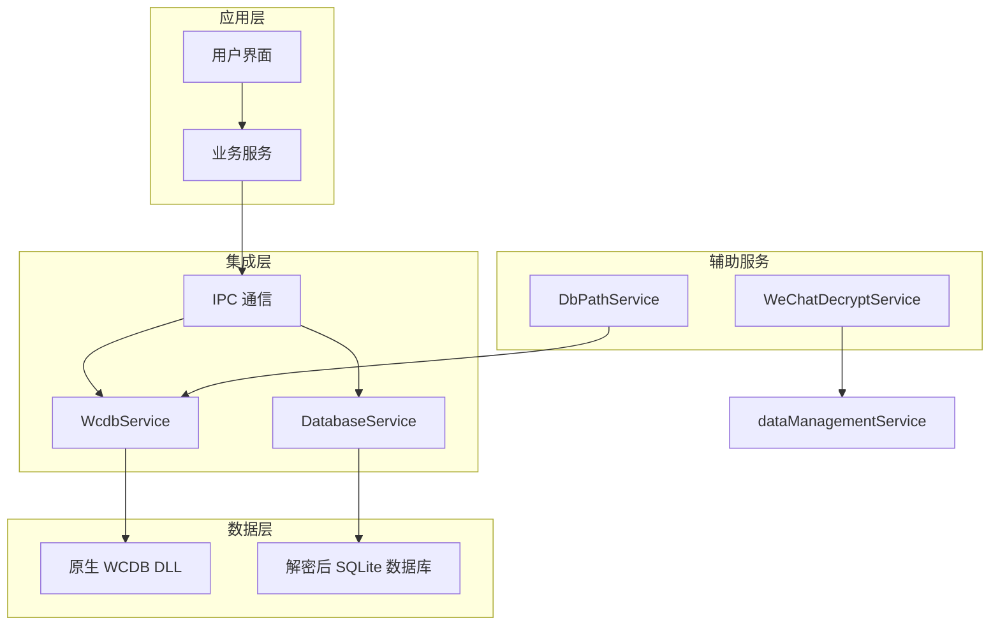
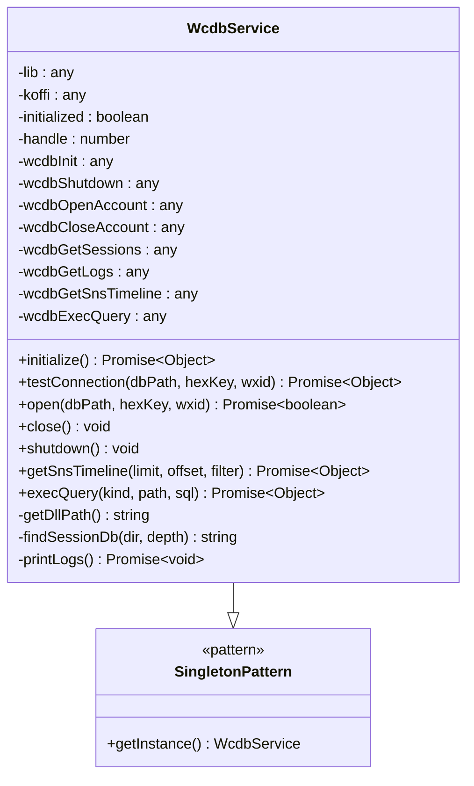
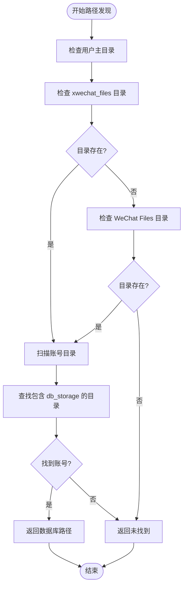
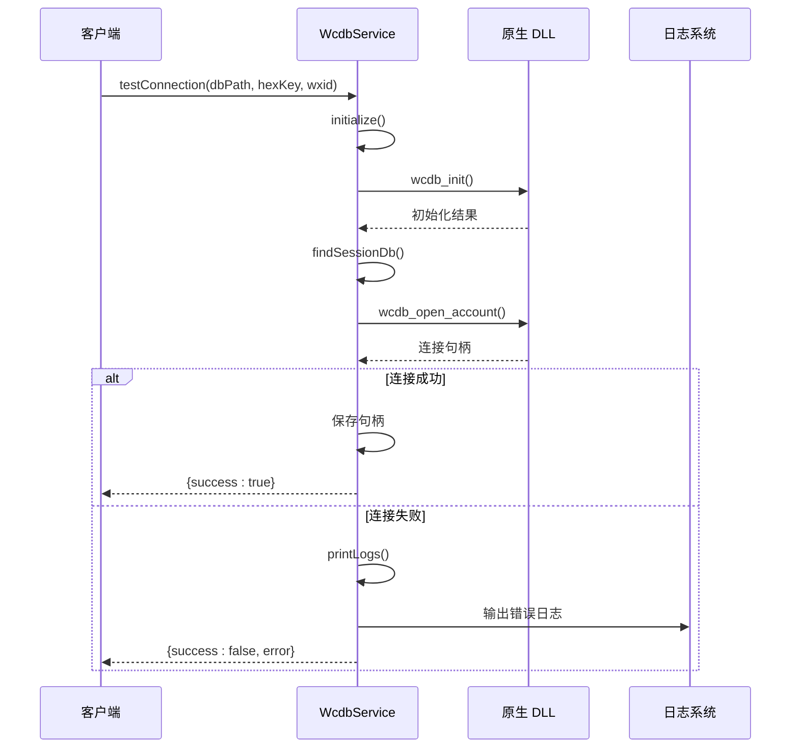
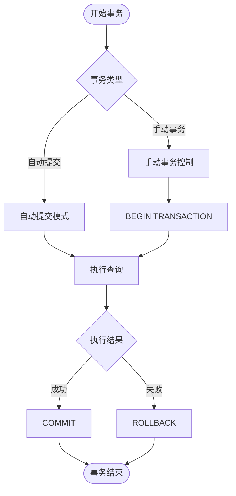
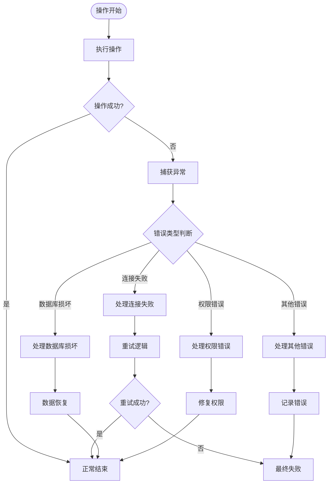
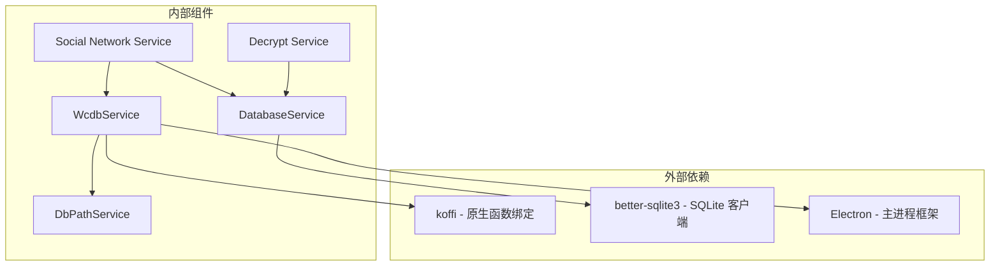

# WCDB 数据库集成

<cite>
**本文档引用的文件**
- [wcdbService.ts](file://electron/services/wcdbService.ts)
- [database.ts](file://electron/services/database.ts)
- [dbPathService.ts](file://electron/services/dbPathService.ts)
- [main.ts](file://electron/main.ts)
- [snsService.ts](file://electron/services/snsService.ts)
- [dataManagementService.ts](file://electron/services/dataManagementService.ts)
- [decryptService.ts](file://electron/services/decryptService.ts)
</cite>

## 目录
1. [简介](#简介)
2. [项目结构](#项目结构)
3. [核心组件](#核心组件)
4. [架构概览](#架构概览)
5. [详细组件分析](#详细组件分析)
6. [依赖关系分析](#依赖关系分析)
7. [性能考虑](#性能考虑)
8. [故障排除指南](#故障排除指南)
9. [结论](#结论)

## 简介

本文件详细介绍了 CipherTalk 项目中的 WCDB 数据库集成方案。WCDB 是腾讯开源的移动数据库框架，该项目通过原生 DLL 封装实现了对微信数据库的读取和解密功能。

系统采用双数据库架构：
- **WCDB 原生层**：通过 koffi 框架调用原生 DLL，实现高性能的数据库操作
- **better-sqlite3 层**：用于解密后的数据库读取，支持只读模式和完整性检查

该集成方案支持多用户微信数据库、自动路径发现、连接管理和错误处理等核心功能。

## 项目结构

项目采用模块化设计，主要涉及以下关键文件：

**图表来源**
- [main.ts:1680-1717](file://electron/main.ts#L1680-L1717)
- [wcdbService.ts:1-390](file://electron/services/wcdbService.ts#L1-L390)
- [dbPathService.ts:1-93](file://electron/services/dbPathService.ts#L1-L93)

**章节来源**
- [main.ts:1-50](file://electron/main.ts#L1-L50)
- [wcdbService.ts:1-50](file://electron/services/wcdbService.ts#L1-L50)

## 核心组件

### WCDB 服务类 (WcdbService)

WcdbService 是整个 WCDB 集成的核心类，采用单例模式设计，提供了完整的数据库操作接口。

**主要特性：**
- 原生 DLL 动态加载和函数绑定
- 数据库连接管理和资源清理
- 会话和朋友圈数据查询
- 错误日志收集和诊断

**关键方法：**
- `initialize()` - 初始化 WCDB 库
- `open()` - 建立数据库连接
- `testConnection()` - 测试数据库连接
- `getSnsTimeline()` - 获取朋友圈时间线
- `execQuery()` - 执行自定义 SQL 查询

### 数据库路径服务 (DbPathService)

负责微信数据库文件的自动发现和路径解析：

**核心功能：**
- 自动检测微信数据库根目录
- 查找包含 db_storage 的账号目录
- 支持多种微信版本的数据目录格式

**路径发现策略：**
- 优先检查 `xwechat_files` 目录
- 兼容旧版 `WeChat Files` 目录
- 递归扫描账号目录结构

### better-sqlite3 数据库服务 (DatabaseService)

提供解密后数据库的只读访问能力：

**设计特点：**
- 单例模式确保资源管理
- 只读模式保证数据安全
- 完整性检查防止损坏数据库

**章节来源**
- [wcdbService.ts:5-390](file://electron/services/wcdbService.ts#L5-L390)
- [dbPathService.ts:5-93](file://electron/services/dbPathService.ts#L5-L93)
- [database.ts:5-83](file://electron/services/database.ts#L5-L83)

## 架构概览

系统采用分层架构设计，实现了原生性能与安全性之间的平衡：

**图表来源**
- [main.ts:1680-1717](file://electron/main.ts#L1680-L1717)
- [wcdbService.ts:1-390](file://electron/services/wcdbService.ts#L1-L390)
- [database.ts:1-83](file://electron/services/database.ts#L1-L83)
- [dbPathService.ts:1-93](file://electron/services/dbPathService.ts#L1-L93)

## 详细组件分析

### WCDB 服务类设计模式

WcdbService 采用了多种设计模式来确保系统的稳定性和可维护性：

**图表来源**
- [wcdbService.ts:5-390](file://electron/services/wcdbService.ts#L5-L390)

**连接管理策略：**

1. **单例模式实现**：通过导出单例实例确保全局唯一性
2. **延迟初始化**：首次使用时才加载 DLL 和初始化
3. **资源清理**：统一通过 `shutdown()` 方法清理所有资源

**章节来源**
- [wcdbService.ts:5-148](file://electron/services/wcdbService.ts#L5-L148)

### 数据库路径发现机制

DbPathService 实现了智能的微信数据库路径发现：

**图表来源**
- [dbPathService.ts:9-38](file://electron/services/dbPathService.ts#L9-L38)

**多用户支持策略：**
- 支持多种微信版本的数据目录格式
- 自动识别不同命名规则的账号目录
- 递归扫描避免遗漏子目录

**章节来源**
- [dbPathService.ts:9-93](file://electron/services/dbPathService.ts#L9-L93)

### 连接池管理策略

系统采用简化的连接管理模式：

**图表来源**
- [wcdbService.ts:153-204](file://electron/services/wcdbService.ts#L153-L204)

**连接复用机制：**
- 单例模式确保全局共享连接
- 延迟关闭策略避免频繁重建连接
- 异常情况下自动清理资源

**章节来源**
- [wcdbService.ts:153-298](file://electron/services/wcdbService.ts#L153-L298)

### 事务处理机制

系统实现了灵活的事务处理策略：

**图表来源**
- [dataManagementService.ts:644-656](file://electron/services/dataManagementService.ts#L644-L656)

**事务实现细节：**
- better-sqlite3 自动事务支持
- 手动事务通过 transaction() 方法实现
- 原子替换操作确保数据一致性

**章节来源**
- [dataManagementService.ts:617-664](file://electron/services/dataManagementService.ts#L617-L664)

### 错误处理和异常恢复

系统建立了完善的错误处理机制：

**图表来源**
- [wcdbService.ts:209-226](file://electron/services/wcdbService.ts#L209-L226)
- [dataManagementService.ts:528-537](file://electron/services/dataManagementService.ts#L528-L537)

**错误处理策略：**
- 连接失败：自动打印 DLL 内部日志进行诊断
- 数据库损坏：完整性检查和自动清理
- 权限错误：权限验证和修复建议
- 其他异常：详细的错误日志记录

**章节来源**
- [wcdbService.ts:209-226](file://electron/services/wcdbService.ts#L209-L226)
- [dataManagementService.ts:514-537](file://electron/services/dataManagementService.ts#L514-L537)

## 依赖关系分析

系统各组件之间的依赖关系如下：

**图表来源**
- [wcdbService.ts:1-10](file://electron/services/wcdbService.ts#L1-L10)
- [database.ts:1-3](file://electron/services/database.ts#L1-L3)
- [dbPathService.ts:1-2](file://electron/services/dbPathService.ts#L1-L2)

**依赖特点：**
- 最小化外部依赖，仅使用必要的原生库
- 模块化设计便于测试和维护
- 明确的职责分离确保代码清晰

**章节来源**
- [wcdbService.ts:1-10](file://electron/services/wcdbService.ts#L1-L10)
- [database.ts:1-3](file://electron/services/database.ts#L1-L3)
- [dbPathService.ts:1-2](file://electron/services/dbPathService.ts#L1-L2)

## 性能考虑

### 连接优化策略

1. **延迟初始化**：仅在首次使用时加载 DLL，减少启动时间
2. **连接复用**：单例模式避免重复连接建立
3. **资源管理**：统一的资源清理机制防止内存泄漏

### 查询性能优化

1. **索引利用**：合理使用数据库索引提高查询速度
2. **批量操作**：支持批量插入和更新操作
3. **缓存策略**：对常用查询结果进行缓存

### 内存管理

1. **及时释放**：确保所有数据库连接和句柄及时释放
2. **垃圾回收**：利用 JavaScript 的垃圾回收机制
3. **资源监控**：定期检查内存使用情况

## 故障排除指南

### 常见问题及解决方案

**WCDB DLL 加载失败：**
- 检查 DLL 文件是否存在
- 验证依赖库是否完整
- 确认系统架构兼容性

**数据库连接失败：**
- 验证密钥是否正确
- 检查数据库文件完整性
- 确认用户权限设置

**路径发现失败：**
- 手动指定数据库路径
- 检查微信版本兼容性
- 验证账号目录结构

**章节来源**
- [wcdbService.ts:74-104](file://electron/services/wcdbService.ts#L74-L104)
- [dbPathService.ts:9-38](file://electron/services/dbPathService.ts#L9-L38)

### 调试技巧

1. **启用详细日志**：观察 DLL 内部日志输出
2. **检查系统环境**：确认运行时依赖完整
3. **验证数据完整性**：使用完整性检查工具

## 结论

CipherTalk 项目的 WCDB 数据库集成为微信数据库的读取和解密提供了完整的解决方案。通过原生 DLL 的高性能实现和 better-sqlite3 的安全访问，系统实现了以下优势：

1. **高性能**：原生 DLL 提供接近 C/C++ 的执行效率
2. **安全性**：解密后数据库采用只读模式，防止意外修改
3. **稳定性**：完善的错误处理和资源管理机制
4. **可扩展性**：模块化设计便于功能扩展和维护

该集成方案为类似的数据处理应用提供了优秀的参考模板，特别是在处理大型二进制数据库和需要高性能读取的场景中具有重要价值。