# 数据库服务开发

<cite>
**本文档引用的文件**
- [database.ts](file://electron/services/database.ts)
- [wcdbService.ts](file://electron/services/wcdbService.ts)
- [decryptService.ts](file://electron/services/decryptService.ts)
- [decrypt.ts](file://electron/services/decrypt.ts)
- [dataManagementService.ts](file://electron/services/dataManagementService.ts)
- [chatService.ts](file://electron/services/chatService.ts)
- [snsService.ts](file://electron/services/snsService.ts)
- [imageDecryptService.ts](file://electron/services/imageDecryptService.ts)
- [nativeDecryptService.ts](file://electron/services/nativeDecryptService.ts)
- [config.ts](file://electron/services/config.ts)
- [dbPathService.ts](file://electron/services/dbPathService.ts)
- [wasmService.ts](file://electron/services/wasmService.ts)
- [isaac64.ts](file://electron/services/isaac64.ts)
- [htmlExportGenerator.ts](file://electron/services/htmlExportGenerator.ts)
- [exportService.ts](file://electron/services/exportService.ts)
</cite>

## 目录
1. [项目概述](#项目概述)
2. [项目结构](#项目结构)
3. [核心组件](#核心组件)
4. [架构概览](#架构概览)
5. [详细组件分析](#详细组件分析)
6. [依赖关系分析](#依赖关系分析)
7. [性能考虑](#性能考虑)
8. [故障排除指南](#故障排除指南)
9. [结论](#结论)

## 项目概述

CipherTalk 是一个基于 Electron 的微信聊天数据管理应用，专注于提供安全、高效的微信数据库服务。该项目实现了完整的数据库集成方案，包括 WCDB 数据库的深度集成、多层解密机制、高性能查询优化和完整的数据导出功能。

项目采用模块化架构设计，将数据库操作、解密服务、数据管理等功能分离到独立的服务模块中，确保了代码的可维护性和扩展性。系统支持 Windows 平台的微信 v4 数据库解密，提供从原始数据库到可查询的解密数据库的完整转换流程。

## 项目结构

项目采用 Electron 主进程 + 渲染进程的双进程架构，数据库服务位于主进程的 services 目录中：

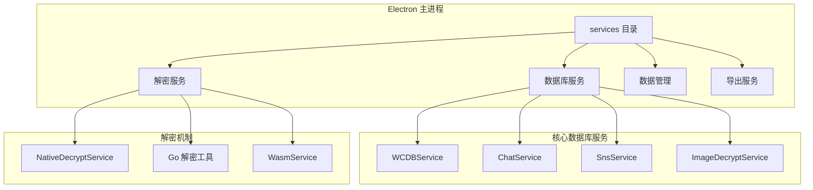

**图表来源**
- [database.ts:1-83](file://electron/services/database.ts#L1-L83)
- [wcdbService.ts:1-390](file://electron/services/wcdbService.ts#L1-L390)
- [chatService.ts:1-800](file://electron/services/chatService.ts#L1-L800)

**章节来源**
- [database.ts:1-83](file://electron/services/database.ts#L1-L83)
- [wcdbService.ts:1-390](file://electron/services/wcdbService.ts#L1-L390)
- [chatService.ts:1-800](file://electron/services/chatService.ts#L1-L800)

## 核心组件

### 数据库连接管理

系统提供了两种数据库连接方式：

1. **传统 SQLite 连接**：使用 better-sqlite3 库连接解密后的数据库
2. **WCDB 集成**：通过原生 DLL 接口直接访问微信数据库

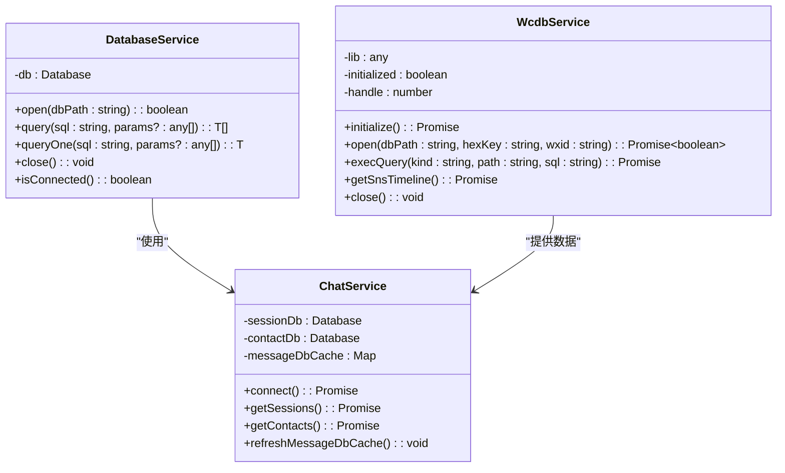

**图表来源**
- [database.ts:5-82](file://electron/services/database.ts#L5-L82)
- [wcdbService.ts:5-390](file://electron/services/wcdbService.ts#L5-L390)
- [chatService.ts:110-383](file://electron/services/chatService.ts#L110-L383)

### 解密服务架构

系统实现了多层次的解密机制，确保不同格式的微信数据库都能被正确处理：

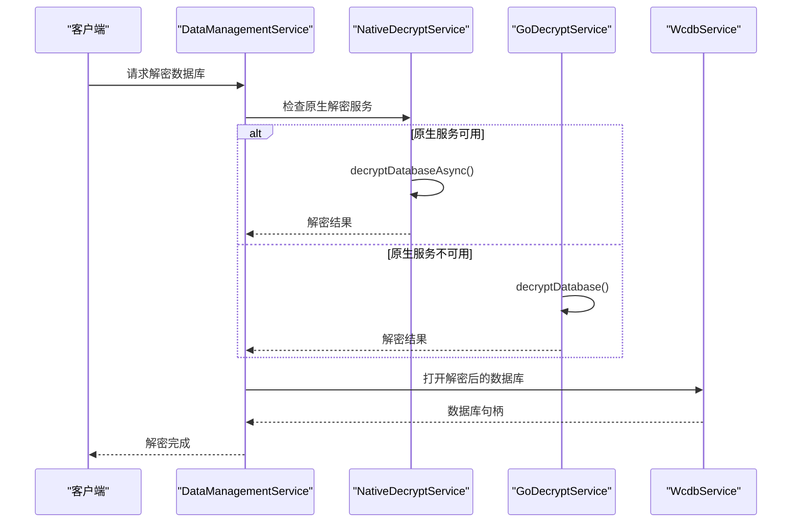

**图表来源**
- [dataManagementService.ts:285-367](file://electron/services/dataManagementService.ts#L285-L367)
- [nativeDecryptService.ts:180-211](file://electron/services/nativeDecryptService.ts#L180-L211)
- [decrypt.ts:22-48](file://electron/services/decrypt.ts#L22-L48)

**章节来源**
- [dataManagementService.ts:285-367](file://electron/services/dataManagementService.ts#L285-L367)
- [nativeDecryptService.ts:1-216](file://electron/services/nativeDecryptService.ts#L1-L216)
- [decrypt.ts:1-109](file://electron/services/decrypt.ts#L1-L109)

## 架构概览

CipherTalk 的整体架构采用了分层设计，确保各组件职责清晰、耦合度低：

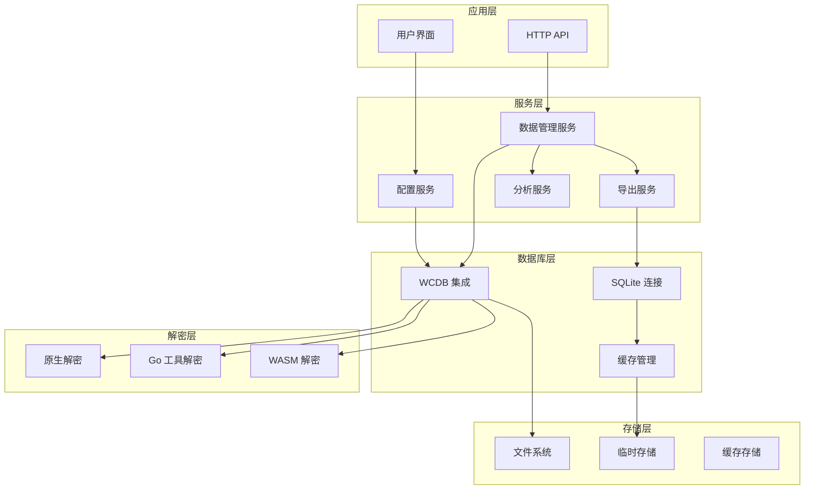

**图表来源**
- [config.ts:126-395](file://electron/services/config.ts#L126-L395)
- [dataManagementService.ts:34-50](file://electron/services/dataManagementService.ts#L34-L50)
- [wcdbService.ts:1-390](file://electron/services/wcdbService.ts#L1-L390)

## 详细组件分析

### WCDB 数据库集成

WCDBService 是系统的核心组件，负责与微信的 WCDB 数据库进行交互：

#### 初始化流程

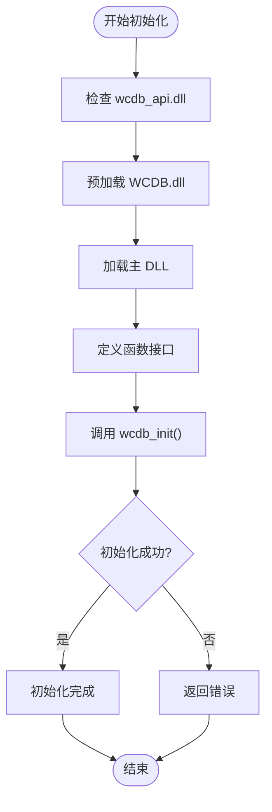

**图表来源**
- [wcdbService.ts:71-148](file://electron/services/wcdbService.ts#L71-L148)

#### 数据库连接管理

WCDBService 实现了完整的连接生命周期管理：

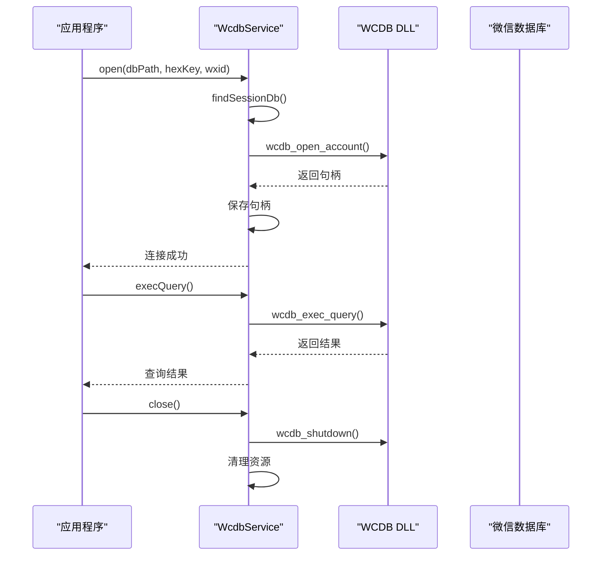

**图表来源**
- [wcdbService.ts:231-298](file://electron/services/wcdbService.ts#L231-L298)
- [wcdbService.ts:347-368](file://electron/services/wcdbService.ts#L347-L368)

**章节来源**
- [wcdbService.ts:1-390](file://electron/services/wcdbService.ts#L1-L390)

### 数据库解密机制

系统提供了三种解密方式，确保不同场景下的需求：

#### 原生 DLL 解密

NativeDecryptService 使用独立的 Worker 线程处理解密任务：

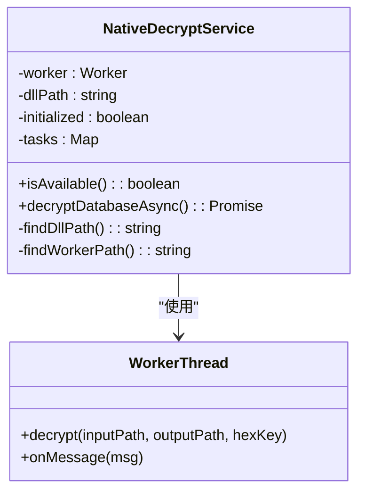

**图表来源**
- [nativeDecryptService.ts:24-216](file://electron/services/nativeDecryptService.ts#L24-L216)

#### Go 工具解密

GoDecryptService 提供了跨平台的解密解决方案：

**章节来源**
- [nativeDecryptService.ts:1-216](file://electron/services/nativeDecryptService.ts#L1-L216)
- [decrypt.ts:1-109](file://electron/services/decrypt.ts#L1-L109)

### 聊天数据查询优化

ChatService 实现了多层缓存机制来优化查询性能：

#### 缓存策略

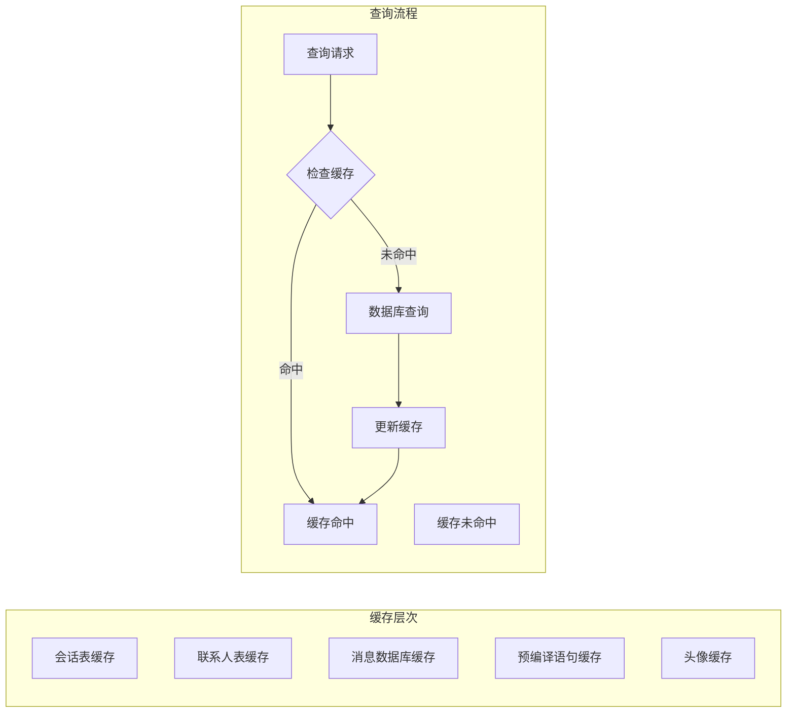

**图表来源**
- [chatService.ts:110-136](file://electron/services/chatService.ts#L110-L136)

#### 索引优化

系统自动为消息表创建必要的索引以提升查询性能：

**章节来源**
- [chatService.ts:780-800](file://electron/services/chatService.ts#L780-L800)

### 数据模型设计

系统定义了完整的数据模型来表示微信聊天数据：

#### 消息模型

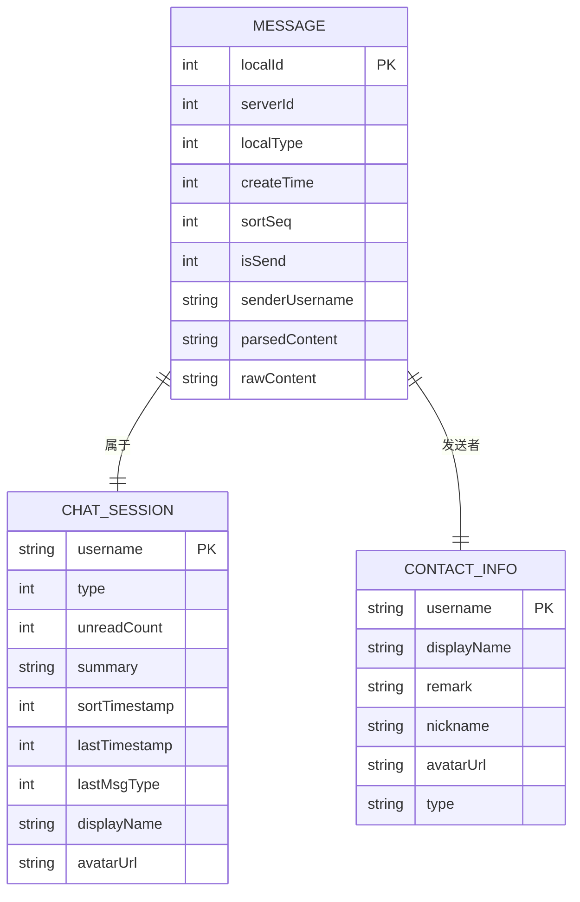

**图表来源**
- [chatService.ts:32-101](file://electron/services/chatService.ts#L32-L101)

**章节来源**
- [chatService.ts:11-101](file://electron/services/chatService.ts#L11-L101)

### 数据导入导出功能

系统提供了多种数据导出格式，满足不同的使用场景：

#### 导出格式支持

| 格式 | 特点 | 适用场景 |
|------|------|----------|
| ChatLab | 结构化 JSON | 数据分析和二次开发 |
| HTML | 美观的网页格式 | 人工审阅和分享 |
| Excel | 表格格式 | 统计分析 |
| JSON | 简单文本格式 | 系统集成 |

#### 导出流程

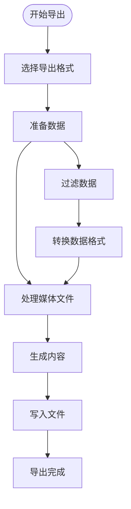

**图表来源**
- [exportService.ts:117-251](file://electron/services/exportService.ts#L117-L251)

**章节来源**
- [exportService.ts:1-800](file://electron/services/exportService.ts#L1-L800)
- [htmlExportGenerator.ts:51-124](file://electron/services/htmlExportGenerator.ts#L51-L124)

## 依赖关系分析

系统采用模块化设计，各组件之间的依赖关系清晰明确：

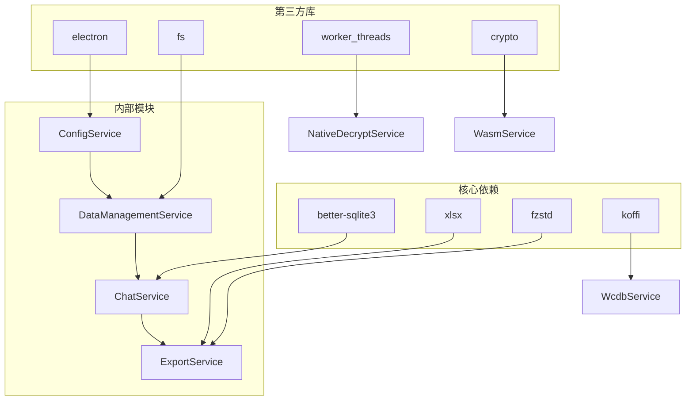

**图表来源**
- [chatService.ts:1-10](file://electron/services/chatService.ts#L1-L10)
- [wcdbService.ts:1-3](file://electron/services/wcdbService.ts#L1-L3)

**章节来源**
- [chatService.ts:1-10](file://electron/services/chatService.ts#L1-L10)
- [wcdbService.ts:1-3](file://electron/services/wcdbService.ts#L1-L3)

## 性能考虑

### 查询性能优化

系统通过以下机制优化查询性能：

1. **多级缓存**：会话表、联系人表、消息数据库、预编译语句等多层缓存
2. **索引管理**：自动为消息表创建必要的索引
3. **连接池**：复用数据库连接，减少连接开销
4. **批量处理**：支持批量解密和批量导出

### 内存管理

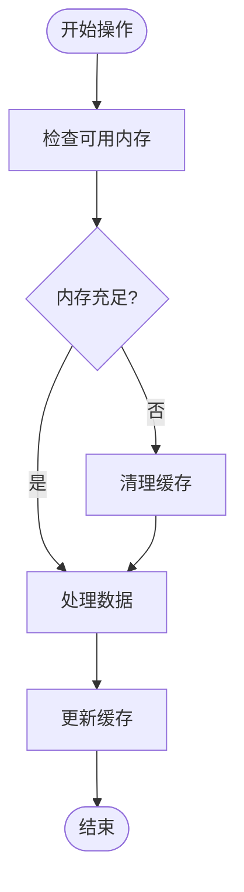

**图表来源**
- [dataManagementService.ts:440-595](file://electron/services/dataManagementService.ts#L440-L595)

### 并发控制

系统使用队列机制控制并发操作，避免资源竞争：

**章节来源**
- [dataManagementService.ts:40-46](file://electron/services/dataManagementService.ts#L40-L46)

## 故障排除指南

### 常见问题及解决方案

#### 数据库连接失败

**症状**：打开数据库时报错
**原因**：DLL 文件缺失或版本不匹配
**解决**：检查 wcdb_api.dll 和 WCDB.dll 是否存在于 resources 目录

#### 解密失败

**症状**：解密过程中出现异常
**原因**：密钥错误或数据库损坏
**解决**：验证解密密钥，检查数据库完整性

#### 查询超时

**症状**：查询响应缓慢
**原因**：缺少必要索引或缓存未生效
**解决**：检查索引创建情况，清理缓存后重试

### 错误处理机制

系统实现了完善的错误处理机制：

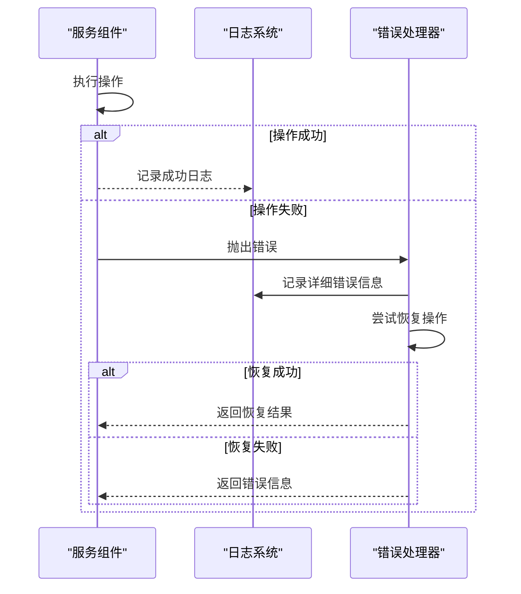

**图表来源**
- [dataManagementService.ts:671-705](file://electron/services/dataManagementService.ts#L671-L705)

**章节来源**
- [dataManagementService.ts:671-705](file://electron/services/dataManagementService.ts#L671-L705)

## 结论

CipherTalk 的数据库服务开发展现了专业的架构设计和实现水平。系统通过模块化的设计、多层次的解密机制、完善的缓存策略和丰富的导出功能，为微信聊天数据的管理和分析提供了完整的解决方案。

关键技术特点包括：

1. **灵活的数据库集成**：支持 WCDB 和传统 SQLite 两种数据库访问方式
2. **多层解密架构**：原生 DLL、Go 工具和 WASM 三种解密方式
3. **高性能查询优化**：多级缓存、索引管理和连接池优化
4. **完整的数据生命周期管理**：从解密到查询再到导出的全流程支持
5. **强大的扩展性**：模块化设计便于功能扩展和维护

该系统为数据库开发者和系统架构师提供了优秀的参考案例，展示了如何在实际项目中平衡性能、稳定性和可扩展性的关系。