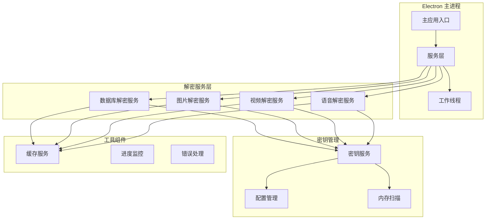
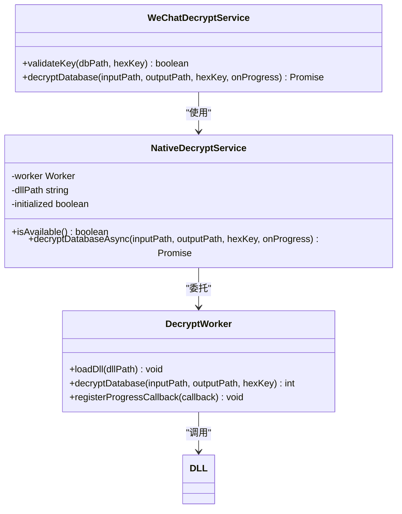
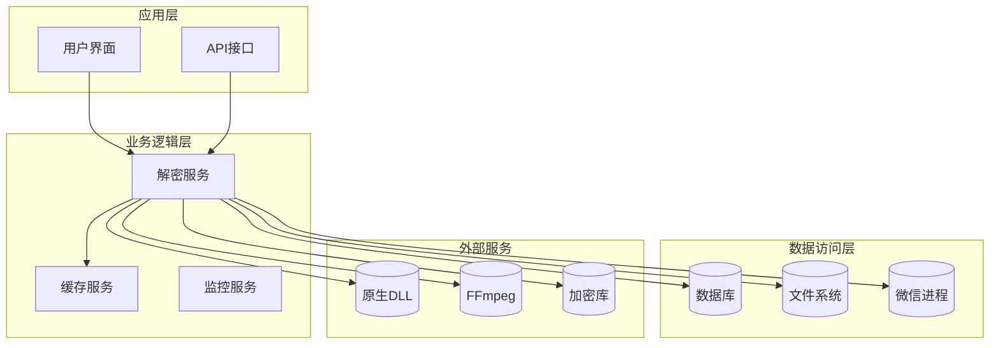
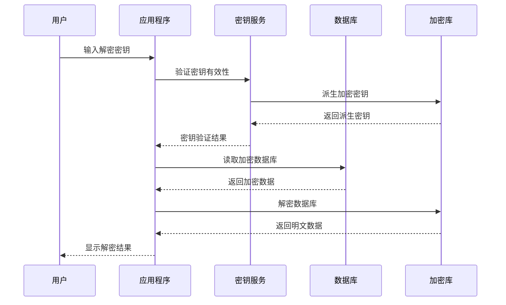
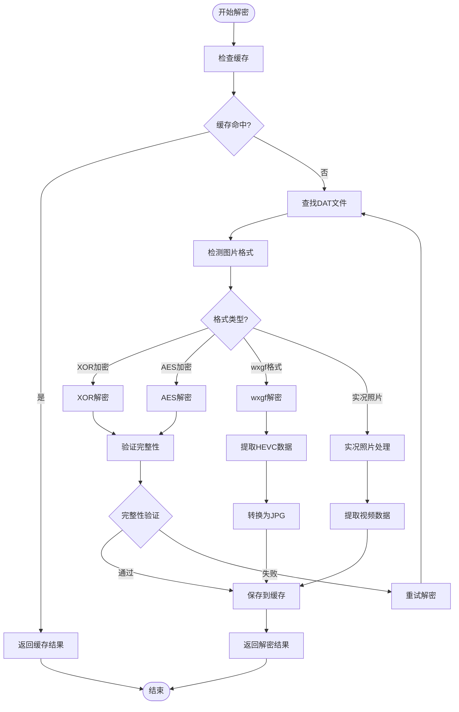
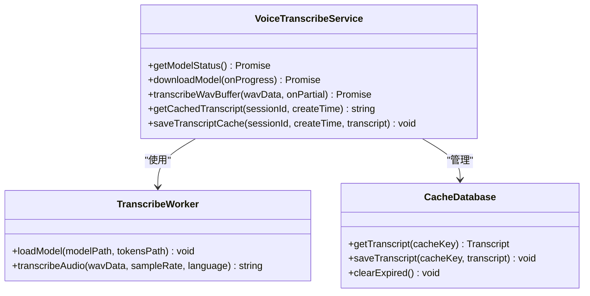
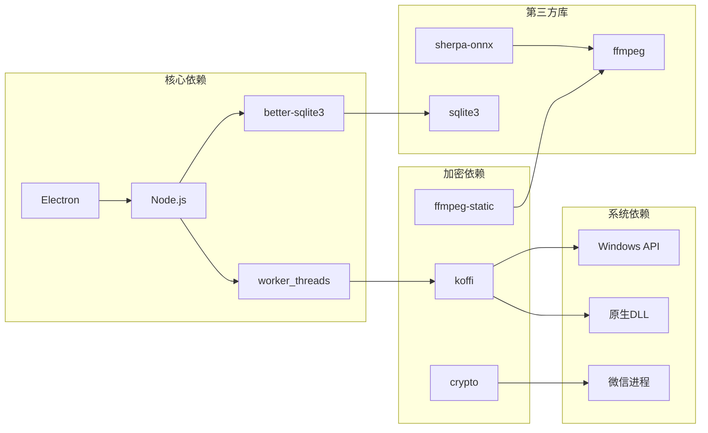
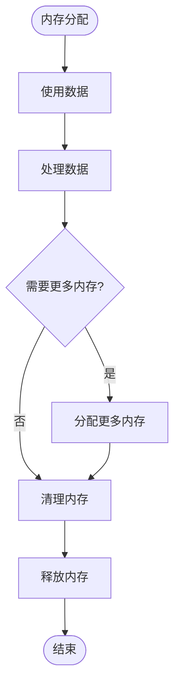

# 数据解密处理

<cite>
**本文档引用的文件**
- [decrypt.ts](file://electron/services/decrypt.ts)
- [decryptService.ts](file://electron/services/decryptService.ts)
- [imageDecryptService.ts](file://electron/services/imageDecryptService.ts)
- [imageKeyService.ts](file://electron/services/imageKeyService.ts)
- [wxKeyService.ts](file://electron/services/wxKeyService.ts)
- [nativeDecryptService.ts](file://electron/services/nativeDecryptService.ts)
- [decryptWorker.js](file://electron/workers/decryptWorker.js)
- [videoService.ts](file://electron/services/videoService.ts)
- [voiceTranscribeService.ts](file://electron/services/voiceTranscribeService.ts)
- [config.ts](file://electron/services/config.ts)
- [isaac64.ts](file://electron/services/isaac64.ts)
- [crypto.ts](file://src/utils/crypto.ts)
</cite>

## 目录
1. [简介](#简介)
2. [项目结构](#项目结构)
3. [核心组件](#核心组件)
4. [架构概览](#架构概览)
5. [详细组件分析](#详细组件分析)
6. [依赖关系分析](#依赖关系分析)
7. [性能考虑](#性能考虑)
8. [故障排除指南](#故障排除指南)
9. [结论](#结论)
10. [附录](#附录)

## 简介

CipherTalk 是一个专注于微信聊天数据解密处理的桌面应用程序。本文档深入分析了项目的解密技术实现，包括微信数据库加密原理、解密服务架构、不同类型数据的解密处理策略，以及性能优化和安全考虑。

该项目采用多层解密架构，支持多种微信版本的数据格式，提供了从数据库解密到多媒体内容解密的完整解决方案。系统设计注重性能、可靠性和安全性，通过异步处理、缓存机制和并行处理来优化用户体验。

## 项目结构

项目采用模块化的架构设计，主要分为以下几个核心模块：

**图表来源**
- [main.ts](file://electron/main.ts)
- [decryptService.ts](file://electron/services/decryptService.ts)
- [imageDecryptService.ts](file://electron/services/imageDecryptService.ts)

**章节来源**
- [main.ts](file://electron/main.ts)
- [config.ts](file://electron/services/config.ts)

## 核心组件

### 数据库解密服务

数据库解密服务是整个系统的核心组件，负责处理微信数据库文件的解密工作。该服务提供了两种解密方式：

1. **原生DLL解密**：通过独立的Worker线程调用原生DLL进行高性能解密
2. **Go工具解密**：使用Go编写的解密工具进行传统解密

**图表来源**
- [decryptService.ts](file://electron/services/decryptService.ts)
- [nativeDecryptService.ts](file://electron/services/nativeDecryptService.ts)
- [decryptWorker.js](file://electron/workers/decryptWorker.js)

### 图片解密服务

图片解密服务专门处理微信图片的解密工作，支持多种图片格式和加密方式：

- **XOR加密图片**：处理早期版本的简单XOR加密图片
- **AES加密图片**：处理现代版本的AES加密图片
- **wxgf格式**：处理微信特有的HEVC编码格式
- **实况照片**：支持微信实况照片的视频提取

**章节来源**
- [imageDecryptService.ts](file://electron/services/imageDecryptService.ts)
- [imageKeyService.ts](file://electron/services/imageKeyService.ts)

## 架构概览

系统采用分层架构设计，确保各组件之间的松耦合和高内聚：

**图表来源**
- [decrypt.ts](file://electron/services/decrypt.ts)
- [wxKeyService.ts](file://electron/services/wxKeyService.ts)
- [videoService.ts](file://electron/services/videoService.ts)

## 详细组件分析

### 微信数据库解密原理

微信数据库采用了多层加密机制：

1. **密钥生成**：基于用户会话和设备信息生成动态密钥
2. **加密算法**：使用AES-256-CBC进行数据加密
3. **密钥派生**：通过PBKDF2算法从用户密码派生加密密钥
4. **完整性校验**：使用HMAC-SHA256确保数据完整性

**图表来源**
- [decryptService.ts](file://electron/services/decryptService.ts)
- [wxKeyService.ts](file://electron/services/wxKeyService.ts)
- [crypto.ts](file://src/utils/crypto.ts)

### 图片解密处理流程

图片解密服务实现了复杂的解密流程，支持多种图片格式：

**图表来源**
- [imageDecryptService.ts](file://electron/services/imageDecryptService.ts)
- [imageKeyService.ts](file://electron/services/imageKeyService.ts)

### 视频解密处理

视频解密服务针对微信视频的特殊加密格式进行了专门处理：

1. **ISAAC-64算法**：使用ISAAC-64伪随机数生成器进行解密
2. **前缀解密**：只对视频文件的前128KB进行解密
3. **格式检测**：自动检测视频格式并进行相应处理

**章节来源**
- [videoService.ts](file://electron/services/videoService.ts)
- [isaac64.ts](file://electron/services/isaac64.ts)

### 语音转写服务

语音转写服务提供了完整的语音识别功能：

**图表来源**
- [voiceTranscribeService.ts](file://electron/services/voiceTranscribeService.ts)

**章节来源**
- [voiceTranscribeService.ts](file://electron/services/voiceTranscribeService.ts)

## 依赖关系分析

系统各组件之间的依赖关系如下：

**图表来源**
- [package.json](file://package.json)
- [wxKeyService.ts](file://electron/services/wxKeyService.ts)
- [imageKeyService.ts](file://electron/services/imageKeyService.ts)

**章节来源**
- [package.json](file://package.json)

## 性能考虑

### 并行处理优化

系统通过多种方式实现并行处理以提升性能：

1. **Worker线程分离**：数据库解密在独立的Worker线程中执行
2. **批量解密**：支持同时解密多个数据库文件
3. **异步I/O**：使用Promise和async/await实现非阻塞操作

### 缓存机制

系统实现了多层次的缓存机制：

1. **内存缓存**：快速访问最近使用的解密结果
2. **文件缓存**：持久化存储解密后的文件
3. **数据库缓存**：缓存解密状态和元数据

### 内存管理

**章节来源**
- [imageDecryptService.ts](file://electron/services/imageDecryptService.ts)
- [nativeDecryptService.ts](file://electron/services/nativeDecryptService.ts)

## 故障排除指南

### 常见解密错误及解决方案

| 错误类型 | 可能原因 | 解决方案 |
|---------|---------|---------|
| 密钥无效 | 密钥格式错误或过期 | 重新获取密钥或检查密钥格式 |
| 文件损坏 | 数据库文件损坏或不完整 | 检查文件完整性或重新备份 |
| 权限不足 | 缺少文件访问权限 | 以管理员身份运行或调整权限 |
| 内存不足 | 系统内存不足导致解密失败 | 关闭其他程序释放内存 |

### 错误处理机制

系统实现了完善的错误处理机制：

1. **异常捕获**：所有异步操作都包含try-catch块
2. **错误日志**：详细的错误日志记录便于调试
3. **重试机制**：关键操作支持自动重试
4. **降级处理**：在部分功能失效时提供替代方案

**章节来源**
- [imageDecryptService.ts](file://electron/services/imageDecryptService.ts)
- [videoService.ts](file://electron/services/videoService.ts)

## 结论

CipherTalk项目展现了现代桌面应用在数据解密领域的技术实力。通过精心设计的多层架构、高效的并行处理机制和完善的错误处理体系，系统能够稳定地处理各种复杂的微信数据解密需求。

项目的主要优势包括：

1. **技术先进性**：采用最新的加密技术和解密算法
2. **性能优化**：通过多种优化手段确保高效运行
3. **用户体验**：提供直观易用的界面和流畅的操作体验
4. **安全性**：严格的安全措施保护用户数据

未来可以进一步优化的方向包括：

1. **算法优化**：持续改进解密算法的效率
2. **功能扩展**：支持更多类型的微信数据格式
3. **性能提升**：进一步优化内存使用和处理速度
4. **安全性增强**：加强密钥管理和数据保护

## 附录

### 安全最佳实践

1. **密钥存储**：使用操作系统提供的安全存储机制
2. **内存清理**：及时清理敏感数据，防止内存泄漏
3. **权限控制**：最小权限原则，避免过度授权
4. **审计日志**：记录所有敏感操作便于追踪

### 性能基准测试

系统支持以下性能指标监控：

- 解密速度（MB/s）
- 内存使用量
- CPU占用率
- 并发处理能力

### 技术规格

| 组件 | 支持格式 | 性能特性 | 安全特性 |
|------|---------|---------|---------|
| 数据库解密 | SQLite, WCDB | 高速解密, 并行处理 | AES-256加密 |
| 图片解密 | JPG, PNG, GIF, BMP | 智能缓存, 格式转换 | 完整性校验 |
| 视频解密 | MP4, HEVC | 前缀解密, 实况照片 | ISAAC-64算法 |
| 语音转写 | WAV, FLAC | 模型缓存, 实时转写 | 本地处理 |