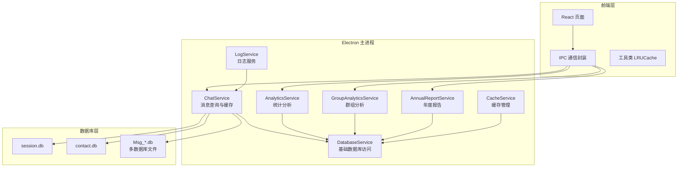
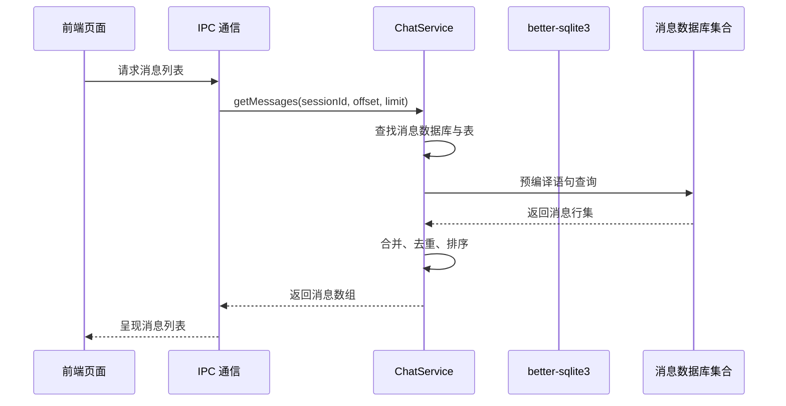
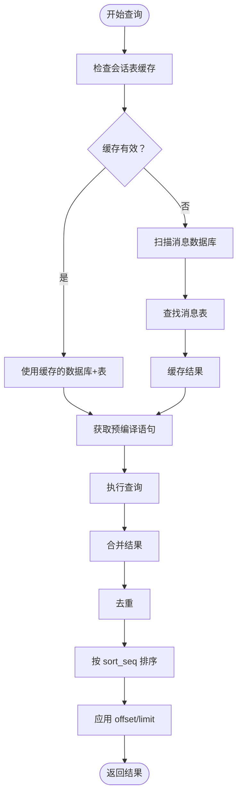
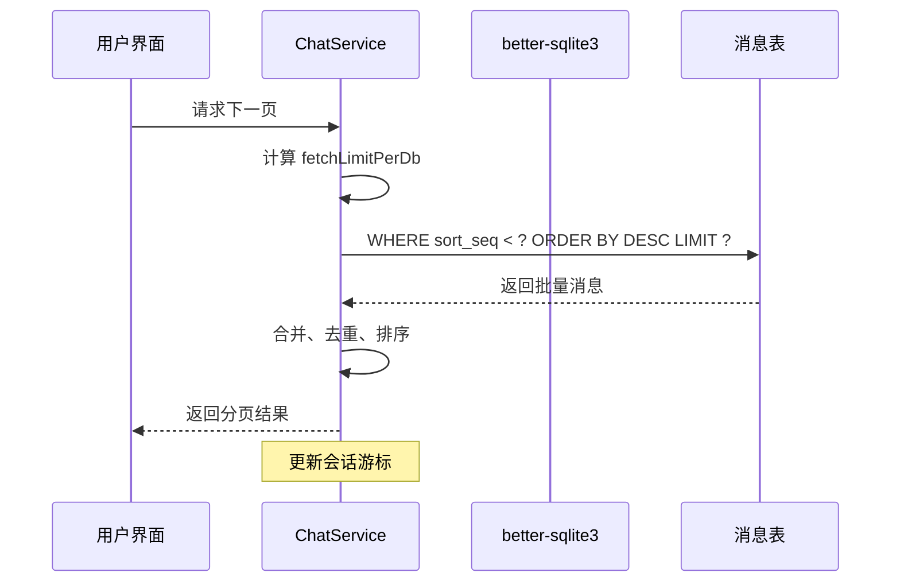
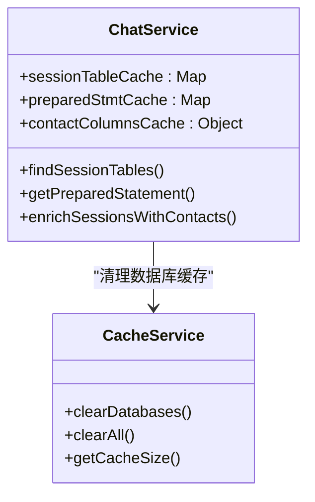
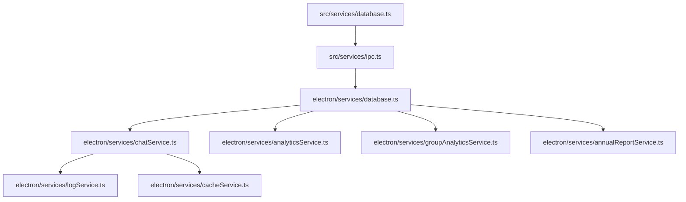

# 查询优化策略

<cite>
**本文档引用的文件**
- [database.ts](file://electron/services/database.ts)
- [database.ts](file://src/services/database.ts)
- [chatService.ts](file://electron/Services/chatService.ts)
- [cacheService.ts](file://electron/services/cacheService.ts)
- [lruCache.ts](file://src/utils/lruCache.ts)
- [ipc.ts](file://src/services/ipc.ts)
- [logService.ts](file://electron/services/logService.ts)
- [analyticsService.ts](file://electron/services/analyticsService.ts)
- [groupAnalyticsService.ts](file://electron/services/groupAnalyticsService.ts)
- [annualReportService.ts](file://electron/services/annualReportService.ts)
</cite>

## 目录
1. [简介](#简介)
2. [项目结构](#项目结构)
3. [核心组件](#核心组件)
4. [架构概览](#架构概览)
5. [详细组件分析](#详细组件分析)
6. [依赖关系分析](#依赖关系分析)
7. [性能考虑](#性能考虑)
8. [故障排除指南](#故障排除指南)
9. [结论](#结论)
10. [附录](#附录)

## 简介

本文件针对 CipherTalk 项目中的数据库查询优化进行全面的技术文档整理。项目基于 Electron + better-sqlite3 实现微信聊天数据的解密、存储与查询，涉及多数据库文件、消息分表、缓存机制、并发处理等多个方面。本文将从查询性能优化策略、大数据量处理、查询缓存机制、复杂查询优化、并发查询处理、性能监控与诊断等方面进行深入分析，并提供最佳实践和调优指南。

## 项目结构

项目采用前后端分离的架构，前端通过 IPC 与 Electron 主进程通信，主进程负责数据库连接、查询执行与缓存管理。

**图表来源**
- [chatService.ts](file://electron/services/chatService.ts)
- [analyticsService.ts](file://electron/services/analyticsService.ts)
- [groupAnalyticsService.ts](file://electron/services/groupAnalyticsService.ts)
- [annualReportService.ts](file://electron/services/annualReportService.ts)
- [cacheService.ts](file://electron/services/cacheService.ts)
- [logService.ts](file://electron/services/logService.ts)
- [database.ts](file://electron/services/database.ts)

**章节来源**
- [chatService.ts](file://electron/services/chatService.ts)
- [database.ts](file://electron/services/database.ts)

## 核心组件

### 数据库服务层
- **DatabaseService（Electron）**：提供基础的数据库连接、查询执行、单条查询、连接状态管理。使用只读模式打开数据库，确保安全性。
- **数据库查询封装（前端）**：通过 IPC 调用主进程的数据库服务，提供统一的查询接口。

### 消息查询与缓存层
- **ChatService**：核心业务服务，负责会话、联系人、消息的查询与缓存管理。实现多数据库文件扫描、消息表查找、预编译语句缓存、游标增量查询等。
- **LRUCache（前端工具）**：轻量级 LRU 缓存，用于前端内存控制，防止内存泄漏。

### 分析与报告层
- **AnalyticsService**：提供消息统计、时间分布、联系人排行等功能。
- **GroupAnalyticsService**：群组维度的消息类型统计。
- **AnnualReportService**：年度报告生成，包含社交活跃度、回复速度等指标。

### 缓存与日志层
- **CacheService**：数据库缓存清理、图片/表情包缓存管理、缓存大小统计。
- **LogService**：日志分级、轮转、清理，便于性能问题定位。

**章节来源**
- [database.ts](file://electron/services/database.ts)
- [database.ts](file://src/services/database.ts)
- [chatService.ts](file://electron/services/chatService.ts)
- [lruCache.ts](file://src/utils/lruCache.ts)
- [analyticsService.ts](file://electron/services/analyticsService.ts)
- [groupAnalyticsService.ts](file://electron/services/groupAnalyticsService.ts)
- [annualReportService.ts](file://electron/services/annualReportService.ts)
- [cacheService.ts](file://electron/services/cacheService.ts)
- [logService.ts](file://electron/services/logService.ts)

## 架构概览

**图表来源**
- [chatService.ts](file://electron/services/chatService.ts)
- [ipc.ts](file://src/services/ipc.ts)

**章节来源**
- [chatService.ts](file://electron/services/chatService.ts)
- [ipc.ts](file://src/services/ipc.ts)

## 详细组件分析

### 数据库查询优化策略

#### SQL 语句优化
- **预编译语句缓存**：ChatService 对常用 SQL 进行预编译并缓存，减少 SQL 解析开销。
- **条件查询优化**：根据是否存在 Name2Id 表和当前用户 rowid 动态选择 SQL 结构，避免不必要的 JOIN。
- **游标驱动分页**：使用 sort_seq/create_time/local_id 三元组作为游标，保证分页一致性与稳定性。

**图表来源**
- [chatService.ts](file://electron/services/chatService.ts)

**章节来源**
- [chatService.ts](file://electron/services/chatService.ts)

#### 索引设计原则
- **自动索引创建**：首次打开消息数据库时，为 Msg_* 表创建 sort_seq 索引，提升排序与范围查询性能。
- **索引命名规范**：统一使用 idx_Msg_..._sort_seq 命名，便于维护与识别。
- **只读数据库兼容**：在索引创建失败时优雅降级，避免影响只读场景。

**章节来源**
- [chatService.ts](file://electron/services/chatService.ts)

#### 查询计划分析
- **表结构探测**：通过 sqlite_master 查询表与索引信息，动态判断查询路径。
- **列存在性检测**：对可选列（如 big_head_url、small_head_url）进行存在性检查，避免无效查询。
- **游标边界处理**：使用三元组游标确保跨数据库查询的一致性，避免重复或遗漏。

**章节来源**
- [chatService.ts](file://electron/services/chatService.ts)

### 大数据量处理

#### 分页查询
- **游标驱动分页**：使用 sort_seq/create_time/local_id 三元组作为游标，支持跨数据库的稳定分页。
- **批量预取**：每库预取 offset+limit+1 条记录，减少多次往返查询。
- **增量游标管理**：记录每个会话的最大 sort_seq，用于增量推送与后续分页。

**图表来源**
- [chatService.ts](file://electron/services/chatService.ts)

**章节来源**
- [chatService.ts](file://electron/services/chatService.ts)

#### 批量处理
- **批量消息解析**：在单次查询中批量解析消息内容、表情、图片、语音等字段，减少循环开销。
- **批量去重**：使用组合键去重，避免重复消息在多个数据库中出现。

**章节来源**
- [chatService.ts](file://electron/services/chatService.ts)

#### 内存管理
- **LRU 缓存**：前端使用 LRU 缓存限制内存占用，防止长期运行导致内存泄漏。
- **数据库连接池**：主进程维护消息数据库连接缓存，避免频繁打开/关闭带来的性能损耗。

**章节来源**
- [lruCache.ts](file://src/utils/lruCache.ts)
- [chatService.ts](file://electron/services/chatService.ts)

### 查询缓存机制

#### 结果缓存
- **会话表缓存**：60 秒缓存有效期，结合新数据库发现机制，动态扩展缓存范围。
- **预编译语句缓存**：按数据库路径+表名+条件缓存 SQL 预编译结果。
- **列信息缓存**：缓存 contact 表列信息，避免重复 PRAGMA 查询。

**图表来源**
- [chatService.ts](file://electron/services/chatService.ts)
- [cacheService.ts](file://electron/services/cacheService.ts)

**章节来源**
- [chatService.ts](file://electron/services/chatService.ts)
- [cacheService.ts](file://electron/services/cacheService.ts)

#### 缓存失效策略
- **时间驱动失效**：会话表缓存 60 秒过期，强制重新扫描。
- **事件驱动失效**：新增数据库文件时，仅在新数据库中查找并合并到缓存。
- **手动清理**：提供一键清理数据库缓存功能，适用于数据库损坏或需要强制刷新场景。

**章节来源**
- [chatService.ts](file://electron/services/chatService.ts)
- [cacheService.ts](file://electron/services/cacheService.ts)

#### 缓存更新机制
- **增量扫描**：新发现的数据库文件单独扫描，避免全量扫描带来的性能开销。
- **缓存热更新**：在缓存过期后，优先使用新数据库扫描结果，逐步替换旧缓存。

**章节来源**
- [chatService.ts](file://electron/services/chatService.ts)

### 复杂查询优化

#### 多表连接优化
- **条件化 JOIN**：根据是否存在 Name2Id 表动态选择是否进行 JOIN，避免无效连接。
- **sender_username 解析**：通过 real_sender_id 与 Name2Id 表关联获取发送者用户名，减少冗余存储。

**章节来源**
- [chatService.ts](file://electron/services/chatService.ts)

#### 子查询优化
- **游标子表达式**：使用三元组条件表达式替代复杂的子查询，提升可读性与性能。
- **时间范围查询**：结合 create_time 与 sort_seq 进行高效的时间范围筛选。

**章节来源**
- [chatService.ts](file://electron/services/chatService.ts)

#### 聚合查询优化
- **统计查询**：使用 CASE WHEN 进行类型统计，避免多次扫描。
- **时间分布**：利用 strftime 函数进行小时、星期、月份维度的分组统计。

**章节来源**
- [analyticsService.ts](file://electron/services/analyticsService.ts)
- [groupAnalyticsService.ts](file://electron/services/groupAnalyticsService.ts)

### 并发查询处理

#### 读写锁机制
- **只读模式**：数据库默认以只读模式打开，避免并发写入冲突。
- **连接隔离**：每个数据库连接独立管理，避免跨连接的数据竞争。

**章节来源**
- [database.ts](file://electron/services/database.ts)

#### 死锁避免
- **顺序访问**：按固定顺序访问数据库文件，避免循环依赖。
- **超时控制**：合理设置查询超时，避免长时间阻塞。

**章节来源**
- [chatService.ts](file://electron/services/chatService.ts)

#### 查询排队策略
- **增量更新队列**：通过定时器与最小间隔控制，避免频繁的数据库扫描。
- **待处理计数**：在更新进行中增加待处理计数，延迟到满足间隔后再执行。

**章节来源**
- [dataManagementService.ts](file://electron/services/dataManagementService.ts)

### 性能监控与诊断

#### 查询执行时间统计
- **日志分级**：通过 LogService 记录 INFO/WARN/ERROR 级别日志，便于性能分析。
- **日志轮转**：按大小轮转日志文件，避免磁盘占用过大。

**章节来源**
- [logService.ts](file://electron/services/logService.ts)

#### 慢查询分析
- **数据库损坏检测**：捕获 SQLITE_CORRUPT 错误，自动清理缓存并刷新数据库列表。
- **异常降级**：在查询失败时提供降级方案，保证系统可用性。

**章节来源**
- [chatService.ts](file://electron/services/chatService.ts)

#### 性能瓶颈识别
- **缓存命中率**：通过缓存统计与日志分析，识别缓存热点与失效原因。
- **数据库扫描频率**：监控数据库扫描次数与耗时，优化缓存策略。

**章节来源**
- [cacheService.ts](file://electron/services/cacheService.ts)

## 依赖关系分析

**图表来源**
- [database.ts](file://src/services/database.ts)
- [ipc.ts](file://src/services/ipc.ts)
- [database.ts](file://electron/services/database.ts)
- [chatService.ts](file://electron/services/chatService.ts)
- [analyticsService.ts](file://electron/services/analyticsService.ts)
- [groupAnalyticsService.ts](file://electron/services/groupAnalyticsService.ts)
- [annualReportService.ts](file://electron/services/annualReportService.ts)
- [logService.ts](file://electron/services/logService.ts)
- [cacheService.ts](file://electron/services/cacheService.ts)

**章节来源**
- [database.ts](file://src/services/database.ts)
- [ipc.ts](file://src/services/ipc.ts)
- [database.ts](file://electron/services/database.ts)
- [chatService.ts](file://electron/services/chatService.ts)

## 性能考虑

### 查询优化最佳实践
- **使用游标分页**：避免 OFFSET 大数值导致的性能问题。
- **预编译语句**：减少 SQL 解析开销，提升重复查询性能。
- **批量处理**：在单次查询中处理多个消息，减少往返次数。
- **缓存策略**：合理设置缓存有效期，平衡内存占用与性能收益。

### 大数据量处理建议
- **索引优化**：为高频查询字段建立索引，如 sort_seq。
- **分区查询**：按时间范围分区，减少扫描范围。
- **内存控制**：使用 LRU 缓存限制前端内存占用。

### 并发与稳定性
- **只读模式**：默认使用只读模式，避免并发写入冲突。
- **异常处理**：完善错误处理与降级策略，保证系统稳定性。
- **资源清理**：及时关闭数据库连接，避免资源泄露。

## 故障排除指南

### 常见问题与解决方案
- **数据库未找到**：检查缓存路径配置与数据库文件是否存在。
- **查询超时**：检查网络状况与数据库文件大小，考虑增加索引。
- **缓存异常**：使用缓存清理功能，重新初始化缓存。
- **日志过大**：调整日志级别与轮转策略，定期清理旧日志。

**章节来源**
- [cacheService.ts](file://electron/services/cacheService.ts)
- [logService.ts](file://electron/services/logService.ts)

## 结论

CipherTalk 项目在数据库查询优化方面采用了多项成熟策略：游标驱动分页、预编译语句缓存、自动索引创建、多数据库文件扫描与合并、LRU 内存控制等。通过合理的缓存策略与并发控制，系统能够在大数据量场景下保持良好的性能表现。建议在实际部署中结合业务特点进一步优化索引策略与缓存参数，持续监控查询性能并根据日志进行针对性调优。

## 附录

### 关键配置项
- **自动更新数据库**：控制是否自动检测数据库更新
- **自动更新检查间隔**：数据库更新检查的时间间隔
- **自动更新最小间隔**：两次更新之间的最小间隔时间
- **日志级别**：控制日志输出的详细程度

**章节来源**
- [config.ts](file://electron/services/config.ts)