# 聊天数据处理

<cite>
**本文档引用的文件**
- [chatService.ts](file://electron/services/chatService.ts)
- [dataManagementService.ts](file://electron/services/dataManagementService.ts)
- [database.ts](file://electron/services/database.ts)
- [wcdbService.ts](file://electron/services/wcdbService.ts)
- [imageDecryptService.ts](file://electron/services/imageDecryptService.ts)
- [videoService.ts](file://electron/services/videoService.ts)
- [voiceTranscribeService.ts](file://electron/services/voiceTranscribeService.ts)
- [groupAnalyticsService.ts](file://electron/services/groupAnalyticsService.ts)
- [analyticsService.ts](file://electron/services/analyticsService.ts)
- [models.ts](file://src/types/models.ts)
- [database.ts](file://src/services/database.ts)
- [chatStore.ts](file://src/stores/chatStore.ts)
- [AnalyticsPage.tsx](file://src/pages/AnalyticsPage.tsx)
- [nativeDecryptService.ts](file://electron/services/nativeDecryptService.ts)
</cite>

## 目录
1. [简介](#简介)
2. [项目结构](#项目结构)
3. [核心组件](#核心组件)
4. [架构概览](#架构概览)
5. [详细组件分析](#详细组件分析)
6. [依赖关系分析](#依赖关系分析)
7. [性能考虑](#性能考虑)
8. [故障排除指南](#故障排除指南)
9. [结论](#结论)

## 简介

CipherTalk 是一个基于 Electron 的微信聊天数据处理工具，提供了完整的聊天数据解密、解析、分析和可视化功能。该系统能够处理微信数据库中的各种消息类型，包括文本、图片、语音、视频、表情等多种媒体格式，并提供丰富的数据分析功能。

## 项目结构

项目采用模块化架构设计，主要分为以下几个层次：

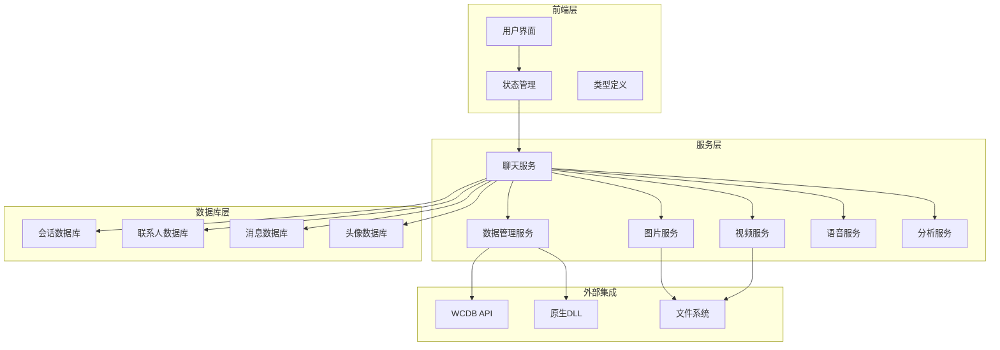

**图表来源**
- [chatService.ts:110-152](file://electron/services/chatService.ts#L110-152)
- [dataManagementService.ts:34-50](file://electron/services/dataManagementService.ts#L34-50)

**章节来源**
- [chatService.ts:110-152](file://electron/services/chatService.ts#L110-152)
- [dataManagementService.ts:34-50](file://electron/services/dataManagementService.ts#L34-50)

## 核心组件

### 数据库连接管理

系统通过统一的数据库连接管理机制，支持多种数据库类型的连接和操作：

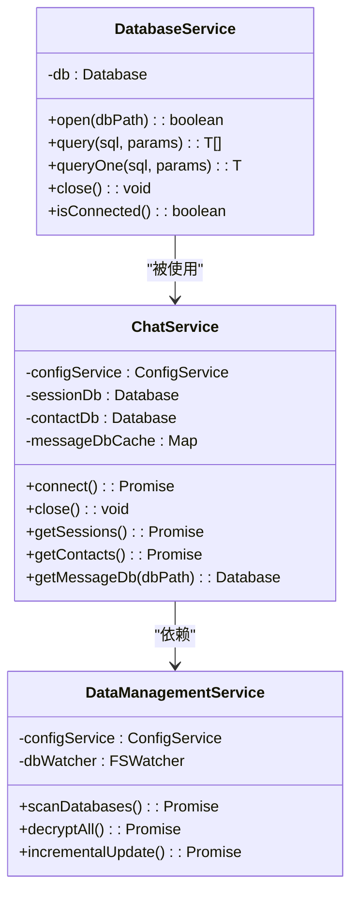

**图表来源**
- [database.ts:5-82](file://electron/services/database.ts#L5-82)
- [chatService.ts:110-152](file://electron/services/chatService.ts#L110-152)
- [dataManagementService.ts:34-50](file://electron/services/dataManagementService.ts#L34-50)

### 消息数据模型

系统定义了完整的消息数据模型，支持各种消息类型的解析和处理：

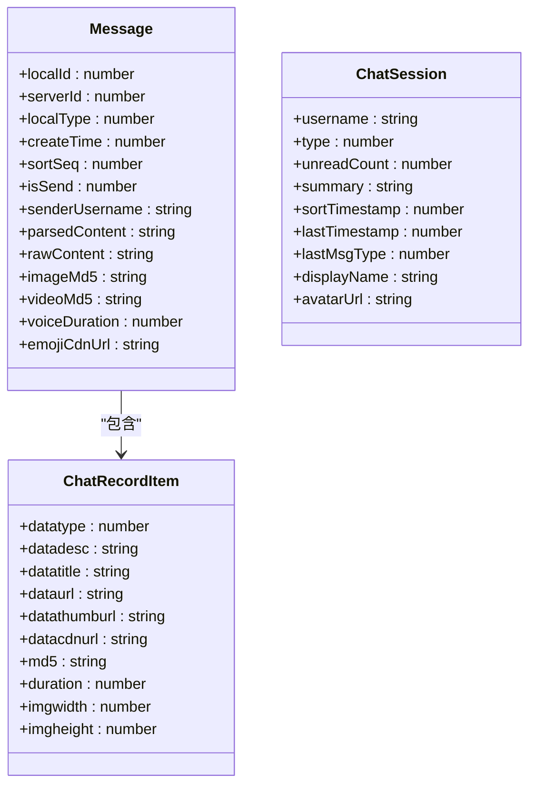

**图表来源**
- [models.ts:36-97](file://src/types/models.ts#L36-97)

**章节来源**
- [database.ts:5-82](file://electron/services/database.ts#L5-82)
- [models.ts:36-97](file://src/types/models.ts#L36-97)

## 架构概览

系统采用分层架构设计，实现了数据解密、解析、存储和展示的完整流程：

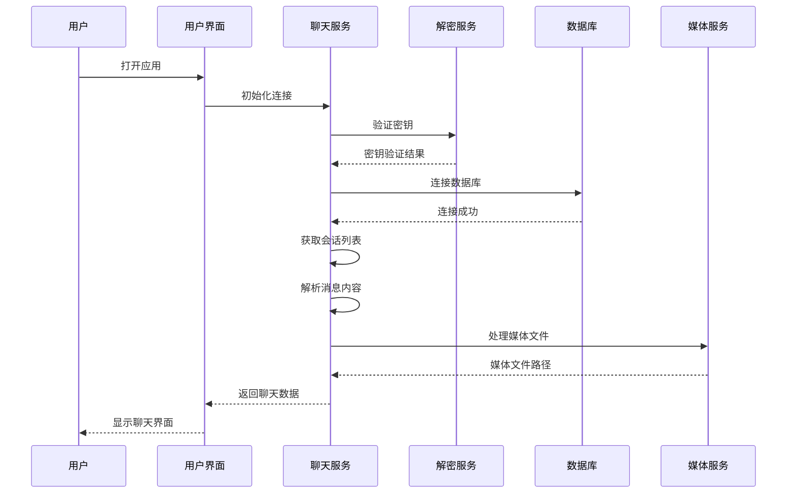

**图表来源**
- [chatService.ts:283-346](file://electron/services/chatService.ts#L283-346)
- [dataManagementService.ts:285-367](file://electron/services/dataManagementService.ts#L285-367)

## 详细组件分析

### 聊天数据解析组件

#### 会话管理

会话管理系统负责处理微信聊天会话的获取、解析和缓存：

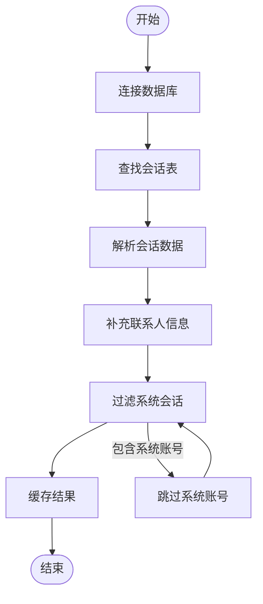

**图表来源**
- [chatService.ts:451-520](file://electron/services/chatService.ts#L451-520)

#### 联系人管理

联系人管理系统支持多种联系人类型的识别和处理：

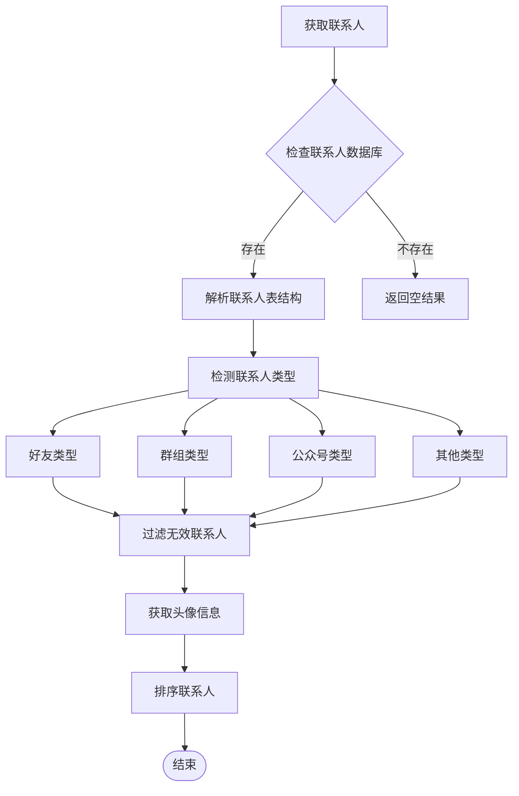

**图表来源**
- [chatService.ts:586-713](file://electron/services/chatService.ts#L586-713)

**章节来源**
- [chatService.ts:451-713](file://electron/services/chatService.ts#L451-713)

### 媒体文件处理组件

#### 图片解密服务

图片解密服务支持多种图片格式和版本的解密处理：

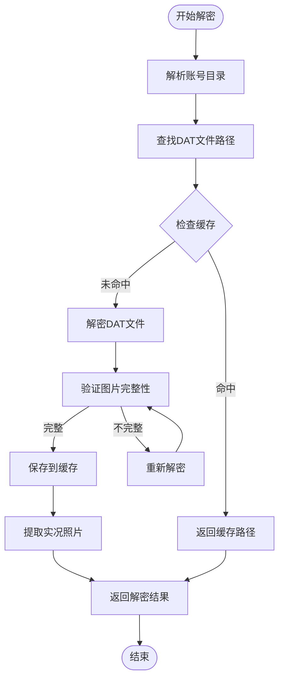

**图表来源**
- [imageDecryptService.ts:160-303](file://electron/services/imageDecryptService.ts#L160-303)

#### 视频处理服务

视频处理服务支持微信视频文件的解析和下载：

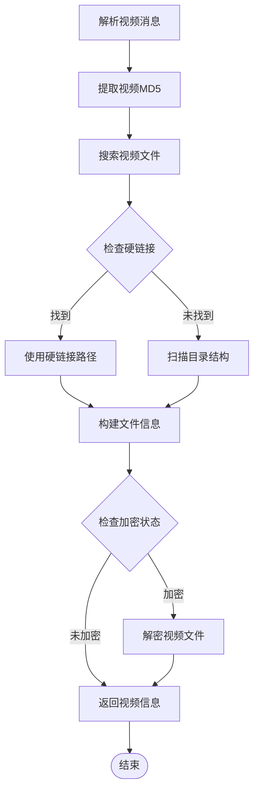

**图表来源**
- [videoService.ts:194-245](file://electron/services/videoService.ts#L194-245)

**章节来源**
- [imageDecryptService.ts:160-303](file://electron/services/imageDecryptService.ts#L160-303)
- [videoService.ts:194-245](file://electron/services/videoService.ts#L194-245)

### 数据分析组件

#### 私聊统计分析

私聊统计分析服务提供全面的消息统计和分析功能：

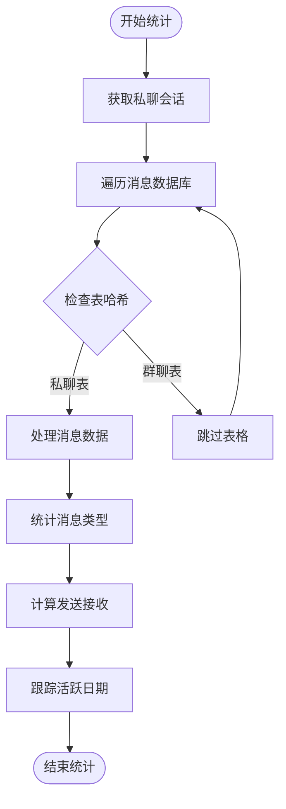

**图表来源**
- [analyticsService.ts:269-450](file://electron/services/analyticsService.ts#L269-450)

#### 群组分析服务

群组分析服务专注于群聊数据的深度分析：

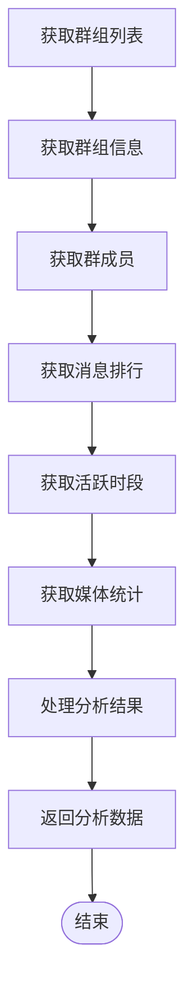

**图表来源**
- [groupAnalyticsService.ts:204-350](file://electron/services/groupAnalyticsService.ts#L204-350)

**章节来源**
- [analyticsService.ts:269-450](file://electron/services/analyticsService.ts#L269-450)
- [groupAnalyticsService.ts:204-350](file://electron/services/groupAnalyticsService.ts#L204-350)

### 数据解密组件

#### 原生解密服务

原生解密服务通过独立的Worker线程实现高性能的数据库解密：

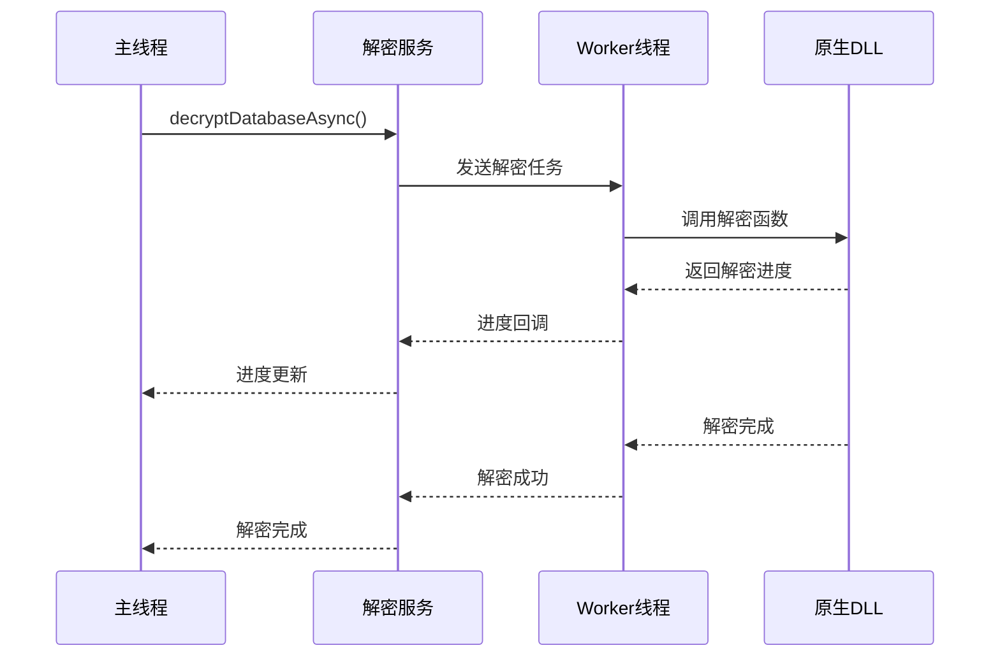

**图表来源**
- [nativeDecryptService.ts:180-211](file://electron/services/nativeDecryptService.ts#L180-211)

**章节来源**
- [nativeDecryptService.ts:180-211](file://electron/services/nativeDecryptService.ts#L180-211)

## 依赖关系分析

系统各组件之间的依赖关系如下：

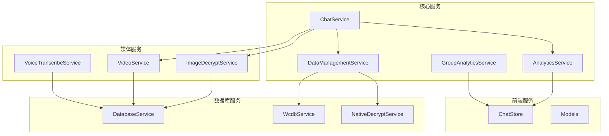

**图表来源**
- [chatService.ts:110-152](file://electron/services/chatService.ts#L110-152)
- [dataManagementService.ts:34-50](file://electron/services/dataManagementService.ts#L34-50)

**章节来源**
- [chatService.ts:110-152](file://electron/services/chatService.ts#L110-152)
- [dataManagementService.ts:34-50](file://electron/services/dataManagementService.ts#L34-50)

## 性能考虑

### 缓存策略

系统采用了多层次的缓存策略来提升性能：

1. **数据库连接缓存**：缓存数据库连接对象，避免频繁连接
2. **查询结果缓存**：缓存会话和联系人查询结果
3. **媒体文件缓存**：缓存解密后的媒体文件路径
4. **预编译语句缓存**：缓存常用SQL语句的预编译结果

### 异步处理

系统大量使用异步处理来避免UI阻塞：

- 数据库操作使用异步API
- 文件I/O操作使用异步方法
- 网络请求使用Promise包装
- Worker线程处理耗时任务

### 内存管理

- 及时关闭数据库连接
- 清理缓存数据
- 监控内存使用情况
- 实现垃圾回收机制

## 故障排除指南

### 常见问题及解决方案

#### 数据库连接失败

**症状**：无法连接到微信数据库
**原因**：
- 数据库路径配置错误
- 密钥不正确
- 数据库文件损坏

**解决方案**：
1. 检查数据库路径配置
2. 验证解密密钥
3. 重新解密数据库文件

#### 媒体文件无法显示

**症状**：图片或视频无法正常显示
**原因**：
- 媒体文件解密失败
- 缓存文件损坏
- 文件格式不支持

**解决方案**：
1. 清理媒体缓存
2. 重新解密媒体文件
3. 检查文件格式支持

#### 性能问题

**症状**：应用响应缓慢
**原因**：
- 缓存未生效
- 数据库查询效率低
- 内存泄漏

**解决方案**：
1. 检查缓存配置
2. 优化数据库查询
3. 监控内存使用

**章节来源**
- [chatService.ts:348-383](file://electron/services/chatService.ts#L348-383)
- [imageDecryptService.ts:254-262](file://electron/services/imageDecryptService.ts#L254-262)

## 结论

CipherTalk 提供了一个完整、高效的微信聊天数据处理解决方案。通过模块化的架构设计、完善的错误处理机制和优化的性能策略，系统能够稳定地处理各种复杂的聊天数据场景。

主要特点包括：

1. **完整的数据处理链路**：从解密到解析再到分析的全流程支持
2. **强大的媒体处理能力**：支持多种媒体格式的解密和处理
3. **丰富的分析功能**：提供多维度的数据统计和可视化
4. **高性能设计**：通过缓存、异步处理和内存优化提升性能
5. **良好的扩展性**：模块化设计便于功能扩展和维护

该系统为微信聊天数据的分析和处理提供了可靠的技术支撑，适用于个人数据备份、企业合规审计、学术研究等多种应用场景。